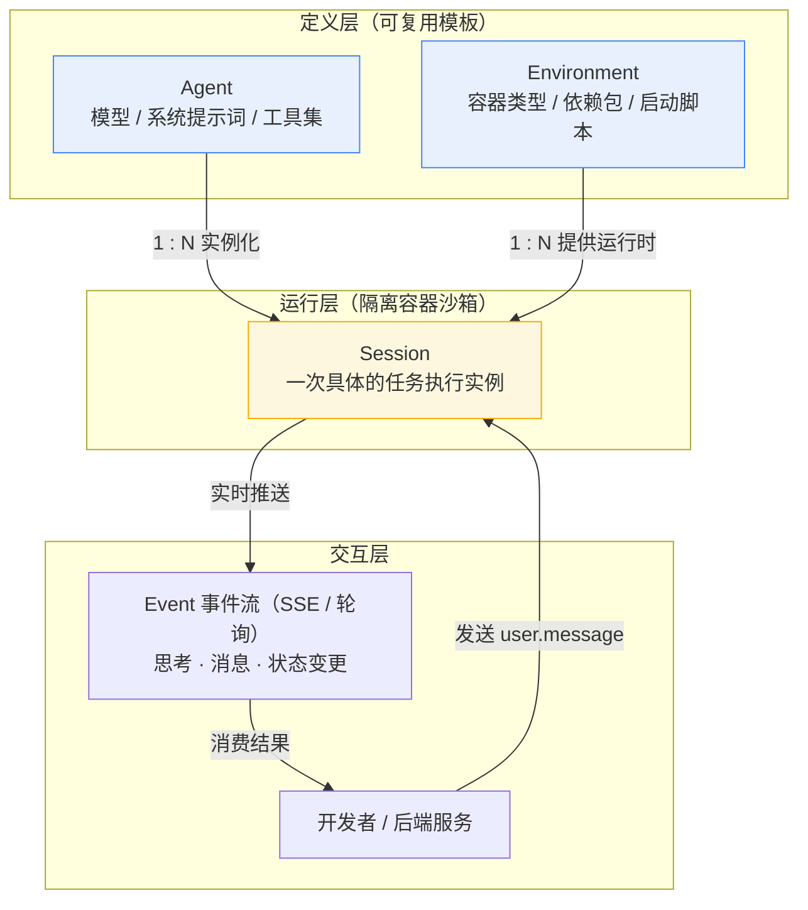
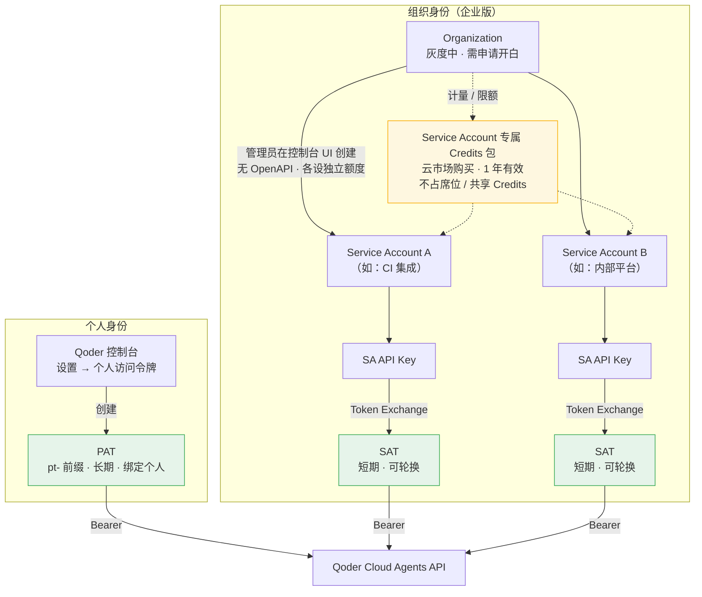
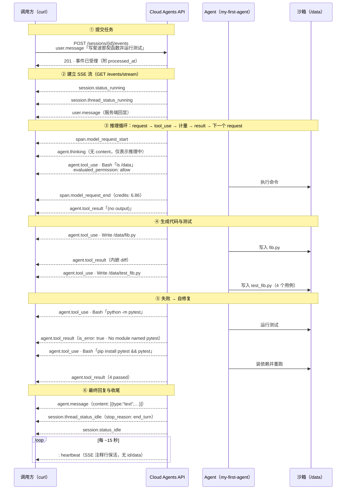
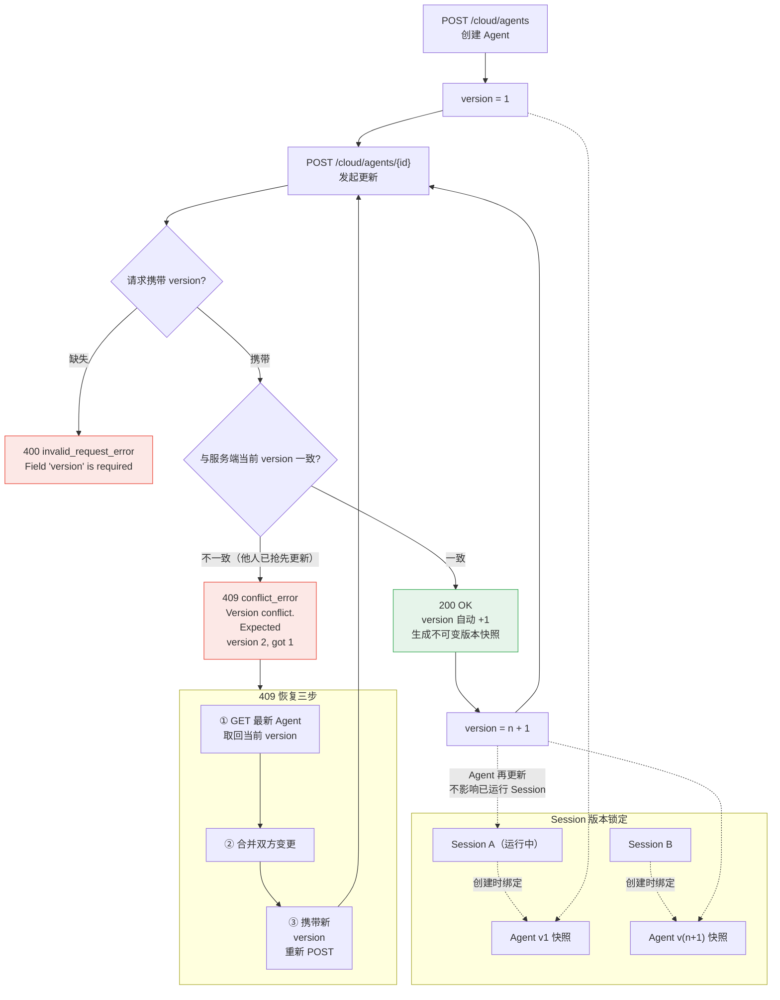
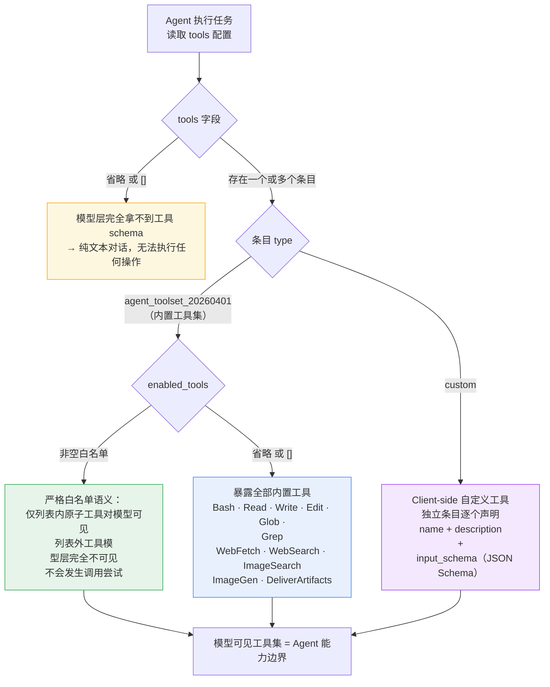
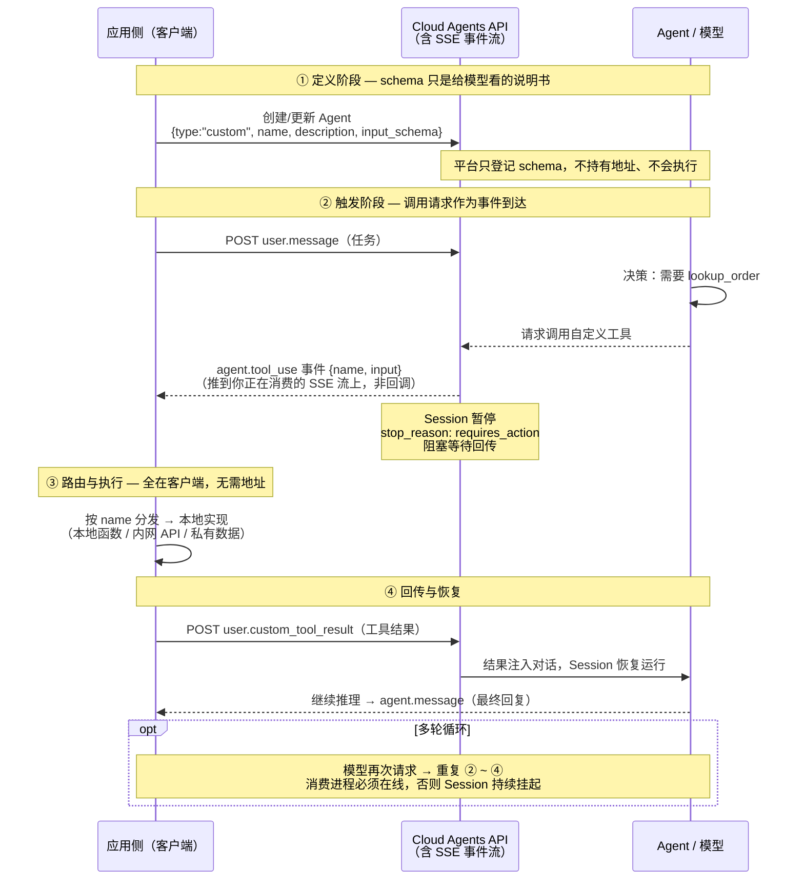
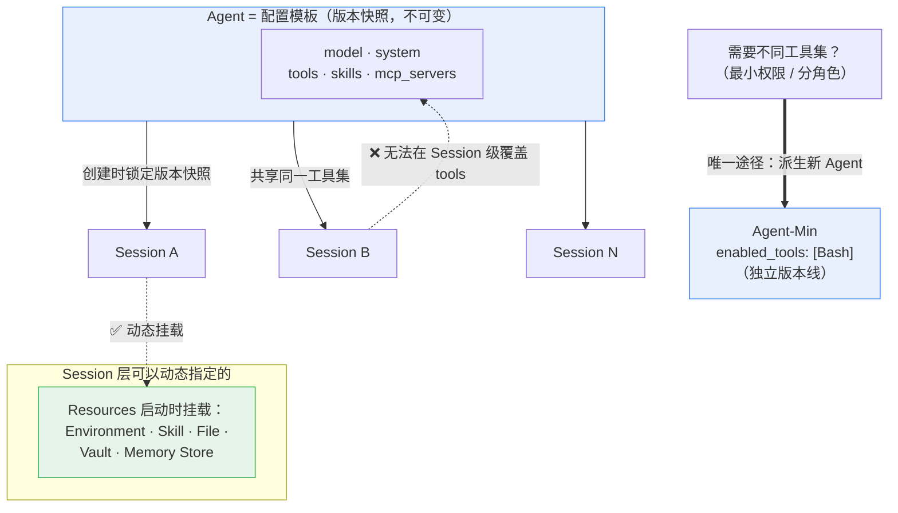

# 概述

1. Qoder Cloud Agents 是一个**全托管**的 AI Agent 运行平台
2. 通过 **API** 定义 **Agent**、启动 **Session**，即可在**云端**运行**复杂任务**并**实时接收结果**
3. 为软件装上**不断进化**的大脑
   - 通过 **API** 将持续进化的 Agent 能力嵌入你的应用
   - 一次接入 - **智能能力**随平台升级**自动成长**，无需修改任何代码
4. 特性
   - 一次调用即生产，**长程执行**，**全程可观测**
   - **10000+** - **秒级**并发实例弹性调度，按需扩缩
   - **26 小时** - 单 Session 最长持续运行时长
   - **1 天** - 从零到生产级 Agent 的交付时间
5. 特点
   - **一次调用，端到端交付**
     - Agent **自主完成**理解、规划、工具调用、代码生成、测试验证的**完整链路**，直接**交付**可用结果
   - **长程执行，断点恢复**
     - Session 基于**事件流持久化**，不绑定**单一进程**
     - 支持**数小时**乃至**数天**的**长时运行任务**：批量审查、跨仓库重构、多轮迭代修复
     - **中断自动恢复**，进度永不丢失
   - **安全可信，全程可观测**
     - 每个 **Agent** 运行在独立 **Sandbox** 中，租户间**零数据渗透**
     - 所有**行为**通过 **SSE** 实时**可观测**
       - 每一步**思考**、每一次**工具调用**、每一个**输出**，精确**可追溯可审计**
   - **接入即进化**
     - 应用只**声明意图**，平台负责**持续优化**
     - **模型能力**升级、**工具生态**扩展、**编排策略**优化，全部对已接入应用**透明生效**
     - 今天接入，明天自动更强

<!-- more -->

# 概览

1. 在**完全托管**的**云沙箱**中运行 **AI Agent**
2. Qoder Cloud Agents 是**全托管**的 AI Agent 运行平台
3. 你无需自建 **agent loop**、管理工具**执行沙箱**或**处理长连接**
   - 只需通过 **API** 定义 **Agent**、启动 **Session**，即可在云端运行**复杂任务**并**实时接收结果**

## 核心概念

| 概念            | 说明                                                         | 类比                 |
| --------------- | ------------------------------------------------------------ | -------------------- |
| **Agent**       | 可复用的**配置模板**，定义**模型**、**系统提示词**、**工具集** | "员工的岗位说明书"   |
| **Environment** | **Session** 运行的**容器环境**，包含**依赖包**和**启动配置** | "办公桌和工具箱"     |
| **Session**     | 一次具体的**对话**/**任务执行**实例                          | "一次具体的工作会话" |
| **Event**       | **Session** 中产生的**实时事件流**                           | "工作进度实时播报"   |



## 工作流程

| 步骤             | 动作                                                         |
| ---------------- | ------------------------------------------------------------ |
| 定义 Agent       | 指定**模型**、**系统提示词**、**可用工具**                   |
| 配置 Environment | 选择**容器类型**、**预装依赖**和**启动脚本**，新账号需先 `POST /api/v1/cloud/environments` 创建环境（**无预置默认环境**） |
| 启动 Session     | 绑定 **Agent** + **Environment**，创建**运行实例**           |
| 发消息 + 收事件  | 向 **Session** 发送 `user.message`，然后通过 **SSE** 流（或轮询）实时接收 Agent 思考、消息、状态变更等**事件** |

## 快速验证连通性

验证 **PAT** 或 **SAT** 是否有效，列出所有 Agent

```json
$ curl -s https://api.qoder.com/api/v1/cloud/agents \
  -H "Authorization: Bearer $QODER_ACCESS_TOKEN" | jq
{
  "data": [
    {
      "archived_at": null,
      "created_at": "2026-07-08T14:54:51.965091Z",
      "description": "",
      "id": "agent_00ip1igu4a1348hi88vk",
      "mcp_servers": [],
      "metadata": {},
      "model": "ultimate",
      "multiagent": null,
      "name": "my-first-agent",
      "skills": [],
      "system": "你是一个高效的编程助手，擅长代码编写和问题排查。",
      "tools": [
        {
          "enabled_tools": [
            "Bash",
            "Read",
            "Write",
            "Edit",
            "Glob",
            "Grep",
            "WebFetch",
            "WebSearch"
          ],
          "type": "agent_toolset_20260401"
        }
      ],
      "type": "agent",
      "updated_at": "2026-07-08T14:54:51.965091Z",
      "version": 1
    }
  ],
  "first_id": "agent_00ip1igu4a1348hi88vk",
  "has_more": false,
  "last_id": "agent_00ip1igu4a1348hi88vk",
  "next_page": null
}
```

## 适用场景

| 场景               | 描述                                             |
| ------------------ | ------------------------------------------------ |
| **长时间异步任务** | 代码审查、**大规模重构**、自动化测试生成         |
| **API 集成**       | 在后端服务中嵌入 Agent 能力，无需维护**运行时**  |
| **批量处理**       | **并行**启动多个 **Session** 处理批量请求        |
| **定时任务**       | 结合调度系统，周期性运行 Agent 完成**巡检**/报告 |

## 认证方式

所有 API 请求需要携带以下 **Header**：

| Header          | 值                    | 说明                                             |
| --------------- | --------------------- | ------------------------------------------------ |
| `Authorization` | `Bearer <PAT 或 SAT>` | 个人访问令牌（**PAT**）或服务账号令牌（**SAT**） |

1. 个人用户可在 Qoder 控制台「设置 → **个人访问令牌**」中创建 **PAT**
2. **Service Account** 需先创建 **SA API Key**，再通过 **Service Token Exchange** 接口置换**短期 SAT**
   - 该功能目前处于**灰度阶段**，需联系阿里**申请开白**后才能使用
   - **没有对应 OpenAPI**：Service Account 的创建与额度管理只能在**控制台 UI** 上由组织管理员完成（「组织设置 → Service Accounts」页面）
   - 目前仅支持**云市场兑换码**创建的组织，官网直购组织暂不支持
   - SAT 的置换接口（Service Token Exchange）未在公开文档中给出路径



## 分页机制

列表接口统一使用**游标**分页，响应结构：

```json
{
  "data": [...],
  "first_id": "agent_019e451902fe7a2ca42c2dfc62d9320e",
  "last_id": "agent_019e45369b3379e18bfaf59b3aad2fc9",
  "has_more": true
}
```

使用 `after_id` / `before_id` 查询参数翻页

## 常见问题

> Q: Cloud Agents 和 Qoder CLI 可以同时使用吗？

A: 完全可以。**CLI** 适合**本地**交互开发，**Cloud Agents** 适合**自动化**和**集成**场景，两者互补。

> Q: 一个 Agent 可以同时运行多少个 Session？

A: **没有硬性限制**，同一个 Agent 配置可以**同时关联多个**活跃 Session。

> Q: 数据安全如何保障？

A: 每个 **Session** 运行在**隔离的容器沙箱**中，Session 之间**无法互相访问**。环境销毁后**数据清除**。

# 使用指引

一分钟内选对你该用的那一种模式 - 面向新用户的入门概览

## 关于 Qoder Cloud Agents

1. Qoder Cloud Agents - **Agent as a Service**
2. 让企业不必再自建一整套 **Agent 基础设施**：从 Agent 的**构建**、**部署**、**运行**，到 **API** 被**集成**、**IM 渠道触达**、**身份隔离**，全部由 Qoder **全托管**交付
3. 我们把"**研发一个 Agent**"到"**真正上线服务终端用户**"的距离，从数周压到**几小时**，让每一家企业都能快速拥有属于自己的 AI Agent 产品
4. 对外 **API** 分为 **Forward Mode** 和 **Managed Mode**。两种模式分别提供**资源管理接口**，不再设置独立的 **Resources** 层

## Forward Mode

1. **更低门槛**把 Agent 落地到业务场景
2. 基于"**企业 / 模板 / 用户**"三级**配置体系**，由管理员预设好 **Agent 形态**与**可用资源**，调用方拿来即用
3. 同时自带 IM 渠道接入、定时任务、终端用户身份等业务必需的**周边生态**

## Managed Mode

1. 提供**全托管**的 Agent **定义**与**运行**能力的**原子模式**
2. 无需自建 agent loop、工具执行沙箱，只需通过 **API** 定义 Agent、启动 Session，并在 Session 启动时**动态挂载**所需的沙箱环境、Skill、文件等**资源**，即可在云端运行复杂任务并实时接收结果
3. Managed Mode 同时承载组织级 **Environment**、**Skill**、**Vault**、**File**、**Memory Store** 和 **Model** 等**资源管理接口**

## Forward Mode vs Managed Mode 对比

| 维度            | Forward Mode                                                 | Managed Mode                                                 |
| --------------- | ------------------------------------------------------------ | ------------------------------------------------------------ |
| 定位            | 在 **Managed Mode** 之上**封装**三级配置体系与 IM / 定时 / 身份等**业务能力**，帮助业务方把 Agent **快速**、稳定地交付到终端用户 | 提供**全托管**的 Agent 定义与运行能力，开放**原子化**的运行时接口 |
| 适合谁          | **SaaS** 产品方、业务集成方、面向 C 端或大量调用方的团队     | 研发能力强、希望**自主掌控** Agent 形态、**自建上层业务体系**的开发者 / 企业 |
| 配置模式        | **企业 / 模板 / 用户**三级配置体系，**管理员预设**，调用方只传 `template_id` + `identity_id` | 调用方在 **Session 启动**时**显式指定** environment / Skill / 文件 |
| 调用方复杂度    | 较低 - 由 Forward Mode 承载业务复杂度                        | 高 - **灵活度高**，每次调用需自行决定挂载内容                |
| 终端用户身份    | 内建 Identity，**每个 C 端用户一个身份**，**记忆**与**权限**自动隔离 | **不内建**，需调用方自行管理隔离                             |
| IM 渠道接入     | 内建飞书 / 钉钉 / 微信 / 企微，扫码绑定                      | 自行实现                                                     |
| 定时 / 触发执行 | 内建 Schedules，cron / 一次性，配置即生效                    | 通过 Managed Mode 的 **Deployments** 自行编排                |

1. 如果你的目标是将 Agent 能力**快速交付**给**终端用户**或**业务系统**，推荐从 Forward Mode 开始
2. 如果你需要**完全掌控** Agent 的**运行时**行为并**自建上层产品逻辑**，请使用 Managed Mode
3. 请使用所选模式下对应的**资源接口**；Forward 与 Managed 的资源接口**相互独立**

# 快速入门

1. 5 步跑通你的第一个 Qoder Cloud Agent：获取令牌、选择环境、创建 Agent、创建 Session、收发消息
2. 全程只需 **curl**，无需安装任何 SDK

## 前置条件

1. 一个 Qoder 账号
2. 终端环境（macOS / Linux / WSL）
3. `curl` 和 `jq`（可选，用于格式化 JSON）

## 第 1 步：获取 PAT

1. 登录 [Qoder 控制台](https://qoder.com/)
2. 进入「设置 → 个人访问令牌」
3. 点击「创建令牌」，设置名称和有效期
4. 复制令牌并设置环境变量：

```
export QODER_PAT="your-personal-access-token"
```

## 第 2 步：选择环境

查询可用环境列表，获取环境 ID：

```json
$ curl -s https://api.qoder.com/api/v1/cloud/environments \
  -H "Authorization: Bearer $QODER_PAT" | jq
{
  "data": [
    {
      "archived_at": null,
      "config": {
        "networking": {
          "allow_mcp_servers": false,
          "allow_package_managers": false,
          "allowed_hosts": [],
          "type": "unrestricted"
        },
        "packages": {
          "apt": [],
          "cargo": [],
          "gem": [],
          "go": [],
          "npm": [],
          "pip": [],
          "type": "packages"
        },
        "type": "cloud"
      },
      "created_at": "2026-07-08T14:50:54.00546Z",
      "description": "",
      "id": "env_00ip15qbjrklc5x1nidw",
      "metadata": {},
      "name": "default",
      "type": "environment",
      "updated_at": "2026-07-08T14:50:54.00546Z"
    }
  ],
  "first_id": "env_00ip15qbjrklc5x1nidw",
  "has_more": false,
  "last_id": "env_00ip15qbjrklc5x1nidw",
  "next_page": null
}
```

提取环境 ID（建议用 jq 自动提取，避免手动复制长 ID）

```
$ ENV_ID=$(curl -s https://api.qoder.com/api/v1/cloud/environments \
  -H "Authorization: Bearer $QODER_PAT" | jq -r '.data[0].id')
$ echo "环境 ID: $ENV_ID"
环境 ID: env_00ip15qbjrklc5x1nidw


```

## 第 3 步：创建 Agent

定义一个具备 shell 工具的通用 Agent：

```json
$ AGENT_RESPONSE=$(curl -s -X POST https://api.qoder.com/api/v1/cloud/agents \
  -H "Authorization: Bearer $QODER_PAT" \
  -H "Content-Type: application/json" \
  -d '{
    "name": "my-first-agent",
    "model": "ultimate",
    "system": "你是一个高效的编程助手，擅长代码编写和问题排查。",
    "tools": [
      {
        "type": "agent_toolset_20260401",
        "enabled_tools": ["Bash", "Read", "Write", "Edit", "Glob", "Grep", "WebFetch", "WebSearch"]
      }
    ]
  }')

$ echo "$AGENT_RESPONSE" | jq .
{
  "archived_at": null,
  "created_at": "2026-08-18T06:59:27.901341Z",
  "description": "",
  "id": "agent_00mq5shsrzo5c5gjk0dx",
  "mcp_servers": [],
  "metadata": {},
  "model": "ultimate",
  "multiagent": null,
  "name": "my-first-agent",
  "skills": [],
  "system": "你是一个高效的编程助手，擅长代码编写和问题排查。",
  "tools": [
    {
      "enabled_tools": [
        "Bash",
        "Read",
        "Write",
        "Edit",
        "Glob",
        "Grep",
        "WebFetch",
        "WebSearch"
      ],
      "type": "agent_toolset_20260401"
    }
  ],
  "type": "agent",
  "updated_at": "2026-08-18T06:59:27.901341Z",
  "version": 1
}

$ AGENT_ID=$(echo "$AGENT_RESPONSE" | jq -r '.id')

$ echo "Agent ID: $AGENT_ID"
Agent ID: agent_00mq5shsrzo5c5gjk0dx
```

## 第 4 步：创建 Session

创建 **Session** 需要两个必填参数：`agent`（**Agent ID** 或对象）和 `environment_id`（**Environment ID**）

将 Agent 绑定到环境，创建运行实例：

```json
$ SESSION_RESPONSE=$(curl -s -X POST https://api.qoder.com/api/v1/cloud/sessions \
  -H "Authorization: Bearer $QODER_PAT" \
  -H "Content-Type: application/json" \
  -d "{
    \"agent\": \"$AGENT_ID\",
    \"environment_id\": \"$ENV_ID\"
  }")
  
$ echo "$SESSION_RESPONSE" | jq .
{
  "agent": {
    "description": "",
    "id": "agent_00mq5shsrzo5c5gjk0dx",
    "mcp_servers": [],
    "model": {
      "effective_context_window": 200000,
      "id": "ultimate"
    },
    "multiagent": null,
    "name": "my-first-agent",
    "skills": [],
    "system": "你是一个高效的编程助手，擅长代码编写和问题排查。",
    "tools": [
      {
        "enabled_tools": [
          "Bash",
          "Read",
          "Write",
          "Edit",
          "Glob",
          "Grep",
          "WebFetch",
          "WebSearch"
        ],
        "type": "agent_toolset_20260401"
      }
    ],
    "type": "agent",
    "version": 1
  },
  "archived_at": null,
  "created_at": "2026-08-18T07:02:25.514309Z",
  "deployment_id": null,
  "environment_id": "env_00ip15qbjrklc5x1nidw",
  "environment_variables": {},
  "id": "sess_00mq61zzi8pa8f3inbt9",
  "metadata": {},
  "outcome_evaluations": [],
  "resources": [],
  "stats": {
    "active_seconds": 0,
    "duration_seconds": 0.006766458
  },
  "status": "idle",
  "title": null,
  "type": "session",
  "updated_at": "2026-08-18T07:02:25.514309Z",
  "usage": {
    "total_credits": 0
  },
  "vault_ids": []
}

$ SESSION_ID=$(echo "$SESSION_RESPONSE" | jq -r '.id')

$ echo "Session ID: $SESSION_ID"
Session ID: sess_00mq61zzi8pa8f3inbt9
```

Session 创建后处于 `idle` 状态，需要在下一步发送消息后 Agent 才会开始执行

## 第 5 步：发消息 + 收事件

向 Session 发送**用户消息**，然后通过 **SSE** 流实时接收 Agent 响应，发送消息（注意：**请求体**需要用 **events 数组**包裹）

```json
$ curl -s -X POST "https://api.qoder.com/api/v1/cloud/sessions/$SESSION_ID/events" \
  -H "Authorization: Bearer $QODER_PAT" \
  -H "Content-Type: application/json" \
  -d '{
    "events": [
      {
        "type": "user.message",
        "content": [{"type": "text", "text": "用 Python 写一个计算斐波那契数列的函数，并运行测试。"}]
      }
    ]
  }' | jq .
{
  "data": [
    {
      "content": [
        {
          "text": "用 Python 写一个计算斐波那契数列的函数，并运行测试。",
          "type": "text"
        }
      ],
      "id": "evt_00mq6dmsdd9ttuedwdaj",
      "processed_at": "2026-08-18T07:06:02.842985264Z",
      "type": "user.message"
    }
  ]
}
```

通过 **SSE** 流**实时接收事件**

```json
$ curl -s -N "https://api.qoder.com/api/v1/cloud/sessions/$SESSION_ID/events/stream" \
  -H "Authorization: Bearer $QODER_PAT"
id: evt_00mq6dmsxcgld000gdwh
event: session.status_running
data: {"id":"evt_00mq6dmsxcgld000gdwh","processed_at":"2026-08-18T07:06:02.842985264Z","type":"session.status_running"}

id: evt_00mq6dmsxcglegigx0ew
event: session.thread_status_running
data: {"agent_name":"my-first-agent","id":"evt_00mq6dmsxcglegigx0ew","processed_at":"2026-08-18T07:06:02.842985264Z","session_thread_id":"sthr_00mq62018o5xc3gyhgjh","type":"session.thread_status_running"}

id: evt_00mq6dmsdd9ttuedwdaj
event: user.message
data: {"content":[{"text":"用 Python 写一个计算斐波那契数列的函数，并运行测试。","type":"text"}],"id":"evt_00mq6dmsdd9ttuedwdaj","processed_at":"2026-08-18T07:06:02.842985264Z","type":"user.message"}

id: evt_00mq6dmsxcglct62nmqo
event: span.model_request_start
data: {"id":"evt_00mq6dmsxcglct62nmqo","processed_at":"2026-08-18T07:06:02.850057165Z","type":"span.model_request_start"}

id: evt_00mq6dmtetr0hnmopfeq
event: agent.thinking
data: {"id":"evt_00mq6dmtetr0hnmopfeq","processed_at":"2026-08-18T07:06:05.628933Z","type":"agent.thinking"}

....

: heartbeat

: heartbeat
```

1. 除 `heartbeat` 外，每条事件都有 `id:` 行，JSON 负载包含 `id`、`type` 和 `processed_at` 字段
2. `heartbeat` 事件约每 **15 秒**发送一次，用于**保持连接活跃**
3. `agent.message` 的 `content` 字段使用 `[{"type":"text","text":"..."}]` 数组格式
4. `session.status_running` / `session.status_idle` 除 `id`、`type`、`processed_at`（idle 还有 `stop_reason`）外不携带其他字段
5. `agent.thinking` 表示**模型正在推理**，不包含 `content` 或 `text` 字段



## 常见问题

> Q: 提示 401 Unauthorized 怎么办？

A: 检查 $QODER_PAT 是否已正确设置，令牌是否过期。重新创建令牌并更新环境变量。

> Q: 创建 Agent 返回 400 Bad Request？

A: 检查请求体 JSON 格式是否正确，model 字段是否为有效值（如 "ultimate"），tools 是否为数组。

> Q: Session 一直处于 idle 状态，收不到事件？

A: Session 创建后默认为 **idle**，必须向其发送 **user.message** 事件才会触发 Agent 执行。请确认第 5 步已正确执行。

> Q: SSE 流连接中断了怎么办？

A: Stream endpoint 支持 `Last-Event-ID` header 进行**断线重连**。重连时在请求头中传入上次收到的事件 ID，流将从该事件之后开始**重放**。如需查询**历史事件**，请使用 `GET /api/v1/cloud/sessions/{id}/events?order=desc`。

> Q: GET /api/v1/cloud/environments 返回空数组？

A: 新账号可能没有预置环境，请参照第 2 步中的提示手动创建一个。

# 定义 Agent

1. 创建**可复用**、**可版本化**的 **Agent 配置**
2. Agent 是 Qoder Cloud Agents 的**核心配置模板**，描述了 AI 代理的**能力边界** - 模型、行为指令、可用工具
3. **一个 Agent** 可被**多个 Session** 复用；修改 Agent **不影响已运行的 Session**

## 核心要素

> 可以把 Agent 理解为一份"岗位说明书"：

| 要素           | 含义                       |
| -------------- | -------------------------- |
| **模型**       | Agent 的**智力水平**       |
| **系统提示词** | Agent 的**行为准则**       |
| **工具集**     | Agent **能执行的操作**     |
| **Skills**     | Agent 可调用的**高级技能** |

1. Agent 本身不执行任务，它只是**配置**
2. 真正执行任务的是绑定该 Agent 的 **Session**

## 字段参考

| 字段          | 类型         | 必填 | 说明                                              |
| ------------- | ------------ | ---- | ------------------------------------------------- |
| `id`          | string       | —    | 系统生成，`agent_` 前缀 + 32 字符十六进制（小写） |
| `type`        | string       | —    | 固定为 `"agent"`                                  |
| `name`        | string       | 是   | Agent 名称，建议用英文短横线命名（≤ 64 字符）     |
| `description` | string       | 否   | 描述信息，默认 `""`                               |
| `model`       | string       | 是   | 模型标识，详见下文                                |
| `system`      | string       | 否   | 系统提示词，默认 `""`                             |
| `tools`       | array        | 否   | 可用工具列表，详见下文                            |
| `skills`      | array        | 否   | 关联的 Skill ID 列表                              |
| `mcp_servers` | array        | 否   | MCP 服务器配置列表，默认 `[]`                     |
| `multiagent`  | object\|null | 否   | Agents 配置；未设置时返回 `null`                  |
| `metadata`    | object       | 否   | 自定义键值对，用于标记和筛选                      |
| `version`     | integer      | —    | 版本号，从 1 开始递增                             |
| `archived_at` | string\|null | —    | 归档时间（ISO 8601），未归档时为 `null`           |
| `created_at`  | string       | —    | 创建时间，ISO 8601 格式                           |
| `updated_at`  | string       | —    | 最后更新时间                                      |

### model

1. `model` 指定 Agent 使用的模型
2. 可先调用 [列出模型](https://docs.qoder.com/zh/cloud-agents/api/models/list) 查询**当前账户**可用值，再在创建或更新 Agent 时传入模型 `id`

### tools

1. `tools` 是**工具对象数组**
2. **内置工具**通过 `agent_toolset_20260401` 配置，并使用 `enabled_tools` 数组**按需开启**原子工具：

```json
{
  "tools": [
    {
      "type": "agent_toolset_20260401",
      "enabled_tools": ["Bash", "Read", "Write", "Edit", "Glob", "Grep", "WebFetch", "WebSearch"]
    }
  ]
}
```

可用的 `enabled_tools` 值：

| 工具名             | 说明                                            |
| ------------------ | ----------------------------------------------- |
| `Bash`             | 执行 shell 命令                                 |
| `Read`             | 读取文件内容                                    |
| `Write`            | **创建**或**覆盖**文件                          |
| `Edit`             | **局部编辑**文件                                |
| `Glob`             | 通配符列文件                                    |
| `Grep`             | 文件内容搜索                                    |
| `WebFetch`         | HTTP GET **单页面**                             |
| `WebSearch`        | 联网搜索                                        |
| `ImageSearch`      | 搜索图片                                        |
| `ImageGen`         | 根据文本描述生成图片                            |
| `DeliverArtifacts` | 将 Agent 在 `/data/` 下产出的文件**投递给用户** |

**自定义** client-side 工具与权限策略参见 [Agent 工具配置](https://docs.qoder.com/zh/cloud-agents/tools)

## 管理 Agent

完整的 **CRUD** 接口请参考 [API Reference / Agents](https://docs.qoder.com/zh/cloud-agents/api/agents/create)。下面是常用工作流示例。

### 创建

```json
$ curl -s -X POST https://api.qoder.com/api/v1/cloud/agents \
  -H "Authorization: Bearer $QODER_PAT" \
  -H "Content-Type: application/json" \
  -d '{
    "name": "code-reviewer",
    "model": "ultimate",
    "system": "你是代码审查专家。逐行审查代码并以 Markdown 输出问题与改进建议。",
    "tools": [
      {
        "type": "agent_toolset_20260401",
        "enabled_tools": ["Bash", "Read", "Write"]
      }
    ],
    "metadata": {
      "team": "backend",
      "purpose": "code-review"
    }
  }' | jq .
{
  "archived_at": null,
  "created_at": "2026-08-18T07:42:41.030223Z",
  "description": "",
  "id": "agent_00mq9nac55urkt7hwq0h",
  "mcp_servers": [],
  "metadata": {
    "purpose": "code-review",
    "team": "backend"
  },
  "model": "ultimate",
  "multiagent": null,
  "name": "code-reviewer",
  "skills": [],
  "system": "你是代码审查专家。逐行审查代码并以 Markdown 输出问题与改进建议。",
  "tools": [
    {
      "enabled_tools": [
        "Bash",
        "Read",
        "Write"
      ],
      "type": "agent_toolset_20260401"
    }
  ],
  "type": "agent",
  "updated_at": "2026-08-18T07:42:41.030223Z",
  "version": 1
}
```

成功返回 **200 OK**，`version` 从 `1` 开始

### 查询

获取单个 Agent

```json
$ curl -s https://api.qoder.com/api/v1/cloud/agents/agent_00mq9nac55urkt7hwq0h \
  -H "Authorization: Bearer $QODER_PAT" | jq
{
  "archived_at": null,
  "created_at": "2026-08-18T07:42:41.030223Z",
  "description": "",
  "id": "agent_00mq9nac55urkt7hwq0h",
  "mcp_servers": [],
  "metadata": {
    "purpose": "code-review",
    "team": "backend"
  },
  "model": "ultimate",
  "multiagent": null,
  "name": "code-reviewer",
  "skills": [],
  "system": "你是代码审查专家。逐行审查代码并以 Markdown 输出问题与改进建议。",
  "tools": [
    {
      "enabled_tools": [
        "Bash",
        "Read",
        "Write"
      ],
      "type": "agent_toolset_20260401"
    }
  ],
  "type": "agent",
  "updated_at": "2026-08-18T07:42:41.030223Z",
  "version": 1
}
```

分页列表

```json
$ curl -s "https://api.qoder.com/api/v1/cloud/agents?limit=1" \
  -H "Authorization: Bearer $QODER_PAT" | jq
{
  "data": [
    {
      "archived_at": null,
      "created_at": "2026-08-18T07:42:41.030223Z",
      "description": "",
      "id": "agent_00mq9nac55urkt7hwq0h",
      "mcp_servers": [],
      "metadata": {
        "purpose": "code-review",
        "team": "backend"
      },
      "model": "ultimate",
      "multiagent": null,
      "name": "code-reviewer",
      "skills": [],
      "system": "你是代码审查专家。逐行审查代码并以 Markdown 输出问题与改进建议。",
      "tools": [
        {
          "enabled_tools": [
            "Bash",
            "Read",
            "Write"
          ],
          "type": "agent_toolset_20260401"
        }
      ],
      "type": "agent",
      "updated_at": "2026-08-18T07:42:41.030223Z",
      "version": 1
    }
  ],
  "first_id": "agent_00mq9nac55urkt7hwq0h",
  "has_more": true,
  "last_id": "agent_00mq9nac55urkt7hwq0h",
  "next_page": "agent_00mq9nac55urkt7hwq0h"
}
```

### 更新

更新 Agent **必须**携带当前 `version`，详见下文「版本管理」。

```json
curl -s -X POST https://api.qoder.com/api/v1/cloud/agents/agent_00mq9nac55urkt7hwq0h \
  -H "Authorization: Bearer $QODER_PAT" \
  -H "Content-Type: application/json" \
  -d '{
    "name": "code-reviewer",
    "model": "ultimate",
    "system": "你是资深代码审查专家，专注安全漏洞和性能问题。",
    "version": 1
  }' | jq .
{
  "archived_at": null,
  "created_at": "2026-08-18T07:42:41.030223Z",
  "description": "",
  "id": "agent_00mq9nac55urkt7hwq0h",
  "mcp_servers": [],
  "metadata": {
    "purpose": "code-review",
    "team": "backend"
  },
  "model": "ultimate",
  "multiagent": null,
  "name": "code-reviewer",
  "skills": [],
  "system": "你是资深代码审查专家，专注安全漏洞和性能问题。",
  "tools": [
    {
      "enabled_tools": [
        "Bash",
        "Read",
        "Write"
      ],
      "type": "agent_toolset_20260401"
    }
  ],
  "type": "agent",
  "updated_at": "2026-08-18T07:46:55.503899Z",
  "version": 2
}
```

成功返回 **200 OK**，`version` 自动 +1

## 版本管理

Agent 采用**乐观**并发控制（OCC）机制：

1. 创建时 `version` 从 `1` 开始
2. 每次成功更新，`version` 自动 +1
3. 更新请求**必须**携带当前 `version`。两种失败情形：
   - 缺少 `version` 字段 — 返回 **400** `invalid_request_error`（`"Field 'version' is required."`）
   - `version` 存在但与服务端不一致 — 返回 **409** `conflict_error`

这避免了多人 / 多系统并发修改时互相覆盖。



### 处理 409 冲突

当持有的版本已**过期**时：

```json
{
  "type": "error",
  "request_id": "cb80235f-76a2-4ff3-9e28-5aa2da12dc14",
  "error": {
    "type": "conflict_error",
    "message": "Version conflict. Expected version 2, got 1."
  }
}
```

恢复步骤：

1. `GET` **最新 Agent** 拿到当前 `version`
2. **合并**自己的**变更**
3. 用新 `version` 重新 `POST`

## 最佳实践

| 最佳实践           | 描述                                                         |
| ------------------ | ------------------------------------------------------------ |
| **命名规范**       | 用 `团队-用途` 格式，如 `backend-code-review`、`frontend-test-gen` |
| **提示词精炼**     | `system` 字段写清角色、输出格式、限制条件                    |
| **最小工具集**     | 只配置任务所需的工具，减少误操作风险                         |
| **善用 metadata**  | 用标签分类管理，方便后续筛选和审计                           |
| **生产环境锁版本** | 创建 Session 时用 `{"id": ..., "version": ...}` 形式**锁定 Agent 版本**，避免**新版本**影响线上行为 |

## 常见问题

> Q：更新 Agent 后，正在运行的 Session 会受影响吗？

不会。**Session** 在**创建**时绑定了 **Agent 的特定版本**，后续修改**不影响已存在的 Session**。

> Q：tools 数组为空可以吗？

可以。不带工具的 Agent 只能进行**纯文本对话**，无法执行任何操作。

> Q：name 字段有长度限制吗？

建议控制在 **64 字符以内**，使用小写字母、数字和短横线。

> Q：如何回滚到旧版本的 Agent？

目前**不支持自动回滚**。建议在更新前记录旧配置，需要时手动 `POST` 回旧配置（携带最新 `version`）。

# Agent 工具配置

1. 为 Agent 配备**内置**、**MCP** 和**自定义工具**
2. 工具决定了 Agent **能做什么**
   - 通过在创建或更新 **Agent** 时配置 `tools` 字段，你可以精确控制 Agent 的**能力边界**

## 工具的作用

1. Agent 在**执行任务**时，会根据 `tools` 配置判断可以调用哪些能力
   - **内置工具**通过 `{ "type": "agent_toolset_20260401", "enabled_tools": [...] }` 配置，**按需**开启 `enabled_tools` 数组中的**原子工具**
   - **Client-side 自定义工具**使用独立的 `{ "type": "custom", ... }` 条目配置
2. `enabled_tools` 为**非空白名单**时，列表外的工具**模型层完全不可**见，不会发生调用尝试
   - `enabled_tools` **省略**或为**空数组**时，**所有内置工具**都会**暴露**给模型
   - 整个 `tools` 字段**省略**或写成 `[]` 时，**模型层完全拿不到工具 schema**（详见下文 FAQ）



## 可用工具

| 工具名（enabled_tools 数组取值） | 用途                                                         | 典型场景                             |
| -------------------------------- | ------------------------------------------------------------ | ------------------------------------ |
| `Bash`                           | Shell 命令执行                                               | 安装依赖、运行脚本、curl 调 API      |
| `Read`                           | 文件读                                                       | 查看 mount 的文件、代码阅读          |
| `Write`                          | 文件写（创建/覆盖）                                          | 生成报告、产出物                     |
| `Edit`                           | 文件局部编辑                                                 | 改配置、改代码                       |
| `Glob`                           | 通配符列文件                                                 | 找代码文件                           |
| `Grep`                           | 文件内容搜索                                                 | 定位字符串                           |
| `WebFetch`                       | HTTP GET 单页面                                              | 拉文档/页面                          |
| `WebSearch`                      | 联网搜索                                                     | 检索资料                             |
| `ImageSearch`                    | 图片搜索                                                     | 查找任务需要的图片素材               |
| `ImageGen`                       | 图片生成                                                     | 根据文本描述生成图片                 |
| `DeliverArtifacts`               | 将 Agent 在 `/data/` 下产出的文件投递给用户，作为可下载的产物 | 用户需要文件/报告/导出等可交付产物时 |

注意事项：

1. **工具名**必须使用上表中的**精确**写法；事件流里也使用相同写法
2. `enabled_tools` **省略**或**填空数组** `[]` 等同启用**全部内置工具**（包含上表中的 `DeliverArtifacts`）；如果希望 Agent **完全没有工具**，请把整个 `tools` 字段**省略**或写成 `[]`
3. `enabled_tools` 为**非空白名单**时，**列表外的工具**对模型**完全不可见**。若要在自定义白名单中使用 `DeliverArtifacts`，必须显式列出（如 `["Bash", "Write", "DeliverArtifacts"]`）
4. `enabled_tools` 中的每个**工具名**均会**校验** - 写入未知名称（如 `"Foo"`）将返回 **400** 错误：`"unknown tool name 'Foo'"`
5. **内置工具**和 **MCP 工具**权限通过 `configs[].permission_policy` 配置，见 [权限策略](https://docs.qoder.com/zh/cloud-agents/permission-policies)
6. 不再支持每工具一对象的旧 schema（如 `{"type": "bash_20250124"}`）

## Browser Use Beta

1. Browser Use 当前为 **Beta** 功能
   - 我们会根据使用反馈持续改进功能、稳定性和使用体验
   - Beta 期间的工具能力、使用限制及接口细节可能调整，请关注版本说明，并根据变更及时调整集成
2. Browser Use 提供**平台托管**的 `browser_*` 工具和 **Session 实时预览**
   - 它使用**独立的工具集配置**，不属于 `agent_toolset_20260401.enabled_tools`：

```json
{
  "type": "browser_toolset_20260714"
}
```

创建 Agent，或更新 Agent 时提交包含该工具集的完整 `tools` 数组，请求需同时包含 `x-qoder-beta: browser-use-2026-07-14` 请求头：

```json
$ curl -s  -X POST https://api.qoder.com/api/v1/cloud/agents \
  -H "Authorization: Bearer $QODER_PAT" \
  -H "Content-Type: application/json" \
  -H "x-qoder-beta: browser-use-2026-07-14" \
  -d '{
    "name": "browser-agent",
    "model": "ultimate",
    "tools": [
      {
        "type": "agent_toolset_20260401",
        "enabled_tools": ["Bash", "Read", "Write"]
      },
      {
        "type": "browser_toolset_20260714"
      }
    ]
  }' | jq
{
  "archived_at": null,
  "created_at": "2026-08-18T09:38:57.448187Z",
  "description": "",
  "id": "agent_00mqk0or6ups02f3hlqd",
  "mcp_servers": [],
  "metadata": {},
  "model": "ultimate",
  "multiagent": null,
  "name": "browser-agent",
  "skills": [],
  "system": "",
  "tools": [
    {
      "enabled_tools": [
        "Bash",
        "Read",
        "Write"
      ],
      "type": "agent_toolset_20260401"
    },
    {
      "type": "browser_toolset_20260714"
    }
  ],
  "type": "agent",
  "updated_at": "2026-08-18T09:38:57.448187Z",
  "version": 1
}
```

Browser Use 当前已开放使用。接入时请注意：

1. 只有配置了 `browser_toolset_20260714` 的 Agent 才会启用**浏览器工具**和 **Session 实时预览**
2. 更新 Agent 只影响之后创建的 Session；**已有 Session** 继续使用创建时固定的 **Agent 快照**
3. Browser Use 配置不会影响其他 Agent 或其他工具

## 当前格式：单一对象

**内置工具**配置为**单一对象**，通过 `enabled_tools` 数组开关**具体工具**：

```json
{
  "tools": [
    {
      "type": "agent_toolset_20260401",
      "enabled_tools": ["Bash", "Read", "Write", "Edit", "Glob", "Grep", "WebFetch", "WebSearch"]
    }
  ]
}
```

在创建 Agent 时设置：

```json
$ curl -X POST https://api.qoder.com/api/v1/cloud/agents \
  -H "Authorization: Bearer $QODER_PAT" \
  -H "Content-Type: application/json" \
  -d '{
    "name": "dev-agent",
    "model": "ultimate",
    "system": "你是一个开发助手",
    "tools": [
      {
        "type": "agent_toolset_20260401",
        "enabled_tools": ["Bash", "Read", "Write", "Edit", "Glob", "Grep", "WebFetch", "WebSearch"]
      }
    ]
  }' | jq
{
  "archived_at": null,
  "created_at": "2026-08-18T09:49:22.787044Z",
  "description": "",
  "id": "agent_00mqky5ogkt1cpm84o7r",
  "mcp_servers": [],
  "metadata": {},
  "model": "ultimate",
  "multiagent": null,
  "name": "dev-agent",
  "skills": [],
  "system": "你是一个开发助手",
  "tools": [
    {
      "enabled_tools": [
        "Bash",
        "Read",
        "Write",
        "Edit",
        "Glob",
        "Grep",
        "WebFetch",
        "WebSearch"
      ],
      "type": "agent_toolset_20260401"
    }
  ],
  "type": "agent",
  "updated_at": "2026-08-18T09:49:22.787044Z",
  "version": 1
}
```

## 自定义 Client-Side 工具

1. 自定义工具用于把你的**应用侧能力**暴露给 Agent
2. Agent 可以**请求调用**这些工具，但**平台不会直接执行**
3. 当 Agent 调用自定义工具时，Session 会以 `requires_action` stop reason **暂停**，客户端执行工具后通过 `user.custom_tool_result` 事件把**结果回传**

```json
{
  "tools": [
    {
      "type": "agent_toolset_20260401",
      "enabled_tools": ["Read", "Write"]
    },
    {
      "type": "custom",
      "name": "lookup_order",
      "description": "根据订单 ID 查询订单。",
      "input_schema": {
        "type": "object",
        "properties": {
          "order_id": {"type": "string"}
        },
        "required": ["order_id"]
      }
    }
  ]
}
```

自定义工具规则：

1. `name`、`description`、`input_schema` 必填
2. `input_schema` 必须是 **JSON Schema** 对象，且 `"type": "object"`
3. 同一个 Agent 内的**自定义工具名**按**大小写不敏感**方式**去重**
4. 自定义工具名不能与 `Bash`、`Read` 等**内置工具**名冲突
5. 以 `mcp__` 开头的名称保留给 **MCP 工具**使用
6. 自定义工具不支持 `permission_policy`，因为工具由**客户端**执行

`user.custom_tool_result` 的回传流程见 [发送事件](https://docs.qoder.com/zh/cloud-agents/api/sessions/send-event)。



## 工具配置示例

### 最小配置（仅命令行）

```json
{
  "tools": [
    {
      "type": "agent_toolset_20260401",
      "enabled_tools": ["Bash"]
    }
  ]
}
```

### 完整开发环境

```json
{
  "tools": [
    {
      "type": "agent_toolset_20260401",
      "enabled_tools": ["Bash", "Read", "Write", "Edit", "Glob", "Grep", "WebFetch", "WebSearch"]
    }
  ]
}
```

## 更新工具配置

1. 通过 `POST` 更新 **Agent** 的**工具配置**
2. 请求必须携带当前 `version`；显式传入 `tools` 时会**替换**已保存的**工具数组**

```json
$ curl -X POST https://api.qoder.com/api/v1/cloud/agents/agent_abc123 \
  -H "Authorization: Bearer $QODER_PAT" \
  -H "Content-Type: application/json" \
  -d '{
    "version": 1,
    "tools": [
      {
        "type": "agent_toolset_20260401",
        "enabled_tools": ["Bash", "Read", "Write", "Edit"]
      }
    ]
  }'
```

Agent 更新对**未传字段**使用 **merge** 语义。`tools`、`mcp_servers`、`skills` 等**数组字段**在**显式传入**时会**整体替换**。必须带上 `version` 字段做**乐观**并发控制：

1. 携带的 version 等于当前版本 → 200，version + 1
2. 携带过期 version → 409 `{ error: { type: "conflict_error", message: "Version conflict. Expected version N, got M." }}`

已有 Session 不受影响，新 Session 使用更新后的配置。

## curl 查看当前工具配置

```json
$ curl -s https://api.qoder.com/api/v1/cloud/agents/agent_00mqky5ogkt1cpm84o7r \
  -H "Authorization: Bearer $QODER_PAT" | jq '.tools'
[
  {
    "enabled_tools": [
      "Bash",
      "Read",
      "Write",
      "Edit",
      "Glob",
      "Grep",
      "WebFetch",
      "WebSearch"
    ],
    "type": "agent_toolset_20260401"
  }
]
```

## 常见问题

> Q：不配置 tools 会怎样？

A：Agent 将**没有任何工具可用**，只能进行**纯文本对话**。要让 Agent 具备工具能力，至少传 `[{"type":"agent_toolset_20260401"}]`（等同启用全部内置工具）。

> Q：能否在 Session 级别覆盖工具配置？

A：当前不支持。**工具配置绑定在 Agent 上**，同一 Agent 的所有 Session 共享**相同工具集**。

> Q：tools 数组顺序重要吗？

A：不重要。Agent 根据任务上下文**自主决定**调用哪个工具。

> Q：版本后缀会随时间变化吗？

A：会。当 API 推出新版本工具时，会给出新的日期后缀。建议关注 Changelog 选择最新版本。



