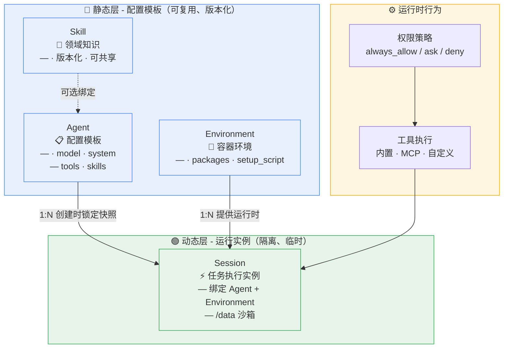
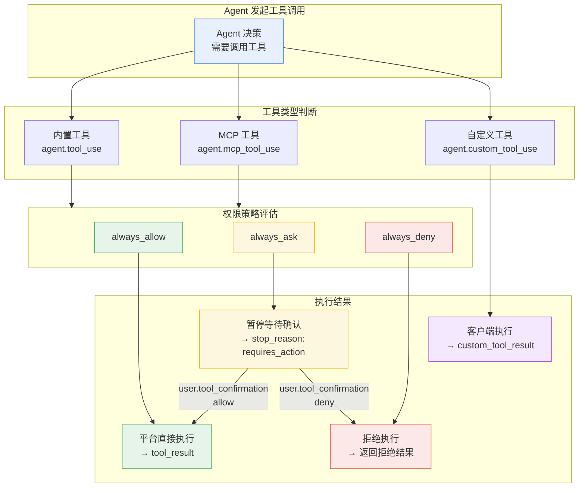
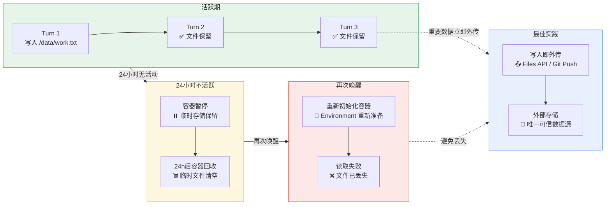

# Agent Skills

1. 为 Agent 附加领域专业知识
2. Skills 为 Agent 附加**领域专业知识**
3. 一个 Skill 是一组**结构化**的**指令**和**流程**，让 Agent 在**特定任务**上表现得更**专业**、更**可靠**

<!-- more -->

## 架构概览



| 层次   | 组件           | 特性                     | 耦合关系                     |
| ------ | -------------- | ------------------------ | ---------------------------- |
| **静态** | Agent          | 可复用、版本化、不可变快照   | Session 创建时锁定，后续修改不影响已运行实例 |
| **静态** | Environment    | 容器模板、依赖声明           | Session 创建时绑定，容器启动时**热安装依赖** |
| **静态** | Skill          | 版本化知识模块             | 可选绑定到 Agent，支持动态跟随或钉住版本      |
| **动态** | Session        | 独立运行实例、/data 沙箱隔离 | 消费 Agent 快照 + Environment 实例      |
| **运行时** | 权限策略        | 工具调用控制               | 在 Agent 的 tools.configs 中配置           |

## 端点总表

| 方法     | 路径                                                         | 说明                                                         |
| -------- | ------------------------------------------------------------ | ------------------------------------------------------------ |
| `POST`   | `/api/v1/cloud/skills`                                       | [创建 Skill](https://docs.qoder.com/zh/cloud-agents/api/skills/create)（含首个版本） |
| `GET`    | `/api/v1/cloud/skills`                                       | [列出 Skills](https://docs.qoder.com/zh/cloud-agents/api/skills/list) |
| `GET`    | `/api/v1/cloud/skills/{skill_id}`                            | [获取 Skill](https://docs.qoder.com/zh/cloud-agents/api/skills/get) |
| `PUT`    | `/api/v1/cloud/skills/{skill_id}`                            | [更新 Skill](https://docs.qoder.com/zh/cloud-agents/api/skills/update) ⚠️ **已废弃** |
| `DELETE` | `/api/v1/cloud/skills/{skill_id}`                            | [删除 Skill](https://docs.qoder.com/zh/cloud-agents/api/skills/delete) |
| `POST`   | `/api/v1/cloud/skills/{skill_id}/versions`                   | [创建 Skill 版本](https://docs.qoder.com/zh/cloud-agents/api/skills/create-version) |
| `GET`    | `/api/v1/cloud/skills/{skill_id}/versions`                   | [列表 Skill 版本](https://docs.qoder.com/zh/cloud-agents/api/skills/list-versions) |
| `GET`    | `/api/v1/cloud/skills/{skill_id}/versions/{version}`         | [获取 Skill 版本](https://docs.qoder.com/zh/cloud-agents/api/skills/get-version) |
| `GET`    | `/api/v1/cloud/skills/{skill_id}/versions/{version}/content` | [下载 Skill 版本内容](https://docs.qoder.com/zh/cloud-agents/api/skills/get-version-content) |
| `DELETE` | `/api/v1/cloud/skills/{skill_id}/versions/{version}`         | [删除 Skill 版本](https://docs.qoder.com/zh/cloud-agents/api/skills/delete-version) |

## 版本化模型

Skill 采用「**skill 壳** + **不可变版本快照**」两层模型：

1. **Skill 壳**：承载 `id`、`display_title`、`source`、`metadata` 等**与内容无关的属性**，以及指向最新版本的 `latest_version`。

2. **Skill 版本（version）**：每个版本是一份**不可变的完整内容快照**。版本号是创建时刻的 **epoch 微秒字符串**（如 `"1759178010641129"`），由服务端生成，不可指定。
3. 更新内容 = 通过 `POST /skills/{skill_id}/versions` 追加一个新版本；**旧版本保持不变**，可单独获取、下载和删除。
4. 删除最新版本后，`latest_version` 自动回退到**次新版本**；所有版本删光时为 `null`。
5. Skill 的 `name`（来自 `SKILL.md` **frontmatter**）在**所有版本间必须保持一致**，创建后**不可更改**。

> `PUT /api/v1/cloud/skills/{skill_id}` 已废弃。内容更新请改用 [创建 Skill 版本](https://docs.qoder.com/zh/cloud-agents/api/skills/create-version)。

## Skill 的作用

| 作用             | 描述                                                      |
| ---------------- | --------------------------------------------------------- |
| **注入专业知识** | 让通用 Agent 具备**特定领域能力**（如代码审查、文档生成） |
| **标准化流程**   | 确保 Agent 按**统一步骤执行**，输出一致                   |
| **可复用**       | 一次创建，**多个 Agent 共享**                             |

## Skill 文件结构

Skill 以 `.zip` 文件（或**裸文件树** **multipart** 上传）提交，必须有**唯一的顶级目录**，且目录名等于 `SKILL.md` 中的 `name`：

```
my-skill/
├── SKILL.md          # 必需：Skill 定义文件
├── templates/        # 可选：模板文件
│   └── report.md
└── examples/         # 可选：示例文件
    └── sample.json
```

`SKILL.md` 是**核心文件**，使用 **YAML frontmatter + Markdown** 格式：

```yaml
---
name: my-skill
description: 执行结构化代码审查，输出改进建议
---

# Code Review

## Steps
1. 分析代码结构和架构
2. 检查常见问题（安全、性能、可维护性）
3. 输出结构化审查报告

## Pitfalls
- 不要只关注格式问题，优先关注逻辑错误
- 给出具体修改建议，而非泛泛批评
```

## 创建 Skill

```
POST https://api.qoder.com/api/v1/cloud/skills
Content-Type: multipart/form-data
```

### curl 示例

先打包 Skill 目录（**保留顶级目录**）

```
$ zip -r my-skill.zip my-skill/
  adding: my-skill/ (stored 0%)
  adding: my-skill/examples/ (stored 0%)
  adding: my-skill/examples/sample.json (stored 0%)
  adding: my-skill/SKILL.md (deflated 14%)
  adding: my-skill/templates/ (stored 0%)
  adding: my-skill/templates/report.md (stored 0%)
```

上传

```json
$ curl -s -X POST https://api.qoder.com/api/v1/cloud/skills \
  -H "Authorization: Bearer $QODER_PAT" \
  -F "files=@my-skill.zip" | jq
{
  "id": "skill_00mqyyqaxvdohy1fqx8c",
  "type": "skill",
  "display_title": "my-skill",
  "description": "执行结构化代码审查，输出改进建议",
  "source": "custom",
  "latest_version": "1787055989962890",
  "metadata": {},
  "created_at": "2026-08-18T12:26:29.961266Z",
  "updated_at": "2026-08-18T12:26:30.009007Z"
}
```

1. `latest_version` 由**服务端生成**，是**创建时刻**的 **epoch 微秒**字符串
2. SKILL.md **frontmatter** 中的 `version`（如 `1.0.0`）仅作**信息标记**用途，并非服务端版本号

## 关联到 Agent

1. 通过 **Agent** 的 `skills` 字段**将 Skill 绑定到 Agent**
2. 绑定元素可携带可选的 `version` 字段：**省略**或传 `"latest"` 表示**动态跟随最新版本**；传**数字时间戳**表示**钉住**该版本（写入时会**校验**该版本**真实存在**，否则返回 **400**）

```json
$ curl -s -X POST https://api.qoder.com/api/v1/cloud/agents/agent_00mqky5ogkt1cpm84o7r \
  -H "Authorization: Bearer $QODER_PAT" \
  -H "Content-Type: application/json" \
  -d '{
    "version": 2,
    "skills": [
      {"type": "custom", "skill_id": "skill_00mqyyqaxvdohy1fqx8c"}
    ]
  }' | jq
{
  "archived_at": null,
  "created_at": "2026-08-18T09:49:22.787044Z",
  "description": "",
  "id": "agent_00mqky5ogkt1cpm84o7r",
  "mcp_servers": [],
  "metadata": {},
  "model": "ultimate",
  "multiagent": null,
  "name": "dev-agent",
  "skills": [
    {
      "skill_id": "skill_00mqyyqaxvdohy1fqx8c",
      "type": "custom"
    }
  ],
  "system": "你是一个开发助手",
  "tools": [
    {
      "enabled_tools": [
        "Bash",
        "Read",
        "Write",
        "Edit",
        "Glob",
        "Grep",
        "WebFetch",
        "WebSearch"
      ],
      "type": "agent_toolset_20260401"
    }
  ],
  "type": "agent",
  "updated_at": "2026-08-18T12:33:25.724346Z",
  "version": 3
}
```

## 版本管理

为已有 Skill **追加新版本**：

```json
$ curl -s -X POST https://api.qoder.com/api/v1/cloud/skills/skill_00mqyyqaxvdohy1fqx8c/versions \
-H "Authorization: Bearer $QODER_PAT" \
-F "files=@my-skill-v2.zip" | jq
{
  "id": "skillver_00mr002nw15vkcgcfe9d",
  "type": "skill_version",
  "skill_id": "skill_00mqyyqaxvdohy1fqx8c",
  "version": "1787056687619589",
  "name": "my-skill",
  "description": "执行结构化代码审查，输出改进建议",
  "directory": "my-skill",
  "created_at": "2026-08-18T12:38:07.66355Z",
  "content_size": 707,
  "content_sha256": "2d80ae01c6cef102b9a125147f3dc22f70a28218fa9138801c1ac1877850bd2e",
  "status": "active",
  "updated_at": "2026-08-18T12:38:07.66355Z"
}
```

1. **未钉版的绑定**始终使用**最新版本**
2. 钉住数字版本的绑定固定使用该版本内容

## 获取 Skill 详情

```json
$ curl -s https://api.qoder.com/api/v1/cloud/skills \
  -H "Authorization: Bearer $QODER_PAT" | jq
{
  "data": [
    {
      "id": "skill_00mqyyqaxvdohy1fqx8c",
      "type": "skill",
      "display_title": "my-skill",
      "description": "执行结构化代码审查，输出改进建议",
      "source": "custom",
      "latest_version": "1787056687619589",
      "metadata": {},
      "created_at": "2026-08-18T12:26:29.961266Z",
      "updated_at": "2026-08-18T12:38:07.66355Z"
    },
    {
      "id": "skill_00mqyynfq1zi9tm2r097",
      "type": "skill",
      "display_title": "my-skill",
      "description": "执行结构化代码审查，输出改进建议",
      "source": "custom",
      "latest_version": "1787055988474691",
      "metadata": {},
      "created_at": "2026-08-18T12:26:28.472871Z",
      "updated_at": "2026-08-18T12:26:28.516247Z"
    },
    {
      "id": "skill_00mqyyd0qb08xk6c1l0k",
      "type": "skill",
      "display_title": "my-skill",
      "description": "执行结构化代码审查，输出改进建议",
      "source": "custom",
      "latest_version": "1787055983071629",
      "metadata": {},
      "created_at": "2026-08-18T12:26:23.068907Z",
      "updated_at": "2026-08-18T12:26:23.104877Z"
    },
    {
      "id": "skill_00mqyxw9xslc16830h2x",
      "type": "skill",
      "display_title": "my-skill",
      "description": "执行结构化代码审查，输出改进建议",
      "source": "custom",
      "latest_version": "1787055974380700",
      "metadata": {},
      "created_at": "2026-08-18T12:26:14.37811Z",
      "updated_at": "2026-08-18T12:26:14.419258Z"
    }
  ],
  "first_id": "skill_00mqyyqaxvdohy1fqx8c",
  "has_more": false,
  "last_id": "skill_00mqyxw9xslc16830h2x",
  "next_page": null
}
```

## Skill 编写建议

| 建议             | 描述                                              |
| ---------------- | ------------------------------------------------- |
| **明确触发条件** | 在 **description** 中写清楚**何时**应使用此 Skill |
| **步骤具体**     | Steps 中写**精确操作**，而非模糊描述              |
| **记录陷阱**     | Pitfalls 帮助 Agent **避免常见错误**              |
| **提供验证**     | 告诉 Agent 如何**确认任务完成**                   |

## 常见问题

> Q：Skill 和 Agent system 提示词有什么区别？

A：`system` 是 Agent 的**通用指令**，对**所有任务**生效。**Skill** 是**按需激活**的**专业模块**，Agent 根据**任务内容**决定是否使用。

> Q：一个 Agent 可以关联多少个 Skills？

A：无硬性限制，但建议控制在 **10 个以内**以确保 **Agent 行为可预测**。

> Q：Skills 功能何时全面开放？

A：当前处于 M2 **门控**阶段，预计后续版本全量开放。可联系我们申请提前开通。

> Q：zip 文件大小有限制吗？

A：压缩包不超过 **50 MB**，且解压后总大小同样不超过 50 MB。

# 权限策略

1. 控制**工具调用**是**允许**、**询问**还是**拒绝**
2. 权限策略控制 Agent 想调用工具时会发生什么
3. **内置工具**和 **MCP 工具**会被评估为 `allow`、`ask` 或 `deny`
4. **client-side** 自定义工具**始终暂停**，由你的应用执行后**回传结果**

## 运行时行为

**工具调用**进入**事件流**时，会**投影**为：

| 事件                    | 含义                           | 关键字段                                                     |
| ----------------------- | ------------------------------ | ------------------------------------------------------------ |
| `agent.tool_use`        | **内置工具**调用               | `id`, `name`, `input`, `evaluated_permission`                |
| `agent.mcp_tool_use`    | **MCP 工具**调用               | `id`, `name`, `input`, `mcp_server_name`, `evaluated_permission` |
| `agent.custom_tool_use` | **Client-side 自定义工具**请求 | `id`, `name`, `input`                                        |

`evaluated_permission` 可能为：

| 值      | 行为                                              |
| ------- | ------------------------------------------------- |
| `allow` | **平台直接执行工具**                              |
| `ask`   | 当前 turn **暂停**，等待 `user.tool_confirmation` |
| `deny`  | **平台**向 **Agent** 返回被拒绝的工具结果         |



1. **自定义工具**不支持 `permission_policy`
2. 它们由**客户端执行**，并通过 `user.custom_tool_result` 回复

## 在 Agent 中配置权限

**内置工具**和 **MCP 工具**的**权限配置**写在 Agent 的 `tools` 数组里：

```json
{
  "tools": [
    {
      "type": "agent_toolset_20260401",
      "enabled_tools": ["Bash", "Read", "Write"],
      "configs": [
        {"name": "Read", "permission_policy": {"type": "always_allow"}},
        {"name": "Write", "permission_policy": {"type": "always_ask"}},
        {"name": "Bash", "permission_policy": {"type": "always_deny"}}
      ]
    },
    {
      "type": "mcp_toolset",
      "mcp_server_name": "weather-service",
      "configs": [
        {"name": "get_forecast", "permission_policy": {"type": "always_ask"}}
      ]
    }
  ]
}
```

| 位置                                  | 作用范围     | 说明                                                         |
| ------------------------------------- | ------------ | ------------------------------------------------------------ |
| `tools[].configs[].permission_policy` | 一个具名工具 | **单工具**权限覆盖。内置工具的 `name` 使用 `Read` 等**内置工具名**；MCP 工具的 `name` 使用该 **MCP server** 暴露的**原始工具名** |
| `tools[].configs[].enabled`           | 一个具名工具 | 设为 `false` 时会**禁用**并**拒绝该工具**。如果同时使用 `enabled_tools` 白名单，不要把**已禁用工具**放进**白名单** |

`permission_policy.type` 可选值：

| 值             | 运行时结果                                                   |
| -------------- | ------------------------------------------------------------ |
| `always_allow` | `evaluated_permission: "allow"`                              |
| `always_ask`   | `evaluated_permission: "ask"`，当前 turn 等待 `user.tool_confirmation` |
| `always_deny`  | `evaluated_permission: "deny"`                               |

## Pending Action 流程

当**工具调用**需要**人工**或客户端输入时：

1. 事件流先发送 `agent.tool_use` 或 `agent.custom_tool_use`
2. 事件流再发送 `session.status_idle`，其中 `stop_reason.type` 为 `"requires_action"`
3. `stop_reason.event_ids` 列出需要响应的事件 ID
4. 客户端向 `POST /api/v1/cloud/sessions/{session_id}/events` 发送响应事件
5. Agent 继续同一个 turn

```json
{
  "type": "session.status_idle",
  "status": "idle",
  "stop_reason": {
    "type": "requires_action",
    "event_ids": ["evt_01JZ6Q3FB6SG8F7J1M2N"]
  }
}
```

Pending action **不会自动超时**。它会一直**保持 pending**，直到**客户端解决**，或 **session/turn** 被**取消**。

## 确认工具调用

1. 使用 `agent.tool_use` 事件的 `id` 作为 `tool_use_id`
2. 这里传的是 `evt_...` **事件 ID**，不是模型供应商内部的 tool-use ID

> 批准

```json
curl -X POST https://api.qoder.com/api/v1/cloud/sessions/sess_abc123/events \
  -H "Authorization: Bearer $QODER_ACCESS_TOKEN" \
  -H "Content-Type: application/json" \
  -d '{
    "events": [
      {
        "type": "user.tool_confirmation",
        "tool_use_id": "evt_01JZ6Q3FB6SG8F7J1M2N",
        "result": "allow"
      }
    ]
  }'
```

> 拒绝

```json
curl -X POST https://api.qoder.com/api/v1/cloud/sessions/sess_abc123/events \
  -H "Authorization: Bearer $QODER_ACCESS_TOKEN" \
  -H "Content-Type: application/json" \
  -d '{
    "events": [
      {
        "type": "user.tool_confirmation",
        "tool_use_id": "evt_01JZ6Q3FB6SG8F7J1M2N",
        "result": "deny",
        "deny_message": "只允许检查文件，不要删除。"
      }
    ]
  }'
```

## 完成自定义工具

1. 自定义工具通过 Agent 的 `type: "custom"` 配置，详见 [Agent 工具配置](https://docs.qoder.com/zh/cloud-agents/tools)
2. 当 Agent **请求自定义工具**时，你的**应用执行**该工具，然后使用 `agent.custom_tool_use` 事件 ID 回传

```json
curl -X POST https://api.qoder.com/api/v1/cloud/sessions/sess_abc123/events \
  -H "Authorization: Bearer $QODER_ACCESS_TOKEN" \
  -H "Content-Type: application/json" \
  -d '{
    "events": [
      {
        "type": "user.custom_tool_result",
        "custom_tool_use_id": "evt_01JZ6R1V9Z8K2M3N4P5Q",
        "content": [{"type": "text", "text": "订单状态：已发货"}]
      }
    ]
  }'
```

`content` 可以是**字符串**、**单个 text block** 或 **text block 数组**。返回事件会以 **content block** 结构保存。

## 常见问题

> Q：一个 **turn** 可以有**多个待响应操作**吗？

A：可以。`stop_reason.event_ids` 可能包含**多个事件 ID**，需要**逐个响应**。

> Q：pending action 会超时吗？

A：不会。它会保持 **pending**，直到**被解决**，或 session/turn **被取消**。

> Q：自定义工具能使用 permission_policy 吗？

A：不能。自定义工具是 **client-side 工具**，是否**执行**或**拒绝**由**客户端**负责。

# 云端环境

1. 选择 Agent 运行的**容器**、**网络**与**依赖**
2. Environment 定义 **Session** 使用的**运行环境**，包括**环境类型**、**预装依赖**、**启动脚本**和 **metadata**
3. 你可以使用**默认托管环境**，也可以为**特定任务**创建**预装工具的环境**或接入**自托管执行环境**

## 环境是什么

Environment 是 Session 的**基础设施层**：

| 项           | 描述                                                         |
| ------------ | ------------------------------------------------------------ |
| **环境类型** | `cloud` 表示**云端托管容器**，`self_hosted` 表示**自托管执行环境** |
| **依赖包**   | 预装**系统**包、**Python** 包、**Node.js** 包                |
| **启动脚本** | **容器准备阶段**、**依赖安装完成后**执行的用户脚本           |

每个 **Session 启动**时会基于**指定的 Environment 模板**创建**独立的运行实例**。

## 字段说明

| 字段                  | 类型         | 必填            | 说明                                            |
| --------------------- | ------------ | --------------- | ----------------------------------------------- |
| `id`                  | string       | -               | 系统生成，`env_` 前缀                           |
| `type`                | string       | -               | 固定为 `"environment"`                          |
| `name`                | string       | 是              | 环境名称                                        |
| `description`         | string       | 否              | 描述信息，默认 `""`                             |
| `config`              | object       | 否              | **环境配置**；省略时默认为 `{"type":"cloud"}`   |
| `config.type`         | string       | config 存在时是 | **环境类型**：`"cloud"` 或 `"self_hosted"`      |
| `config.packages`     | object       | 否              | `cloud` 环境的**预装依赖包**配置                |
| `config.setup_script` | string       | 否              | sandbox 准备阶段执行的 shell 脚本（最大 64 KB） |
| `metadata`            | object       | 否              | 自定义 key/value metadata                       |
| `archived_at`         | string\|null | -               | 归档时间（ISO 8601），未归档时为 `null`         |
| `created_at`          | string       | -               | 创建时间                                        |
| `updated_at`          | string       | -               | 最后更新时间                                    |

## Config 类型

1. `config.type` 可以是 `"cloud"` 或 `"self_hosted"`
2. `self_hosted` 的 config 可以只包含**类型**，也可以包含 `setup_script`：

```json
{"type": "self_hosted"}
```

1. **Self-hosted Environment** 不会启动**托管云端容器**
2. **外部 worker** 通过 [Work API](https://docs.qoder.com/zh/cloud-agents/api/environments/work/poll) **poll**、**ack**、**heartbeat** 和 **stop** 该 **Environment** 下的 **Session work**
3. `self_hosted` config 仅支持 `type` 和**可选**的 `setup_script`
4. `cloud` 的 config 可以包含 `packages` 和 `setup_script`

## 预装依赖

通过 `config.packages` 指定**容器启动**时预装的依赖：

```json
{
  "config": {
    "type": "cloud",
    "packages": {
      "apt": ["git", "build-essential", "libssl-dev"],
      "pip": ["pandas", "numpy", "scikit-learn"],
      "npm": ["typescript", "eslint", "prettier"]
    }
  }
}
```

| 包管理器 | 字段           | 说明                     |
| -------- | -------------- | ------------------------ |
| **apt**  | `packages.apt` | **Debian/Ubuntu 系统包** |
| **pip**  | `packages.pip` | **Python 包**            |
| **npm**  | `packages.npm` | **Node.js 包**           |

预装依赖会增加**环境初始化时间**。只添加确实需要的包，其余可在 **Session** 运行时**按需安装**。

## 启动脚本

1. `config.setup_script` 是一段在 **sandbox 准备阶段**、`packages` **安装完成之后**执行的 shell 脚本，使用 `/bin/bash -lc` **解释器**运行
2. 常用于克隆代码、写配置文件、warmup 缓存等无法用 `packages` 表达的**初始化**步骤

| 约束     | 值                                        |
| -------- | ----------------------------------------- |
| 类型     | string                                    |
| 最大长度 | **64 KB**                                 |
| 解释器   | `/bin/bash -lc`                           |
| 超时     | **10 分钟**                               |
| 执行时机 | sandbox 准备阶段，`packages` 安装完成之后 |

创建一个会自动 clone 项目并预装依赖的**环境**

```json
curl -s -X POST https://api.qoder.com/api/v1/cloud/environments \
  -H "Authorization: Bearer $QODER_ACCESS_TOKEN" \
  -H "Content-Type: application/json" \
  -d '{
    "name": "node-with-init",
    "config": {
      "type": "cloud",
      "packages": {
        "npm": ["pnpm@9"]
      },
      "setup_script": "set -euo pipefail\n[ -d /data/workspace/repo/.git ] || git clone https://github.com/me/repo /data/workspace/repo\ncd /data/workspace/repo && pnpm install --frozen-lockfile"
    }
  }' | jq .
```

1. **执行成功**后会在沙箱内写入**完成标记**，本次 sandbox 内**不会重复执行**；沙箱被**回收重建**后会**再次执行**
2. **脚本**以**非零状态退出**会导致 **Session 启动失败**，错误响应中会带上 **exit code** 和 **stderr 摘要**

## 创建环境

创建一个数据科学专用环境

```json
curl -s -X POST https://api.qoder.com/api/v1/cloud/environments \
  -H "Authorization: Bearer $QODER_ACCESS_TOKEN" \
  -H "Content-Type: application/json" \
  -d '{
    "name": "data-science",
    "config": {
      "type": "cloud",
      "packages": {
        "apt": ["build-essential"],
        "pip": ["pandas", "numpy", "matplotlib", "scikit-learn", "jupyter"]
      }
    }
  }' | jq .
```

成功返回 **200 OK**：

```json
{
  "id": "env_019e44eb66bb748cabcd1489f6fa4428",
  "type": "environment",
  "name": "data-science",
  "description": "",
  "config": {
    "type": "cloud",
    "packages": {
      "type": "packages",
      "apt": ["build-essential"],
      "cargo": [],
      "gem": [],
      "go": [],
      "npm": [],
      "pip": ["pandas", "numpy", "matplotlib", "scikit-learn", "jupyter"]
    }
  },
  "metadata": {},
  "archived_at": null,
  "created_at": "2026-05-18T10:00:00Z",
  "updated_at": "2026-05-18T10:00:00Z"
}
```

## 查询环境

列出所有环境

```
curl -s https://api.qoder.com/api/v1/cloud/environments \
  -H "Authorization: Bearer $QODER_ACCESS_TOKEN"
```

获取单个环境详情

```
curl -s https://api.qoder.com/api/v1/cloud/environments/env_ds456 \
  -H "Authorization: Bearer $QODER_ACCESS_TOKEN"
```

## 更新环境

为已有环境添加新的依赖包

```json
curl -s -X POST https://api.qoder.com/api/v1/cloud/environments/env_ds456 \
  -H "Authorization: Bearer $QODER_ACCESS_TOKEN" \
  -H "Content-Type: application/json" \
  -d '{
    "name": "data-science",
    "config": {
      "type": "cloud",
      "packages": {
        "apt": ["build-essential", "libpq-dev"],
        "pip": ["pandas", "numpy", "matplotlib", "scikit-learn", "jupyter", "sqlalchemy"]
      }
    }
  }' | jq .
```

1. **更新环境不会影响已运行的 Session**
2. 新配置仅对后续创建的 Session 生效

## 环境选型建议

| 场景       | 推荐配置                                          |
| ---------- | ------------------------------------------------- |
| 通用开发   | `default` 环境，无需额外配置                      |
| 数据分析   | 预装 pandas/numpy，并验证依赖源连通性             |
| 前端开发   | 预装 Node.js 生态工具，并验证 npm registry 连通性 |
| CI/CD 集成 | 预装所需 CLI，并在目标环境中验证依赖服务连通性    |

## 常见问题

> Q: 环境创建后需要等待多久才能使用？

A: 环境创建后可**立即**用于创建 Session。实际的**容器初始化（包括安装依赖）**发生在 **Session 启动时**。

> Q: 预装包的版本可以指定吗？

A: **pip** 和 **npm** 包支持**版本指定**，如 `"pandas==2.1.0"` 或 `"typescript@5.0.0"`。**apt** 包使用**系统源的默认版本**。

> Q: 一个账号最多能创建多少个环境？

A: 无硬性限制，但建议按实际需求创建，避免管理混乱。建议通过命名规范分类。

# 容器参考

1. **容器类型**、**网络策略**和**预装包**参考
2. 托管 `cloud` Environment 中可供 **Agent** 使用的**容器环境**。`self_hosted` Environment 的**操作系统**、**工具**和**资源**由**自托管运行环境**决定。
3. 在托管环境中，可以**稳定依赖**以下行为：
   - **Agent 工具**默认从 `/data` 运行
   - `config.packages` 支持安装 **apt**、**pip** 和 **npm** 依赖
   - `config.setup_script` 在**依赖安装完**成后执行
   - **容器文件系统**是**临时工作区**，重要产物需要保存到**外部存储**

## 运行时与操作系统

1. **托管环境**的**标准镜像**当前基于 **Ubuntu 22.04 LTS**
2. **CPU 架构**、**内核**和**容器引擎**可能因**运行环境**而异
3. 在 **Session** 中运行以下命令可以查看**实际环境**：

```
cat /etc/os-release
uname -m
uname -r
```

需要运行**原生二进制**时，请在 **Session** 中检测**实际架构**，或同时提供所需架构的构建产物。

## 当前标准镜像中的工具

1. 当前**标准镜像**包含**常用系统工具**，例如 `git`、`curl`、`wget`、`jq`、`vim`、`ssh`、`make`、`cmake`、`gcc`、`ripgrep`、`tar` 和 `unzip`。
2. 当前**标准镜像**还包含以下**主要语言运行时**：

| 运行时      | 当前主版本 |
| ----------- | ---------- |
| **Python**  | 3.12       |
| **Node.js** | 20         |
| Go          | 1.22       |
| Java        | 21         |
| Ruby        | 3.3        |
| PHP         | 8.3        |
| Rust        | stable     |

**预装工具**及其**补丁版本**会随**镜像升级**而变化。任务依赖**精确版本**时，请在 **Environment** 中**显式安装**或**固定版本**，并在 **Session** 中检查：

```
python --version
node --version
go version
java -version
ruby --version
php --version
rustc --version
```

## 工作目录

Agent 工具的**默认工作目录**是：

```
/data
```

1. **托管环境**中 `WORK_DIR` 的值为 `/data`，Bash 等工具未指定目录时也从 `/data` 执行
2. 建议将**仓库**和**工作文件**放在 `/data/workspace/` 等子目录中

**上传文件**和**仓库资源**时，请通过各资源的 `mount_path` 指定**挂载位置**；参见 [文件上传与挂载](https://docs.qoder.com/zh/cloud-agents/files)。

## 安装额外软件

托管 `cloud` Environment 支持通过 `config.packages` 安装以下三类依赖：

| 字段  | 执行方式                    |
| ----- | --------------------------- |
| `apt` | `apt-get install` 系统包    |
| `pip` | `pip install` Python 包     |
| `npm` | `npm install -g` Node.js 包 |

```json
{
  "config": {
    "type": "cloud",
    "packages": {
      "apt": ["postgresql-client", "redis-tools"],
      "pip": ["pandas==2.2.3"],
      "npm": ["typescript@5.8.3"]
    }
  }
}
```

1. 如果**初始化逻辑**不能用 `packages` 表达，可以使用 `config.setup_script`
2. 脚本在**依赖安装之后**通过 `/bin/bash -lc` 从 `/data` 执行，最大 **64 KB**，超时时间为 **10 分钟**

## 资源与超时

1. 可用 **CPU**、**内存**、**磁盘**和**执行超时**取决于**实际运行环境**和**服务配置**
2. 不要让**任务**依赖**固定的资源规格**
3. 如果任务存在**最低资源要求**，请先在**目标环境**中验证
4. **内存或磁盘耗尽**时，进程可能**被终止**或**写入失败**
5. **长任务**还应考虑**单个工具调用**和**单次 Turn 的超时**

## 文件持久化

> **Turn（对话轮次）**：一次完整的交互循环 — `user.message` → Agent 思考执行 → `agent.message` → `idle`
> 同一容器内，前一个 Turn 写入的文件，下一个 Turn 可继续读取修改

1. 同一个运行实例**存续**期间，文件通常会在 **Turn 之间**保留
2. **容器临时存储**在连续 **24 小时未活跃后**可能被**回收**
3. 回收后**再次唤醒 Session** 时，平台会**重新初始化容器**并按需**重新准备 Environment** 与**挂载资源**；未保存到**外部存储**的文件可能**丢失**
4. Session **归档**或**结束**后，不应再依赖其容器文件继续存在
5. **容器文件系统**是**临时工作区**
   - 需要长期保留的产物请通过 **Files API**、**Git 仓库**或**其他外部存储**保存
   - 重要代码修改应**及时 commit** 并 **push**



**关键原则**：容器文件系统是临时工作区，不是长期存储，所有重要数据应在产生时立即同步到外部存储

## 执行用户与环境变量

1. **执行用户**以及 `HOME`、`USER`、`SHELL` 和 `LANG` 的值可能因**运行环境**或**自定义镜像**而异
2. 不要让脚本**依赖特定 UID**，也不要假设**系统目录始终可写**

需要确认时，在 **Session** 中运行：

```
id
whoami
printf 'HOME=%s\nUSER=%s\nSHELL=%s\nLANG=%s\nWORK_DIR=%s\n' \
  "$HOME" "${USER:-}" "${SHELL:-}" "${LANG:-}" "${WORK_DIR:-}"
```

**Session** 的 `environment_variables` 以及关联 **Vault** 中的**环境变量凭证**会在**工具调用**时**注入**。不要在**日志**或**任务输出**中打印**密钥**。

# IP 地址

1. Cloud Agents 使用**固定 IP 地址池**发起 **MCP 工具调用**的**出站连接**
2. 你可以将这些地址加入**防火墙白名单**，使 **MCP Server** 能正常接收来自 Cloud Agents 的流量
3. 这些地址<u>专用于 MCP 出站流量</u>，**不与**沙箱**公网出口网段**复用，变更前会提前通知

## 出站 IP 地址（MCP）

Agent 调用 **MCP 工具**连接**外部服务器**时使用的**固定出口 IP 网段**：

```
8.216.144.48/28
```

## 防火墙配置

1. 将上述 **CIDR** 加入你服务器的**入站白名单**，即可允许 Cloud Agents 的 **MCP 调用**到达
2. 以上 IP 范围**仅**适用于 **MCP 工具调用出口**，不适用于沙箱容器的**公网出口**

## FAQ

> Q：这些 IP 会变吗？

A：不会在**无预告**情况下变更。如果新增或轮换 IP 段，我们会提前公告，留出足够时间供你更新防火墙规则。

> Q：沙箱的出站连接也来自这些 IP 吗？

A：不是。沙箱公网出口使用另外的 IP 池。本页列出的地址专用于平台代 Agent 发起的 **MCP 工具调用**。
