# 启动 Session

1. 创建、运行、查看和归档 Cloud Agent Sessions
1. **Session** 是 **Agent** 的**运行工作区**
1. 它把 **Agent 快照**、**Environment**、**可选资源**和**可选 Vault 凭证**绑定在一起
1. 新 Session 初始为 `idle`，**发送事件**后开始执行

<!-- more -->

## Session 状态生命周期

Session 是一个**状态机**。Session 资源上的 `status` 字段取以下值之一：

| 状态           | 说明                                                         | 可流转到                                |
| -------------- | ------------------------------------------------------------ | --------------------------------------- |
| `idle`         | Session 空闲，可以发送消息                                   | `running`、`rescheduling`、`terminated` |
| `running`      | Agent 正在处理 turn                                          | `idle`、`rescheduling`、`terminated`    |
| `rescheduling` | 底层运行时正在**重新调度**，期间 Session 不可用，恢复后回到 `idle` | `idle`、`terminated`                    |
| `terminated`   | Session 已终止（终态）                                       | —                                       |

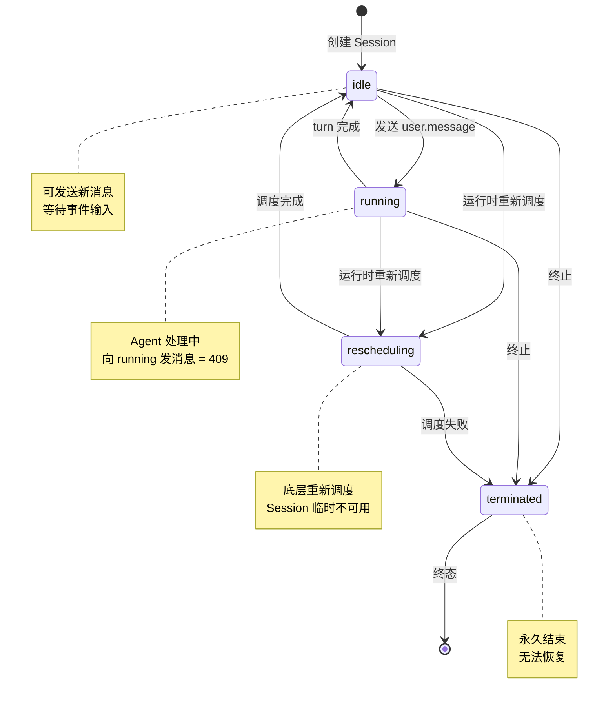

另外两个**生命周期标记**不出现在 `status` 字段中：

1. **已归档（archived）**：通过非空 `archived_at` 时间戳标识
   - `status` 字段本身**不会**变成 `archived` - Session 仍**可被读取**，但**拒绝新事件**
2. **cancel 响应**：`POST /api/v1/cloud/sessions/{id}/cancel` 接口的响应体始终是**固定字面量** `"status": "canceling"`
   - 这只是**响应结构**，不是 Session **持久化**的 status
   - **turn 中止后** Session 的 `status` 仍回到 `idle`

| 步骤                          | 描述                                                         |
| ----------------------------- | ------------------------------------------------------------ |
| 创建 → idle                   | **新 Session** 进入 `idle`，**等待输入**                     |
| idle → running                | 发送 `user.message` 事件后，状态切换到 `running`             |
| running → idle                | **本轮完成后**回到 `idle`，可继续下一轮                      |
| running → idle（cancel 后）   | 取消**正在执行**的 Session 会**中断**当前 turn，Session 回到 `idle`<br />cancel 接口响应体使用固定 `"status": "canceling"` 字面量，与**持久化的状态**无关<br />Session 仍可继续使用 |
| rescheduling                  | **运行时**可能**临时进入** `rescheduling`，**重新调度**完成后会回到 `idle` |
| archived / terminated（终态） | 归档（通过 `archived_at`）或终止后 Session **永久结束**，**无法恢复** |

## Cancel 语义

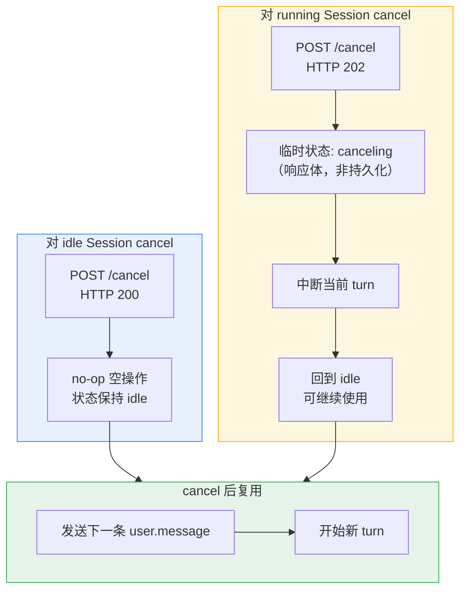

1. **对 `idle` Session 调用 cancel**：空操作（**no-op**），返回 HTTP `200`，状态保持 `idle`
2. **对 `running` Session 调用 cancel**：中断 Agent，返回 HTTP `202`。状态先变为 `canceling`，**中断**完成后回到 `idle`
3. **cancel 后**：Session 仍可**复用** - 直接发送下一条 `user.message` 即可开始新 **turn**

取消当前 turn

```
curl -s -X POST "https://api.qoder.com/api/v1/cloud/sessions/$SESSION_ID/cancel" \
  -H "Authorization: Bearer $QODER_ACCESS_TOKEN"
```

只有 `archived` 和 `terminated` 是**终态**。**取消**后的 Session 总会回到 `idle`，可以**继续接受消息**。

## 向 running Session 发消息（409 错误）

如果向正在 `running` 的 Session 发送 `user.message`，API 返回 **HTTP 409**：

```json
{
  "type": "error",
  "request_id": "cb80235f-76a2-4ff3-9e28-5aa2da12dc14",
  "error": {
    "type": "invalid_request_error",
    "message": "Session is currently processing a turn. Cancel the current turn or wait for completion."
  }
}
```

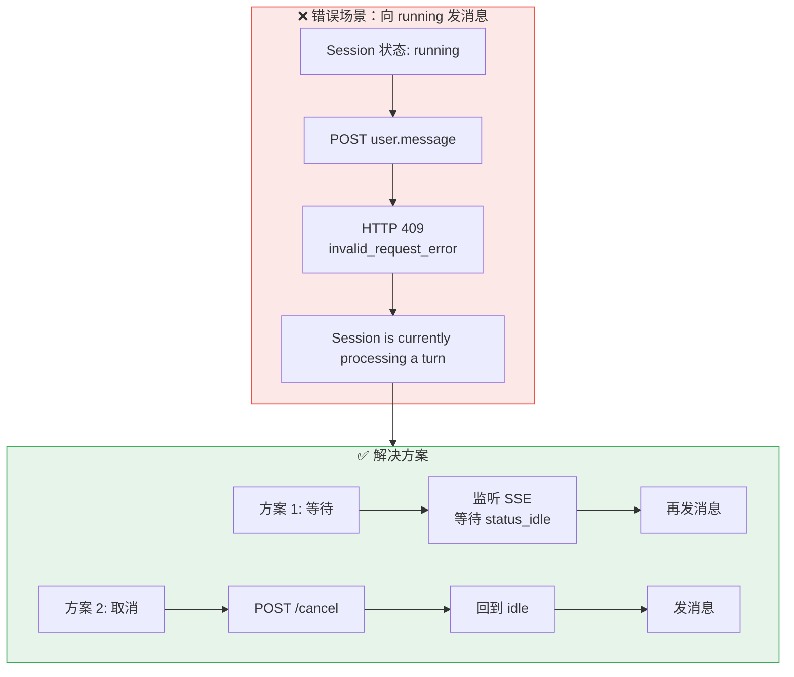

这是新用户最常踩的坑。请始终等待 `session.status_idle` 事件后再发送下一条消息，或者先 **cancel** 当前 turn。

## 创建 Session

使用已有 `agent` 和 `environment_id` 创建 Session：

```json
curl -s -X POST "https://api.qoder.com/api/v1/cloud/sessions" \
  -H "Authorization: Bearer $QODER_ACCESS_TOKEN" \
  -H "Content-Type: application/json" \
  -d '{
    "agent": {"id": "agent_019e390add9f7bac9b6cc806db46fcbd", "type": "agent", "version": 2},
    "environment_id": "env_019e2590d33f711fabf42f2857cecd8a",
    "title": "Code review session",
    "metadata": {"purpose": "review"}
  }'
```

1. 创建响应是 [Session 对象](https://docs.qoder.com/zh/cloud-agents/api/sessions/schemas#session-对象)，包含 `agent`、`environment_id`、`status`、`resources`、`vault_ids`、`deployment_id`、`outcome_evaluations`、`stats`、`usage`、`environment_variables`、`archived_at`、`created_at` 和 `updated_at`
2. `usage.total_credits` 是 Session 中已记录模型调用消耗 **credits** 的**累计快照**，向下取整并最多保留 2 位小数

## 创建时挂载资源

通过 `resources` 数组挂载**文件**、**仓库**和 **Memory Store**：

```json
{
  "resources": [
    {
      "type": "file",
      "file_id": "file_019e5ce0bf307a1a8f952eb814aea3d5",
      "mount_path": "/data/input/spec.md"
    },
    {
      "type": "github_repository",
      "url": "https://github.com/your-org/your-repo",
      "mount_path": "/data/workspace/your-repo",
      "authorization_token": "ghp_xxxxxxxxxxxxxxxxxxxxxxxxxxxx"
    },
    {
      "type": "memory_store",
      "memory_store_id": "memstore_019eed05b61e78cea61bfd366e072878",
      "access": "read_write",
      "instructions": "Use this memory for long-lived project context."
    }
  ]
}
```

1. 创建后追加文件请调用 [添加 Session 资源 API](https://docs.qoder.com/zh/cloud-agents/api/sessions/add-resource)
2. 当前 **CAS** 创建后追加仅支持 **file resource**
3. resource list/get/update/delete 接口可用于查看、轮转 GitHub token 或移除资源

## 发送消息

通过 **Events API** 发送 `user.message`。`content` 必须是**非空 content block 数组**：

```json
curl -s -X POST "https://api.qoder.com/api/v1/cloud/sessions/$SESSION_ID/events" \
  -H "Authorization: Bearer $QODER_ACCESS_TOKEN" \
  -H "Content-Type: application/json" \
  -d '{
    "events": [
      {
        "type": "user.message",
        "content": [
          {"type": "text", "text": "Review this repository and summarize the risks."}
        ]
      }
    ]
  }'
```

1. **send-events** 接口返回 **HTTP 200** 和 `{"data":[...]}`
2. **可发送事件类型**包括：`user.message`、`user.interrupt`、`user.tool_confirmation`、`user.tool_result`、`user.custom_tool_result` 和 `user.define_outcome`

## 读取事件

使用**事件流**实时读取：

```json
curl -s -N "https://api.qoder.com/api/v1/cloud/sessions/$SESSION_ID/events/stream" \
  -H "Authorization: Bearer $QODER_ACCESS_TOKEN" \
  -H "Accept: text/event-stream"
```

1. 事件流以 **Server-Sent Events** 输出 `id`、`event` 和 `data`
2. Stream endpoint 支持 `Last-Event-ID` header 进行**断线重连**
3. 事件类型 **query filter** 当前不支持

使用 list endpoint **读取历史**和分页：

```
curl -s "https://api.qoder.com/api/v1/cloud/sessions/$SESSION_ID/events?limit=20&order=desc" \
  -H "Authorization: Bearer $QODER_ACCESS_TOKEN"
```

列表响应使用 `data` 和 `next_page`。

## 读取和更新 Sessions

获取一个 Session

```
curl -s "https://api.qoder.com/api/v1/cloud/sessions/$SESSION_ID" \
  -H "Authorization: Bearer $QODER_ACCESS_TOKEN"
```

列出 Sessions

```
curl -s "https://api.qoder.com/api/v1/cloud/sessions?limit=20" \
  -H "Authorization: Bearer $QODER_ACCESS_TOKEN"
```

更新 title、metadata 或 Agent 配置（tools、MCP servers）

```json
curl -s -X POST "https://api.qoder.com/api/v1/cloud/sessions/$SESSION_ID" \
  -H "Authorization: Bearer $QODER_ACCESS_TOKEN" \
  -H "Content-Type: application/json" \
  -d '{"title":"Updated title","metadata":{"priority":"high"}}'
```

Session list 使用 `page` / `next_page` 分页，并支持 `agent_id`、`agent_version`、`deployment_id`、`memory_store_id`、`statuses` 和 `created_at[...]` 等过滤。

## Threads

1. **Managed-agent Session** 可以包含**协调器主线程**和**子线程**
2. Thread endpoint 使用公开 `session_thread` 结构，不再包含 `role`、`name`、`agent_id`、`agent_version` 或 `stop_reason` 等旧字段

```
curl -s "https://api.qoder.com/api/v1/cloud/sessions/$SESSION_ID/threads" \
  -H "Authorization: Bearer $QODER_ACCESS_TOKEN"
```

1. **子线程**可以通过 `POST /api/v1/cloud/sessions/{session_id}/threads/{thread_id}/archive` **归档**
2. 当前 **CAS** 对**协调器主线程归档**返回 `409`

### Session 与 Threads 架构关系

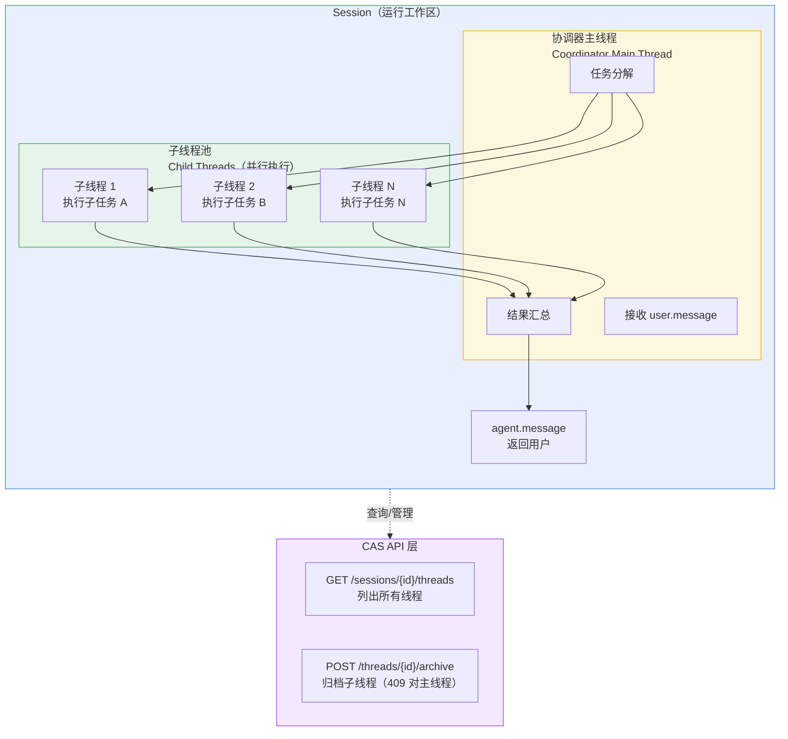

| 概念             | 角色                     | 特性                         |
| ---------------- | ------------------------ | ---------------------------- |
| **Session**      | 运行工作区**容器**          | 绑定 Agent、Environment、资源     |
| **协调器主线程**  | **任务协调与汇总**           | 接收消息、分解任务、汇总结果、归档返回 409 |
| **子线程**        | 并行执行具体任务              | **由主线程调度、可独立归档**        |

**工作流程**：

1. 用户发送 `user.message` 到 Session
2. 协调器主线程**接收并分解任务**
3. 创建**多个子线程**并行**执行子任务**
4. 子线程完成后，主线程**汇总结果**
5. 通过 `agent.message` 返回给用户

## 生命周期

归档 Session：

```
curl -s -X POST "https://api.qoder.com/api/v1/cloud/sessions/$SESSION_ID/archive" \
  -H "Authorization: Bearer $QODER_ACCESS_TOKEN"
```

删除 Session：

```
curl -s -X DELETE "https://api.qoder.com/api/v1/cloud/sessions/$SESSION_ID" \
  -H "Authorization: Bearer $QODER_ACCESS_TOKEN"
```

删除返回：

```
{
  "id": "sess_019e3bb1e8c171fd9abbb1477ffb84cc",
  "type": "session_deleted"
}
```

1. cancel 接口返回 `{"id":"...","type":"session","status":"canceling"}`
2. 当存在**活跃 turn** 需要**取消**时返回 **202 Accepted**
3. 当 Session 已处于 `idle` 时为**幂等 no-op**，返回 **200 OK**

## 多轮对话工作流

Session 支持**多轮对话**。推荐流程如下：

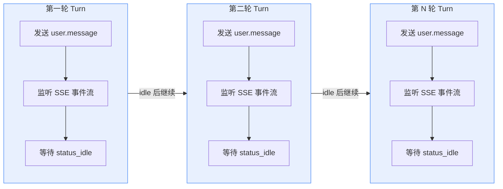

1. 发送 `user.message` 事件
2. 监听 **SSE** 事件流
3. 等待 `session.status_idle` 事件
4. 发送下一条 `user.message`

```json
#!/bin/bash
# 多轮对话示例
BASE_URL="https://api.qoder.com/api/v1/cloud"
SESSION_ID="sess_019e5ce0bf9074b69c3481e93771a522"
HEADERS=(
  -H "Authorization: Bearer $QODER_ACCESS_TOKEN"
)

# 第一轮：提出需求
curl -s -X POST "$BASE_URL/sessions/$SESSION_ID/events" \
  "${HEADERS[@]}" \
  -H "Content-Type: application/json" \
  -d '{"events": [{"type": "user.message", "content": [{"type": "text", "text": "创建一个 Python Flask 项目脚手架。"}]}]}'

# 等待处理完成...（轮询或监听 SSE）
sleep 30

# 第二轮：追加要求
curl -s -X POST "$BASE_URL/sessions/$SESSION_ID/events" \
  "${HEADERS[@]}" \
  -H "Content-Type: application/json" \
  -d '{"events": [{"type": "user.message", "content": [{"type": "text", "text": "给项目添加单元测试和 CI 配置。"}]}]}'
```

1. 请始终等待 `session.status_idle` 后再发送下一条消息
2. 在 Session 仍处于 `running` 时发消息会返回 **HTTP 409**

## 最佳实践

| 最佳实践       | 描述                                                         |
| -------------- | ------------------------------------------------------------ |
| **版本锁定**   | 生产环境始终使用 `{"id": ..., "type": "agent", "version": ...}` 形式创建 Session，避免因 Agent 更新导致行为变化 |
| **元数据标记** | 用 `metadata` 记录**业务上下文**（任务 ID、触发来源等），便于**追溯**和**调试** |
| **及时取消**   | 不再需要的 Session 及时 cancel，**释放计算资源**             |

## 常见问题

> Q: 向 running 状态的 Session 发消息会怎样？

A: 会返回 **HTTP 409**，`type: "invalid_request_error"`，错误信息为 *"Session is currently processing a turn. Cancel the current turn or wait for completion."*。需要先**取消**当前轮（cancel）或**等待** Session 回到 `idle`，再发送新消息。

> Q: 取消后的 Session 还能继续用吗？

A: 可以。cancel 后状态从 `canceling` 自动回到 `idle`，Session 保持**可用** - 直接发送下一条 `user.message` 即可**继续对话**。仅 `archived` 和 `terminated` 是**终态**。

> Q: 如何获取 Session 的完整对话历史？

A: 通过 `GET /api/v1/cloud/sessions/{id}/events` 获取该 **Session** 的**所有事件**，包括**用户消息**和 **Agent 响应**。

> Q: SSE 断线怎么重连？

A: 重连时在请求头中传入 `Last-Event-ID`，服务端会从该 ID 之后**重放事件**。

> Q: GET /api/v1/cloud/environments 返回空数组？

A: 请检查你的 **PAT** 或 **SAT** 是否具有**目标工作区**的权限。**Environment 的访问范围**取决于**认证主体的权限**。

# SSE 事件流

Qoder Cloud Agents 通过 **Server-Sent Events (SSE)** 流式输出 Session 公开事件

## 多连接模型

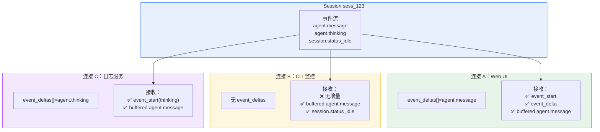

**关键特性**：
- **同一 Session** 支持多个**并发 SSE 连接**
- `event_deltas[]` 参数**只对当前连接生效**
- 不同连接可以有不同的增量配置，**互不影响**

**典型场景**：
- **Web UI**：请求 `agent.message` 增量，实现**流式显示**
- **CLI 监控**：只收**完整事件**和**状态变化**
- **日志服务**：请求 `agent.thinking` 增量，记录**推理过程**

## 连接 URL

```
GET https://api.qoder.com/api/v1/cloud/sessions/{session_id}/events/stream
```

请求头：

```
Authorization: Bearer $QODER_ACCESS_TOKEN
Accept: text/event-stream
```

1. 默认情况下，**Agent 响应**会在**生成完成**后，以**完整公开事件**（例如 `agent.message`）的形式写入 **Session 事件历史**并通过 **stream 输出**。下文将这种**完整事件**称为 **buffered 事件**。
2. Stream endpoint 支持使用 `Last-Event-ID` header **断线重连**。对于**普通 buffered 事件**，stream 从该 ID 之后继续；**在途 event delta** 的特殊行为见下文。
3. 使用 `event_deltas[]` 可在**当前 stream 连接**中**增量接收 Agent 响应**。重复传入该参数可**同时请求**两种支持的事件类型：`agent.message` + `agent.thinking`
4. 该选项只对**当前 stream 连接**生效，不会影响**同一 Session 的其它连接**。不传 `event_deltas[]` 时，连接只会在**响应完成**后收到**完整事件**。Thread event stream 不支持该参数。

```
GET /api/v1/cloud/sessions/{session_id}/events/stream?event_deltas[]=agent.message
GET /api/v1/cloud/sessions/{session_id}/events/stream?event_deltas[]=agent.thinking
GET /api/v1/cloud/sessions/{session_id}/events/stream?event_deltas[]=agent.message&event_deltas[]=agent.thinking
```

## SSE 格式

每条事件使用**标准 SSE 字段**：

```json
id: evt_019e392c0d787cfaa21bda98e06cd913
event: agent.message
data: {"id":"evt_019e392c0d787cfaa21bda98e06cd913","type":"agent.message","content":[{"type":"text","text":"Hello"}],"processed_at":"2026-05-18T03:40:48.888851795Z"}
```

**服务端**可能发送 **heartbeat** comment 以保持连接。

## Event Delta

### 增量输出机制

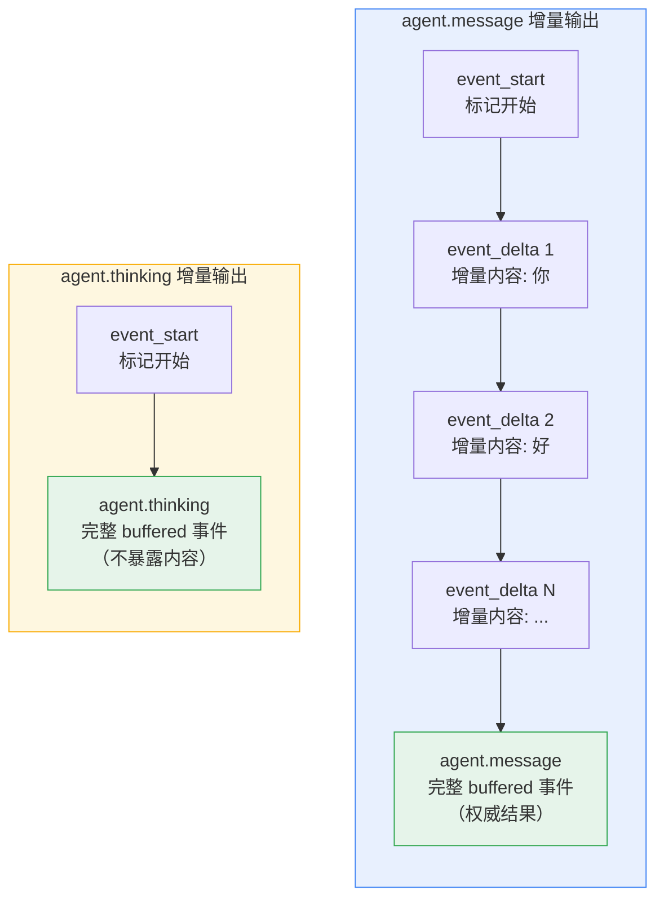

**关键特性**：
- **agent.message**：`event_start` → 多个 `event_delta` → `agent.message`（完整）
- **agent.thinking**：`event_start` → `agent.thinking`（完整，无内容暴露）
- 所有帧使用**相同 ID**（`evt_...`）

`agent.message` 的**增量输出**以 `event_start` 开始，随后输出一个或多个 `event_delta`：

```json
id: evt_00jjujk9fbnr4wkj2gh8
event: event_start
data: {"event":{"id":"evt_00jjujk9fbnr4wkj2gh8","type":"agent.message"},"type":"event_start"}

id: evt_00jjujk9fbnr4wkj2gh8
event: event_delta
data: {"delta":{"content":{"text":"你好","type":"text"},"index":0,"type":"content_delta"},"event_id":"evt_00jjujk9fbnr4wkj2gh8","type":"event_delta"}
```

`agent.thinking` 的**增量输出**只有**开始事件**，不会输出 `event_delta`：

```json
id: evt_00jjujk9fbnr55q5rtyp
event: event_start
data: {"event":{"id":"evt_00jjujk9fbnr55q5rtyp","type":"agent.thinking"},"type":"event_start"}
```

对于同一个 **message** 或 **thinking** 事件，SSE `id:`、`event_start.event.id`、每个 `event_delta.event_id` 以及后续 buffered 事件的 `id` 完全相同。

### 完整事件流顺序

同时请求**两种事件类型**时，典型顺序如下：

```mermaid
flowchart LR
    E1["span.model_request_start"]
    E2["event_start<br/>agent.thinking"]
    E3["agent.thinking<br/>（完整）"]
    E4["event_start<br/>agent.message"]
    E5["event_delta<br/>agent.message"]
    E6["agent.message<br/>（完整）"]
    E7["span.model_request_end"]
    
    E1 --> E2 --> E3 --> E4 --> E5 --> E6 --> E7
    
    style E1 fill:#e8f0fe,stroke:#4285f4
    style E2 fill:#fef7e0,stroke:#f9ab00
    style E3 fill:#fef7e0,stroke:#f9ab00
    style E4 fill:#e8f0fe,stroke:#4285f4
    style E5 fill:#e8f0fe,stroke:#4285f4
    style E6 fill:#e6f4ea,stroke:#34a853
    style E7 fill:#e8f0fe,stroke:#4285f4
```

**Event delta 帧**的 **JSON payload** 不包含顶层 `id` 或 `processed_at` 字段，也不会出现在事件 **list/history** 响应中。

> **Event Delta 的本质**：
> - ❌ **不是完整事件**：缺少标准事件字段（`id`、`processed_at`）
> - ❌ **不保存到历史**：不会出现在事件 list/history 响应中
> - ✅ **仅用于流式传输**：只存在于 SSE 实时流中
> 
> **设计目的**：
> - 📺 **流式显示**：支持实时打字效果（类似 ChatGPT）
> - ⚡ **降低延迟感**：用户无需等待完整响应生成
> 
> **权威结果**：
> - 只有最终的 **buffered `agent.message`** 才是完整事件
> - 它会被保存到事件历史，可用于重放和查询

buffered `agent.message` 是**权威结果**，`agent.thinking` **不会暴露思考内容**。

## Event Delta 期间重连

### 具体场景示例

> **核心概念**：`event_start` 是 Agent 开始生成一个新 `agent.message` 时发送的**开始标记事件**。下面的三种场景都是相对于**同一个正在生成中的 message** 的 `event_start` 来说的。

**断线重连**时使用 SSE `Last-Event-ID` header。具体行为取决于**游标位置**，以及当前 message 是否**仍在生成**：

#### 🟢 场景 1：游标在 event_start 之前

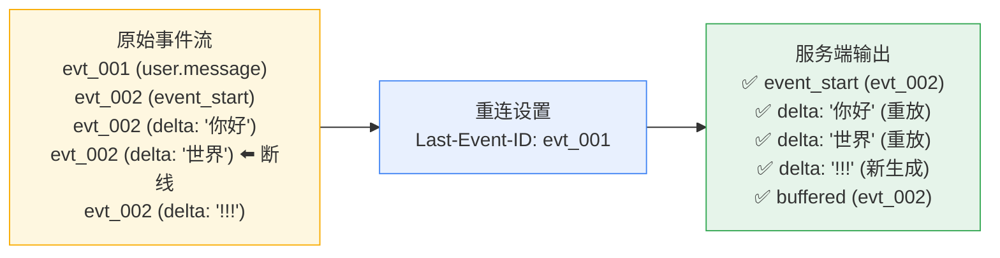

**特点**：完整重建，重放所有历史增量

#### 🟡 场景 2：游标等于 event_start.id

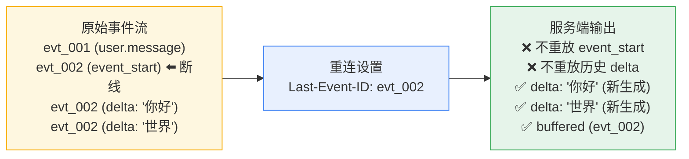

**特点**：节省带宽，只获取新增内容

#### 🔵 场景 3：Message 已生成完成

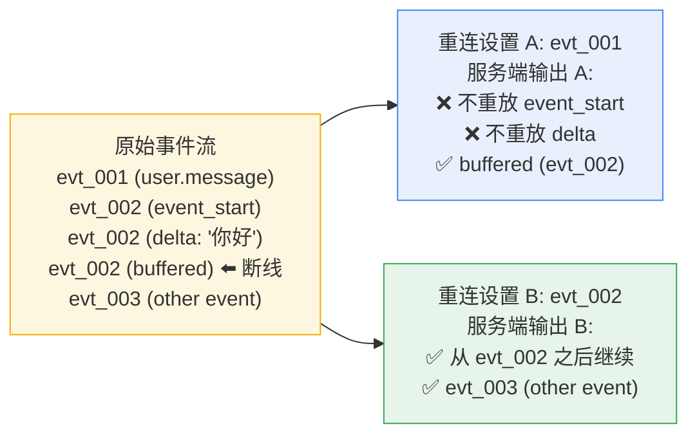

### 三种场景对照表

| 场景 | 游标位置 | Message 状态 | 服务端行为 | 用途 |
|------|----------|-------------|-----------|------|
| **🟢 场景 1** | 在 `event_start` 之前 | 仍在生成 | 重放 `event_start` + 历史 `delta` + 新 `delta` + `buffered` | 需要**完整重建增量事件** |
| **🟡 场景 2** | 等于 `event_start` 的 ID | 仍在生成 | 只输出新生成的 `delta` + `buffered`（不重放历史） | 节省带宽，**只获取新增内容** |
| **🔵 场景 3** | 任意位置 | 已生成完成 | 只输出 `buffered` 事件（无 `delta` 重放） | 跳过增量，**直接获取最终结果** |

### 客户端处理策略

**同一个增量事件**的**所有帧**使用**相同 ID**。根据**重连需求**选择策略：

| 需求 | 推荐做法 | Last-Event-ID 设置 |
|------|----------|-------------------|
| **完整重建增量事件** | 游标回退到 `event_start` **之前**的 buffered 事件 | 使用 `evt_001`（event_start 之前的 ID） |
| **继续接收新增量** | 使用当前 `event_start.event.id` 作为游标 | 使用 `evt_002`（event_start 的 ID） |
| **跳过增量获取结果** | 等待生成完成后再重连 | 使用任意已接收的 ID |

> **⚠️ 去重提醒**：同一 ID 的 `event_delta` 可能在场景 1 中重复接收，建议客户端根据 `event_id` 进行去重处理。

## 常见事件流

```
session.status_running
session.thread_status_running
user.message
span.model_request_start
agent.thinking
agent.tool_use
agent.tool_result
agent.message
span.model_request_end
session.thread_status_idle
session.status_idle
```

### 一个 Turn 的完整事件时序

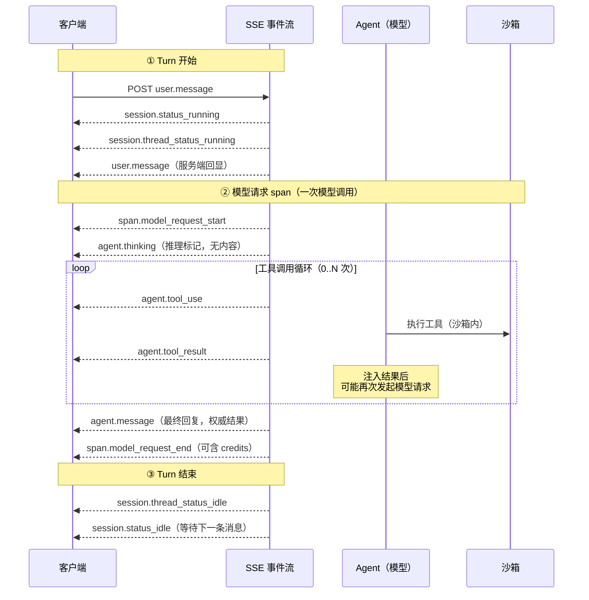

### 事件分组速查

| 阶段 | 事件 | 说明 |
|------|------|------|
| **Turn 开始** | `session.status_running` → `session.thread_status_running` → `user.message` | 状态切换 + 服务端回显用户消息 |
| **模型请求 span** | `span.model_request_start` ... `span.model_request_end` | 一对 start/end 包裹一次模型调用，end 可含 `model_usage.credits` |
| **Agent 活动** | `agent.thinking` / `agent.tool_use` / `agent.tool_result` / `agent.message` | **thinking** 与 **tool** 调用可**交替出现多轮**，`agent.message` 是**最终回复** |
| **Turn 结束** | `session.thread_status_idle` → `session.status_idle` | 回到 idle，可发送下一条消息 |

1. **并非每一轮**都会包含**全部事件**
2. **Managed-agent Session** 还可能产生 `session.thread_created`、`session.thread_status_running`、`agent.thread_message_sent`、`agent.thread_message_received` 等 **thread 事件**

> 模型请求 span

1. `span.model_request_start` 包含 `id`、`processed_at` 和 `type`
2. 与之配对的 `span.model_request_end` 包含 `id`、`is_error`、`model_request_start_id`、`processed_at` 和 `type`，其中 `model_request_start_id` 等于对应 start 事件的 `id`
3. 本次模型调用有 **credits** 数据时，end 事件还包含 `model_usage: {"credits": 1.25}`；`credits` 向下取整，最多保留 2 位小数
4. 说明：公开的 `agent.thinking` 事件 **payload** 只包含 `id`、`processed_at`、`type` 三个字段，**思考内容不对外公开**
   - 把该事件当作"**Agent 暂停推理**"的标记即可
   - 其它若干 **agent.*** 事件也可能省略 `processed_at`，解析时请将其视为可选字段

## 连接生命周期

| 生命周期                                         | 描述                                                         |
| ------------------------------------------------ | ------------------------------------------------------------ |
| `session.status_idle`                            | 表示当前 turn 结束，连接应当保持，**等待下一轮**             |
| `session.status_terminated` 和 `session.deleted` | 是**终态事件** - 客户端应停止重连，不会再有更多事件          |
| `session.status_rescheduled`                     | 是**临时信号**，连接可能**短暂断开**，运行时恢复后会**自动重连** |
|                                                  | **网络中断**时使用 **Last-Event-ID header** 重连；在**途增量事件**的特殊处理见 **Event Delta 期间重连** |

## 工具响应

当**事件流**产生需要确认的 `agent.tool_use` 时，向 `POST /api/v1/cloud/sessions/{session_id}/events` 发送 `user.tool_confirmation`，并使用**工具事件 ID**：

```json
{
  "events": [
    {
      "type": "user.tool_confirmation",
      "tool_use_id": "evt_01JZ6Q3FB6SG8F7J1M2N",
      "result": "allow"
    }
  ]
}
```

当**事件流**产生 `agent.custom_tool_use` 时，**由客户端执行自定义工具**，并发送 `user.custom_tool_result`。

## 事件历史

**历史事件**和分页请使用 list endpoint：

```
curl -s "https://api.qoder.com/api/v1/cloud/sessions/$SESSION_ID/events?limit=20&order=desc" \
  -H "Authorization: Bearer $QODER_ACCESS_TOKEN"
```

# 访问 GitHub

1. 把 **GitHub 仓库**挂载到 **Session 容器**，让 Agent 直接读取、修改代码并提交 **Pull Request**
2. Qoder Cloud Agents 支持把 GitHub 仓库作为 Session 的**资源**挂载到容器中
3. Session 启动后，平台会**自动 clone 仓库**到**指定路径**，Agent 可以像在**本地工作树**中一样读取、修改、提交、推送代码，并配合 [gh CLI](https://cli.github.com/) 创建 Pull Request
4. **仓库资源的归属**与 Session 一致
   - **Session 归档**后**挂载关系一并失效**，Session 期内若需要**替换仓库**或**修改克隆路径**，必须**创建新的 Session**

## 核心流程

1. **准备 GitHub 令牌**
   - 生成 **GitHub Personal Access Token**（推荐使用 **fine-grained PAT**），授予仓库读取/写入、Pull Request 等所需权限。该 token 是 GitHub 仓库资源的**必填字段**。
2. **创建 Session 时挂载仓库**
   - 在创建 Session 的 `resources` 数组中加入 `type: "github_repository"`，把**仓库 URL** 与 **PAT** 一并传入。
3. **Agent 在容器内访问代码**
   - Agent 启动后即可在**挂载路径**下读取代码，使用 `Bash`/`Read`/`Write`/`Edit` 等工具修改文件。
4. **（可选）创建 Pull Request**
   - Agent 在仓库目录中使用 `git push` 推送分支，再调用 gh CLI 创建 **Pull Request**。

> 文件持久化

1. **仓库资源的克隆**与**容器临时存储**共享**同一份磁盘空间**
2. 容器临时存储在**连续 24 小时未活跃**后可能**被回收**；回收后再次**唤醒 Session** 时，平台会**重新初始化容器**并**按需重新克隆仓库**，磁盘**上未提交的中间产物**会**丢失**
3. 请**及时 commit 并 push**，或通过 **Files API** 保存**重要产物**

## 仓库资源字段

GitHub 仓库资源使用以下字段；推荐在**创建 Session** 时**一次性传入**：

| 字段                  | 类型   | 必填 | 说明                                                         |
| --------------------- | ------ | ---- | ------------------------------------------------------------ |
| `type`                | string | 是   | 固定为 `"github_repository"`                                 |
| `url`                 | string | 是   | 仓库 URL，例如 `https://github.com/your-org/your-repo`       |
| `mount_path`          | string | 否   | 克隆到**容器中的路径**。省略时**按仓库名自动推断**           |
| `authorization_token` | string | 是   | **GitHub Personal Access Token**，用于**克隆**与**推送**仓库 |

1. `authorization_token` 仅在**创建请求**或 **token 轮转请求**中传入
2. 读取 **Session 详情**或 **Session resources** 时**不会返回**该字段
3. 建议每个 Session 使用**最小权限**的 **PAT**，并在**用完后吊销**

## 创建 Session 时挂载 GitHub 仓库

调用 [创建 Session](https://docs.qoder.com/zh/cloud-agents/api/sessions/create) 接口，在 `resources[]` 中传入**仓库描述**：

```json
curl -s -X POST https://api.qoder.com/api/v1/cloud/sessions \
  -H "Authorization: Bearer $QODER_ACCESS_TOKEN" \
  -H "Content-Type: application/json" \
  -d '{
    "agent": {"id": "agent_019e5ce0bf307a1a8f952eb814aea3d5", "type": "agent", "version": 2},
    "environment_id": "env_019e44eb66bb748cabcd1489f6fa4428",
    "title": "为 your-repo 修复 bug",
    "resources": [
      {
        "type": "github_repository",
        "url": "https://github.com/your-org/your-repo",
        "mount_path": "/data/workspace/your-repo",
        "authorization_token": "ghp_xxxxxxxxxxxxxxxxxxxxxxxxxxxx"
      }
    ]
  }' | jq .
```

成功返回 **HTTP 200 OK**，`resources` 字段包含**归一化**后的**挂载描述**。响应中**不会返回 token**：

```json
{
  "id": "sess_019e5ce0bf9074b69c3481e93771a522",
  "type": "session",
  "agent": {
    "id": "agent_019e5ce0bf307a1a8f952eb814aea3d5",
    "type": "agent",
    "name": "code-reviewer",
    "description": "",
    "model": {"id": "ultimate", "effective_context_window": 200000},
    "system": "你是代码审查专家。",
    "tools": [
      {
        "type": "agent_toolset_20260401",
        "enabled_tools": ["Bash", "Read", "Write", "Edit", "Glob", "Grep"]
      }
    ],
    "skills": [],
    "version": 2
  },
  "environment_id": "env_019e44eb66bb748cabcd1489f6fa4428",
  "status": "idle",
  "title": "为 your-repo 修复 bug",
  "metadata": {},
  "resources": [
    {
      "type": "github_repository",
      "url": "https://github.com/your-org/your-repo",
      "mount_path": "/data/workspace/your-repo",
      "checkout": null,
      "created_at": "2026-05-18T12:00:00Z",
      "updated_at": "2026-05-18T12:00:00Z"
    }
  ],
  "vault_ids": [],
  "deployment_id": null,
  "outcome_evaluations": [],
  "stats": {
    "active_seconds": 0,
    "duration_seconds": 0
  },
  "environment_variables": {},
  "archived_at": null,
  "created_at": "2026-05-18T12:00:00Z",
  "updated_at": "2026-05-18T12:00:00Z"
}
```

1. Agent 命令默认 **cwd** 为 `/data`
2. 建议把 `mount_path` 设为 `/data/workspace/<repo-name>`，并在 system prompt 或用户消息中**明确仓库路径**。

## 挂载多个仓库

**一次请求**即可**挂载多个仓库**到不同 `mount_path`，例如同时挂载前端和后端代码：

```json
curl -s -X POST https://api.qoder.com/api/v1/cloud/sessions \
  -H "Authorization: Bearer $QODER_ACCESS_TOKEN" \
  -H "Content-Type: application/json" \
  -d '{
    "agent": {"id": "agent_019e5ce0bf307a1a8f952eb814aea3d5", "type": "agent", "version": 2},
    "environment_id": "env_019e44eb66bb748cabcd1489f6fa4428",
    "title": "全栈联调",
    "resources": [
      {
        "type": "github_repository",
        "url": "https://github.com/your-org/frontend",
        "mount_path": "/data/workspace/frontend",
        "authorization_token": "ghp_xxxxxxxxxxxxxxxxxxxxxxxxxxxx"
      },
      {
        "type": "github_repository",
        "url": "https://github.com/your-org/backend",
        "mount_path": "/data/workspace/backend",
        "authorization_token": "ghp_xxxxxxxxxxxxxxxxxxxxxxxxxxxx"
      }
    ]
  }' | jq .
```

也可以与**文件**、**Memory Store**、**Vault** 等其他资源混用，详见 [Sessions — 创建时挂载资源](https://docs.qoder.com/zh/cloud-agents/sessions#创建时挂载资源)。

## 令牌权限模型

1. GitHub 提供两种 PAT：**fine-grained PAT**（推荐）和 **classic PAT**
2. 在 Qoder Cloud Agents 中使用时，按"**最小权限原则**"申请仅与本次任务相关的权限

### 推荐权限对照

下表给出常见 Agent 操作对应的 **fine-grained PAT** 权限。**classic PAT** 对应的是**仓库范围**的 `repo` scope。

| Agent 操作               | fine-grained PAT 权限（Repository permissions） |
| ------------------------ | ----------------------------------------------- |
| 克隆/读取私有仓库        | `Contents: Read`                                |
| 创建分支并推送           | `Contents: Read & Write`                        |
| 创建 / 评论 Pull Request | `Pull requests: Read & Write`                   |
| 读取 Issues              | `Issues: Read`                                  |
| 创建 / 评论 Issues       | `Issues: Read & Write`                          |
| 读取仓库元信息（必备）   | `Metadata: Read`                                |

1. **fine-grained PAT** 可绑定到**具体仓库**（甚至特定的 **organization** 资源），相比 classic PAT **风险更低**
2. 建议为**每个 Agent 任务**申请**独立**的、**短期有效**的 **PAT**

### 安全建议

1. 不要将包含 `authorization_token` 的 Session 创建或 token 轮转请求写入**日志**、**截图**或**版本库**。Session 查询响应**不会返回 PAT**
2. **任务完成后**及时在 GitHub 设置中**吊销 PAT**；fine-grained PAT 也支持设置**较短**的 `Expiration`
3. 即使是**公开仓库**也需要传入 **PAT**；建议为公开仓库使用**只读、短期有效**的 **token**，将**权限暴露面**降到最低
4. 不同环境（开发 / 生产）使用不同的 PAT，便于**审计**

## 创建 Pull Request 工作流

1. Agent 在挂载好的仓库目录中可以直接执行 `git` 与 `gh` 命令
2. 运行**镜像**已内置 `git` 与 **gh CLI**，平台也会用仓库资源的 `authorization_token` **自动**为容器配置 `GH_TOKEN`，无需手动安装或导出环境变量
3. 要让 Agent 完成"修改 -> push -> 创建 PR"全流程，只需：
   - Agent 配置中启用 `agent_toolset_20260401` 工具集，至少包含 `Bash`、`Read`、`Write`、`Edit`
   - 在 user message 中清晰描述任务、仓库路径与目标分支

下面是一个端到端示例，假设 Session ID 为 `sess_019e5ce0bf9074b69c3481e93771a522`、仓库挂载在 `/data/workspace/your-repo`：

```json
curl -s -X POST "https://api.qoder.com/api/v1/cloud/sessions/sess_019e5ce0bf9074b69c3481e93771a522/events" \
  -H "Authorization: Bearer $QODER_ACCESS_TOKEN" \
  -H "Content-Type: application/json" \
  -d '{
    "events": [
      {
        "type": "user.message",
        "content": [
          {
            "type": "text",
            "text": "请在 /data/workspace/your-repo 中修复 issue #128（用户登录后无法刷新 token）。完整流程：\n1) cd /data/workspace/your-repo；\n2) git checkout -b fix/refresh-token；\n3) 修复 src/auth/refresh.ts 中的 bug 并补充单测；\n4) git add 改动并 git commit -m \"fix(auth): rotate refresh token on login\"；\n5) git push -u origin fix/refresh-token；\n6) 用 gh pr create --base main --head fix/refresh-token --title \"fix(auth): rotate refresh token on login\" --body \"Fixes #128\" 创建 Pull Request。"
          }
        ]
      }
    ]
  }'
```

1. 平台会用仓库资源的 `authorization_token` 自动为容器配置 `GH_TOKEN`，`gh pr create` 在容器内可直接调用
2. 如果该 PAT 没有 `Pull requests: Read & Write` 权限，PR 创建会失败；申请 PAT 时请按上文 [推荐权限对照](https://docs.qoder.com/zh/cloud-agents/github-repositories#推荐权限对照) 一并授予

## 配合 Agent 配置的最佳实践

1. 在 Agent 的 `tools` 中启用 `Bash`、`Read`、`Write`、`Edit`、`Glob`、`Grep`，覆盖**代码搜索**与**修改**场景。
2. 在 Agent 的 `system` 提示中明确**仓库挂载路径**，例如："你的仓库目录是 `/data/workspace/your-repo`，所有 git 与 `gh` 操作都应在该目录下执行。"
3. 对**长任务**可以在 system prompt 中要求 Agent 在每轮结束时执行 `git status` 自检，避免漏 commit。
4. 如需**跨 Session 复用产物**，让 Agent 在每轮结束前用 [Files API](https://docs.qoder.com/zh/cloud-agents/files) **上传关键产物**（patch 文件、报告）；沙箱被**回收**或**重建**后，**未上传的中间文件**可能**丢失**。

## 常见问题

> Q: 仓库太大，克隆很慢怎么办？

A: 当前资源挂载使用**完整 clone**，资源字段里**没有浅克隆开关**。对于体积非常大的 monorepo，建议**拆分任务范围**，或使用 [Files API](https://docs.qoder.com/zh/cloud-agents/files) 上传关键子目录/文件作为补充上下文。

> Q: PAT 过期或被吊销了怎么办？

A: 后续 git/`gh` 操作会返回 401。需要**创建新的 Session 并使用新 PAT**；对于**已挂载但尚未推送的修改**，可以让 Agent 在 Session 内先 `git diff` 输出 **patch**，再用 [Files API](https://docs.qoder.com/zh/cloud-agents/files) 上传**备份**。

> Q: 是否支持 fork 私有仓库或访问 organization 内部仓库？

A: 支持，只要 PAT 对**目标仓库**具备 `Contents: Read` 权限即可。组织开启了 SSO 时，PAT 必须先经过 **SSO** 授权（Authorize 按钮）才能用于克隆。

> Q: 是否支持 git submodule？

A: 仓库资源**不会额外声明 submodule 字段**。需要使用 submodule 时，让 Agent 在仓库目录中执行 `git submodule update --init --recursive`，并确保 **PAT** 对**所有 submodule 仓库**都有**读权限**。

> Q: Session 运行中能换仓库吗？

A: **不能**。一旦 Session 创建完成且某个仓库已挂载，挂载关系不会因为 **update** 调用而被替换。如需**切换仓库**，请创建**新的 Session**。

> Q: Agent 修改的代码会自动推回 GitHub 吗？

A: 不会。除非 Agent 在任务中显式执行 `git push`，所有修改只存在于**容器临时存储**。请在 user message 中明确要求"push 分支"或"创建 PR"。

> Q: GitHub Enterprise Server (GHES) 是否支持？

A: GitHub 仓库资源只暴露 `url`、`mount_path` 和 `authorization_token` 字段，没有单独的 **GHES** 配置字段。使用 GitHub Enterprise Server 时，请确认 GHES 端点对外可达，并确认对应 token 可被 `gh`/git 用于该主机。


