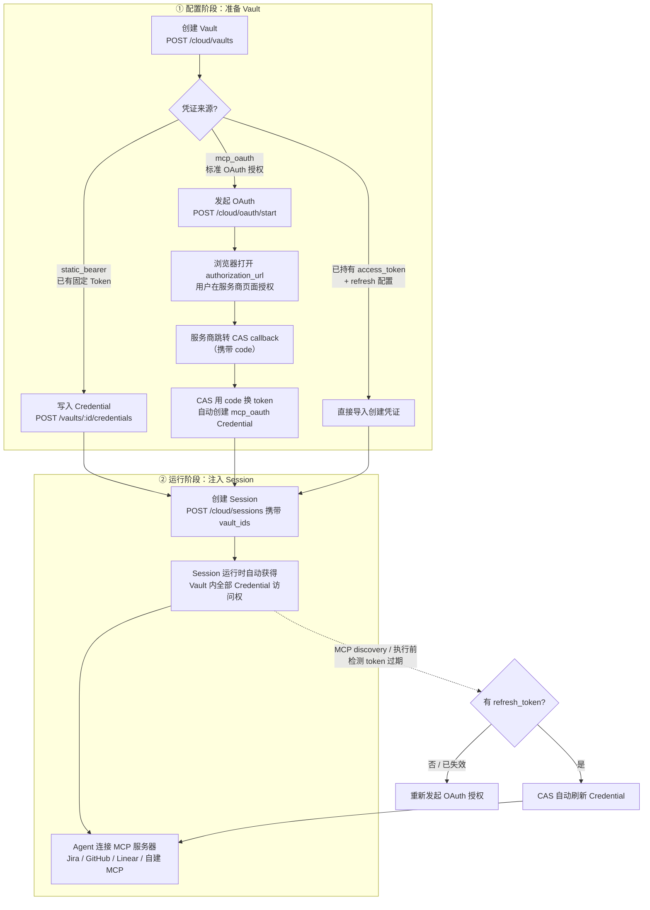
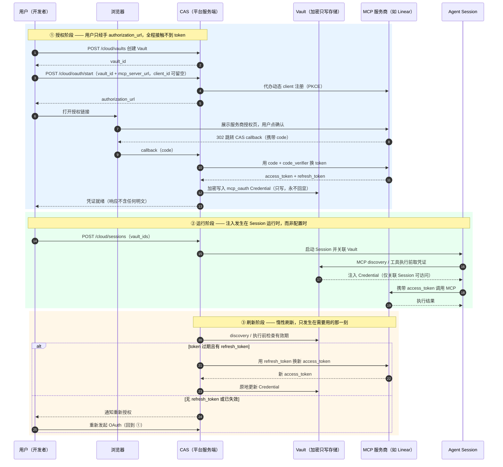
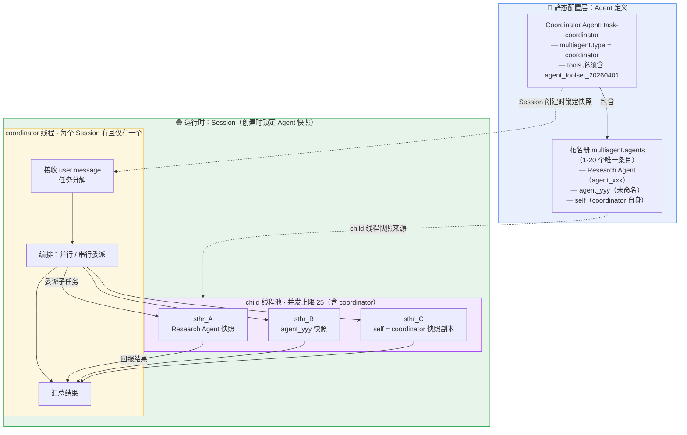
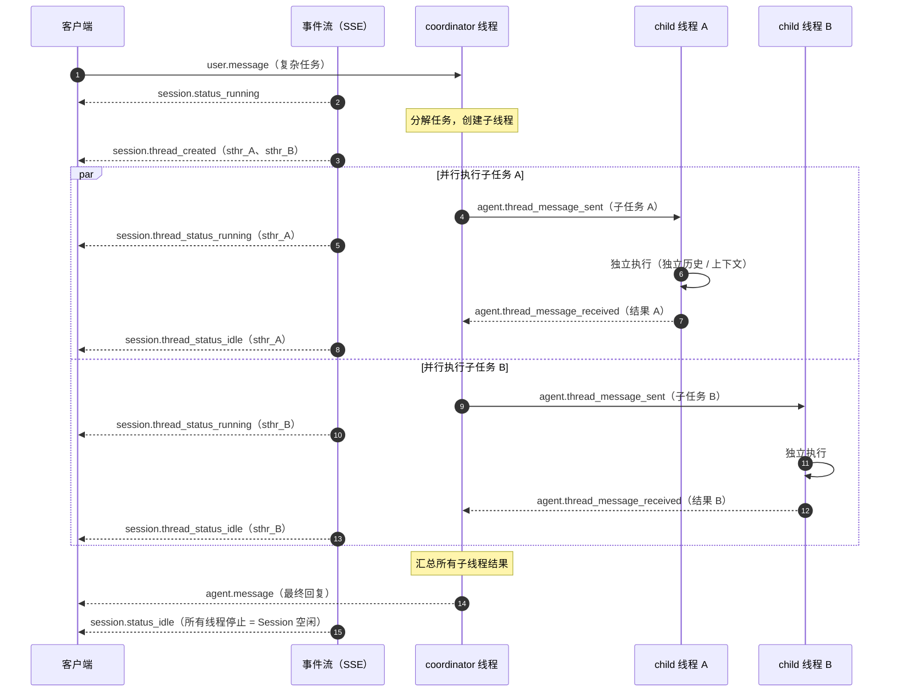
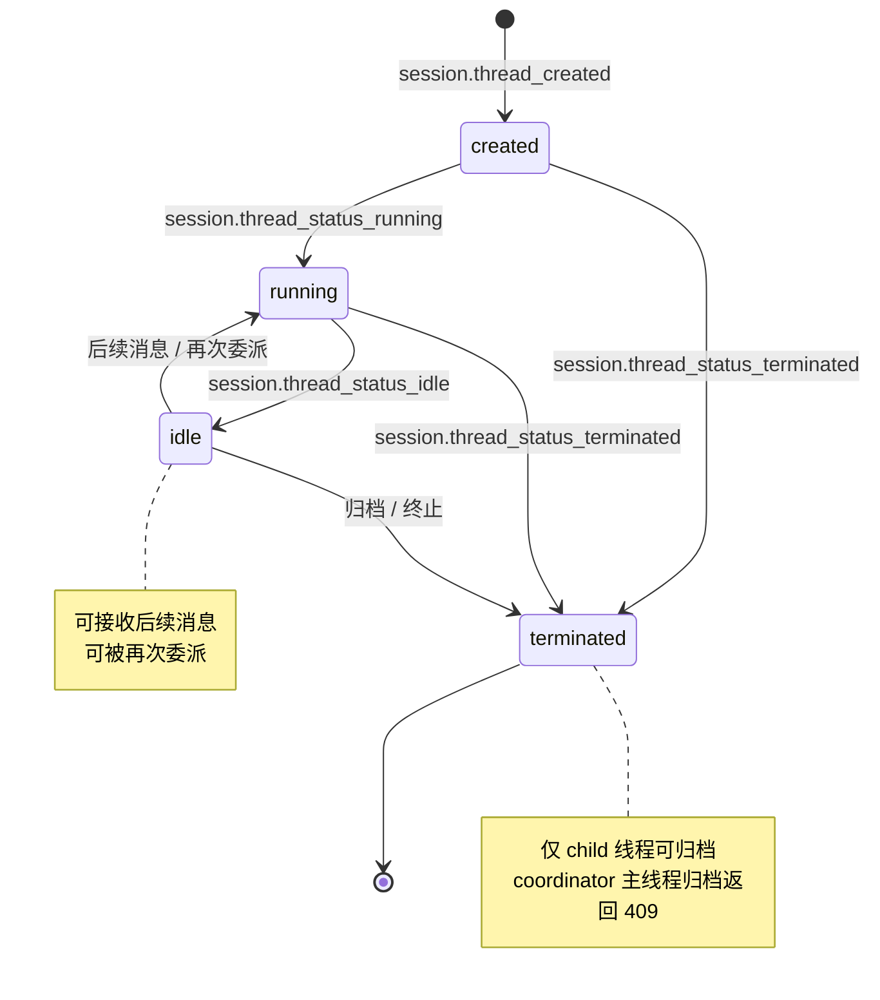

# 使用 Vaults 认证

1. **安全**地**存储凭据**并**注入**到 **Agent Session**
2. Agent 经常需要访问**第三方服务** - GitHub、Jira、数据库、自建 MCP 服务器等
3. Vaults 提供**安全的凭证托管**，让你把 **Token** 交给我们保管，**Session 运行时按需注入**，无需硬编码在代码里

<!-- more -->

## 核心概念

| 概念        | 说明                                            |
| ----------- | ----------------------------------------------- |
| Vault       | **凭证容器**，可包含多个 Credential             |
| Credential  | **单条凭证记录**，绑定到具体 **MCP** 服务器 URL |
| `auth.type` | 凭证鉴权类型：`static_bearer` 或 `mcp_oauth`    |
| `vault_ids` | Session 创建时引用的 Vault ID 列表              |

## 安全性

1. `access_token`**永远不会**在 **API 响应**中返回
2. `token`、`refresh_token`、`client_secret` 等其他**密文**也**永远不会返回**
3. 凭证在**服务端加密存储**
4. 仅关联的 Session 可在**运行时**访问凭证内容

## 完整流程

整体流程图：



配合图理解几个关键点：

| 环节         | 要点                                                                                     |
| ------------ | ---------------------------------------------------------------------------------------- |
| 三种入凭证方式 | **static token** 直接写入；**MCP OAuth** 走**浏览器授权**由 CAS **代换取 token**；已有 token 可直接导入 |
| 注入时机      | 不是配置时就注入，而是 **Session 创建时通过 `vault_ids` 关联、运行时按需注入**                |
| 刷新时机      | 不是定时刷新，而是 **MCP discovery / 执行前** 检查，**惰性刷新**                           |
| 安全模型      | 凭证**服务端加密 + 只写**（API 响应永不返回明文），仅关联的 Session 可访问                    |
| 应急         | 泄露时**删除 Credential** + **平台侧吊销** + 重建；轮换用 update API **原地更新**后 validate 确认 |

### MCP Auth 时序：用户视角 × 平台视角

上面的流程图偏**静态总览**，而 MCP OAuth 涉及**浏览器跳转**和**多方交互**，用**时序图**看更直观：

> 注：CAS 指**平台侧服务**（区别于 **Agent Session**） - OAuth 授权发生时 **Session 尚未创建**，能接收 callback、换取 token 的只能是**平台服务**



把两个视角拆开看：

| 阶段   | 用户视角（全程只做 4 件事）        | 平台视角（CAS 背后做的事）                        |
| ------ | -------------------------------- | ------------------------------------------------- |
| 授权   | 创建 Vault、发起授权、浏览器点一次确认 | 代办 client 注册 + PKCE、code 换 token、加密写入 Vault |
| 运行   | 创建 Session 时带上 `vault_ids`     | 运行时把 Credential **注入**给关联的 Session          |
| 刷新   | 什么都不用做（有 refresh_token 时）  | discovery / 执行前**惰性刷新**，失效才通知用户重新授权  |

一句话总结：**token 全程不经过用户之手** —— CAS 与服务商直接交换，加密落库后对 API **只写不回显**，直到 Session 运行时才注入使用。

### 创建 Vault

```json
curl -X POST https://api.qoder.com/api/v1/cloud/vaults \
  -H "Authorization: Bearer $QODER_ACCESS_TOKEN" \
  -H "Content-Type: application/json" \
  -d '{
    "display_name": "我的 GitHub 凭证",
    "metadata": {}
  }'
```

响应示例：

```json
{
  "id": "vault_019e5cdb9c3f71c3b6505eba937a40b4",
  "type": "vault",
  "display_name": "我的 GitHub 凭证",
  "credentials": [],
  "metadata": {},
  "archived_at": null,
  "created_at": "2026-05-18T08:00:00Z",
  "updated_at": "2026-05-18T08:00:00Z"
}
```

### 添加 Credential

使用 **static Bearer token** 时，通过 nested `auth` 为 **Vault** 添加 Credential：

```json
curl -X POST https://api.qoder.com/api/v1/cloud/vaults/vault_019e5cdb9c3f71c3b6505eba937a40b4/credentials \
  -H "Authorization: Bearer $QODER_ACCESS_TOKEN" \
  -H "Content-Type: application/json" \
  -d '{
    "auth": {
      "type": "static_bearer",
      "mcp_server_url": "https://jira.example.com/mcp",
      "token": "jira_token_xxxxxxxx"
    }
  }'
```

响应返回 `type: "vault_credential"` 和经过**脱敏**的 `auth` 对象，不包含任何**密钥明文**

使用 **MCP OAuth** 时，发起**浏览器授权流程**：

```json
curl -X POST https://api.qoder.com/api/v1/cloud/oauth/start \
  -H "Authorization: Bearer $QODER_ACCESS_TOKEN" \
  -H "Content-Type: application/json" \
  -d '{
    "vault_id": "vault_019e5cdb9c3f71c3b6505eba937a40b4",
    "mcp_server_url": "https://mcp.linear.app/mcp",
    "client_id": "",
    "client_secret": ""
  }'
```

1. 打开响应中的 `authorization_url`
2. **服务商**跳转到 **CAS callback** 后，CAS 会使用 **code** 换取 **token**，并在 Vault 中创建 `mcp_oauth` Credential
3. PKCE、client registration 和 callback 行为详见[发起 MCP OAuth](https://docs.qoder.com/zh/cloud-agents/api/vaults/start-oauth)
4. 如果已经持有 **OAuth access token** 和 **refresh** 配置，也可以通过[创建凭证](https://docs.qoder.com/zh/cloud-agents/api/vaults/create-credential)直接导入

### 在 Session 中使用

创建 Session 时通过 `vault_ids` 关联：

```json
curl -X POST https://api.qoder.com/api/v1/cloud/sessions \
  -H "Authorization: Bearer $QODER_ACCESS_TOKEN" \
  -H "Content-Type: application/json" \
  -d '{
    "agent": "agent_xxx",
    "vault_ids": ["vault_019e5cdb9c3f71c3b6505eba937a40b4"]
  }'
```

**Session 运行时**，Agent 将**自动获得** Vault 中**所有 Credential** 的**访问权限**，用于连接对应的 **MCP 服务器**

## 参数说明

| 参数                  | 类型   | 必填                    | 说明                                                         |
| --------------------- | ------ | ----------------------- | ------------------------------------------------------------ |
| `display_name`        | string | 是                      | Vault 显示名称                                               |
| `metadata`            | object | 否                      | 自定义元数据                                                 |
| `auth.type`           | string | 创建凭证时必选          | `static_bearer` 或 `mcp_oauth`                               |
| `auth.mcp_server_url` | string | MCP 凭证必填            | MCP 服务器地址                                               |
| `auth.token`          | string | `static_bearer` 必填    | Bearer Token 值，只写                                        |
| `auth.access_token`   | string | 导入 `mcp_oauth` 时必填 | OAuth access token，只写                                     |
| `auth.expires_at`     | string | 否                      | OAuth access token 过期时间，RFC 3339 格式                   |
| `auth.refresh`        | object | 否                      | OAuth refresh 配置，详见 [Vault 数据结构](https://docs.qoder.com/zh/cloud-agents/api/vaults/schemas#mcp-oauth-refresh-对象) |

## 常见问题

> Q: MCP OAuth token 过期后怎么办？

A: 如果服务商返回了 **refresh token**，CAS 会在 MCP discovery 或执行前**按需刷新 Credential**。没有 refresh token 或 refresh 已失效时，需要**重新发起 OAuth 授权**。

> Q: 能否更新已有 Credential 的 Token？

A: 可以。使用[更新凭证](https://docs.qoder.com/zh/cloud-agents/api/vaults/update-credential)**原地轮换密钥**；轮换 MCP OAuth Credential 后，可使用[校验 MCP OAuth 凭证](https://docs.qoder.com/zh/cloud-agents/api/vaults/validate-credential)确认凭证可用。

> Q: 一个 Session 可以关联多少个 Vault？

A: 没有硬性限制，但建议按服务分组管理，保持清晰。

> Q: Token 泄露了怎么办？

A: 立即**删除**对应 **Credential** 并在**第三方平台吊销 Token**，然后创建新的 Credential。

> Q: 我能查看已存储的 Token 吗？

A: 不能。出于安全考虑，credential 密钥为只写（**write-only**），写入后不可读取，只能删除后重建。

# 托管 Agent

1. 通过 **coordinator Agent** 将**子任务**并行或串行委派给 **child Agent**
1. **Managed Agents** 允许一个 **Agent** 以**协调者（coordinator）身份**向其他 Agent **委派任务**，实现**多 Agent 协作**
1. 每个**子 Agent** 在**独立的 Session Thread** 中运行，具有**独立**的**对话历史**和**执行上下文**

## 核心概念

1. **Managed Agents** 建立在 **Session Thread** 模型之上
2. 一个 **Session** 内可以同时存在**多个 Thread**，每个 **Thread** 绑定一个独立的 **Agent 快照**，拥有**独立**的**对话历史**和**执行上下文**

| 概念               | 说明                                                         |
| ------------------ | ------------------------------------------------------------ |
| **Coordinator**    | 协调者线程，**每个 Session 有且仅有一个**。使用 **Session 创建**时指定的 Agent，负责**编排和分派任务** |
| **Child thread**   | 子线程，绑定 `multiagent.agents` 花名册中的某个 Agent，**独立执行任务**并向 coordinator **回报结果** |
| **Session Thread** | **线程实体**，ID 前缀为 `sthr_`。包含 `role`（**coordinator** 或 **child**）、**独立**的 **Agent 快照**和**状态** |

### 配置与运行时的映射

**花名册配置在 Agent 上，线程创建发生在 Session 运行时**：



| 配置侧（Agent 定义）                             | 运行时侧（Session Thread）                |
| ------------------------------------------------ | ----------------------------------------- |
| **coordinator Agent** 本身（**Session** 的 `agent` 字段） | 唯一的 **coordinator 线程**，负责**编排与汇总** |
| `multiagent.agents` 花名册                       | **child 线程**的快照来源池，**按需创建**   |
| `{"type": "self"}` 条目                          | coordinator 以**自身快照副本**作为**子 Agent** |
| `agent_toolset_20260401`（tools 必需项）          | coordinator 的**委派能力**来源            |

关键理解：**花名册只是「可委派名单」，不等于线程数** —— 实际创建多少 child 线程由 coordinator **运行时按任务决定**；每个线程（无论角色）都有独立的对话历史和执行上下文。

## 配置 Managed Agent

要启用 managed agents 能力，需要在 **Agent 配置**中设置 `multiagent` 字段：

```json
curl -X POST "https://api.qoder.com/api/v1/cloud/agents" \
  -H "Authorization: Bearer $QODER_ACCESS_TOKEN" \
  -H "Content-Type: application/json" \
  -d '{
    "name": "task-coordinator",
    "model": "ultimate",
    "system": "你是一个任务协调者，负责将任务分配给合适的子 Agent。",
    "tools": [
      {
        "type": "agent_toolset_20260401",
        "enabled_tools": ["Bash", "Read", "Write"]
      }
    ],
    "multiagent": {
      "type": "coordinator",
      "agents": [
        {"type": "agent", "id": "agent_019f000000000000000000000000001a", "name": "Research Agent"},
        {"type": "agent", "id": "agent_019f000000000000000000000000002b"},
        {"type": "self"}
      ]
    }
  }'
```

multiagent 字段说明

| 字段     | 类型   | 必选 | 说明                                       |
| -------- | ------ | ---- | ------------------------------------------ |
| `type`   | string | 是   | 必须为 `"coordinator"`                     |
| `agents` | array  | 是   | 可委派的 Agent 花名册，**1-20** 个唯一条目 |

`agents` 数组元素支持三种格式：

| 格式                 | 示例                                                         | 说明                                                |
| -------------------- | ------------------------------------------------------------ | --------------------------------------------------- |
| 对象 `type: "agent"` | `{"type": "agent", "id": "agent_xxx", "version": 2, "name": "Reviewer"}` | 引用其他 Agent。`id` 必填，`version` 和 `name` 可选 |
| 对象 `type: "self"`  | `{"type": "self"}`                                           | 引用 **coordinator** 自身作为**子 Agent**           |
| 字符串简写           | `"agent_xxx"`                                                | 等价于 `{"type": "agent", "id": "agent_xxx"}`       |

配置 `multiagent` 时，`tools` 中必须包含 `agent_toolset_20260401` 类型的工具配置项。

## 线程事件

在 managed agents 场景下，**事件流**中会出现以下新事件类型：

| 事件类型                           | 说明                                                 |
| ---------------------------------- | ---------------------------------------------------- |
| `session.thread_created`           | 创建了新的子线程                                     |
| `session.thread_status_running`    | 线程开始执行                                         |
| `session.thread_status_idle`       | 线程执行完成或暂停                                   |
| `session.thread_status_terminated` | 线程被归档/终止                                      |
| `agent.thread_message_sent`        | 线程间发送消息（**coordinator → child** 或后续消息） |
| `agent.thread_message_received`    | 线程间接收消息（**child → coordinator**）            |

所有**事件**都包含 **session_thread_id** 字段标识**所属线程**。可以通过 **列出线程事件** 和 **线程事件流** 接口按**线程**维度筛选**事件**。

### 线程协作时序



| 观察点           | 说明                                                         |
| ---------------- | ------------------------------------------------------------ |
| 并行 vs 串行     | `par` 块表示并行；串行 = coordinator 收到 A 的回报后，再向 B 发后续消息 |
| 线程隔离         | 每个子线程独立经历 running → idle，内部对话历史与执行上下文**互不可见** |
| 事件归属         | 线程事件靠 `session_thread_id` 区分是哪个线程发出的          |
| Session 空闲条件 | 所有线程（**含 coordinator**）停止运行后，Session 才回到 **idle** |

## 限制

| 项目                                   | 限制                        |
| -------------------------------------- | --------------------------- |
| 每个 Agent 最多配置的**子 Agent 数量** | **20** 个唯一条目           |
| 每个 Session **最多并发线程数**        | **25** 个（含 coordinator） |
| **Session 空闲**条件                   | **所有线程必须停止运行**    |

从**线程事件**反推的**线程状态机**：



1. Session 回到 `idle` 的前提是**所有线程**（**含 coordinator**）都停止运行 - 对应限制表最后一行
2. 并发上限 **25** 指**同时存在**的线程数（含 coordinator），不是累计创建数
3. 花名册上限 **20** 是**配置期**约束，线程并发上限 **25** 是**运行期**约束，两者独立生效

