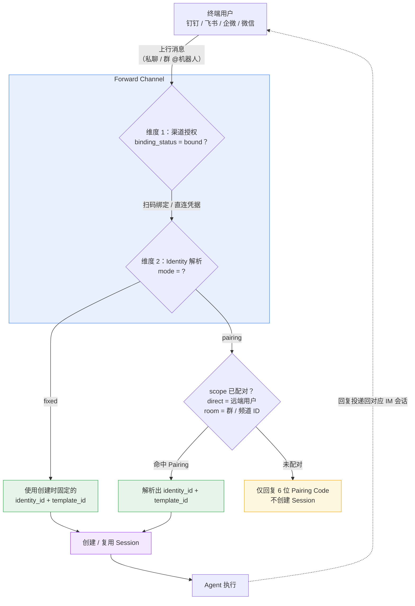
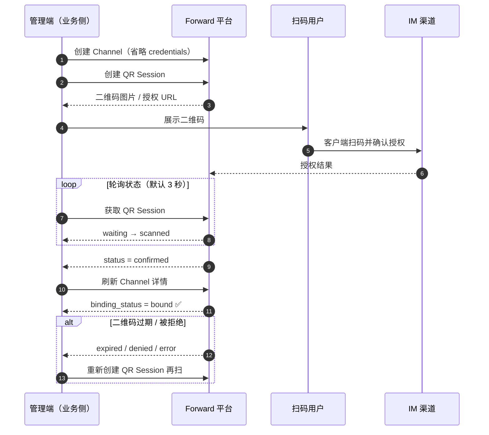
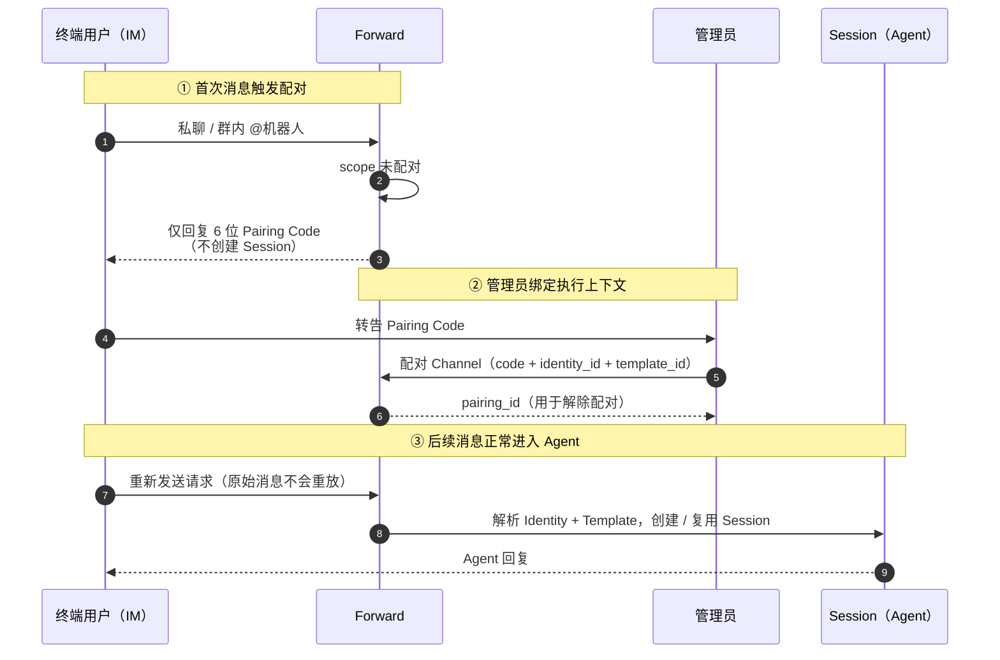
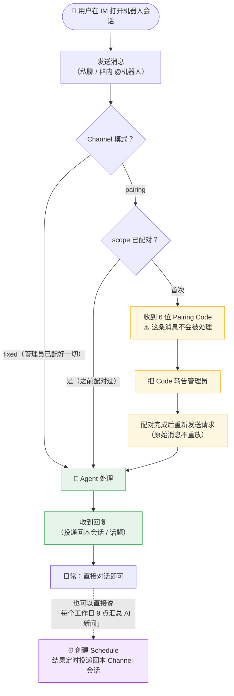
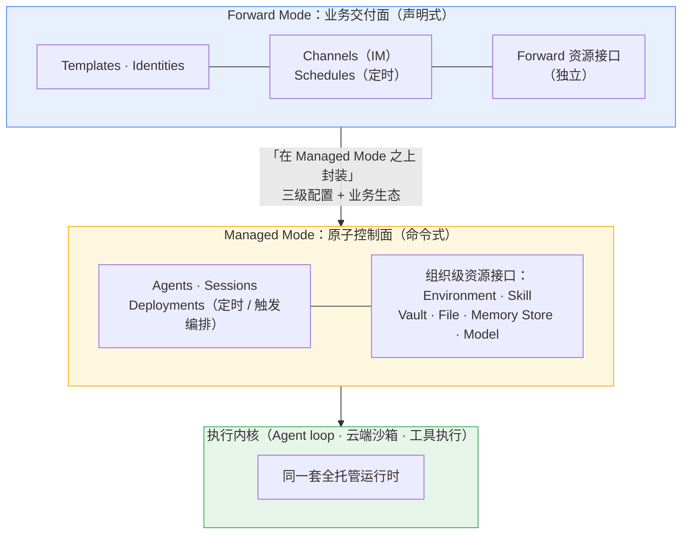
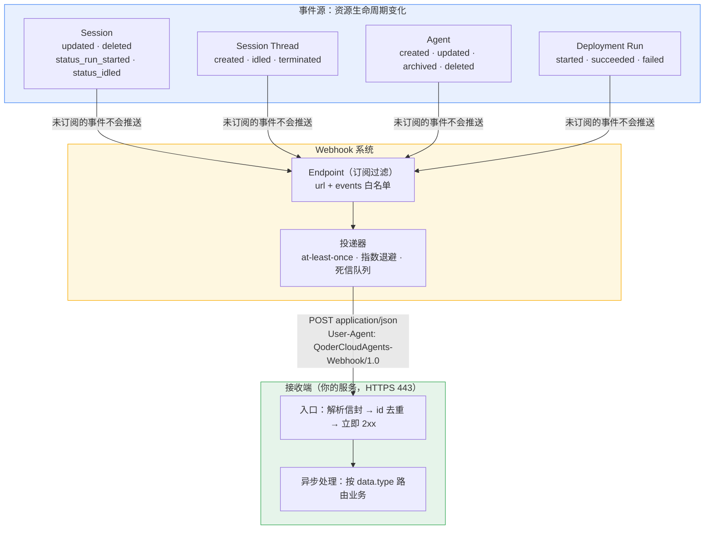
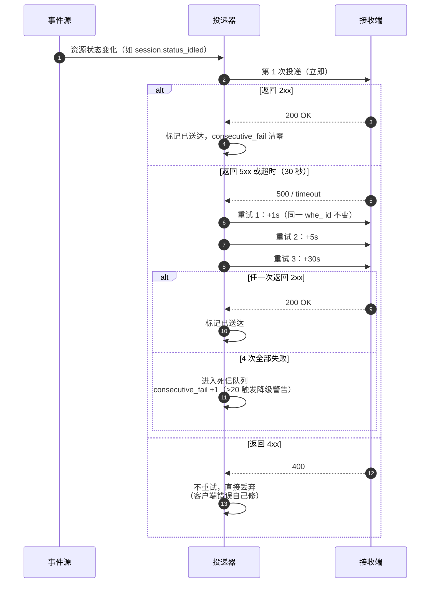

# Schedule

1. 在 **Forward Session** 中使用**自然语言**创建、查询和删除 **Schedule**
2. 除了调用 **Schedule API**，终端用户也可以在 **Web** 或 **IM Channel** 会话中描述**任务内容**和**执行时间**，由 **Agent 创建 Schedule**
3. 创建后，任务会**按约定时间自动运行**，无需保持当前会话在线

<!-- more -->

## 使用前提

当前会话使用的 **Template** 必须启用对应的 **Schedule 托管工具**：

| 能力          | 托管工具                  |
| ------------- | ------------------------- |
| 创建 Schedule | `create_forward_schedule` |
| 查询 Schedule | `list_forward_schedules`  |
| 删除 Schedule | `delete_forward_schedule` |

Template **默认不启用**这些工具。`managed_tool_config` 是 **Template** 请求体的顶层字段，可通过以下接口配置：

| 场景                       | 接口                                           |
| -------------------------- | ---------------------------------------------- |
| 创建 Template 时启用       | `POST /api/v1/forward/templates`               |
| 为已有 Template 启用或调整 | `POST /api/v1/forward/templates/{template_id}` |

创建 Template 时，将 `managed_tool_config` 与 `name`、`model`、`environment_id` 等字段放在同一层：

```json
curl -s -X POST 'https://api.qoder.com/api/v1/forward/templates' \
  -H "Authorization: Bearer $QODER_ACCESS_TOKEN" \
  -H "Content-Type: application/json" \
  -d '{
    "name": "Schedule assistant",
    "model": "ultimate",
    "environment_id": "env_xxx",
    "managed_tool_config": {
      "enabled_tools": [
        "create_forward_schedule",
        "list_forward_schedules",
        "delete_forward_schedule"
      ]
    }
  }'
```

为已有 Template 启用或调整**托管工具**时，只需更新该字段：

```json
curl -s -X POST 'https://api.qoder.com/api/v1/forward/templates/tmpl_xxx' \
  -H "Authorization: Bearer $QODER_ACCESS_TOKEN" \
  -H "Content-Type: application/json" \
  -d '{
    "managed_tool_config": {
      "enabled_tools": [
        "create_forward_schedule",
        "list_forward_schedules",
        "delete_forward_schedule"
      ]
    }
  }'
```

1. 更新时，`enabled_tools` 会**整体替换**当前已启用的 **Schedule 托管工具集合**。详细参数见 [创建 Template](https://docs.qoder.com/cloud-agents/api/forward/templates/create) 和 [更新 Template](https://docs.qoder.com/cloud-agents/api/forward/templates/update)。
2. 如果 Agent 无法执行 **Schedule 管理操作**，可以询问“你当前有哪些工具？”，确认其回答中是否包含上述 Schedule 托管工具。

## 创建 Schedule

在会话中说明以下信息：

1. **什么时候执行**：例如“每天上午 9 点”、“每周一 10 点”或“2 小时后”。
2. **执行什么任务**：说明要处理的对象和目标。
3. **输出要求**：例如条目数、格式、筛选条件或是否需要附带来源。
4. **时区**：涉及跨时区协作时，建议明确说出时区，例如“北京时间”或“美国太平洋时间”。未指定时区时，默认按 `Asia/Shanghai` 解释。

### 周期执行

```
每个工作日上午 9 点，汇总过去 24 小时的 AI 行业新闻，
选出最重要的 5 条，并附上来源链接。
```

```
每周一上午 10 点，整理上周的项目进展、风险和待办事项，
按 Markdown 表格输出。
```

### 单次执行

```
今天下午 4 点提醒我准备项目评审材料。
```

```
2 小时后检查这份报告，列出所有数据前后不一致的地方。
```

### 固定间隔检查

```
从 2027 年 5 月 1 日上午 9 点到下午 6 点，每 30 分钟检查一次机票价格，
低于 600 元时告诉我航班、时间和购买链接。
```

1. 对于监控类任务，请同时说明检查频率、业务日期、年份、开始时间、结束时间和触发条件；缺少这些关键信息时，Agent 会先尝试向你确认。
2. Schedule 创建成功后，Agent 会在当前会话中返回创建结果。你可以继续询问 Agent 查看该 Schedule，确认任务名称、执行规则和时区是否符合预期。

## 查询 Schedule

可以查询**当前用户可见**的 Schedule，也可以通过名称、任务内容或状态缩小范围。

```
列出我当前的所有定时任务。
```

```
我有哪些和机票有关的定时任务？
```

```
查看我已归档的定时任务。
```

## 删除 Schedule

可以通过 **Schedule ID** 精确删除，也可以通过任务名称或内容描述。

```
删除 Schedule sched_019f00112233445566778899aabbccdd。
```

```
删除每天早上的 AI 新闻汇总任务。
```

1. 如果描述**匹配多个 Schedule**，系统**不会执行删除**，而会返回候选项供你指定**具体的 Schedule ID**
2. 自然语言“删除”实际会**归档 Schedule**：任务**不再运行**，历史 Schedule Run 仍可查询

## 查看执行结果

1. 在普通 **Web** 会话中创建的 Schedule，**执行结果**会回到创建任务的**原会话**。即使**执行时会话不在线**，下次打开该会话时**仍可接收尚未展示的结果**
2. 在 **IM Channel** 会话中创建的 Schedule，执行结果会**投递**到对应的 **Channel 会话**
3. 也可以通过 [列出 Schedule Runs](https://docs.qoder.com/cloud-agents/api/forward/schedule-runs/list) 和 [获取 Schedule Run](https://docs.qoder.com/cloud-agents/api/forward/schedule-runs/get) API 查看**执行记录**、**状态**与**错误信息**

**Schedule** 会在**独立的执行 Session** 中运行，不会把执行过程**混入**创建任务的会话上下文。

## 使用限制

1. `cron` 和 `interval` 类型的**触发粒度**或**执行间隔**不得小于 **1 分钟**。`once` 类型的**相对延迟**任务不受该频率下限限制，但延迟时长必须**大于 0**。
2. **Schedule 运行期间**不能再创建、查询或删除其他 Schedule，以避免定时任务**自我复制**或**循环管理**。

# 消息渠道接入

1. 通过 **Forward Channel API** 把 **Agent** 接入**外部 IM**：钉钉、**飞书**、企业微信、个人微信
2. 两个**独立**的配置维度：**渠道授权**（Forward 如何拿到 **IM 机器人**的**收发权限**）与 **Identity 解析**（一条**上行消息**该用哪个**执行上下文**）
3. 现阶段推荐用**扫码绑定**完成**渠道授权**，非必要不配**直连凭据** - 无需在业务侧保存 **App Secret** 等敏感凭据，**安全性更高、维护成本更低**

## 核心理念：两个正交的维度

| 维度              | 解决的问题                     | 选项                           |
| ----------------- | ------------------------------ | ------------------------------ |
| **渠道授权**      | Forward 如何**连接 IM 机器人收发** | **扫码绑定（推荐）** / 直连凭据 |
| **Identity 解析** | **上行消息**用哪个**执行上下文** | `fixed` / `pairing`            |

一句话：**授权决定「能不能收到消息」，解析决定「收到后交给谁处理」** - 两者**正交**、各自独立选择。注意**扫码绑定 ≠ Channel Pairing**：前者是**渠道凭据授权**，后者是 **pairing 模式**下的**执行上下文**绑定。

### 上行消息路由总览



## 扫码绑定（推荐）

四个渠道**全部支持**，流程：**创建 Channel（省略 `channel_config.credentials`）→ 创建 QR Session → 展示二维码扫码确认 → 轮询到 `confirmed` → `binding_status = bound`**



| 要点                    | 说明                                                         |
| ----------------------- | ------------------------------------------------------------ |
| QR 状态机               | `waiting` → `scanned` → `confirmed`；异常分支 `expired` / `denied` / `error` |
| 二维码有效期            | 较短，过期 / 拒绝后**重新创建 QR Session** 再次扫码即可      |
| fixed 模式              | `bound` 后立即可用**固定执行上下文**处理上行消息             |
| pairing 模式            | `bound` 只代表**传输就绪**，收到**未配对消息**仍会返回 **Pairing Code** |
| `poll_interval_seconds` | 可选兼容字段，**不应作为稳定返回值依赖**；无则按默认 3 秒轮询 |

## Identity 解析模式

| 模式       | 创建时                                | 消息路由                         | 适用                          |
| ---------- | ------------------------------------- | -------------------------------- | ----------------------------- |
| `fixed`    | 必须传 `identity_id` + `template_id`  | 所有上行消息用**同一**执行上下文 | **单一用途频道**（如客服 bot） |
| `pairing`  | **不传** Identity / Template          | 按 scope **配对后**才解析        | **同一 Channel 服务多用户 / 多群** |

> **`mode` 创建后不可修改** - 要在 `fixed` 和 `pairing` 之间切换，必须**删除并重建 Channel**。

**fixed 模式**创建 Channel 时**指定执行上下文**：

```json
{
  "identity_id": "idn_019eabc123",
  "identity_resolution": { "mode": "fixed" },
  "template_id": "tmpl_support",
  "channel_type": "feishu",
  "name": "Support Feishu channel"
}
```

pairing 模式下 Channel 仅代表 **IM 传输连接**：

```json
{
  "identity_resolution": { "mode": "pairing" },
  "channel_type": "feishu",
  "name": "Support Feishu channel"
}
```

### pairing 配对流程



| 配对边界     | 说明                                                         |
| ------------ | ------------------------------------------------------------ |
| direct scope | 以**远端用户**为边界 - **每个用户一个 Pairing**              |
| room scope   | 以**稳定群 / 频道 ID** 为边界 - 同一群内成员、话题**共享一个 Pairing** |
| Session 隔离 | **共享 Pairing ≠ 共享会话** - Session 和回复仍按**会话 / 话题隔离** |
| 消息重放     | 触发配对的**原始消息不会重放** - 用户需**重新发送**请求      |

> pairing 类似**蓝牙配对**：第一次见面只交换 6 位码，**管理员**确认「这个码 ↔ 这套执行上下文」后，后续通信**自动路由**。

## 用户视角：从首次使用到日常

站在**终端用户**角度，整套机制只有三种体验：fixed 渠道**无感知**、pairing 渠道**首次多一步「换码」**、日常**直接对话**：



| 环节                  | 用户做的事                             | 管理员做的事情                                    |
| --------------------- | -------------------------------------- | ------------------------------------------------- |
| 接入 fixed 渠道       | **无感知**，直接发消息                 | 建 Channel + 扫码绑定 + 指定 `identity` / `template` |
| 接入 pairing 渠道     | 发消息收 Code → 转告 → **重发**        | 收 Code 后调**配对接口**绑定执行上下文             |
| 日常使用              | 直接对话；自然语言建 / 查 / 删 Schedule | 无需介入                                          |
| 凭据                  | **全程无感知**                         | 扫码绑定则**不持有任何 Secret**                   |

## 直连凭据与渠道速查

仅在扫码绑定无法满足需求（如**无人值守**的服务端自动化）时使用**直连凭据** - 凭据通过 `channel_config.credentials` 传入，**仅在创建 / 更新时写入，不会明文回显**（与 V4 Vault 的「只写」理念一致）。

| 渠道     | `channel_type` | 直连凭据字段                  | 直连接入要点（开放平台侧）                                   |
| -------- | -------------- | ----------------------------- | ------------------------------------------------------------ |
| 钉钉     | `dingtalk`     | `client_id` + `client_secret` | 建应用 → 添加**机器人**能力 → 消息接收选 **Stream 模式** → 开通 `Card.Streaming.Write` 等权限 → 发布 → 凭证页取 Client ID / Secret |
| 飞书     | `feishu`       | `app_id` + `app_secret`       | 建**企业自建应用** → 添加**机器人** → 卡片回调与事件订阅均选**长连接** → 订阅「进群 / 移出群 / 已读 / 接收消息」4 个事件 → **批量导入权限** → 发布 → 取 App ID（`cli_xxx`）/ Secret |
| 企业微信 | `wecom`        | `bot_id` + `secret`           | 管理后台 → 安全与管理 → 管理工具 → **创建机器人**（手动）→ 底部 **API 模式创建** → 连接方式选**长连接** → 取 Bot ID / Secret |
| 个人微信 | `wechat`       | 无需凭据                      | **仅支持扫码绑定**，无需开放平台，直接走上面的扫码流程       |

三个直连渠道都以**长连接**接收事件（钉钉 Stream / 飞书长连接 / 企微长连接），不需要暴露公网回调地址 - 这也是扫码绑定能等价替代直连的前提。

与本文 **Schedule** 章节的衔接：在 **IM Channel 会话**中创建的 Schedule，执行结果会**投递回对应的 Channel 会话**。

# Forward Mode vs Managed Mode：设计哲学

Qoder Cloud Agents 定位 **Agent as a Service**：从**构建**、**部署**、**运行**，到 **API 集成**、**IM 渠道触达**、**身份隔离**，全部**全托管交付**。对外 API 分为两种模式，**分别提供各自的资源管理接口**（不设独立的 Resources 层，两套资源接口**相互独立**）。完整的官方对比表见 V1 的「使用指引」篇，这里提炼成一句话：

> **Managed Mode 把*运行时*复杂度收进平台（agent loop、沙箱、工具执行），把业务编排留给你；Forward Mode 连*业务*复杂度也收进去（三级配置、Identity、Channel、Schedule），只留「场景定义」给你。**



## 四条设计哲学

1. **一个 AaaS，两种「托管画线」** - 平台托管什么、留什么给你，两种模式给出不同答案；**画线位置 = 目标用户**：**强研发团队自建上层 → Managed**，**SaaS / 业务方快速交付 C 端 → Forward**
2. **原子模式 + 产品模式的产品化路径** - 官方定位语是「在 Managed Mode**之上封装**」：先用**原子 API** 把**执行内核**做**扎实**，再封一层**声明式皮**降**接入门槛** - 与 Kubernetes → Heroku、EC2 → Beanstalk 的分层同构
3. **接口隔离防状态耦合** - 两套资源接口**相互独立**、资源归属各自模式，而非「**底层共享一套资源、两层 API 都能碰**」，避免**跨模式对象引用**把分层重新**焊死**
4. **复杂度守恒，只是转移** - Forward **没有消灭复杂度**，而是把多租户、渠道、定时这些**每家都要重做一遍的共性复杂度**平台化；独特的**运行时行为**需求仍回 Managed 层拿

## 本系列的分界线

| 篇章 | 内容 | 模式归属 |
| ---- | ---- | -------- |
| V1   | 概述 · 快速入门 · 定义 Agent · Agent 工具 | Managed Mode |
| V2   | Agent Skills · 权限策略 · 云端环境 · 容器参考 | Managed Mode |
| V3   | 启动 Session · SSE 事件流 · 访问 GitHub | Managed Mode |
| V4   | Vaults 认证 · 托管 Agent | Managed Mode |
| V5   | Schedule · 消息渠道接入（Forward）· Webhooks（Managed） | Forward 为主，Managed 收尾 |

# Webhooks

1. 通过 HTTP Webhook 订阅 Cloud Agents **生命周期事件**：Agent、Session、Thread、Deployment Run 状态变化时，平台主动 **POST** 到你注册的 URL，**无需轮询**
2. 投递语义 **at-least-once** + **指数退避重试**，接收端靠信封 `id` 做**幂等去重**
3. Base URL 是 `/api/v1/cloud` - **Managed Mode** 的资源接口。呼应上文设计哲学篇：Forward 的 Schedule 结果**回会话**，Managed 的 Deployment Run 编排靠 **Webhook** 收通知

## 架构总览



## 投递与重试语义



| 规则              | 行为                                                      |
| ----------------- | --------------------------------------------------------- |
| 重试节奏          | **立即 → 1s → 5s → 30s**，共 **1 次投递 + 3 次重试**      |
| 2xx               | **投递成功**，事件标记**已送达**                          |
| 4xx               | **不重试**，直接丢弃 - 客户端错误应由开发者修复           |
| 5xx / 超时（30s） | 触发**重试**                                              |
| 全部失败          | 进入**死信队列**                                          |
| 自动降级          | `consecutive_fail` 超过 **20** 触发降级警告，应监控此指标 |

## 信封结构与幂等

**所有事件**用**统一信封**封装，Thread 事件在 `data` 中额外带 `session_thread_id`：

```json
{
  "id": "whe_a1b2c3d4e5f67890",
  "created_at": "2026-07-02T10:02:16Z",
  "type": "event",
  "data": {
    "id": "sess_019f224773fe71d79c5869bd089d159c",
    "type": "session.status_idled"
  }
}
```

| 字段         | 说明                                                         |
| ------------ | ------------------------------------------------------------ |
| `id`         | 事件唯一标识，`whe_` 前缀；**同一事件重试时保持不变** - 天然的**去重键** |
| `created_at` | RFC 3339 UTC                                                 |
| `type`       | 固定 `"event"`，标识信封                                     |
| `data.id`    | 触发事件的**资源 ID**（Session / Agent / Deployment Run）    |
| `data.type`  | 具体事件类型，如 `session.status_idled`                      |

**幂等三步**：因为 **at-least-once**，同一事件可能推多次 - ① 用 `id` 做唯一键；② **处理前查是否已消费**；③ 业务逻辑本身写成**幂等**（重复执行无副作用）。

## 事件目录速查

| 类别             | 事件                                                     | 额外字段           |
| ---------------- | -------------------------------------------------------- | ------------------ |
| Session 元数据   | `session.updated` · `session.deleted`                    | -                  |
| Session 状态     | `session.status_run_started` · `session.status_idled`（**最常用**：turn 完成，可安全读输出） | - |
| Session Thread   | `session.thread_created` · `session.thread_idled` · `session.thread_terminated` | `session_thread_id` |
| Agent            | `agent.created` · `agent.updated` · `agent.archived` · `agent.deleted` | -        |
| Deployment Run   | `deployment_run.started` / `succeeded` / `failed`        | -                  |

## 与 SSE 的分工（对照 V3）

一句话：**SSE 回答「会话内怎么实时看」，Webhook 回答「会话外怎么知道完了」**。

| 维度     | SSE（V3）                              | Webhooks                                |
| -------- | -------------------------------------- | --------------------------------------- |
| 模式     | 客户端**主动连上拉流**                  | 平台**主动 POST 推送**                   |
| 范围     | **单个 Session** 的会话内事件（含增量） | **账户级**资源生命周期（Session/Thread/Agent/Deployment） |
| 在线要求 | 保持连接，断线用 `Last-Event-ID` 重连   | 接收端常驻即可；**离线期间事件照常投递**  |
| 语义     | **流式、有序**                          | **at-least-once**，需按 `id` **幂等去重** |
| 典型用途 | 实时渲染对话 / 工具过程                 | 任务完成回调、配置审计、多 Agent 编排触发 |

## 接收端最佳实践与坑

1. **5 秒内返回 2xx**，耗时逻辑丢给**异步任务** - 超时（30s）会被判定失败进入**重试**
2. **`signing_secret` 仅创建时返回一次**，妥善保存（本页投递请求头只列了 `Content-Type` 和 `User-Agent`，签名校验方式未在文档中给出）
3. 端点 URL 必须是**公网 HTTPS 443**；URL 重复注册返回 422
4. `disable` 只是**暂停**不删除；`delete` 后**未投递事件会被丢弃**
5. 上线前用 `POST /webhook_endpoints/{id}/test` 发测试事件验证连通（返回 202 + `event_id`）
6. **精确订阅** - 只订阅需要的事件类型，**减少无效流量**

