# 文件上传与挂载

1. 上传文件为 Agent 提供**上下文**，并下载 Agent 产出的文件
2. **文件 API** 让你向 **Session** 提供文件上下文 - 代码仓库、配置文件、参考文档等
3. Agent 可以读取这些文件来理解任务背景

> **Files / Resources** 属于 **Managed Mode** 资源（base URL `/api/v1/cloud`），系列分界线见 [V5](/2026/08/21/agent-infra-cloud-agents-v5/)

<!-- more -->

## 全景：一张图看懂

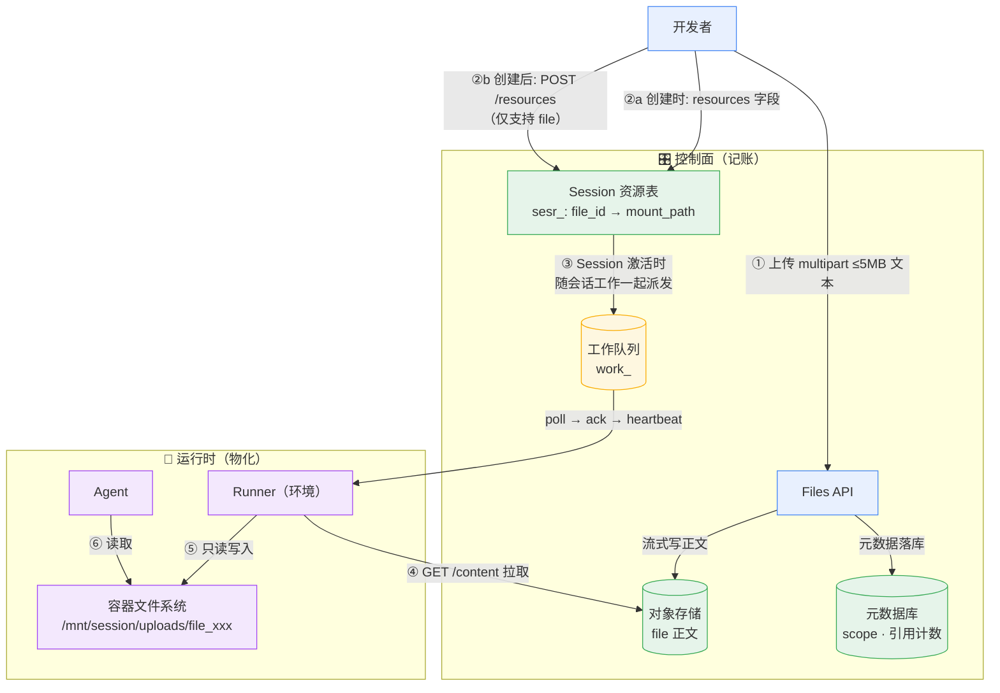

## 心智模型

> **一句话**：对象存储存正文、元数据库记账；"mount" 借了**文件系统**的词，干的是 **K8s 的活** - **声明式资源投影**，物化延迟到 **Session 激活**。

> **说明**：存储后端（OSS/S3/NAS）官方**未披露**，本文「机制剖析」章节的结论是从 **API 形态**倒推的**推断**，但每条推断都附有 API 证据；**work 队列模型**则有公开 API 文档佐证。

## 核心流程

1. **上传文件**
   - `POST /api/v1/cloud/files` - 上传文本类文件内容
2. **挂载到 Session**
   - `POST /api/v1/cloud/sessions/{session_id}/resources` - 把**已上传文件**挂载到 **Session**
3. **Agent 使用**
   - Session **运行期间** Agent 读取文件内容，完成任务

## 上传文件

```
POST https://api.qoder.com/api/v1/cloud/files
Content-Type: multipart/form-data
```

### 参数与约束

| 字段       | 类型   | 必填 | 说明                                |
| ---------- | ------ | ---- | ----------------------------------- |
| `file`     | binary | 是   | **文件内容**（仅文本类）            |
| `name`     | string | 否   | 自定义文件名（1-255 字节，服务端清洗） |
| `metadata` | JSON   | 否   | **自定义元数据**（原始长度 ≤ 8KB，默认 `{}`） |

| 约束维度 | 限制                                                            |
| -------- | --------------------------------------------------------------- |
| 大小     | multipart 请求体约 **≤ 5MB** 文件内容 + 表单开销                |
| 类型     | **仅文本类**；二进制文档、图片、音视频、压缩包会被拒绝          |
| 下载     | 是否可通过 `/content` 下载，以 File 对象的 `downloadable` 为准  |

> 单个文件

```bash
curl -X POST https://api.qoder.com/api/v1/cloud/files \
  -H "Authorization: Bearer $QODER_ACCESS_TOKEN" \
  -F "file=@./src/main.py"
```

响应：

```json
{
  "id": "file_019e6a18dc0978e9a2104c9b269748ac",
  "type": "file",
  "filename": "main.py",
  "size_bytes": 4096,
  "downloadable": false,
  "mime_type": "text/plain",
  "scope": null,
  "metadata": {},
  "created_at": "2026-05-01T10:00:00Z"
}
```

### 响应字段解读

| 字段          | 说明                                                         |
| ------------- | ------------------------------------------------------------ |
| `id`          | `file_` 前缀 + **UUIDv7**（时间戳开头，按创建时间排序友好）  |
| `filename`    | 存储文件名（`name` 参数或原始文件名）                        |
| `size_bytes`  | 文件字节数                                                   |
| `mime_type`   | 上传时提供，或按文件名探测                                   |
| `downloadable`| 平台侧 ACL：能否走 `/content` 端点下载                       |
| `scope`       | 关联对象 `{id, type: "session"}`，无关联为 `null`            |
| `metadata`    | 上传时传入的自定义元数据                                     |
| `created_at`  | RFC 3339 UTC 时间戳                                          |

> 多个文件（逐个上传）

```bash
curl -X POST https://api.qoder.com/api/v1/cloud/files \
  -H "Authorization: Bearer $QODER_ACCESS_TOKEN" \
  -F "file=@./config.yaml"

curl -X POST https://api.qoder.com/api/v1/cloud/files \
  -H "Authorization: Bearer $QODER_ACCESS_TOKEN" \
  -F "file=@./requirements.txt"
```

## 挂载到 Session

上传后，通过 **Resources API** 将文件**挂载**到**指定 Session**：

```
POST https://api.qoder.com/api/v1/cloud/sessions/{session_id}/resources
```

### 两种挂载时机

| 时机           | 方式                                    | 支持的资源类型                                  |
| -------------- | --------------------------------------- | ----------------------------------------------- |
| **创建时挂载** | 创建 Session 的 `resources` 字段        | `file` / `github_repository` / `memory_store`   |
| **创建后追加** | `POST /sessions/{id}/resources`         | **仅 `file`**（API 参考明确限制）               |

> **为什么创建后只能补挂 file？** git clone 和 memory store 是**重资源**，只能在建容器时一次性做好；**纯文本小文件**的补挂才是**廉价可增量**的事。

### resources 的三种类型（同一个抽象）

| type                | 关键字段                                    | 本质                       |
| ------------------- | ------------------------------------------- | -------------------------- |
| `file`              | `file_id`, `mount_path`                     | 对象内容**投影**到容器路径 |
| `github_repository` | `url`, `mount_path`, `authorization_token`  | 仓库 **clone** 进容器      |
| `memory_store`      | `memory_store_id`, `access`, `instructions` | 记忆库以**工具形式**注入   |

三种**异构资源**共用**一个抽象** - 这说明"挂载"**不是文件系统意义上的 mount**（没有 **NFS/FUSE**），而是**声明式资源投影**（详见下文机制剖析）。

### mount_path 规则

- 官方定义：**文件在 container 中出现的位置**（如 `/data/inputs/spec.md`）
- 可选字段，缺省默认 **`/mnt/session/uploads/<file_id>`** - 默认值直接暴露了实现：物化进容器文件系统的 `uploads` 目录

### 请求示例

按 API 参考，**Add Resource** 的请求体是**单个 resource 对象**；多个文件请**逐个调用**（指南页 `resources` 数组示例与此略有不一致，以 API 参考为准）：

```bash
curl -X POST https://api.qoder.com/api/v1/cloud/sessions/sess_abc123/resources \
  -H "Authorization: Bearer $QODER_ACCESS_TOKEN" \
  -H "Content-Type: application/json" \
  -d '{
    "type": "file",
    "file_id": "file_abc123",
    "mount_path": "/data/input.txt"
  }'
```

响应返回一个 **`sesr_` 前缀的资源对象**（含 `mount_path`、`created_at`、`updated_at`）- **挂载**在**控制面**创建了**一等实体**，而非**即时文件系统**操作。

### 典型错误

| HTTP | 触发条件                                             |
| ---- | ---------------------------------------------------- |
| 400  | 请求畸形 / 不支持的 type / `mount_path` 非法         |
| 404  | Session 或 File 不存在                               |
| 409  | Session 已归档 / 文件未就绪 / **文件已挂载过**（防重复） |

## 机制剖析：两个关键问题

### Q1：文件存储背后是 OSS 还是 NAS？

官方未披露，但 API 形态几乎锁定了答案：**对象存储（OSS/S3 类）+ 元数据库，基本排除 NAS**。

| API 证据                                                       | 指向                                   |
| -------------------------------------------------------------- | -------------------------------------- |
| `file_` 前缀 + UUIDv7，全流程无真实存储路径                    | **ID 寻址**，非路径寻址                |
| 下载统一走 `GET /files/{id}/content`，`downloadable=false` → 403 | 鉴权网关 / **presigned-URL** 模式      |
| ~5MB 小对象 + 只读 + 8KB 自定义 `metadata`                      | 教科书式 **S3 语义**                   |
| `scope: {id, type: "session"}`                                 | 对象**打标**过滤，不是**目录结构**     |
| 软删除状态（`deleted` 后 `GET` 返回 404）                       | 元数据生命周期状态机                   |
| 显式删除才删 + 活跃 Session 引用不可删                          | 元数据库**引用计数**                   |
| **只读多**、**无并发写**、**无 POSIX 锁需求**                   | **NAS** 的核心价值（**共享读写/低延迟**）用不上 |

排除 NAS 的架构理由：**多租户 SaaS** 下 **NAS** 难做**配额**、**快照**、**生命周期**、**跨区**；而 Agent 沙箱是**临时容器** - 它要的是"**可丢弃的物化副本**"，不是"**共享卷**"。

推断的**写入链路**一行：**API 服务收 multipart → 流式写对象存储 → 元数据（id/size/mime/scope/引用计数）落库**。

### Q2：Session 起来之后再挂载，是怎么生效的？

先修正一个前提：**两种时机都支持**（FAQ 明确**创建**时可在 `resources` 字段带文件）。**挂载不是一次性的启动动作**，而是 Session **期望状态（desired state）**的一部分，可以**随时 patch**。

关键证据来自 **Environment Work API**（面向**自托管**环境 **runner** 的**公开协议**，暴露了平台的**执行模型**）：

- 工作项 `work_`（`data.type = "session"`）通过**工作队列**派发
- runner `poll` 领取 → `ack` 确认（需同 `Worker-ID`，否则 409）→ 周期 `heartbeat`
- **5 秒未 ack 会被重派**（`reclaim_older_than_ms` 默认 5000ms）

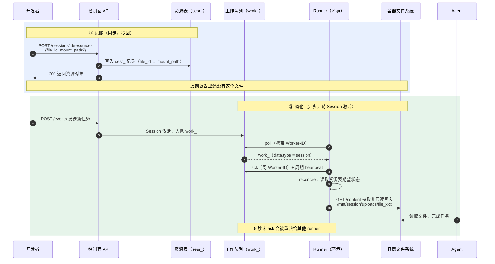

三层机制总结：

1. **控制面记账**：`(session_id, file_id, mount_path)` 存为 `sesr_` 资源记录 - **逻辑映射**，不动**真实文件系统**
2. **工作队列派发**：Session 激活（**新 turn**）作为 `work_` 派给环境 **runner**（poll/ack/heartbeat，**可重派**）
3. **运行时物化**：runner **reconcile** 期望状态，从对象存储拉内容写到容器内路径，产出**只读副本**

**为什么"Session 起来后再挂"也能生效**：Session 是 **serverless** 的（会休眠/唤醒），挂载本来就是**声明式**的 - `POST /resources` 改的是**期望状态**，runtime 下次活动时 reconcile 兜平。

|          | 文件系统 mount（NFS/FUSE） | Session 资源挂载                      |
| -------- | -------------------------- | ------------------------------------- |
| 寻址     | **路径**                   | `file_id`                             |
| 生效时机 | `mount()` 调用即时         | **期望状态 patch → 运行时物化**       |
| 语义     | 共享卷、可读写             | **只读投影（副本）**                  |
| 实现     | 内核 / **网络文件系统**    | **控制面记账 + 工作队列 + reconcile** |

## 管理文件

### 查看文件元信息

```
GET /api/v1/cloud/files/{file_id}
```

返回 File 对象（同上传响应）；`deleted` 状态的文件返回 404。

> 指南页「查看文件元信息」小节误贴了挂载接口的示例，正确端点以 Files API 参考（`GET /files/{file_id}`）为准。

### 资源也是一等公民：Resource CRUD

文档为 Session 资源提供了完整的管理端点（`api/sessions/*-resource`）：

| 能力 | 端点族                    | 说明                          |
| ---- | ------------------------- | ----------------------------- |
| 追加 | **Add Session Resource** | **创建后补挂（仅 file）**     |
| 查询 | List / Get Resource      | 列出 /查看 `sesr_` 资源       |
| 变更 | Update Resource          | 更新资源属性                  |
| 卸载 | Delete Resource          | 取消挂载                      |

这正是"**期望状态 + reconcile**"模型的接口形态：资源可独立增删改查，**运行时**负责**兜平**。

### 列出文件

```bash
curl "https://api.qoder.com/api/v1/cloud/files?scope_id=sess_abc123" \
  -H "Authorization: Bearer $QODER_ACCESS_TOKEN"
```

支持按 **scope_id** 过滤 Session 范围文件。

### 下载文件

`downloadable` 为 `true` 的文件可下载：

```bash
curl https://api.qoder.com/api/v1/cloud/files/file_abc123/content \
  -H "Authorization: Bearer $QODER_ACCESS_TOKEN" \
  -o output.txt
```

不可下载文件请求 `/content` 端点将返回 `403 Forbidden`。

## 完整工作流示例

```bash
# ① 上传源代码文件（正文入对象存储，元数据落库）
FILE_ID=$(curl -s -X POST https://api.qoder.com/api/v1/cloud/files \
  -H "Authorization: Bearer $QODER_ACCESS_TOKEN" \
  -F "file=@./app.py" | jq -r '.id')
echo "上传完成: $FILE_ID"

# ② 创建 Session（也可以在这一步直接带 resources 字段挂载）
SESSION_ID=$(curl -s -X POST https://api.qoder.com/api/v1/cloud/sessions \
  -H "Authorization: Bearer $QODER_ACCESS_TOKEN" \
  -H "Content-Type: application/json" \
  -d '{"agent": "agent_abc123", "environment_id": "env_abc123"}' | jq -r '.id')

# ③ 挂载文件到 Session（控制面写入 sesr_ 记录，此刻容器里还没有文件）
curl -X POST "https://api.qoder.com/api/v1/cloud/sessions/$SESSION_ID/resources" \
  -H "Authorization: Bearer $QODER_ACCESS_TOKEN" \
  -H "Content-Type: application/json" \
  -d "{\"type\": \"file\", \"file_id\": \"$FILE_ID\"}"

# ④ 发送任务 → Session 激活 → runner 物化文件 → Agent 引用
curl -X POST "https://api.qoder.com/api/v1/cloud/sessions/$SESSION_ID/events" \
  -H "Authorization: Bearer $QODER_ACCESS_TOKEN" \
  -H "Content-Type: application/json" \
  -d '{
    "events": [
      {"type": "user.message", "content": [{"type": "text", "text": "审查 app.py 并修复其中的 bug"}]}
    ]
  }'
```

对照心智模型：①② 是**记账**，③ 是**期望状态 patch**，④ 触发**物化** - 三段在时间上**完全解耦**。

## 常见问题

> Q：上传的文件存储多久？

A：文件在你调用 `DELETE /api/v1/cloud/files/{file_id}` **显式删除**前会持续保留。仍被活跃 Session **引用**的文件**无法删除**，需先删除或取消挂载相关 Session。

> Q：能否直接在创建 Session 时附带文件？

A：可以。**创建 Session** 时在 **resources** 字段中传入文件资源即可（此时还支持 `github_repository` / `memory_store`）。

> Q：为什么有些文件不可下载？

A：出于安全考虑，部分文件仅供 Agent 内部使用。如需导出结果，请使用 File 对象中 `downloadable` 为 `true` 的文件。

> Q：支持哪些文件格式？

A：上传接口接受文本类文件。代码、配置和纯文本参考文档效果最佳。

## 小结

| 问题             | 答案                                                         |
| ---------------- | ------------------------------------------------------------ |
| 存储后端（推断） | **对象存储存正文** + **元数据库记账**（引用计数、软删除、scope 打标） |
| 挂载本质         | **声明式资源投影**：`sesr_` 记账 + **运行时物化**（K8s **ConfigMap** 同构） |
| 两种挂载时机     | 创建时 `resources` 字段（三种类型）/ **创建后追加（仅 file）** |
| 默认挂载路径     | `/mnt/session/uploads/<file_id>`                             |
| 大小 / 类型限制  | **~5MB、仅文本类、metadata ≤ 8KB**                           |
| 生命周期         | **显式删除 + 活跃 Session 引用保护**                         |
| 物化触发         | Session 激活作为 `work_` 派发（**poll/ack/heartbeat，5s 重派**） |

> **一图流记忆**：上传即**入桶**，挂载即**记账**，激活才**物化** - `mount` 借了文件系统的词，干的是 K8s 的活。

# 持久化记忆

1. **Session 结束**后，Agent 的**上下文**默认**随之消失**
2. **Memory Stores** 让 Agent 的学习成果和工作产出**跨 Session 持久保留** - 下次启动时，Agent 可以“**回忆**”之前的内容

## 核心概念

| 概念         | 说明                                                         |
| ------------ | ------------------------------------------------------------ |
| Memory Store | **记忆仓库**，按**项目**或**领域**划分                       |
| Memory       | **一条记忆**，由 `path` 标识，每条有**唯一**的 `mem_...` ID  |
| Version      | 每次**创建**、**更新**或**删除**时**自动生成**的**版本快照** |

层级关系：**Store → Memory → Version**

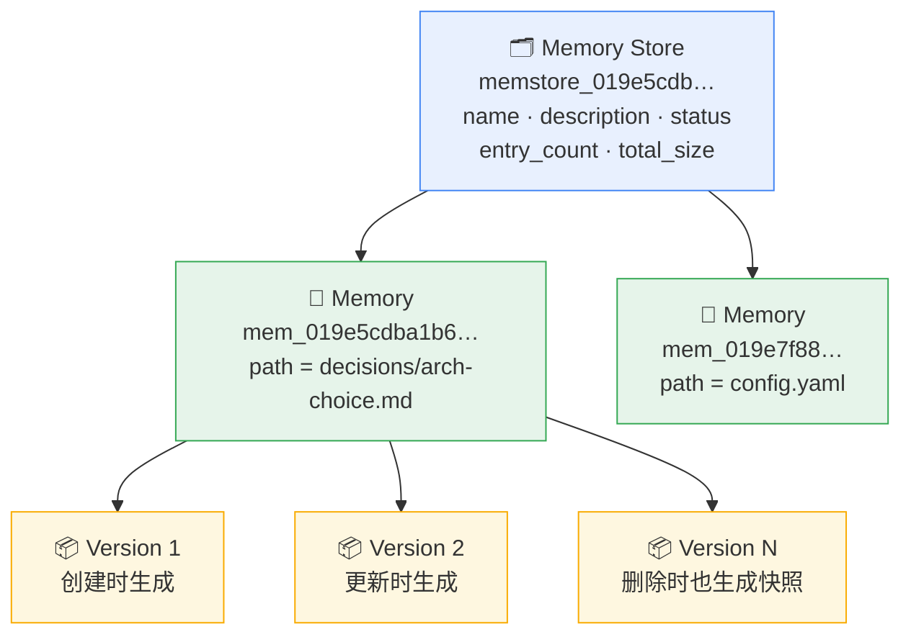

> 版本链是 **append-only**：创建、更新、删除各追加一个快照，版本本身**不可修改**（治理与审计的基础）。

## API 端点一览

| 方法   | 路径                                                         | 说明                            |
| ------ | ------------------------------------------------------------ | ------------------------------- |
| POST   | `/memory_stores`                                             | 创建 Memory Store               |
| GET    | `/memory_stores`                                             | 列出所有 Memory Store           |
| GET    | `/memory_stores/{id}`                                        | 获取 Memory Store 详情          |
| POST   | `/memory_stores/{id}`                                        | 更新 Memory Store               |
| POST   | `/memory_stores/{id}/archive`                                | 归档 Memory Store               |
| DELETE | `/memory_stores/{id}`                                        | 删除 Memory Store               |
| POST   | `/memory_stores/{id}/memories`                               | 创建 Memory                     |
| GET    | `/memory_stores/{id}/memories`                               | 列出所有 Memory                 |
| GET    | `/memory_stores/{id}/memories/{memory_id}`                   | 获取单条 Memory（含 `content`） |
| POST   | `/memory_stores/{id}/memories/{memory_id}`                   | 更新 Memory                     |
| DELETE | `/memory_stores/{id}/memories/{memory_id}`                   | 删除 Memory                     |
| GET    | `/memory_stores/{id}/memory_versions`                        | 列出 Memory 版本                |
| GET    | `/memory_stores/{id}/memory_versions/{memory_version_id}`    | 获取单个版本（含 `content`）    |
| POST   | `/memory_stores/{id}/memory_versions/{memory_version_id}/redact` | Redact 某个版本                 |

## 路径规则

Memory 的 `path` 必须是**相对路径**：

1. 合法：`notes/meeting-2026-05-18.md`、`config.yaml`
2. 非法：`/notes/meeting.md`（不能以 `/` 开头）、`../secrets`（不能包含 `..`）

路径用于**组织记忆结构**，类似**文件系统**。

## 完整流程

### 创建 Memory Store

```bash
curl -X POST https://api.qoder.com/api/v1/cloud/memory_stores \
  -H "Authorization: Bearer $QODER_ACCESS_TOKEN" \
  -H "Content-Type: application/json" \
  -d '{
    "name": "project-alpha-memory",
    "description": "Alpha 项目的 Agent 知识库"
  }'
```

响应示例：

```json
{
  "id": "memstore_019e5cdb9c3f71c3b6505eba937a40b4",
  "created_at": "2026-05-18T08:00:00.000Z",
  "name": "project-alpha-memory",
  "type": "memory_store",
  "updated_at": "2026-05-18T08:00:00.000Z",
  "archived_at": null,
  "description": "Alpha 项目的 Agent 知识库",
  "metadata": {},
  "status": "active",
  "entry_count": 0,
  "total_size": 0
}
```

### 创建 Memory

```bash
curl -X POST https://api.qoder.com/api/v1/cloud/memory_stores/memstore_019e5cdb9c3f71c3b6505eba937a40b4/memories \
  -H "Authorization: Bearer $QODER_ACCESS_TOKEN" \
  -H "Content-Type: application/json" \
  -d '{
    "path": "decisions/arch-choice.md",
    "content": "# 架构决策\n\n选择微服务架构，原因：团队规模扩大，需要独立部署。"
  }'
```

**列表**接口不返回 `content` 字段，需要调用**单条**获取接口才能读取内容。

### 获取单条 Memory

通过 `memory_id` 获取完整内容（包括 `content` 字段）：

```bash
curl https://api.qoder.com/api/v1/cloud/memory_stores/memstore_019e5cdb9c3f71c3b6505eba937a40b4/memories/mem_019e5cdba1b674e4a6a7d4f8c9b3e2a1 \
  -H "Authorization: Bearer $QODER_ACCESS_TOKEN"
```

响应示例：

```json
{
  "id": "mem_019e5cdba1b674e4a6a7d4f8c9b3e2a1",
  "type": "memory",
  "memory_store_id": "memstore_019e5cdb9c3f71c3b6505eba937a40b4",
  "path": "decisions/arch-choice.md",
  "content": "# 架构决策\n\n选择微服务架构，原因：团队规模扩大，需要独立部署。",
  "content_size_bytes": 99,
  "content_sha256": "1712de0d497a5aeef2beeccf4fbb7d5a16944975438d0c25447b9c1fba13099a",
  "version": 1,
  "metadata": {},
  "created_at": "2026-05-18T08:00:00.000Z",
  "updated_at": "2026-05-18T08:00:00.000Z"
}
```

### 更新 Memory

1. 更新使用 `POST` 方法，路径中带 `memory_id`，系统会**自动生成**新的**版本快照**
2. 为**防止并发写入**，可携带上次读取到的 `content_sha256` - 若与服务端当前内容不一致，API 返回 **409 Conflict**： - **乐观并发控制**

```bash
curl -X POST https://api.qoder.com/api/v1/cloud/memory_stores/memstore_019e5cdb9c3f71c3b6505eba937a40b4/memories/mem_019e5cdba1b674e4a6a7d4f8c9b3e2a1 \
  -H "Authorization: Bearer $QODER_ACCESS_TOKEN" \
  -H "Content-Type: application/json" \
  -d '{
    "content": "# 架构决策 v2\n\n改为 Modular Monolith，原因：微服务运维成本超出预算。",
    "content_sha256": "1712de0d497a5aeef2beeccf4fbb7d5a16944975438d0c25447b9c1fba13099a"
  }'
```

请求字段：

| 字段             | 类型   | 必填 | 说明                                                         |
| ---------------- | ------ | ---- | ------------------------------------------------------------ |
| `content`        | string | 是   | 新的内容，最大 **100 KB**                                    |
| `content_sha256` | string | 否   | 当前内容的**期望** SHA-256（**乐观并发控制**）。省略则跳过校验 |
| `metadata`       | object | 否   | 要附加的元数据                                               |

如果传入的 `content_sha256` 与服务端不一致（说明有**并发写入**），API 将返回 **409 Conflict**，需要先重新 GET 该 memory 再重试。

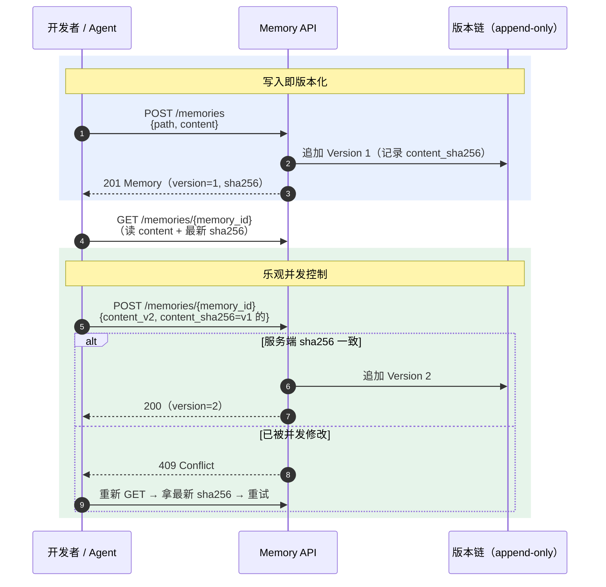

> 这是**乐观锁**的经典形态（**CAS**）：不带 `content_sha256` 则**跳过校验** - **last-write-wins**；带上则是"我知道我基于哪个版本改的"。

### 在 Session 中使用

**创建 Session** 时通过 `resources[]` 关联 **Memory Store**：

```bash
curl -X POST https://api.qoder.com/api/v1/cloud/sessions \
  -H "Authorization: Bearer $QODER_ACCESS_TOKEN" \
  -H "Content-Type: application/json" \
  -d '{
    "agent": "agent_xxx",
    "environment_id": "env_xxx",
    "resources": [
      {
        "type": "memory_store",
        "memory_store_id": "memstore_019e5cdb9c3f71c3b6505eba937a40b4",
        "access": "read_write",
        "instructions": "Use this memory for project context."
      }
    ]
  }'
```

Session 内 Agent 可**读取**和**写入**关联的 Memory Store。

### Memory 在 sandbox 内的路径

memory_store 绑定 Session 后，每条 memory 在 sandbox 内挂在：

```
/data/.qoder/awareness/<memory.path>
```

例如 `path = "shared/note.txt"` → sandbox 路径 `/data/.qoder/awareness/shared/note.txt`：

1. sandbox 内**没有** `memory_store` / `mem_` 这些命名层级，全部**平铺**到 `awareness/` 下
2. **Agent** 看不到也搜不到 **memory_store** 这个概念，只能按 `path` 直接读取文件

### 从挂载到读写：全景图

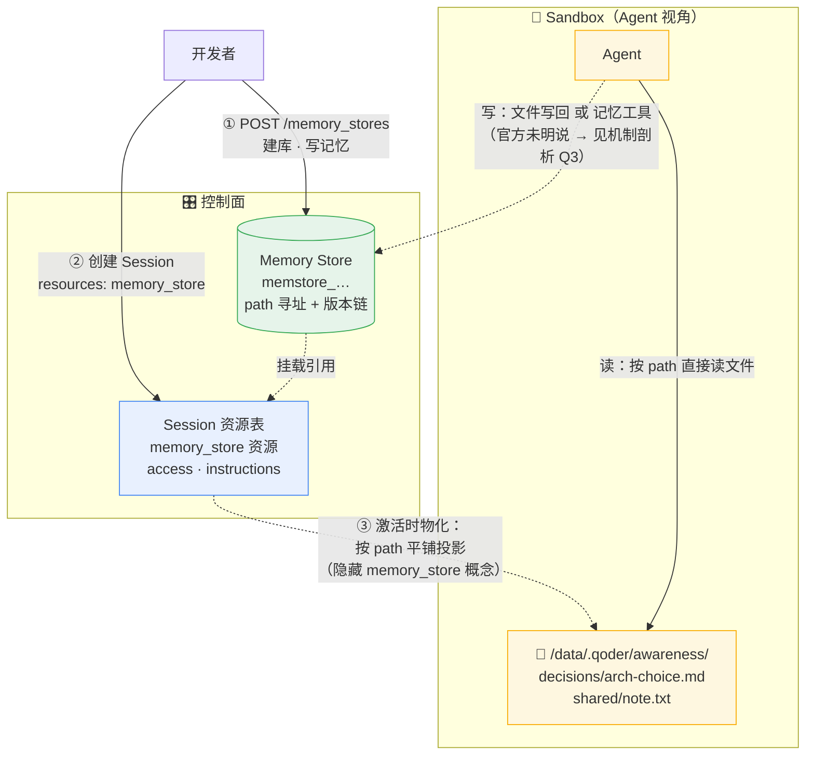

> 与「文件上传」章节同一个模式：**控制面记账，激活时物化**。区别在于 **file** 投影是**只读副本**，memory_store 是 **read_write 双向**的（`access` 字段控制）。

## 版本追踪

1. 每次对 Memory 执行**创建**、**更新**或**删除**操作，系统都会**自动生成**一个**版本快照**
2. **版本不可修改**，提供**完整的变更历史**
   - 用 `GET /memory_stores/{id}/memory_versions`（可用 `memory_id` 过滤）列出版本
   - 用 `GET /memory_stores/{id}/memory_versions/{memory_version_id}` 读取单个版本的 `content`
3. 如果某个版本记录了**敏感内容**，可以 **redact** **永久移除其存储内容**，同时**保留版本元数据**用于审计 - 删内容不删历史

## 统计字段

| 字段          | 说明                       |
| ------------- | -------------------------- |
| `entry_count` | Store 中的 **Memory 总数** |
| `total_size`  | 所有 Memory 内容的总字节数 |

## 机制剖析：三个关键问题

### Q1：记忆是自研的，还是集成了 Mem0 / PolarDB 这类方案？

官方未披露实现，但**接口形态可以下结论：产品语义是自研的一套**（无论底层存储复用了什么组件）。

| 判定证据                                                       | 结论                             |
| -------------------------------------------------------------- | -------------------------------- |
| Mem0 的核心接口是 `add()`（喂对话 → LLM 抽取 → 自动合并）与 `search()`（向量召回），Qoder **一个都没有** | 不是 Mem0 形态                    |
| Qoder 是 **path 寻址 + sha256 + 不可变版本链 + redact**          | **版本化文档库**语义（Git / S3 版本化桶同款） |
| 消费端是 sandbox **文件投影**（`awareness/`），Agent 感知不到"记忆系统" | **记忆的抽象**是**文件**，不是语义条目 |
| `memstore_` / `mem_` 的 **UUIDv7** 与 Files 一脉相承             | 大概率**复用同一套对象存储 + 元数据底座**（推断，与「文件上传」章节一致） |

至于 "PolarDB + Mem0" 组合：**PolarDB** 在其中扮演的是 **Mem0** 的**向量存储后端**；而 Qoder 的 API 里连**向量**的影子都没有（**无 embedding**、**无相似度检索**），这条路线从接口上就排除了。

### Q2：Mem0 的设计理念是什么？两边一样吗？

**完全不同，是两种记忆哲学。** Mem0 快速入门（没用过的话看这张表就够）：

| Mem0 概念        | 说明                                                                |
| ---------------- | ------------------------------------------------------------------- |
| `add(messages)`  | 把对话喂给 Mem0，**内部 LLM 管线**抽取事实，自动决定 ADD / UPDATE / DELETE |
| Memory           | 抽取出的**自然语言事实条目**（如 "用户偏好中文回复"）               |
| `search(query)`  | **向量相似度**检索 top-k，结果注入 prompt                            |
| 作用域           | `user_id` / `session_id` / `agent_id` 隔离                          |
| 底座             | 可插拔**向量数据库**（Qdrant / pgvector / Redis…，PolarDB 亦在其中） |

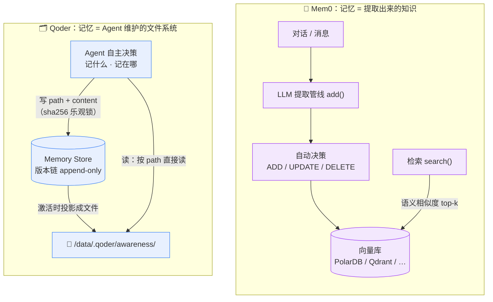

| 维度          | Mem0                           | Qoder Memory Store                    |
| ------------- | ------------------------------ | ------------------------------------- |
| 谁决定记什么  | **提取管线**（对开发者透明）   | **Agent 自己**（显式决策）            |
| 记忆形态      | 抽取的事实条目                 | path 寻址的文本文件                   |
| 怎么找回      | 语义相似度 `search()`          | Agent 按 path 读文件                  |
| 并发控制      | 管线内部处理                   | `content_sha256` 乐观锁               |
| 治理 / 审计   | history（可选）                | 不可变版本链 + redact                 |
| 心智模型      | **海马体**：自动沉淀           | **笔记本**：手工维护                  |
| 更像          | **RAG** 的写入侧               | Claude Code 的 CLAUDE.md / memory 目录 |

> 「海马体」是大脑中负责把日常经历**自动**转化为长期记忆的器官——你从不需要决定"记住这件事"，它默默完成沉淀（经典病例 H.M. 切除海马体后无法形成新长期记忆）。这正是 Mem0 提取管线的隐喻：**记忆的形成是无意识的**；而"笔记本"意味着**写什么、放哪个抽屉，自己决定**。

> 一句话：**Mem0 优化"召回"（怕忘），Qoder 优化"治理"（怕乱）**。Qoder 的选择与其平台哲学一脉相承 - 一切都是**显式资源**：可声明、可版本化、可投影、可审计。

### Q3：Agent 更新记忆，是写文件还是调 API？

官方文档**没有明说** Agent 侧的写路径（以下为推断）。**读路径是确定的** - 文件幻象：memory 按 path 平铺到 `/data/.qoder/awareness/`，Agent 直接读文件。写路径有两个候选：

| 候选                 | 机制                                                                 | 证据倾向                                        |
| -------------------- | -------------------------------------------------------------------- | ----------------------------------------------- |
| A. 双向文件同步      | Agent 直接写 `awareness/` 下的文件，runtime 在 turn 结束时把改动**翻译成 Memory API 调用**（自动算 sha256、生成版本） | 与"Agent 看不到 memory_store 概念"的**完整幻象**一致 |
| B. 注入记忆工具      | 挂载时 runtime 向 Agent 注入一组记忆工具，`instructions` 字段正是**使用说明** | 与 **Vault 的运行时注入模式**（见 [V4](/2026/08/21/agent-infra-cloud-agents-v4/)）同构；乐观锁语义更容易在工具层表达 |

无论哪种，**乐观锁与版本快照都由 runtime 兜底** - Agent 不需要理解 sha256。验证方法：跑一个带 memory_store 的 Session，观察事件流里 Agent 的**工具调用名**（thread events），或对比 turn 前后 sandbox 的文件变化。

### Q4：Memory Store、Memory、Session、User 之间是什么关系？

**答案：唯一的强结构是 Store → Memory → Version；其余全是松耦合的"运行时接线"，归属模型在 Managed Mode 下完全交给上层设计，Forward Mode 下才由平台托管。**

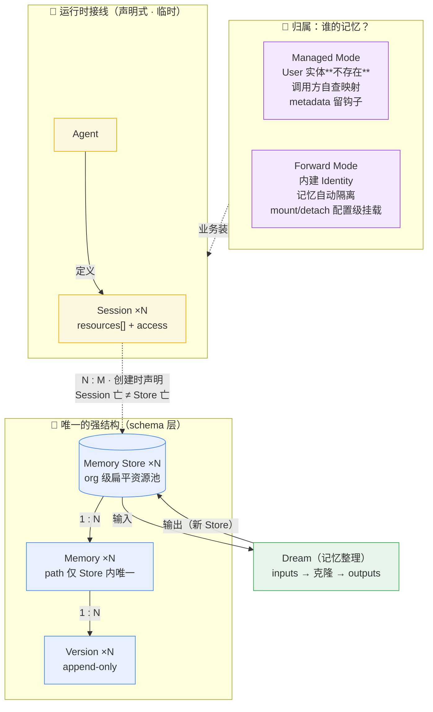

**Session ↔ Store 是接线，不是外键**：

| 证据                                                         | 含义                             |
| ------------------------------------------------------------ | -------------------------------- |
| 唯一关联机制 = 创建 Session 时 `resources[]`（+ `access` + `instructions`） | 多对多、临时、声明式             |
| FAQ 明确"一个 Session 可关联多个 Store"                      | N : M                            |
| Session 结束 Store 毫发无损；创建后追加资源**仅支持 file**    | 生命周期独立，接线是一次性的     |

**Managed Mode 里 User 根本不存在**（API 证据）：

- `POST /memory_stores` 请求体只有 `name` / `description` / `metadata` - **没有 user_id、没有 owner**
- Memory 对象上没有任何**用户/会话**归因字段；认证是 **PAT/SAT（平台账号级）**
- 对比：Files 还有 `scope: {type: "session"}` 可绑会话，**Memory Store 连这个都没有** - 完全**扁平**
- Store 与 Memory 的 `metadata`（≤8KB）就是官方留的**业务关联钩子**（如 `{"user_id": "..."}`）

**Forward Mode 才有托管归属**：V1 对比表原文 - "内建 Identity，每个 C 端用户一个身份，**记忆与权限自动隔离**"（Managed 则"**不内建**，需调用方**自行管理隔离**"）。且 **mount / detach / list-mounts 端点只存在于 Forward API 族**（官方 llms.txt 索引可见，Managed 侧没有）- 把**记忆挂载**从"每次建 Session 手动带"升级为"**配置级声明**"。

| 关系                  | 类型             | 机制                          | 谁定义                 |
| --------------------- | ---------------- | ----------------------------- | ---------------------- |
| Store → Memory → Version | **强**（schema 层级） | 路径嵌套 + 版本链         | 平台                   |
| Session ↔ Store       | **弱**（运行时接线） | `resources[]` + `access`，N : M | 调用方每次声明         |
| User ↔ Store          | Managed：**不存在**；Forward：Identity 隔离 | **Forward: Identity + mount/detach** | **平台（Forward）/ 调用方（Managed）** |
| Agent ↔ Store         | 无直接关系       | 只经 **Session** 间接使用     | -                      |
| Dream ↔ Store         | 任务输入输出     | inputs → 克隆 outputs         | 平台                   |

> **一句话**：平台只定义"积木"和"插口"（Store 层级 + resources 挂载协议），"**谁的积木插给谁**"是业务决策 - Managed 把它留给你，Forward 替你做了。这正是 [V5](/2026/08/21/agent-infra-cloud-agents-v5/) 两模式哲学在记忆子系统上的投影。类比 K8s：**Memory Store 像 PV（独立生命周期），Session 像 Pod（声明式引用）**。

## 常见问题

> Q: 一个 Session 可以关联多少个 Memory Store？

A: 支持多个，按需关联。

> Q: Memory 的 path 可以包含**子目录**吗？

A: 可以，如 `notes/2026/05/daily.md`，支持**多级路径**。

> Q: Memory Store 有**容量限制**吗？

A: 具体限制请参考账户配额，通常足够一般项目使用。

> 建议为每个**独立项目**创建单独的 **Memory Store**，避免不同项目的**记忆混淆**。

## 小结

| 问题             | 答案                                                         |
| ---------------- | ------------------------------------------------------------ |
| 自研 or Mem0？   | 接口形态完全不是 Mem0（无 add/search/向量）；自研，大概率复用 Files 同款**对象存储 + 元数据底座**（推断） |
| 记忆形态         | **path 寻址文本** + `content_sha256` + **不可变版本链**（append-only） |
| 并发控制         | 乐观锁：带旧 sha256 更新，冲突 409，重读重试                 |
| 治理             | 版本快照全保留 + **redact**（删内容不删历史）                |
| Agent 怎么读     | 文件幻象：激活时**平铺投影**到 `/data/.qoder/awareness/<path>` |
| Agent 怎么写     | 文件写回 **或** 注入记忆工具（官方未明说，推断；乐观锁由 **runtime** 兜底） |
| 与 Mem0 的哲学差 | Mem0 优化**召回**（海马体），Qoder 优化**治理**（笔记本）    |
| 与 Session/User 关系 | 唯一强结构 **Store→Memory→Version**；Session 是**运行时接线**（N:M）；Managed **无 User 实体**（**metadata** 留钩子），Forward 用 **Identity** 隔离 |

> **一图流记忆**：Mem0 把记忆交给**管线**，Qoder 把记忆交给 **Agent**；一个是海马体，一个是笔记本。

# 记忆整理

1. Memory Store 中的**记忆**会随着使用**不断积累**，可能出现**重复**、**过时**或**遗漏**的问题
2. **Dreams** 提供**异步**的**记忆整理**能力 - 系统会启动一个**专用 Agent**，回顾**近期会话**，对 Memory Store 进行**合并**、**删减**和**补充**

## 核心概念

| 概念              | 说明                                                         |
| ----------------- | ------------------------------------------------------------ |
| Dream             | 一次**异步记忆整理**任务                                     |
| 输入 Memory Store | 整理的数据源，**不会被修改**                                 |
| 输出 Memory Store | 系统**自动克隆**的副本，整理结果写入此处                     |
| Dreaming Session  | Dream 运行时创建的**内部 Session**，不会出现在普通 Session 列表中 |

## 工作流程

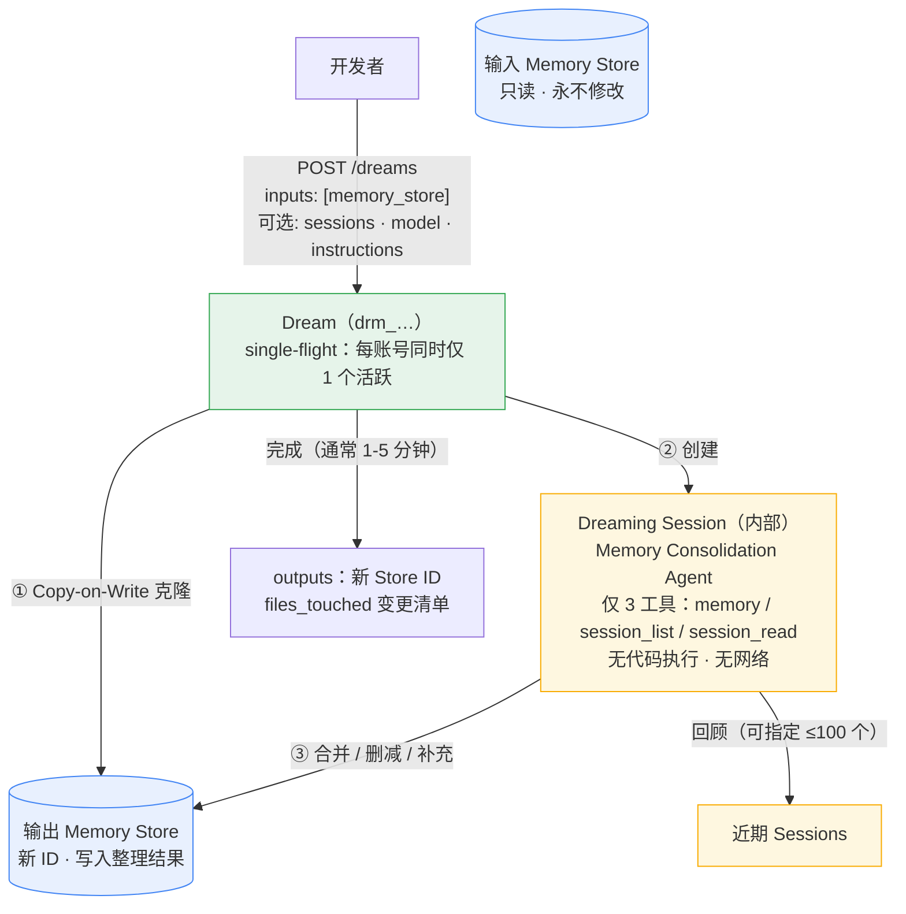

> Dreams 的输入输出**都只认 Memory Store** - 再次印证 **Store** 是**记忆的一等单元**，Session 只是"**使用现场**"（见下文 Q4 关系模型）。

## API 端点一览

| 方法 | 路径                   | 说明               |
| ---- | ---------------------- | ------------------ |
| POST | `/dreams`              | 创建 Dream         |
| GET  | `/dreams`              | 列出 Dreams        |
| GET  | `/dreams/{id}`         | 获取 Dream 详情    |
| POST | `/dreams/{id}/cancel`  | 取消运行中的 Dream |
| POST | `/dreams/{id}/archive` | 归档已完成的 Dream |

## 快速开始

### 触发一次记忆整理

```bash
curl -s -X POST 'https://api.qoder.com/api/v1/cloud/dreams' \
  -H "Authorization: Bearer $QODER_ACCESS_TOKEN" \
  -H "Content-Type: application/json" \
  -d '{
    "inputs": [
      { "type": "memory_store", "memory_store_id": "memstore_019e5cdb9c3f71c3b6505eba937a40b4" }
    ]
  }'
```

### 查询进度

```bash
curl -s 'https://api.qoder.com/api/v1/cloud/dreams/drm_019e86b4a8f070a3b6c5d4e3f2a1b0c9' \
  -H "Authorization: Bearer $QODER_ACCESS_TOKEN"
```

### 查看结果

Dream 完成后，`outputs` 字段中包含**整理后**的 **Memory Store ID**：

```json
{
  "status": "completed",
  "outputs": [
    { "type": "memory_store", "memory_store_id": "memstore_019e86b4b10578059435632bb357c5ed", "files_touched": ["preferences.md", "project/arch.md"] }
  ]
}
```

## 可选参数

| 参数                        | 说明                                                         |
| --------------------------- | ------------------------------------------------------------ |
| `model`                     | 选择整理使用的模型：`auto`（**默认**）、`lite`、`ultimate`   |
| `instructions`              | **自定义指令**（如"重点关注 Python 项目约定"），最长 **4096 字符** |
| `inputs[].type: "sessions"` | **指定重点回顾的 Session ID 列表（最多 100 个）**            |

## 安全设计

1. **Copy-on-Write**：输入 Memory Store **永不被修改**，所有写入发生在**克隆副本**上
2. **最小权限**：Dreaming Agent 仅可使用 `memory`、`session_list`、`session_read` 三个工具，无法**执行代码**或**访问网络**
3. **Single-flight**：**每个用户同一时间**只能有一个**活跃 Dream**（状态为 **pending** 或 **running**），重复创建返回 409

## 常见问题

> Q: Dream 会修改我原来的 Memory Store 吗？

A: 不会。Dream 始终在**克隆副本**上操作，原始 Memory Store 完全不受影响。

> Q: Dream 需要多长时间？

A: 通常 1-5 分钟，取决于 **Memory Store 大小**和需要**回顾的会话数量**

# 计费

1. **Credits** 消耗项只有两类：**模型调用**（按 **Token** 折算）与**沙箱运行**（按 `running` 秒）
2. 所有费用从 **Credits 余额**统一扣减；**模型调用失败不扣费**
3. **存储类资源**（对话历史、任务产出、上传附件、Skill 仓库、持久化数据）当前**限时免费**

## 心智模型

> **一句话**：烧脑的按 **Token** 收，烧机的按**秒**收 - 且**只罚 running**：idle 休眠不收钱。

## Credits 消耗项

| 计费项            | 计费方式                        | 说明                                         |
| ---------------- | ------------------------------- | -------------------------------------------- |
| 模型调用         | 按 **Token 消耗折算**           | 不同模型、不同任务复杂度消耗不同             |
| 沙箱运行（云资源）| 按 **Session 活跃运行时长**计费 | 仅 `running` 状态计费，**按秒计量、按小时结算** |

| 场景                           | 预估消耗        |
| ------------------------------ | --------------- |
| 简单问答                       | 约 1-3 Credits  |
| 日常文档或文案生成             | 约 10-15 Credits|
| 复杂任务（多轮对话 + 工具调用）| 约 20-50 Credits|

> 以上为典型估算，实际以 Credits 消耗明细为准；**沙箱运行**通常仅占单次 Session 总消耗的 **5%-10%** - **大头永远在模型调用**。

### 沙箱计费：状态机（2026-08-10 起正式收费）

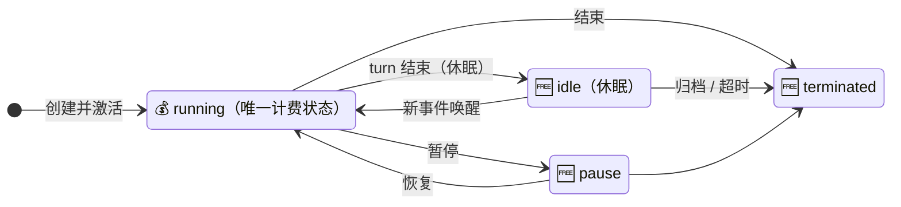

## 存储限时免费

| 免费项                       | 对应本系列章节            |
| ---------------------------- | ------------------------- |
| 对话历史与任务记录           | -                         |
| 任务生成数据（报告/代码/文件）| Files（Agent 产出）       |
| 上传的附件与文件             | Files（`POST /files`）    |
| 空间私有 Skill 仓库存储      | -                         |
| 持久化个人用户数据存储       | Memory Stores             |

> 存储计费规则后续可能调整 - 当前相当于**平台补贴对象存储成本**（印证「文件上传」Q1 的存储模型推断）。

## 扣减与出账

1. **统一扣减**：所有费用从 **Credits** 余额扣
2. **失败不扣费**：模型调用失败不扣该次 Credits；成功的按实际消耗计
3. **结算粒度**：沙箱**按秒计量、按小时结算**；模型调用按实际折算

## 计费模型全景

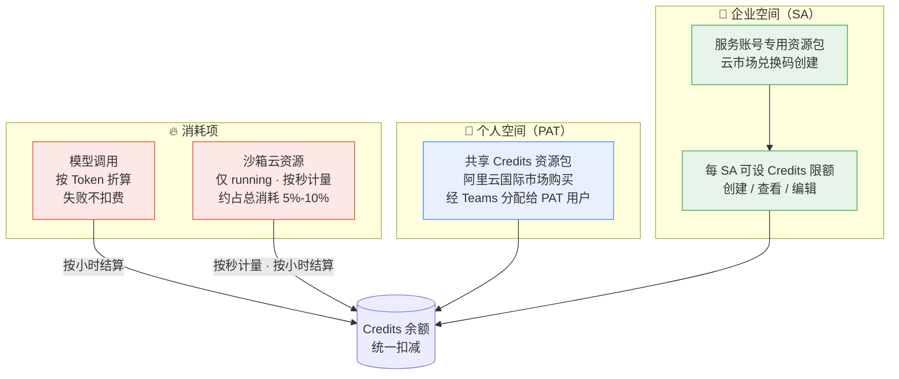

## 机制剖析：计费状态机暴露了架构状态机

| 计费规则                       | 架构印证                                                 |
| ------------------------------ | -------------------------------------------------------- |
| **idle / pause / terminated 不计费** | 直接印证「文件上传」Q2 的 **serverless 休眠模型** - 休眠时容器真被**冻结/回收**，平台不付**计算成本**，所以不收钱。**计费粒度与架构粒度对齐** |
| 按秒计量、按小时结算           | 面向大量**短 Session** 的聚合账单设计                     |
| 模型调用失败不扣费             | 计费与执行成败对齐（重试不产生双重计费）                  |
| 沙箱仅占 5%-10%                | 平台定价锚定**模型 Token**，云资源接近**成本价**          |
| 购买渠道是**阿里云国际市场**   | 商业底座在阿里云（资源包经云市场售卖、兑换码开通）        |

## 小结

| 问题         | 答案                                                         |
| ------------ | ------------------------------------------------------------ |
| 消耗项       | **模型调用**（Token 折算）+ **沙箱**（running 秒）——仅此两类 |
| 沙箱计费状态 | **只有 `running` 计费**；idle/pause/terminated 免费          |
| 沙箱成本占比 | 约 5%-10%（大头在模型）                                      |
| 失败调用     | 不扣费                                                       |
| 存储         | 五类限时免费（含 Files 上传与 Memory Stores）                |
| 个人模式定位 | Credits 预付费，**不建议生产调度**（仅测试/POC）             |
| 企业空间计费 | SA 专用资源包，**不占组织席位 Credits**，每 **SA** 可设**限额** |

> **一图流记忆**：烧脑按 Token、烧机按秒；**只罚 running，休眠免费** - 计费表就是架构图的影子。

# 个人空间与企业空间

1. 空间是 Cloud Agents 的**顶层账号上下文**：个人空间用 **PAT**，企业空间绑定**服务账号（Service Account，SA）**
2. 两个空间**完全隔离**：个人空间的资源不会因加入组织而出现在企业空间
3. 每个组织有**一个**企业空间，由**管理员 + 配置管理员**共同管理

## 空间对比

| 维度         | 👤 个人空间                             | 🏢 企业空间                                        |
| ------------ | --------------------------------------- | -------------------------------------------------- |
| 认证         | 个人 **PAT**                            | **服务账号 SA**（企业凭证页绑定）                  |
| 数据归属     | 当前用户                                | 当前 **Qoder 组织**                                |
| 配置与使用   | 仅本人                                  | **管理员 + 配置管理员**共治                        |
| 计费来源     | 个人 Credits（共享资源包分配）          | **SA 专用资源包**（不占席位 Credits）              |
| 可用人群     | 所有 Qoder 用户                         | Teams / Enterprise 组织的管理员                    |
| 生产建议     | 测试 / POC                              | **对外服务与企业工作流集成**                       |
| 数量         | 每用户一个                              | **每组织一个**                                     |

## 账号体系全景

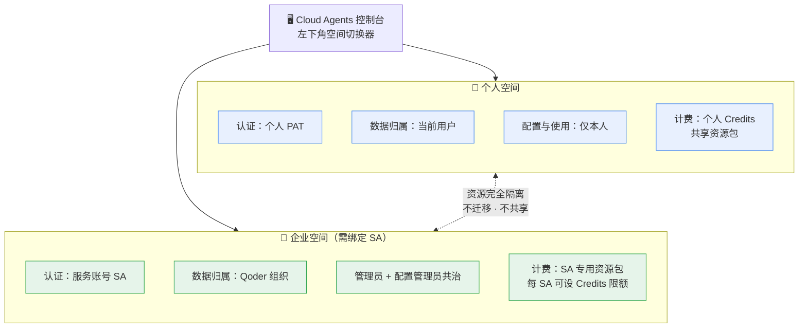

## 绑定企业凭证（三步）

1. 组织开通**服务账号**功能（灰度范围，未开通联系销售）
2. 在 Qoder 管理后台**创建 SA** 并完成计费配置（**成员 > 服务账号**，可同时设 Credits 上限）
3. 回到 Cloud Agents，在**企业凭证**页绑定该 SA

> 前提：组织须通过**云市场兑换码**创建（官网直购支付创建的组织暂不支持 SA 模式）。

## 机制剖析：空间与「记忆关系模型」的呼应

| 观察                                      | 解读                                                         |
| ----------------------------------------- | ------------------------------------------------------------ |
| 「记忆」Q4 说 Managed Mode 没有 User 实体 | 但顶层有**空间**：个人空间认证主体 = 你（PAT），企业空间认证主体 = **SA** - 这就是 API 鉴权里 **PAT / SAT** 分野的来源（[V4](/2026/08/21/agent-infra-cloud-agents-v4/) Vaults 一章即已出现"Bearer PAT 或 SAT"） |
| 两空间资源**完全隔离、不迁移**            | 隔离发生在**账号层**而非**资源层** - Agents / Environments / Files / Memory Stores 各有独立宇宙 |
| 企业空间多管理员共治                      | 与 [V5](/2026/08/21/agent-infra-cloud-agents-v5/) Forward Mode 的 **Enterprise 层**同构 - **组织级治理** |
| 每 SA 可设 Credits 限额                   | 子账号级 **FinOps**：限额内自主、超限任务无法发起            |

## 小结

| 问题         | 答案                                                        |
| ------------ | ----------------------------------------------------------- |
| 空间是什么    | **顶层账号上下文**：个人（PAT/个人 Credits）vs 企业（SA/专用包） |
| 切换方式      | 控制台左下角空间切换器；**每组织一个企业空间**              |
| 数据归属      | 个人 = 当前用户；企业 = Qoder 组织（管理员共治）            |
| 隔离粒度      | **完全隔离** - 个人空间资源不会自动进入企业空间             |
| 生产建议      | **对外集成用企业空间**；个人 PAT 仅测试 / POC               |

> **一图流记忆**：个人空间是"我的实验室"，企业空间是"组织的生产线" - **PAT 只做实验，SA 才上产线**。
