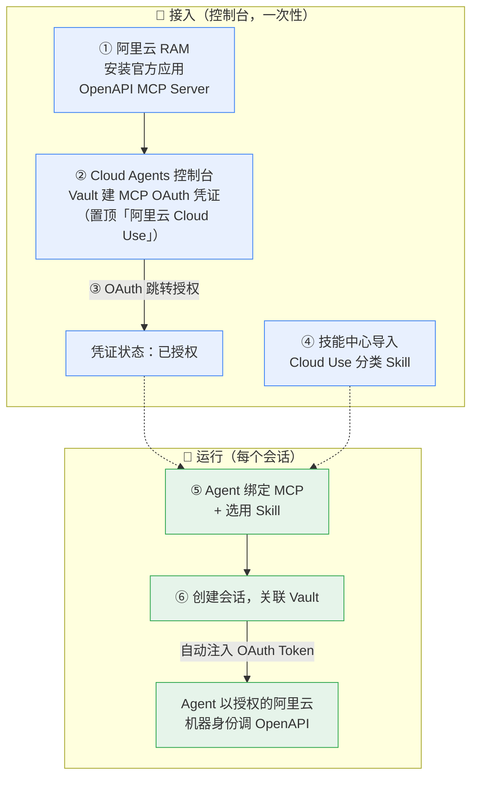
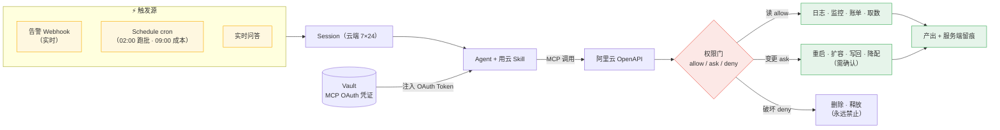
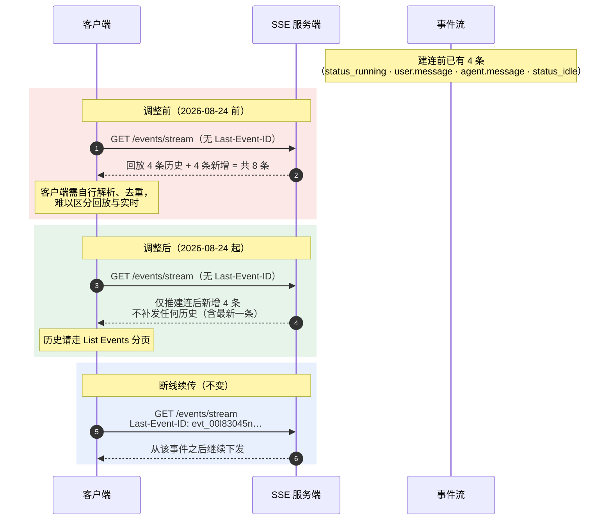
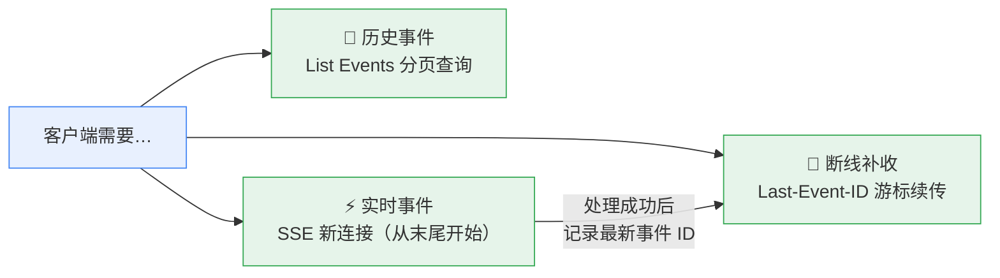

# Cloud Use（用云）

1. Cloud Use 让云上运行的 Agent 以**受治理的身份**操作你的**阿里云**资源，在云上闭环完成任务
2. 接入分两步：控制台用 **OAuth** 授权**阿里云 OpenAPI MCP** + 按需从技能中心导入**阿里云官方 Skill**
3. Agent 以平台注入的**机器身份**通过 MCP 调用阿里云 OpenAPI - 云端长期运行、按事件实时触发、云操作全程**服务端留痕**

> Cloud Use = **V4/V5/V6 三篇机制的官方样板间**：OAuth 凭证进（Vault）、事件驱（Webhooks / Schedules）、双层账单（Credits + 阿里云）——文末机制剖析逐一对应

<!-- more -->

## 心智模型

> **一句话**：OAuth 授权一次，Agent 7×24 在云上替你管云 - **读永远 allow、变更必须 ask、破坏永远 deny**。

## 全景：接入与运行

## 接入五步（控制台 OAuth）

| 步骤                       | 操作                                                                        | 要点                                                          |
| -------------------------- | --------------------------------------------------------------------------- | ------------------------------------------------------------- |
| ① 获取专属 MCP URL         | 阿里云 OpenAPI 门户 MCP 接入页：中国站 `api.aliyun.com/mcp`，国际站 `api.alibabacloud.com/mcp` | 选 **Streamable HTTP Endpoint**，按账号站点选域名             |
| ② RAM 安装官方应用         | RAM 控制台 →「第三方应用」→「安装官方应用」→ **OpenAPI MCP Server**          | **OAuth 前置**：未安装时授权页直接报「应用未被授权安装」       |
| ③ 创建 Vault 凭证          | Cloud Agents 控制台 →「密钥」→「添加」：类型 **MCP OAuth**，服务器选置顶 **「阿里云 Cloud Use」**（或自定义 URL 填 ① 的地址） | 保存后完成一次 OAuth 跳转，凭证状态变「已授权」               |
| ④ Agent 绑定 MCP           | Agent 的 **MCP Servers** 配置中勾选该凭证                                    | 推荐从「密钥」勾选，无需重复填 URL                            |
| ⑤ 会话关联 Vault           | 发起会话时选择该 Agent 并关联 Vault                                           | 平台自动把 OAuth Token **注入 MCP 调用链路**                  |

> **前置**：拥有阿里云账号 + 在 RAM 中安装第三方应用的权限。

> 这正是 V4「Vaults 认证」详讲的 **`mcp_oauth` 凭证类型 + CAS OAuth 流程**——下拉置顶的「阿里云 Cloud Use」就是平台预注册的 MCP 服务器条目，OAuth 全程与 V4 时序图一致（token 不经过用户之手）。

## 导入用云 Skill

控制台「技能 → 创建 → **从技能中心导入**」：

- 选 **「Cloud Use」分类**（置顶）查看平台精选的用云 Skill
- 可搜索阿里云官方 Skill（RAM 权限诊断、DataWorks 数据开发、Quick BI 智能问数等）
- 导入后进入「技能」列表，可在 Agent 配置中立即选用

## 四大典型场景

| 场景             | 闭环产出                                                                 | 权限分级（allow / ask / deny）                            | 推荐 Skill                                        | 触发                       |
| ---------------- | ------------------------------------------------------------------------ | ---------------------------------------------------------- | -------------------------------------------------- | --------------------------- |
| **应急处理**     | 告警触发 → 定位根因 → 受控止血 → 修复 PR                                  | 日志/监控只读 `allow`；重启/扩容/切流 `ask`；删除/释放 `deny` | RAM 权限诊断、云监控 2.0、ES 集群诊断修复           | 告警 Webhook 实时           |
| **数据分析**     | 自然语言提问 → 探 schema → 生成并执行 SQL → 出图 → 归因解读                | 取数/跑 SQL（只读）`allow`；写操作 `deny`                   | Quick BI 智能小 Q、DMS 智能问数（60+ 数据源）       | 实时问答 / 08:00 大盘       |
| **数据处理**     | 读源 → 清洗/转换/聚合 → 写入目标数据集 → 校验行数与 schema（幂等可复跑）   | 读源 `allow`；写回结果表/OSS `ask`；删除源数据 `deny`        | DataWorks、ClickHouse 迁移、MaxCompute 元数据      | 每日 02:00 跑批（cron）     |
| **成本治理 FinOps** | 拉账单与利用率 → Top 成本项 +「预计月省 + 一行修复动作」可执行清单      | 账单/利用率只读 `allow`；停闲置/降配/生命周期 `ask`          | EMR 生命周期（成本标签）、MaxCompute 费用追踪、DAS  | 每日 09:00（cron）          |

> 权限设计的共同模式：**读永远 `allow`、变更必须 `ask`、破坏永远 `deny`** —— 把"最小权限"做成了产品化的三级开关。

## 触发与执行链路

## 机制剖析：V4/V5/V6 的官方样板间

| Cloud Use 机制                          | 对应本系列                       | 闭环了什么                                                    |
| ---------------------------------------- | -------------------------------- | -------------------------------------------------------------- |
| Vault 建 **MCP OAuth** 凭证              | V4「Vaults 认证」的 `mcp_oauth` + CAS 时序 | 那套 OAuth 流程的**官方首用场景**                             |
| 会话关联 Vault → 自动注入 Token          | V4「token 全程不经过用户之手」    | **机器身份**的具体形态                                        |
| 告警 Webhook 实时触发                    | V5「Webhooks」                    | 事件驱动入口                                                  |
| 每日 02:00 / 09:00 cron                  | V5「Schedule」                    | 定时驱动入口                                                  |
| Agent 云端 7×24 长驻                     | V6「计费」：idle 免费、只罚 running | 长驻的**经济性基础**                                          |
| 阿里云资源消费计入**被授权的阿里云账号** | V6「计费」：Credits 只覆盖模型+沙箱 | **双层账单**：Qoder 收 Credits（脑），阿里云收资源费（云）——BYO Cloud Account |
| 授权集中在 Vault，多处复用               | V4：Vault 与 Session 解耦         | 配一次，处处挂                                                |
| allow / ask / deny 三级权限              | -                                | 本篇新概念：**最小权限的产品化**                              |

## 常见问题

> Q：这和「本地 Coding Agent + 阿里云 MCP」有什么区别？

A：Agent 运行在云端，7×24 长期运行、按事件实时触发，不依赖你的机器在线；用云通过授权的**机器身份**进行，凭证由平台托管注入、不落到本地；每一步云操作都在**服务端留痕、可审计**。

> Q：授权时提示「应用未被授权安装」？

A：回到第②步，确认已在阿里云 RAM「第三方应用」中安装 **OpenAPI MCP Server** 官方应用，再重新发起 OAuth。

> Q：使用阿里云产生的费用账单在哪里？

A：**双层账单** - 用云消费计入完成 OAuth 授权的那个阿里云账号（账单在其费用中心）；Agent/模型消耗走 Qoder Credits。

> Q：Agent 多个会话能复用同一个授权吗？

A：可以。授权与连接集中在「密钥（Vault）」，Agent 只做挂载引用 - 配一次，多处可挂。

## 小结

| 问题           | 答案                                                                   |
| -------------- | ---------------------------------------------------------------------- |
| 定位           | 云端 Agent 以**受治理的机器身份**操作阿里云，云上闭环                  |
| 接入两件事     | ① RAM 装官方应用 + Vault 建 MCP OAuth（一次）② 技能中心导入 Skill      |
| 运行三特征     | 云端长驻 7×24 · 事件/定时触发 · 服务端留痕                             |
| 权限模式       | 读 `allow` / 变更 `ask` / 破坏 `deny`                                  |
| 四大场景       | 应急处理（Webhook）、数据分析（问答）、数据处理（cron）、成本治理（cron） |
| 账单结构       | Qoder Credits（模型+沙箱）+ 阿里云账号（资源消费）                     |

> **一图流记忆**：OAuth 进、事件驱、身份治理、双层账单 - Cloud Use 是前六篇机制拼图的**官方样板间**。

# 附：SSE 初始连接行为调整公告（2026-08-24 生效）

| 项         | 值                            |
| ---------- | ----------------------------- |
| 公告日期   | 2026-08-10                    |
| 生效时间   | **2026-08-24 00:00（UTC+8）** |
| 影响范围   | Cloud Agents（SSE 接口）      |

> 本篇收录时距生效还有 **2 天** - 依赖"新连接回放历史"的客户端请抓紧适配。

## 调整内容：一句话

未携带 `Last-Event-ID` 的新建 SSE 连接：从**建连时刻的事件流末尾**开始，只推送**后续新增**事件；**不再回放**历史事件（包括最新一条历史）。携带 `Last-Event-ID` 的断线续传**不变**；历史事件走 List Events 分页查询。

## 接口影响范围

| 接口 / 能力                                                                | 是否调整 | 说明                                                        |
| --------------------------------------------------------------------------- | -------- | ------------------------------------------------------------ |
| `GET /sessions/{id}/events/stream`                                          | ✅ 是     | 无 `Last-Event-ID` 时，从建连时事件流末尾开始，仅下发新增     |
| `GET /sessions/{id}/threads/{thread_id}/stream`                              | ✅ 是     | 同上，仅限该 Thread 的新增事件                               |
| 两个 List Events 接口以 `Accept: text/event-stream` 作为 SSE 使用           | ✅ 是     | 行为与对应 Stream 接口一致                                   |
| `Last-Event-ID` 断线续传                                                    | ❌ 否     | 携带有效游标则从该事件之后下发，规则不变                     |
| List Events 的 JSON 分页查询                                                | ❌ 否     | 仍可分页查询已保存的公开事件                                 |
| `POST /sessions/{id}/events`                                                | ❌ 否     | 请求与响应契约不变                                           |

## 行为对比（时序图）

以某 Session 为例：建连前已有 4 条事件，建连后新产生 4 条（事件 ID 已缩短）：

> 细节坑：**先发消息、后建连 ≠ 能收到之前那条** - 服务端不补发任何历史，包括最新一条。要完整接收某次操作的实时事件，必须**先建连、再触发**。

## 三个职责的边界（调整后的设计）

| 洞察                                       | 解读                                                                    |
| ------------------------------------------ | ----------------------------------------------------------------------- |
| 老行为 = 每次建连**全量回放**               | 事件多时重复传输大量已处理数据，客户端去重负担重 - 本质是**隐式 at-least-once** |
| 新行为 = **显式游标语义**                   | 实时（SSE）/ 历史（List）/ 断点（Last-Event-ID）三类场景职责边界清晰     |
| 与 V5「Webhooks」互补                       | Webhook 是 **at-least-once + 指数退避重试** → 按 event id 幂等；SSE 是**游标续传** → 同样按 id 幂等 |
| 共同底座                                   | **事件 ID 是唯一真相源，消费端必须幂等**                                |
| 存量连接不受影响                           | 新行为仅适用于生效时间后**新建或重建**的连接                            |

## 适配指引

以下三类客户端需在生效前完成适配：

1. 通过**新建 SSE 连接**获取历史事件
2. 先发送消息/触发执行，**再建连**，依赖历史回放补收事件
3. 断线后**未携带 `Last-Event-ID`** 直接重连，依赖回放补收断线期间事件

推荐接入方式（四步）：

1. **历史**：List Events 分页获取
2. **实时**：SSE 接收；处理成功后**记录最新事件 ID**
3. **断线**：将该 ID 置于 `Last-Event-ID` 重连，并按事件 ID 做**幂等处理**
4. **顺序**：要完整接收某次操作的实时事件，**先确认连接已建立，再触发操作**

> 仅用 SSE 接收实时事件、不依赖历史回放的客户端**无需调整**。

## 小结

| 问题         | 答案                                                                  |
| ------------ | --------------------------------------------------------------------- |
| 生效时间     | 2026-08-24 00:00（UTC+8），仅影响此后**新建/重建**的连接              |
| 核心变化     | 无 `Last-Event-ID` 的新连接**不回放历史**，从建连时刻的末尾开始        |
| 不变         | `Last-Event-ID` 续传、List Events 分页、事件格式、POST events 契约    |
| 三职责边界   | 实时走 SSE · 历史走 List · 断点走游标                                 |
| 客户端铁律   | **事件 ID 幂等 + 先建连再触发**                                        |

> **一图流记忆**：SSE 只管**实时**，历史找 **List**，断点找**游标** - **全量回放**的"老好人"时代结束了。

