# API 全景：从端点反推业务布局

1. 本篇素材是官方 API 文档**全量 238 篇**（213 个端点 + 25 篇 Schema/概念页）——不再按指南页逐篇读，而是把端点当作"业务布局的化石记录"来反推
2. 两个数字定全局：Managed Mode（`/api/v1/cloud`）**105** 个端点，Forward Mode（`/api/v1/forward`）**114** 个——**交付层端点数已反超原语层**，平台重心在"**让别人把 Agent 嵌进自己的产品**"
3. 方法分布 GET 103 / POST 93 / DELETE 22 / PUT 2（均已弃用），**全 API 无 PATCH**——更新一律 `POST /{id}`，文档明说为对齐 Anthropic CMA 规范

> **一句话**：V1–V7 是"**用户指南视角**"（概念 → 功能），本篇补上"API 视角"（资源 → 端点）——四块拼图 V1–V7 完全没讲：**Deployments（定时运行）、Forward Mode 深层、Work API（BYOC 工人协议）、事件溯源架构观**。

<!-- more -->

## 心智模型

> **一句话**：API 是业务的骨架——238 篇文档摆在一起，Qoder Cloud Agents 的三层业务布局一目了然：**凭证层 → 原语层（Managed）→ 交付层（Forward）**，数据面则是唯一的一条**事件流**。

## 全局分层图

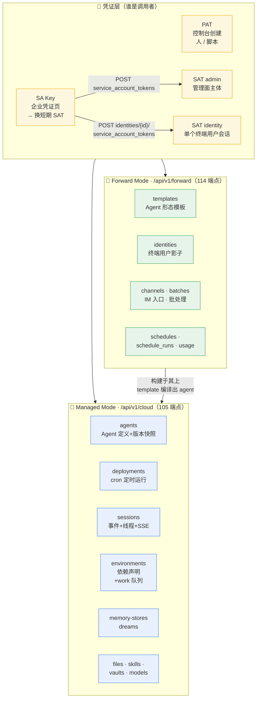

## 两 Mode 资源矩阵（端点数）

| 资源族 | cloud | forward | 关键差异 |
| --- | --- | --- | --- |
| agents | 6 | — | Forward **没有 Agent 概念**（藏在 Template 里编译） |
| **deployments** | **12** | — | cron 调度 Agent，每次 Run 生成 Session（本篇新讲） |
| dreams | 5 | — | 记忆整理（V6 已讲） |
| environments/work | 8 | — | BYOC 工人队列，仅 self_hosted（本篇新讲） |
| environments | 6 | 5 | Forward 无 archive 无 work；删除查 Template 引用 |
| files | 7 | 5 | 白名单一致；Forward 无 5MB 硬限改容量配额 |
| memory-stores | 14 | 17 | Forward 多 mount 三端点，挂到 (identity, template) |
| sessions | 21 | 16 | create：Managed 传 `agent` / Forward 传 `template_id + identity_id` |
| skills | 10 | 10 | 同构：不可变版本 = epoch 微秒时间戳 |
| vaults | 14 | 9 | Managed 有 start-oauth/validate；Forward"自带 token" |
| **templates** | — | **6** | Forward 的 Agent 定义层（本篇新讲） |
| **identities** | — | **15** | 最大单族！影子身份 + 配置覆盖 DSL（本篇新讲） |
| **channels** | — | **9** | wechat/wecom/feishu/dingtalk（本篇新讲） |
| **batches** | — | **7** | JSONL 离线批（本篇新讲） |
| schedules + runs | — | 10 | V5 已讲（Forward 调度器） |
| usage | — | 2 | credits/时长/session 数两维计量 |
| service-account-tokens | — | 3 | admin / identity 双主体 |

> 注意一个不对称：Managed sessions 有完整 resources 五件套（add/get/update/delete/list），Forward 只有 `add-resource`（且仅 file）——**Forward 把资源挂载从 Session 运行时挪到了 (identity, template) 静态绑定**，记忆库挂载就是证明。

## API 风格指纹

读完 213 个端点，跨族重复出现的模式就是这家的"API 方言"：

| 模式 | 表现 | 证据 |
| --- | --- | --- |
| 归档 = 唯一软删除 | `archived_at` 字段 + `include_archived` 过滤全族一致；配置类资源基本无 delete | agents/deployments/templates/schedules 全族 |
| 不可变版本三连 | Agent 版本快照 / Skill epoch 微秒版本 / Memory tombstone 版本 | 内容型资源一律 append-only |
| 写路径 POST + merge-patch | metadata「null 删 key、省略不动」全局统一；幂等键广泛支持（memory-store 创建**必填**） | 全部 update 端点 |
| ID 即类型即时间 | 22 种前缀（`agent_`/`sess_`/`env_`/`memstore_`/`evt_`/`sesr_`/`sthr_`…）+ UUIDv7（`019e` 开头） | 游标分页直接复用 ID |
| 引用检查再删除 | Managed 删资源查 **Session** 引用（409）；Forward 查 **Template** 引用 | 两 Mode 的引用单位不同 |
| 密文 write-only | 所有凭证字段只在创建请求出现，错误消息也脱敏 | vaults/credentials/channels |
| 能力灰度双闸门 | `browser_toolset_20260714` 工具集 + `x-qoder-beta: browser-use-2026-07-14` 头 | 日期命名的版本对 |
| 错误信封 OpenAI 风 | `error.type`/`param`/`request_id`；资源模型 Anthropic CMA 风 | 两头兼容降低迁移成本 |

## 小结

| 问题 | 答案 |
| --- | --- |
| API 总量 | 238 篇文档 / 213 端点 / 25 Schema 页 |
| 布局 | 凭证层 → Managed（105）→ Forward（114），Forward 反超 |
| 方法风格 | 无 PATCH，更新一律 POST（对齐 CMA） |
| V1–V7 缺口 | Deployments、Forward 深层、Work API、事件溯源观 |

> **一图流记忆**：**105 vs 114**——**原语层 vs 交付层**，交付层已经更大；读 API 先读这张分层图。

# Deployments：把 Agent 变成定时任务

1. V1–V7 完全没讲的一族（12 个端点）：**Deployment = Agent × 触发策略 × Environment × 初始事件**，每次触发创建一个 Session
2. 它是 Managed Mode 的调度层——对照 V5 讲过的 Forward `schedules`：**平台有两个调度器**，一个面向开发者（`agent_id`），一个面向交付（`template_id + identity_id`）
3. 文档明确写着 **"CMA 对齐"** 小节——Qoder 在兼容 **Anthropic** 的 **Managed Agents API** 规范（`POST /v1/deployments`），**跨厂商部署**标准的信号

> **一句话**：Deployment 是"**无人值守的 Session 工厂**"——cron 到点、或手动 `run`，就按配方造一个 Session 跑一轮。

## 工作模型

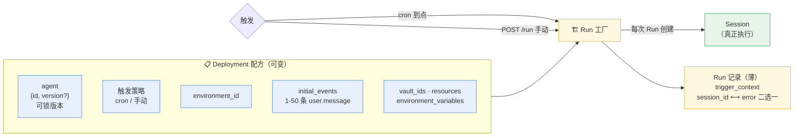

## 状态机与生命周期

| 操作 | 语义 | 细节 |
| --- | --- | --- |
| `POST /deployments` | 创建 | **cron 或纯手动**；`environment_variables` 复用 Session 校验；**self_hosted** 不支持 |
| `run` | 手动触发一次 | **异步**：立即返回 Run 记录，后台建 Session 执行 |
| `pause` / `unpause` | 暂停/恢复 | `paused_reason: {"type":"manual"}`；重复暂停 409；恢复重算 `upcoming_runs_at` |
| `archive` | 归档（不可逆） | 名称追加 `_archived_<unix_ts>` **释放原名**；无 unarchive 端点 |
| 三个 Run 端点 | 嵌套/全局/跨库 | `/{id}/runs/{run_id}` 校验父子；`/deployment_runs/{run_id}` 直取；`GET /deployment_runs` 跨 Deployment 列表（过滤最全：trigger_type/has_error/时间） |

> `status` 只有两值 `active`/`paused`，归档用独立字段表达——又是"状态与生命周期分离"的归档模式。

## CMA 对齐：字段对照

| Anthropic CMA | Qoder 实现 | 差异 |
| --- | --- | --- |
| `POST /v1/deployments` | `POST /api/v1/cloud/deployments` | 路径加 cloud 前缀 |
| `agent` 引用对象 | `{id, type: "agent", version?}` | Qoder 兼收纯字符串 |
| PATCH 更新 | **`POST /{id}` 更新** | 文档明说"用 POST 非 PATCH 以对齐 CMA" |
| — | `environment_variables`（扩展） | Qoder 独有 |
| — | `upcoming_runs_at`（未来触发时间） | Qoder 独有 |

## 两个调度器的对照（本篇关键增量）

| 维度 | Managed `deployments` | Forward `schedules`（V5 已讲） |
| --- | --- | --- |
| 执行单元 | `agent_id`（可锁版本） | `template_id + identity_id` |
| 触发策略 | cron / 手动 | cron / once / interval / manual 四种 |
| 会话复用 | 每次 Run 新 Session | `new_session` / `reuse_session` 可选 |
| 重试 | 无 | `max_attempts` 1–2 |
| 并发超限 | — | 落 `skipped` Run（不排队） |
| IM 投递 | 无 | `sinks`（channel_pairing_id）带独立 push 状态 |

> **一图流记忆**：**Deployment** 是 **Session 工厂**——配方可变（merge-patch），产品是**一次性 Session**，Run 只是薄薄的**提货单**（session_id 和 error 永远二选一）。

# Forward Mode：三级配置体系

1. V1 只给了 Forward vs Managed 对比表；这次 114 个端点摆开，Forward 的真实形态是**一套编译器**：企业资源 → Template 基线 → Identity Config 覆盖层 → **effective 编译产物**
2. Identity 是 V1–V7 完全没讲的概念（15 个端点、最大单族）：**终端用户的"影子账号"**——认证归集成方，Qoder 只收敛 Session/配置/资源/审计上下文
3. 编译产物带 sha256 hash（`effective_hash`）——Docker layer 式的变更追踪心智

> **一句话**：Forward 不暴露 Agent，暴露**"模板 + 身份"两个 ID**——运行时配置是**编译**出来的，调用方只能白名单覆盖。

## 配置编译链

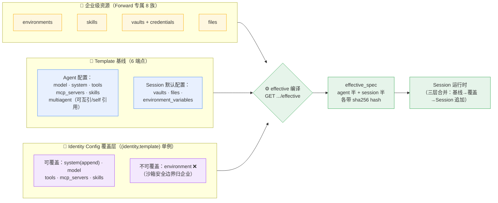

## Identity：影子身份的机制剖析

| 端点 | 语义 |
| --- | --- |
| `create` | 只需 `external_id`（集成方用户 ID，**租户内唯一**）+ 可选 metadata |
| `ensure-admin` | 幂等获取内置管理员身份 `__qca_admin_identity__`（只读，disable/clear 均 409） |
| `upsert-config` / `get-config` | 存取覆盖层 **DSL**（`op: set/unset`；资源 map 以 ID 为 key，`{"enabled": false}` 禁用继承，`null` 恢复继承） |
| `effective` | 编译产物（不含 DSL 的 `enabled`/`op` 存储字段） |
| `clear` | 清理"未来会话"的配置/绑定/调度/会话，**本体保留**、历史不动 |
| `stats` | `total_identities` / `active_identities`（近 7 天有活动）/ session 数 |

> 文档原话："Identity 不是 Qoder 登录账号，也不是 IAM user。**真实终端用户认证**仍由**集成方**负责。"——**BYO 用户体系，平台只隔离不认证**。

## 认证三体（B2B2C 拓扑）

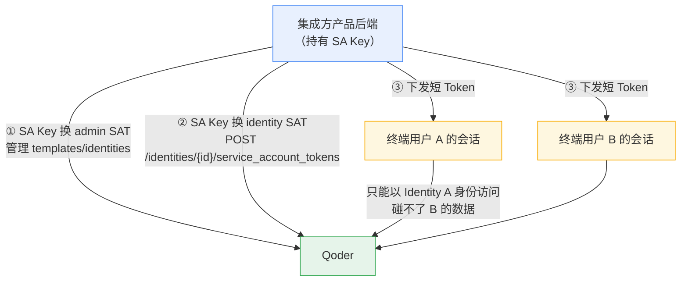

| 主体 | 端点 | 权限 | TTL |
| --- | --- | --- | --- |
| PAT | 控制台 | 人/脚本，全 API | 长 |
| SAT `admin` | `POST /forward/service_account_tokens` | 管理面（Templates/Identities/Sessions） | ≤12h |
| SAT `identity` | `POST /forward/identities/{id}/service_account_tokens` | 数据面，**只能以该 Identity 身份** | ≤12h，官方建议"一会话一 Token" |

> V4 讲过 SAT 换票（`openapi.qoder.com` 的 exchange，scope `qca.access`/`forward.access`）；本篇补上的是 **identity 主体**——双 scope SAT 在 Forward 拥有管理员权限，最小化签发是安全红线。

## 记忆挂载拓扑（Forward 特有）

- 挂载目标是 **(identity, template) 二元组**：`POST /identities/{id}/templates/{tid}/memory_stores`，body 只有一个 `memory_store_id`
- **恰好一个 read_write**（系统默认库，Session 首建自动配）+ **≤10 个 read_only 显式挂载**
- 官方披露原因："多个可写库同时挂载时，上游选择写入目标的查询没有确定排序"——**1 写 N 读**是工程上的确定性选择
- 沙箱内仍按 V6 讲的 `/data/.qoder/awareness/` 扁平合并投影

## usage：交付层的计量 API

| 端点 | 维度 | 返回 |
| --- | --- | --- |
| `GET /forward/usage/identities` | 按 Identity | session 数 / duration_seconds / credits（两位小数）/ session_ids 明细 |
| `GET /forward/usage/templates` | 按 Template | 活跃 Identity 数 / session 数 / 时长 / credits |

> 时间窗口 Unix 毫秒、跨度上限 31 天；单次调用级用量在事件流的 `span.model_request_end.model_usage.credits`——**计量从单次调用到月度账单一条链打通**（呼应 V6 计费篇）。

## 小结

| 问题 | 答案 |
| --- | --- |
| Forward 本质 | 三级配置编译器：**企业资源 → Template → Identity 覆盖 → effective** |
| Identity 是什么 | BYO **终端用户影子账号**（external_id），平台只隔离不认证 |
| 安全边界 | environment 不可覆盖；admin/identity 双主体 SAT |
| 记忆拓扑 | 1 个可写默认库 + ≤10 只读共享库，挂 (identity,template) |
| 变更追踪 | effective_hash（sha256），Docker layer 心智 |

> **一图流记忆**：Forward = **编译器**——`template_id + identity_id` 进，effective_spec 出；沙箱归企业，行为可个性化。

# Channels 与 Batches：Forward 的入口与吞吐

1. Channels（9 端点）把 Agent 接进 **wechat / wecom / feishu / dingtalk** 四个 IM——传输连接与执行上下文**显式解耦**
2. Batches（7 端点）是 **JSONL 离线批处理**：单批 1 万行、全局并发 50、跑在**闲时窗口（默认 22:00–08:00）**——夜间闲置算力变现的设计
3. 两族共同点：都是"**无人值守**"场景，所以 `always_ask`/`always_deny` 权限策略在 Batch 里**直接判行失败**

> **一句话**：Channels 是"**人找 Agent**"（IM 入口），Batches 是"**机器找 Agent**"（离线吞吐）——Forward 的两个批量入口。

## Channel 拓扑与配对

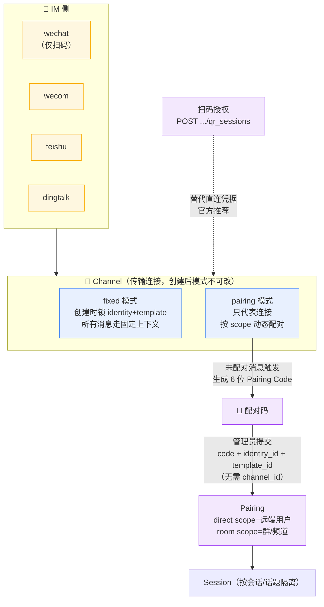

| 机制 | 要点 |
| --- | --- |
| 扫码状态机 | `waiting → scanned → confirmed / expired / denied / error`，默认 3s 轮询 |
| 凭据最小化 | 官方 Warning"非必要不推荐直接配置凭据"；secret 全链路 write-only 不回显 |
| room 粒度 | 同群不同成员/话题**共享一个 Pairing**，但 Session 与回复按会话/话题隔离 |
| 可用条件 | `enabled=true` 且 `binding_status=bound`；渠道数有配额 |

## Batch 流水线

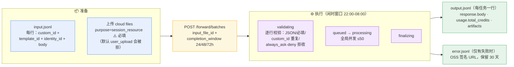

| 约束 | 值 |
| --- | --- |
| 单批上限 | 10,000 行 |
| 全局并发 | 50 个 task |
| 调度窗口 | 闲时 22:00–08:00（后台可配） |
| 取消粒度 | 整批（异步 cancelling；pending 批量标 cancelled，running 逐个 CancelSession） |
| 结果保留 | 30 天（超期 410） |

> 三个坑：① 输入文件上传时 `purpose` 必须显式传 `session_resource`——默认值 `user_upload` 会被服务端拒绝下载（400 `invalid_input_file`）；② 失败行**同时出现在** output 和 error 两个文件但不带 usage；③ 重试创建的新 Session 只记最终 Session 的 credits（不累计被替换的）。

## 小结

| 问题 | 答案 |
| --- | --- |
| 四渠道 | wechat（仅扫码）/ wecom / feishu / dingtalk |
| Channel vs Pairing | 传输连接 vs scope 级执行上下文绑定（6 位码） |
| Batch 输入 | JSONL 文件（purpose=session_resource） |
| Batch 定位 | 闲时离线吞吐，无人值守（ask/deny 权限直接拒） |
| 共同红线 | 凭据 write-only；结果文件 30 天过期 |

> **一图流记忆**：Channel 管**谁的消息进来**，Pairing 管**用哪个身份+模板应答**；Batch 是**夜班工人**——1 万行、50 并发、只在闲时干活。

# Work API：BYOC 工人协议

1. V6 曾从"Session 起来后文件才挂载"**推断**过一个 **work 队列模型**——这次 API 文档把完整协议摆出来了（8 端点，全部在 `environments/work/`）：**推断证实，且细节更精彩**
2. 它是 `self_hosted` Environment 专属：官方文档原话"**Self-hosted Environment 不会启动托管云端容器**，外部 worker 通过 Work API 操作"——**worker 是你侧的长驻进程**（`setup_script` 示例就是 `./initialize-worker.sh`，初始化的是 **worker** 而非**每个 Session 的容器**），**主动**从 **Qoder 云端队列**拉任务，**纯 pull 模型，无推送通道**
3. **work item** 的 **payload** 恒为 `{type: "session", id: "sess_..."}`——**队列投递的工作单元就是"在我这台机器上跑这个 Session"**
4. Qoder 只定义**队列协议**（poll/ack/heartbeat/stop + `user.tool_result` 事件回传），"运行 Session"的具体实现是 **BYOC 自由度**——见下方两种拓扑

> **一句话**：BYOC（**Bring Your Own Compute**）——**云管调度，你管执行**；worker 用 **long-poll** 领活，心跳续租约，至少一次投递。

## 完整协议时序

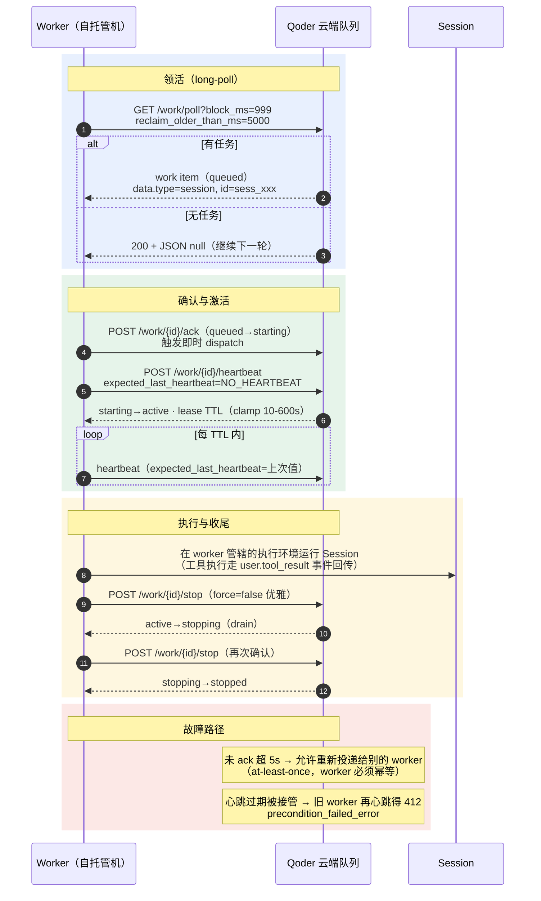

## 状态机与关键参数

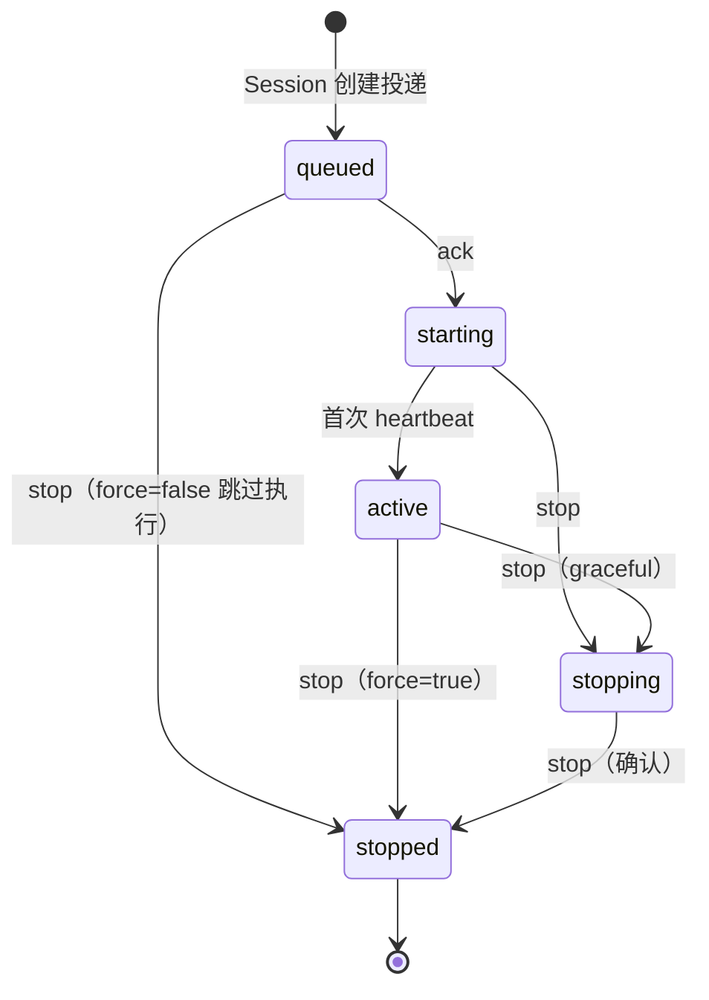

| 参数 | 值 | 说明 |
| --- | --- | --- |
| `block_ms` | 1–999 | long-poll 等待上限；空闲返回 `200 + null` 而非 204 |
| `reclaim_older_than_ms` | 默认 5000 | 投递未 ack 超时 → 可重投（at-least-once） |
| `desired_ttl_seconds` | clamp 10–600 | lease 租约时长 |
| `expected_last_heartbeat` | `NO_HEARTBEAT`/上次值 | 乐观所有权校验，被接管返回 **412** |
| `Worker-ID` 头 | 自定义字符串 | **弱身份非凭据**：poll/ack 不一致 409；stats 统计口径（近 30s） |

## BYOC 拓扑：Qoder 只定协议，执行自便

**worker** 是**长驻**进程，但它**不必然自己执行**——协议没规定"**运行 Session**"意味着什么，两种合法拓扑：

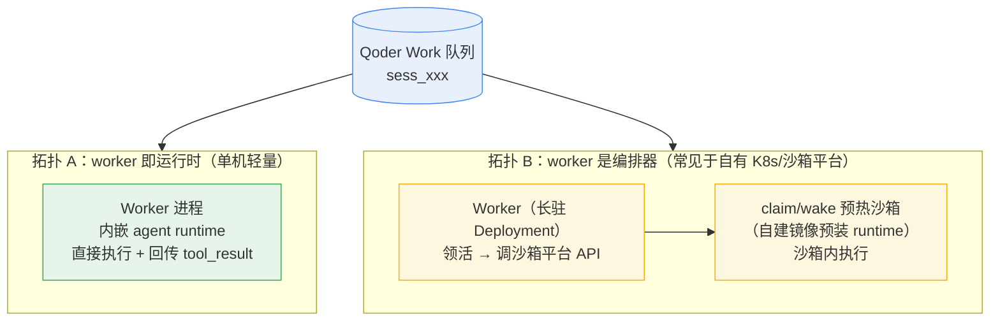

| 维度 | 拓扑 A：worker 即运行时 | 拓扑 B：worker 编排 + 沙箱执行 |
| --- | --- | --- |
| 形态 | 单进程，**worker 内嵌 agent loop** | 长驻 worker（Deployment）+ **per-session 沙箱** |
| 执行隔离 | 无（与 worker 同进程） | MicroVM/容器级隔离 |
| 弹性 | 无 | 预热池 claim（百毫秒）/ 休眠唤醒（秒级内存恢复） |
| 闲置成本 | worker 常驻即可 | 沙箱可休眠（内存保持）释放算力 |
| 适合 | 本机/单机试跑、CI | 生产多租户、自有 K8s 沙箱平台（如阿里云 ACS Agent Sandbox） |

> 判别两种拓扑的协议证据：`user.tool_result` 事件的官方注解是"**self-hosted worker 回传**内置工具结果"——工具执行发生在 worker **管辖**的环境里，至于那是**它自己的进程**还是**它编排的沙箱**，云端不感知也不关心。

### 四无 ≠ 四缺：注入方转移（拓扑 B 的真正卖点）

self_hosted 的"无 packages / env vars / resources / memory 注入"不是能力阉割，而是**注入职责移交**——Qoder 云端退位为**数据源** + **API 提供方**，worker + 自有沙箱平台**接管注入**：

| Qoder 不注入的 | 自有集群的等价实现 | 实现档位 |
| --- | --- | --- |
| packages | 镜像预装 + claim 时 init 注入 | 镜像消化 |
| env vars | worker 领活后经沙箱 claim 的 `envVars` 注入 | worker 注入 |
| resources（file / github） | worker 调 `files/{id}/content` 预签名 URL 自取挂载、仓库自行 clone | worker 注入 |
| memory | 文件系统挂载 + Memory API 双向同步 | **API 中转 + 自研同步** |

> 代价有二：**安全边界自负**（平台网络出口管制对 self_hosted 不生效，要用自有 TrafficPolicy / 安全组补位）；**依赖快照化**（镜像依赖是快照，改依赖需重打镜像）。Session metadata 仍会投影到 work item（≤8KB），可作业务自定义配置通道。

## 机制剖析

| 洞察 | 解读 |
| --- | --- |
| **纯 pull + 无 SSE/webhook** | BYOC 网络方向单一（**worker 出站连接**），无需入站开洞——防火墙友好 |
| **at-least-once + 幂等 ack** | `reclaim_older_than_ms` 重投 与 "ack 对 starting/active 可安全重试" 是一体两面 |
| `Worker-ID` 是弱身份 | 归属校验（不一致 409）+ 可观测统计，**不是认证**——安全靠 SAT |
| metadata 是会师点 | Session 创建时其 metadata 被投影到 work item 的字符串 map，worker 可续写运行时标注（`merge-patch`，null 删 key） |
| worker 长驻、初始化一次 | `setup_script` 示例 `./initialize-worker.sh` 初始化的是 **worker 进程**；per-session 的是它手里的活，不是容器 |
| 非 self_hosted 一律 400 | **cloud/self_hosted** 双形态在 API 层硬隔离；self_hosted 无 **packages/env vars/resources/memory** 注入——**Work API 是它唯一的专属补偿机制** |

## 小结

| 问题 | 答案 |
| --- | --- |
| 谁 poll 谁 | **worker 主动 long-poll 云端队列**（≤999ms） |
| worker 形态 | **长驻进程**（setup_script 初始化一次）；**执行拓扑自由**（即运行时 / 编排 + 沙箱） |
| 工作单元 | 恒为"**运行某个 Session**"（sess_ ID） |
| 投递语义 | **at-least-once**（5s 重投 + 幂等 ack） |
| 租约 | heartbeat 续约，TTL 10–600s，乐观校验 412 |
| 状态机 | **queued→starting→active→stopping→stopped** |

> **一图流记忆**：**worker 长驻、poll 领活、ack 确认、heartbeat 续命、stop 收尾**——协议是**云定**的，**执行是你自己的**（V6 的推断拿到官方实锤）。

# 事件溯源与系列收官

1. 读完 213 个端点最震撼的架构事实：**Session 没有独立的"消息"资源**——一切输入输出（含 `session.updated`、`session.deleted`）都是 `evt_` 事件，连**模型调用的计量**（`span.model_request_start/end`）也在同一条流里
2. 事件类型 30+ 种分六族：用户输入 6 种（只有 `user.*` 可写，**不能伪造 agent 事件**）、agent 输出、message 级增量、event_start/delta 帧、Session 状态、span 计量
3. V3 讲了 SSE 的**用法**，这里补上**架构观**：事件账本是唯一事实源，**Session/Thread** 只是事件流上的"窗口"

## 事件账本全景

```mermaid
flowchart LR
    subgraph WRITE["✍️ 可写（仅 6 种 user.*）"]
        direction TB
        UM["user.message"]
        UI["user.interrupt"]
        UTC["user.tool_confirmation<br/>（allow/deny 双向确认）"]
        UTR["user.tool_result<br/>（self-hosted worker 回传）"]
        UCT["user.custom_tool_result"]
        UDO["user.define_outcome<br/>（rubric 评分）"]
    end

    LEDGER[("📜 事件账本（唯一事实源）<br/>evt_ 前缀 · 30+ 公开类型")]

    subgraph READ["📖 三个读通道"]
        direction TB
        LIST["GET /events<br/>JSON 分页（历史）"]
        SSE["GET /events/stream<br/>SSE（实时 + Last-Event-ID 续传）"]
        THR["threads/{id}/stream<br/>单线程 SSE"]
    end

    subgraph FAM["事件六族"]
        direction TB
        F1["① 用户输入 user.*"]
        F2["② agent 输出<br/>message·thinking·tool_use"]
        F3["③ message 级增量（旧）"]
        F4["④ event_start/event_delta（新）"]
        F5["⑤ session 状态<br/>status_·thread_·error"]
        F6["⑥ span 计量<br/>model_request_*"]
    end

    WRITE --> LEDGER
    AGENT2["Agent 运行时"] --> LEDGER
    LEDGER --> READ
    LEDGER --> FAM

    classDef write fill:#e6f4ea,stroke:#34a853
    classDef ledger fill:#fef7e0,stroke:#f9ab00
    classDef read fill:#e8f0fe,stroke:#4285f4
    classDef fam fill:#f3e8fd,stroke:#a142f4
    class UM,UI,UTC,UTR,UCT,UDO write
    class LEDGER,AGENT2 ledger
    class LIST,SSE,THR read
    class F1,F2,F3,F4,F5,F6 fam
```

| 洞察 | 证据 |
| --- | --- |
| 写白名单 + 读过滤 | Forward 的 list-events 默认过滤 agent ID/environment ID/worker/trace 等运行时私有字段——双向防泄漏防注入 |
| 增量帧不进历史 | `event_start`/`event_delta` 是 stream-only，同一 `evt_` ID 复用于最终 buffered 事件 |
| 内容协商双模端点 | `GET /events` 带 `Accept: text/event-stream` 即切 SSE（V7 公告的 List 接口 SSE 行为即源于此） |
| 单写者 turn | running 时再发 `user.message` 409；并行下放到 thread 层（coordinator 展开） |
| 计量入流 | `span.model_request_end.model_usage.credits` + Session `usage.total_credits` + usage API 聚合——单次到月度一条链 |

## V1–V8 系列全家福

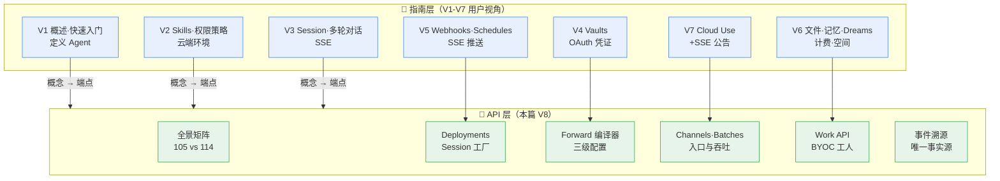

## 彩蛋：文档里的实现指纹

| 发现 | 证据 | 解读 |
| --- | --- | --- |
| **对齐 Anthropic CMA** | deployments 文档"CMA 对齐"小节；POST 更新 | 跨厂商 Agent 部署标准的兼容战略 |
| 内部代号 CAW | 环境变量保留前缀 `CAW_`（疑 Cloud Agent Worker） | 实现层命名暴露 |
| Forward 是薄封装 | "上游硬上限 16 键、Forward 注入 created_by 占 1 键"；`latest_version` 三态过渡期 | Forward 包在既有内部资源体系上 |
| 未公开聚合端点 | `GET /forward/resources?type=memory_store` 被引用但无文档页 | 文档引用了未发布 API |
| Agent 会覆盖管理面 | Agent 运行时把 memory metadata 整体替换为 `{"source":"agent"}` | 管理面与数据面不隔离，外部灌知识要接受被改写 |
| 流式协议换代中 | `event_deltas[]` 仅支持 message/thinking；`event_start.event` 有"预留字段" | 工具调用流式在路线图上 |

## 小结

| 问题 | 答案 |
| --- | --- |
| 架构核心 | 事件溯源——无消息资源，账本是唯一事实源 |
| 写入边界 | 仅 6 种 `user.*`；agent/状态事件不可伪造 |
| 计量链路 | span 事件 → Session 累计 → usage API → Credits 账单 |
| 系列闭环 | V1–V7 指南视角 + V8 API 视角 = 完整拼图 |

> **一图流记忆**：**一切皆事件**——发是事件、收是事件、状态变更是事件、连花了多少 Credits 都是事件；读 API 就是读账本，V8 补上的正是这本账的**总目录**。
