# Overview

Envoy AI Gateway is an open source project for using **Envoy Gateway** to handle **request traffic** from application clients to **Generative AI services**.

<!-- more -->

# Usage

> When using Envoy AI Gateway, we refer to a **two-tier** gateway pattern.

1. **The Tier One Gateway** functions as a **centralized entry point**
   - handles <u>authentication</u>, <u>top-level routing</u>, and <u>global rate limiting</u>
2. The **Tier Two Gateway** handles **ingress traffic** to a **self-hosted model serving cluster**
   - provides <u>fine-grained control</u> over <u>self-hosted model</u> access, with **endpoint picker** support for **LLM inference optimization**


# Introduction

> 为什么需要专门的 **AI 网关**

## 背景：为什么要做这件事

1. 当时行业有两股力量在博弈：
   - 商业网关（如 Kong Enterprise、AWS API Gateway）把 **AI 流量管理**功能锁在**付费企业**版里
   - 单公司开源（如 Portkey）虽然开源，但缺乏多**公司协作**的生态
2. Tetrate（**Envoy 商业公司**）和 Bloomberg（**大型金融企业用户**）联手，选择在 **CNCF Envoy** 社区内做开放协作
   - 不是建新项目，而是在已有的 **Envoy Gateway** + **Envoy Proxy** 上扩展

## 核心论点：LLM 流量 ≠ 传统 API 流量

> 表面上看起来一样（客户端 → API 请求 → 后端服务），但本质不同

| 维度     | 传统 API                   | LLM API                                                    |
| -------- | -------------------------- | ---------------------------------------------------------- |
| 请求成本 | 固定（每次请求消耗差不多） | **波动巨大**（取决于 **token** 数量）                      |
| 限流方式 | 按请求次数                 | 必须**按 token 数**（计算复杂度的近似）                    |
| 成本感知 | QoS 为主                   | 必须**实时考虑成本**                                       |
| 多后端   | 少量固定后端               | 多个 LLM Provider（OpenAI、AWS Bedrock 等），各自 API 不同 |

## MVP 三大功能

### Usage Limiting（Token 限流）

1. 传统限流按"每秒请求数"不管用，因为一个**长 prompt** 的**请求消耗**远大于**短请求**
2. 必须按 token 数（**输入 + 输出**）来控制**用量**和**成本**

### Unified API（统一 API）

1. 不同 **LLM Provider** 的 **API 格式**各异（OpenAI vs Bedrock vs Vertex）
2. 网关对外暴露**统一接口**，客户端不需要关心后端是哪家
3. 后续 v0.1 落地为 **OpenAI 兼容 API**

### Upstream Authorization（上游鉴权）

1. **多个 Provider** 意味着**多套 API Key** 需要管理、轮换
2. 网关**集中管理凭证**，客户端只需一个**内部 token**
3. 后续演化为"**凭证注入**"模式

# Reference Architecture

> 定义了 **Envoy AI Gateway** 在**企业生产环境**中应该怎么**部署**

## 核心架构：双层网关 (Two-Tier Gateway)

> 清晰的分层设计

```
┌─────────────────────────────────────────────────────┐
│                   客户端应用                          │
│         (统一 API，无需知道后端是谁)                    │
└──────────────────────┬──────────────────────────────┘
                      │
           ┌──────────▼──────────┐
           │   Tier 1 Gateway    │  ← 集中式网关集群
           │   (Envoy AI Gateway)│
           │                     │
           │  • 统一 API 入口     │
           │  • 认证 & 鉴权      │
           │  • 全局限流          │
           │  • 凭证注入          │
           └──┬──────────┬───────┘
              │          │
    ┌─────────▼──┐  ┌───▼──────────────┐
    │ 外部 LLM   │  │  Tier 2 Gateway   │  ← 自托管集群内部
    │ Providers  │  │  (Envoy AI GW +   │
    │            │  │   KServe)         │
    │ • OpenAI   │  │                   │
    │ • Anthropic│  │  • 模型版本管理    │
    │ • Bedrock  │  │  • 内部负载均衡    │
    │ • Vertex   │  │  • GPU 自动扩缩   │
    └────────────┘  └───┬──────────────┘
                        │
                 ┌──────▼──────┐
                 │ 自托管模型    │
                 │ (vLLM 等)    │
                 └─────────────┘
```

## 为什么是两层而不是一层

> 分层的本质：**关注点分离** - <u>外部访问的稳定性</u> vs <u>内部运维的灵活性</u>，两层**独立演进**互不干扰

### Tier 1 解决的问题

1. **应用开发者**面对**多个 LLM Provider**，API 格式各异 → **统一 API**
2. 每个 Provider 各自的 API Key 散落在各应用中 → **凭证注入，集中管理**
3. 无法<u>全局控制</u>和<u>追踪用量</u> → **单点流量治理**
4. 安全策略不一致 → **集中策略执行**

### Tier 2 解决的问题

1. 自托管模型有自己的**运维节奏**（版本升级、A/B 测试、扩缩容）
2. 内部变更不应该影响外部客户端
3. GPU 资源调度、模型缓存等是**模型服务层**面的关注点

## KServe - 自托管模型服务

> 自托管是**可选**的 - 很多组织**初期只用外部 Provider**，后续按需引入 Tier 2

| 能力                          | 意义                                     |
| ----------------------------- | ---------------------------------------- |
| **Token-based** 自动扩缩容    | 按实际 **LLM 负载**弹性伸缩 **GPU 资源** |
| **Scale-to-zero**             | GPU 很贵，**空闲**时缩到**零**节省成本   |
| **多节点推理** (via **vLLM**) | 大模型需要**跨 GPU 分布式推理**          |
| **OpenAI 兼容 API**           | 与 Tier 1 网关的**统一 API** 对齐        |

## 生产就绪三大支柱

> 企业**生产环境**需要三个维度的能力

### 可观测性 (Observability)

1. **OTel** 集成，遵循 **GenAI** Semantic Conventions
2. **OpenLLMetry** 做**细粒度 LLM 指标**（<u>prompt/completion 长度</u>、<u>token 吞吐</u>）
3. **集中式日志**：跨 Provider **统一审计**

###  控制 (Control)

1. **用量防护栏**：防止成本超支
2. **合规执行**：提示词安全检查、输出验证
3. 不同于应用内嵌入检查，在**网关层集中执行**

### 优化 (Optimization)

1. KServe **模型缓存**降低**推理延迟**
2. **disaggregated serving** - 将**计算密集**的推理阶段和**内存密集**的操作**分开管理**，最大化**硬件效率**

## 架构的可插拔性

1. 可以**只用外部 LLM**，不要 Tier 2
2. 可以用**任何 Provider**，不限于已支持的
3. 可以加自定义 **Envoy 扩展过滤器**
4. 可以**跨集群**、**跨云**部署 Gateway

## Two-Tier Gateway Design

> 用**两层网关**解决企业 AI 平台的两个矛盾需求


### 为什么是两层，而不是一层？

> 先说问题：如果只用一层网关会怎样？单层方案的困境：

```
┌────────────────────────────────────┐
│      单个 Envoy AI Gateway          │
│                                    │
│  外部 LLM Provider 路由             │  ← 业务团队管
│  自托管模型路由                     │  ← 平台团队管
│  全局认证鉴权                       │  ← 安全团队管
│  模型版本管理                       │  ← ML 团队管
│  GPU 扩缩容策略                     │  ← 运维团队管
└────────────────────────────────────┘
     ↑ 所有人都要改这个网关，牵一发动全身
```

> **单层架构**的本质问题是**变更耦合**

1. ML 团队要发布新模型版本 → 需要修改网关配置 → 可能影响外部 LLM 流量
2. 安全团队要调整认证策略 → 同时影响内部和外部流量
3. 平台团队要调整 GPU 扩缩容 → 需要动生产网关

> **两层架构**的本质是**变更隔离**

```
┌─────────────────────────────────────────────────────┐
│                   Tier 1 网关                        │
│              (业务团队 / 安全团队关注)                │
│                                                      │
│  职责：外部 LLM Provider 路由 + 统一 API 入口         │
│  变更频率：低（认证策略、Provider 变更才需要改）       │
│  影响范围：所有外部客户端                             │
└──────────────────────┬──────────────────────────────┘
                      │ 统一 API / 统一认证
               ┌──────▼─────────┐
               │  路由决策       │
               └──┬────────┬────┘
                  │        │
   ┌──────────────▼─┐  ┌──▼──────────────────┐
   │  外部 LLM      │  │   Tier 2 网关        │  ← (平台团队 / ML 团队关注)
   │  Providers     │  │   (KServe 集群内)    │
   │                │  │                      │
   │  • OpenAI      │  │   职责：自托管模型    │
   │  • Anthropic   │  │   的内部路由、版本    │
   │  • Bedrock     │  │   管理、GPU 调度     │
   │  • Vertex      │  │   变更频率：高       │
   └────────────────┘  │   影响范围：仅内部   │
                       └──────────────────────┘
```

### Tier 1 网关：外部访问的统一入口

> 职责边界

1. 决定"这个**请求**应该去哪个 **Provider**"
2. 不关心"那个 **Provider 内部**怎么路由"

> 为什么"开发者不需要知道后端是谁"很重要？

```python
# 没有 Tier 1 的世界：应用代码需要感知多个 Provider
client = OpenAI(api_key="sk-xxx")        # OpenAI 调用
bedrock = boto3.client("bedrock")        # Bedrock 调用
vertex = aiplatform.gapic.PredictionClient()  # Vertex 调用

# 有 Tier 1 的世界：统一接口
client = OpenAI(api_key="internal-token", base_url="https://gateway.company.com/v1")
# Provider 切换对应用透明
```

### Tier 2 网关：内部模型的运维沙盒

> 具体场景

| Tier 2 的变更                  | 单层架构的影响                       | 两层架构的影响                             |
| ------------------------------ | ------------------------------------ | ------------------------------------------ |
| 发布新模型版本                 | 需要改生产网关配置，可能影响外部流量 | 只改 Tier 2，Tier 1 无感知                 |
| A/B 测试两个模型变体           | 配置混在一起，难以回滚               | Tier 2 内部完成，Tier 1 看到的是同一个服务 |
| GPU 扩缩容策略调整             | 可能影响网关稳定性                   | Tier 2 自治，Tier 1 继续服务               |
| 安全团队要加新的 Provider 鉴权 | 需要和 ML 团队协调模型路由变更       | Tier 1 独立变更，Tier 2 不受影响           |

> KServe 在 Tier 2 中的角色

```
Tier 2 Gateway
     │
     ▼
┌──────────────────────────────────────┐
│           KServe                     │
│                                      │
│  ┌─────────┐  ┌─────────┐  ┌───────┐│
│  │ Model   │  │ Model   │  │ Model ││
│  │ v1.0    │  │ v2.0    │  │ v3.0  ││  ← 模型版本管理
│  └─────────┘  └─────────┘  └───────┘│
│       │            │              │  │
│  ┌────▼─────┐ ┌────▼─────┐ ┌─────▼───┐│
│  │ vLLM Pod │ │ vLLM Pod │ │vLLM Pod ││
│  │ (GPU)    │ │ (GPU)    │ │ (GPU)   ││
│  └──────────┘ └──────────┘ └─────────┘│
│                                      │
│  Token-based autoscaling ←── LLM 负载│
│  Scale-to-zero ←── 空闲时节省成本    │
└──────────────────────────────────────┘
```

### 三大特性：Routing and Traffic Management

#### Upstream Authentication with Credential Injection

> 问题场景：没有 Gateway 的**凭证管理**噩梦

```
┌────────────┐  API Key: sk-xxx   ┌──────────┐
│ 应用 A     │ ──────────────────▶│ OpenAI   │
└────────────┘                   └──────────┘

┌────────────┐  API Key: sk-yyy   ┌──────────┐
│ 应用 B     │ ──────────────────▶│ Bedrock  │
└────────────┘                   └──────────┘

┌────────────┐  API Key: sk-zzz   ┌──────────┐
│ 应用 C     │ ──────────────────▶│ Vertex   │
└────────────┘                   └──────────┘
```

1. 12 个应用 × 5 个 Provider = 60 个 API Key **散落在各处**
2. Key 轮换需要改 12 个应用
3. 开发者本地调试需要访问生产 Key

> Gateway 的解决方案 - **decouples** applications from **external secrets**

```
┌────────────┐  内部 Token     ┌─────────────────────┐
│ 应用 A     │ ────────────────▶│  Envoy AI Gateway  │
└────────────┘                  │                     │
                               │  凭证表：            │
┌────────────┐                  │  • App A → OpenAI  │
│ 应用 B     │ ────────────────▶│  • App B → Bedrock │
└────────────┘                  │  • App C → Vertex  │
                               │                     │
┌────────────└───────────────────┤  Key 轮换只需改这里  │
                               └─────────────────────┘
```

1. 应用代码不需要包含任何**外部 API Key**
2. 开发者本地可以用**内部 Token**，环境隔离
3. **安全审计**只看 Gateway，不扫所有应用

#### Token-Based Rate Limiting and Cost Optimization

> 为什么**请求次数**限流不够？传统限流：每秒 100 个请求

```
┌─────────────────────────────────────────┐
│  请求 1: "Hi"                   = 2 tokens   │
│  请求 2: "Hello"                 = 3 tokens   │
│  请求 3: "Summarize this book..." = 8000 tokens │
│  请求 4: "Hi"                   = 2 tokens   │
│  请求 3: "Summarize this book..." = 8000 tokens │
│  请求 4: "Hi"                   = 2 tokens   │
└─────────────────────────────────────────┘
总计：4 个请求，8007 tokens

问题：请求 3 的成本是请求 1 的 4000 倍，但传统限流把它们算成一样的权重
```

> **Token 限流**的实际作用 - Gateway 层面 - financial circuit breaker（**金融熔断**） - **保护钱包**

1. 策略：每分钟最多 10,000 tokens
2. 请求 1-4 共 8007 tokens → 通过
3. 再来一个 5000 token 的请求 → 被限流

> **estimated cost**

1. OpenAI GPT-4: 输入 $0.03/1K tokens, 输出 $0.06/1K tokens
2. Gateway 可以**在限流前先估算成本**
   - 1000 tokens in + 500 tokens out ≈ $0.06
   - 策略：单请求不超过 $1，则通过
   - 策略：每天不超过 $100，则累计到 $100 后限流

#### Observability Hooks for <u>Usage Patterns</u> and <u>Latency</u>

> 没有统一 Gateway 时，**多 Provider** 的**可观测性痛点**

1. OpenAI 的仪表板只能看 OpenAI 的用量
2. Bedrock 的 Cost Explorer 只能看 Bedrock 的用量
3. 没地方回答"团队 A 这个月在 LLM 上花了多少钱"
4. 没法比较"同样用 GPT-4，哪个团队延迟最高"

> Gateway 作为**统一观测点** - Gateway OTel Metrics

1. ai_gateway_request_tokens_total{provider="openai", model="gpt-4", team="A"}
2. ai_gateway_latency_seconds{provider="anthropic", model="claude-3"}
3. ai_gateway_cost_usd{team="B", provider="bedrock"}

> 可以回答

1. 哪个团队 token 用量最多？ → group by team
2. 哪个模型延迟最高？ → group by model
3. 新功能的 token 消耗如何？ → filter by feature tag

> 传统 HTTP 指标不够用

1. request_count → **没法反映成本**（前面说过的长短 prompt 问题）
2. latency → LLM 的 **TTFT**（Time To First Token）更重要
3. error_rate → LLM 可能"成功返回"但语义错误，需要**专门的观测**

> **GenAI 专用指标**

1. time_to_first_token_seconds（首字延迟） - **TTFT**
2. **prompt_tokens_total** / **completion_tokens_total**（分开统计）
3. **streaming_chunks_total**（流式响应的分块数）

### 总结：两层架构的权衡

| 层级   | 关注点                           | 变更频率 | 影响范围       | 主要受益者   |
| ------ | -------------------------------- | -------- | -------------- | ------------ |
| Tier 1 | 外部 Provider 接入、**统一 API** | 低       | 所有外部客户端 | 业务开发者   |
| Tier 2 | **自托管模型**运维、版本管理     | 高       | 仅模型服务集群 | 平台/ML 团队 |

> 架构本质

1. 用一个**稳定的 Tier 1** 吸收**外部系统的复杂性**
2. 用一个**灵活的 Tier 2** 承载**内部系统的快速迭代**
3. 两者通过**统一的 API** 解耦

## KServe 与自托管模型服务


### 为什么需要 KServe？

> 问题：从**训练**到**生产**之间的鸿沟

```
典型 ML 工程师的工作流：
训练模型  →  ✅ 熟悉（Python, PyTorch）
  │
  ▼
部署模型  →  ❌ 不熟悉（需要懂 K8s、网络、GPU、扩缩容...）
  │
  ▼
生产 API  →  ❓ 这不是我的专业领域
```

> 一个模型科学家训练完**模型**后，要想变成一个可用的 **API**，需要以下步骤（但这些都不是 **ML** 领域的知识）

1. 写 K8s YAML（Deployment、Service、Ingress...）
2. 配置 GPU 资源请求和限制
3. 实现健康检查和优雅关闭
4. 搭建监控和日志
5. 配置自动扩缩容策略
6. 处理模型版本管理和灰度发布

> KServe 的价值主张

```
有了 KServe：
训练模型  →  写一个 YAML 配置文件
  │
  ▼
KServe 自动生成：
  • K8s Deployment
  • Service
  • Ingress/Route
  • 健康检查
  • 监控指标
  • 扩缩容策略
  │
  ▼
生产 API ✅
```

### KServe 的四大能力

#### Autoscaling（自动扩缩容）

> 传统 HPA（Horizontal Pod Autoscaler）的问题 - 传统 HPA 基于 **CPU/内存**指标

```
┌─────────────────────────────────┐
│  CPU 用量高 → 扩容               │
│  但 LLM 的负载特征是：           │
│  • 请求可能很长（streaming）     │
│  • 一个请求占用 GPU 内存         │
│  • CPU 不高但 GPU OOM            │
└─────────────────────────────────┘
```

> KServe 的 LLM 专属扩缩容 - **Token-based autoscaling**

```
┌──────────────────────────────────────┐
│  指标：每分钟处理多少 tokens          │
│  • 当前 10K tokens/min，2 个 Pod     │
│  • 流量涨到 25K tokens/min → 扩到 5个 │
│  • 流量降到 2K tokens/min → 缩到 1个 │
└──────────────────────────────────────┘
```

> **Scale-to-zero** for GPUs

```
┌──────────────────────────────────────┐
│  GPU 很贵（$1-3/小时）               │
│  空闲时缩到零：                       │
│  • 无请求时 Pod 数 = 0               │
│  • 有请求时冷启动（加载模型到 GPU）   │
│  • 适合开发/测试环境                 │
└──────────────────────────────────────┘
```

#### Multi-node Inference via vLLM

> 大模型（如 Llama-3-70B）无法放入单个 GPU：

1. A100 80GB → 放不下 Llama-3-70B
2. 需要跨多个 GPU **分布式推理**

> vLLM 的**多节点推理**

```
┌─────────┐  ┌─────────┐  ┌─────────┐
│ GPU 0   │  │ GPU 1   │  │ GPU 2   │
│ Layer   │  │ Layer   │  │ Layer   │
│ 0-23    │  │ 24-47   │  │ 48-80   │  ← 模型层分片
└────┬────┘  └────┬────┘  └────┬────┘
    │            │            │
    └────────────┴────────────┘
                 │
           vLLM Runtime
           (张量并行推理)
```

> **KServe + vLLM** 集成意味着：你不需要自己写分布式推理的代码，配置一下就能跑大模型

#### OpenAI-compatible APIs

> 为什么这个重要？客户端代码统一

```python
# 对外部 Provider
client = OpenAI(api_key="xxx", base_url="https://openai.com/v1")

# 对 KServe 自托管
client = OpenAI(api_key="internal", base_url="https://kserve.company.com/v1")
       ↑         ↑
      同一个      只是 base_url 不同
      SDK
```

> 这使 Tier 2 **自托管模型**能无缝接入 Tier 1 的统一 API - **客户端完全无感知**

#### Model and Prompt Caching

> <u>Model Cache</u>（模型缓存）

1. **模型权重**加载到 **GPU 内存**
2. 多个请求**共享**同一份权重
3. 不用每个请求都重新加载

> <u>Prompt Cache</u>（提示词缓存）

1. 很多请求有**相同的 system prompt**
2. 缓存这些 token 的**中间计算结果**（**KV cache**）
3. **避免重复计算**，**降低延迟**

> "**Built-in support**" 意味着 KServe 已经处理好了这些优化，ML 工程师不需要自己实现

### Backstage

> Use **tools** like Backstage - Backstage 提供 **UI/UX** 层，让**数据科学家**不需要直接写 **K8s YAML** 或 **kubectl** 命令

```
┌──────────────────────────────────────┐
│           Backstage                  │
│                                      │
│  ┌─────────┐  ┌─────────┐  ┌───────┐│
│  │模型目录  │  │一键部署  │  │文档   ││
│  │         │  │         │  │       ││
│  │ • Llama │  │ [部署]   │  │ • API ││
│  │ • Mistral│  │ [升级]   │  │ • 示例││
│  │ • Custom│  │ [回滚]   │  │       ││
│  └─────────┘  └─────────┘  └───────┘│
└──────────────────────────────────────┘
           │
           │ (调用 KServe API)
           ▼
┌──────────────────────────────────────┐
│           KServe                     │
│  (实际执行部署操作)                   │
└──────────────────────────────────────┘
```

### Self-hosting is optional

> 两层架构**不强制自托管**，应该是**渐进式采用**路径

```
┌─────────────────────────────────────────────┐
│ Phase 1: 只用外部 Provider                   │
│                                              │
│  ┌─────────┐                                 │
│  │ Tier 1  │ ─────────▶ OpenAI/Anthropic... │
│  └─────────┘                                 │
│                                              │
│  成本：按 token 付费                         │
│  好处：零运维，快速上线                       │
└─────────────────────────────────────────────┘
                   │
                   ▼ (需求演进)
┌─────────────────────────────────────────────┐
│ Phase 2: 部分自托管                          │
│                                              │
│  ┌─────────┐                                 │
│  │ Tier 1  │ ─────────▶ 外部 Provider        │
│  └────┬────┘                                 │
│       │                                      │
│       └───────▶ ┌─────────┐                 │
│                  │ Tier 2  │                 │
│                  │ + KServe│ ──▶ 自托管模型   │
│                  └─────────┘                 │
│                                              │
│  好处：敏感数据不出域，成本可控               │
└─────────────────────────────────────────────┘
```

> 什么时候选择自托管？

| 因素     | 外部 Provider  | 自托管 + KServe               |
| -------- | -------------- | ----------------------------- |
| 数据隐私 | 数据发到第三方 | 数据不出域                    |
| 成本     | 按 token 付费  | 固定 GPU 成本（量大时更便宜） |
| 定制     | 只能用官方模型 | 可以 fine-tune、自定义模型    |
| 运维     | 零运维         | 需要 K8s/GPU 运维能力         |
| 上线速度 | 立即可用       | 需要部署和调优时间            |

### 总结

> KServe 在两层架构中的位置 - 让 **ML 工程师**不需要成为 K8s 专家，就能把模型部署成**生产级服务**

```
Tier 1 Gateway（统一 API 入口）
       │
       ├──▶ 外部 LLM Provider（OpenAI, Anthropic...）
       │
       └──▶ Tier 2 Gateway（自托管集群）
                │
                ▼
           ┌─────────┐
           │ KServe  │ ← 专注于"把模型变成可用的 API"
           │         │
           │ • 自动扩缩容
           │ • 多 GPU 推理
           │ • OpenAI 兼容
           │ • 缓存优化
           └─────────┘
                │
                ▼
           ┌─────────┐
           │ vLLM 等 │ ← 实际的推理运行时
           │ Runtime │
           └─────────┘
```

## Observability, Control, and Optimization

### Observability（可观测性）

> 两层可观测性架构

```
┌─────────────────────────────────────────────────────────┐
│                    统一可观测性层                        │
│                  (OpenTelemetry + GenAI 语义约定)        │
└───────────────────────┬─────────────────────────────────┘
                       │
       ┌───────────────┼───────────────┐
       ▼               ▼               ▼
  外部 Provider    自托管模型        应用层
  (OpenAI 等)     (KServe)        (调用方)
       │               │               │
       └───────────────┴───────────────┘
               │
       所有指标汇聚到 Gateway 层
```

> 两个可观测性工具

| 工具                                      | 作用                                                   | 适用场景                           |
| ----------------------------------------- | ------------------------------------------------------ | ---------------------------------- |
| **OTel** + **GenAI** Semantic Conventions | **标准化**的请求/延迟/Token/错误指标                   | 通用监控（**Prometheus/Grafana**） |
| **OpenLLMetry**                           | **LLM 专用指标**（prompt/completion 长度、token 吞吐） | **LLM 性能深度分析**               |

> 没有集中日志

1. OpenAI 的日志在 OpenAI 控制台
2. Bedrock 的日志在 CloudWatch
3. KServe 的日志在 K8s Pod
4. 应用日志在各自的服务
5. 调试一个请求要查 4 个地方

> 有 Gateway 集中日志

1. 所有 LLM 请求的完整记录（无论后端是谁）
2. 统一格式、统一查询、统一审计
3. 一个地方查完整链路

> **OpenLLMetry 已并入 OpenTelemetry** - OpenLLMetry 由 Traceloop 创建，其 **GenAI** 语义约定已被正式合并进 OpenTelemetry

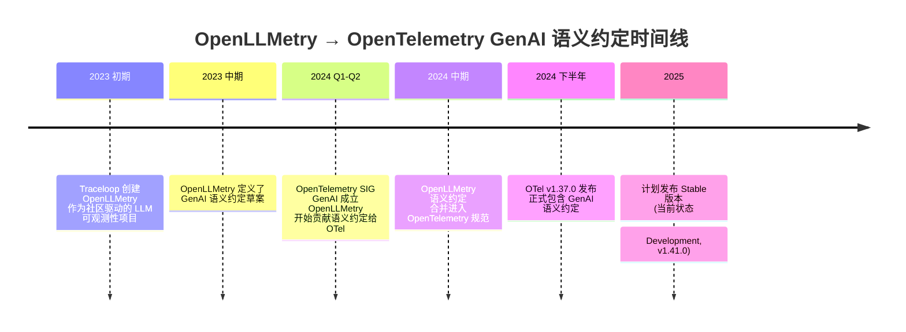
```mermaid
timeline
   title OpenLLMetry → OpenTelemetry GenAI 语义约定时间线
   2023 初期 : Traceloop 创建 OpenLLMetry<br>作为社区驱动的 LLM 可观测性项目
   2023 中期 : OpenLLMetry 定义了<br>GenAI 语义约定草案
   2024 Q1-Q2 : OpenTelemetry SIG GenAI 成立<br>OpenLLMetry 开始贡献语义约定给 OTel
   2024 中期 : OpenLLMetry 语义约定<br>合并进入 OpenTelemetry 规范
   2024 下半年 : OTel v1.37.0 发布<br>正式包含 GenAI 语义约定
   2025 : 计划发布 Stable 版本<br>(当前状态: Development, v1.41.0)
```

> 生态系统全景图

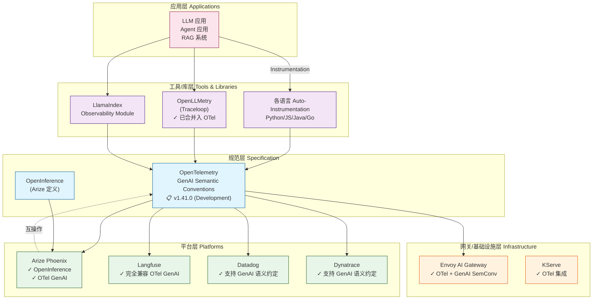
```mermaid
graph TB
   subgraph "规范层 Specification"
       OTel["OpenTelemetry<br/>GenAI Semantic Conventions<br/>📋 v1.41.0 (Development)"]
       OpenInference["OpenInference<br/>(Arize 定义)"]
   end

   subgraph "工具/库层 Tools & Libraries"
       OpenLLMetry["OpenLLMetry<br/>(Traceloop)<br/>✓ 已合并入 OTel"]
       LlamaIndex["LlamaIndex<br/>Observability Module"]
       AutoInstrument["各语言 Auto-Instrumentation<br/>Python/JS/Java/Go"]
   end

   subgraph "平台层 Platforms"
       Phoenix["Arize Phoenix<br/>✓ OpenInference<br/>✓ OTel GenAI"]
       Langfuse["Langfuse<br/>✓ 完全兼容 OTel GenAI"]
       Datadog["Datadog<br/>✓ 支持 GenAI 语义约定"]
       Dynatrace["Dynatrace<br/>✓ 支持 GenAI 语义约定"]
   end

   subgraph "网关/基础设施层 Infrastructure"
       EnvoyAI["Envoy AI Gateway<br/>✓ OTel + GenAI SemConv"]
       KServe["KServe<br/>✓ OTel 集成"]
   end

   subgraph "应用层 Applications"
       Apps["LLM 应用<br/>Agent 应用<br/>RAG 系统"]
   end

   Apps -->|Instrumentation| AutoInstrument
   Apps --> OpenLLMetry
   Apps --> LlamaIndex

   AutoInstrument --> OTel
   OpenLLMetry --> OTel
   LlamaIndex --> OTel

   OTel --> Phoenix
   OTel --> Langfuse
   OTel --> Datadog
   OTel --> Dynatrace
   OTel --> EnvoyAI

   OpenInference --> Phoenix

   Phoenix -.->|互操作| OTel

   classDef spec fill:#e1f5fe,stroke:#01579b
   classDef tool fill:#f3e5f5,stroke:#4a148c
   classDef platform fill:#e8f5e9,stroke:#1b5e20
   classDef infra fill:#fff3e0,stroke:#e65100
   classDef app fill:#fce4ec,stroke:#880e4f

   class OTel,OpenInference spec
   class OpenLLMetry,LlamaIndex,AutoInstrument tool
   class Phoenix,Langfuse,Datadog,Dynatrace platform
   class EnvoyAI,KServe infra
   class Apps app
```

> 两者的对比与定位

| 维度     | OTel + GenAI SemConv    | OpenLLMetry                  |
| -------- | ----------------------- | ---------------------------- |
| 性质     | 官方标准规范            | 社区项目（已贡献给 OTel）    |
| 状态     | Development (v1.41.0)   | 作为规范已合并，代码库仍维护 |
| 维护者   | OpenTelemetry SIG GenAI | Traceloop                    |
| 覆盖范围 | 全行业通用              | **LLM/Agent** 专用工具和库   |
| 使用方式 | 所有 OTel 兼容工具      | 应用层 Instrumentation 库    |

> 核心理解

1. **OpenLLMetry 不是竞争者，而是贡献者**
   - 它定义的 **GenAI 语义约定**已经成为 **OpenTelemetry 官方规范**的一部分
2. **应用开发者**可以选择直接用 **OpenLLMetry SDK**，或用**原生 OTel SDK + GenAI 语义约定**
3. 最终数据都流向**支持 OTel GenAI** 的**后端平台**

> 平台支持状态

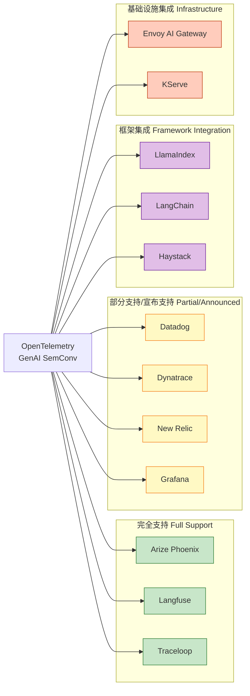
```mermaid
graph LR
   subgraph "完全支持 Full Support"
       Phoenix["Arize Phoenix"]
       Langfuse["Langfuse"]
       TraceLoop["Traceloop"]
   end

   subgraph "部分支持/宣布支持 Partial/Announced"
       Datadog["Datadog"]
       Dynatrace["Dynatrace"]
       NewRelic["New Relic"]
       Grafana["Grafana"]
   end

   subgraph "框架集成 Framework Integration"
       LlamaIndex["LlamaIndex"]
       LangChain["LangChain"]
       Haystack["Haystack"]
   end

   subgraph "基础设施集成 Infrastructure"
       EnvoyAI["Envoy AI Gateway"]
       KServe["KServe"]
   end

   GenAI["OpenTelemetry<br/>GenAI SemConv"]

   GenAI --> Phoenix
   GenAI --> Langfuse
   GenAI --> TraceLoop
   GenAI --> Datadog
   GenAI --> Dynatrace
   GenAI --> NewRelic
   GenAI --> Grafana
   GenAI --> LlamaIndex
   GenAI --> LangChain
   GenAI --> Haystack
   GenAI --> EnvoyAI
   GenAI --> KServe

   classDef full fill:#c8e6c9,stroke:#2e7d32
   classDef partial fill:#fff9c4,stroke:#f57f17
   classDef framework fill:#e1bee7,stroke:#6a1b9a
   classDef infra fill:#ffccbc,stroke:#bf360c

   class Phoenix,Langfuse,TraceLoop full
   class Datadog,Dynatrace,NewRelic,Grafana partial
   class LlamaIndex,LangChain,Haystack framework
   class EnvoyAI,KServe infra
```

> **OpenInference**（更侧重 LLM **评估**场景） vs OpenTelemetry GenAI

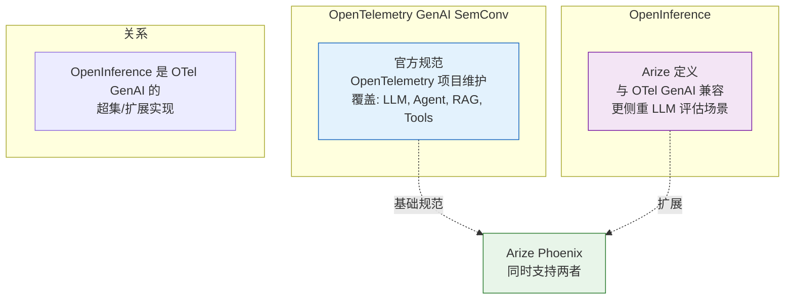
```mermaid
graph TB
   subgraph "OpenTelemetry GenAI SemConv"
       OTelGenAI["官方规范<br/>OpenTelemetry 项目维护<br/>覆盖: LLM, Agent, RAG, Tools"]
   end

   subgraph "OpenInference"
       OI["Arize 定义<br/>与 OTel GenAI 兼容<br/>更侧重 LLM 评估场景"]
   end

   subgraph "关系"
       Rel["OpenInference 是 OTel GenAI 的<br/>超集/扩展实现"]
   end

   OTelGenAI -.->|基础规范| Phoenix["Arize Phoenix<br/>同时支持两者"]
   OI -.->|扩展| Phoenix

   classDef otel fill:#e3f2fd,stroke:#1565c0
   classDef oi fill:#f3e5f5,stroke:#7b1fa2
   classDef phoenix fill:#e8f5e9,stroke:#2e7d32

   class OTelGenAI otel
   class OI oi
   class Phoenix phoenix
```

1. **Arize Phoenix** 同时支持 **OpenInference** 和 **OpenTelemetry GenAI** 语义约定
2. **OpenInference** 设计上与 **OTel GenAI** 兼容，可以无缝互操作
3. 选择哪个取决于你是否需要 Arize 特有的**评估**功能

> 给开发者的建议 - **Arize** → OpenInference，**Langfuse** → OTel GenAI

```
你的应用
   │
   ├─ 需要快速集成？
   │   └─▶ 用 OpenLLMetry SDK（已经基于 OTel GenAI）
   │
   ├─ 需要最大兼容性？
   │   └─▶ 用原生 OTel SDK + GenAI 语义约定
   │
   └─ 需要特定平台功能？
       └─▶ 看平台推荐（Arize → OpenInference，Langfuse → OTel GenAI）
```

> 无论选哪个，最终都能导入到任何支持 **OTel GenAI** 的后端

#### OpenInference Tracing (v0.3 新增)

> 与 OTel GenAI SemConv 的关系

1. OpenInference 侧重 **LLM 评估**场景
2. 与 OTel GenAI **兼容**
3. **Arize Phoenix 原生支持**

> 评估系统集成

1. **捕获完整请求/响应**
2. 支持**自动化评估**
3. **模型质量**分析

### Control（控制）

> 在 Gateway 层**集中执行策略**，而不是散落在每个应用里 - 策略分散在应用（**反模式**） - **策略不一致**、**维护成本高**、**容易遗漏**

```
┌─────────┐  ┌─────────┐  ┌─────────┐
│ 应用 A  │  │ 应用 B  │  │ 应用 C  │
│         │  │         │  │         │
│ • Token │  │ • Token │  │ • Token │
│   限流  │  │   限流  │  │   限流  │
│ • 成本  │  │ • 成本  │  │ • 成本  │
│   控制  │  │   控制  │  │   控制  │
│ • 安全  │  │ • 安全  │  │ • 安全  │
│   检查  │  │   检查  │  │   检查  │
└─────────┘  └─────────┘  └─────────┘
```

> 策略集中在 Gateway（推荐） - 只需要做业务逻辑，策略由 Gateway 保证

```
┌─────────────────────────────────────────┐
│        Envoy AI Gateway                 │
│                                         │
│  • Token 限流（统一策略）                │
│  • 成本控制（统一预算）                  │
│  • 安全检查（内容过滤、输出验证）         │
│  • 合规执行（数据脱敏、审计）            │
└────────────┬────────────────────────────┘
            │
   ┌────────┼────────┐
   ▼        ▼        ▼
┌──────┐ ┌──────┐ ┌──────┐
│应用 A │ │应用 B │ │应用 C │
└──────┘ └──────┘ └──────┘
```

> Prompt Misuse（**提示词滥用**）

1. 用户试图通过**越狱**绕过**安全限制**
2. 恶意用户**注入有害内容**
3. 解法：**Gateway** 层可以做**输入过滤**

> Model Hallucination（**模型幻觉**）

1. 模型输出**虚假**或**错误**信息
2. 解法：**Gateway** 层可以做**输出验证**（如事实核查）

> Control **quality** and **compliance** centrally

1. **安全策略变更**只需要改 **Gateway**，不需要改所有应用
2. **合规审计**只看 **Gateway 日志**，不需要扫所有应用
3. 新应用**默认继承所有策略**，不需要重复实现

### Optimization（优化）

> 降低**成本**和**延迟**

#### Caching Strategies（缓存策略）

> Model Cache（**模型权重缓存**）

```
┌─────────────────────────────────────┐
│  GPU 内存                            │
│  ┌─────────────────────────────┐    │
│  │  Llama-3-70B 权重（约 140GB）│    │
│  │  加载时间：约 30 秒          │    │
│  └─────────────────────────────┘    │
│                                     │
│  如果每个请求都重新加载 → 无法接受   │
│  如果缓存在 GPU → 所有请求共享       │
└─────────────────────────────────────┘
```

> Prompt Cache（**提示词缓存**）

```
┌─────────────────────────────────────┐
│  System Prompt（如 2000 tokens）    │
│  • 每个请求都包含相同的系统提示      │
│  • KV cache 可以复用                │
│  • 节省重复计算，降低 50-80% 延迟    │
└─────────────────────────────────────┘
```

#### Disaggregated Serving（解耦服务）

> 传统**耦合式推理**

```
┌─────────────────────────────────────┐
│  单个 GPU 实例                       │
│  ┌────────┐  ┌────────┐  ┌────────┐│
│  │ Prefill│  │Decode │  │Post-   ││  全在同一个 GPU
│  │  阶段  │  │ 阶段   │  │process ││
│  └────────┘  └────────┘  └────────┘│
│                                     │
│  问题：                              │
│  • Prefill 需要大量内存（存 KV）    │
│  • Decode 需要大量计算              │
│  • 混在一起效率不高                  │
└─────────────────────────────────────┘
```

> **解耦式推理** - 内存密集型（Prefill、CPU+大内存） + 计算密集型（Decode、GPU）

```
┌─────────────┐      ┌─────────────┐
│ CPU + 大内存│      │  GPU 高算力  │
│             │      │             │
│  • Prefill  │  ───▶│   • Decode  │
│  • KV Cache │      │   • 生成     │
│             │      │             │
│ 内存密集型   │      │ 计算密集型   │
└─────────────┘      └─────────────┘
```

1. 用**最合适的硬件**做最合适的事
2. **成本更低**（内存比 GPU 便宜）
3. 扩展更灵活

### 总结：三大支柱的关系

```
       生产就绪
            │
   ┌────────┼────────┐
   ▼        ▼        ▼
可观测性   控制     优化
(看见问题) (治理风险) (提升效率)
   │        │        │
   └────────┼────────┘
            │
       Envoy AI Gateway
            │
            ▼
       KServe (自托管时)
```

> 核心思想：从"**能用**"到"**生产就绪**"，需要：

1. **可观测性** → 知道哪里有问题
2. **控制** → 确保不出大问题（成本、安全、合规）
3. **优化** → 让系统运行得更高效

## Pluggable and Flexible

> 架构的核心设计哲学 - 不是**僵化平台**，而是**可组合**的**基础组件**

### Not a rigid, all-or-nothing platform

#### 反模式 1：全有或全无的平台

```
┌─────────────────────────────────────────┐
│         想用这个平台？                   │
│                                         │
│  ☐ 必须全部迁移到 K8s                   │
│  ☐ 必须用指定的云厂商                   │
│  ☐ 必须重写所有应用代码                 │
│  ☐ 必须放弃现有的基础设施               │
│                                         │
│  太麻烦了，还是不用吧...                │
└─────────────────────────────────────────┘
```

#### 反模式 2：单一厂商锁定

```
┌─────────────────────────────────────────┐
│       某大厂的 AI Platform               │
│                                         │
│  • 只能用自己的 LLM                    │
│  • 只能用自己的云服务                   │
│  • 数据必须进自己的生态                 │
│  • 想迁移成本巨大                       │
└─────────────────────────────────────────┘
```

#### Envoy AI Gateway 的设计哲学

```
渐进式采用 + 多云兼容
       │
   ┌───┴───┬─────────┬─────────┐
   ▼       ▼         ▼         ▼
起点     起点       起点       起点
外部 LLM  自托管     混合云     单云
   │       │         │         │
   └───┬───┴─────────┴─────────┘
       │
   Envoy AI Gateway
       │
       └──▶ 可以随时扩展方向
```

### 四个灵活性的体现

#### Start with externally hosted LLMs or self-hosted inference

> 起点 A：**只用外部 LLM** - 好处：零运维，快速上线

```
┌─────────────────┐
│ Envoy AI Gateway│ ──▶ OpenAI / Anthropic / Bedrock
└─────────────────┘
```

> 起点 B：**只用自托管** - 好处：数据不出域，成本可控

```
┌─────────────────┐
│ Envoy AI Gateway│ ──▶ KServe + vLLM
└─────────────────┘
```

> 起点 C：**混合模式** - 按场景选择最优方案

```
┌─────────────────┐
│ Envoy AI Gateway│ ├──▶ OpenAI（通用查询）
│                 │ ├──▶ Bedrock（特定模型）
│                 │ └──▶ KServe（敏感数据）
└─────────────────┘
```

#### Use Envoy AI Gateway with any compatible provider via a unified API

> 关键洞察：应用代码与 Provider **解耦**

```
# 应用代码（不需要改动）
client = OpenAI(
   api_key="internal-token",
   base_url="https://gateway.company.com/v1"
)

# Gateway 层面切换 Provider
┌─────────────────────────────────────────┐
│         Envoy AI Gateway                │
│                                         │
│  配置：gpt-4 ──▶ OpenAI                │
│  配置：claude-3 ──▶ Anthropic          │
│  配置：llama-3 ──▶ 自托管 KServe        │
│                                         │
│  切换 Provider 只需要改 Gateway 配置    │
│  应用代码完全无感知                     │
└─────────────────────────────────────────┘
```

#### Add your own authorization logic via Envoy's extension filters

> 这是 **Envoy 生态**的超能力 - **WebAssembly** (Wasm) 和 **Lua 过滤器**

```
┌─────────────────────────────────────────────────────┐
│              Envoy AI Gateway                       │
│                                                     │
│  内置功能：                                          │
│  • Token 限流                                       │
│  • 凭证注入                                         │
│  • Provider 路由                                    │
│                                                     │
│  ┌─────────────────────────────────────────────┐   │
│  │  自定义扩展（Wasm/Lua 过滤器）               │   │
│  │                                             │   │
│  │  • 企业 SSO 集成                             │   │
│  │  • 自定义速率限制（按用户/部门/成本中心）     │   │
│  │  • 请求/响应转换（Legacy API → OpenAI 兼容）  │   │
│  │  • 合规审计日志（特定字段记录）              │   │
│  │  • PII 数据脱敏                             │   │
│  └─────────────────────────────────────────────┘   │
│                                                     │
└─────────────────────────────────────────────────────┘
```

> 实际场景示例

```yaml
# 自定义鉴权逻辑示例（Wasm Filter）
filters:
 - name: custom-auth
   typed_config:
     "@type": type.googleapis.com/envoy.extensions.filters.http.wasm.v3.Wasm
     config:
       vm_config:
         runtime: "envoy.wasm.runtime.v8"
         code:
           local:
             filename: "/etc/envoy/custom_auth.wasm"
       # 实现：验证 JWT token，提取用户部门，
       #       根据部门动态设置 Token 配额
```

#### Deploy your Gateways in different clusters and cloud providers

> 多云/多集群部署模式

##### 模式 A：集中式 Gateway

```
┌─────────────────────────────────────────┐
│         集中管理集群                     │
│  ┌─────────────────────────────────┐   │
│  │  Envoy AI Gateway (Global)      │   │
│  └─────────────────────────────────┘   │
└───────────┬─────────────────────────────┘
           │
   ┌───────┼───────┬─────────┐
   ▼       ▼       ▼         ▼
 AWS    Azure    GCP      自建机房
   │       │       │         │
   └───────┴───────┴─────────┘
         统一访问入口
```

##### 模式 B：分布式 Gateway

```
┌─────────────┐  ┌─────────────┐  ┌─────────────┐
│  AWS 集群    │  │ Azure 集群   │  │  GCP 集群    │
│             │  │             │  │             │
│  Gateway ───┼──▶ Gateway ───┼──▶ Gateway    │
│  (区域)     │  │  (区域)     │  │  (区域)     │
└─────────────┘  └─────────────┘  └─────────────┘
     │                │                │
     └────────────────┴────────────────┘
                     │
             全局控制面（可选）
```

> 灵活性的价值

1. **合规要求**：数据必须留在特定区域
2. **延迟优化**：Gateway 部署在靠近用户的地方
3. **灾备设计**：多集群互备
4. **成本优化**：根据各云价格动态路由

## Summary：四大价值主张

```
┌─────────────────────────────────────────────────────────────┐
│                    平台团队的能力矩阵                         │
├─────────────────────────────────────────────────────────────┤
│                                                             │
│  1. 统一访问入口                              │
│     └─ 客户端不需要知道模型在哪里                             │
│                                                             │
│  2. 一致的策略            │
│     └─ 安全、限流、合规在 Gateway 层统一执行                  │
│                                                             │
│  3. 内外统一支持                              │
│     └─ 外部 Provider 和自托管模型用同一套 API                 │
│                                                             │
│  4. 安全可扩展                                     │
│     └─ 不需要重新造轮子，基于 Envoy 生态扩展                  │
│                                                             │
└─────────────────────────────────────────────────────────────┘
```

> 架构定位 - **Foundational component** you can build on and extend

1. 不是 ──▶ 完整产品（开箱即用，但也无法定制）
2. 而是 ──▶ **基础组件**（需要组装，但可以**无限扩展**）

> 类比：Envoy AI Gateway = 乐高积木，其他封闭平台 = 成品玩具

```
┌─────────────────┐         ┌─────────────────┐
│  乐高积木        │         │  成品玩具        │
│                 │         │                 │
│  • 可以自由组合  │         │  • 拿来就能玩    │
│  • 需要动手搭建  │         │  • 不能改动      │
│  • 可以无限扩展  │         │  • 玩腻了换新的  │
└─────────────────┘         └─────────────────┘
```

## Provider Ecosystem

### 支持的提供商

| 提供商               | 状态            | 特性                   |
| -------------------- | --------------- | ---------------------- |
| OpenAI               | ✅ 生产级        | 完整支持               |
| Anthropic            | ✅ 生产级        | Direct + **Vertex AI** |
| AWS Bedrock          | ✅ 生产级        | 多模型支持             |
| **Google Vertex AI** | ✅ 生产级 (v0.3) | Gemini 完整支持        |

# Endpoint Picker Support

## Introduction

> 让 Envoy AI Gateway 从单纯的 **Egress Gateway**（出站流量管理）演进为 **Egress + Ingress Gateway**


### 核心问题：**传统负载均衡**不适合 **AI 工作负载**

> 传统**负载均衡器**（如 Nginx、Envoy 默认的**轮询/最少连接**）对 **AI 推理**来说**不够智能**，因为 AI 工作负载有**独特特点**

| 特点                      | 传统负载均衡的问题         |
| ------------------------- | -------------------------- |
| **KV-Cache 命中率差异大** | 不管缓存状态，盲目分发请求 |
| **队列深度实时变化**      | 无法知道哪些节点更空闲     |
| **LoRA 适配器多样性**     | 无法根据模型/适配器路由    |
| **GPU 利用率不均**        | 可能造成热点和资源浪费     |

### EPP 的解决方案

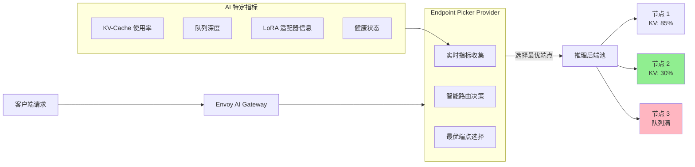
```mermaid
flowchart LR
   Client[客户端请求] --> AIGW[Envoy AI Gateway]

   subgraph EPP[Endpoint Picker Provider]
       EPP1[实时指标收集]
       EPP2[智能路由决策]
       EPP3[最优端点选择]
   end

   subgraph Metrics["AI 特定指标"]
       KV[KV-Cache 使用率]
       QD[队列深度]
       LoRA[LoRA 适配器信息]
       Health[健康状态]
   end

   Metrics --> EPP1
   AIGW --> EPP
   EPP --> |选择最优端点| Backends[推理后端池]

   Backends --> EP1[节点 1<br/>KV: 85%]
   Backends --> EP2[节点 2<br/>KV: 30%]
   Backends --> EP3[节点 3<br/>队列满]

   style EP2 fill:#90EE90
   style EP3 fill:#FFB6C1
```

### 两种集成方式

> 方式 1: **HTTPRoute** + **InferencePool**（简单场景）

```yaml
apiVersion: gateway.networking.k8s.io/v1
kind: HTTPRoute
metadata:
 name: simple-inference
spec:
 parentRefs:
   - name: inference-gateway
 rules:
   - backendRefs:
       - group: inference.networking.k8s.io
         kind: InferencePool
         name: vllm-llama3-pool
```

> 方式 2: **AIGatewayRoute** + **InferencePool**（高级场景）

```yaml
apiVersion: aigateway.envoyproxy.io/v1alpha1
kind: AIGatewayRoute
metadata:
 name: multi-model-inference
spec:
 rules:
   - matches:
       - headers:
           - name: x-ai-eg-model
             value: meta-llama/Llama-3.1-8B-Instruct
     backendRefs:
       - group: inference.networking.k8s.io
         kind: InferencePool
         name: vllm-llama3-pool
```

### 架构演进意义

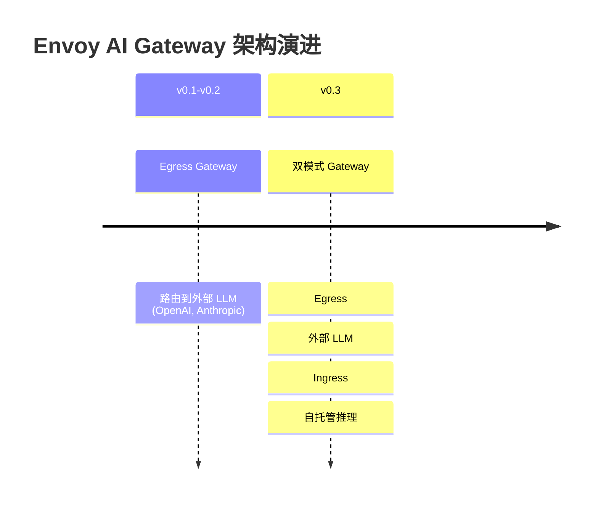
```mermaid
timeline
   title Envoy AI Gateway 架构演进
   section v0.1-v0.2
       Egress Gateway
       : 路由到外部 LLM (OpenAI, Anthropic)
   section v0.3
       双模式 Gateway
       : Egress: 外部 LLM
       : Ingress: 自托管推理
```

### 实际收益

| 角色         | 收益                                   |
| ------------ | -------------------------------------- |
| AI/ML 工程师 | 延迟降低、吞吐量提升、成本优化         |
| 平台团队     | 基于 Gateway API 标准、Kubernetes 原生 |
| DevOps       | 自动故障转移、减少手动运维             |

## Problem

> **传统负载均衡**为什么不适合 **AI 推理**

### 传统负载均衡的假设

> 传统负载均衡器（如 **Nginx**、**HAProxy**、**Envoy** 默认配置）是为 **Web/API** 服务器设计的，基于这些假设

| 假设                        | 传统场景               |
| --------------------------- | ---------------------- |
| <u>请求处理时间相对稳定</u> | 数据库查询 ~10-100ms   |
| <u>连接数 = 负载</u>        | 更多连接 = 更忙        |
| <u>资源消耗可预测</u>       | CPU/内存线性增长       |
| <u>无状态为主</u>           | 随便路由到哪个节点都行 |

### AI 推理的独特挑战

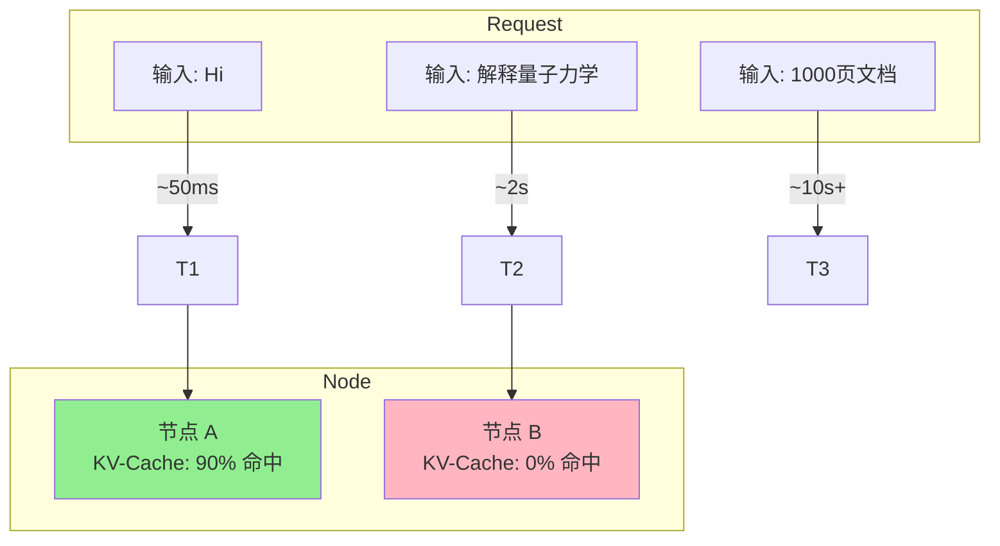
```mermaid
graph TB
   subgraph Request
       R1[输入: Hi]
       R2[输入: 解释量子力学]
       R3[输入: 1000页文档]
   end

   R1 -->|~50ms| T1
   R2 -->|~2s| T2
   R3 -->|~10s+| T3

   subgraph Node
       N1[节点 A<br/>KV-Cache: 90% 命中]
       N2[节点 B<br/>KV-Cache: 0% 命中]
   end

   T1 --> N1
   T2 --> N2

   style N1 fill:#90EE90
   style N2 fill:#FFB6C1
```

### 具体问题拆解

#### KV-Cache 的影响

1. 相同请求 "继续刚才的话题"
   - 节点 A（有 KV-Cache）: 100ms
   - 节点 B（无 Cache）: 2000ms
2. 传统 LB: 看不出区别，可能路由到节点 B
3. EPP: 知道节点 A 更快，自动路由到 A

#### 队列深度 (Queue Depth)

1. 区别
   - 节点 A: 1 个请求在处理，但 **GPU 空闲**（等待 I/O）
   - 节点 B: 1 个请求在处理，**GPU 满载**
2. 传统 LB: 看队列长度都是 1，随机选
3. EPP: 知道节点 A 实际更空闲

#### LoRA 适配器

1. 请求需要 LoRA-X 模型
   - 节点 A: 已加载 LoRA-X → 直接用
   - 节点 B: 需要重新加载 LoRA-X → 等待 5 秒
2. 传统 LB: 不知道模型状态，可能路由到 B
3. EPP: 知道节点 A 有适配器，优先路由

### 现实后果对比

| 场景            | 传统负载均衡             | EPP 智能路由     |
| --------------- | ------------------------ | ---------------- |
| <u>负载不均</u> | 热点过载 + 其他节点空闲  | **均衡利用 GPU** |
| <u>延迟</u>     | P99 延迟高（命中差节点） | **P99 延迟优化** |
| <u>成本</u>     | 需要过度配置             | **资源利用率高** |
| <u>运维</u>     | 手动调整权重/下线节点    | 自动适应         |

### 结论

1. **AI 推理**的**状态性**（<u>KV-Cache</u>、<u>模型加载</u>、<u>队列状态</u>）使得**传统无状态**负载均衡失效
1. 需要像 EPP 这样理解 **AI 特定语义** 的**路由**机制

## Solution

> Endpoint Picker Provider Integration


### 架构概览

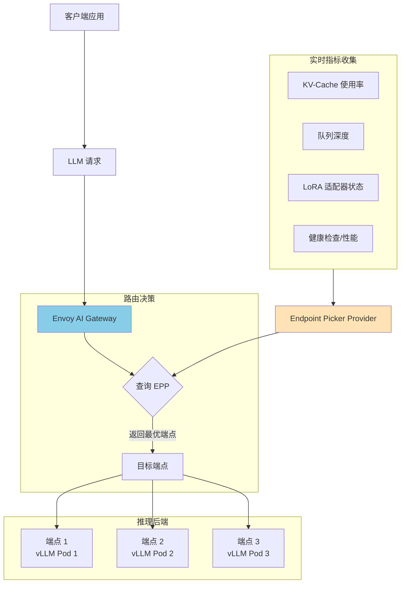
```mermaid
flowchart TB
   Client[客户端应用] --> Request[LLM 请求]

   Request --> AIGW[Envoy AI Gateway]

   subgraph EPPDec["路由决策"]
       AIGW --> Query{查询 EPP}
       Query -->|返回最优端点| Target[目标端点]
   end

   subgraph Metrics["实时指标收集"]
       M1[KV-Cache 使用率]
       M2[队列深度]
       M3[LoRA 适配器状态]
       M4[健康检查/性能]
   end

   Metrics --> EPP[Endpoint Picker Provider]
   EPP --> Query

   subgraph Backends["推理后端"]
       EP1[端点 1<br/>vLLM Pod 1]
       EP2[端点 2<br/>vLLM Pod 2]
       EP3[端点 3<br/>vLLM Pod 3]
   end

   Target --> EP1
   Target --> EP2
   Target --> EP3

   style EPP fill:#FFE4B5
   style AIGW fill:#87CEEB
```

### 四大核心能力

#### 智能端点选择

| 指标               | 传统 LB       | EPP                            |
| ------------------ | ------------- | ------------------------------ |
| <u>KV-Cache</u>    | 不可见        | 优先路由到**高缓存命中率**节点 |
| <u>队列深度</u>    | 只看连接数    | 看实际等待请求数               |
| <u>LoRA 适配器</u> | 不知道        | 路由到**已加载**适配器的节点   |
| <u>健康状态</u>    | TCP/HTTP 检查 | AI 特定健康指标                |

> 实际场景 - 请求: 使用 LoRA-A 生成代码 - EPP 决策: 节点 2 > 节点 3 > 节点 1

1. 节点 1: LoRA-B 已加载，需切换
2. 节点 2: LoRA-A 已加载，可用
3. 节点 3: 空闲，需加载 LoRA-A

#### 动态负载均衡

> 关键：**每次请求**都**重新评估**，不是静态配置

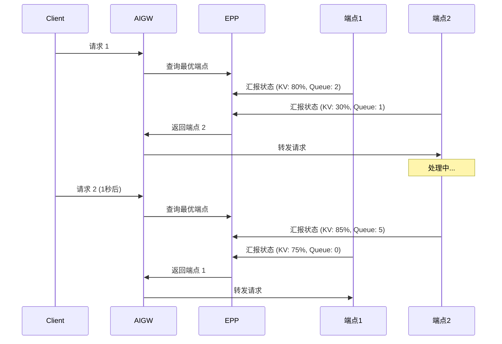
```mermaid
sequenceDiagram
   participant Client
   participant AIGW
   participant EPP
   participant EP1 as 端点1
   participant EP2 as 端点2

   Client->>AIGW: 请求 1
   AIGW->>EPP: 查询最优端点
   EP1->>EPP: 汇报状态 (KV: 80%, Queue: 2)
   EP2->>EPP: 汇报状态 (KV: 30%, Queue: 1)
   EPP->>AIGW: 返回端点 2
   AIGW->>EP2: 转发请求

   Note over EP2: 处理中...

   Client->>AIGW: 请求 2 (1秒后)
   AIGW->>EPP: 查询最优端点
   EP2->>EPP: 汇报状态 (KV: 85%, Queue: 5)
   EP1->>EPP: 汇报状态 (KV: 75%, Queue: 0)
   EPP->>AIGW: 返回端点 1
   AIGW->>EP1: 转发请求
```

#### 自动故障转移

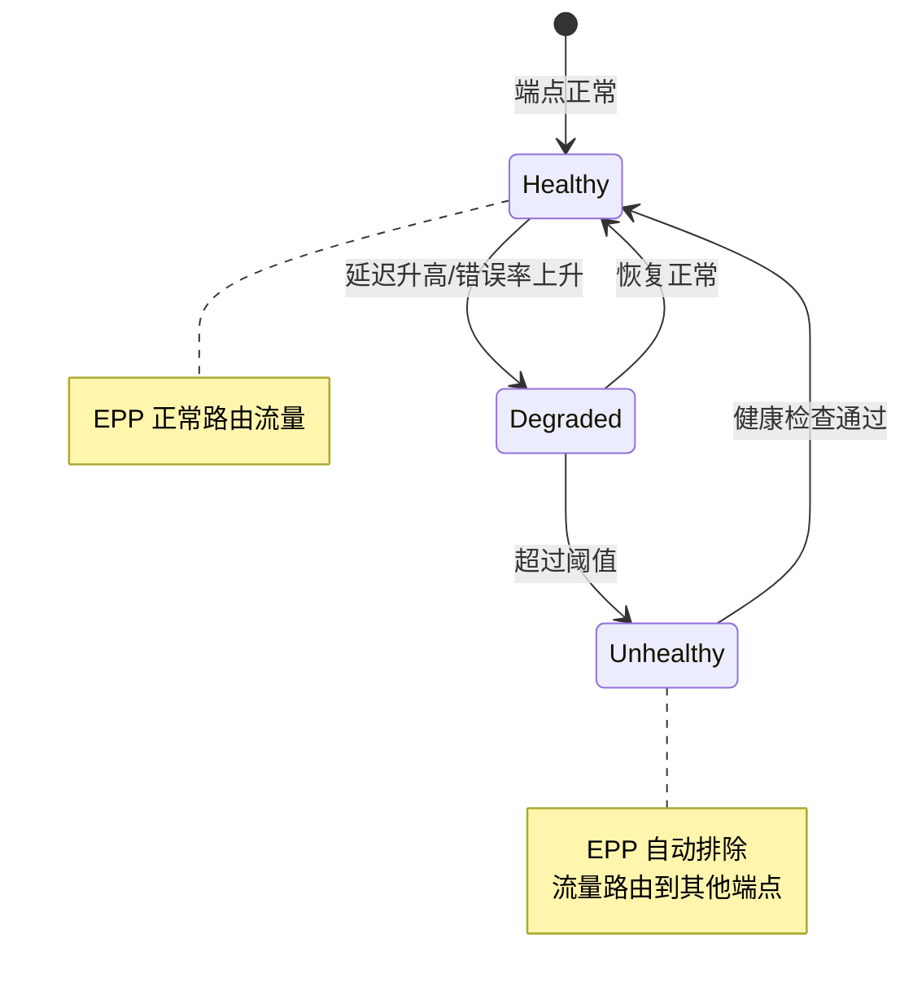
```mermaid
stateDiagram-v2
   [*] --> Healthy: 端点正常

   Healthy --> Degraded: 延迟升高/错误率上升
   Degraded --> Healthy: 恢复正常
   Degraded --> Unhealthy: 超过阈值

   Unhealthy --> Healthy: 健康检查通过

   note right of Healthy
       EPP 正常路由流量
   end note

   note right of Unhealthy
       EPP 自动排除
       流量路由到其他端点
   end note
```

#### 可扩展架构

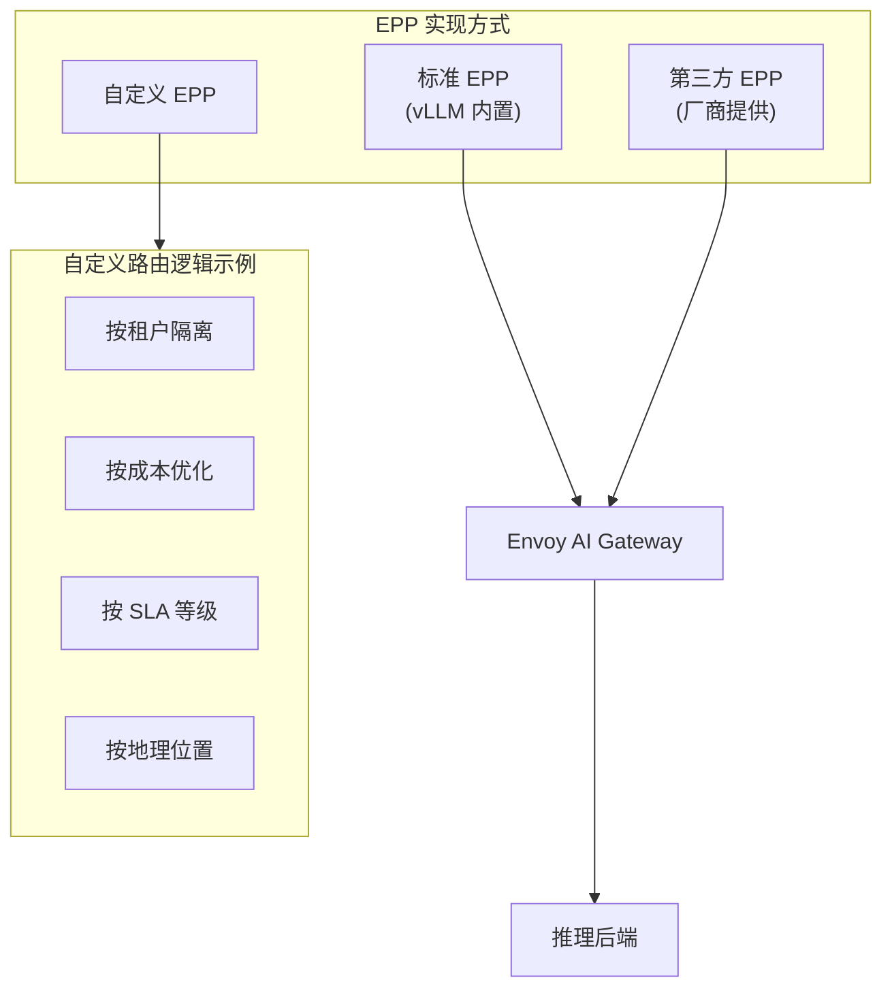
```mermaid
graph TB
   subgraph EPPImpl["EPP 实现方式"]
       Custom[自定义 EPP]
       Standard["标准 EPP<br/>(vLLM 内置)"]
       ThirdParty["第三方 EPP<br/>(厂商提供)"]
   end

   subgraph CustomLogic["自定义路由逻辑示例"]
       L1[按租户隔离]
       L2[按成本优化]
       L3[按 SLA 等级]
       L4[按地理位置]
   end

   Custom --> CustomLogic
   Standard --> AIGW[Envoy AI Gateway]
   ThirdParty --> AIGW

   AIGW --> Backends[推理后端]
```


### EPP 集成示例

```yaml
# InferencePool 配置
apiVersion: inference.networking.k8s.io/v1
kind: InferencePool
metadata:
 name: vllm-llama3-pool
spec:
 targetPortNumber: 8000
 selector:
   app: vllm
 # 关键：指定 EPP 扩展
 extensionRef:
   name: vllm-epp-provider
```

### 收益对比

| 维度       | 无 EPP   | 有 EPP       |
| ---------- | -------- | ------------ |
| P50 延迟   | 500ms    | 300ms        |
| P99 延迟   | 5000ms   | 800ms        |
| GPU 利用率 | 60-70%   | 85-95%       |
| 运维介入   | 频繁调优 | **自动优化** |

### 总结

1. EPP 不是替换传统负载均衡，而是在其之上增加 **AI 语义感知层**
   - 传统 LB: "哪个节点连接数少？"
   - EPP: "哪个**节点**处理这个**特定请求**最快？"
2. 这就是 **Gateway API Inference Extension** 标准的核心价值

## How It Works

### 方式对比概览

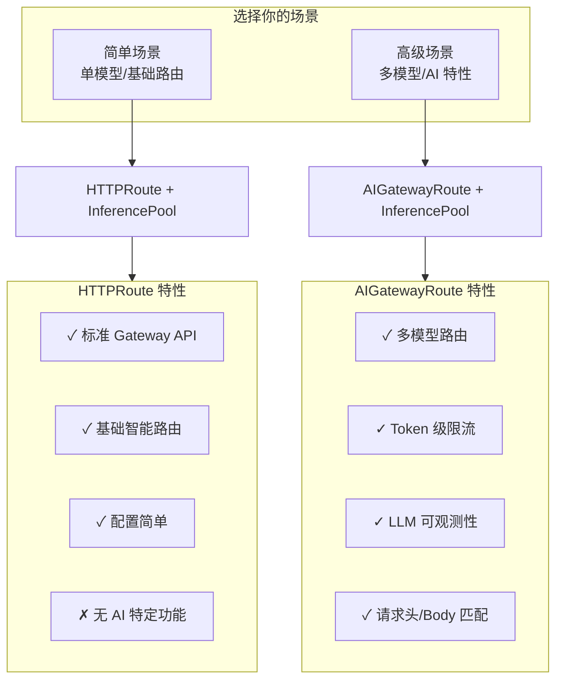
```mermaid
graph TB
   subgraph Choice["选择你的场景"]
       Simple["简单场景<br/>单模型/基础路由"]
       Advanced["高级场景<br/>多模型/AI 特性"]
   end

   Simple --> HTTPR["HTTPRoute + InferencePool"]
   Advanced --> AIGWRoute["AIGatewayRoute + InferencePool"]

   subgraph HTTPFeatures["HTTPRoute 特性"]
       H1[✓ 标准 Gateway API]
       H2[✓ 基础智能路由]
       H3[✓ 配置简单]
       H4[✗ 无 AI 特定功能]
   end

   subgraph AIGWFeatures["AIGatewayRoute 特性"]
       A1[✓ 多模型路由]
       A2[✓ Token 级限流]
       A3[✓ LLM 可观测性]
       A4[✓ 请求头/Body 匹配]
   end

   HTTPR --> HTTPFeatures
   AIGWRoute --> AIGWFeatures
```

### 方式 1: HTTPRoute + InferencePool

> 适用场景：简单、标准的 **Kubernetes Gateway API** 集成


```yaml
apiVersion: gateway.networking.k8s.io/v1
kind: HTTPRoute
metadata:
 name: inference-pool-with-httproute
spec:
 parentRefs:
   - name: inference-gateway          # 关联的 Gateway
 rules:
   - backendRefs:
       - group: inference.networking.k8s.io
         kind: InferencePool           # 关键：指向 InferencePool
         name: vllm-llama3-8b-instruct
     matches:
       - path:
           type: PathPrefix
           value: /
```

> 工作流程

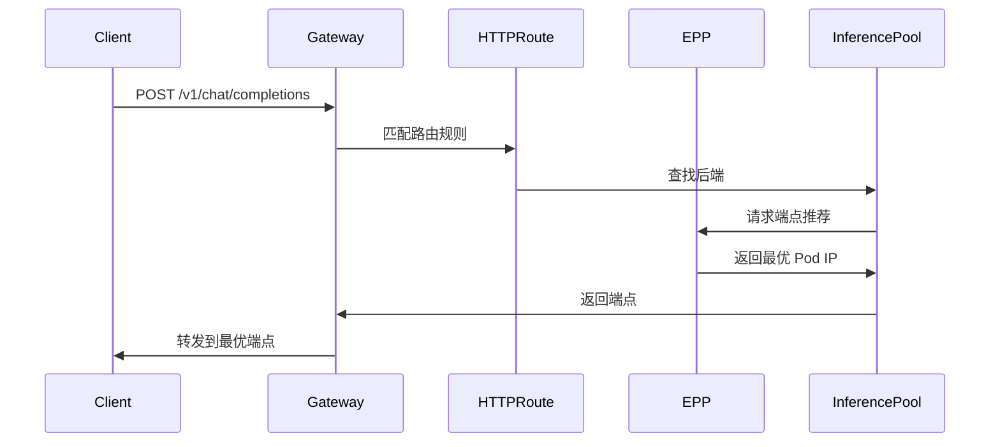
```mermaid
sequenceDiagram
   participant Client
   participant Gateway
   participant HTTPRoute
   participant EPP
   participant InferencePool

   Client->>Gateway: POST /v1/chat/completions
   Gateway->>HTTPRoute: 匹配路由规则
   HTTPRoute->>InferencePool: 查找后端
   InferencePool->>EPP: 请求端点推荐
   EPP->>InferencePool: 返回最优 Pod IP
   InferencePool->>Gateway: 返回端点
   Gateway->>Client: 转发到最优端点
```

### 方式 2: AIGatewayRoute + InferencePool

> 适用场景：需要 AI 特定功能的复杂场景

```yaml
apiVersion: aigateway.envoyproxy.io/v1alpha1
kind: AIGatewayRoute
spec:
 rules:
   # 模型 A 路由规则
   - matches:
       - headers:
           - name: x-ai-eg-model
             value: meta-llama/Llama-3.1-8B-Instruct
     backendRefs:
       - group: inference.networking.k8s.io
         kind: InferencePool
         name: vllm-llama3-8b-instruct

   # 模型 B 路由规则
   - matches:
       - headers:
           - name: x-ai-eg-model
             value: mistral:latest
     backendRefs:
       - group: inference.networking.k8s.io
         kind: InferencePool
         name: mistral

   # 混合：普通后端 + InferencePool
   - matches:
       - headers:
           - name: x-ai-eg-model
             value: custom-model
     backendRefs:
       - name: regular-backend  # 普通 Service
```

> 多模型路由示例

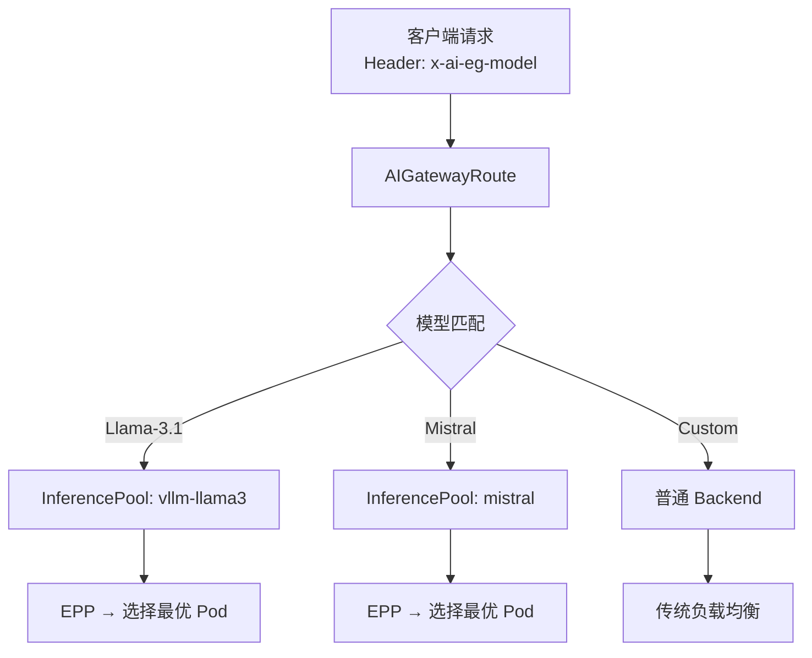
```mermaid
flowchart TB
   Request[客户端请求<br/>Header: x-ai-eg-model] --> AIGW[AIGatewayRoute]

   AIGW --> Match{模型匹配}

   Match -->|"Llama-3.1"| Pool1[InferencePool: vllm-llama3]
   Match -->|"Mistral"| Pool2[InferencePool: mistral]
   Match -->|"Custom"| Backend[普通 Backend]

   Pool1 --> EPP1[EPP → 选择最优 Pod]
   Pool2 --> EPP2[EPP → 选择最优 Pod]
   Backend --> LB[传统负载均衡]
```

### 功能对比表

| 功能                    | HTTPRoute | AIGatewayRoute |
| ----------------------- | --------- | -------------- |
| <u>标准 Gateway API</u> | ✅         | ❌（CRD 扩展）  |
| <u>EPP 集成</u>         | ✅         | ✅              |
| <u>多模型路由</u>       | ❌         | ✅              |
| <u>Token 限流</u>       | ❌         | ✅              |
| <u>LLM 可观测性</u>     | ❌         | ✅              |
| <u>模型名重写</u>       | ❌         | ✅              |
| <u>Header 匹配</u>      | ✅         | ✅              |
| <u>Body 解析匹配</u>    | ❌         | ✅              |

### 实际选择建议

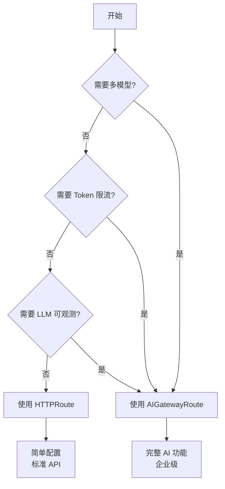
```mermaid
graph TD
   Start[开始] --> NeedModel{需要多模型?}

   NeedModel -->|否| NeedRateLimit{需要 Token 限流?}
   NeedModel -->|是| AIGW[使用 AIGatewayRoute]

   NeedRateLimit -->|否| NeedObs{需要 LLM 可观测?}
   NeedRateLimit -->|是| AIGW

   NeedObs -->|否| HTTP[使用 HTTPRoute]
   NeedObs -->|是| AIGW

   HTTP --> Simple[简单配置<br/>标准 API]
   AIGW --> Advanced[完整 AI 功能<br/>企业级]
```

### 配置复杂度对比

> HTTPRoute（5 行核心配置）

```yaml
backendRefs:
 - group: inference.networking.k8s.io
   kind: InferencePool
   name: vllm-pool
```

> AIGatewayRoute（更多控制）

```yaml
# 按模型路由
matches:
 - headers:
     - name: x-ai-eg-model
       value: llama-3
backendRefs:
 - kind: InferencePool
   name: vllm-pool
   # + Token 限流配置
   # + 可观测性标签
```

### 总结

| 场景             | 推荐方式       | 理由                   |
| ---------------- | -------------- | ---------------------- |
| 单模型、简单路由 | HTTPRoute      | 标准、简单             |
| 多模型管理       | AIGatewayRoute | 按模型路由             |
| 成本控制         | AIGatewayRoute | Token 限流             |
| 生产监控         | AIGatewayRoute | LLM 可观测性           |
| 渐进式迁移       | 两者共存       | HTTPRoute 先上，后升级 |

1. HTTPRoute 是 **Gateway API 标准**，AIGatewayRoute 是 **Envoy AI Gateway 扩展**
2. 两者都支持 **EPP**，区别在于 **AI 特定功能**的深度

## Real-World Benefits

> 按角色划分的收益

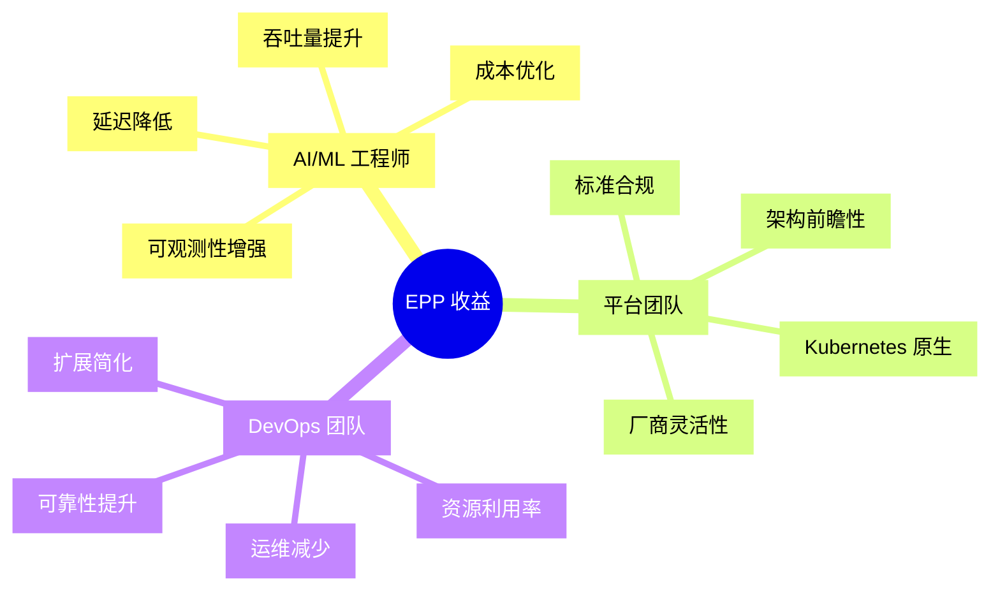
```mermaid
mindmap
 root((EPP 收益))
   AI_ML_Engineers[AI/ML 工程师]
     Latency[延迟降低]
     Throughput[吞吐量提升]
     Cost[成本优化]
     Observability[可观测性增强]
   Platform_Teams[平台团队]
     Standards[标准合规]
     Flexibility[厂商灵活性]
     Future[架构前瞻性]
     K8s[Kubernetes 原生]
   DevOps_Teams[DevOps 团队]
     Overhead[运维减少]
     Reliability[可靠性提升]
     Utilization[资源利用率]
     Scaling[扩展简化]
```

### AI/ML 工程师视角

#### 延迟降低

> 传统方式问题 - 全看运气，P99 延迟不可控

1. 用户请求 → 传统 LB → 随机节点（KV-Cache 0%）→ 延迟 2000ms
2. 用户请求 → 传统 LB → 命中节点（KV-Cache 90%）→ 延迟 200ms

> EPP 方式 - 每次都选最优节点，**P99 延迟可控**

1. 用户请求 → EPP 分析 → 选择 KV-Cache 90% 节点 → 延迟 200ms
2. 用户请求 → EPP 分析 → 选择 KV-Cache 85% 节点 → 延迟 250ms

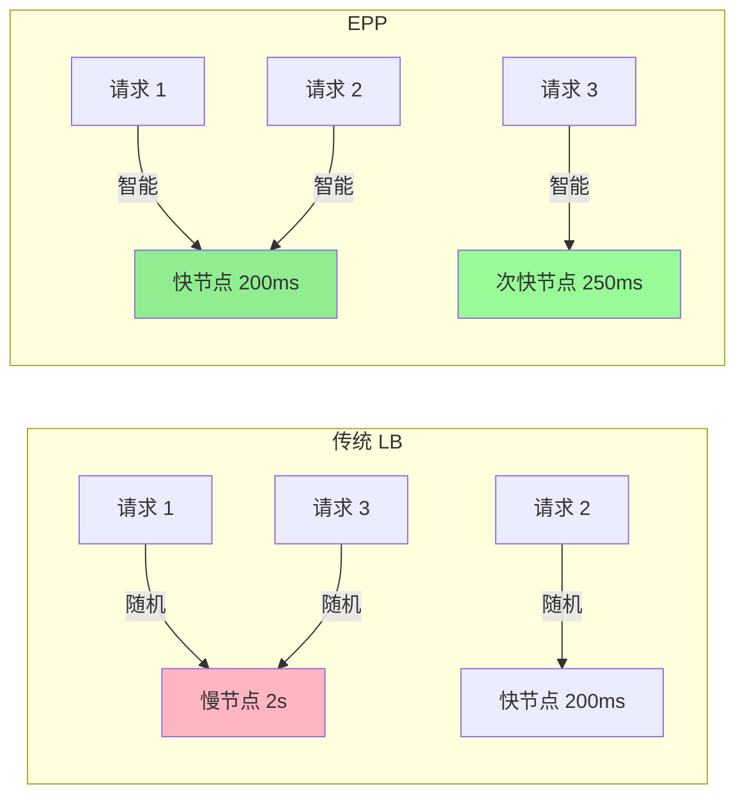
```mermaid
graph LR
   subgraph Before["传统 LB"]
       B1[请求 1] -->|随机| Bad[慢节点 2s]
       B2[请求 2] -->|随机| Good[快节点 200ms]
       B3[请求 3] -->|随机| Bad
   end

   subgraph After["EPP"]
       A1[请求 1] -->|智能| Fast[快节点 200ms]
       A2[请求 2] -->|智能| Fast
       A3[请求 3] -->|智能| Fast2[次快节点 250ms]
   end

   style Bad fill:#FFB6C1
   style Fast fill:#90EE90
   style Fast2 fill:#98FB98
```

#### 吞吐量提升

| 指标       | 传统 LB | EPP   | 提升 |
| ---------- | ------- | ----- | ---- |
| 请求/秒    | 100     | 150   | +50% |
| 平均延迟   | 800ms   | 400ms | -50% |
| GPU 利用率 | 60%     | 90%   | +30% |

#### 成本优化

```
实际计算：
场景：处理 10000 请求/分钟

传统方式：
- 需要 10 个 GPU（利用率 60%）
- 成本：$10/小时 × 10 = $100/小时

EPP 方式：
- 只需 7 个 GPU（利用率 90%）
- 成本：$10/小时 × 7 = $70/小时

月节省：($100 - $70) × 24 × 30 = $21,600
```

### 平台团队视角

#### 标准合规

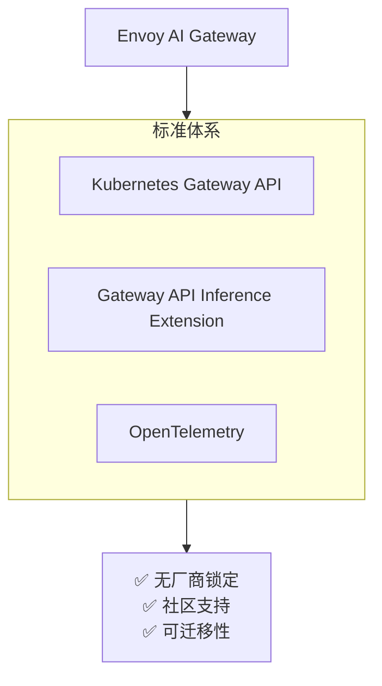
```mermaid
graph TB
   subgraph Standards["标准体系"]
       K8s[Kubernetes Gateway API]
       Inference["Gateway API Inference Extension"]
       OTel[OpenTelemetry]
   end

   EPP[Envoy AI Gateway] --> Standards

   Standards --> Benefits["✅ 无厂商锁定<br/>✅ 社区支持<br/>✅ 可迁移性"]
```


##### Gateway API Inference Extension

> Gateway API Inference Extension 是 **Kubernetes Gateway API** 的官方扩展，专门为 **AI/ML 推理工作负载**设计的**标准路由规范**

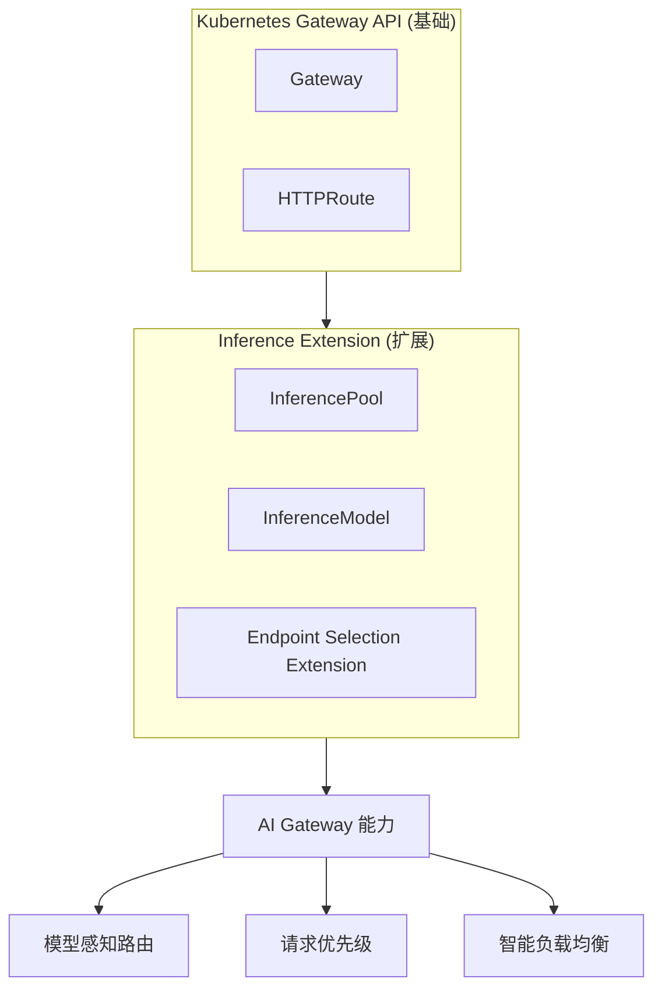
```mermaid
graph TB
   subgraph GatewayAPI["Kubernetes Gateway API (基础)"]
       GW[Gateway]
       HTTP[HTTPRoute]
   end

   subgraph InferenceExt["Inference Extension (扩展)"]
       IP[InferencePool]
       IM[InferenceModel]
       ESE[Endpoint Selection Extension]
   end

   GatewayAPI --> InferenceExt
   InferenceExt --> AIGW["AI Gateway 能力"]

   AIGW --> R1[模型感知路由]
   AIGW --> R2[请求优先级]
   AIGW --> R3[智能负载均衡]
```

> 核心 CRD - InferencePool（平台运维视角）

```yaml
apiVersion: inference.networking.k8s.io/v1
kind: InferencePool
metadata:
 name: vllm-llama3-pool
spec:
 targetPortNumber: 8000
 selector:
   app: vllm-llama3
 # 引用 EPP 实现智能路由
 extensionRef:
   name: vllm-endpoint-picker
```

| 特性 | 说明给你                                              |
| ---- | ----------------------------------------------------- |
| 定位 | 平台管理员使用                                        |
| 职责 | 管理**推理 Pod** 的**部署**、**扩缩容**、**负载均衡** |
| 类比 | 类似 **Service**，但针对 **AI/ML 推理**优化           |
| 策略 | 强制**平台级**资源策略                                |

> 核心 CRD - InferenceModel（AI/ML 所有者视角）

```yaml
apiVersion: inference.networking.k8s.io/v1
kind: InferenceModel
metadata:
 name: gpt-4-chat
spec:
 # 将公开名称映射到实际模型
 model: meta-llama/Llama-3.1-8B-Instruct
 poolRef:
   name: vllm-llama3-pool
 # 流量分割策略
 traffic:
   - weight: 90
     modelName: llama-3.1-8b
   - weight: 10
     modelName: llama-3.1-8b-experimental
```

| 特性 | 说明                                   |
| ---- | -------------------------------------- |
| 定位 | **AI/ML 模型所有者**使用               |
| 职责 | 管理**服务什么模型**、流量分割、优先级 |
| 抽象 | "模型即服务"（Model-as-a-Service）     |

> 请求流程对比

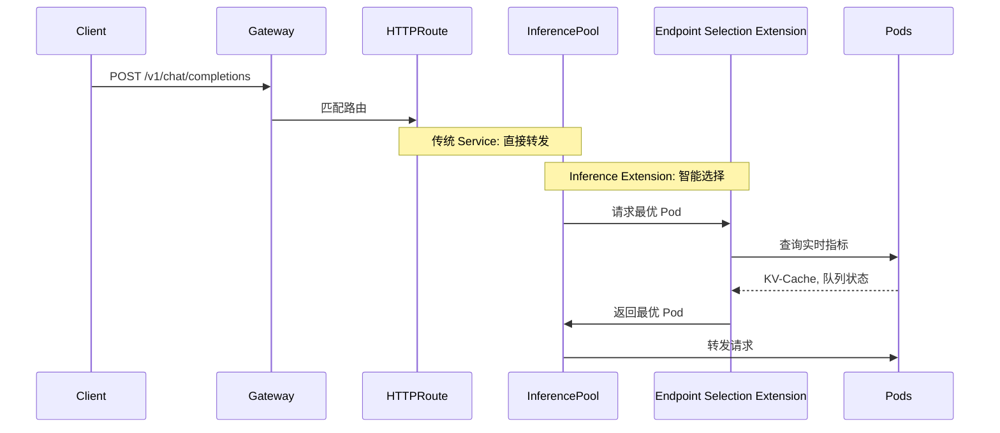
```mermaid
sequenceDiagram
   participant Client
   participant Gateway
   participant HTTPRoute
   participant InferencePool
   participant ESE as Endpoint Selection Extension
   participant Pods

   Client->>Gateway: POST /v1/chat/completions
   Gateway->>HTTPRoute: 匹配路由

   Note over HTTPRoute,InferencePool: 传统 Service: 直接转发
   Note over InferencePool,ESE: Inference Extension: 智能选择

   InferencePool->>ESE: 请求最优 Pod
   ESE->>Pods: 查询实时指标
   Pods-->>ESE: KV-Cache, 队列状态
   ESE->>InferencePool: 返回最优 Pod
   InferencePool->>Pods: 转发请求
```

> 为什么需要这个扩展？

| 问题              | 传统 Gateway/Service | Inference Extension                      |
| ----------------- | -------------------- | ---------------------------------------- |
| <u>路由依据</u>   | HTTP 路径、轮询      | **KV-Cache**、**队列深度**、**模型状态** |
| <u>状态感知</u>   | 无状态               | 部分有状态（**Token Cache**）            |
| <u>请求优先级</u> | 无                   | 支持关键性（**交互式** vs **批处理**）   |
| <u>模型感知</u>   | 不知道模型           | 知道**模型类型**和**适配器**             |
| <u>GPU 利用</u>   | 不优化               | 基于**实际负载**优化                     |

> 基准测试结果（官方） - 在 H100 GPU + vLLM + Llama2 测试中

| 指标                | 传统 Service | Inference Extension | 提升     |
| ------------------- | ------------ | ------------------- | -------- |
| 吞吐量              | 基准         | 相当                | 持平     |
| P90 延迟 (500+ QPS) | 基准         | **显著降低**        | 避免热点 |

> 生态集成

```mermaid
  graph LR
      subgraph Implementations["支持实现"]
          EG[Envoy AI Gateway]
          Istio[Istio]
          KGateway[KGateway]
      end

      subgraph Backends["推理后端"]
          VLLM[vLLM]
          TGI[TGI]
      end

      Implementations --> Backends
```

> 路线图（走向 GA）

1. **Prefix-cache 感知**负载均衡
2. **LoRA 适配器**管道
3. 工作负载**公平性**和**优先级**
4. **HPA 支持**（基于模型指标）
5. **多模态**输入/输出支持

> Gateway API Inference Extension = **Kubernetes 原生** + **AI 推理语义**

1. **标准化**的 CRD（InferencePool、InferenceModel）
2. **可扩展**的架构（Endpoint Selection Extension）
3. 让普通 Gateway 变成 **Inference Gateway**

#### 厂商灵活性

```yaml
# 今天用 vLLM 的 EPP
extensionRef:
 name: vllm-epp

# 明天可以换成其他实现
extensionRef:
 name: custom-epp      # 自研
 # name: vendor-x-epp  # 第三方
```

#### 架构前瞻性

```mermaid
timeline
   title EPP 架构演进
   section 2025 Q3
       基础 EPP : KV-Cache + 队列路由
   section 2025 Q4
       高级特性 : LoRA 感知 + 成本优化
   section 2026 Q1
       多云支持 : 跨云推理调度
   section 2026 Q2
       AI 原生调度 : 推理训练统一调度
```

### DevOps 团队视角

#### 运维减少

```
传统运维噩梦：
# 手动管理
kubectl drain node-1  # 节点出问题
kubectl scale deployment vllm --replicas=5  # 手动扩容
# 反复调整权重、下线节点...

EPP 自动化：
# 节点自动管理
node-1 故障 → EPP 自动感知 → 流量切换到其他节点
流量增加 → EPP 自动利用空闲节点 → 无需人工介入
```

#### 可靠性提升

```mermaid
stateDiagram-v2
   [*] --> Normal
   Normal --> Degrading: 节点性能下降
   Degrading --> Normal: 自愈
   Degrading --> Failed: 超过阈值

   Failed --> Normal: 自动替换/恢复

   note right of Normal
       EPP 自动降低权重
       不是直接下线
   end note

   note right of Failed
       EPP 完全排除
       流量 100% 绕过
   end note
```

#### 资源利用率对比

```mermaid
graph TB
   subgraph Traditional["传统方式"]
       T1[节点 A: 95% 负载]
       T2[节点 B: 30% 负载]
       T3[节点 C: 25% 负载]
   end

   subgraph EPP["EPP 方式"]
       E1[节点 A: 60% 负载]
       E2[节点 B: 65% 负载]
       E3[节点 C: 62% 负载]
   end

   style T1 fill:#FFB6C1
   style T1A fill:#90EE90
```

#### 扩展简化

```
传统扩展：
# 新增节点需要
1. 部署新 Pod
2. 手动更新 Service/Endpoint
3. 调整负载均衡权重
4. 监控是否正常

EPP 扩展：
# 只需
kubectl scale deployment vllm --replicas=5
# EPP 自动发现并开始路由
```

### 收益总结表

> 核心价值：**EPP** 把 **AI 推理的复杂性** 从应用层下沉到**基础设施层**，让每个角色都能专注于自己的核心职责

| 角色         | 核心痛点   | EPP 解决方案 | 量化收益      |
| ------------ | ---------- | ------------ | ------------- |
| AI/ML 工程师 | 延迟不可控 | 智能端点选择 | P99 延迟 -60% |
| AI/ML 工程师 | 资源浪费   | 高利用率     | 成本 -30%     |
| 平台团队     | 厂商锁定   | 标准 API     | 可迁移        |
| DevOps       | 手动运维   | 自动化       | 运维工时 -80% |

## 未来规划

### 架构演进里程碑

```mermaid
timeline
   title Envoy AI Gateway 演进
   section v0.1-v0.2
       Egress Gateway : 路由外部 LLM (OpenAI, Anthropic)
   section v0.3
       EPP 支持 : 智能推理路由 HTTPRoute + InferencePool
   section 未来
       自管理 EPP : 内置 Endpoint Picker 降级支持
```

### 即将推出的增强功能

#### 上游一致性测试

> 确保 Envoy AI Gateway 的 EPP 实现完全符合 **Gateway API Inference Extension** 标准，保证与其他实现的**互操作性**

```mermaid
graph LR
   AIGW[Envoy AI Gateway] --> Test["Conformance Tests"]
   Test --> Spec["Gateway API<br/>Inference Extension Spec"]

   Spec --> Verify["✅ 标准合规验证"]
   Verify --> Benefits["互操作性保证<br/>迁移能力保证"]
```

#### 降级支持 (Fallback Support)

```mermaid
stateDiagram-v2
   [*] --> EPP_Available: EPP 正常

   EPP_Available: 智能路由<br/>基于 KV-Cache/队列

   EPP_Available --> EPP_Unavailable: EPP 故障
   EPP_Unavailable --> EPP_Available: EPP 恢复

   EPP_Unavailable: 降级模式<br/>HostOverride LbPolicy<br/>传统负载均衡

   note right of EPP_Available
       最优性能
   end note

   note right of EPP_Unavailable
       持续可用
       不中断服务
   end note
```

> 核心价值：即使 EPP 故障，**流量也不中断**

| 状态     | 路由方式     | 性能           |
| -------- | ------------ | -------------- |
| EPP 正常 | 智能选择端点 | 最优           |
| EPP 故障 | 传统负载均衡 | **降级但可用** |

#### 内置托管 EPP (Internal Managed EPP)

```mermaid
graph TB
   subgraph Today["当前架构"]
       AIGW[Envoy AI Gateway] --> ExternalEPP["外部 EPP 实现<br/>(vLLM EPP, 自研等)"]
   end

   subgraph Future["未来架构"]
       AIGW2[Envoy AI Gateway] --> Choice{"选择 EPP"}
       Choice --> Internal["内置 EPP<br/>开箱即用"]
       Choice --> External["外部 EPP<br/>高级定制"]
   end
```

| 方面              | 当前                      | 未来（内置 EPP） |
| ----------------- | ------------------------- | ---------------- |
| <u>部署复杂度</u> | 需要**单独部署 EPP 服务** | **零配置**       |
| <u>运维负担</u>   | 管理 EPP 生命周期         | Gateway 自动管理 |
| <u>适用场景</u>   | 需要高级定制              | 大多数场景       |

#### 端到端测试增强

```mermaid
graph LR
   Test[E2E 测试] --> Coverage["覆盖范围"]

   Coverage --> C1[InferencePool 基础功能]
   Coverage --> C2[EPP 集成场景]
   Coverage --> C3[故障恢复]
   Coverage --> C4[性能基准]

   C1 --> Quality["质量保证"]
   C2 --> Quality
   C3 --> Quality
   C4 --> Quality
```

### 总结

> 核心愿景：让 Envoy AI Gateway 成为 **最易用、最可靠** 的 **Kubernetes AI 推理网关**

| 维度     | 当前状态     | 未来方向       |
| -------- | ------------ | -------------- |
| 标准合规 | 基本支持     | 完全一致性测试 |
| 高可用   | EPP 单点风险 | 降级支持       |
| 易用性   | 需外部 EPP   | 内置托管 EPP   |
| 质量     | 基础测试     | 全面 E2E 覆盖  |
| 生态     | 早期阶段     | 社区驱动创新   |

## 核心意义

### 架构定位转变

> **入站推理流量**

```mermaid
graph TB
   subgraph Before["v0.3 之前"]
       Egress["Egress Gateway<br/>仅处理出站流量"]
       Egress --> External["外部 LLM Provider<br/>OpenAI, Anthropic, ..."]
   end

   subgraph After["v0.3 之后"]
       Egress2["Egress Gateway<br/>出站流量"]
       Ingress["Ingress Gateway<br/>入站推理流量"]

       Egress2 --> External
       Ingress --> Internal["自托管推理<br/>vLLM, TGI, KServe"]
   end
```

### 双模式 Gateway 对比

| 能力     | Egress AI Gateway             | Ingress AI Gateway     |
| -------- | ----------------------------- | ---------------------- |
| 主要功能 | **路由到外部 LLM**            | **路由到内部推理**     |
| 流量方向 | 出站                          | 入站                   |
| 典型用例 | **统一访问 OpenAI/Anthropic** | **自托管模型服务**     |
| 关键特性 | **凭证管理、限流**            | **EPP 智能路由**       |
| 共同特性 | **可观测性、安全策略**        | **可观测性、GPU 优化** |

### EPP 的核心价值主张

```mermaid
graph LR
   RealtimeMetrics["实时指标"] --> EPPCore["EPP 核心能力"]

   EPPCore --> AutoSelect["自动选择最优端点"]
   EPPCore --> Perf["性能提升"]
   EPPCore --> Resource["资源利用率最大化"]

   Perf --> Benefit1["降低延迟"]
   Resource --> Benefit2["成本优化"]
   AutoSelect --> Benefit3["零运维"]
```


### 适用场景全覆盖

```mermaid
mindmap
 root((EPP 支持场景))
   small["小规模 AI 服务"]
     s1[单团队使用]
     s2[少量 GPU]
     s3[简单配置]
   large["大规模推理平台"]
     l1[多团队共享]
     l2[数百 GPU]
     l3[复杂策略]
   benefit["共同收益"]
     b1[智能路由]
     b2[高性能]
     b3[可靠性]
```

| 场景     | 规模          | EPP 价值           |
| -------- | ------------- | ------------------ |
| 小型服务 | 1-10 个 GPU   | 开箱即用，零配置   |
| 中型平台 | 10-100 个 GPU | 自动优化，减少运维 |
| 大型平台 | 100+ GPU      | 企业级可靠性和性能 |

### 愿景总结

```mermaid
timeline
   title Envoy AI Gateway 发展愿景
   section 现在
       Egress + Ingress 双模式 Gateway
   section 近期
       内置 EPP 降级支持 更多集成测试
   section 长期
       AI 工作负载管理 最可靠的 AI 部署方案
```

> Envoy AI Gateway = **简化** + **增强** + **可靠性** 的 AI 部署解决方案

1. 定位转变：从单纯的 Egress Gateway → **Egress + Ingress** 双模式
2. 核心能力：基于**实时指标**的**智能端点选择**
3. 适用范围：从小型服务到大型平台**全覆盖**
4. 社区驱动：开源协作，持续演进

# v0.3 Release

## 三大核心转变

```mermaid
graph TB
   subgraph v0_3["v0.3 三大转变"]
       Shift1["静态 → 智能路由<br/>EPP 集成"]
       Shift2["实验 → 生产级提供商<br/>Vertex AI + Native Anthropic"]
       Shift3["基础 → 企业级可观测<br/>OpenInference Tracing"]
   end
```


### 智能路由

| 转变     | 传统方式    | v0.3                                 |
| -------- | ----------- | ------------------------------------ |
| 路由依据 | 轮询/连接数 | **KV-Cache**、**队列深度**、**LoRA** |
| 资源利用 | 不均衡      | **智能分配**                         |
| 运维     | 手动调整    | 自动化                               |

### 扩展提供商生态

> 新增支持

```mermaid
graph LR
   subgraph Providers["v0.3 提供商支持"]
       Vertex["Google Vertex AI<br/>🆕 生产级"]
       Anthropic["Anthropic on Vertex<br/>🆕 生产级"]
       Native["Native Anthropic API<br/>🆕 ClaudeCode 场景"]
   end
```

> Google Vertex AI 详情

| 能力                | 状态     | 说明                                    |
| ------------------- | -------- | --------------------------------------- |
| Gemini 支持         | ✅ 完整   | 流式、多模态、函数调用                  |
| Anthropic on Vertex | ✅ 生产级 | 多工具、可配置 API 版本                 |
| 认证方式            | ✅ 两种   | Service Account Key / Workload Identity |

> 统一 API 价值

```python
# 应用代码（不需要改动）
client = OpenAI(
   api_key="internal-token",
   base_url="https://gateway.company.com/v1"
)

# Gateway 层面切换
# gpt-4 → OpenAI
# claude-3 → Anthropic (直接或 via Vertex)
# gemini → Google Vertex AI
```

### 企业级可观测性

> 四大增强

```mermaid
mindmap
 root((v0.3 可观测性))
   OpenInference["OpenInference Tracing"]
     完整请求生命周期
     评估系统兼容
     审计追踪
   MetricsLabels["可配置指标标签"]
     基于 Header 自定义
     用户 ID 维度
     应用上下文
   Embeddings["Embeddings 指标"]
     Token 使用跟踪
     成本归因
   GenAI["增强 GenAI 指标"]
     错误处理
     Token 延迟
```

> OpenInference vs OTel GenAI

| 维度     | OTel GenAI            | OpenInference              |
| -------- | --------------------- | -------------------------- |
| 定位     | 通用监控标准          | LLM **评估**导向           |
| 兼容性   | -                     | 与 OTel GenAI 兼容         |
| 代表平台 | Datadog, **Langfuse** | **Arize Phoenix**          |
| 核心场景 | 监控告警              | **模型评估**、**质量分析** |

> 配置示例（可补充）

```yaml
# 可配置指标标签
metrics:
 labels:
   - header: "x-user-id"
     label: "user_id"
   - header: "x-app-version"
     label: "app_version"

# Embeddings 指标支持
embeddings:
 metrics:
   - prompt_tokens
   - total_tokens
```

> Model Name Virtualization (v0.3)

```yaml
backendRefs:
 - name: openai-backend
   modelNameOverride: "gpt-4"      # 应用层看到的统一名称
 - name: anthropic-backend
   modelNameOverride: "claude-3"
```

> 用例

1. A/B 测试
2. 逐渐迁移
3. 避免厂商锁定

## 新特性详解

> 特性概览

```mermaid
mindmap
 root((v0.3 新特性))
   EPP["Endpoint Picker Provider"]
     Gateway_API["Gateway API Inference Extension"]
     Intelligent["智能端点选择"]
     Realtime["实时 AI 指标"]
   Vertex_AI["Google Vertex AI"]
     Production["生产级支持"]
     Gemini["Gemini 完整支持"]
     Anthropic_Vertex["Anthropic on Vertex"]
     Native["Native Anthropic API"]
   Observability["可观测性增强"]
     OpenInference["OpenInference Tracing"]
     Metrics_Labels["可配置指标标签"]
     Embeddings["Embeddings 指标"]
     GenAI["增强 GenAI 指标"]
   Model_Virtual["模型名虚拟化"]
     Abstraction["模型名抽象"]
     Flexibility["提供商灵活性"]
```


### Endpoint Picker Provider

| 传统负载均衡 | EPP 智能路由         |
| ------------ | -------------------- |
| 静态配置     | **实时适应**         |
| 无 AI 语义   | **理解 AI 工作负载** |
| 手动运维     | 自动化               |

### Google Vertex AI 支持

> 支持矩阵

```mermaid
graph TB
   subgraph Vertex["Vertex AI 集成"]
       Auth["认证方式"]
       Gemini["Gemini 模型"]
       AnthropicV["Anthropic on Vertex"]
       Native["Native Anthropic API"]
   end

   Auth --> A1["Service Account Key"]
   Auth --> A2["Workload Identity Federation"]

   Gemini --> G1["函数调用"]
   Gemini --> G2["多模态"]
   Gemini --> G3["推理"]
   Gemini --> G4["流式"]

   AnthropicV --> AN1["多工具支持"]
   AnthropicV --> AN2["可配置 API 版本"]
   AnthropicV --> AN3["扩展思考"]

   Native --> N1["ClaudeCode 场景"]
```

> 能力对比

| 能力            | Gemini | Anthropic on Vertex | Native Anthropic |
| --------------- | ------ | ------------------- | ---------------- |
| 函数调用        | ✅      | ✅                   | ✅                |
| 多模态          | ✅      | ✅                   | ✅                |
| 流式响应        | ✅      | ✅                   | ✅                |
| 扩展思考        | -      | ✅                   | ✅                |
| **Claude Code** | -      | -                   | ✅                |

### 企业级可观测性

#### OpenInference Tracing Integration

| 特性                | 收益                          |
| ------------------- | ----------------------------- |
| <u>完整请求追踪</u> | 深入 **AI 请求**生命周期      |
| <u>评估系统兼容</u> | 与 **Arize Phoenix** 无缝集成 |
| <u>完整数据捕获</u> | 调试和分析的**审计追踪**      |

> 与 **OTel GenAI** 的关系

```mermaid
graph LR
   subgraph Standards["标准层"]
       OTel["OTel GenAI SemConv<br/>通用监控标准"]
       OI["OpenInference<br/>评估导向标准"]
   end

   subgraph Platforms["平台层"]
       Phoenix["Arize Phoenix"]
       Langfuse["Langfuse"]
   end

   OTel --> Langfuse
   OI --> Phoenix
   OTel --> Phoenix

   OI -.兼容.-> OTel
```


#### Configurable Metrics Labels

> 配置示例

```yaml
# 基于 HTTP Header 自定义标签
metrics:
 labels:
   - header: "x-user-id"
     label: "user_id"
   - header: "x-app-version"
     label: "app_version"
   - header: "x-team"
     label: "team"
```

> 使用场景

```
# 按用户 ID 监控
ai_gateway_latency_seconds{user_id="alice", model="gpt-4"}

# 按应用版本过滤
ai_gateway_tokens_total{app_version="v2.1.0"}

# 按团队分段告警
alert: HighTokenUsage
expr: sum(ai_gateway_tokens_total{team="marketing}) > threshold
```

#### Embeddings Metrics Support

| 之前              | v0.3                               |
| ----------------- | ---------------------------------- |
| ❌ 只跟踪 Chat API | ✅ **Chat** + **Embeddings** 双支持 |
| ❌ 成本归因不准确  | ✅ **精确成本分配**                 |

> 指标示例

```
# Chat 指标
ai_gateway_chat_tokens_total{model="gpt-4"}
ai_gateway_chat_latency_seconds

# Embeddings 指标（v0.3 新增）
ai_gateway_embeddings_tokens_total{model="text-embedding-3"}
ai_gateway_embeddings_requests_total
```

#### Enhanced GenAI Metrics

| 增强       | 说明                                 |
| ---------- | ------------------------------------ |
| 错误处理   | 更可靠的错误分类和映射               |
| Token 延迟 | 更准确的 TTFT（Time To First Token） |
| 性能分析   | 改进的性能洞察                       |

### Model Name Virtualization

#### 核心概念

```mermaid
graph LR
   App["应用代码<br/>gpt-4"] --> Gateway["Gateway 层"]
   Gateway --> OpenAI["OpenAI<br/>gpt-4-turbo"]
   Gateway --> Anthropic["Anthropic<br/>claude-3-opus"]
   Gateway --> Llama["自托管<br/>llama-3-70b"]
```

#### 配置示例

```yaml
backendRefs:
 - name: openai-backend
   modelNameOverride: "gpt-4"        # 应用层统一名称
 - name: anthropic-backend
   modelNameOverride: "claude-3"
 - name: self-hosted-backend
   modelNameOverride: "company-model"
```

#### 实际用例

> 用例 1: A/B 测试

```yaml
backendRefs:
 - name: openai-gpt4
   modelNameOverride: "gpt-4"
   weight: 90                         # 90% 流量
 - name: openai-gpt4-turbo
   modelNameOverride: "gpt-4"         # 同一个虚拟名称
   weight: 10                         # 10% 流量测试
```

> 用例 2: 逐渐迁移

```yaml
# 阶段 1: 全部用 OpenAI
backendRefs:
 - name: openai
   modelNameOverride: "gpt-4"
   weight: 100

# 阶段 2: 逐步切换到自托管
backendRefs:
 - name: openai
   modelNameOverride: "gpt-4"
   weight: 70
 - name: self-hosted
   modelNameOverride: "gpt-4"         # 同一个虚拟名称
   weight: 30

# 阶段 3: 完全迁移
backendRefs:
 - name: self-hosted
   modelNameOverride: "gpt-4"
   weight: 100
```

> 用例 3: 避免厂商锁定

```yaml
backendRefs:
 - name: openai
   modelNameOverride: "premium-model"
   provider: openai
 - name: anthropic
   modelNameOverride: "premium-model"  # 同一个虚拟名称
   provider: anthropic
 - name: self-hosted
   modelNameOverride: "premium-model"  # 可随时切换
   provider: internal
```

## Unified LLM and non-LLM APIs

### 核心概念

1. 之前：Gateway 要么处理**普通流量**，要么处理 **AI 流量**
2. v0.3：同一个 Gateway 可以**同时处理两种流量**

```mermaid
graph TB
   subgraph Before["v0.3 之前"]
       GW1["Gateway 1<br/>HTTPRoute"]
       GW2["Gateway 2<br/>AIGatewayRoute"]

       GW1 --> Web["普通 Web 流量"]
       GW2 --> AI["AI 流量"]
   end

   subgraph After["v0.3 之后"]
       GW["单一 Gateway"]

       GW --> Routes["路由配置"]

       Routes --> HTTPR["HTTPRoute<br/>普通流量"]
       Routes --> AIGWR["AIGatewayRoute<br/>AI 流量"]
   end
```

### 配置示例

```yaml
# 同一个 Gateway 挂载两种 Route
apiVersion: gateway.networking.k8s.io/v1
kind: Gateway
metadata:
 name: unified-gateway
spec:
 gatewayClassName: envoy-gateway
 listeners:
   - name: http
     protocol: HTTP
     port: 80
     hostname: "*.example.com"
---
# 普通 HTTP 流量
apiVersion: gateway.networking.k8s.io/v1
kind: HTTPRoute
metadata:
 name: web-routes
spec:
 parentRefs:
   - name: unified-gateway      # 关联同一个 Gateway
 rules:
   - matches:
       - path:
           value: /api/*
     backendRefs:
       - name: web-service
---
# AI 流量
apiVersion: aigateway.envoyproxy.io/v1alpha1
kind: AIGatewayRoute
metadata:
 name: ai-routes
spec:
 parentRefs:
   - name: unified-gateway      # 关联同一个 Gateway
 rules:
   - matches:
       - path:
           value: /v1/chat/completions
     backendRefs:
       - name: llm-backend
```

### 路由决策流程

```mermaid
flowchart TD
   Request["客户端请求"] --> Gateway["Unified Gateway"]

   Gateway --> Match{路由匹配}

   Match -->|普通 HTTP| HTTPRoute["HTTPRoute"]
   Match -->|AI 请求| AIGatewayRoute["AIGatewayRoute"]

   HTTPRoute --> WebBackend["Web Service"]
   AIGatewayRoute --> AIBackend["LLM Provider"]
```

### 实际场景

| 场景          | 路径                 | 路由类型       | 后端     |
| ------------- | -------------------- | -------------- | -------- |
| 静态资源      | /static/*            | HTTPRoute      | S3/CDN   |
| Web API       | /api/users           | HTTPRoute      | 应用服务 |
| AI Chat       | /v1/chat/completions | AIGatewayRoute | OpenAI   |
| AI Embeddings | /v1/embeddings       | AIGatewayRoute | 自托管   |

### 收益

| 收益       | 说明                  |
| ---------- | --------------------- |
| 简化部署   | 一个 Gateway 而非多个 |
| 统一管理   | 单一配置入口          |
| 降低复杂度 | 减少基础设施组件      |
| 灵活路由   | AI 和非-AI 流量共存   |

### 对比

```mermaid
graph LR
   subgraph Traditional["传统方案"]
       T1["Gateway A<br/>Web 流量"]
       T2["Gateway B<br/>AI 流量"]
       T3["Gateway C<br/>其他流量"]
   end

   subgraph Unified["统一方案"]
       U1["单一 Gateway<br/>所有流量"]
   end

   Traditional --> Complex["复杂: 3 个 Gateway"]
   Unified --> Simple["简单: 1 个 Gateway"]
```

### 总结

> 这个特性让 **Envoy AI Gateway** 成为**统一入口**，而不仅仅是专门的 AI 网关

```
                      ┌─────────────────────────────┐
                      │   Unified Gateway           │
                      │                             │
                      │   ┌─────────────────────┐   │
                      │   │ HTTPRoute            │   │ → /api/*      → Web Service
                      │   │ /static/*            │   │ → /health     → Health Check
                      │   │ /web/*               │   │
                      │   └─────────────────────┘   │
                      │   ┌─────────────────────┐   │
                      │   │ AIGatewayRoute       │   │ → /v1/chat/*   → LLM Provider
                      │   │ /v1/chat/completions │   │ → /v1/embeddings→ Embeddings
                      │   │ /v1/embeddings       │   │
                      │   └─────────────────────┘   │
                      └─────────────────────────────┘
```

> 核心价值：不需要为 **AI 流量**单独部署基础设施，可以**渐进式**地将 AI 能力引入现有系统

## 社区影响与项目动力

### 贡献者分布

```mermaid
pie
   title v0.3 贡献来源
   "Tetrate" : 35
   "Bloomberg" : 20
   "Tencent" : 15
   "Google" : 10
   "Nutanix" : 5
   "独立开发者" : 15
```

### 标准领导力

```mermaid
graph TB
   subgraph Standards["遵循的标准"]
       K8s["Kubernetes Gateway API"]
       Inference["Gateway API Inference Extension"]
       OTel["OpenTelemetry"]
       OpenInf["OpenInference"]
   end

   subgraph EAIGW["Envoy AI Gateway"]
       EAIGW1["✓ Gateway API Inference Extension"]
       EAIGW2["✓ OpenInference Tracing"]
       EAIGW3["✓ OTel GenAI SemConv"]
   end

   Standards --> EAIGW

   EAIGW --> Benefits["厂商中立<br/>可互操作<br/>面向未来"]
```

### 项目定位

> 核心理念：**AI 基础设施**的未来是 **开放**的、**智能**的、**社区驱动**的

```
┌─────────────────────────────────────────────────────────┐
│                 Envoy AI Gateway                        │
│                                                          │
│  🎯 开放、协作、社区驱动                                  │
│                                                          │
│  ┌──────────────────────────────────────────────────┐  │
│  │                                                  │  │
│  │  标准 ✓ Kubernetes Gateway API                   │  │
│  │  标准 ✓ OpenTelemetry                           │  │
│  │  标准 ✓ OpenInference                           │  │
│  │                                                  │  │
│  │  社区 ✓ Tetrate, Bloomberg, Tencent...           │  │
│  │  社区 ✓ 独立开发者                                │  │
│  │  社区 ✓ 企业用户                                  │  │
│  │                                                  │  │
│  └──────────────────────────────────────────────────┘  │
│                                                          │
│  未来 = 开放 + 智能 + 社区驱动                           │
└─────────────────────────────────────────────────────────┘
```

# OpenTelemetry Tracing

## AI 应用可观测性挑战

### 传统可观测性的局限

```mermaid
graph TB
   subgraph Traditional["传统可观测性"]
       Metrics["聚合指标"]
       M1["延迟"]
       M2["错误率"]
       M3["吞吐量"]
   end

   Metrics --> Problem["❌ 无法回答问题"]

   Problem --> Q1["为什么输出错误？"]
   Problem --> Q2["为什么慢？"]
   Problem --> Q3["为什么贵？"]
```

### AI 应用的独特挑战

| 挑战                     | 为什么传统指标不够               |
| ------------------------ | -------------------------------- |
| <u>复杂的 Token 成本</u> | **请求次数 ≠ 实际成本**          |
| <u>流式响应慢</u>        | **HTTP 延迟掩盖 Token 生成速度** |
| <u>语义错误</u>          | **HTTP 200 ≠ 正确答案**          |

### 具体场景

```mermaid
graph LR
   subgraph Request["相同 HTTP 指标"]
       R1["延迟: 2s"]
       R2["状态: 200 OK"]
       R3["吞吐量: 10 req/s"]
   end

   subgraph Reality["实际差异"]
       Bad["语义错误<br/>答非所问"]
       Expensive["Token 成本高<br/>10K tokens"]
       Slow["TTFT 慢<br/>首字 1.5s"]
   end

   Request --> Reality
```

### EAIGW 现有指标

| 版本    | 指标                                            | 局限           |
| ------- | ----------------------------------------------- | -------------- |
| v0.1.x  | **Token 使用**、**请求时间**、**Provider 性能** | 只看**聚合**   |
| v0.1.3+ | GenAI 专用指标（**TTFT**）                      | 仍然缺少上下文 |

```
# 现有指标示例
ai_gateway_request_tokens_total       # 总 Token 数
ai_gateway_latency_seconds            # 总延迟
ai_gateway_time_to_first_token        # TTFT (v0.1.3+)
```

### 为什么需要 Tracing

```mermaid
graph TB
   subgraph Metrics["指标 (What)"]
       M["慢请求 = 5"]
   end

   subgraph Tracing["追踪 (Why + How)"]
       T1["Prompt 内容"]
       T2["模型参数"]
       T3["Token 生成时间线"]
       T4["完整响应"]
   end

   Metrics --> Question["❓ 为什么慢？"]

   Question -->|"指标"| A1["不知道"]
   Question -->|"追踪"| A2["Prompt 太长<br/>Temperature 太高<br/>Provider 慢"]
```

### 指标 vs Tracing

| 维度     | 指标       | Tracing          |
| -------- | ---------- | ---------------- |
| 回答什么 | 发生了什么 | 为什么发生       |
| 粒度     | 聚合       | 单个请求         |
| 上下文   | 无         | 完整请求生命周期 |
| 根因分析 | 困难       | 直接             |

### 总结

> 传统可观测性的"三支柱"对 AI 不够

| 传统可观测性   | AI 可观测性需求         |
| -------------- | ----------------------- |
| Metrics (数字) | + **Tracing (上下文)**  |
| Logs (文本)    | + **Evaluation (质量)** |
| Traces (路径)  | + **Token 级可见性**    |

> v0.3 的答案：**OpenTelemetry** + **OpenInference Tracing** = 完整的 **LLM 请求**可见性

## OpenInference Semantic Conventions

### 标准选择

```mermaid
graph TB
   subgraph Choice["标准决策"]
       Custom["自定义 Trace 格式"]
       Standard["OpenInference<br/>AI 专用标准"]
   end

   subgraph WhyOpenInference["为什么选 OpenInference"]
       W1["✓ 广泛接受"]
       W2["✓ 兼容 OpenTelemetry"]
       W3["✓ 框架支持<br/>(BeeAI, SmolAgents)"]
   end

   Standard --> EAIGW["Envoy AI Gateway"]

   EAIGW --> Benefits["AI 专用追踪规则"]
```


### OpenInference 覆盖的内容

| 类别     | 追踪内容                                        |
| -------- | ----------------------------------------------- |
| 输入     | **Prompt**、**系统消息**、**对话历史**          |
| 配置     | **模型参数**（**temperature**, **max_tokens**） |
| 使用量   | **Token 数**（输入/输出）                       |
| 输出     | **响应内容**、**流式块**                        |
| 关键事件 | **TTFT**、**每个 Token 生成时间**               |

### Span 结构

```mermaid
graph TB
   subgraph LLM["LLM Span"]
       Attr["属性 Attributes"]
       Events["事件 Events"]
   end

   subgraph AttrList["属性列表"]
       A1["llm.prompt"]
       A2["llm.model_name"]
       A3["llm.temperature"]
       A4["llm.total_tokens"]
   end

   subgraph EventList["事件列表"]
       E1["llm.first_token<br/>TTFT 时间"]
       E2["llm.token.next<br/>每个 Token"]
       E3["llm.finish<br/>完成时间"]
   end

   Attr --> AttrList
   Events --> EventList
```

### 关键时刻：Span Events

```mermaid
sequenceDiagram
   participant Client
   participant Gateway
   participant LLM

   Client->>Gateway: 发送请求
   Gateway->>LLM: 转发

   Note over Gateway: [Span Start]

   LLM-->>Gateway: 首个 Token
   Note over Gateway: [Event: first_token<br/>记录 TTFT]

   LLM-->>Gateway: Token 1
   Note over Gateway: [Event: token.next]

   LLM-->>Gateway: Token 2
   Note over Gateway: [Event: token.next]

   LLM-->>Gateway: 完成
   Note over Gateway: [Event: finish<br/>Span End]
```

### 与指标的关系

| Span Event  | 对应指标                       |
| ----------- | ------------------------------ |
| first_token | ai_gateway_time_to_first_token |
| token.next  | Token 吞吐量计算               |
| finish      | 总延迟                         |

### Tracing 系统兼容

```mermaid
graph LR
   subgraph Backends["支持的后端"]
       Jaeger["Jaeger<br/>通用追踪"]
       Phoenix["Arize Phoenix<br/>LLM 评估"]
       Other["其他 OTel 兼容"]
   end

   EAIGW["Envoy AI Gateway<br/>OpenInference"] --> Backends
```

### 隐私控制

| 控制       | 用途                     |
| ---------- | ------------------------ |
| 内容脱敏   | 隐藏敏感 Prompt/Response |
| 限制捕获   | 多模态数据量控制         |
| 自定义过滤 | 组织合规要求             |

### 配置示例

```yaml
# 启用 OpenInference Tracing
telemetry:
 tracing:
   backend: jaeger
   sampling: 0.1  # 10% 采样

   # 隐私控制
   redaction:
     enabled: true
     # 脱敏 Prompt 中的 PII
     redactPrompt: true
     # 限制 Response 长度
     maxResponseLength: 1000
```

### 总结

```mermaid
mindmap
 root((OpenInference))
   Standard["标准"]
     OTel["兼容 OpenTelemetry"]
     AI["AI 专用语义"]
     Framework["框架支持"]
   Content["内容"]
     Input["Prompt, 参数"]
     Usage["Token 数"]
     Output["响应内容"]
     Events["关键时间点"]
   Integration["集成"]
     Jaeger["Jaeger"]
     Phoenix["Arize Phoenix"]
     OTel["OTel 后端"]
   Privacy["隐私"]
     Redaction["内容脱敏"]
     Limit["数据限制"]
     Custom["自定义过滤"]
```

## OpenTelemetry Tracing Architecture


> Here's an example of a **simple trace** that includes both **application and gateway spans**, shown in **Arize Phoenix**


## LLM Evaluation

> 从 **Tracing** 到**优化**

### Tracing 的双重价值

```mermaid
graph TB
   subgraph TracingData["Trace 数据"]
       Data["生产环境 Traces"]
   end

   subgraph Uses["用途"]
       Debug["实时调试<br/>❓ 为什么慢？<br/>❓ 为什么错？"]
       Optimize["持续优化<br/>📈 模式识别<br/>🎯 优化机会"]
   end

   Data --> Debug
   Data --> Optimize
```

### OpenInference 提供的评估基础

| 评估维度      | Trace 提供的数据                              |
| ------------- | --------------------------------------------- |
| <u>上下文</u> | **完整 Prompt**、**对话历史**                 |
| <u>参数</u>   | **Temperature**、**max_tokens**、**模型版本** |
| <u>输出</u>   | **完整 Response**、**Token 序列**             |
| <u>性能</u>   | **TTFT**、**生成速度**、**总延迟**            |

### 评估工作流

```mermaid
flowchart TD
   Prod["生产流量"] --> Gateway["Envoy AI Gateway"]
   Gateway --> Traces["OpenInference Traces"]

   Traces --> Capture["捕获完整交互"]

   Capture --> Framework["评估框架"]

   Framework --> Patterns["识别模式"]
   Framework --> Opportunities["发现机会"]

   Patterns --> P1["高质量 Prompt 模式"]
   Patterns --> P2["常见失败模式"]
   Patterns --> P3["成本异常模式"]

   Opportunities --> O1["性能优化"]
   Opportunities --> O2["准确性提升"]
   Opportunities --> O3["成本降低"]
```

### LLM-as-a-Judge 评估模式

```mermaid
sequenceDiagram
   participant Trace as Trace Store
   participant Judge as LLM Judge
   participant Human as 人工审核

   Trace->>Judge: 提取样本 Traces
   Judge->>Judge: 评估质量/准确性/成本
   Judge->>Trace: 打标签

   Note over Judge: 自动评估 1000 样本

   Judge->>Human: 标记不确定样本
   Human->>Judge: 反馈校准

   Judge->>Trace: 生成优化建议
```

### 与 Arize Phoenix 集成

```mermaid
graph LR
   subgraph Ingestion["数据摄入"]
       Gateway["Envoy AI Gateway"]
       Phoenix["Arize Phoenix"]
   end

   subgraph Evaluation["评估能力"]
       Dataset["数据集管理"]
       TraceView["Trace 可视化"]
       Eval["运行评估"]
   end

   subgraph Output["输出"]
       Insights["洞察"]
       Actions["行动"]
   end

   Gateway -->|OpenInference| Phoenix
   Phoenix --> Dataset
   Phoenix --> TraceView
   Phoenix --> Eval

   Eval --> Insights
   Insights --> Actions
```

### 评估维度

| 维度          | 示例指标                            |
| ------------- | ----------------------------------- |
| <u>性能</u>   | TTFT < 500ms, 吞吐量 > 100 tokens/s |
| <u>准确性</u> | 响应相关性、事实正确性              |
| <u>成本</u>   | 每 1K tokens 成本、冗余 Token 比例  |
| <u>安全性</u> | 越狱尝试、敏感信息泄露              |

### 隐私控制

> 为什么需要

```mermaid
graph TB
   Risk["Trace 数据风险"]

   Risk --> R1["📝 PII 数据<br/>姓名、邮箱、手机号"]
   Risk --> R2["🏢 机密信息<br/>商业秘密、代码"]
   Risk --> R3["🖼️ 多模态内容<br/>图片、文档"]
```

> 可配置控制

| 控制       | 说明              | 场景              |
| ---------- | ----------------- | ----------------- |
| 选择性脱敏 | 隐藏特定字段      | 用户数据、API Key |
| 多模态限制 | 控制图像/文档大小 | 成本控制          |
| 自定义过滤 | 组织规则过滤      | 合规要求          |

### 配置示例

```yaml
# 隐私控制配置
telemetry:
 tracing:
   privacy:
     # 内容脱敏
     redaction:
       enabled: true
       # 脱敏规则
       patterns:
         - regex: "\\b[A-Za-z0-9._%+-]+@[A-Za-z0-9.-]+\\.[A-Z|a-z]{2,}\\b"
           replace: "***@***.***"
         - regex: "\\b\\d{3}-\\d{2}-\\d{4}\\b"
           replace: "***-**-****"

     # 多模态限制
     multimodal:
       maxImageSize: "10MB"
       maxDocumentPages: 5

     # 自定义过滤
     filters:
       - header: "x-sensitive"
         action: "redact_all"
       - attribute: "user.prompt"
         contains: ["password", "secret", "token"]
         action: "hash"
```

### 隐私 vs 评估平衡

```mermaid
graph LR
   subgraph Spectrum["隐私 ↔ 评估平衡"]
       HighPrivacy["高隐私<br/>全脱敏"]
       Balanced["平衡<br/>选择性脱敏"]
       HighEval["高评估<br/>原始数据"]
   end

   HighPrivacy --> P1["✓ 合规<br/>✗ 评估受限"]
   Balanced --> P2["✓ 可用评估<br/>✓ 隐私保护"]
   HighEval --> P3["✓ 最佳评估<br/>✗ 隐私风险"]
```

### 总结

> 核心价值：**生产 Traces** → **评估洞察** → **优化行动** → **更好的 AI 系统**

```mermaid
mindmap
 root((Tracing → 评估))
   Data["数据基础"]
     Prompts["完整上下文"]
     Params["模型参数"]
     Outputs["响应输出"]
   Evaluation["评估模式"]
     LLM_Judge["LLM-as-a-Judge"]
     Patterns["模式识别"]
     Optimization["优化机会"]
   Platforms["平台支持"]
     Phoenix["Arize Phoenix<br/>原生 OpenInference"]
   Privacy["隐私控制"]
     Redaction["选择性脱敏"]
     Multimodal["多模态限制"]
     Custom["自定义过滤"]
```

## Telemetry via the Gateway

### 核心概念

```mermaid
graph TB
   subgraph Traditional["传统应用层 Tracing"]
       App1["应用 A<br/>需要 OTel SDK"]
       App2["应用 B<br/>需要 OTel SDK"]
       App3["应用 C<br/>需要 OTel SDK"]

       App1 --> Code["代码变更<br/>SDK 集成<br/>配置管理"]
       App2 --> Code
       App3 --> Code
   end

   subgraph Gateway["Gateway 层 Tracing"]
       Apps["任何应用"]
       EAIGW["Envoy AI Gateway<br/>自动追踪"]
       Traces["OpenInference Traces"]

       Apps -->|"无需变更"| EAIGW
       EAIGW --> Traces
   end
```

### 工作原理

```mermaid
sequenceDiagram
   participant App as 应用
   participant Gateway as Envoy AI Gateway
   participant LLM as LLM Provider
   participant Backend as Tracing Backend

   App->>Gateway: LLM 请求
   Note over Gateway: 🎯 无需应用代码

   Gateway->>Gateway: 自动创建 Span
   Note over Gateway: • 记录 Prompt<br/>• 记录参数<br/>• 注入 Trace Headers

   Gateway->>LLM: 转发请求
   LLM-->>Gateway: 响应
   Note over Gateway: • 记录 TTFT<br/>• 记录 Token 流<br/>• 记录响应

   Gateway->>Backend: 发送 Trace
   Gateway-->>App: 返回响应
```

### 支持的场景

| 应用类型    | 是否需要修改 | 说明             |
| ----------- | ------------ | ---------------- |
| 无 OTel SDK | ❌ 不需要     | Gateway 自动追踪 |
| 有 OTel SDK | ❌ 不需要     | 自动关联         |
| 不同语言    | ❌ 不需要     | 语言无关         |

### 自动 Trace 传播

> 分布式 Trace 关联

```mermaid
sequenceDiagram
   participant Client as Client App
   participant Gateway as Envoy AI Gateway
   participant LLM as LLM Provider
   participant Backend as Jaeger/Phoenix

   Note over Client: 已有 OTel Instrumentation

   Client->>Gateway: HTTP 请求<br/>(包含 traceparent header)
   Note over Gateway: 📥 接收现有 Trace Context

   Gateway->>Gateway: 创建 Gateway Span<br/>(作为子 Span)
   Note over Gateway: Parent Span: Client Span

   Gateway->>LLM: LLM 请求
   LLM-->>Gateway: 响应

   Gateway->>Backend: 发送完整 Trace
   Note over Backend: Trace: [Client Span → Gateway Span]

   Gateway-->>Client: 响应
```

> Trace 结构 - Trace ID: 1234abcd5678efgh

```
┌─────────────────────────────────────────────────────────┐
│ Client Span (应用 A)                                     │
│ ├─ HTTP GET /api/generate                              │
│ └─ Service: recommendation-service                       │
│                                                         │
│    └─ Gateway Span (Envoy AI Gateway)                    │
│       ├─ LLM Request: gpt-4                             │
│       ├─ Prompt: "推荐 3 个..."                         │
│       ├─ Tokens: 1250 input / 450 output                │
│       └─ TTFT: 245ms                                    │
└─────────────────────────────────────────────────────────┘
```

> 端到端可见性

```mermaid
graph TB
   subgraph FullTrace["完整分布式 Trace"]
       Web["Web Server<br/>Span"]
       API["API Service<br/>Span"]
       Gateway["AI Gateway<br/>Span"]
       LLM["LLM Provider<br/>Span"]
   end

   Web --> API
   API --> Gateway
   Gateway --> LLM

   style Gateway fill:#FFE4B5
```

### 无缝集成

> 与现有工具集成

```mermaid
graph LR
   subgraph Stack["现有技术栈"]
       Lang["编程语言"]
       Frame["框架"]
       OTel["OpenTelemetry SDK"]
   end

   subgraph EAIGW["Envoy AI Gateway"]
       Auto["自动追踪"]
       Prop["Trace 传播"]
   end

   subgraph Backend["Tracing 后端"]
       Jaeger["Jaeger"]
       Phoenix["Arize Phoenix"]
       Other["OTel 兼容后端"]
   end

   Lang --> EAIGW
   Frame --> EAIGW
   OTel --> EAIGW

   EAIGW --> Backend
```

> 集成步骤

| 步骤           | 传统方式   | Gateway 方式   |
| -------------- | ---------- | -------------- |
| 1. 安装 SDK    | ✅ 需要     | ❌ 不需要       |
| 2. 代码修改    | ✅ 需要     | ❌ 不需要       |
| 3. 配置 Tracer | ✅ 需要     | ✅ Gateway 配置 |
| 4. 部署        | ✅ 需要重启 | ✅ Gateway 配置 |
| 5. 验证        | ✅ 应用级   | ✅ Gateway 级   |

> 配置示例

```yaml
# Gateway 配置（唯一需要的地方）
apiVersion: aigateway.envoyproxy.io/v1alpha1
kind: Gateway
metadata:
 name: ai-gateway
spec:
 telemetry:
   tracing:
     backend: jaeger
     endpoint: "http://jaeger-collector:14268/api/traces"
     sampling: 0.1
     # OpenInference 自动启用
```

### 部署模式一致性

```mermaid
graph TB
   subgraph Local["本地开发"]
       CLI["aigw run"]
       Config["同一配置"]
   end

   subgraph Production["生产环境"]
       K8s["Kubernetes Gateway"]
       Config2["同一配置"]
   end

   subgraph Capabilities["能力一致"]
       Streaming["流式响应追踪"]
       Multimodal["多模态支持"]
       OpenInference["OpenInference 格式"]
   end

   Local --> Capabilities
   Production --> Capabilities
```

| 环境     | 支持能力           |
| -------- | ------------------ |
| 本地开发 | Standalone CLI     |
| 测试环境 | Docker Compose     |
| 生产环境 | Kubernetes Gateway |
| 一致性   | 所有环境功能相同   |

### 总结

> 核心价值：应用开发团队无需任何工作，即可获得**完整**的 **LLM 可观测性**

```mermaid
mindmap
 root((Gateway Telemetry))
   Zero_Change["零应用变更"]
     No_SDK["无需 SDK"]
     No_Code["无需代码修改"]
     Auto_Trace["自动追踪"]
   Trace_Prop["Trace 传播"]
     Auto_Join["自动关联"]
     End_To_End["端到端可见"]
     Distributed["分布式追踪"]
   Seamless["无缝集成"]
     Existing_Tools["现有工具"]
     Language_Agnostic["语言无关"]
     Backend_Compatible["后端兼容"]
   Consistency["部署一致性"]
     Local["本地开发"]
     Production["生产环境"]
     Same_Config["相同配置"]
```

## Deployment Flexibility

> 开发周期一致性

### 核心概念

```mermaid
graph LR
   subgraph Lifecycle["开发周期"]
       Local["本地开发"]
       Dev["Dev 环境"]
       Test["Test 环境"]
       Staging["Staging"]
       Prod["生产环境"]
   end

   subgraph Consistency["一致性"]
       Config["相同配置"]
       Tracing["相同追踪"]
       Behavior["相同行为"]
   end

   Lifecycle --> Consistency
```

### 部署模式对比

| 环境     | 部署方式           | Tracing 配置       | 功能     |
| -------- | ------------------ | ------------------ | -------- |
| 本地开发 | Standalone CLI     | aigw run --tracing | 完整支持 |
| Dev/Test | Docker Compose     | YAML 配置          | 完整支持 |
| Staging  | Kubernetes         | Gateway CRD        | 完整支持 |
| 生产     | Kubernetes Gateway | Gateway CRD        | 完整支持 |

> 统一配置示例

```
# tracing-config.yaml（所有环境通用）
telemetry:
 tracing:
   backend: otlp
   endpoint: "${OTEL_ENDPOINT:-http://localhost:4318}"
   sampling: 0.1
   openInference: true

# 本地开发
aigw run --config tracing-config.yaml

# Docker Compose
docker-compose -f docker-compose.yml up

# Kubernetes
kubectl apply -f gateway-with-tracing.yaml
```

### 功能一致性

```mermaid
  graph TB
      subgraph Capabilities["所有环境都支持"]
          Streaming["流式响应追踪"]
          Multimodal["多模态输入"]
          OpenInference["OpenInference 格式"]
          Trace_Prop["Trace 传播"]
      end

      subgraph Local_Local["本地"]
          L1["✅ 流式"]
          L2["✅ 多模态"]
      end

      subgraph Prod_Prod["生产"]
          P1["✅ 流式"]
          P2["✅ 多模态"]
      end

      Local_Local --> Capabilities
      Prod_Prod --> Capabilities
```

### 端到端工作流

```mermaid
flowchart LR
   Dev["开发者本地"] --> Config["编写 Tracing 配置"]
   Config --> Local_Test["本地测试<br/>aigw run"]
   Local_Test --> Commit["提交代码"]
   Commit --> Dev["Dev 环境<br/>相同配置"]
   Dev --> Test["Test 环境<br/>相同配置"]
   Test --> Staging["Staging<br/>相同配置"]
   Staging --> Prod["生产<br/>相同配置"]

   style Prod fill:#90EE90
```

### 环境差异处理

| 配置项   | 本地           | 生产           |
| -------- | -------------- | -------------- |
| Backend  | stdout/console | OTLP Collector |
| 采样率   | 100% (调试)    | 1-10% (成本)   |
| 隐私     | 关闭           | 开启           |
| 基本配置 | 相同           | 相同           |

### 环境变量覆盖

```
# 基础配置
telemetry:
 tracing:
   backend: otlp
   endpoint: "${OTEL_ENDPOINT}"      # 环境变量
   sampling: "${SAMPLING_RATE:-0.1}"  # 默认值

# 本地开发
export OTEL_ENDPOINT="console"
export SAMPLING_RATE="1.0"
aigw run --config tracing-config.yaml

# 生产环境
export OTEL_ENDPOINT="http://jaeger-collector:4318"
export SAMPLING_RATE="0.05"
kubectl apply -f gateway-with-tracing.yaml
```

### 收益

```mermaid
mindmap
  root((部署一致性收益))
    Development["开发体验"]
      Local_Debug["本地可调试"]
      Same_Config["配置复用"]
      Early_Detect["早期发现问题"]
    Operations["运维简化"]
      No_Surprises["生产无意外"]
      Easy_Rollout["容易上线"]
      Reduced_Risk["降低风险"]
    Team["团队协作"]
      Shared_Pattern["共享模式"]
      Knowledge_Reuse["知识复用"]
      Faster_Onboarding["快速上手"]
```

### 实际场景

> 场景 1：本地调试

```
# 开发者本地运行
aigw run --tracing --trace-format console

# 输出 Trace 到终端
# ┌─────────────────────────────────────┐
# │ Trace: 1234abcd                      │
# │ ├─ Prompt: "解释什么是..."          │
# │ ├─ TTFT: 245ms                      │
# │ └─ Tokens: 1250 in / 450 out       │
# └─────────────────────────────────────┘ 
```

> 场景 2：逐步上线

```mermaid
graph LR
    Local["本地<br/>验证 Tracing"] --> Dev["Dev<br/>团队测试"]
    Dev --> Test["Test<br/>CI/CD 验证"]
    Test --> Staging["Staging<br/>负载测试"]
    Staging --> Prod["生产<br/>金丝雀"]
```

> 场景 3：配置复用

```
# 同一配置文件用于多个环境
aigw run --config tracing.yaml                           # 本地
kubectl apply -f gateway-with-tracing.yaml             # K8s
docker-compose -f docker-compose.yml up               # Docker
```

### 总结

> 核心价值：开发者在本地建立的 Tracing 模式，可以直接应用到生产环境，无需重新学习或配置

```mermaid
graph TB
    subgraph Traditional["传统方式"]
        T1["本地: 无 Tracing"]
        T2["Dev: 不同工具"]
        T3["Prod: 不同配置"]
        T1 -.不一致.-> T2
        T2 -.不一致.-> T3
    end

    subgraph EAIGW["Gateway 方式"]
        E1["本地: 完整 Tracing"]
        E2["Dev: 相同配置"]
        E3["Prod: 相同配置"]
        E1 ===一致=== E2
        E2 ===一致=== E3
    end
```

## Looking Ahead

### 未来展望

```mermaid
graph TB
    subgraph Evolution["AI 应用快速演进"]
        AI_Apps["AI 应用"]
        Infra["基础设施"]
        Obs["可观测性"]
    end

    subgraph Foundation["基础能力"]
        OTel["OpenTelemetry"]
        OI["OpenInference"]
    end

    Evolution --> Need["需要全面可观测性"]

    Foundation --> Solution["提供解决方案"]

    Solution --> Build["构建可靠的<br/>可观测的 AI 系统"]
```

### 可观测性演进路线图

```mermaid
timeline
    title 可观测性发展
    section v0.1
        基础指标 : Token, 延迟, 错误率
    section v0.1.3
        GenAI 指标 : TTFT, Token 吞吐
    section v0.3
        OpenInference Tracing : 完整请求追踪
    section 未来
        评估集成 : LLM-as-a-Judge
        自动化洞察 : 异常检测
        成本优化 : Token 使用建议
```

### 项目定位

```
┌─────────────────────────────────────────────────────────┐
│                 Envoy AI Gateway                        │
│                                                          │
│  🎯 AI 基础设施快速演进                                   │
│  📊 全面可观测性变得至关重要                               │
│  🔧 OpenTelemetry + OpenInference = 可靠基础              │
│                                                          │
└─────────────────────────────────────────────────────────┘
```

1. 随着 AI 应用快速演进，**全面可观测性**是**管理复杂性**和**确保质量**的关键
2. **OpenTelemetry + OpenInference** 提供了构建**可靠**、**可观测** AI 系统的基础

# Model Context Protocol

## 核心公告

> 定位转变：从 **LLM Gateway** → **Universal Gateway**（**通用 AI 网关**）

```mermaid
graph TB
    subgraph EAIGW_Evolution["EAIGW 演进"]
        Before["v0.3: LLM Gateway"]
        After["v0.5: Universal Gateway<br/>LLM + MCP"]
    end

    subgraph Capabilities["能力扩展"]
        LLM["统一 LLM 访问"]
        MCP["Agent ↔ 工具通信"]
    end

    After --> LLM
    After --> MCP
```

## 为什么 MCP 重要

> MCP 是什么

```mermaid
graph LR
    subgraph Agent["AI Agent"]
        Claude["Claude"]
        Goose["Goose"]
        Other["其他 Agent"]
    end

    subgraph Tools["工具/数据源"]
        GitHub["GitHub API"]
        Context7["文档服务"]
        Database["数据库"]
        API["内部 API"]
    end

    subgraph MCP["Model Context Protocol<br/>开放标准"]
    end

    Agent --> MCP
    MCP --> Tools

    style MCP fill:#FFE4B5
```

> MCP 解决的问题

| 问题           | MCP 解决方案     |
| -------------- | ---------------- |
| Agent 连接工具 | **统一协议**     |
| 安全治理       | **集中式策略**   |
| 可观测性       | **工具调用追踪** |
| 厂商锁定       | **开放标准**     |

> EAIGW + MCP 的价值

```mermaid
mindmap
  root((EAIGW + MCP))
    Interoperability["互操作性"]
      Agents["多 Agent 支持"]
      Cloud["云 LLM"]
      Internal["内部服务"]
    Security["安全治理"]
      Auth["细粒度认证"]
      Authz["授权控制"]
      Obs["可观测性"]
    Development["加速开发"]
      Native["原生支持"]
      Existing["现有基础设施"]
      No_Glue["无需胶水代码"]
```

## 核心特性

### Streamable HTTP Transport

```mermaid
sequenceDiagram
    participant Agent
    participant EAIGW
    participant MCPServer

    Agent->>EAIGW: HTTP 持久连接
    EAIGW->>MCPServer: JSON-RPC over HTTP

    Note over EAIGW: 状态会话管理

    MCPServer-->>EAIGW: 流式响应
    EAIGW-->>Agent: 转发流式数据

    Note over EAIGW: 重连逻辑<br/>Last-Event-ID for SSE
```

| 能力         | 说明           |
| ------------ | -------------- |
| **持久连接** | 复用 HTTP 连接 |
| **JSON-RPC** | MCP 消息协议   |
| **流式传输** | SSE 支持       |
| **会话管理** | 状态保持       |

### OAuth Authorization

```mermaid
graph TB
    Agent["Agent"] --> EAIGW["EAIGW + OAuth"]
    EAIGW --> Validate{"验证 Token"}
    Validate -->|有效| Tools["MCP 工具"]
    Validate -->|无效| Reject["拒绝访问"]
```

| 特性           | 说明             |
| -------------- | ---------------- |
| **原生 OAuth** | 强制认证流程     |
| **向后兼容**   | 兼容旧版授权规范 |
| **规模化**     | 安全工具使用     |

### MCP Server 多路复用

```mermaid
graph TB
    Agent["Agent"] --> EAIGW["Envoy AI Gateway"]

    EAIGW --> Multiplex["多路复用"]

    Multiplex --> S1["GitHub MCP"]
    Multiplex --> S2["Context7 MCP"]
    Multiplex --> S3["内部服务 MCP"]

    subgraph Features["功能"]
        Route["路由工具调用"]
        Aggregate["聚合消息"]
        Filter["过滤工具"]
    end
```

### Upstream Authentication

```yaml
# 向 MCP Server 认证
backendRefs:
  - name: github-mcp
    securityPolicy:
      apiKey:
        secretRef:
          name: github-token
```

### Full MCP Spec Coverage

| MCP 功能      | 支持状态 |
| ------------- | -------- |
| Tool Calls    | ✅        |
| Notifications | ✅        |
| Prompts       | ✅        |
| Resources     | ✅        |
| 双向请求      | ✅        |
| 会话管理      | ✅        |
| 重连逻辑      | ✅        |

## 架构设计

### 设计原则

```mermaid
mindmap
  root((设计原则))
    Minimal["最小复杂度"]
      No_Component["无额外组件"]
      Existing["现有架构"]
    Envoy_Stack["Envoy 网络栈"]
      Connection["连接管理"]
      Load_Balancing["负载均衡"]
      Circuit_Breaker["熔断"]
      Rate_Limit["限流"]
    Decoupled["解耦迭代"]
      Go_Server["轻量 Go 服务器"]
      Rapid_Pace["快速演进"]
```

### 架构概览

```
┌─────────────────────────────────────────────────────────┐
│                   Envoy AI Gateway                       │
│                                                          │
│  ┌──────────────────────────────────────────────────┐  │
│  │              MCP Proxy (Go)                       │  │
│  │                                                  │  │
│  │  • 会话管理                                       │  │
│  │  • 流多路复用                                     │  │
│  │  • JSON-RPC 桥接                                 │  │
│  └──────────────────────────────────────────────────┘  │
│                          │                             │
│                          ▼                             │
│  ┌──────────────────────────────────────────────────┐  │
│  │           Envoy Networking Stack                 │  │
│  │                                                  │  │
│  │  • 连接管理  • 负载均衡  • 熔断  • 限流  • 可观测  │  │
│  └──────────────────────────────────────────────────┘  │
└─────────────────────────────────────────────────────────┘
```

## 快速开始

> 方式 1: 使用现有 MCP 配置

```
// mcp-servers.json
{
  "mcpServers": {
    "context7": {
      "type": "http",
      "url": "https://mcp.context7.com/mcp"
    },
    "github": {
      "type": "http",
      "url": "https://api.githubcopilot.com/mcp/readonly",
      "headers": {
        "Authorization": "Bearer ${GITHUB_ACCESS_TOKEN}"
      }
    }
  }
}

# 启动 Gateway
$ aigw run --mcp-config mcp-servers.json

# Agent 连接到
# http://localhost:1975/mcp
```

> 工具过滤

```
{
  "mcpServers": {
    "github": {
      "type": "http",
      "url": "https://api.githubcopilot.com/mcp/readonly",
      "tools": ["issue_read", "list_issues"]  // 只暴露这些工具
    }
  }
}
```

## MCPRoute API

### 完整配置示例

```yaml
apiVersion: aigateway.envoyproxy.io/v1alpha1
kind: MCPRoute
metadata:
  name: mcp-route
  namespace: default
spec:
  parentRefs:
    - name: aigw-run
      kind: Gateway
      group: gateway.networking.k8s.io
  backendRefs:
    # Context7 MCP Server
    - name: context7
      kind: Backend
      group: gateway.envoyproxy.io
      path: "/mcp"

    # GitHub MCP Server（带工具过滤和上游认证）
    - name: github
      kind: Backend
      group: gateway.envoyproxy.io
      path: "/mcp/readonly"

      # 只暴露特定工具
      toolSelector:
        includeRegex:
          - .*pull_requests?.*
          - .*issues?.*

      # 上游认证
      securityPolicy:
        apiKey:
          secretRef:
            name: github-access-token

  # Gateway OAuth 认证
  securityPolicy:
    oauth:
      issuer: "https://auth-server.example.com"
      protectedResourceMetadata:
        resource: "http://localhost:1975/mcp"
        scopesSupported:
          - "profile"
          - "email"
```

### 功能对照

```mermaid
graph TB
    subgraph MCPRoute["MCPRoute 功能"]
        Server["多 Server 复用"]
        Auth["OAuth 认证"]
        Filter["工具过滤"]
        Upstream["上游认证"]
    end

    subgraph Deploy["部署模式"]
        Local["本地 Standalone"]
        K8s["Kubernetes"]
    end

    MCPRoute --> Local
    MCPRoute --> K8s
```

## 开发者体验

### 零摩擦本地开发

```
# 1. 安装 CLI
$ curl -sSL https://get.envoyproxy.ai/aigw.sh | sh

# 2. 使用现有 MCP 配置启动
$ aigw run --mcp-config mcp-servers.json

# 3. Agent 连接
$ claude --mcp-server http://localhost:1975/mcp
```

### 本地 → 生产一致性

| 特性 | 本地             | 生产          |
| ---- | ---------------- | ------------- |
| 配置 | mcp-servers.json | MCPRoute CRD  |
| 功能 | 完整相同         | 完整相同      |
| 体验 | 单命令           | kubectl apply |

## 总结

```mermaid
timeline
    title EAIGW 演进
    section v0.3
        LLM Gateway : 统一 LLM 访问 智能路由
    section v0.5
        MCP 支持 : Agent ↔ 工具 Universal Gateway
    section 未来
        更多 Agent 特性 : 持续演进
```

# MCP 路由的现实与性能

## 常见误解

```mermaid
graph TB
    subgraph Misconceptions["误解"]
        M1["MCP 实现慢"]
        M2["独立项目<br/>忽略 Envoy"]
        M3["Envoy 不能处理 AI 流量"]
    end

    subgraph Reality["现实"]
        R1["性能可比其他云原生方案"]
        R2["深度集成 Envoy 生态"]
        R3["Envoy 非常适合 AI/MCP 流量"]
    end

    M1 -.误解.-> R1
    M2 -.误解.-> R2
    M3 -.误解.-> R3
```

## 实际架构


### 核心挑战：有状态协议

```mermaid
graph TB
    subgraph Problem["MCP 有状态问题"]
        Client["Agent 客户端"]
        Gateway["Gateway"]

        Gateway --> S1["GitHub MCP<br/>会话 A"]
        Gateway --> S2["Jira MCP<br/>会话 B"]
        Gateway --> S3["本地文件<br/>会话 C"]
    end

    Note["单一客户端需要<br/>多个上游会话"]
```

### 无状态路由设计

```mermaid
sequenceDiagram
    participant Agent
    participant Gateway
    participant GitHub
    participant Jira

    Note over Agent: 1. 初始化
    Agent->>Gateway: 初始化 MCP 会话
    Gateway->>GitHub: 建立会话 1
    Gateway->>Jira: 建立会话 2

    Note over Gateway: 2. 编码会话
    Gateway->>Gateway: 编码上游会话<br/>加密 Client Session ID
    Gateway->>Agent: 返回加密的 Session ID

    Note over Agent: 3. 后续请求（任何 Gateway 副本）
    Agent->>Gateway2: 请求 + Session ID
    Gateway2->>Gateway2: 解码会话信息
    Gateway2->>GitHub: 路由到 GitHub
    Gateway2->>Jira: 路由到 Jira
```

> 设计优势

| 特性              | 收益               |
| ----------------- | ------------------ |
| <u>Token 编码</u> | **无状态 Gateway** |
| <u>加密</u>       | **防止拓扑泄露**   |
| <u>自包含</u>     | **任何副本可处理** |

## 设计决策


### 二选一：集中状态 vs 编码状态

```mermaid
graph TB
    subgraph Choice["架构选择"]
        Option1["选项 1: 集中状态<br/>Redis 存储会话映射"]
        Option2["选项 2: 编码状态<br/>Token 编码会话信息"]
    end

    subgraph WeChose["我们选择"]
        Chosen["编码状态"]
    end

    Option1 --> Problems["问题"]
    Option2 --> Benefits["收益"]

    Chosen --> Benefits
```

### 拒绝的方案：集中状态

| 问题       | 说明                     |
| ---------- | ------------------------ |
| 更多组件   | 需要管理 Redis 等存储    |
| 扩展复杂   | Gateway 扩容需要存储扩容 |
| 单点故障   | 存储故障 = 流量停止      |
| 多区域复杂 | 跨区域复制复杂           |

### 选择的方案：编码状态

```mermaid
mindmap
  root((编码状态))
    Scaling["简单水平扩展"]
      Any_Replica["任何副本可处理"]
      No_Sync["无需数据库同步"]
    Operations["运维简单"]
      No_Component["无额外组件"]
      No_Provision["无需配置存储"]
    Design["设计原则"]
      Real_World["真实用例"]
      Consistent["配置一致"]
      Envoy_Core["对齐 Envoy 核心"]
```

### 性能理解与调优

#### 性能来源

```mermaid
graph TB
    Overhead["性能开销"] --> KDF["Key Derivation Function<br/>会话加密"]

    KDF --> Default["默认: 100K 迭代"]
    KDF --> Tuned["调优: ~100 迭代"]

    Default --> T1["~10-20ms"]
    Tuned --> T2["~1-2ms"]
```

> Analysis of Proxy Performance with **Session Encryption** - Average execution time in milliseconds (**lower is better**)


| 配置 | KDF 迭代 | 开销     | 安全性 |
| ---- | -------- | -------- | ------ |
| 默认 | 100,000  | ~10-20ms | 高     |
| 调优 | ~100     | ~1-2ms   | 中等   |

#### 基准测试结果

```mermaid
graph LR
    subgraph Benchmark["基准测试结果"]
        Direct["直连<br/>~10ms"]
        Default["默认加密<br/>~25ms"]
        Tuned["调优加密<br/>~12ms"]
    end

    Direct -->|"参考"| Default
    Default -->|"调优后"| Tuned
```

#### 调优建议

```yaml
# 性能调优配置
session:
  encryption:
    # 生产环境：高安全性
    kdfIterations: 100000  # 默认，~10-20ms

    # 低延迟环境：可调优
    kdfIterations: 100     # ~1-2ms

    # 内部服务：可根据需求调整
    kdfIterations: 1000     # ~2-5ms
```

## 评估指南

### 如何测试

```
# 1. 配置 MCP 路由
kubectl apply -f mcp-route.yaml

# 2. 运行基准测试
git clone git@github.com:envoyproxy/ai-gateway.git
cd ai-gateway
make build.aigw

# 3. 运行基准
go test -timeout=15m -run='^$' -bench=. -count=10 ./tests/data-plane-mcp/bench/...
```

### 评估维度

| 维度 | 测试方法            |
| ---- | ------------------- |
| 性能 | 运行基准测试        |
| 功能 | 配置 MCP 路由并测试 |
| 安全 | 调整加密设置        |

## Envoy 生态对齐

```mermaid
graph TB
    subgraph Envoy_Ecosystem["Envoy 生态"]
        Battle["十年验证的数据平面"]
        Ongoing["持续的 MCP 核心"]
        Community["社区共享投资"]
    end

    subgraph EAIGW["Envoy AI Gateway"]
        Extend["扩展 Envoy Gateway"]
        Leverage["利用 Envoy Proxy"]
        Feed_Back["反馈到 Envoy 核心"]
    end

    EAIGW --> Envoy_Ecosystem
```


> 生态优势

| 优势                | 说明               |
| ------------------- | ------------------ |
| 经过验证的数据平面  | **Envoy 十年经验** |
| 持续的核心 MCP 工作 | 快速适应新模式     |
| 共享投资            | Envoy 改进惠及 AI  |

## 总结

### 关键设计决策

| 特性                | 设计选择                          | 收益                                   |
| ------------------- | --------------------------------- | -------------------------------------- |
| <u>会话状态管理</u> | **编码到加密的客户端 Session ID** | **简单水平扩展、运维简单、无共享存储** |
| <u>延迟</u>         | 默认**高安全**加密设置            | 高完整性、可配置调优（10ms → 1-2ms）   |
| <u>生态对齐</u>     | 集成 **Envoy Proxy** 数据平面     | **可靠性**、**高性能**、**快速适应**   |

### 权衡交换

> 核心价值：接受**少量计算开销**，换取**运维简单性**和**水平扩展能力**

```mermaid
graph LR
    subgraph Trade_off["权衡"]
        Compute["少量 CPU 开销"]
        Exchange["交换"]
        Simplicity["运维简单性"]
    end

    subgraph Alternative["替代方案"]
        DB["每请求数据库查询"]
        Alternative2["管理存储复杂性"]
    end

    Compute --> Exchange --> Simplicity
```

# Control Plane 扩展基准测试

## 测试目标

```mermaid
graph TB
    subgraph Question["问题"]
        Q["能处理多少<br/>AIGatewayRoute？"]
    end

    subgraph Test["测试内容"]
        Scale["配置规模"]
        Validate["流量路由验证"]
    end

    subgraph Result["结果"]
        Target["2,000 条路由<br/>✓ 成功"]
    end

    Q --> Test
    Test --> Result
```

## 测试方法

```mermaid
flowchart TD
    Start["开始"] --> Phase1["阶段 1: 配置"]
    Phase1 --> Provision["创建数千 CRDs"]

    Phase2["阶段 2: 测试"]
    Provision --> Validate["验证每个路由"]
    Validate --> Traffic["发送推理请求"]
    Traffic --> Check{"路由正确？"}
    Check -->|是| Success["成功 ✓"]
    Check -->|否| Retry["重试"]
    Retry --> Validate
```

## 测试架构

### 组件

```mermaid
graph TB
    subgraph Infrastructure["Gateway 基础设施"]
        GatewayClass["GatewayClass"]
        Gateway["Gateway"]
    end

    subgraph Backend["后端基础设施"]
        Backend1["Backend 1"]
        Backend2["Backend 2"]
        AIService["AIServiceBackend"]
    end

    subgraph RoutesGroup["路由基础设施"]
        AIGWRoutes["数千条<br/>AIGatewayRoute"]
    end

    subgraph MockServer["Mock Cassette Server<br/>模拟 LLM Provider"]
    end

    Infrastructure --> AIGWRoutes
    AIGWRoutes --> Backend1
    AIGWRoutes --> Backend2
    Backend --> MockServer
```

### 资源类型

| 资源             | 数量     | 作用                 |
| ---------------- | -------- | -------------------- |
| GatewayClass     | 1        | 基础定义             |
| Gateway          | 1        | 流量入口             |
| Backend          | 多个     | 上游目标             |
| AIServiceBackend | 多个     | AI 后端              |
| AIGatewayRoute   | **2000** | 路由规则（压力测试） |

## 瓶颈与调优

### 问题：gRPC 消息大小限制

```mermaid
graph LR
    subgraph Before["调优前"]
        Default["默认 4MB"]
        Block["✗ 配置过大被阻塞"]
    end

    subgraph After["调优后"]
        Tuned["25MB"]
        Pass["✗ 配置成功"]
    end
```

### gRPC 配置修改

```
1. Envoy Gateway 配置
extensionManager:
  maxMessageSize: 25Mi  # 从默认 4MB 增加
  backendResources:
    # ...

2. AI Gateway Controller 配置
controller:
  maxRecvMsgSize: "26214400"  # 25MB (bytes)
```

## 测试结果

### 2,000 条路由验证

```mermaid
graph TB
    subgraph Results["2,000 AIGatewayRoutes"]
        Created["✓ 全部创建成功"]
        Watched["✓ Watcher 拾取"]
        Routing["✓ 正确路由流量"]
        Ready["✓ 就绪窗口内完成"]
    end

    Results --> Success["系统处理干净<br/>无路由失败"]
```

### 注意事项

| 因素            | 影响                     |
| --------------- | ------------------------ |
| headerMutation  | 增加每条路由配置大小     |
| Secret 大小限制 | Kubernetes ~1MB 限制     |
| 有效路由上限    | 取决于每条路由配置复杂度 |

## 性能深入分析

### 路由就绪延迟（5秒规则）

```mermaid
graph LR
    Create["创建路由"] --> Wait["~5 秒等待"]
    Wait --> Ready["路由就绪"]

    Note["5 秒 = ConfigWatcher<br/>轮询间隔（设计如此）"]
```

| 指标                      | 值        | 说明                       |
| ------------------------- | --------- | -------------------------- |
| **Time to First Success** | **~5 秒** | **一致的、确定的**         |
| **推理性能**              | 无影响    | 路由一旦生效，流量即时通过 |

### 资源利用（配置成本）

```mermaid
graph TB
    subgraph Pattern["资源使用模式"]
        Ramp_Up["爬升期<br/>创建路由时"]
        Steady["稳态<br/>创建完成后"]
    end

    subgraph CPU["CPU 使用"]
        CPU1["线性增长"]
        CPU2[" sharply drops sharply 回基线"]
    end

    subgraph Memory["内存使用"]
        Mem1["线性增长"]
        Mem2["slightly drops slightly 下降后保持高位"]
    end

    Ramp_Up --> CPU1
    Ramp_Up --> Mem1
    Steady --> CPU2
    Steady --> Mem2
```

#### CPU 使用模式

```mermaid
graph LR
    subgraph CPU_Pattern["CPU 使用模式"]
        A["创建阶段<br/>线性增长"]
        B["完成后<br/> sharply drops sharply 回基线"]
    end

    A --> Process["处理配置需要 CPU"]
    B --> Normal["正常服务流量"]
```

#### 内存使用模式

```mermaid
graph LR
    subgraph Memory_Pattern["内存使用模式"]
        A["创建阶段<br/>线性增长"]
        B["完成后<br/>slightly drops slightly 下降后保持高位"]
    end

    A --> Store["存储路由状态"]
    B --> Hold["持续持有配置"]
```

#### 组件资源表现

| 组件                            | CPU 模式          | 内存模式           |
| ------------------------------- | ----------------- | ------------------ |
| <u>Envoy Gateway Controller</u> | 线性增长 → 回基线 | **增长后保持高位** |
| <u>AI Gateway Controller</u>    | 线性增长 → 回基线 | **增长后保持高位** |
| <u>Envoy Proxy Pod</u>          | 跟随更新速率      | **加载配置后保持** |

## 结论

### 扩展能力总结

```mermaid
mindmap
  root((2000 路由扩展))
    Success["成功验证"]
      Routes["2000 条路由"]
      Traffic["全部路由正确转发"]
      Zero["零路由失败"]
    Performance["性能特征"]
      Latency["一致的 5 秒就绪"]
      Linear["线性可预测资源增长"]
      Zero["零路由失败"]
    Performance["性能特征"]
      Latency["一致的 5 秒就绪"]
      Linear["线性可预测资源增长"]
      Overhead["路由无额外开销"]
    Tuning["所需调优"]
      gRPC["gRPC 消息大小"]
      From["从 4MB"]
      To["到 25MB"]
```

### 关键洞察

| 维度            | 发现                             |
| --------------- | -------------------------------- |
| <u>扩展能力</u> | 2000 条路由无问题                |
| <u>就绪延迟</u> | **5 秒**（设计如此，非性能问题） |
| <u>资源增长</u> | **线性、可预测**                 |
| <u>调优需求</u> | 仅需增加 **gRPC 消息大小**       |


