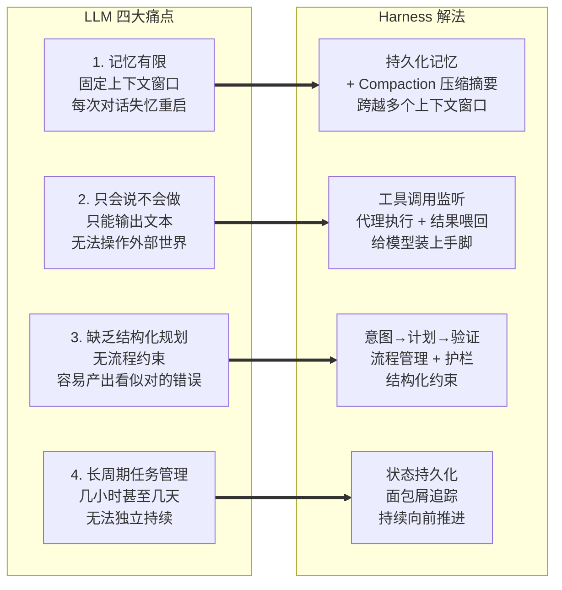
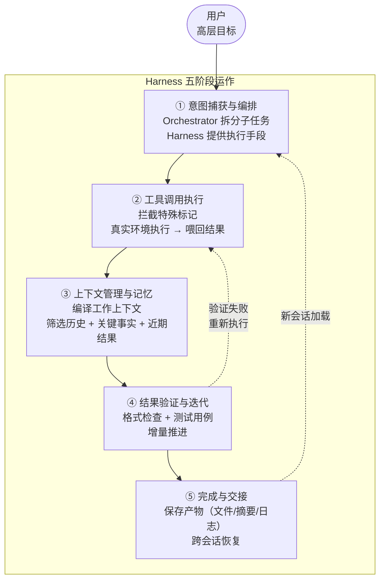
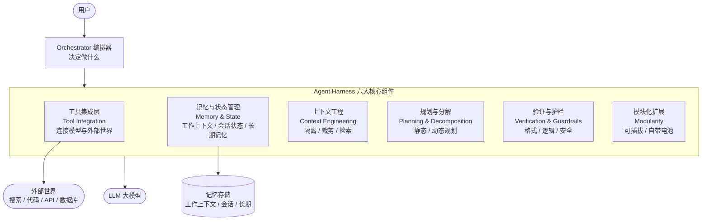
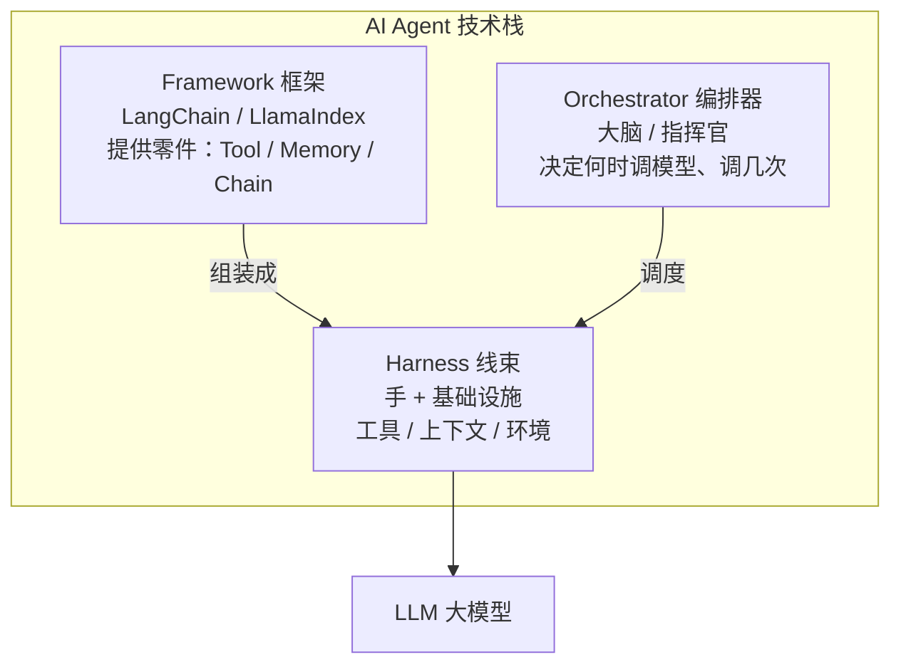

# 概述

1. Harness 原意是"马具、线束"，在软件工程中通常指"测试线束"（test harness） - 一组用于**运行和监控程序**的**脚手架代码**
2. 在 AI Agent 语境下，Harness 指的是**包裹在基础模型（LLM）外层**的一整套**运行时基础设施**，它不是模型本身，而是让模型能够"干活"的那套框架

> 核心组成

| 组件          | 作用                                                        |
| ------------- | ----------------------------------------------------------- |
| Tool Calling  | 让 Agent 调用**外部工具**（搜索、代码执行、API 调用等）     |
| Memory Store  | **短期/长期记忆**，让 Agent **跨轮次保留上下文**            |
| Orchestration | 编排**多步推理流程**（**ReAct**、**Plan-then-Execute** 等） |
| Guardrails    | 安全护栏、输出校验、权限控制                                |
| Observability | 日志、追踪、监控 Agent 的决策过程                           |

<!-- more -->

> 单独的 **LLM** 只是一个 **text-in / text-out** 的函数，**Harness** 把它变成了一个能

| Harness 赋能 LLM | 描述                             |
| ---------------- | -------------------------------- |
| 感知环境         | 通过工具**获取实时信息**         |
| 持久记忆         | 不局限于**单次对话**的上下文窗口 |
| 自主决策         | 多步规划、条件分支、错误重试     |
| 安全可控         | 在边界内行动，输出可审计         |

1. 可以把 **LLM** 想象成**发动机**，**Harness** 就是**整辆汽车** - 底盘、方向盘、仪表盘、刹车缺一不可
2. 当前典型的 Harness 实现包括
   - LangChain/LangGraph
   - CrewAI
   - AutoGen
   - OpenAI Agents SDK
   - Anthropic Claude Agent SDK
   - DeerFlow
3. MCP（Model Context Protocol）则是**标准化工具接入**的一种协议层，也是 Harness 生态的一部分

# Harness 框架对比

## 架构模型

| 框架                           | 核心抽象                          | 编排模型                                                     | 状态管理                                                    |
| ------------------------------ | --------------------------------- | ------------------------------------------------------------ | ----------------------------------------------------------- |
| **LangGraph**                  | 有向图（节点+边+条件路由）        | 显式图结构，确定性控制流                                     | 内置 **checkpoint**，可持久化到 Redis/PG                    |
| ~~CrewAI~~                     | 角色团队（Agent=角色，Task=任务） | 声明式任务编排，顺序/并行                                    | 隐式传递，缺乏显式状态管理                                  |
| ~~AutoGen~~                    | 多智能体对话（消息交换协议）      | 对话式自由路由，任意 Agent 互发消息                          | 对话历史即状态，无结构化持久化                              |
| ~~OpenAI Agents SDK~~          | 原生 Tool Calling + Handoff       | 基于 OpenAI Responses API 的编排                             | 依赖 OpenAI 平台状态管理                                    |
| **Anthropic Claude Agent SDK** | 单 Agent + 工具循环               | **ReAct** 循环（思考→行动→观察）                             | **本地文件系统**持久化（如 Claude Code 的 memory）          |
| **DeerFlow 2.0**               | SuperAgent + 子 Agent 层级        | **Lead Agent 分解任务，子 Agent 并行执行，基于 LangGraph 构建** | **跨会话长期记忆** + **文件系统** + **子 Agent 隔离上下文** |

## 关键工程差异

### LangGraph

> 最大**控制力**，最陡**学习曲线**

1. 你需要用**图思维**（nodes/edges/state reducers）来构建一切
2. **复杂条件分支**是强项：根据工具返回结果**动态**路由、重试、升级
3. **生产部署**必须配置**持久化 checkpoint store**，否则**进程崩溃**丢失所有状态
4. **并行执行**需要**手动**实现 **fan-out/fan-in**
5. 适合：有**复杂分支逻辑**、需要**确定性执行路径**的**生产级工作流**

### ~~CrewAI~~

> 最快原型，**上限最低**

1. 用"**角色+任务**"的心智模型，2 小时就能跑起 3 Agent 流水线
2. 但**自定义验证逻辑**要和框架**对抗**而非配合 - LangGraph 4 小时的事，CrewAI 要 2 天
3. **长任务** 12 步以上**完成率**从 84% **暴跌**到 61%（**无上下文压缩机制**）
4. 适合：**快速验证概念**、**角色边界清晰**的任务

### ~~AutoGen~~

> **研究灵活性**最强

1. Agent 间**自由对话**，<u>无需预设流程</u>，适合"不知道下一步该干啥"的**研究型任务**
2. **Human-in-the-loop** 是**一等公民**（HumanProxyAgent）
3. 代价：**确定性差**，Agent 可能陷入**消息死循环**，需<u>自建终止条件和循环检测</u>
4. 适合：**探索性研究**、人工审核节点多的工作流

### ~~OpenAI Agents SDK~~

> 最紧密集成，**零可移植性**

1. **Handoff 原语**设计优秀：不仅指定"交给谁"，还定义传什么**上下文**、做什么**校验**、失败怎么**回退**
2. **原生结构化输出**消除了 **schema 验证失败**的一大类问题
3. 但只能用 **OpenAI 模型**（GPT-4o/o3 等），换 <u>Claude/Gemini</u> 基本不可行
4. 适合：**全栈 OpenAI 生态**、对**结构化输出**要求严格的场景

### Anthropic Claude Agent SDK

> **单 Agent 深度执行**

1. 不走**多 Agent 协作**路线，而是**一个 Agent + 工具循环**的**深度执行**模型
2. **ReAct 模式**：<u>Think → Act → Observe</u> 循环，强调"**思考过程可见**"
3. **工具扩展**通过 **MCP**（Model Context Protocol）<u>标准化接入</u>
4. **持久化**走**本地文件系统**（如 **.claude/** 目录），不走远程服务
5. 典型体现：**Claude Code** 本身就是这个 SDK 的产物 - 一个能在**终端**里<u>读写文件</u>、<u>执行命令</u>的 Agent
6. 适合：**单 Agent 深度任务**（编码、文件操作）、**MCP** 工具生态

### DeerFlow 2.0

> **最完整**的"**开箱即用**" Harness

1. 底层基于 **LangGraph + LangChain** 重建（2.0 是**完全重写**，与 1.x 无关）
2. 核心差异化：给了 Agent 一台**真正的电脑**
   - **Docker 沙箱**隔离<u>执行环境</u> + <u>完整文件系统</u>
   - **Agent 直接执行 shell 命令**，不是"建议你运行"而是自己跑
   - **子 Agent 并行执行**，各自**隔离上下文**，结果**汇总**结合成最终产出
3. 内置能力最丰富：**技能系统（SKILL.md）**、**长期记忆**、**MCP Server**、**IM 通道**（飞书/Slack/Telegram）
4. **模型无关**（OpenAI/Claude/DeepSeek/Ollama 都行）
5. 适合：需要**端到端自动化执行**的<u>研究</u>、<u>编码</u>、<u>内容生成</u>任务

## 技术选型

> 没有框架是**生产就绪**的 - 它们都是**地板**，不是天花板，真正决定**完成率**的是你在上面搭的 Harness 层：**验证循环**、**重试逻辑**、**上下文管理**、**可观测性**。

| 选择逻辑                   | Harness 框架         |
| -------------------------- | -------------------- |
| **控制力**                 | **LangGraph**        |
| 快出原型                   | CrewAI               |
| 研究灵活性                 | AutoGen              |
| 全押 OpenAI                | OpenAI Agents SDK    |
| **单 Agent 深度执行**      | **Claude Agent SDK** |
| **开箱即用的完整 Harness** | **DeerFlow 2.0**     |

# Claude Code

| 通用 Harness  | Claude Code                | 说明                                                       |
| ------------- | -------------------------- | ---------------------------------------------------------- |
| Tool Calling  | Tools（含 **Agent Tool**） | **子 Agent** 是 **Tool** 的一种，不是 <u>Orchestration</u> |
| Memory Store  | **Context + Memory**       | 拆成**短期/长期**两个一等组件                              |
| Orchestration | 无对应组件                 | **单 Agent ReAct 循环**，不需要编排层                      |
| Guardrails    | **Permissions + Hooks**    | 权限边界 + 自动化约束                                      |
| Observability | 不显式列出                 | <u>Hooks</u> + **本地日志**隐式解决                        |

# 编排 vs 委派

> Claude Code 的子 Agent 不是编排 - 把这个子任务**外包**出去，结果拿回来我自己继续 - 本质上是一次 Tools 调用

```
  关键区别：Orchestration vs 委托执行

  通用 Harness 的 Orchestration（一等组件）
  ┌────────────────────────────────────────┐
  │  编排层是系统的核心骨架                   │
  │                                        │
  │  Agent A ←→ Agent B ←→ Agent C        │
  │     ↑           ↑           ↑          │
  │     └───── 编排层统一调度 ─────┘        │
  │                                        │
  │  谁先执行、谁后执行、并行还是串行、       │
  │  怎么传递上下文、失败了怎么重试           │
  │  ——这些是编排层定义的                    │
  └────────────────────────────────────────┘

  Claude Code 的子 Agent（一种 Tool）
  ┌────────────────────────────────────────┐
  │  主 Agent（ReAct 循环）                  │
  │    │                                   │
  │    ├── Tool: Read                      │
  │    ├── Tool: Edit                      │
  │    ├── Tool: Agent ← 这只是一个 Tool    │
  │    │     └── 子 Agent 执行完返回结果     │
  │    │         结果回到主 Agent 的上下文中  │
  │    ├── Tool: Bash                      │
  │    └── ...                             │
  └────────────────────────────────────────┘
```

> 本质区别

|            | 通用 Orchestration                            | Claude Code 子 Agent                      |
| ---------- | --------------------------------------------- | ----------------------------------------- |
| 定位       | 系统的**核心骨架**                            | 一种 **Tool**                             |
| Agent 关系 | 多个 Agent **对等**协作                       | 主 Agent **委托**，子 Agent 返回结果      |
| 生命周期   | Agent 可以**长期运行**、互相通信              | 子 Agent 随 **Task** 创建，完成后**销毁** |
| 上下文     | 各 Agent 有**独立上下文**，**编排层**管理传递 | 子 Agent **结果汇总**回主 Agent 上下文    |
| 决策权     | **编排层**决定下一步谁执行                    | 主 Agent 自己决定是否调用子 Agent         |

# 什么是 Agent Harness？

> 一句话概述

Agent Harness 是包裹在 **LLM** 外面的那一整套**软件基础设施** - 模型本身之外的"所有东西"

> 核心类比

1. 把 **LLM** 比作**引擎**，**Agent Harness** 就是**整辆汽车**（方向盘、变速箱、底盘、仪表盘）
2. 引擎提供**动力**，但真正能让车跑起来、转弯、刹车的，是**周围的系统**

> Harness 具体做什么 - 管理 **context**（上下文）的**完整生命周期**

| 阶段                  | 说明                              |
| --------------------- | --------------------------------- |
| <u>Intent Capture</u> | 捕获**用户意图**                  |
| <u>Specification</u>  | 将**意图**转化为**具体规格/指令** |
| <u>Compilation</u>    | **编译**成**可执行的步骤**        |
| <u>Execution</u>      | **调用工具**、执行操作            |
| <u>Verification</u>   | 验证**执行结果**是否正确          |
| <u>Persistence</u>    | **持久化**记忆和信息              |

> 为什么重要

| 产品形态       | 组成                                                    |
| -------------- | ------------------------------------------------------- |
| 早期 ChatGPT   | LLM + 聊天界面（简单）                                  |
| 现在的 AI 助手 | LLM + **Orchestrator**（编排器）+ **Harness**（工具架） |

1. **Orchestrator** - 控制**多步推理流程**（比如 <u>chain-of-thought</u>、<u>plan-execute</u>）
2. **Harness** - 让模型能**调用工具**、**管理文件**、**维护长对话记忆**

> 关键洞察

1. AI 助手的实际效果，往往取决于 **Harness 的质量**，而非**模型本身**的**参数大小**
2. 一个**普通模型**配上**优秀的 Harness**，可能比一个**强大的裸模型**表现更好

> Chain-of-Thought vs Plan-Execute - 可搭配使用

Plan 阶段：用 CoT 来拆解出好的计划 + Execute 阶段：每个 step 内部也可以用 CoT 来推理

|        | Chain-of-Thought                                     | Plan-Execute                                   |
| ------ | ---------------------------------------------------- | ---------------------------------------------- |
| 思想   | **边想边做**，逐步推理，每一步的输出作为下一步的输入 | **先规划再执行**，先拆解出完整计划，再逐步执行 |
| 本质   | **推理**策略                                         | **编排**模式                                   |
| 重点   | 怎么**想**                                           | 怎么**做**                                     |
| 结构   | **线性链式**                                         | 两阶段：**规划-执行**                          |
| 可回溯 | 不行，走到底                                         | 可以，重新规划                                 |
| 适用   | 数学、逻辑推理                                       | 多工具协作、复杂任务                           |

# 为什么 AI 需要 Harness？

1. LLM 从"**问答玩具**"进化到"**干活工具**"的过程中，**裸模型**搞不定了
2. **Harness** 解决的就是 **LLM** 先天不具备的那些"**胶水**"问题 - **记忆**、**工具调用**、**流程编排**、**长任务管理**
3. **LLM** 负责"**聪明**"，**Harness** 负责"**能干**"

| 阶段 | 模式                               | 需求         |
| ---- | ---------------------------------- | ------------ |
| 早期 | 一问一答                           | 裸 LLM 足够  |
| 现在 | **持久化**、**多工具**、**多步骤** | 需要 Harness |

## 痛点 1 - 记忆有限

> Limited Memory

1. 痛点描述：LLM 有**固定的上下文窗口**，每次对话都是"失忆重启"
2. Harness 解法
   - **持久化记忆** - 跨 Session 保存上下文
   - **Compaction**（压缩/摘要） - 比如 Claude Agent SDK 会把过去的对话浓缩，让长任务能**跨越多个上下文窗口**继续推进

## 痛点 2 - 只会"说"不会"做"

> Tool Use

1. 痛点描述：LLM 只能**输出文本**，但实际任务需要：搜索网页、执行代码、查数据库、生成图片……
2. Harness 解法
   - **监听**模型的**输出**，识别出"**工具调用**"指令
   - **代替模型**去**执行**这些操作，把结果喂回去
   - 相当于给模型装上了"手和眼睛"

## 痛点 3 - 缺乏结构化规划

> Structured Workflows

1. 痛点描述：**复杂**任务需要<u>拆解、规划、验证</u>，没有**结构约束**，AI 容易产出"**看起来对但实际经不起推敲**"的结果
2. Harness 解法
   - **捕获用户意图 → 制定计划 → 设定验收标准 → 逐步执行并验证**
   - 本质上就是给 AI 加了**流程管理**和**护栏**

## 痛点 4 - 长周期任务管理

> Long-horizon Tasks

1. 痛点描述
   - 一个任务可能跑**几小时**甚至**几天**
   - Anthropic 的工程博客指出：即使是**最强的编码模型**，如果没有**外部系统**来初始化项目、追踪进度、留下产物（日志、代码），也**无法独立构建大型应用**
2. Harness 解法
   - 维护**状态**和**连续性**
   - **每次会话**留下"**面包屑**"，下次**接着干**
   - 确保 Agent **持续向前推进**，而不是原地打转



# Agent Harness 工作原理

> Harness 本质上是 **用户**、**AI 模型**、**外部工具/环境**之间的**中间层**，**拦截并增强**它们之间的通信

## 核心要点

1. Harness 不修改**模型权重**，纯粹是**模型外围**的**软件架构**
2. Harness 能把一个**预训练模型**的**问题解决能力**显著提升 - 靠的是正确的**支撑结构**，而非**重新训练**
3. Harness 是 LLM 的"外骨骼" - **LLM** 提供**智能**，**Harness** 提供行**动力**、**记忆**和**纪律**



## 五阶段运作

1. **意图捕获与编排**（Intent Capture & Orchestration）
   - **用户**提出**高层目标** → **编排器**（Orchestrator）拆分为**子任务** → **Harness** 为每个子任务提供**执行手段**（上下文、工具）
   - **编排器**决定**"做什么"**，**Harness** 负责**"怎么做"**
2. **工具调用执行**（Tool Call Execution）
   - 模型输出**特殊标记**（如 search("xxx") 或 python(code)）→ **Harness 拦截识别** → 暂停文本生成 → 在**真实环境**执行操作 → 把结果"**喂回**"模型上下文
   - **Harness** 充当模型的 **代理代理人**，把**意图**变成**行动**，再把观察结果返回
3. **上下文管理与记忆**（Context Management & Memory）
   - Harness 维护一个 **持久任务日志**，与模型的**瞬时 prompt** 分离
   - 每次**调用模型前**，Harness **编译工作上下文**：<u>筛选相关历史</u> + <u>关键事实</u> + <u>近期结果</u>，对**过时信息**做<u>摘要</u>或<u>裁剪</u>（context compaction）
4. **结果验证与迭代**（Result Verification & Iteration）
   - 检查**输出格式**是否**符合预期**
   - 对代码运行**测试用例**
   - **发现问题**时在**下一轮**提示模型修复
   -  鼓励 **增量推进**：一个子任务完成 → **保存状态** → 再做下一个
   - 典型循环：**写代码 → 跑测试 → 修错误**，全程无需人工干预
5. **完成与交接**（Completion & Handoff）
   - **任务结束**或**会话超时**后，Harness **保存所有产物**（<u>文件</u>、<u>摘要</u>、<u>进度日志</u>）
   - 下次**启动新实例时加载**这些文件，项目本身就拥有了**记忆**，即使 **LLM** 本身**无状态**

# Agent Harness 核心组件

Harness 是一个 **高度模块化**的**智能中间件框架**，把**工具调用**、**记忆管理**、**上下文工程**、**规划分解**、**验证护栏**全部封装好，让 **LLM** 从"<u>只会说</u>"变成"<u>能干活</u>"



## 工具集成层

> Tool Integration Layer

1. Harness 的心脏 - 连接**模型**与**外部世界** - 支持 Web 搜索、数据库查询、计算器、代码执行环境、图像生成等
2. Harness 定义了**模型请求工具**的 **协议**（特殊格式输出或函数调用语法），负责**执行**并把结果**喂回**
3. **现代 Harness** 通常**自带默认工具包**（<u>文件读写</u>、<u>Web 搜索</u>、<u>代码解释器</u>），**开箱即用**
   - 例如 **LangChain** 的 **DeepAgents** 甚至内置**虚拟文件系统**

## 记忆与状态管理

> Memory & State Management

 突破**单次上下文窗口**的限制，分 **三层记忆**：

| 层级       | 生命周期                             | 用途             |
| ---------- | ------------------------------------ | ---------------- |
| 工作上下文 | 单次调用的 prompt，**瞬时**          | 模型当前看到的   |
| 会话状态   | 单个任务期间，持久但**任务结束重置** | 本次任务做了什么 |
| 长期记忆   | 跨任务/跨时间，**永久**              | 知识库或向量存储 |

**老交互**会被 **蒸馏摘要**，相关事实**按需检索** - 类似人扫一眼笔记再继续工作

## 上下文工程与 Prompt 管理

> Context Engineering - 核心能力是决定**每次调用**模型时 **包含什么**、**排除什么**

1. **上下文隔离** - 不同**子任务**的上下文互不干扰
2. **上下文裁剪** - 压缩/丢弃无关信息，防止 **context rot**
3. **上下文检索** - 在**正确时机**注入**新鲜信息**（文档、搜索结果）
4. 可集成 **RAG** 动态检索文档
5. **首次运行**与**后续运行**使用 **不同的 prompt 策略**（Anthropic 的实践）

## 规划与分解

> Planning & Decomposition - 防止模型"**一次性搞定所有事**"然后**失败**，有两种模式

| 模式     | 描述                                   |
| -------- | -------------------------------------- |
| 静态规划 | **预定义**步骤序列（窄领域）           |
| 动态规划 | 让**模型先出计划**，Harness 再逐步执行 |

1. Anthropic 的做法：**初始化 Agent（设置项目结构 + 任务清单）**→ **编码 Agent（逐个实现功能）**
2. Harness 通过 **prompt 设计**和**任务勾选**来 **强制增量推进**。

## 验证与护栏

> Verification & Guardrails

| 检查方式   | 描述                               |
| ---------- | ---------------------------------- |
| 格式验证   | 输出能否被解析、是否满足要求的格式 |
| 逻辑检查   | 方案是否真的解决问题、测试是否通过 |
| 安全过滤   | 阻止违规操作或内容                 |
| 编码 Agent | 跑单元测试，通过才继续             |
| 研究助手   | 验证引用的来源是否真的支撑论点     |

加更**多 Agent**（如单独的"QA Agent"）可能**适得其反** - 更好的做法是让 **Harness 引导主 Agent** 自己做**质量保证**，只在必要时**升级**或**重置**

## 模块化与可扩展性

> Modularity & Extensibility

1. 现代 Harness 是 **可插拔**的**模块化框架**
2. 每个模块可独立**启用/禁用/替换**，<u>自带电池</u>（batteries included） - 默认提供**常见能力**（视觉、代码执行、Web 访问等），开发者可**按需精炼或替换**

```
  Harness
  ├── 感知模块（Perception）   — 视觉→文本转换
  ├── 记忆模块（Memory）       — 轨迹存储与反思
  ├── 推理模块（Reasoning）    — 整合决策
  ├── 工具模块（Tools）        — 可按需开关
  └── ...
```

# Agent Harness 真实案例

同一个模型，有没有 Harness，效果天壤之别 - **模型**决定**能力上限**，**Harness** 决定**实际发挥**

## Anthropic Claude Agent SDK

>  Anthropic 官方称 Claude Agent SDK 为 "**通用 Agent Harness**"，擅长**编码**和**工具使用**任务，核心能力如下

1. 内置 **上下文管理**（自动**压缩**对话历史）
2. 内置 **工具调用** 能力
3. **初始化器 / 编码 Agent** 模式：在超出上下文窗口的**长项目**中保持**连贯性**
4. 典型功能：<u>写代码并执行</u>、<u>搜索知识库</u>、维护 <u>claude-progress.txt</u> 进度日志用于<u>跨会话交接</u>
5. 关键报告：Effective harnesses for long-running agents，描述了如何让 Claude 在**超长任务**中持续工作

## LangChain DeepAgents

> LangChain 生态的三层架构

| 层架                  | 描述                                                         |
| --------------------- | ------------------------------------------------------------ |
| LangChain（抽象层）   | 提供 Agent、Tool、Memory 等**基础抽象**                      |
| LangGraph（运行时）   | 处理**执行**和**持久化**                                     |
| DeepAgents（Harness） | 自带**默认 prompt**、**工具处理**、**规划**、**文件系统访问**等 |

1. **DeepAgents** 定位为 Claude Code 的通用版本 - **开箱即用的完整 Harness**，开发者不需要**从零组装**
2. DeepAgents 不是一个新模型，也不是简单的 SDK，而是 包裹模型的**完整 Agent 系统**

# 概览澄清

> **Framework** 提供**零件**，**Orchestrator** 提供**大脑**，**Harness** 提供**双手**和**基础设施**，三者协作才构成**完整的 AI Agent 系统**



| 概念                   | 角色           | 类比         | 关注点                                  |
| ---------------------- | -------------- | ------------ | --------------------------------------- |
| Framework（框架）      | 构建积木       | 乐高零件库   | 提供**抽象**（Tool、Memory、Chain）     |
| Harness（线束）        | **完整运行时** | 组装好的机器 | 能力 + 副作用（**工具、上下文、环境**） |
| Orchestrator（编排器） | 控制逻辑       | 大脑/指挥官  | 何时调模型、调几次、逻辑流              |

## Framework → Harness 的关系

1. Framework 是**零件**（**LangChain**、LlamaIndex） - 提供 Tool、Memory、Chain 等抽象
2. Harness 是**成品** - 用零件组装出的**完整运行系统**，自带主张性**默认配置**
3. 实际关系：**Harness 构建在 Framework 之上**（<u>DeepAgents Harness</u> 用 <u>LangChain</u> 作为<u>底层</u>）

```
  Framework（零件）
      ↓ 组装
  Harness（整机，开箱即用）
```

## Orchestrator vs Harness

1. **Orchestrator = 大脑**
   - 决定 **何时调模型**、**用什么 prompt、循环几次**
   - 实现**推理循环**（<u>ReAct</u>、<u>Tree-of-Thought</u>），**解析思维链**，决定下一步
   - 关注 **逻辑与控制流**
2. **Harness = 手 + 基础设施**
   - 确保模型被调用时 **有工具可用**、**有上下文**、**有环境**
   - 关注 **能力与副作用**

> 协作方式

```
  Orchestrator："用这个 prompt 调一次模型" / "再循环一步"
       ↓
  Harness：确保模型被调用时有工具、上下文、环境
```

## 容易混淆的旧概念

> **现代AI语境**下，除非明确说 "test" 或 "evaluation"，"harness" 默认指 **Agent Harness** - 我们讨论的这种**运行时系统**

| 旧概念                                | 描述                                                   |
| ------------------------------------- | ------------------------------------------------------ |
| <u>Test Harness</u>（测试线束）       | 软件工程老术语，**自动提供输入并检查输出**             |
| <u>Evaluation Harness</u>（评估线束） | 如 EleutherAI 的 LM Evaluation Harness，跑**基准测试** |

# Harness 核心收益

> **Harness 工程**正在变得和**模型工程**一样重要 - **模型决定能力上限**，**Harness 决定实际发挥**

1. Harness 决定了 AI 产品的成败
2. 两个产品用同一个 LLM，**Harness 更好**的那个用户体验会远超另一个
3. 这就是为什么 Anthropic、OpenAI 等都在重金投入 **Harness 工程**，开源社区也在涌现各种 **Harness 项目**

## 更高的任务成功率

> Higher Task Success Rates - Harness 补偿模型的弱点 - **缺乏持久性、无法使用外部知识、容易犯错** - Harness 让模型 做到原本做不到的事

| 场景     | 无 Harness         | 有 Harness                              |
| -------- | ------------------ | --------------------------------------- |
| 策略游戏 | 缺少记忆和感知     | 加入 Memory + Perception 模块，胜率提升 |
| 编程任务 | 遇到运行时错误就挂 | 跑代码 → 调试 → 修复，循环推            |

## 长任务的一致性

> Consistency on Long Tasks

1. **无 Harness** - 上下文中断后 → 要么放弃，要么无脑重复之前的工作
2. **有 Harness** - **存储状态 + 强制增量推进** → 即使新开上下文，也能**快速加载并恢复**

## 更好的资源利用

> Better Use of Resources

1. **结构化工具调用和上下文** → 减少浪费的 **token** 和不必要的**模型调用**
2. 把**部分推理**移到**模型外部**（<u>知识图谱</u>、<u>数据库</u>存事实）→ <u>prompt token</u> 可减少 **10-100** 倍 - 模型只拿到**精准信息**，而非大段文本
3. **快速取消/纠正错误路径（通过验证）**→ 避免模型在错误方向上浪费大量 token

## 无需重训即可扩展能力

> Enhanced Capabilities - 这是**巨大的灵活性优势**，组织可以用**同一个预训练模型**，定制化满足不同需求

1. 可能是最大的收益
   - 想让 LLM 处理图像？    → 加视觉模块 / 图像描述 **API**
   - 想让 LLM 做数学/逻辑？ → 加 Python 执行工具（如 **OpenAI Code Interpreter**）
2. 过去：需要**训练专用模型或微调**
3. 现在：**一个通用模型 + Harness 适配器 = 完成各种任务**

## 提升可靠性与安全性

> Improved Reliability & Safety - **Harness 层的护栏**比把**所有规则**塞进**模型 prompt** 更好管理

1. **过滤**不安全操作或违规内容
2. **强制流程**：回答必须引用来源、不可逆操作前必须用户确认
3. **可独立更新** - 新的最佳实践出现时，**改 Harness** 而非重新训练模型

# Agent Harness 常见问题

> Q1：Harness = Prompt Engineering 吗？

1. 不等于，**Prompt Engineering 是 Harness 的一部分**
   - Prompt Engineering 是 **技巧**（写好 prompt 让模型输出更好）
   - Harness 是**架构**（prompt + 工具执行 + 结果处理 + 记忆管理 + 完整循环）
2. **Prompt Engineering 是 Harness 会用到的一种技术，Harness 是更大的系统**

> Q2：用 LLM 一定需要 Harness 吗？ - 取决于任务复杂度

| 场景                                         | 是否需要 Harness                 |
| -------------------------------------------- | -------------------------------- |
| 一次性问答、文本生成                         | 不需要，模型 + prompt 就够       |
| 使用**外部数据**、**多步推理**、**长期记忆** | **必须**，哪怕是最小化的 Harness |

> Q3：Harness 工程和传统软件工程有啥区别？ - Harness 工程是一门**全新学科**，最佳实践还在**实时摸索**中

1. 共同点：模块化设计、状态管理、I/O 处理、测试……
2. 核心区别：围绕一个**不确定的 AI 核心**在编程
   - 模型可能说出/做出**意料之外**的事 → **Harness 要 优雅地处理**
   - 传统软件没有的问题：**token 限制**、**幻觉**、**prompt 设计**
   - 本质是 **后端工程** + **UX 设计（AI 交互）**+ **ML 知识** 的融合

> Q4：多个模型能共享同一个 Harness 吗？ - Harness 保护工程投入 - 支持**换模型不换架构**

1. 能，**解耦 Harness 和模型**是核心优势
2. **换模型**：从 GPT-4 换成更好的新模型，Harness 的**记忆**、**工具**、**结构**<u>全部复用</u>
3. **多模型并行**：简单任务用小模型，复杂步骤用大模型 → Harness 做路由（**Model Routing**）
4. Harness 本质上是 **模型无关**的（只需调整 **prompt 格式**和**工具调用**语法）

> Q5：Harness 只适用于文本 LLM 吗？

1. 远不止，从 LLM 起步，但适用于 **任何按序操作的 AI Agent**
2. 通用原则：强大的 AI 大脑需要身体和工具 - Harness 就是用软件构建这个身体的方式
