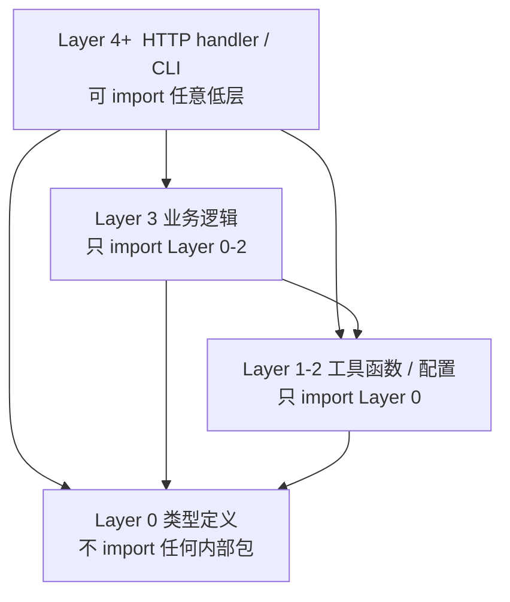
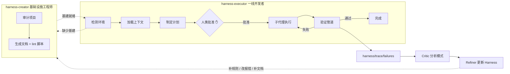
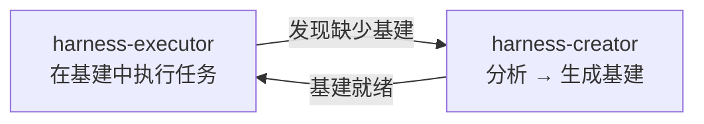
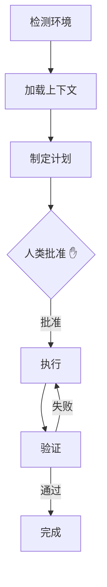
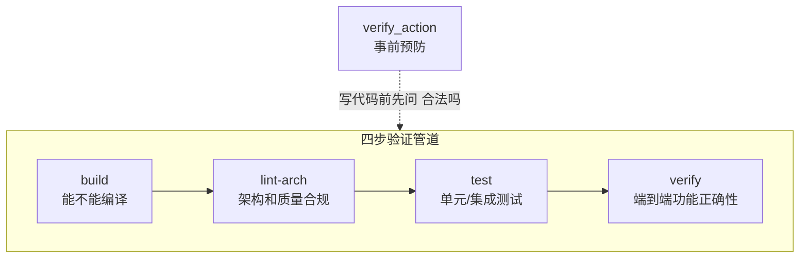
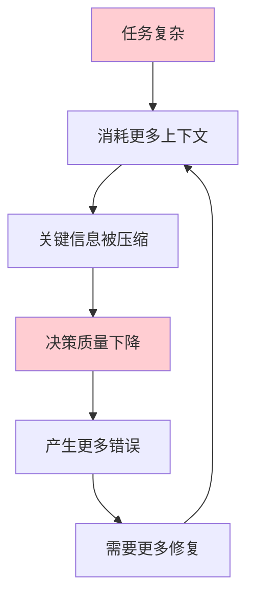
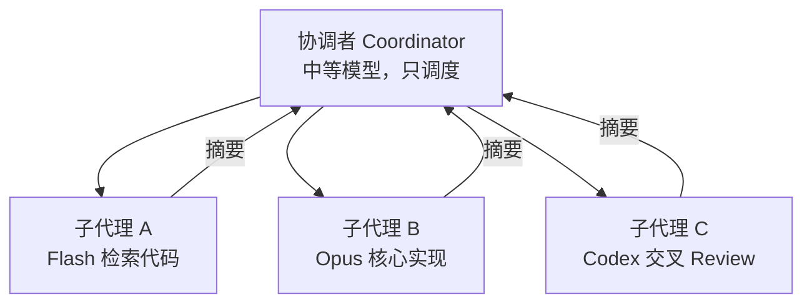
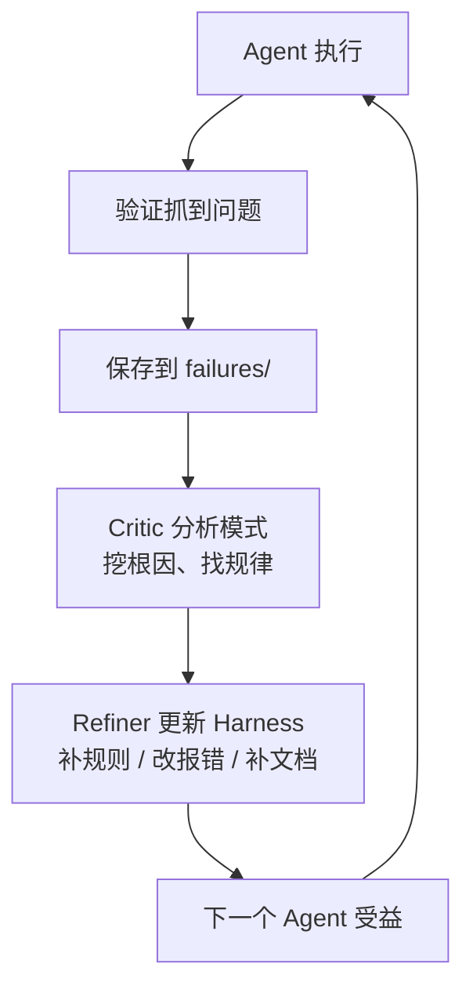
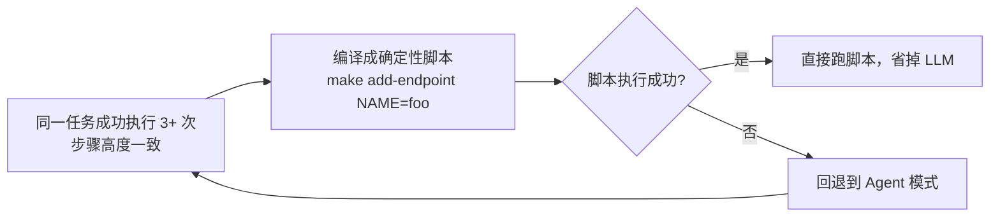
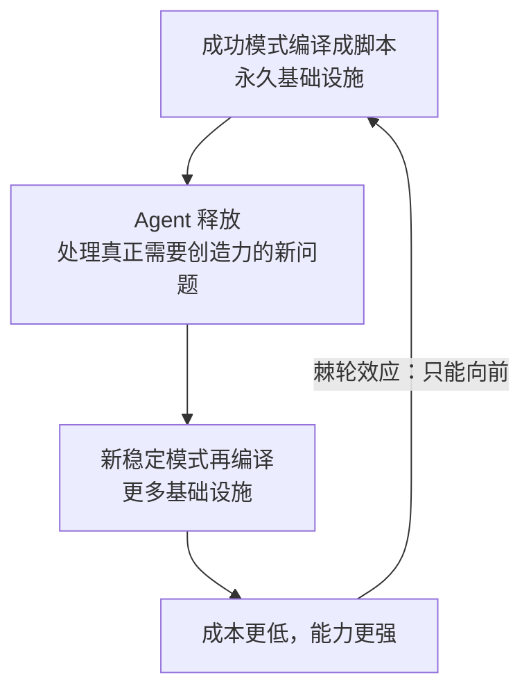

# 背景

> 不是让 Agent 更聪明，而是让**错误不可发生**

1. 现象
   - Agent 写代码违反**隐式架构规则**，lint 失败后陷入**修复循环**，上下文窗口被**塞满**，最终**偏离目标**
2. 根因 - **Agent "看不见"**
   - "**教得更好**"（更长 prompt、更多示例、规范文档）有**天花板**
     - 规则随代码演进、文档在 **AI 不可达**的地方、不同模型"常识"不一致
3. 解法转向
   - Harness 工程的核心思路：从"**教 Agent 怎么做**"转向"**让 Agent 自己验证做得对不对**"
   - 靠 linter、测试、架构约束等**机械化检查**保证**正确性**，而非依赖 LLM 的"直觉"
   - 本质是把 **CI/CD 的拦截时机**从合并前提前到**写代码**时

<!-- more -->

# 仓库是 Agent 的操作系统

1. 把**散落的知识**收进仓库
2. 精简为可**按需加载**的索引
3. 只编码**架构边界**而非实现细节
4. 人的角色从执行者变为**系统设计者**

## 类比

> **Harness = LLM 的操作系统**，不是增强它的算力，而是给它一个可以**可靠运行的环境**

| CPU                            | LLM                             |
| ------------------------------ | ------------------------------- |
| 计算能力极强                   | 推理能力极强                    |
| 不知道硬盘在哪、网络协议是什么 | 不知道分层规则、文件该放哪      |
| 需要 OS 来管理资源、提供抽象   | 需要 Harness 来提供约束和上下文 |

## 原则

### 仓库即唯一事实来源

1. 问题的本质是**知识不对称**
2. 人类团队的架构决策散落在 Aone、钉钉、架构师的脑子里
3. **Agent 只能看见仓库** - 不在仓库里的东西对它等于不存在
4. 做法：把**架构决策**、**层级约束**、**命名规范**全部**版本化**提交到 **Git**
   - **知识跟着代码走**，无论**新人**还是 **Agent**，clone 下来就拿到**完整上下文**

### 指令文件是地图，不是手册


1. 反直觉的点：**信息越多效果越差**
   - 500 行的 **AGENTS.md** 看似全面，实际害了 Agent
   - **挤占上下文窗口**，留给**实际任务**的空间变少，而且**大文件**容易**过时腐烂**
2. 正确做法是 **~100 行的索引 + 按需加载**
   - Agent 要改 auth 模块？先读索引找到路径，再加载对应文档，用不到的不加载
   - 这和 OS 的**懒加载**（lazy loading）思路一样 - 只把需要的页调入内存

```
  AGENTS.md (索引，~100行)
    └─ 指向 → docs/design-docs/auth.md (按需加载)
    └─ 指向 → docs/design-docs/api.md  (按需加载)
```

### 只管边界，不管内部

1. 这是最关键的**约束粒度设计**
   - Harness 不规定"用什么设计模式""函数怎么写" - 那是 Agent 的自主空间
2. 只管**依赖方向**
3. 规则极简
   - **高层可以依赖低层，反过来不行**
   - 边界之内**自由发挥**，边界之外**坚决拦截**
4. 这跟**管理大型平台团队**的逻辑一致 - **中心化**管**架构约束**，**本地自治**管**实现细节**

```
  Layer 4+  HTTP handler / CLI    → 可 import 任意低层
  Layer 3   业务逻辑               → 只 import Layer 0-2
  Layer 1-2 工具函数 / 配置        → 只 import Layer 0
  Layer 0   类型定义               → 不 import 任何内部包
```



### 人的角色转变

1. 以前：人写代码，AI 辅助补全
2. 现在：人设计系统（**架构 + 约束 + 验证**），<u>Agent 在系统内执行</u>
3. 人的价值从"拧每一颗螺丝"变成"**确保流水线是对的**"
   - 不需要比 Agent 更会写代码，需要比 Agent 更会**设计让它不出错的环境**

# 落地：从搭建到执行

1. creator 按**项目健康度**分级搭建基础设施（文档 + 脚本 + 状态管理）
2. executor 在这套环境中执行任务
   - 写代码前有**人类审批计划**，写完后有**脚本自动验证**，执行过程有**状态记录**可回溯
3. 整个体系把"**靠 Agent 聪明**"变成了"**靠系统可靠**"



## 两个引擎，一个闭环

> executor 启动时检查 AGENTS.md，没有就自动调 creator 来搭，搭完再继续 - **任何项目都能直接用 executor 起步**

```
  ┌─────────────────┐         ┌─────────────────┐
  │  harness-creator │         │ harness-executor │
  │  分析 → 生成基建  │◄──喊────│  在基建中执行任务  │
  └─────────────────┘         └─────────────────┘
```



1. **creator** - 基础设施工程师 - 审计项目、生成文档和 lint 脚本
2. **executor** - 一线开发者 - 在 creator 搭好的环境里干活

## creator 的分级策略

> 不是一刀切，而是根据项目现状分级处理

| 评分  | 状态             | 策略         |
| ----- | ---------------- | ------------ |
| 0-20  | 裸奔，什么都没有 | 从零搭建全套 |
| 21-70 | 有基础但有缺口   | 针对性补充   |
| 71+   | 健康             | 微调         |

## executor 的工作流

```
  检测环境 → 加载上下文 → 制定计划 → 人类批准 → 执行 → 验证 → 完成
                                      ↑
                                关键检查点
```



> "人类批准"不是**走过场** - executor 会生成一个**执行计划**文件 - 与 Claude Code 的 Plan Mode 非常类似，推理模型就是 **Plan-Execute**

1. **任务目标**
2. **影响范围**
3. **分阶段步骤**
4. **验证方式**
5. **回退策略**

> 这解决了一个真实痛点：**Agent 常常"悄悄干了一件错事"**

1. 有了执行计划，人能**在 Agent 动手前**就看到它打算怎么干，觉得不对**直接改方向**
2. 这比事后 **code review** 的**拦截时机**早得多

## 项目结构解读

> 整个结构分成三层，各有分工：

### 第一层：知识层（docs/）

```
  docs/
  ├── ARCHITECTURE.md      ← 架构边界，层级规则
  ├── DEVELOPMENT.md       ← 怎么构建、测试、lint
  ├── PRODUCT_SENSE.md     ← 业务上下文（为什么这样做）
  ├── design-docs/         ← 组件级细节，按需加载
  └── exec-plans/          ← 执行计划，active 和 completed 分开
  解决"Agent 看不见"的问题。但注意，这些都是按需加载的 - AGENTS.md 只有 ~100 行索引，细节文档只在需要时才读。
```

### 第二层：执法层（scripts/）

```
  scripts/
  ├── lint-deps.*          ← 检查层级依赖方向（Layer 规则）
  ├── lint-quality.*       ← 检查代码质量
  ├── verify/              ← 端到端功能验证
  └── validate.py          ← 统一验证管道（一键跑所有检查）
  这是核心。把"希望被遵守"变成"不遵守就报错"。前面说的"让 Agent 自己验证做得对不对"，就靠这些脚本落地。Agent 写完代码跑 validate.py，不通过就不能往下走。
```

###   第三层：状态层（harness/）

```
  harness/
  ├── tasks/               ← 任务状态和检查点（断点续传）
  ├── trace/               ← 执行轨迹和失败记录（可回溯）
  └── memory/              ← 经验教训存储（越用越聪明）
  这层解决的是跨会话连续性。没有它，每次开新会话 Agent 都从零开始；有了它，Agent 能知道"上次这个任务走到了哪""上次在这里踩过坑"。
```

# 在动手之前先问"能不能做"

1. Harness 最核心的落地机制 - **验证体系**
2. 回答三个问题：**怎么查**、**怎么防**、**查挂了怎么办**
3. **事前用 verify_action 预防（代价低）**，**事后**用**四步管道验证**（**build → lint → test → verify**）
4. **报错信息**自带**修复指引**让 **Agent 自愈**，**同一错误**超 3 轮就停
5. **验证体系**的核心不是"**查得严**"，而是"**让错误尽可能早地、代价尽可能小地暴露**"

## 两类检查

> **规则**本身都是"**常识**"，但**常识不提醒就不会被遵守**，Agent 尤其如此

| 检查类型                 | 管什么   | 例子                                                   |
| ------------------------ | -------- | ------------------------------------------------------ |
| lint-deps（依赖方向）    | 架构边界 | core/ 不能 import ui/，api/ 和 cli/ 不能互引           |
| lint-quality（质量规范） | 编码纪律 | 单文件 ≤500 行，禁止 console.log，禁止硬编码品牌字符串 |

## 核心洞察：事前预防 >> 事后检查

> 类比：写代码前跑 verify_action，就像 **SQL** 执行前先 **EXPLAIN** - 代价极低，能避免灾难性后果

1. 传统流程
   - Agent 写 50 行代码 → 跑 lint → 发现层级违反 → 撤销、重设计 → 消耗 ~10 次 tool call
2. Harness 流程
   - Agent **写代码前**先问一句"合法吗" → 两次交互搞定

```
  # 问一句就能避免后面 10 次来回
  python3 scripts/verify_action.py --action "import internal/core from internal/handler"
  # ✗ INVALID: internal/handler (L4) cannot import internal/core (L3)
```

> 触发条件

1. 不是每个操作都**预验证**（<u>改函数体</u>、<u>加测试</u>不需要）
2. 只在**创建新文件**或**添加跨包 import** 时才验证 - 因为**层级违反**是 **Agent 翻车**的头号原因

## 报错信息就是教学

> 一条差的报错

```
  Forbidden import in core/types/user.go
  看完不知道怎么办
```

> 一条好的报错

```
  core/types/user.go imports core/config (Layer 0 → Layer 2).
  Layer 0 packages must have NO internal dependencies.
  Fix: Move config-dependent logic to a higher layer, or pass the config value as a parameter.
```

1. **什么规则违反了 → 为什么是问题 → 怎么修**，全在里面
2. **好的报错**让 **Agent 能自愈**，不需要人介入
3. 这是设计 linter 时的一个关键细节 - 不只是拦截，还要**教会 Agent 怎么修**

## 四步验证管道


```
  build → lint-arch → test → verify
   │        │         │       │
   │        │         │       └─ 端到端功能正确性
   │        │         └─ 单元/集成测试
   │        └─ 架构和质量合规
   └─ 能不能编译
```



1. 前三个（build / lint / test）是**常规**操作，重点在第四步 **verify**
2. **测试通过了 ≠ 功能是对的**
   - 测试可能**覆盖不全**，Agent 写的测试可能恰好**绕过了关键路径**
   - **verify** 是**项目级端到端验证**
   - 不是"函数返回值对不对"，而是"**用户执行这个操作，最终结果对不对**"
     - 比如一个 CLI 工具，verify 会**实际跑命令检查输出**；一个 Web API，会**发真实请求验证响应**
   - Harness 不鼓励直接跑 go build 或 go test，而是提供 **validate.py 统一入口**，因为**"验证通过"在每个项目里定义不同**，需要**标准化**

## verify skill 的思路

> 很多项目一开始没有端到端验证能力，Harness **引导**你创建 verify skill - 这让验证闭环从"**代码能跑**"提升到"**功能正确**"

1. 识别**核心用户路径**（如"创建用户 → 登录 → 查看资料"）
2. 每条路径**编码**成**可执行验证脚本**
3. creator 自动生成骨架放 **scripts/verify/**，你填**断言**逻辑

## 修复循环的边界

1. **验证失败 → Agent 自动分析错误 → 改代码 → 重跑验证**，一般 1-3 轮**收敛**
2. 但有个硬限制：**同一个错误**转 3 圈还没过，就停下来交给人
3. 不是 Agent 一定修不好，而是继续转下去**上下文窗口要爆** - 知道什么时候放手比硬撑更聪明

## 三条实操经验

1. **故意引入违规测试 lint** - 加一个跨层 import，如果 lint 没报错，说明护栏是纸糊的
2. **永远不要禁用 lint 规则来"解决"问题** - Agent 有时会想**绕过规则**（比如注释掉 lint 配置），应该**改代码**不是**改规则**
3. **测试不需要每次跑全量** - 只跑**受影响**的包，速度快很多

# 上下文是最贵的资源

> 协调者绝不写代码 - Harness 的**任务执行架构** - 怎么**组织 Agent 干活**才能在**有限上下文**下完成**复杂任务**

1. 协调者不写代码，**只做调度** - 每个**子代理**拿**干净上下文**、**精确 prompt**、**合适的模型**去干活，干完释放**只留摘要**
2. 复杂任务加 **worktree 隔离**和**交叉 review**
3. **分阶段存检查点**保证**可恢复**
4. 本质是用"**多个短生命周期的小任务**"替代"**一个无限膨胀的大任务**"，从根本上**规避上下文耗竭**

## 为什么协调者不能写代码

> 这是一个关于**上下文耗竭**的<u>正反馈陷阱</u>

```
  任务复杂 → 消耗更多上下文 → 关键信息被压缩 → 决策质量下降
      ↑                                          ↓
      └── 产生更多错误 → 需要更多修复 → 消耗更多上下文 ←┘
```



1. 到第 40 次 tool call，早期架构决策已被**压缩**；到第 60 次，可能**忘了最初的目标**
   - 你让它加用户认证，它在纠结一个不相关的 import 路径
2. 类比：这跟人类一样 - 你同时打开 50 个浏览器标签页，写着写着就忘了最初要查什么
   - 区别是人类会意识到自己乱了，Agent 不会，它会继续"**自信地犯错**"

## 解法：两层架构

```
  ┌─────────────────────────────────────────┐
  │          协调者（Coordinator）            │
  │  只管：规划 → 委派 → 汇总                │
  │  一行代码都不碰                          │
  └──────────┬──────────┬──────────┬────────┘
             │          │          │
       ┌─────▼──┐ ┌─────▼──┐ ┌─────▼──┐
       │子代理 A │ │子代理 B │ │子代理 C │
       │干净上下文│ │干净上下文│ │干净上下文│
       │干完释放  │ │干完释放  │ │干完释放  │
       └────────┘ └────────┘ └────────┘
```



1. 关键设计：**子代理**每次从**干净的上下文**开始
   - 它<u>不知道之前发生了什么</u>，但它的 **prompt** 里包含了它**需要知道的一切**
   - 干完后<u>详细上下文被丢掉</u>，**协调者只保留摘要**
2. 这跟操作系统**进程模型**一模一样 - 父进程不自己干活，fork 出子进程，子进程有独立的地址空间，干完把**结果**通过**管道**返回给父进程
   - 协调者就是 init，子代理就是 worker process


## "就改一行"的陷阱

> 最常见的违规方式：协调者发现一个**小问题**，心想"这么简单不用启子代理" → **一行改五处 → 五处变二十处 → 上下文耗尽**，判断规则如下

| 复杂度 | 判断标准                     | 执行方式             |
| ------ | ---------------------------- | -------------------- |
| 简单   | 一句话能描述，不含"和"字     | 直接做               |
| 中等   | 需要**清单**跟踪改了哪些地方 | 委派子代理           |
| 复杂   | 涉及**设计决策和权衡**       | 委派 + worktree 隔离 |

发现**协调者**在用 **Edit/Write** 工具**修改源代码** → **立刻停，启动子代理，没有例外**

## 模型选择：不是所有任务都需要最强模型

> 这是一个常被忽略的**成本杠杆**：

```
  重命名变量 → Haiku（快、便宜）
  检索相关代码 → Gemini Flash（速度第一）
  重构认证模块 → Opus / GPT-5.3 Codex（质量优先）
```

> 一个**中等复杂度**的功能，可能**同时调度**三四个不同模型：**总成本降 60-70%，质量不打折扣**，**协调者**本身用**中等模型**就行 - 它不写代码，只做调度

```
  协调者（中等模型，只调度）
    ├─ Flash 子代理：检索相关代码
    ├─ Opus 子代理：核心实现
    └─ Codex 子代理：交叉 review
```

## 交叉 Review：用"不同模型"做第二双眼睛

> **机械验证**（lint / test / verify）能抓**规则层面**的问题，但抓不到**逻辑合理性**：

1. 竞态条件
2. 边界遗漏
3. 不必要的复杂度
4. 命名让人看不懂

> 为什么强调**不同模型**？

1. 同一个模型**既写又 review**，容易对自己的产出"**视而不见**" 
2. 换一个架构和训练数据都不同的模型，**思维盲区的重叠就小得多**

> 嵌入时机

1. <u>编码子代理完成</u> → <u>机械验证通过</u> → **协调者接受结果之前**

> 其他维度

| Key      | Value                                                |
| -------- | ---------------------------------------------------- |
| 成本     | review ≈ **编码成本的 10-20%**（只需读 diff + 文档） |
| 触发条件 | **核心业务逻辑 / 安全代码 / 大范围重构**             |
| 简单修改 | 直接过机械验证就够                                   |

> 隐性价值

1. review 中反复出现的问题 → 记录到 **harness/trace/** → 转化为**新的 lint 规则**
2. 把**"软知识"**逐渐硬化成**"硬规则"** - 这是 Harness **自我进化**的机制

## 检查点：断点续传

1. **复杂任务分阶段**，**每阶段完成后存档**（包括**架构决策**）
   - 检查点携带**架构决策**这一点很关键 - 没有它，新 Agent 可能做**完全不同的设计选择**，引入**微妙的不一致**
2. 任务中断了，下一个 Agent 能**从检查点恢复**，不会走一条矛盾的路

# 让 Harness 自己长大

> Harness 从**静态规则体系**升级为**自我进化**的闭环系统 - 从"**人定规则，Agent 遵守**"到"**Agent 的失败自动变成新规则**"

## 驱动力：每次犯错都是信号

> **同一类错误反复出现**，说明 Harness 本身有**缺口**

```
  错误反复出现
    ├─ 某个包没被 linter 覆盖 → 补规则
    ├─ 某条报错信息不够清楚 → 改措辞
    └─ 某个场景缺少文档 → 补文档
```

> 靠人发现这些缺口太慢，让**系统自己分析** - 这就引入了 **Critic-Refiner 循环**

## 自进化闭环


> 每次失败都不是浪费，而是给系统打了一针疫苗

```
  Agent 执行 → 验证抓到问题 → 保存到 harness/trace/failures/
                                      │
                                      ▼
                            Critic 分析模式
                            "internal/cache 被 7 次违规 import"
                            根因：没加入层级映射表
                            建议：加入 Layer 1
                                      │
                                      ▼
                            Refiner 更新 Harness
                            更新 linter 规则 / 改写报错 / 补文档
                                      │
                                      ▼
                            下一个 Agent 受益 ←───┘
```



## 三种记忆

> 关键特性：**记忆的价值随项目演进不断累积**，项目越老，**Harness 越聪明**，而不是越腐化

| 类型     | 记什么         | 例子                                                       | 怎么用                         |
| -------- | -------------- | ---------------------------------------------------------- | ------------------------------ |
| 情景记忆 | 具体事件和教训 | "macOS 下 /var 是 /private/var 的符号链接，路径比较会失败" | 加载 10 秒，省掉一整个重试循环 |
| 程序记忆 | 成功操作步骤   | "添加 API 端点的标准五步流程，成功率 90%"                  | 新子代理执行同类任务前先查     |
| 失败记忆 | 供 Critic 分析 | 结构化的失败记录                                           | 挖模式、找根因                 |

## 终极形态：轨迹编译

1. 这是整个闭环走到**极致**的产物，同一个任务被成功执行 3 次以上，**步骤高度一致**：
2. "添加 API 端点" 每次都是：
   - 创建类型文件
   - 写服务方法
   - 加 handler
   - 注册路由
   - 写测试
3. 既然每次都一样，为什么还需要 **LLM**？**编译成确定性脚本** - `make add-endpoint NAME=foo`
4. 直接跑脚本，LLM 都省，**脚本失败**了再**回退**到 **Agent 模式**



## 棘轮效应

> 这是整个**自进化机制**的核心隐喻 - 棘轮（ratchet）：**只能往前转，不能倒退的齿轮**

```
  每次成功模式被编译成脚本 → 永久基础设施
      ↓
  Agent 被释放去处理真正需要创造力的新问题
      ↓
  新问题中稳定模式再被编译 → 更多基础设施
      ↓
  系统运行成本越来越低，能力越来越强
```



1. 类比编译器的优化：热点代码被 **JIT** 编译成机器码，解释器再也不用逐行翻译
2. Harness 做的是同样的事 - **热点任务**被"编译"成**确定性脚本**，**LLM** 再也不用**逐 token 推理**

# 实践起步

## Harness 是渐进式的

| 阶段   | 做什么                   | 收益                                |
| ------ | ------------------------ | ----------------------------------- |
| 今天   | 创建 AGENTS.md           | Agent 立刻知道项目的基本规则        |
| 这周   | 加 lint-deps 脚本        | 层级违反被自动拦截                  |
| 这个月 | 搭完整验证管道           | build → lint → test → verify 全闭环 |
| 之后   | 开启 Critic-Refiner 循环 | Harness 自我进化                    |

> 一个 AGENTS.md 就能让体验好一截，不需要一口气搭全套，适用范围也很明确

1. 多人协作、有明确分层的中大型项目 → 收益最大
2. 个人项目或原型阶段 → AGENTS.md + 简单 lint 就够

## 新项目 vs 老项目

1. 新项目：creator 问几个基本问题，直接生成**全套基础设施**
2. 老项目：creator **扫描代码库**、**分析 import 关系**、**推断层级映射**，生成**反映现状**的文档 - 不是从零设计，而是从**现有代码**中**提取规则**
3. 持续演进：定期跑 **Improve 模式**做**体检** - 哪些包没被 lint 覆盖、哪些文档没跟上代码变化，然后 executor 来修

## AGENTS.md

1. 受众
   - README.md  → 给人看的
   - AGENTS.md  → 给 **Agent** 看的
2. **AGENTS.md** 是**业界标准**
   - Agent 打开项目时会自动查找并读取这个文件名，作为**了解项目的起点**
3. 一个最小 AGENTS.md 包含四块
   - **快速链接** - 指向详细文档（地图，不是手册）
   - **构建命令** - 怎么 build / test / lint
   - **分层规则** - 哪些包在哪层，依赖方向是什么
   - **质量标准** - 简洁的编码纪律

## Harness 收益

> 传统灾难场景 - 写 200 行 → lint 失败 → **循环修复** → **上下文爆掉**

Agent 启动

1. 读 **AGENTS.md** 找到相关文档
2. 列出**执行计划**，人扫一眼批准
3. **子代理写代码**，**结构性操作前**先跑 **verify_action 预验证**
4. **层级违反**在**写代码前**被拦住（不是写完才发现）
5. **另一个模型的子代理**做**交叉 review**
6. 每个阶段**存检查点、跑验证**
7. **经验教训**记下来，下一个 Agent 接着用

> 对比

|                      | 没有 Harness       | 有 Harness                  |
| -------------------- | ------------------ | --------------------------- |
| Agent 知道规则吗     | 不知道，凭直觉     | 读 AGENTS.md 就知道         |
| 层级违反什么时候发现 | 写完 200 行后      | 写之前（verify_action）     |
| 上下文管理           | 单 Agent 硬扛到爆  | 协调者 + 子代理，干净上下文 |
| 同样的错误会犯几次   | 每次新会话都可能犯 | Critic-Refiner 自动补规则   |
| 人的角色             | 全程盯着 review    | 审批计划 + 间歇性介入       |

> **环境设计的投入**回报远高于 **prompt 调优**

1. 一套**好的 Harness** 能让**普通模型**产出**可靠的代码**，没有 Harness 的顶级模型照样在同样的坑里反复栽
2. 与其追求**更聪明的 Agent**，不如设计**更可靠的环境**

> 复利效应

1. 搭建成本：一个下午（基本 AGENTS.md + lint 脚本）
2. 但价值随时间**复利式增长**
   - **记忆**越来越丰富（三种记忆持续累积）
   - **lint 规则**越来越完善（**Critic-Refiner** 循环）
   - 越来越多的操作被编译成**确定性脚本**（**棘轮效应**）
3. 半年后：仓库变成了**高度适配团队工作方式**的 Agent 运行环境
   - 任何新人（或新会话的 Agent）都能立刻进入状态
