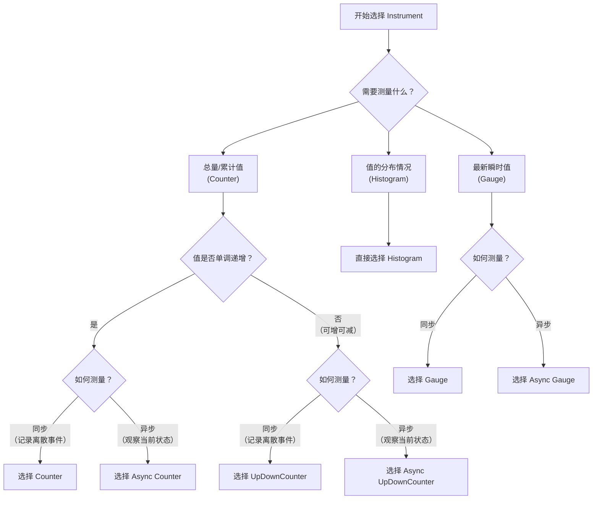

# Intro to OpenTelemetry Java

1. OpenTelemetry Java is the set of **OpenTelemetry observability tools** for the Java ecosystem.
2. At a **high level**, it consists of the **API**, the **SDK**, and **instrumentation**.

<!-- more -->

## Overview

1. The **API** is a set of **classes** and **interfaces** for **recording telemetry** across key observability **signals**.

   - It supports **multiple implementations**, with a **low-overhead minimalist Noop** and SDK reference implementation provided **out of the box**.

   - It is designed to be taken as a **direct dependency** by libraries, frameworks, and application owners looking to **add instrumentation**.

   - It comes with strong **backwards compatibility** guarantees, **zero transitive dependencies**, and supports **Java 8+**.

2. The **SDK** is the **built-in reference implementation** of the **API**, processing and exporting telemetry produced by instrumentation API calls.

   - Configuring the **SDK** to **process** and **export** appropriately is an **essential step** to **integrating** OpenTelemetry into an application.

   - The **SDK** has **autoconfiguration** and **programmatic** configuration options.

3. Instrumentation **records telemetry** using the **API**.

   - There are a variety of categories of instrumentation
   - including: **zero-code Java agent**, **zero-code Spring Boot starter**, **library**, **native**, **manual**, and **shims**.

## Navigating the docs

> The OpenTelemetry Java documentation is organized as follows

1. Getting Started by Example
   - A quick example to **get off the ground** running with OpenTelemetry Java
   - demonstrating integration of the **OpenTelemetry Java agent** into a simple web application.
2. **Instrumentation** ecosystem
   - A guide to the OpenTelemetry Java instrumentation ecosystem.
   - This is a key resource for application authors looking to **integrate** OpenTelemetry Java into applications.
   - Learn about the different **categories** of instrumentation, and decide which is right for you.
     - zero-code **Java agent**, zero-code **Spring Boot starter**, **library**, **native**, **manual**, and **shims**.
3. **Record Telemetry** with **API**
   - A technical reference for the **OpenTelemetry API**, exploring all **key aspects** of the API with working code examples.
   - Most users will use this page like an **encyclopedia**, consulting the **index** of sections as needed, rather than reading front to back.
4. **Manage Telemetry** with **SDK**
   - A technical reference for the **OpenTelemetry SDK**
     - exploring all SDK **plugin extension points** and the **programmatic configuration API** with working code examples.
   - Most users will use this page like an **encyclopedia**, consulting the **index** of sections as needed, rather than reading front to back.
5. **Configure** the **SDK**
   - A technical reference for configuring the SDK, focussing on **zero-code autoconfiguration**.
   - Includes a reference of all supported **environment variables** and **system properties** for configuring the SDK.
   - Explores all **programmatic customization points** with working code examples. 
   - Most users will use this page like an **encyclopedia**, consulting the **index** of sections as needed, rather than reading front to back.

## Repositories

| Repository                         | Description                                                  |
| ---------------------------------- | ------------------------------------------------------------ |
| opentelemetry-java                 | Core **API** and **SDK** components                          |
| opentelemetry-java-instrumentation | **Instrumentation** maintained by OpenTelemetry, including **OpenTelemetry Java agent** |
| opentelemetry-java-contrib         | **Community** maintained components that don’t fit the **express scope** of other repositories |
| semantic-conventions-java          | Generated code for **semantic conventions**                  |
| opentelemetry-proto-java           | Generated bindings for **OTLP**                              |
| opentelemetry-java-examples        | End-to-end code examples demonstrating a variety of **patterns** using the **API**, **SDK**, and **instrumentation** |

1. **opentelemetry-java**, **opentelemetry-java-instrumentation**, and **opentelemetry-java-contrib** each publish large **catalogs** of artifacts.
   - Please consult repositories for details
   - or see the “**Managed Dependencies**” column in the **Bill of Materials** table to see a **full list** of managed dependencies.
2. As a general rule, **artifacts** published from the **same repository** have the **same version**.
   - The exception to this is **opentelemetry-java-contrib**
     - which can be thought of as a **group** of **independent projects** that are **co-located** in the **same repository** to take advantage of **shared tooling**.
   - For now, the **artifacts** of **opentelemetry-java-contrib** are **aligned** but this is a **coincidence** and will change in the future.
3. The repositories have a **release cadence** which mirrors their **high level dependency structure**
   - **opentelemetry-java** is the **core** and releases **first** each **month**.
   - **opentelemetry-java-instrumentation** depends on **opentelemetry-java** and is **next** to publish.
   - **opentelemetry-java-contrib** depends on **opentelemetry-java-instrumentation** and **opentelemetry-java** and is **last** to publish.
   - Although **semantic-conventions-java** is a dependency of **opentelemetry-java-instrumentation**
     - it is an **independent artifact** with an **independent release schedule**.

## Dependencies and BOMs

1. **A bill of materials**, or **BOM** for short, is an artifact that helps keep the **versions** of **related dependencies** aligned.
2. OpenTelemetry Java publishes several BOMs catering to **different use cases**, listed below in order of increasing **scope**.
3. We **highly recommend** using a **BOM**.

> Because the BOMs are **hierarchical**, adding dependencies on **multiple BOMs** is **not recommended**
> as it is **redundant** and can lead **unintuitive dependency version resolution**.

| Description                                                  | Repository                         | Group ID/Artifact ID                                         |
| ------------------------------------------------------------ | ---------------------------------- | ------------------------------------------------------------ |
| **Stable** core **API** and **SDK** artifacts                | opentelemetry-java                 | io.opentelemetry<br />opentelemetry-bom                      |
| **Experimental** core **API** and **SDK** artifacts<br />including all of **opentelemetry-bom** | opentelemetry-java                 | io.opentelemetry<br />opentelemetry-bom-alpha                |
| **Stable instrumentation** artifacts<br />including all of **opentelemetry-bom** | opentelemetry-java-instrumentation | io.opentelemetry.instrumentation<br />opentelemetry-instrumentation-bom |
| **Experimental instrumentation** artifacts<br />including all of **opentelemetry-instrumentation-bom** | opentelemetry-java-instrumentation | io.opentelemetry.instrumentation<br />opentelemetry-instrumentation-bom-alpha |

> The following code snippet demonstrates adding a **BOM dependency**

```xml
<project>
  <dependencyManagement>
    <dependencies>
      <dependency>
        <groupId>{{bomGroupId}}</groupId>
        <artifactId>{{bomArtifactId}}</artifactId>
        <version>{{bomVersion}}</version>
        <type>pom</type>
        <scope>import</scope>
      </dependency>
    </dependencies>
  </dependencyManagement>
  <!-- Add a dependency on an artifact whose version is managed by the bom -->
  <dependencies>
    <dependency>
      <groupId>io.opentelemetry</groupId>
      <artifactId>opentelemetry-api</artifactId>
    </dependency>
  </dependencies>
</project>
```

# Getting Started by Example

## Example Application

### Dependencies

1. To begin, set up an environment in a new directory called java-simple.
2. Within that directory, create a file called **build.gradle.kts** with the following content:

### Create and launch an HTTP Server

> In that same folder, create a file called **DiceApplication.java** and add the following code to the file:

```java
package otel;

import org.springframework.boot.Banner;
import org.springframework.boot.SpringApplication;
import org.springframework.boot.autoconfigure.SpringBootApplication;

@SpringBootApplication
public class DiceApplication {
  public static void main(String[] args) {
    SpringApplication app = new SpringApplication(DiceApplication.class);
    app.setBannerMode(Banner.Mode.OFF);
    app.run(args);
  }
}
```

> Create another file called **RollController.java** and add the following code to the file:

```java
package otel;

import java.util.Optional;
import java.util.concurrent.ThreadLocalRandom;
import org.slf4j.Logger;
import org.slf4j.LoggerFactory;
import org.springframework.web.bind.annotation.GetMapping;
import org.springframework.web.bind.annotation.RequestParam;
import org.springframework.web.bind.annotation.RestController;

@RestController
public class RollController {
  private static final Logger logger = LoggerFactory.getLogger(RollController.class);

  @GetMapping("/rolldice")
  public String index(@RequestParam("player") Optional<String> player) {
    int result = this.getRandomNumber(1, 6);
    if (player.isPresent()) {
      logger.info("{} is rolling the dice: {}", player.get(), result);
    } else {
      logger.info("Anonymous player is rolling the dice: {}", result);
    }
    return Integer.toString(result);
  }

  public int getRandomNumber(int min, int max) {
    return ThreadLocalRandom.current().nextInt(min, max + 1);
  }
}
```

> Build and run the application with the following command, then open http://localhost:8080/rolldice in your web browser to ensure it is working.


```
$ curl -v 'http://localhost:8080/rolldice'
* Host localhost:8080 was resolved.
* IPv6: ::1
* IPv4: 127.0.0.1
*   Trying [::1]:8080...
* Connected to localhost (::1) port 8080
> GET /rolldice HTTP/1.1
> Host: localhost:8080
> User-Agent: curl/8.7.1
> Accept: */*
> 
* Request completely sent off
< HTTP/1.1 200 
< Content-Type: text/plain;charset=UTF-8
< Content-Length: 1
< Date: Sat, 04 Oct 2025 14:14:37 GMT
< 
* Connection #0 to host localhost left intact
4
```

## Instrumentation

> Next, you’ll use a **Java agent** to **automatically** instrument the application at **launch time**.
> While you can configure the Java agent in a number of ways, the steps below use **environment variables**.

1. Download **opentelemetry-javaagent.jar** from Releases of the **opentelemetry-java-instrumentation** repository. 
2. The **JAR file** contains the **agent** and all **automatic instrumentation** packages.

```
curl -L -O https://github.com/open-telemetry/opentelemetry-java-instrumentation/releases/latest/download/opentelemetry-javaagent.jar
```

> Set and export variables that specify the Java agent JAR and a **console exporter**, using a notation suitable for your shell/terminal environment

```bash
$ export JAVA_TOOL_OPTIONS="-javaagent:PATH/TO/opentelemetry-javaagent.jar" \
  OTEL_TRACES_EXPORTER=logging \
  OTEL_METRICS_EXPORTER=logging \
  OTEL_LOGS_EXPORTER=logging \
  OTEL_METRIC_EXPORT_INTERVAL=15000
```

> Run your application once again


> From another terminal, send a request using curl:
> You should have seen **trace** & **log** output from the server

```
$ curl localhost:8080/rolldice
```

> Stop the server process.
> When **stopping** the server, you should see an output of **all** the **metrics** collected

# Instrumentation ecosystem

1. Instrumentation **records telemetry** using the **API**.
2. The **SDK** is the **built-in reference implementation** of the **API**
   - and is configured to **process** and **export** the **telemetry** produced by **instrumentation API calls**.
3. This page discusses the OpenTelemetry ecosystem in OpenTelemetry Java, including **resources** for end users and **cross-cutting** instrumentation topics:

| Topic                      | Desc                                                         |
| -------------------------- | ------------------------------------------------------------ |
| Instrumentation categories | addressing different **use cases** and **installation patterns** |
| Context propagation        | provides **correlation** between **traces**, **metrics**, and **logs**, allowing the signals to complement each other. |
| Semantic conventions       | define how to **produce telemetry** for **standard operations** |
| Log instrumentation        | which is used to **get logs** from an **existing Java logging framework** into **OpenTelemetry** |

## Instrumentation categories

> There are several categories of instrumentation

| Instrumentation                    | Desc                                                         |
| ---------------------------------- | ------------------------------------------------------------ |
| Zero-code: **Java agent**          | is a form of **zero-code** instrumentation that **dynamically manipulates application bytecode**. |
| Zero-code: **Spring Boot starter** | is a form of **zero-code** instrumentation that leverages **spring autoconfigure** to **install library instrumentation**. |
| **Library** instrumentation        | wraps or uses **extension points** to **instrument a library**, requiring users to install and/or adapt **library usage**. |
| **Native** instrumentation         | is **built directly** into libraries and frameworks.         |
| **Manual** instrumentation         | is written by **application authors**, and typically specific to the **application domain**. |
| **Shims**                          | bridge data from one **observability library** to another, typically from some library into OpenTelemetry. |

1. Zero-code instrumentation is **installed automatically** based on **detected libraries / frameworks**.
2. The **opentelemetry-java-instrumentation** project contains the source code for **Java agent**, **Spring Boot starter**, and **Library instrumentation**.

### Zero-code: Java agent

1. The Java agent is a form of **zero-code** automatic instrumentation that **dynamically manipulates application bytecode**.
2. For a list of libraries instrumented by the Java agent, see the “Auto-instrumented versions” column on supported libraries.
   - https://github.com/open-telemetry/opentelemetry-java-instrumentation/blob/main/docs/supported-libraries.md

### Zero-code: Spring Boot starter

1. The Spring Boot starter is a form of **zero-code** automatic instrumentation that leverages **spring autoconfigure** to **install library instrumentation**.

### Library instrumentation

1. Library instrumentation wraps or uses **extension points** to **instrument a library**, requiring users to install and/or adapt **library usage**.
2. https://github.com/open-telemetry/opentelemetry-java-instrumentation/blob/main/docs/supported-libraries.md

### Native instrumentation

1. Native instrumentation is **built directly** into libraries or frameworks.
2. OpenTelemetry encourages **library authors** to add **native instrumentation** using the **API**.
3. In the long term, we hope the **native instrumentation** becomes the **norm**
   - and view the instrumentation maintained by OpenTelemetry in **opentelemetry-java-instrumentation** as a **temporary means** of **filling the gap**.
4. **Elasticsearch Java API Client + Quarkus**

### Manual instrumentation

1. Manual instrumentation is written by **application authors**, and typically specific to the **application domain**.

### Shims

1. A shim is instrumentation that bridges data from one **observability library** to another, typically from some library into OpenTelemetry.
2. Shims maintained in the OpenTelemetry Java ecosystem:

| Description                                              | Signal(s)       | Artifact                                                     |
| -------------------------------------------------------- | --------------- | ------------------------------------------------------------ |
| Bridge **OpenTracing** into **OpenTelemetry**            | Traces          | io.opentelemetry<br />opentelemetry-opentracing-shim         |
| Bridge **Opencensus** into **OpenTelemetry**             | Traces, Metrics | io.opentelemetry<br />opentelemetry-opencensus-shim          |
| Bridge **Micrometer** into **OpenTelemetry**             | Metrics         | io.opentelemetry.instrumentation<br />opentelemetry-micrometer-1.5 |
| Bridge **JMX** into **OpenTelemetry**                    | Metrics         | io.opentelemetry.instrumentation<br />opentelemetry-jmx-metrics |
| Bridge **OpenTelemetry** into **Prometheus Java client** | Metrics         | io.opentelemetry.contrib<br />opentelemetry-prometheus-client-bridge |
| Bridge **OpenTelemetry** into **Micrometer**             | Metrics         | io.opentelemetry.contrib<br />opentelemetry-micrometer-meter-provider |
| Bridge **Log4j** into **OpenTelemetry**                  | Logs            | io.opentelemetry.instrumentation<br />opentelemetry-log4j-appender-2.17 |
| Bridge **Logback** into **OpenTelemetry**                | Logs            | io.opentelemetry.instrumentation<br />opentelemetry-logback-appender-1.0 |
| Bridge **OpenTelemetry context** into **Log4j**          | Context         | io.opentelemetry.instrumentation<br />opentelemetry-log4j-context-data-2.17-autoconfigure |
| Bridge **OpenTelemetry context** into **Logback**        | Context         | io.opentelemetry.instrumentation<br />opentelemetry-logback-mdc-1.0 |

## Context propagation

1. The **OpenTelemetry APIs** are designed to be **complementary**, with the whole greater than the sum of the parts.
   - Each **signal** has its **own strengths**, and **collectively stitch together** a compelling observability story.
2. Importantly, the data from the **various signals** are **linked together** through **trace context**:
   - **Spans** are related to other spans through **span parent** and **links**, which each record **trace context** of **related spans**.
   - **Metrics** are related to **spans** through **exemplars**, which record **trace context** of **a particular measurement**.
   - **Logs** are related to **spans** by recording **trace context** on **log records**.
3. For this **correlation** to work
   - **trace context** must be **propagated throughout an application** (across **function calls** and **threads**), and **across application boundaries**. 
   - The **context API** facilitates this.
4. **Instrumentation** needs to be written in a manner which is **context aware**:
   - Libraries that represent the **entry point** to an application (i.e. **HTTP servers**, **message consumers**, etc.)
     - should **extract context** from **incoming messages**.
   - Libraries that represent an **exit point** from an application (i.e. **HTTP clients**, **message producers**, etc.)
     - should **inject context** into **outgoing messages**.
   - Libraries should **implicitly** or **explicitly** pass **Context** through the **callstack** and **across any threads**.

## Semantic conventions

1. The semantic conventions define how to **produce telemetry** for **standard operations**.
2. Semantic conventions specify span names, span kinds, metric instruments, metric units, metric types, and attribute key, value, and requirement levels.
3. When writing instrumentation, consult the **semantic conventions** and conform to any which are applicable to the **domain**.
4. OpenTelemetry Java publishes artifacts to **assist** in **conforming** to the semantic conventions
   - including **generated constants** for attribute keys and values.

## Log instrumentation

1. While the **LoggerProvider** / **Logger APIs** are **structurally similar** to the equivalent **trace** and **metric** APIs, they serve a different use case.
2. As of now, **LoggerProvider** / **Logger** and **associated classes** represent the **Log Bridge API**
   - which exists to **write log appenders** to bridge **logs recorded** through **other log APIs / frameworks** into **OpenTelemetry**.
3. They are **not intended** for end user use as a **replacement** for Log4j / **SLF4J** / **Logback** / etc.
4. There are two typical workflows for **consuming log instrumentation** in OpenTelemetry catering to different application requirements:

### Direct to collector

1. In the direct to collector workflow, logs are **emitted directly** from an **application** to a **collector** using a **network protocol** (e.g. **OTLP**).
2. This workflow is **simple to set up** as it doesn’t require any additional **log forwarding components**
   - and allows an application to easily **emit structured logs** that **conform** to the **log data model**.
3. However, the **overhead** required for applications to **queue** and **export** logs to a network location may **not be suitable** for all applications.
4. To use this workflow:
   - Install appropriate **log appender**.
   - Configure the OpenTelemetry **Log SDK** to **export log records** to desired target destination (the **collector** or other)
5. **Log appenders** are a type of **shim** which bridges logs from **a log framework** into the **OpenTelemetry log SDK**.
   - See “Bridge **Log4j** into **OpenTelemetry**”, “Bridge **Logback** into **OpenTelemetry**” entries.

### Via file or stdout

1. In the file or stdout workflow, logs are written to files or standout output.
2. Another component (e.g. **FluentBit**) is responsible for **reading** / **tailing** the logs
   - **parsing** them to more **structured format**, and **forwarding** them a target, such as the **collector**.
3. This workflow may be **preferable** in situations where application requirements do **not permit additional overhead** from direct to collector.
4. However, it requires that **all log fields required down stream** are **encoded** into the logs
   - and that the component reading the logs parse the data into the **log data model**.
5. **Log correlation with traces** is available by installing a shim to bridge **OpenTelemetry context** into the **log framework**.
   - See “Bridge **OpenTelemetry context** into **Log4j**”, “Bridge **OpenTelemetry context** into **Logback**” entries.

# Record Telemetry with API

1. The **API** is a set of **classes** and **interfaces** for **recording telemetry** across **key observability signals**.
2. The **SDK** is the **built-in reference implementation** of the **API**, configured to process and export telemetry.

> The API consists of the following **top-level** components

| Components     | Desc                                                         |
| -------------- | ------------------------------------------------------------ |
| Context        | A **standalone API** for **propagating context** throughout an application and across application boundaries, including **trace context** and **baggage**. |
| TracerProvider | The API **entry point** for traces                           |
| MeterProvider  | The API **entry point** for metrics                          |
| LoggerProvider | The API entry point for logs                                 |
| OpenTelemetry  | A **holder** for top-level API components (i.e. TracerProvider, MeterProvider, LoggerProvider, ContextPropagators) which is convenient to pass to **instrumentation**. |

> The **API** is designed to support **multiple implementations**. Two implementations are **provided by OpenTelemetry**:

| Implementations                  | Desc                                                         |
| -------------------------------- | ------------------------------------------------------------ |
| **SDK** reference implementation | This is the right choice for **most users**.                 |
| **Noop** implementation          | A **minimalist**, **zero-dependency** implementation for instrumentations to use by default when the user **doesn’t install an instance**. |

1. The **API** is designed to be taken as a **direct dependency** by **libraries**, **frameworks**, and application owners.
2. It comes with strong **backwards compatibility** guarantees, **zero transitive dependencies**, and supports **Java 8+**
3. **Libraries** and **frameworks** should **depend only on the API** and **only call methods from the API**
   - and instruct **applications** / **end users** to add a dependency on the **SDK** and install a **configured instance**.

## Context API

1. The **io.opentelemetry:opentelemetry-api-context:1.54.1** artifact contains **standalone APIs** (i.e. **packaged separately from OpenTelemetry API**)
   - for **propagating context** throughout an application and across application boundaries.
2. The **io.opentelemetry:opentelemetry-extension-kotlint:1.54.1** is an extension with tools for propagating context into **coroutines**.
3. It consists of:

| Components         | Desc                                                         |
| ------------------ | ------------------------------------------------------------ |
| Context            | An **immutable** bundle of **key value pairs** which is **implicitly** or **explicitly** propagated through an application. |
| ContextStorage     | A **mechanism** for **storing** and **retrieving** the current context, defaulting to **thread local**. |
| ContextPropagators | A **container** of **registered propagators** for **propagating Context** across application boundaries. |

### Context

1. Context is an immutable bundle of **key value pairs**, with utilities for **implicitly propagating** through an application and across threads.
   - **Implicit propagation** means that the context can be accessed **without explicitly passing** it as an argument. 
2. Context is a **recurring concept** in the **OpenTelemetry API**:
   - The **current active Span** is stored in context, and by default a span’s **parent** is assigned to whatever span is currently in context.
   - The measurements recorded to **metric instruments** accept a **context argument**
     - used to **link measurements to spans** via **exemplars** and defaulting to whatever span is currently in context.
   - LogRecords accept a **context argument**, used to **link log record spans** and defaulting to whatever span is currently in context.

> The following code snippet explores Context API usage:

```java
package otel;

import io.opentelemetry.context.Context;
import io.opentelemetry.context.ContextKey;
import io.opentelemetry.context.Scope;

import java.util.concurrent.ExecutorService;
import java.util.concurrent.Executors;
import java.util.concurrent.ScheduledExecutorService;
import java.util.concurrent.TimeUnit;

public class ContextUsage {

  public static void main(String[] args) throws Exception {
    // Define an example context key
    ContextKey<String> exampleContextKey = ContextKey.named("example-context-key");

    // Context doesn't contain the key until we add it
    // Context.current() accesses the current context
    // output => current context value: null
    System.out.println("current context value: " + Context.current().get(exampleContextKey));

    // Add entry to context
    Context context = Context.current().with(exampleContextKey, "value");

    // The local context var contains the added value
    // output => context value: value
    System.out.println("context value: " + context.get(exampleContextKey));
    // The current context still doesn't contain the value
    // output => current context value: null
    System.out.println("current context value: " + Context.current().get(exampleContextKey));

    // Calling context.makeCurrent() sets Context.current() to the context until the scope is
    // closed, upon which Context.current() is restored to the state prior to when
    // context.makeCurrent() was called. The resulting Scope implements AutoCloseable and is
    // normally used in a try-with-resources block. Failure to call Scope.close() is an error and
    // may cause memory leaks or other issues.
    try (Scope scope = context.makeCurrent()) {
      // The current context now contains the added value
      // output => context value: value
      System.out.println("context value: " + Context.current().get(exampleContextKey));
    }

    // The local context var still contains the added value
    // output => context value: value
    System.out.println("context value: " + context.get(exampleContextKey));
    // The current context no longer contains the value
    // output => current context value: null
    System.out.println("current context value: " + Context.current().get(exampleContextKey));

    ExecutorService executorService = Executors.newSingleThreadExecutor();
    ScheduledExecutorService scheduledExecutorService = Executors.newScheduledThreadPool(1);

    // Context instances can be explicitly passed around application code, but it's more convenient
    // to use implicit context, calling Context.makeCurrent() and accessing via Context.current().
    // Context provides a number of utilities for implicit context propagation. These utilities wrap
    // utility classes like Scheduler, ExecutorService, ScheduledExecutorService, Runnable,
    // Callable, Consumer, Supplier, Function, etc and modify their behavior to call
    // Context.makeCurrent() before running.
    context.wrap(ContextUsage::callable).call();
    context.wrap(ContextUsage::runnable).run();
    context.wrap(executorService).submit(ContextUsage::runnable);
    context.wrap(scheduledExecutorService).schedule(ContextUsage::runnable, 1, TimeUnit.SECONDS);
    context.wrapConsumer(ContextUsage::consumer).accept(new Object());
    context.wrapConsumer(ContextUsage::biConsumer).accept(new Object(), new Object());
    context.wrapFunction(ContextUsage::function).apply(new Object());
    context.wrapSupplier(ContextUsage::supplier).get();
  }

  /** Example {@link java.util.concurrent.Callable}. */
  private static Object callable() {
    return new Object();
  }

  /** Example {@link Runnable}. */
  private static void runnable() {}

  /** Example {@link java.util.function.Consumer}. */
  private static void consumer(Object object) {}

  /** Example {@link java.util.function.BiConsumer}. */
  private static void biConsumer(Object object1, Object object2) {}

  /** Example {@link java.util.function.Function}. */
  private static Object function(Object object) {
    return object;
  }

  /** Example {@link java.util.function.Supplier}. */
  private static Object supplier() {
    return new Object();
  }
}
```

1. **Context instances** can be **explicitly passed** around application code
   - but it's **more convenient** to use **implicit context**, calling **Context.makeCurrent()** and **accessing via Context.current()**.
2. Context provides a number of utilities for **implicit context propagation**.
3. These utilities **wrap** utility classes like
   - **Scheduler**, **ExecutorService**, **ScheduledExecutorService**, **Runnable**, **Callable**, **Consumer**, **Supplier**, **Function**, etc
   - and modify their behavior to **call Context.makeCurrent() before running**.

### ContextStorage

1. ContextStorage is a **mechanism** for **storing** and **retrieving** the **current Context**.
2. The **default** ContextStorage implementation stores Context in **thread local**.

### ContextPropagators

1. ContextPropagators is a **container** of **registered propagators** for **propagating Context** across application boundaries.
2. Context is **injected** into a **carrier** when **leaving** an application (i.e. an outbound HTTP request)
   - and **extracted** from a **carrier** when **entering** an application (i.e. serving an HTTP request).
3. See **SDK TextMapPropagators** for propagator implementations.

> The following code snippet explores **ContextPropagators API** for **extraction**:

```java
package otel;

import com.sun.net.httpserver.HttpExchange;
import com.sun.net.httpserver.HttpHandler;
import com.sun.net.httpserver.HttpServer;
import io.opentelemetry.api.baggage.propagation.W3CBaggagePropagator;
import io.opentelemetry.api.trace.propagation.W3CTraceContextPropagator;
import io.opentelemetry.context.Context;
import io.opentelemetry.context.Scope;
import io.opentelemetry.context.propagation.ContextPropagators;
import io.opentelemetry.context.propagation.TextMapGetter;
import io.opentelemetry.context.propagation.TextMapPropagator;
import io.opentelemetry.context.propagation.TextMapSetter;
import java.io.IOException;
import java.io.OutputStream;
import java.net.InetSocketAddress;
import java.nio.charset.StandardCharsets;
import java.util.List;

public class ExtractContextUsage {

  private static final TextMapGetter<HttpExchange> TEXT_MAP_GETTER = new HttpRequestGetter();

  public static void main(String[] args) throws Exception {
    // Create a ContextPropagators instance which propagates w3c trace context and w3c baggage
    ContextPropagators propagators =
        ContextPropagators.create(
            TextMapPropagator.composite(
                W3CTraceContextPropagator.getInstance(), W3CBaggagePropagator.getInstance()));

    // Create a server, which uses the propagators to extract context from requests
    HttpServer server = HttpServer.create(new InetSocketAddress(8080), 0);
    server.createContext("/path", new Handler(propagators));
    server.setExecutor(null);
    server.start();
  }

  private static class Handler implements HttpHandler {

    private final ContextPropagators contextPropagators;

    private Handler(ContextPropagators contextPropagators) {
      this.contextPropagators = contextPropagators;
    }

    @Override
    public void handle(HttpExchange exchange) throws IOException {
      // Extract the context from the request and make the context current
      Context extractedContext =
          contextPropagators
              .getTextMapPropagator()
              .extract(Context.current(), exchange, TEXT_MAP_GETTER);
      try (Scope scope = extractedContext.makeCurrent()) {
        // Do work with the extracted context
      } finally {
        String response = "success";
        exchange.sendResponseHeaders(200, response.length());
        OutputStream os = exchange.getResponseBody();
        os.write(response.getBytes(StandardCharsets.UTF_8));
        os.close();
      }
    }
  }

  /** {@link TextMapSetter} with a {@link HttpExchange} carrier. */
  private static class HttpRequestGetter implements TextMapGetter<HttpExchange> {
    @Override
    public Iterable<String> keys(HttpExchange carrier) {
      return carrier.getRequestHeaders().keySet();
    }

    @Override
    public String get(HttpExchange carrier, String key) {
      if (carrier == null) {
        return null;
      }
      List<String> headers = carrier.getRequestHeaders().get(key);
      if (headers == null || headers.isEmpty()) {
        return null;
      }
      return headers.get(0);
    }
  }
}
```

> The following code snippet explores **ContextPropagators API** for **injection**:

```java
package otel;

import io.opentelemetry.api.baggage.propagation.W3CBaggagePropagator;
import io.opentelemetry.api.trace.propagation.W3CTraceContextPropagator;
import io.opentelemetry.context.Context;
import io.opentelemetry.context.propagation.ContextPropagators;
import io.opentelemetry.context.propagation.TextMapPropagator;
import io.opentelemetry.context.propagation.TextMapSetter;
import java.net.URI;
import java.net.http.HttpClient;
import java.net.http.HttpRequest;
import java.net.http.HttpResponse;

public class InjectContextUsage {

  private static final TextMapSetter<HttpRequest.Builder> TEXT_MAP_SETTER = new HttpRequestSetter();

  public static void main(String[] args) throws Exception {
    // Create a ContextPropagators instance which propagates w3c trace context and w3c baggage
    ContextPropagators propagators =
        ContextPropagators.create(
            TextMapPropagator.composite(
                W3CTraceContextPropagator.getInstance(), W3CBaggagePropagator.getInstance()));

    // Create an HttpRequest builder
    HttpClient httpClient = HttpClient.newBuilder().build();
    HttpRequest.Builder requestBuilder =
        HttpRequest.newBuilder().uri(new URI("http://127.0.0.1:8080/path")).GET();

    // Given a ContextPropagators instance, inject the current context into the HTTP request carrier
    propagators.getTextMapPropagator().inject(Context.current(), requestBuilder, TEXT_MAP_SETTER);

    // Send the request with the injected context
    httpClient.send(requestBuilder.build(), HttpResponse.BodyHandlers.discarding());
  }

  /** {@link TextMapSetter} with a {@link HttpRequest.Builder} carrier. */
  private static class HttpRequestSetter implements TextMapSetter<HttpRequest.Builder> {
    @Override
    public void set(HttpRequest.Builder carrier, String key, String value) {
      if (carrier == null) {
        return;
      }
      carrier.setHeader(key, value);
    }
  }
}
```

## OpenTelemetry API

1. The **io.opentelemetry:opentelemetry-api:1.54.1** artifact contains the OpenTelemetry API
2. including **traces**, **metrics**, **logs**, **noop** implementation, **baggage**, **key TextMapPropagator** implementations, and a **dependency** on the **context API**.

### Providers and Scopes

1. **Providers** and **scopes** are **recurring concepts** in the OpenTelemetry API.
2. A **scope** is a **logical unit within the application** which telemetry is associated with.
3. A provider provides **components** for **recording telemetry** relative to a particular scope:
   - **TracerProvider** provides scoped **Tracers** for recording **spans**.
   - **MeterProvider** provides scoped **Meters** for recording **metrics**.
   - **LoggerProvider** provides scoped **Loggers** for recording **logs**.

> Log

1. While the **LoggerProvider** / **Logger** APIs are **structurally similar to** the equivalent **trace** and **metric** APIs, they serve a **different use case**.
2. As of now, LoggerProvider / Logger and associated classes represent the **Log Bridge API**
   - which exists to write **log appenders** to **bridge** logs recorded through **other log APIs / frameworks** into **OpenTelemetry**. 
3. They are **not intended** for end user use as a **replacement** for Log4j / SLF4J / Logback / etc.

> scope

1. A scope is identified by the triplet (**name**, **version**, **schemaUrl**).
2. Care must be taken to ensure the **scope identity** is **unique**.
3. A typical approach is to set the **scope name** to the **package name** or **fully qualified class name**, and to set the **scope version** to the **library version**.
4. If emitting telemetry for **multiple signals** (i.e. metrics and traces), the **same scope** should be used.

> The following code snippet explores **provider** and **scope** API usage:

```java
package otel;

import io.opentelemetry.api.OpenTelemetry;
import io.opentelemetry.api.logs.Logger;
import io.opentelemetry.api.logs.LoggerProvider;
import io.opentelemetry.api.metrics.Meter;
import io.opentelemetry.api.metrics.MeterProvider;
import io.opentelemetry.api.trace.Tracer;
import io.opentelemetry.api.trace.TracerProvider;

public class ProvidersAndScopes {

  private static final String SCOPE_NAME = "fully.qualified.name";
  private static final String SCOPE_VERSION = "1.0.0";
  private static final String SCOPE_SCHEMA_URL = "https://example";

  public static void providersUsage(OpenTelemetry openTelemetry) {
    // Access providers from an OpenTelemetry instance
    TracerProvider tracerProvider = openTelemetry.getTracerProvider();
    MeterProvider meterProvider = openTelemetry.getMeterProvider();
    // NOTE: LoggerProvider is a special case and should only be used to bridge logs from other
    // logging APIs / frameworks into OpenTelemetry.
    LoggerProvider loggerProvider = openTelemetry.getLogsBridge();

    // Access tracer, meter, logger from providers to record telemetry for a particular scope
    Tracer tracer =
        tracerProvider
            .tracerBuilder(SCOPE_NAME)
            .setInstrumentationVersion(SCOPE_VERSION)
            .setSchemaUrl(SCOPE_SCHEMA_URL)
            .build();
    Meter meter =
        meterProvider
            .meterBuilder(SCOPE_NAME)
            .setInstrumentationVersion(SCOPE_VERSION)
            .setSchemaUrl(SCOPE_SCHEMA_URL)
            .build();
    Logger logger =
        loggerProvider
            .loggerBuilder(SCOPE_NAME)
            .setInstrumentationVersion(SCOPE_VERSION)
            .setSchemaUrl(SCOPE_SCHEMA_URL)
            .build();

    // ...optionally, shorthand versions are available if scope version and schemaUrl aren't
    // available
    tracer = tracerProvider.get(SCOPE_NAME);
    meter = meterProvider.get(SCOPE_NAME);
    logger = loggerProvider.get(SCOPE_NAME);
  }
}
```

### Attributes

1. Attributes is a bundle of **key value pairs** representing the **standard attribute definition**.
2. Attributes are a **recurring concept** in the OpenTelemetry API:
   - **Spans**, **span events**, and **span links** have attributes.
   - The **measurements** recorded to **metric instruments** have attributes.
   - **LogRecords** have attributes.

> The following code snippet explores **Attributes** API usage:

```java
package otel;

import io.opentelemetry.api.common.AttributeKey;
import io.opentelemetry.api.common.Attributes;
import io.opentelemetry.api.common.AttributesBuilder;
import java.util.Map;

public class AttributesUsage {

  // Establish static constant for attribute keys and reuse to avoid allocations
  private static final AttributeKey<String> SHOP_ID = AttributeKey.stringKey("com.acme.shop.id");
  private static final AttributeKey<String> SHOP_NAME =
      AttributeKey.stringKey("com.acme.shop.name");
  private static final AttributeKey<Long> CUSTOMER_ID =
      AttributeKey.longKey("com.acme.customer.id");
  private static final AttributeKey<String> CUSTOMER_NAME =
      AttributeKey.stringKey("com.acme.customer.name");

  public static void attributesUsage() {
    // Use a varargs initializer and pre-allocated attribute keys. This is the most efficient way to
    // create attributes.
    Attributes attributes =
        Attributes.of(
            SHOP_ID,
            "abc123",
            SHOP_NAME,
            "opentelemetry-demo",
            CUSTOMER_ID,
            123L,
            CUSTOMER_NAME,
            "Jack");

    // ...or use a builder.
    attributes =
        Attributes.builder()
            .put(SHOP_ID, "abc123")
            .put(SHOP_NAME, "opentelemetry-demo")
            .put(CUSTOMER_ID, 123)
            .put(CUSTOMER_NAME, "Jack")
            // Optionally initialize attribute keys on the fly
            .put(AttributeKey.stringKey("com.acme.string-key"), "value")
            .put(AttributeKey.booleanKey("com.acme.bool-key"), true)
            .put(AttributeKey.longKey("com.acme.long-key"), 1L)
            .put(AttributeKey.doubleKey("com.acme.double-key"), 1.1)
            .put(AttributeKey.stringArrayKey("com.acme.string-array-key"), "value1", "value2")
            .put(AttributeKey.booleanArrayKey("come.acme.bool-array-key"), true, false)
            .put(AttributeKey.longArrayKey("come.acme.long-array-key"), 1L, 2L)
            .put(AttributeKey.doubleArrayKey("come.acme.double-array-key"), 1.1, 2.2)
            // Optionally omit initializing AttributeKey
            .put("com.acme.string-key", "value")
            .put("com.acme.bool-key", true)
            .put("come.acme.long-key", 1L)
            .put("come.acme.double-key", 1.1)
            .put("come.acme.string-array-key", "value1", "value2")
            .put("come.acme.bool-array-key", true, false)
            .put("come.acme.long-array-key", 1L, 2L)
            .put("come.acme.double-array-key", 1.1, 2.2)
            .build();

    // Attributes has a variety of methods for manipulating and reading data.
    // Read an attribute key:
    String shopIdValue = attributes.get(SHOP_ID);
    // Inspect size:
    int size = attributes.size();
    boolean isEmpty = attributes.isEmpty();
    // Convert to a map representation:
    Map<AttributeKey<?>, Object> map = attributes.asMap();
    // Iterate through entries, printing each to the template: <key> (<type>): <value>\n
    attributes.forEach(
        (attributeKey, value) ->
            System.out.printf(
                "%s (%s): %s%n", attributeKey.getKey(), attributeKey.getType(), value));
    // Convert to a builder, remove the com.acme.customer.id and any entry whose key starts with
    // com.acme.shop, and build a new instance:
    AttributesBuilder builder = attributes.toBuilder();
    builder.remove(CUSTOMER_ID);
    builder.removeIf(attributeKey -> attributeKey.getKey().startsWith("com.acme.shop"));
    Attributes trimmedAttributes = builder.build();
  }
}
```

### OpenTelemetry

> Spring Boot Starter

1. The Spring Boot starter is a special case where **OpenTelemetry** is available as a **Spring bean**.
2. Simply **inject** OpenTelemetry into your **Spring components**.
3. Extending the **Spring Boot starter** with **custom manual instrumentation**.

> OpenTelemetry is a **holder** for **top-level** API components which is convenient to pass to instrumentation. OpenTelemetry consists of

| Components         | Desc                                             |
| ------------------ | ------------------------------------------------ |
| TracerProvider     | The API entry point for **traces**.              |
| MeterProvider      | The API entry point for **metrics**.             |
| LoggerProvider     | The API entry point for **logs**.                |
| ContextPropagators | The API entry point for **context propagation**. |

> The following code snippet explores **OpenTelemetry API** usage:

```java
package otel;

import io.opentelemetry.api.OpenTelemetry;
import io.opentelemetry.api.common.Attributes;
import io.opentelemetry.api.logs.LoggerProvider;
import io.opentelemetry.api.metrics.MeterProvider;
import io.opentelemetry.api.trace.TracerProvider;
import io.opentelemetry.context.propagation.ContextPropagators;

public class OpenTelemetryUsage {

  private static final Attributes WIDGET_RED_CIRCLE = Util.WIDGET_RED_CIRCLE;

  public static void openTelemetryUsage(OpenTelemetry openTelemetry) {
    // Access TracerProvider, MeterProvider, LoggerProvider, ContextPropagators
    TracerProvider tracerProvider = openTelemetry.getTracerProvider();
    MeterProvider meterProvider = openTelemetry.getMeterProvider();
    LoggerProvider loggerProvider = openTelemetry.getLogsBridge();
    ContextPropagators propagators = openTelemetry.getPropagators();
  }
}
```

### GlobalOpenTelemetry

> Java agent

1. The **Java agent** is a special case where **GlobalOpenTelemetry** is **set by the agent**.
2. Simply call **GlobalOpenTelemetry.get()** to access the **OpenTelemetry instance**.
3. Extending the **Java agent** with custom manual instrumentation

> GlobalOpenTelemetry

1. GlobalOpenTelemetry holds a **global singleton** OpenTelemetry instance.
2. **Instrumentation** should **avoid** using **GlobalOpenTelemetry**.
   - Instead, accept **OpenTelemetry** as an **initialization argument** and default to the **Noop implementation** if **not set**.
3. There is an **exception** to this rule: the OpenTelemetry instance **installed** by the **Java agent** is available via GlobalOpenTelemetry.
   - Users with **additional manual instrumentation** are **encouraged** to access it via **GlobalOpenTelemetry.get()**.
4. **GlobalOpenTelemetry.get()** is **guaranteed** to always return the **same result**.
   - If GlobalOpenTelemetry.**get**() is **called** before GlobalOpenTelemetry.**set**(..)
     - GlobalOpenTelemetry is set to the **noop implementation** and future calls to GlobalOpenTelemetry.**set**(..) throw an **exception**.
   - Therefore, it’s critical to call GlobalOpenTelemetry.**set**(..) as **early** in the application lifecycle as possible
     - and **before** GlobalOpenTelemetry.**get**() is called by any instrumentation.
   - This guarantee surfaces initialization ordering issues
     - calling GlobalOpenTelemetry.set() **too late** (i.e. after instrumentation has called GlobalOpenTelemetry.get())
     - **triggers an exception** rather than **silently failing**.
5. If **autoconfigure** is present, **GlobalOpenTelemetry** can be **automatically initialized** by setting
   - -D**otel.java.global-autoconfigure.enabled**=true (or via env var export **OTEL_JAVA_GLOBAL_AUTOCONFIGURE_ENABLED**=true).
   - When enabled, the **first call** to GlobalOpenTelemetry.**get**() **triggers autoconfiguration** and calls GlobalOpenTelemetry.**set**(..) with the resulting OpenTelemetry instance.

> The following code snippet explores **GlobalOpenTelemetry API context propagation**:

```java
package otel;

import io.opentelemetry.api.GlobalOpenTelemetry;
import io.opentelemetry.api.OpenTelemetry;

public class GlobalOpenTelemetryUsage {

  public static void openTelemetryUsage(OpenTelemetry openTelemetry) {
    // Set the GlobalOpenTelemetry instance as early in the application lifecycle as possible
    // Set must only be called once. Calling multiple times raises an exception.
    GlobalOpenTelemetry.set(openTelemetry);

    // Get the GlobalOpenTelemetry instance.
    openTelemetry = GlobalOpenTelemetry.get();
  }
}
```

### TracerProvider

TracerProvider is the **API entry point** for **traces** and **provides Tracers**

#### Tracer

Tracer is used to **record spans** for an **instrumentation scope**.

#### Span

1. **SpanBuilder** and **Span** are used to **construct** and **record** data to spans.
2. **SpanBuilder** is used to **add data** to a span **before** starting it by calling Span **startSpan()**.
3. Data **can be added / updated after starting** by calling various Span **update methods**.
4. The **data** provided to **SpanBuilder** before starting is provided as an **input** to **Samplers**.

> The following code snippet explores **SpanBuilder / Span API** usage:

```java
package otel;

import static io.opentelemetry.context.Context.current;

import io.opentelemetry.api.common.AttributeKey;
import io.opentelemetry.api.common.Attributes;
import io.opentelemetry.api.trace.Span;
import io.opentelemetry.api.trace.SpanContext;
import io.opentelemetry.api.trace.SpanKind;
import io.opentelemetry.api.trace.StatusCode;
import io.opentelemetry.api.trace.Tracer;
import java.util.Arrays;

public class SpanUsage {

  private static final Attributes WIDGET_RED_CIRCLE = Util.WIDGET_RED_CIRCLE;

  public static void spanUsage(Tracer tracer) {
    // Get a span builder by providing the span name
    Span span =
        tracer
            .spanBuilder("span name")
            // Set span kind
            .setSpanKind(SpanKind.INTERNAL)
            // Set attributes
            .setAttribute(AttributeKey.stringKey("com.acme.string-key"), "value")
            .setAttribute(AttributeKey.booleanKey("com.acme.bool-key"), true)
            .setAttribute(AttributeKey.longKey("com.acme.long-key"), 1L)
            .setAttribute(AttributeKey.doubleKey("com.acme.double-key"), 1.1)
            .setAttribute(
                AttributeKey.stringArrayKey("com.acme.string-array-key"),
                Arrays.asList("value1", "value2"))
            .setAttribute(
                AttributeKey.booleanArrayKey("come.acme.bool-array-key"),
                Arrays.asList(true, false))
            .setAttribute(
                AttributeKey.longArrayKey("come.acme.long-array-key"), Arrays.asList(1L, 2L))
            .setAttribute(
                AttributeKey.doubleArrayKey("come.acme.double-array-key"), Arrays.asList(1.1, 2.2))
            // Optionally omit initializing AttributeKey
            .setAttribute("com.acme.string-key", "value")
            .setAttribute("com.acme.bool-key", true)
            .setAttribute("come.acme.long-key", 1L)
            .setAttribute("come.acme.double-key", 1.1)
            .setAllAttributes(WIDGET_RED_CIRCLE)
            // Uncomment to optionally explicitly set the parent span context. If omitted, the
            // span's parent will be set using Context.current().
            // .setParent(parentContext)
            // Uncomment to optionally add links.
            // .addLink(linkContext, linkAttributes)
            // Start the span
            .startSpan();

    // Check if span is recording before computing additional data
    if (span.isRecording()) {
      // Update the span name with information not available when starting
      span.updateName("new span name");

      // Add additional attributes not available when starting
      span.setAttribute("com.acme.string-key2", "value");

      // Add additional span links not available when starting
      span.addLink(exampleLinkContext());
      // optionally include attributes on the link
      span.addLink(exampleLinkContext(), WIDGET_RED_CIRCLE);

      // Add span events
      span.addEvent("my-event");
      // optionally include attributes on the event
      span.addEvent("my-event", WIDGET_RED_CIRCLE);

      // Record exception, syntactic sugar for a span event with a specific shape
      span.recordException(new RuntimeException("error"));

      // Set the span status
      span.setStatus(StatusCode.OK, "status description");
    }

    // Finally, end the span
    span.end();
  }

  /** Return a dummy link context. */
  private static SpanContext exampleLinkContext() {
    return Span.fromContext(current()).getSpanContext();
  }
}
```

1. **Span parenting** is an important **aspect** of **tracing**.
2. Each span has an **optional parent**.
3. By collecting all the spans in a trace and following each span’s parent, we can construct a **hierarchy**.
4. The **span APIs** are built on **top** of **context**, which allows **span context** to be **implicitly passed** around an **application** and across **threads**.
5. When a **span** is **created**, its **parent** is set to the whatever span is present in **Context.current()**
   - unless **there is no span** or the **context is explicitly overridden**.
6. Most of the **context API** usage guidance **applies** to **spans**.
   - **Span context** is propagated across **application boundaries** with the **W3CTraceContextPropagator** and other **TextMapPropagators**.

> The following code snippet explores **Span API context propagation**:

```java
package otel;

import io.opentelemetry.api.trace.Span;
import io.opentelemetry.api.trace.Tracer;
import io.opentelemetry.context.Context;
import io.opentelemetry.context.Scope;

public class SpanAndContextUsage {

  private final Tracer tracer;

  SpanAndContextUsage(Tracer tracer) {
    this.tracer = tracer;
  }

  public void nestedSpanUsage() {
    // Start a span. Since we don't call makeCurrent(), we must explicitly call setParent on
    // children. Wrap code in try / finally to ensure we end the span.
    Span span = tracer.spanBuilder("span").startSpan();
    try {
      // Start a child span, explicitly setting the parent.
      Span childSpan =
          tracer
              .spanBuilder("span child")
              // Explicitly set parent.
              .setParent(span.storeInContext(Context.current()))
              .startSpan();
      // Call makeCurrent(), adding childSpan to Context.current(). Spans created inside the scope
      // will have their parent set to childSpan.
      try (Scope childSpanScope = childSpan.makeCurrent()) {
        // Call another method which creates a span. The span's parent will be childSpan since it is
        // started in the childSpan scope.
        doWork();
      } finally {
        childSpan.end();
      }
    } finally {
      span.end();
    }
  }

  private int doWork() {
    Span doWorkSpan = tracer.spanBuilder("doWork").startSpan();
    try (Scope scope = doWorkSpan.makeCurrent()) {
      int result = 0;
      for (int i = 0; i < 10; i++) {
        result += i;
      }
      return result;
    } finally {
      doWorkSpan.end();
    }
  }
}
```

### MeterProvider

MeterProvider is the **API entry point** for **metrics** and **provides Meters**.

#### Meter

1. Meter is used to **obtain instruments** for a particular **instrumentation scope**.
2. There are a **variety** of **instruments**, each with **different semantics and default behavior** in the SDK.
3. It’s important to **choose** the **right instrument** for each particular **use case**:

| Instrument          | Sync/Async | Description                                                  | Example                                                 | Default SDK Aggregation |
| ------------------- | ---------- | ------------------------------------------------------------ | ------------------------------------------------------- | ----------------------- |
| Counter             | sync       | Record monotonic (positive) values.                          | Record user logins                                      | sum (monotonic=true)    |
| Async Counter       | async      | Observe monotonic sums.                                      | Observe number of classes loaded in the JVM             | sum (monotonic=true)    |
| UpDownCounter       | sync       | Record non-monotonic (positive and negative) values.         | Record when items are added to and removed from a queue | sum (monotonic=false)   |
| Async UpDownCounter | async      | Observe non-monotonic (positive and negative) sums.          | Observe JVM memory pool usage                           | sum (monotonic=false)   |
| Histogram           | sync       | Record monotonic (positive) values where the distribution is important. | Record duration of HTTP requests processed by server    | ExplicitBucketHistogram |
| Gauge               | sync       | Record the latest value where spatial re-aggregation does not make sense | Record temperature                                      | LastValue               |
| Async Gauge         | async      | Observe the latest value where spatial re-aggregation does not make sense | Observe CPU utilization                                 | LastValue               |

> **Spatial re-aggregation** is the process of **merging attribute streams** by **dropping attributes** which are not needed.

1. For example, given series with attributes {"color": "red", "shape": "square"}, {"color": "blue", "shape": "square"}
   - you can perform spatial re-aggregation by dropping the color attribute, and merging the series where the attributes are **equal** after dropping color.
2. Most **aggregations** have a useful **spatial aggregation merge function** (i.e. **sums** are summed together)
   - but **gauges** aggregated by the **LastValue aggregation** are the exception.

> The **instrument APIs** have share a variety of features:

1. Created using the **builder pattern**.
2. Required **instrument name**
3. Optional **unit** and **description**.
4. Record values which are **long** or **double**, which is **configured** via the **builder**.



#### Counter

**LongCounter** and **DoubleCounter** are used to **record monotonic (positive) values**.

> The following code snippet explores counter API usage:

```java
package otel;

import static otel.Util.WIDGET_COLOR;
import static otel.Util.WIDGET_SHAPE;
import static otel.Util.computeWidgetColor;
import static otel.Util.computeWidgetShape;
import static otel.Util.customContext;

import io.opentelemetry.api.common.Attributes;
import io.opentelemetry.api.metrics.LongCounter;
import io.opentelemetry.api.metrics.Meter;

public class CounterUsage {

  private static final Attributes WIDGET_RED_CIRCLE = Util.WIDGET_RED_CIRCLE;

  public static void counterUsage(Meter meter) {
    // Construct a counter to record measurements that are always positive (monotonically
    // increasing).
    LongCounter counter =
        meter
            .counterBuilder("fully.qualified.counter")
            .setDescription("A count of produced widgets")
            .setUnit("{widget}")
            // optionally change the type to double
            // .ofDoubles()
            .build();

    // Record a measurement with no attributes or context.
    // Attributes defaults to Attributes.empty(), context to Context.current().
    counter.add(1L);

    // Record a measurement with attributes, using pre-allocated attributes whenever possible.
    counter.add(1L, WIDGET_RED_CIRCLE);
    // Sometimes, attributes must be computed using application context.
    counter.add(
        1L, Attributes.of(WIDGET_SHAPE, computeWidgetShape(), WIDGET_COLOR, computeWidgetColor()));

    // Record a measurement with attributes, and context.
    // Most users will opt to omit the context argument, preferring the default Context.current().
    counter.add(1L, WIDGET_RED_CIRCLE, customContext());
  }
}
```

#### Async Counter

**ObservableLongCounter** and **ObservableDoubleCounter** are used to **observe monotonic (positive) sums**.

> The following code snippet explores async counter API usage:

```java
package otel;

import static otel.Util.WIDGET_COLOR;
import static otel.Util.WIDGET_SHAPE;
import static otel.Util.computeWidgetColor;
import static otel.Util.computeWidgetShape;

import io.opentelemetry.api.common.Attributes;
import io.opentelemetry.api.metrics.Meter;
import io.opentelemetry.api.metrics.ObservableLongCounter;
import java.util.concurrent.atomic.AtomicLong;

public class AsyncCounterUsage {

  // Pre-allocate attributes whenever possible
  private static final Attributes WIDGET_RED_CIRCLE = Util.WIDGET_RED_CIRCLE;

  public static void asyncCounterUsage(Meter meter) {
    AtomicLong widgetCount = new AtomicLong();

    // Construct an async counter to observe an existing counter in a callback
    ObservableLongCounter asyncCounter =
        meter
            .counterBuilder("fully.qualified.counter")
            .setDescription("A count of produced widgets")
            .setUnit("{widget}")
            // Uncomment to optionally change the type to double
            // .ofDoubles()
            .buildWithCallback(
                // the callback is invoked when a MetricReader reads metrics
                observableMeasurement -> {
                  long currentWidgetCount = widgetCount.get();

                  // Record a measurement with no attributes.
                  // Attributes defaults to Attributes.empty().
                  observableMeasurement.record(currentWidgetCount);

                  // Record a measurement with attributes, using pre-allocated attributes whenever
                  // possible.
                  observableMeasurement.record(currentWidgetCount, WIDGET_RED_CIRCLE);
                  // Sometimes, attributes must be computed using application context.
                  observableMeasurement.record(
                      currentWidgetCount,
                      Attributes.of(
                          WIDGET_SHAPE, computeWidgetShape(), WIDGET_COLOR, computeWidgetColor()));
                });

    // Optionally close the counter to unregister the callback when required
    asyncCounter.close();
  }
}
```

#### UpDownCounter

**LongUpDownCounter** and **DoubleUpDownCounter** are used to **record non-monotonic (positive and negative) values**.

> The following code snippet explores updowncounter API usage:

```java
package otel;

import static otel.Util.WIDGET_COLOR;
import static otel.Util.WIDGET_SHAPE;
import static otel.Util.computeWidgetColor;
import static otel.Util.computeWidgetShape;
import static otel.Util.customContext;

import io.opentelemetry.api.common.Attributes;
import io.opentelemetry.api.metrics.LongUpDownCounter;
import io.opentelemetry.api.metrics.Meter;

public class UpDownCounterUsage {

  private static final Attributes WIDGET_RED_CIRCLE = Util.WIDGET_RED_CIRCLE;

  public static void usage(Meter meter) {
    // Construct an updowncounter to record measurements that go up and down.
    LongUpDownCounter upDownCounter =
        meter
            .upDownCounterBuilder("fully.qualified.updowncounter")
            .setDescription("Current length of widget processing queue")
            .setUnit("{widget}")
            // Uncomment to optionally change the type to double
            // .ofDoubles()
            .build();

    // Record a measurement with no attributes or context.
    // Attributes defaults to Attributes.empty(), context to Context.current().
    upDownCounter.add(1L);

    // Record a measurement with attributes, using pre-allocated attributes whenever possible.
    upDownCounter.add(-1L, WIDGET_RED_CIRCLE);
    // Sometimes, attributes must be computed using application context.
    upDownCounter.add(
        -1L, Attributes.of(WIDGET_SHAPE, computeWidgetShape(), WIDGET_COLOR, computeWidgetColor()));

    // Record a measurement with attributes, and context.
    // Most users will opt to omit the context argument, preferring the default Context.current().
    upDownCounter.add(1L, WIDGET_RED_CIRCLE, customContext());
  }
}
```

#### Async UpDownCounter

**ObservableLongUpDownCounter** and **ObservableDoubleUpDownCounter** are used to **observe non-monotonic (positive and negative) sums**.

> The following code snippet explores async updowncounter API usage:

```java
package otel;

import static otel.Util.WIDGET_COLOR;
import static otel.Util.WIDGET_SHAPE;
import static otel.Util.computeWidgetColor;
import static otel.Util.computeWidgetShape;

import io.opentelemetry.api.common.Attributes;
import io.opentelemetry.api.metrics.Meter;
import io.opentelemetry.api.metrics.ObservableLongUpDownCounter;
import java.util.concurrent.atomic.AtomicLong;

public class AsyncUpDownCounterUsage {

  private static final Attributes WIDGET_RED_CIRCLE = Util.WIDGET_RED_CIRCLE;

  public static void asyncUpDownCounterUsage(Meter meter) {
    AtomicLong queueLength = new AtomicLong();

    // Construct an async updowncounter to observe an existing up down counter in a callback
    ObservableLongUpDownCounter asyncUpDownCounter =
        meter
            .upDownCounterBuilder("fully.qualified.updowncounter")
            .setDescription("Current length of widget processing queue")
            .setUnit("{widget}")
            // Uncomment to optionally change the type to double
            // .ofDoubles()
            .buildWithCallback(
                // the callback is invoked when a MetricReader reads metrics
                observableMeasurement -> {
                  long currentWidgetCount = queueLength.get();

                  // Record a measurement with no attributes.
                  // Attributes defaults to Attributes.empty().
                  observableMeasurement.record(currentWidgetCount);

                  // Record a measurement with attributes, using pre-allocated attributes whenever
                  // possible.
                  observableMeasurement.record(currentWidgetCount, WIDGET_RED_CIRCLE);
                  // Sometimes, attributes must be computed using application context.
                  observableMeasurement.record(
                      currentWidgetCount,
                      Attributes.of(
                          WIDGET_SHAPE, computeWidgetShape(), WIDGET_COLOR, computeWidgetColor()));
                });

    // Optionally close the counter to unregister the callback when required
    asyncUpDownCounter.close();
  }
}
```

#### Histogram

**DoubleHistogram** and **LongHistogram** are used to **record monotonic (positive) values** where the **distribution** is important.

> The following code snippet explores histogram API usage:

```java
package otel;

import static otel.Util.WIDGET_COLOR;
import static otel.Util.WIDGET_SHAPE;
import static otel.Util.computeWidgetColor;
import static otel.Util.computeWidgetShape;
import static otel.Util.customContext;

import io.opentelemetry.api.common.Attributes;
import io.opentelemetry.api.metrics.DoubleHistogram;
import io.opentelemetry.api.metrics.Meter;

public class HistogramUsage {

  private static final Attributes WIDGET_RED_CIRCLE = Util.WIDGET_RED_CIRCLE;

  public static void histogramUsage(Meter meter) {
    // Construct a histogram to record measurements where the distribution is important.
    DoubleHistogram histogram =
        meter
            .histogramBuilder("fully.qualified.histogram")
            .setDescription("Length of time to process a widget")
            .setUnit("s")
            // Uncomment to optionally provide advice on useful default explicit bucket boundaries
            // .setExplicitBucketBoundariesAdvice(Arrays.asList(1.0, 2.0, 3.0))
            // Uncomment to optionally change the type to long
            // .ofLongs()
            .build();

    // Record a measurement with no attributes or context.
    // Attributes defaults to Attributes.empty(), context to Context.current().
    histogram.record(1.1);

    // Record a measurement with attributes, using pre-allocated attributes whenever possible.
    histogram.record(2.2, WIDGET_RED_CIRCLE);
    // Sometimes, attributes must be computed using application context.
    histogram.record(
        3.2, Attributes.of(WIDGET_SHAPE, computeWidgetShape(), WIDGET_COLOR, computeWidgetColor()));

    // Record a measurement with attributes, and context.
    // Most users will opt to omit the context argument, preferring the default Context.current().
    histogram.record(4.4, WIDGET_RED_CIRCLE, customContext());
  }
}
```

#### Gauge

**DoubleGauge** and **LongGauge** are used to **record the latest value** where **spatial re-aggregation** does **not make sense**.

> The following code snippet explores gauge API usage:

```java
package otel;

import static otel.Util.WIDGET_COLOR;
import static otel.Util.WIDGET_SHAPE;
import static otel.Util.computeWidgetColor;
import static otel.Util.computeWidgetShape;
import static otel.Util.customContext;

import io.opentelemetry.api.common.Attributes;
import io.opentelemetry.api.metrics.DoubleGauge;
import io.opentelemetry.api.metrics.Meter;

public class GaugeUsage {

  private static final Attributes WIDGET_RED_CIRCLE = Util.WIDGET_RED_CIRCLE;

  public static void gaugeUsage(Meter meter) {
    // Construct a gauge to record measurements as they occur, which cannot be spatially
    // re-aggregated.
    DoubleGauge gauge =
        meter
            .gaugeBuilder("fully.qualified.gauge")
            .setDescription("The current temperature of the widget processing line")
            .setUnit("K")
            // Uncomment to optionally change the type to long
            // .ofLongs()
            .build();

    // Record a measurement with no attributes or context.
    // Attributes defaults to Attributes.empty(), context to Context.current().
    gauge.set(273.0);

    // Record a measurement with attributes, using pre-allocated attributes whenever possible.
    gauge.set(273.0, WIDGET_RED_CIRCLE);
    // Sometimes, attributes must be computed using application context.
    gauge.set(
        273.0,
        Attributes.of(WIDGET_SHAPE, computeWidgetShape(), WIDGET_COLOR, computeWidgetColor()));

    // Record a measurement with attributes, and context.
    // Most users will opt to omit the context argument, preferring the default Context.current().
    gauge.set(1L, WIDGET_RED_CIRCLE, customContext());
  }
}
```

#### Async Gauge

**ObservableDoubleGauge** and **ObservableLongGauge** are used to **observe the latest value** where **spatial re-aggregation** does not make sense.

> The following code snippet explores async gauge API usage:

```java
package otel;

import static otel.Util.WIDGET_COLOR;
import static otel.Util.WIDGET_SHAPE;
import static otel.Util.computeWidgetColor;
import static otel.Util.computeWidgetShape;

import io.opentelemetry.api.common.Attributes;
import io.opentelemetry.api.metrics.Meter;
import io.opentelemetry.api.metrics.ObservableDoubleGauge;
import java.util.concurrent.atomic.AtomicReference;

public class AsyncGaugeUsage {

  private static final Attributes WIDGET_RED_CIRCLE = Util.WIDGET_RED_CIRCLE;

  public static void asyncGaugeUsage(Meter meter) {
    AtomicReference<Double> processingLineTemp = new AtomicReference<>(273.0);

    // Construct an async gauge to observe an existing gauge in a callback
    ObservableDoubleGauge asyncGauge =
        meter
            .gaugeBuilder("fully.qualified.gauge")
            .setDescription("The current temperature of the widget processing line")
            .setUnit("K")
            // Uncomment to optionally change the type to long
            // .ofLongs()
            .buildWithCallback(
                // the callback is invoked when a MetricReader reads metrics
                observableMeasurement -> {
                  double currentWidgetCount = processingLineTemp.get();

                  // Record a measurement with no attributes.
                  // Attributes defaults to Attributes.empty().
                  observableMeasurement.record(currentWidgetCount);

                  // Record a measurement with attributes, using pre-allocated attributes whenever
                  // possible.
                  observableMeasurement.record(currentWidgetCount, WIDGET_RED_CIRCLE);
                  // Sometimes, attributes must be computed using application context.
                  observableMeasurement.record(
                      currentWidgetCount,
                      Attributes.of(
                          WIDGET_SHAPE, computeWidgetShape(), WIDGET_COLOR, computeWidgetColor()));
                });

    // Optionally close the gauge to unregister the callback when required
    asyncGauge.close();
  }
}
```

### LoggerProvider

1. **LoggerProvider** is the **API entry point** for **logs** and **provides Loggers**.
2. While the **LoggerProvider** / **Logger** APIs are **structurally similar** to the equivalent **trace** and **metric** APIs, they serve a **different use case**.
   - As of now, LoggerProvider / Logger and associated classes represent the **Log Bridge API**
   - which exists to **write log appenders** to bridge **logs recorded** through **other log APIs / frameworks** into **OpenTelemetry**.
3. They are not intended for **end user** use as a **replacement** for **Log4j** / **SLF4J** / **Logback** / etc.

#### Logger

Logger is used to **emit log records** for an **instrumentation scope**.

#### LogRecordBuilder

LogRecordBuilder is used to **construct** and **emit log records**.

> The following code snippet explores **LogRecordBuilder API** usage:

```java
package otel;

import io.opentelemetry.api.common.AttributeKey;
import io.opentelemetry.api.common.Attributes;
import io.opentelemetry.api.common.Value;
import io.opentelemetry.api.logs.Logger;
import io.opentelemetry.api.logs.Severity;
import java.util.Arrays;
import java.util.Map;
import java.util.concurrent.TimeUnit;

public class LogRecordUsage {

  private static final Attributes WIDGET_RED_CIRCLE = Util.WIDGET_RED_CIRCLE;

  public static void logRecordUsage(Logger logger) {
    logger
        .logRecordBuilder()
        // Set body. Note, setBody(..) is called multiple times for demonstration purposes but only
        // the last call is used.
        // Set the body to a string, syntactic sugar for setBody(Value.of("log message"))
        .setBody("log message")
        // Optionally set the body to a Value to record arbitrarily complex structured data
        .setBody(Value.of("log message"))
        .setBody(Value.of(1L))
        .setBody(Value.of(1.1))
        .setBody(Value.of(true))
        .setBody(Value.of(new byte[] {'a', 'b', 'c'}))
        .setBody(Value.of(Value.of("entry1"), Value.of("entry2")))
        .setBody(
            Value.of(
                Map.of(
                    "stringKey",
                    Value.of("entry1"),
                    "mapKey",
                    Value.of(Map.of("stringKey", Value.of("entry2"))))))
        // Set severity
        .setSeverity(Severity.DEBUG)
        .setSeverityText("debug")
        // Set timestamp
        .setTimestamp(System.currentTimeMillis(), TimeUnit.MILLISECONDS)
        // Optionally set the timestamp when the log was observed
        .setObservedTimestamp(System.currentTimeMillis(), TimeUnit.MILLISECONDS)
        // Set attributes
        .setAttribute(AttributeKey.stringKey("com.acme.string-key"), "value")
        .setAttribute(AttributeKey.booleanKey("com.acme.bool-key"), true)
        .setAttribute(AttributeKey.longKey("com.acme.long-key"), 1L)
        .setAttribute(AttributeKey.doubleKey("com.acme.double-key"), 1.1)
        .setAttribute(
            AttributeKey.stringArrayKey("com.acme.string-array-key"),
            Arrays.asList("value1", "value2"))
        .setAttribute(
            AttributeKey.booleanArrayKey("come.acme.bool-array-key"), Arrays.asList(true, false))
        .setAttribute(AttributeKey.longArrayKey("come.acme.long-array-key"), Arrays.asList(1L, 2L))
        .setAttribute(
            AttributeKey.doubleArrayKey("come.acme.double-array-key"), Arrays.asList(1.1, 2.2))
        .setAllAttributes(WIDGET_RED_CIRCLE)
        // Uncomment to optionally explicitly set the context used to correlate with spans. If
        // omitted, Context.current() is used.
        // .setContext(context)
        // Emit the log record
        .emit();
  }
}
```

### Noop implementation

1. The **OpenTelemetry#noop()** method provides access to a **noop implementation** of OpenTelemetry. and **all API components** it provides access to.
2. As the name suggests, the noop implementation **does nothing** and is designed to **have no impact on performance**.
3. **Instrumentation** may see **impact** on **performance** even when the **noop** is used
   - if it is **computing / allocating attribute values** and other data required to **record** the telemetry. 
4. The **noop** is a **useful default instance** of OpenTelemetry when a user **has not configured and installed a concrete implementation** such as the **SDK**.

> The following code snippet explores **OpenTelemetry#noop()** API usage:

```java
package otel;

import static otel.Util.WIDGET_COLOR;
import static otel.Util.WIDGET_RED_CIRCLE;
import static otel.Util.WIDGET_SHAPE;

import io.opentelemetry.api.OpenTelemetry;
import io.opentelemetry.api.common.Attributes;
import io.opentelemetry.api.logs.Logger;
import io.opentelemetry.api.logs.Severity;
import io.opentelemetry.api.metrics.DoubleGauge;
import io.opentelemetry.api.metrics.DoubleHistogram;
import io.opentelemetry.api.metrics.LongCounter;
import io.opentelemetry.api.metrics.LongUpDownCounter;
import io.opentelemetry.api.metrics.Meter;
import io.opentelemetry.api.trace.StatusCode;
import io.opentelemetry.api.trace.Tracer;

public class NoopUsage {

  private static final String SCOPE_NAME = "fully.qualified.name";

  public static void noopUsage() {
    // Access the noop OpenTelemetry instance
    OpenTelemetry noopOpenTelemetry = OpenTelemetry.noop();

    // Noop tracing
    Tracer noopTracer = OpenTelemetry.noop().getTracer(SCOPE_NAME);
    noopTracer
        .spanBuilder("span name")
        .startSpan()
        .setAttribute(WIDGET_SHAPE, "square")
        .setStatus(StatusCode.OK)
        .addEvent("event-name", Attributes.builder().put(WIDGET_COLOR, "red").build())
        .end();

    // Noop metrics
    Attributes attributes = WIDGET_RED_CIRCLE;
    Meter noopMeter = OpenTelemetry.noop().getMeter(SCOPE_NAME);
    DoubleHistogram histogram = noopMeter.histogramBuilder("fully.qualified.histogram").build();
    histogram.record(1.0, attributes);
    // counter
    LongCounter counter = noopMeter.counterBuilder("fully.qualified.counter").build();
    counter.add(1, attributes);
    // async counter
    noopMeter
        .counterBuilder("fully.qualified.counter")
        .buildWithCallback(observable -> observable.record(10, attributes));
    // updowncounter
    LongUpDownCounter upDownCounter =
        noopMeter.upDownCounterBuilder("fully.qualified.updowncounter").build();
    // async updowncounter
    noopMeter
        .upDownCounterBuilder("fully.qualified.updowncounter")
        .buildWithCallback(observable -> observable.record(10, attributes));
    upDownCounter.add(-1, attributes);
    // gauge
    DoubleGauge gauge = noopMeter.gaugeBuilder("fully.qualified.gauge").build();
    gauge.set(1.1, attributes);
    // async gauge
    noopMeter
        .gaugeBuilder("fully.qualified.gauge")
        .buildWithCallback(observable -> observable.record(10, attributes));

    // Noop logs
    Logger noopLogger = OpenTelemetry.noop().getLogsBridge().get(SCOPE_NAME);
    noopLogger
        .logRecordBuilder()
        .setBody("log message")
        .setAttribute(WIDGET_SHAPE, "square")
        .setSeverity(Severity.INFO)
        .emit();
  }
}
```

### Semantic attributes

1. The **semantic conventions** describe how to **collect telemetry** in a **standardized way** for **common operations**.
2. This includes an **attribute registry**, which enumerates definitions for all attributes referenced in the **conventions**, organized by **domain**.
3. The **semantic-conventions-java** project **generates constants** from the **semantic conventions**, which can be used to **help instrumentation conform**:

| Description                                            | Artifact                                                     |
| ------------------------------------------------------ | ------------------------------------------------------------ |
| Generated code for **stable semantic conventions**     | io.opentelemetry.semconv:opentelemetry-semconv:1.37.0-alpha  |
| Generated code for **incubating semantic conventions** | io.opentelemetry.semconv:opentelemetry-semconv-incubating:1.37.0-alpha |

1. While both **opentelemetry-semconv** and **opentelemetry-semconv-incubating** include the **-alpha** suffix and are subject to **breaking changes**
   - the intent is to **stabilize opentelemetry-semconv** and **leave** the **-alpha** suffix on **opentelemetry-semconv-incubating** permanently.
2. **Libraries** can use **opentelemetry-semconv-incubating** for **testing**, but should **not** include it as a **dependency**
   - since **attributes** may come and go **from version to version**
   - including it as a **dependency** may expose end users to **runtime errors** when **transitive version conflicts occur**.
3. The attribute constants generated from **semantic conventions** are instances of `AttributeKey<T>`
   - and can be used **anywhere** the **OpenTelemetry API** accepts attributes.

> The following code snippet explores semantic convention attribute API usage:

```java
package otel;

import io.opentelemetry.api.common.Attributes;
import io.opentelemetry.semconv.HttpAttributes;
import io.opentelemetry.semconv.ServerAttributes;
import io.opentelemetry.semconv.incubating.HttpIncubatingAttributes;

public class SemanticAttributesUsage {

  public static void semanticAttributesUsage() {
    // Semantic attributes are organized by top-level domain and whether they are stable or
    // incubating.
    // For example:
    // - stable attributes starting with http.* are in the HttpAttributes class.
    // - stable attributes starting with server.* are in the ServerAttributes class.
    // - incubating attributes starting with http.* are in the HttpIncubatingAttributes class.
    // Attribute keys which define an enumeration of values are accessible in an inner
    // {AttributeKey}Values class.
    // For example, the enumeration of http.request.method values is available in the
    // HttpAttributes.HttpRequestMethodValues class.
    Attributes attributes =
        Attributes.builder()
            .put(HttpAttributes.HTTP_REQUEST_METHOD, HttpAttributes.HttpRequestMethodValues.GET)
            .put(HttpAttributes.HTTP_ROUTE, "/users/:id")
            .put(ServerAttributes.SERVER_ADDRESS, "example")
            .put(ServerAttributes.SERVER_PORT, 8080L)
            .put(HttpIncubatingAttributes.HTTP_RESPONSE_BODY_SIZE, 1024)
            .build();
  }
}
```

### Baggage

1. Baggage is a bundle of **application defined key-value pairs** associated with a **distributed request** or **workflow execution**.
2. Baggage **keys** and **values** are **strings**, and **values** have **optional string metadata**.
3. **Telemetry** can be **enriched** with data from **baggage** by **configuring** the **SDK** to **add entries as attributes** to **spans**, **metrics**, and **log records**.
4. The **baggage API** is built on **top** of **context**, which allows **span context** to be **implicitly passed** around an **application** and across **threads**.
5. Most of the **context API** usage guidance applies to **baggage**.
6. **Baggage** is **propagated** across **application boundaries** with the **W3CBaggagePropagator**.

> The following code snippet explores **Baggage API** usage:

```java
package otel;

import static io.opentelemetry.context.Context.current;

import io.opentelemetry.api.baggage.Baggage;
import io.opentelemetry.api.baggage.BaggageEntry;
import io.opentelemetry.api.baggage.BaggageEntryMetadata;
import io.opentelemetry.api.common.Attributes;
import io.opentelemetry.context.Scope;
import java.util.Map;
import java.util.stream.Collectors;

public class BaggageUsage {

  private static final Attributes WIDGET_RED_CIRCLE = Util.WIDGET_RED_CIRCLE;

  public static void baggageUsage() {

    // Access current baggage with Baggage.current()
    // output => context baggage: {}
    Baggage currentBaggage = Baggage.current();
    System.out.println("current baggage: " + asString(currentBaggage));
    // ...or from a Context
    currentBaggage = Baggage.fromContext(current());

    // Baggage has a variety of methods for manipulating and reading data.
    // Convert to builder and add entries:
    Baggage newBaggage =
        Baggage.current().toBuilder()
            .put("shopId", "abc123")
            .put("shopName", "opentelemetry-demo", BaggageEntryMetadata.create("metadata"))
            .build();
    // ...or uncomment to start from empty
    // newBaggage = Baggage.empty().toBuilder().put("shopId", "abc123").build();
    // output => new baggage: {shopId=abc123(), shopName=opentelemetry-demo(metadata)}
    System.out.println("new baggage: " + asString(newBaggage));
    // Read an entry:
    String shopIdValue = newBaggage.getEntryValue("shopId");
    // Inspect size:
    int size = newBaggage.size();
    boolean isEmpty = newBaggage.isEmpty();
    // Convert to map representation:
    Map<String, BaggageEntry> map = newBaggage.asMap();
    // Iterate through entries:
    newBaggage.forEach((s, baggageEntry) -> {});

    // The current baggage still doesn't contain the new entries
    // output => context baggage: {}
    System.out.println("current baggage: " + asString(Baggage.current()));

    // Calling Baggage.makeCurrent() sets Baggage.current() to the baggage until the scope is
    // closed, upon which Baggage.current() is restored to the state prior to when
    // Baggage.makeCurrent() was called.
    try (Scope scope = newBaggage.makeCurrent()) {
      // The current baggage now contains the added value
      // output => context baggage: {shopId=abc123(), shopName=opentelemetry-demo(metadata)}
      System.out.println("current baggage: " + asString(Baggage.current()));
    }

    // The current baggage no longer contains the new entries:
    // output => context baggage: {}
    System.out.println("current baggage: " + asString(Baggage.current()));
  }

  private static String asString(Baggage baggage) {
    return baggage.asMap().entrySet().stream()
        .map(
            entry ->
                String.format(
                    "%s=%s(%s)",
                    entry.getKey(),
                    entry.getValue().getValue(),
                    entry.getValue().getMetadata().getValue()))
        .collect(Collectors.joining(", ", "{", "}"));
  }
}
```

## Incubating API

1. The **io.opentelemetry:opentelemetry-api-incubator:1.54.1-alpha** artifact contains **experimental** trace, metric, log, and context APIs which.
2. Incubating APIs may have **breaking API changes** in **minor releases**.
3. Often, these represent **experimental specification features or API designs** we want to vet with **user feedback** before **committing** to.
4. **Libraries** should **not depend on** the **incubating APIs**, since users may be **exposed** to **runtime errors** when **transitive version conflicts** occur.

# Manage Telemetry with SDK

1. The **SDK** is the **built-in reference implementation** of the **API**, **processing** and **exporting** telemetry produced by **instrumentation API calls**.
2. The SDK consists of the following **top level components**:

| Components        | Desc                                                         |
| ----------------- | ------------------------------------------------------------ |
| SdkTracerProvider | The **SDK implementation** of **TracerProvider**, including tools for **sampling, processing, and exporting spans**. |
| SdkMeterProvider  | The **SDK implementation** of **MeterProvider**, including tools for **configuring metric streams** and **reading / exporting metrics**. |
| SdkLoggerProvider | The **SDK implementation** of **LoggerProvider**, including tools for **processing and exporting logs**. |
| TextMapPropagator | **Propagates context** across **process boundaries**.        |

1. These are **combined** into **OpenTelemetrySdk**
   - a **carrier** object which makes it convenient to pass **fully-configured SDK components** to **instrumentation**.
2. The SDK comes **packaged** with a variety of **built-in components** which are **sufficient** for **many use cases**
   - and supports **plugin interfaces** for **extensibility**.

## SDK plugin extension interfaces

> When **built-in components** are **insufficient**, the **SDK** can be **extended** by **implementing various plugin extension interfaces**:

| Plugin interfaces  | Desc                                                         |
| ------------------ | ------------------------------------------------------------ |
| Sampler            | Configures which **spans** are **recorded** and **sampled**. |
| SpanProcessor      | Processes spans when they **start** and **end**.             |
| SpanExporter       | Exports spans out of process.                                |
| MetricReader       | Reads aggregated metrics.                                    |
| MetricExporter     | Exports metrics out of process.                              |
| LogRecordProcessor | Processes log records when they are **emitted**.             |
| LogRecordExporter  | Exports log records out of process.                          |
| TextMapPropagator  | **Propagates context** across process boundaries.            |

## SDK components

1. The **io.opentelemetry:opentelemetry-sdk:1.54.1** artifact contains the **OpenTelemetry SDK**.
2. The following sections describe the **core user-facing components** of the SDK. Each component section includes:
   - A brief description, including a link to the Javadoc type reference.
   - If the **component** is a **plugin extension interface**, a table of available **built-in** and **opentelemetry-java-contrib** implementations.
   - A simple demonstration of **programmatic-configuration**.
   - If the **component** is a **plugin extension interface**, a simple demonstration of a **custom implementation**.

### OpenTelemetrySdk

1. OpenTelemetrySdk is the **SDK implementation** of **OpenTelemetry**.
2. It is a **holder** for **top-level SDK components** which makes it convenient to pass **fully-configured SDK components** to **instrumentation**.
3. OpenTelemetrySdk is **configured** by the **application owner**, and consists of:

| Components         | Desc                                             |
| ------------------ | ------------------------------------------------ |
| SdkTracerProvider  | The SDK implementation of **TracerProvider**     |
| SdkMeterProvider   | The SDK implementation of **MeterProvider**      |
| SdkLoggerProvider  | The SDK implementation of **LoggerProvider**     |
| ContextPropagators | **Propagates context** across process boundaries |

> The following code snippet demonstrates **OpenTelemetrySdk programmatic configuration**:

```java
package otel;

import io.opentelemetry.sdk.OpenTelemetrySdk;
import io.opentelemetry.sdk.resources.Resource;

public class OpenTelemetrySdkConfig {

  public static OpenTelemetrySdk create() {
    Resource resource = ResourceConfig.create();
    return OpenTelemetrySdk.builder()
        .setTracerProvider(SdkTracerProviderConfig.create(resource))
        .setMeterProvider(SdkMeterProviderConfig.create(resource))
        .setLoggerProvider(SdkLoggerProviderConfig.create(resource))
        .setPropagators(ContextPropagatorsConfig.create())
        .build();
  }
}
```

### Resource

1. Resource is a set of **attributes** defining the **telemetry source**.
2. **An application** should associate the **same resource** with **SdkTracerProvider**, **SdkMeterProvider**, **SdkLoggerProvider**.
3. **ResourceProviders** contribute **contextual information** to the **autoconfigured resource** based on the **environment**.

> The following code snippet demonstrates **Resource programmatic configuration**:

```java
package otel;

import io.opentelemetry.sdk.resources.Resource;
import io.opentelemetry.semconv.ServiceAttributes;

public class ResourceConfig {
  public static Resource create() {
    return Resource.getDefault().toBuilder()
        .put(ServiceAttributes.SERVICE_NAME, "my-service")
        .build();
  }
}
```

### SdkTracerProvider

1. SdkTracerProvider is the **SDK implementation** of **TracerProvider**, and is responsible for **handling trace telemetry** produced by the **API**.
2. SdkTracerProvider is **configured** by the **application owner**, and consists of:

| Components     | Desc                                                         |
| -------------- | ------------------------------------------------------------ |
| Resource       | The resource **spans** are **associated** with.              |
| Sampler        | Configures which spans are **recorded** and **sampled**.     |
| SpanProcessors | Processes spans when they **start** and **end**.             |
| SpanExporters  | Exports spans out of process (in conjunction with **associated** with **SpanProcessors**). |
| SpanLimits     | Controls the **limits** of data associated with spans.       |

> The following code snippet demonstrates **SdkTracerProvider programmatic configuration**:

```java
package otel;

import io.opentelemetry.sdk.resources.Resource;
import io.opentelemetry.sdk.trace.SdkTracerProvider;

public class SdkTracerProviderConfig {

  public static SdkTracerProvider create(Resource resource) {
    return SdkTracerProvider.builder()
        .setResource(resource)
        .addSpanProcessor(
            SpanProcessorConfig.batchSpanProcessor(
                SpanExporterConfig.otlpHttpSpanExporter("http://localhost:4318/v1/spans")))
        .setSampler(SamplerConfig.parentBasedSampler(SamplerConfig.traceIdRatioBased(.25)))
        .setSpanLimits(SpanLimitsConfig::spanLimits)
        .build();
  }
}
```

#### Sampler

1. A Sampler is a **plugin extension interface** responsible for **determining** which spans are **recorded** and **sampled**.
2. By default **SdkTracerProvider** is configured with the **ParentBased(root=AlwaysOn)** sampler. 
   - This results in **100%** of spans being **sampled** if unless a calling application **performs sampling**.
   - If this is too **noisy** / **expensive**, change the sampler.

> Samplers **built-in** to the **SDK** and maintained by the community in **opentelemetry-java-contrib**:

| Class                   | Artifact                                                     | Description                                                  |
| ----------------------- | ------------------------------------------------------------ | ------------------------------------------------------------ |
| ParentBased             | io.opentelemetry:opentelemetry-sdk:1.54.1                    | Samples spans based on **sampling status** of the span’s **parent**. |
| AlwaysOn                | io.opentelemetry:opentelemetry-sdk:1.54.1                    | Samples all spans.                                           |
| AlwaysOff               | io.opentelemetry:opentelemetry-sdk:1.54.1                    | Drops all spans.                                             |
| TraceIdRatioBased       | io.opentelemetry:opentelemetry-sdk:1.54.1                    | Samples spans based on a **configurable ratio**.             |
| JaegerRemoteSampler     | io.opentelemetry:opentelemetry-sdk-extension-jaeger-remote-sampler:1.54.1 | Samples spans based on **configuration** from a **remote server**. |
| LinksBasedSampler       | io.opentelemetry.contrib:opentelemetry-samplers:1.50.0-alpha | Samples spans based on **sampling status** of the **span’s links**. |
| RuleBasedRoutingSampler | io.opentelemetry.contrib:opentelemetry-samplers:1.50.0-alpha | Samples spans based on **configurable rules**.               |
| ConsistentSamplers      | io.opentelemetry.contrib:opentelemetry-consistent-sampling:1.50.0-alpha | Various **consistent sampler implementations** as defined by **probability sampling**. |

> The following code snippet demonstrates **Sampler programmatic configuration**:

```java
package otel;

import io.opentelemetry.sdk.extension.trace.jaeger.sampler.JaegerRemoteSampler;
import io.opentelemetry.sdk.trace.samplers.Sampler;
import java.time.Duration;

public class SamplerConfig {

  public static Sampler parentBasedSampler(Sampler root) {
    return Sampler.parentBasedBuilder(root)
        .setLocalParentNotSampled(Sampler.alwaysOff())
        .setLocalParentSampled(Sampler.alwaysOn())
        .setRemoteParentNotSampled(Sampler.alwaysOff())
        .setRemoteParentSampled(Sampler.alwaysOn())
        .build();
  }

  public static Sampler alwaysOn() {
    return Sampler.alwaysOn();
  }

  public static Sampler alwaysOff() {
    return Sampler.alwaysOff();
  }

  public static Sampler traceIdRatioBased(double ratio) {
    return Sampler.traceIdRatioBased(ratio);
  }

  public static Sampler jaegerRemoteSampler() {
    return JaegerRemoteSampler.builder()
        .setInitialSampler(Sampler.alwaysOn())
        .setEndpoint("http://endpoint")
        .setPollingInterval(Duration.ofSeconds(60))
        .setServiceName("my-service-name")
        .build();
  }
}
```

> Implement the **Sampler interface** to provide your own **custom sampling logic**. For example:

```java
package otel;

import io.opentelemetry.api.common.Attributes;
import io.opentelemetry.api.trace.SpanKind;
import io.opentelemetry.context.Context;
import io.opentelemetry.sdk.trace.data.LinkData;
import io.opentelemetry.sdk.trace.samplers.Sampler;
import io.opentelemetry.sdk.trace.samplers.SamplingResult;
import java.util.List;

public class CustomSampler implements Sampler {

  @Override
  public SamplingResult shouldSample(
      Context parentContext,
      String traceId,
      String name,
      SpanKind spanKind,
      Attributes attributes,
      List<LinkData> parentLinks) {
    // Callback invoked when span is started, before any SpanProcessor is called.
    // If the SamplingDecision is:
    // - DROP: the span is dropped. A valid span context is created and SpanProcessor#onStart is
    // still called, but no data is recorded and SpanProcessor#onEnd is not called.
    // - RECORD_ONLY: the span is recorded but not sampled. Data is recorded to the span,
    // SpanProcessor#onStart and SpanProcessor#onEnd are called, but the span's sampled status
    // indicates it should not be exported out of process.
    // - RECORD_AND_SAMPLE: the span is recorded and sampled. Data is recorded to the span,
    // SpanProcessor#onStart and SpanProcessor#onEnd are called, and the span's sampled status
    // indicates it should be exported out of process.
    return SpanKind.SERVER == spanKind ? SamplingResult.recordAndSample() : SamplingResult.drop();
  }

  @Override
  public String getDescription() {
    // Return a description of the sampler.
    return this.getClass().getSimpleName();
  }
}
```

1. **Callback invoked** when **span** is **started**, **before** any **SpanProcessor** is **called**.
2. If the **SamplingDecision** is:
   - **DROP**: the span is dropped.
     - A **valid span context** is **created** and **SpanProcessor#onStart** is **still called**
     - but **no data** is **recorded** and **SpanProcessor#onEnd** is **not called**.
   - **RECORD_ONLY**: the span is **recorded** but **not sampled**.
     - **Data** is **recorded** to the span, **SpanProcessor#onStart** and **SpanProcessor#onEnd** are **called**
     - but the **span's sampled status** indicates it should **not be exported** out of process.
   - **RECORD_AND_SAMPLE**: the span is **recorded** and **sampled**.
     - **Data** is **recorded** to the span, **SpanProcessor#onStart** and **SpanProcessor#onEnd** are **called**
     - and the **span's sampled status** indicates it should **be exported** out of process.

> Sampler -> Processor

| SamplingDecision  | Desc                       | SpanProcessor#onStart | SpanProcessor#onEnd |
| ----------------- | -------------------------- | --------------------- | ------------------- |
| DROP              | not recorded + not sampled | Yes                   | **No**              |
| RECORD_ONLY       | recorded + **not sampled** | Yes                   | Yes                 |
| RECORD_AND_SAMPLE | recorded + sampled         | Yes                   | Yes                 |

#### SpanProcessor

1. A SpanProcessor is a **plugin extension interface** with **callbacks invoked** when a span is **started** and **ended**.
2. They are often **paired with SpanExporters** to export spans out of process, but have other applications such as **data enrichment**.

> Span processors **built-in to** the **SDK** and maintained by the community in **opentelemetry-java-contrib**:

| Class                   | Artifact                                                     | Description                                                  |
| ----------------------- | ------------------------------------------------------------ | ------------------------------------------------------------ |
| BatchSpanProcessor      | io.opentelemetry:opentelemetry-sdk:1.54.1                    | **Batches** sampled spans and exports them via a configurable SpanExporter |
| SimpleSpanProcessor     | io.opentelemetry:opentelemetry-sdk:1.54.1                    | Exports **each** sampled span via a configurable SpanExporter. |
| BaggageSpanProcessor    | io.opentelemetry.contrib:opentelemetry-baggage-processor:1.50.0-alpha | **Enriches spans with baggage.**                             |
| JfrSpanProcessor        | io.opentelemetry.contrib:opentelemetry-jfr-events:1.50.0-alpha | Creates **JFR events** from spans.                           |
| StackTraceSpanProcessor | io.opentelemetry.contrib:opentelemetry-span-stacktrace:1.50.0-alpha | Enriches select spans with **stack trace** data.             |
| InferredSpansProcessor  | io.opentelemetry.contrib:opentelemetry-inferred-spans:1.50.0-alpha | Generates spans from **async profiler** instead of instrumentation. |

> The following code snippet demonstrates **SpanProcessor programmatic configuration**:

```java
package otel;

import io.opentelemetry.sdk.trace.SpanProcessor;
import io.opentelemetry.sdk.trace.export.BatchSpanProcessor;
import io.opentelemetry.sdk.trace.export.SimpleSpanProcessor;
import io.opentelemetry.sdk.trace.export.SpanExporter;
import java.time.Duration;

public class SpanProcessorConfig {

  public static SpanProcessor batchSpanProcessor(SpanExporter spanExporter) {
    return BatchSpanProcessor.builder(spanExporter)
        .setMaxQueueSize(2048)
        .setExporterTimeout(Duration.ofSeconds(30))
        .setScheduleDelay(Duration.ofSeconds(5))
        .build();
  }

  public static SpanProcessor simpleSpanProcessor(SpanExporter spanExporter) {
    return SimpleSpanProcessor.builder(spanExporter).build();
  }
}
```

> Implement the **SpanProcessor interface** to provide your own **custom span processing logic**. For example:

```java
package otel;

import io.opentelemetry.context.Context;
import io.opentelemetry.sdk.common.CompletableResultCode;
import io.opentelemetry.sdk.trace.ReadWriteSpan;
import io.opentelemetry.sdk.trace.ReadableSpan;
import io.opentelemetry.sdk.trace.SpanProcessor;

public class CustomSpanProcessor implements SpanProcessor {

  @Override
  public void onStart(Context parentContext, ReadWriteSpan span) {
    // Callback invoked when span is started.
    // Enrich the record with a custom attribute.
    span.setAttribute("my.custom.attribute", "hello world");
  }

  @Override
  public boolean isStartRequired() {
    // Indicate if onStart should be called.
    return true;
  }

  @Override
  public void onEnd(ReadableSpan span) {
    // Callback invoked when span is ended.
  }

  @Override
  public boolean isEndRequired() {
    // Indicate if onEnd should be called.
    return false;
  }

  @Override
  public CompletableResultCode shutdown() {
    // Optionally shutdown the processor and cleanup any resources.
    return CompletableResultCode.ofSuccess();
  }

  @Override
  public CompletableResultCode forceFlush() {
    // Optionally process any records which have been queued up but not yet processed.
    return CompletableResultCode.ofSuccess();
  }
}
```

#### SpanExporter

1. A SpanExporter is a **plugin extension interface** responsible for **exporting spans** out of process.
2. Rather than **directly registering with SdkTracerProvider**, they are **paired with SpanProcessors** (typically **BatchSpanProcessor**).

> Span exporters **built-in** to the **SDK** and maintained by the community in **opentelemetry-java-contrib**:

| Class                       | Artifact                                                     | Description                                                  |
| --------------------------- | ------------------------------------------------------------ | ------------------------------------------------------------ |
| OtlpHttpSpanExporter        | io.opentelemetry:opentelemetry-exporter-otlp:1.54.1          | Exports spans via OTLP **http/protobuf**                     |
| OtlpGrpcSpanExporter        | io.opentelemetry:opentelemetry-exporter-otlp:1.54.1          | Exports spans via OTLP **grpc**                              |
| LoggingSpanExporter         | io.opentelemetry:opentelemetry-exporter-logging:1.54.1       | **Logs spans** to **JUL** in a **debugging format**.         |
| OtlpJsonLoggingSpanExporter | io.opentelemetry:opentelemetry-exporter-logging-otlp:1.54.1  | **Logs spans** to **JUL** in an **OTLP JSON encoding**.      |
| OtlpStdoutSpanExporter      | io.opentelemetry:opentelemetry-exporter-logging-otlp:1.54.1  | **Logs spans** to **System.out** in the **OTLP JSON file encoding** (**experimental**). |
| ZipkinSpanExporter          | io.opentelemetry:opentelemetry-exporter-zipkin:1.54.1        | Export spans to **Zipkin**.                                  |
| InterceptableSpanExporter   | io.opentelemetry.contrib:opentelemetry-processors:1.50.0-alpha | Passes spans to a **flexible interceptor** before exporting. |
| KafkaSpanExporter           | io.opentelemetry.contrib:opentelemetry-kafka-exporter:1.50.0-alpha | Exports spans by writing to a **Kafka topic**.               |

> The following code snippet demonstrates **SpanExporter programmatic configuration**:

```java
package otel;

import io.opentelemetry.exporter.logging.LoggingSpanExporter;
import io.opentelemetry.exporter.logging.otlp.OtlpJsonLoggingSpanExporter;
import io.opentelemetry.exporter.otlp.http.trace.OtlpHttpSpanExporter;
import io.opentelemetry.exporter.otlp.trace.OtlpGrpcSpanExporter;
import io.opentelemetry.sdk.trace.export.SpanExporter;
import java.time.Duration;

public class SpanExporterConfig {

  public static SpanExporter otlpHttpSpanExporter(String endpoint) {
    return OtlpHttpSpanExporter.builder()
        .setEndpoint(endpoint)
        .addHeader("api-key", "value")
        .setTimeout(Duration.ofSeconds(10))
        .build();
  }

  public static SpanExporter otlpGrpcSpanExporter(String endpoint) {
    return OtlpGrpcSpanExporter.builder()
        .setEndpoint(endpoint)
        .addHeader("api-key", "value")
        .setTimeout(Duration.ofSeconds(10))
        .build();
  }

  public static SpanExporter logginSpanExporter() {
    return LoggingSpanExporter.create();
  }

  public static SpanExporter otlpJsonLoggingSpanExporter() {
    return OtlpJsonLoggingSpanExporter.create();
  }
}
```

> Implement the **SpanExporter interface** to provide your own **custom span export logic**. For example:

```java
package otel;

import io.opentelemetry.sdk.common.CompletableResultCode;
import io.opentelemetry.sdk.trace.data.SpanData;
import io.opentelemetry.sdk.trace.export.SpanExporter;
import java.util.Collection;
import java.util.logging.Level;
import java.util.logging.Logger;

public class CustomSpanExporter implements SpanExporter {

  private static final Logger logger = Logger.getLogger(CustomSpanExporter.class.getName());

  @Override
  public CompletableResultCode export(Collection<SpanData> spans) {
    // Export the records. Typically, records are sent out of process via some network protocol, but
    // we simply log for illustrative purposes.
    logger.log(Level.INFO, "Exporting spans");
    spans.forEach(span -> logger.log(Level.INFO, "Span: " + span));
    return CompletableResultCode.ofSuccess();
  }

  @Override
  public CompletableResultCode flush() {
    // Export any records which have been queued up but not yet exported.
    logger.log(Level.INFO, "flushing");
    return CompletableResultCode.ofSuccess();
  }

  @Override
  public CompletableResultCode shutdown() {
    // Shutdown the exporter and cleanup any resources.
    logger.log(Level.INFO, "shutting down");
    return CompletableResultCode.ofSuccess();
  }
}
```

#### SpanLimits

SpanLimits defines **constraints** for the **data captured by spans**, including **max attribute length**, **max number of attributes**, and more.

> The following code snippet demonstrates **SpanLimits programmatic configuration**:

```java
package otel;

import io.opentelemetry.sdk.trace.SpanLimits;

public class SpanLimitsConfig {

  public static SpanLimits spanLimits() {
    return SpanLimits.builder()
        .setMaxNumberOfAttributes(128)
        .setMaxAttributeValueLength(1024)
        .setMaxNumberOfLinks(128)
        .setMaxNumberOfAttributesPerLink(128)
        .setMaxNumberOfEvents(128)
        .setMaxNumberOfAttributesPerEvent(128)
        .build();
  }
}
```

### SdkMeterProvider

1. SdkMeterProvider is the **SDK implementation** of **MeterProvider**, and is responsible for **handling metric telemetry** produced by the **API**.
2. SdkMeterProvider is **configured** by the **application owner**, and consists of:
   - **Resource**: The resource metrics are **associated** with.
   - **MetricReader**: Reads the **aggregated state** of **metrics**.
     - Optionally, with **CardinalityLimitSelector** for **overriding cardinality limit** by **instrument kind**.
     - If **unset**, each **instrument** is **limited** to **2000 unique combinations** of attributes **per collection cycle**.
     - **Cardinality limits** are also **configurable** for **individual instruments** via **views**.
   - **MetricExporter**: Exports metrics out of process (in **conjunction** with associated **MetricReader**).
   - **Views**: Configures **metric streams**, including **dropping unused metrics**.

> The following code snippet demonstrates **SdkMeterProvider programmatic configuration**:

```java
package otel;

import io.opentelemetry.sdk.metrics.SdkMeterProvider;
import io.opentelemetry.sdk.metrics.SdkMeterProviderBuilder;
import io.opentelemetry.sdk.resources.Resource;
import java.util.List;
import java.util.Set;

public class SdkMeterProviderConfig {

  public static SdkMeterProvider create(Resource resource) {
    SdkMeterProviderBuilder builder =
        SdkMeterProvider.builder()
            .setResource(resource)
            .registerMetricReader(
                MetricReaderConfig.periodicMetricReader(
                    MetricExporterConfig.otlpHttpMetricExporter(
                        "http://localhost:4318/v1/metrics")));
    // Uncomment to optionally register metric reader with cardinality limits
    // builder.registerMetricReader(
    //     MetricReaderConfig.periodicMetricReader(
    //         MetricExporterConfig.otlpHttpMetricExporter("http://localhost:4318/v1/metrics")),
    //     instrumentType -> 100);

    ViewConfig.dropMetricView(builder, "some.custom.metric");
    ViewConfig.histogramBucketBoundariesView(
        builder, "http.server.request.duration", List.of(1.0, 5.0, 10.0));
    ViewConfig.attributeFilterView(
        builder, "http.client.request.duration", Set.of("http.request.method"));
    ViewConfig.cardinalityLimitsView(builder, "http.server.active_requests", 100);

    return builder.build();
  }
}
```

#### MetricReader

1. A MetricReader is a **plugin extension interface** which is responsible for **reading aggregated metrics**.
2. They are often **paired with MetricExporters** to **export metrics** out of process
   - but may also be used to serve the metrics to **external scrapers** in **pull-based protocols**.

> Metric readers **built-in** to the **SDK** and maintained by the community in **opentelemetry-java-contrib**:

| Class                | Artifact                                                     | Description                                                  |
| -------------------- | ------------------------------------------------------------ | ------------------------------------------------------------ |
| PeriodicMetricReader | io.opentelemetry:opentelemetry-sdk:1.54.1                    | Reads metrics on a **periodic basis** and **exports** them via a configurable **MetricExporter**. |
| PrometheusHttpServer | io.opentelemetry:opentelemetry-exporter-prometheus:1.54.1-alpha | Serves metrics on an **HTTP server** in **various prometheus formats**. |

> The following code snippet demonstrates **MetricReader programmatic configuration**:

```java
package otel;

import io.opentelemetry.exporter.prometheus.PrometheusHttpServer;
import io.opentelemetry.sdk.metrics.export.MetricExporter;
import io.opentelemetry.sdk.metrics.export.MetricReader;
import io.opentelemetry.sdk.metrics.export.PeriodicMetricReader;
import java.time.Duration;

public class MetricReaderConfig {

  public static MetricReader periodicMetricReader(MetricExporter metricExporter) {
    return PeriodicMetricReader.builder(metricExporter).setInterval(Duration.ofSeconds(60)).build();
  }

  public static MetricReader prometheusMetricReader() {
    return PrometheusHttpServer.builder().setHost("localhost").setPort(9464).build();
  }
}
```

> Implement the **MetricReader interface** to provide your own **custom metric reader logic**. For example:

```java
package otel;

import io.opentelemetry.sdk.common.CompletableResultCode;
import io.opentelemetry.sdk.common.export.MemoryMode;
import io.opentelemetry.sdk.metrics.Aggregation;
import io.opentelemetry.sdk.metrics.InstrumentType;
import io.opentelemetry.sdk.metrics.data.AggregationTemporality;
import io.opentelemetry.sdk.metrics.export.AggregationTemporalitySelector;
import io.opentelemetry.sdk.metrics.export.CollectionRegistration;
import io.opentelemetry.sdk.metrics.export.MetricReader;
import java.util.concurrent.Executors;
import java.util.concurrent.ScheduledExecutorService;
import java.util.concurrent.TimeUnit;
import java.util.concurrent.atomic.AtomicReference;
import java.util.logging.Level;
import java.util.logging.Logger;

public class CustomMetricReader implements MetricReader {

  private static final Logger logger = Logger.getLogger(CustomMetricReader.class.getName());

  private final ScheduledExecutorService executorService = Executors.newScheduledThreadPool(1);
  private final AtomicReference<CollectionRegistration> collectionRef =
      new AtomicReference<>(CollectionRegistration.noop());

  @Override
  public void register(CollectionRegistration collectionRegistration) {
    // Callback invoked when SdkMeterProvider is initialized, providing a handle to collect metrics.
    collectionRef.set(collectionRegistration);
    executorService.scheduleWithFixedDelay(this::collectMetrics, 0, 60, TimeUnit.SECONDS);
  }

  private void collectMetrics() {
    // Collect metrics. Typically, records are sent out of process via some network protocol, but we
    // simply log for illustrative purposes.
    logger.log(Level.INFO, "Collecting metrics");
    collectionRef
        .get()
        .collectAllMetrics()
        .forEach(metric -> logger.log(Level.INFO, "Metric: " + metric));
  }

  @Override
  public CompletableResultCode forceFlush() {
    // Export any records which have been queued up but not yet exported.
    logger.log(Level.INFO, "flushing");
    return CompletableResultCode.ofSuccess();
  }

  @Override
  public CompletableResultCode shutdown() {
    // Shutdown the exporter and cleanup any resources.
    logger.log(Level.INFO, "shutting down");
    return CompletableResultCode.ofSuccess();
  }

  @Override
  public AggregationTemporality getAggregationTemporality(InstrumentType instrumentType) {
    // Specify the required aggregation temporality as a function of instrument type
    return AggregationTemporalitySelector.deltaPreferred()
        .getAggregationTemporality(instrumentType);
  }

  @Override
  public MemoryMode getMemoryMode() {
    // Optionally specify the memory mode, indicating whether metric records can be reused or must
    // be immutable
    return MemoryMode.REUSABLE_DATA;
  }

  @Override
  public Aggregation getDefaultAggregation(InstrumentType instrumentType) {
    // Optionally specify the default aggregation as a function of instrument kind
    return Aggregation.defaultAggregation();
  }
}
```

#### MetricExporter

1. A MetricExporter is a **plugin extension interface** responsible for **exporting metrics** out of process. 
2. Rather than **directly registering with SdkMeterProvider**, they are **paired with PeriodicMetricReader**.

> Metric exporters **built-in** to the **SDK** and maintained by the community in **opentelemetry-java-contrib**:

| Class                         | Artifact                                                     | Description                                                  |
| ----------------------------- | ------------------------------------------------------------ | ------------------------------------------------------------ |
| OtlpHttpMetricExporter        | io.opentelemetry:opentelemetry-exporter-otlp:1.54.1          | Exports metrics via OTLP **http/protobuf**.                  |
| OtlpGrpcMetricExporter        | io.opentelemetry:opentelemetry-exporter-otlp:1.54.1          | Exports metrics via OTLP **grpc**.                           |
| LoggingMetricExporter         | io.opentelemetry:opentelemetry-exporter-logging:1.54.1       | **Logs metrics** to **JUL** in a **debugging** format.       |
| OtlpJsonLoggingMetricExporter | io.opentelemetry:opentelemetry-exporter-logging-otlp:1.54.1  | Logs metrics to **JUL** in the OTLP JSON encoding.           |
| OtlpStdoutMetricExporter      | io.opentelemetry:opentelemetry-exporter-logging-otlp:1.54.1  | Logs metrics to **System.out** in the OTLP JSON file encoding (**experimental**). |
| InterceptableMetricExporter   | io.opentelemetry.contrib:opentelemetry-processors:1.50.0-alpha | Passes metrics to a **flexible interceptor** before exporting. |

> The following code snippet demonstrates **MetricExporter programmatic configuration**:

```java
package otel;

import io.opentelemetry.exporter.logging.LoggingMetricExporter;
import io.opentelemetry.exporter.logging.otlp.OtlpJsonLoggingMetricExporter;
import io.opentelemetry.exporter.otlp.http.metrics.OtlpHttpMetricExporter;
import io.opentelemetry.exporter.otlp.metrics.OtlpGrpcMetricExporter;
import io.opentelemetry.sdk.metrics.export.MetricExporter;
import java.time.Duration;

public class MetricExporterConfig {

  public static MetricExporter otlpHttpMetricExporter(String endpoint) {
    return OtlpHttpMetricExporter.builder()
        .setEndpoint(endpoint)
        .addHeader("api-key", "value")
        .setTimeout(Duration.ofSeconds(10))
        .build();
  }

  public static MetricExporter otlpGrpcMetricExporter(String endpoint) {
    return OtlpGrpcMetricExporter.builder()
        .setEndpoint(endpoint)
        .addHeader("api-key", "value")
        .setTimeout(Duration.ofSeconds(10))
        .build();
  }

  public static MetricExporter logginMetricExporter() {
    return LoggingMetricExporter.create();
  }

  public static MetricExporter otlpJsonLoggingMetricExporter() {
    return OtlpJsonLoggingMetricExporter.create();
  }
}
```

> Implement the **MetricExporter interface** to provide your own custom **metric export logic**. For example:

```java
package otel;

import io.opentelemetry.sdk.common.CompletableResultCode;
import io.opentelemetry.sdk.common.export.MemoryMode;
import io.opentelemetry.sdk.metrics.Aggregation;
import io.opentelemetry.sdk.metrics.InstrumentType;
import io.opentelemetry.sdk.metrics.data.AggregationTemporality;
import io.opentelemetry.sdk.metrics.data.MetricData;
import io.opentelemetry.sdk.metrics.export.AggregationTemporalitySelector;
import io.opentelemetry.sdk.metrics.export.MetricExporter;
import java.util.Collection;
import java.util.logging.Level;
import java.util.logging.Logger;

public class CustomMetricExporter implements MetricExporter {

  private static final Logger logger = Logger.getLogger(CustomMetricExporter.class.getName());

  @Override
  public CompletableResultCode export(Collection<MetricData> metrics) {
    // Export the records. Typically, records are sent out of process via some network protocol, but
    // we simply log for illustrative purposes.
    logger.log(Level.INFO, "Exporting metrics");
    metrics.forEach(metric -> logger.log(Level.INFO, "Metric: " + metric));
    return CompletableResultCode.ofSuccess();
  }

  @Override
  public CompletableResultCode flush() {
    // Export any records which have been queued up but not yet exported.
    logger.log(Level.INFO, "flushing");
    return CompletableResultCode.ofSuccess();
  }

  @Override
  public CompletableResultCode shutdown() {
    // Shutdown the exporter and cleanup any resources.
    logger.log(Level.INFO, "shutting down");
    return CompletableResultCode.ofSuccess();
  }

  @Override
  public AggregationTemporality getAggregationTemporality(InstrumentType instrumentType) {
    // Specify the required aggregation temporality as a function of instrument type
    return AggregationTemporalitySelector.deltaPreferred()
        .getAggregationTemporality(instrumentType);
  }

  @Override
  public MemoryMode getMemoryMode() {
    // Optionally specify the memory mode, indicating whether metric records can be reused or must
    // be immutable
    return MemoryMode.REUSABLE_DATA;
  }

  @Override
  public Aggregation getDefaultAggregation(InstrumentType instrumentType) {
    // Optionally specify the default aggregation as a function of instrument kind
    return Aggregation.defaultAggregation();
  }
}
```

#### Views

1. Views allow **metric streams** to be **customized**
   - including **changing metric names**, **metric descriptions**, **metric aggregations** (i.e. **histogram bucket boundaries**)
   - the set of **attribute keys** to **retain**, **cardinality limit**, etc.
2. Views have somewhat **unintuitive behavior** when **multiple match a particular instrument**.
   - If one matching view **changes the metric name** and another **changes the metric aggregation**
   - you might expect the **name and aggregation are changed**, but this is **not the case**.
   - Instead, **two metric streams are produced**
     - one with the **configured metric name** and the **default aggregation**
     - and another with the **original metric name** and the **configured aggregation**.
   - In other words, **matching views do not merge**. 
     - **For best results**, configure views with **narrow selection criteria** (i.e. select a **single specific instrument**)

> The following code snippet demonstrates **View programmatic configuration**:

```java
package otel;

import io.opentelemetry.sdk.metrics.Aggregation;
import io.opentelemetry.sdk.metrics.InstrumentSelector;
import io.opentelemetry.sdk.metrics.SdkMeterProviderBuilder;
import io.opentelemetry.sdk.metrics.View;
import java.util.List;
import java.util.Set;

public class ViewConfig {

  public static SdkMeterProviderBuilder dropMetricView(
      SdkMeterProviderBuilder builder, String metricName) {
    return builder.registerView(
        InstrumentSelector.builder().setName(metricName).build(),
        View.builder().setAggregation(Aggregation.drop()).build());
  }

  public static SdkMeterProviderBuilder histogramBucketBoundariesView(
      SdkMeterProviderBuilder builder, String metricName, List<Double> bucketBoundaries) {
    return builder.registerView(
        InstrumentSelector.builder().setName(metricName).build(),
        View.builder()
            .setAggregation(Aggregation.explicitBucketHistogram(bucketBoundaries))
            .build());
  }

  public static SdkMeterProviderBuilder attributeFilterView(
      SdkMeterProviderBuilder builder, String metricName, Set<String> keysToRetain) {
    return builder.registerView(
        InstrumentSelector.builder().setName(metricName).build(),
        View.builder().setAttributeFilter(keysToRetain).build());
  }

  public static SdkMeterProviderBuilder cardinalityLimitsView(
      SdkMeterProviderBuilder builder, String metricName, int cardinalityLimit) {
    return builder.registerView(
        InstrumentSelector.builder().setName(metricName).build(),
        View.builder().setCardinalityLimit(cardinalityLimit).build());
  }
}
```

### SdkLoggerProvider

1. SdkLoggerProvider is the **SDK implementation** of **LoggerProvider**, and is responsible for **handling log telemetry** produced by the **log bridge API**.
2. SdkLoggerProvider is **configured** by the **application owner**, and consists of:

| Components         | Desc                                                         |
| ------------------ | ------------------------------------------------------------ |
| Resource           | The resource logs are **associated** with.                   |
| LogRecordProcessor | Processes logs when they are **emitted**.                    |
| LogRecordExporter  | Exports logs out of process (in **conjunction** with associated **LogRecordProcessor**). |
| LogLimits          | Controls the **limits of data** associated with logs.        |

> The following code snippet demonstrates **SdkLoggerProvider programmatic configuration**:

```java
package otel;

import io.opentelemetry.sdk.logs.SdkLoggerProvider;
import io.opentelemetry.sdk.resources.Resource;

public class SdkLoggerProviderConfig {

  public static SdkLoggerProvider create(Resource resource) {
    return SdkLoggerProvider.builder()
        .setResource(resource)
        .addLogRecordProcessor(
            LogRecordProcessorConfig.batchLogRecordProcessor(
                LogRecordExporterConfig.otlpHttpLogRecordExporter("http://localhost:4318/v1/logs")))
        .setLogLimits(LogLimitsConfig::logLimits)
        .build();
  }
}
```

#### LogRecordProcessor

1. A LogRecordProcessor is a **plugin extension interface** with a **callback invoked** when a log is **emitted**.
2. They are often **paired with LogRecordExporters** to export logs out of process, but have other applications such as **data enrichment**.

> Log record processors **built-in** to the **SDK** and maintained by the community in **opentelemetry-java-contrib**:

| Class                    | Artifact                                                     | Description                                                  |
| ------------------------ | ------------------------------------------------------------ | ------------------------------------------------------------ |
| BatchLogRecordProcessor  | io.opentelemetry:opentelemetry-sdk:1.54.1                    | **Batches** log records and exports them via a configurable **LogRecordExporter**. |
| SimpleLogRecordProcessor | io.opentelemetry:opentelemetry-sdk:1.54.1                    | Exports **each** log record a via a configurable **LogRecordExporter**. |
| EventToSpanEventBridge   | io.opentelemetry.contrib:opentelemetry-processors:1.50.0-alpha | Records **event log records** as **span events** on the <u>current span</u>. |

> The following code snippet demonstrates **LogRecordProcessor programmatic configuration**:

```java
package otel;

import io.opentelemetry.sdk.logs.LogRecordProcessor;
import io.opentelemetry.sdk.logs.export.BatchLogRecordProcessor;
import io.opentelemetry.sdk.logs.export.LogRecordExporter;
import io.opentelemetry.sdk.logs.export.SimpleLogRecordProcessor;
import java.time.Duration;

public class LogRecordProcessorConfig {

  public static LogRecordProcessor batchLogRecordProcessor(LogRecordExporter logRecordExporter) {
    return BatchLogRecordProcessor.builder(logRecordExporter)
        .setMaxQueueSize(2048)
        .setExporterTimeout(Duration.ofSeconds(30))
        .setScheduleDelay(Duration.ofSeconds(1))
        .build();
  }

  public static LogRecordProcessor simpleLogRecordProcessor(LogRecordExporter logRecordExporter) {
    return SimpleLogRecordProcessor.create(logRecordExporter);
  }
}
```

> Implement the **LogRecordProcessor interface** to provide your own **custom log processing logic**. For example:

```java
package otel;

import io.opentelemetry.api.common.AttributeKey;
import io.opentelemetry.context.Context;
import io.opentelemetry.sdk.common.CompletableResultCode;
import io.opentelemetry.sdk.logs.LogRecordProcessor;
import io.opentelemetry.sdk.logs.ReadWriteLogRecord;

public class CustomLogRecordProcessor implements LogRecordProcessor {

  @Override
  public void onEmit(Context context, ReadWriteLogRecord logRecord) {
    // Callback invoked when log record is emitted.
    // Enrich the record with a custom attribute.
    logRecord.setAttribute(AttributeKey.stringKey("my.custom.attribute"), "hello world");
  }

  @Override
  public CompletableResultCode shutdown() {
    // Optionally shutdown the processor and cleanup any resources.
    return CompletableResultCode.ofSuccess();
  }

  @Override
  public CompletableResultCode forceFlush() {
    // Optionally process any records which have been queued up but not yet processed.
    return CompletableResultCode.ofSuccess();
  }
}
```

#### LogRecordExporter

1. A LogRecordExporter is a **plugin extension interface** responsible for **exporting log records out of process**.
2. Rather than **directly registering with SdkLoggerProvider**, they are **paired with LogRecordProcessors** (typically **BatchLogRecordProcessor**).

> Log record exporters **built-in** to the **SDK** and maintained by the community in **opentelemetry-java-contrib**:

| Class                            | Artifact                                                     | Description                                                  |
| -------------------------------- | ------------------------------------------------------------ | ------------------------------------------------------------ |
| OtlpHttpLogRecordExporter        | io.opentelemetry:opentelemetry-exporter-otlp:1.54.1          | Exports log records via OTLP **http/protobuf**.              |
| OtlpGrpcLogRecordExporter        | io.opentelemetry:opentelemetry-exporter-otlp:1.54.1          | Exports log records via OTLP **grpc**                        |
| SystemOutLogRecordExporter       | io.opentelemetry:opentelemetry-exporter-logging:1.54.1       | Logs log records to **system out** in a **debugging** format. |
| OtlpJsonLoggingLogRecordExporter | io.opentelemetry:opentelemetry-exporter-logging-otlp:1.54.1  | Logs log records to **JUL** in the OTLP **JSON** encoding.   |
| OtlpStdoutLogRecordExporter      | io.opentelemetry:opentelemetry-exporter-logging-otlp:1.54.1  | Logs log records to **System.out** in the OTLP **JSON** file encoding (**experimental**). |
| InterceptableLogRecordExporter   | io.opentelemetry.contrib:opentelemetry-processors:1.50.0-alpha | Passes log records to a **flexible interceptor** before exporting. |

1. **OtlpJsonLoggingLogRecordExporter** logs to **JUL**, and may cause **infinite loops**
2. (i.e. <u>JUL -> SLF4J -> Logback -> OpenTelemetry Appender -> OpenTelemetry Log SDK -> JUL</u>) if not carefully configured.

> The following code snippet demonstrates **LogRecordExporter programmatic configuration**:

```java
package otel;

import io.opentelemetry.exporter.logging.SystemOutLogRecordExporter;
import io.opentelemetry.exporter.logging.otlp.OtlpJsonLoggingLogRecordExporter;
import io.opentelemetry.exporter.otlp.http.logs.OtlpHttpLogRecordExporter;
import io.opentelemetry.exporter.otlp.logs.OtlpGrpcLogRecordExporter;
import io.opentelemetry.sdk.logs.export.LogRecordExporter;
import java.time.Duration;

public class LogRecordExporterConfig {

  public static LogRecordExporter otlpHttpLogRecordExporter(String endpoint) {
    return OtlpHttpLogRecordExporter.builder()
        .setEndpoint(endpoint)
        .addHeader("api-key", "value")
        .setTimeout(Duration.ofSeconds(10))
        .build();
  }

  public static LogRecordExporter otlpGrpcLogRecordExporter(String endpoint) {
    return OtlpGrpcLogRecordExporter.builder()
        .setEndpoint(endpoint)
        .addHeader("api-key", "value")
        .setTimeout(Duration.ofSeconds(10))
        .build();
  }

  public static LogRecordExporter systemOutLogRecordExporter() {
    return SystemOutLogRecordExporter.create();
  }

  public static LogRecordExporter otlpJsonLoggingLogRecordExporter() {
    return OtlpJsonLoggingLogRecordExporter.create();
  }
}
```

> Implement the **LogRecordExporter interface** to provide your **own custom log record export logic**. For example:

```java
package otel;

import io.opentelemetry.sdk.common.CompletableResultCode;
import io.opentelemetry.sdk.logs.data.LogRecordData;
import io.opentelemetry.sdk.logs.export.LogRecordExporter;
import java.util.Collection;
import java.util.logging.Level;
import java.util.logging.Logger;

public class CustomLogRecordExporter implements LogRecordExporter {

  private static final Logger logger = Logger.getLogger(CustomLogRecordExporter.class.getName());

  @Override
  public CompletableResultCode export(Collection<LogRecordData> logs) {
    // Export the records. Typically, records are sent out of process via some network protocol, but
    // we simply log for illustrative purposes.
    System.out.println("Exporting logs");
    logs.forEach(log -> System.out.println("log record: " + log));
    return CompletableResultCode.ofSuccess();
  }

  @Override
  public CompletableResultCode flush() {
    // Export any records which have been queued up but not yet exported.
    logger.log(Level.INFO, "flushing");
    return CompletableResultCode.ofSuccess();
  }

  @Override
  public CompletableResultCode shutdown() {
    // Shutdown the exporter and cleanup any resources.
    logger.log(Level.INFO, "shutting down");
    return CompletableResultCode.ofSuccess();
  }
}
```

#### LogLimits

LogLimits defines **constraints** for the **data captured by log records**, including **max attribute length**, and **max number of attributes**.

> The following code snippet demonstrates LogLimits **programmatic configuration**:

```java
package otel;

import io.opentelemetry.sdk.logs.LogLimits;

public class LogLimitsConfig {

  public static LogLimits logLimits() {
    return LogLimits.builder()
        .setMaxNumberOfAttributes(128)
        .setMaxAttributeValueLength(1024)
        .build();
  }
}
```

### TextMapPropagator

TextMapPropagator is a **plugin extension interface** responsible for **propagating context** across process **boundaries** in a **text format**.

> TextMapPropagators **built-in** to the **SDK** and maintained by the community in **opentelemetry-java-contrib**:

| Class                     | Artifact                                                     | Description                                                  |
| ------------------------- | ------------------------------------------------------------ | ------------------------------------------------------------ |
| W3CTraceContextPropagator | io.opentelemetry:opentelemetry-api:1.54.1                    | Propagate trace context using **W3C trace context** propagation protocol. |
| W3CBaggagePropagator      | io.opentelemetry:opentelemetry-api:1.54.1                    | Propagate baggage using **W3C baggage** propagation protocol. |
| MultiTextMapPropagator    | io.opentelemetry:opentelemetry-context:1.54.1                | **Compose multiple propagators**.                            |
| JaegerPropagator          | io.opentelemetry:opentelemetry-extension-trace-propagators:1.54.1 | Propagator trace context using the **Jaeger** propagation protocol. |
| B3Propagator              | io.opentelemetry:opentelemetry-extension-trace-propagators:1.54.1 | Propagator trace context using the **B3** propagation protocol. |
| OtTracePropagator         | io.opentelemetry:opentelemetry-extension-trace-propagators:1.54.1 | Propagator trace context using the **OpenTracing** propagation protocol. |
| PassThroughPropagator     | io.opentelemetry:opentelemetry-api-incubator:1.54.1-alpha    | Propagate a **configurable set fields without participating in telemetry**. |
| AwsXrayPropagator         | io.opentelemetry.contrib:opentelemetry-aws-xray-propagator:1.50.0-alpha | Propagate trace context using **AWS X-Ray** propagation protocol. |
| AwsXrayLambdaPropagator   | io.opentelemetry.contrib:opentelemetry-aws-xray-propagator:1.50.0-alpha | Propagate trace context using **environment variables** and **AWS X-Ray** propagation protocol. |

> The following code snippet demonstrates **TextMapPropagator programmatic configuration**:

```java
package otel;

import io.opentelemetry.api.baggage.propagation.W3CBaggagePropagator;
import io.opentelemetry.api.trace.propagation.W3CTraceContextPropagator;
import io.opentelemetry.context.propagation.ContextPropagators;
import io.opentelemetry.context.propagation.TextMapPropagator;

public class ContextPropagatorsConfig {

  public static ContextPropagators create() {
    return ContextPropagators.create(
        TextMapPropagator.composite(
            W3CTraceContextPropagator.getInstance(), W3CBaggagePropagator.getInstance()));
  }
}
```

> Implement the **TextMapPropagator interface** to provide your own **custom propagator logic**. For example:

```java
package otel;

import io.opentelemetry.context.Context;
import io.opentelemetry.context.propagation.TextMapGetter;
import io.opentelemetry.context.propagation.TextMapPropagator;
import io.opentelemetry.context.propagation.TextMapSetter;
import java.util.Collection;
import java.util.Collections;

public class CustomTextMapPropagator implements TextMapPropagator {

  @Override
  public Collection<String> fields() {
    // Return fields used for propagation. See W3CTraceContextPropagator for reference
    // implementation.
    return Collections.emptyList();
  }

  @Override
  public <C> void inject(Context context, C carrier, TextMapSetter<C> setter) {
    // Inject context. See W3CTraceContextPropagator for reference implementation.
  }

  @Override
  public <C> Context extract(Context context, C carrier, TextMapGetter<C> getter) {
    // Extract context. See W3CTraceContextPropagator for reference implementation.
    return context;
  }
}
```

## Appendix

### Internal logging

1. SDK components log a **variety of information** to **java.util.logging**
   - at **different log levels** and using **logger names** based on the **fully qualified class name** of the **relevant component**.
2. By default, **log messages** are **handled** by the **root handler** in your application.
   - If you have **not installed** a **custom root handler** for your application, logs of level **INFO or higher** are sent to the **console** by default.
3. You may want to change the **behavior** of the **logger** for **OpenTelemetry**.
   - For example, you can **reduce** the **logging level** to **output additional information** when **debugging**
   - **increase** the **level** for a **particular class** to **ignore errors** coming from the class
   - or install a **custom handler** or **filter** to run **custom code** whenever OpenTelemetry logs a **particular message**.
4. No detailed list of **logger names** and **log information** is maintained.
   - However, all OpenTelemetry **API**, **SDK**, **contrib** and **instrumentation components** share the same **io.opentelemetry.*** package prefix.
   - It can be useful to enable **finer grain** logs for all **io.opentelemetry.***, inspect the output, and **narrow down** to **packages** or **FQCNs** of interest.

> For example:

```properties
## Turn off all OpenTelemetry logging
io.opentelemetry.level = OFF
```

```properties
## Turn off logging for just the BatchSpanProcessor
io.opentelemetry.sdk.trace.export.BatchSpanProcessor.level = OFF
```

```properties
## Log "FINE" messages for help in debugging
io.opentelemetry.level = FINE

## Sets the default ConsoleHandler's logger's level
## Note this impacts the logging outside of OpenTelemetry as well
java.util.logging.ConsoleHandler.level = FINE
```

> For more **fine-grained control** and **special case handling**, custom handlers and filters can be specified with **code**.

```java
package otel;

import java.util.logging.LogRecord;

// Custom filter which does not log errors which come from the export
public class IgnoreExportErrorsFilter implements java.util.logging.Filter {

  @Override
  public boolean isLoggable(LogRecord record) {
    return !record.getMessage().contains("Exception thrown by the export");
  }
}
```

```properties
## Registering the custom filter on the BatchSpanProcessor
io.opentelemetry.sdk.trace.export.BatchSpanProcessor = otel.IgnoreExportErrorsFilter
```

### OTLP exporters

1. The **span exporter**, **metric exporter**, and **log exporter** sections describe **OTLP exporters** of the form:
   - Otlp**Http**{Signal}Exporter, which exports data via OTLP **http/protobuf**
   - Otlp**Grpc**{Signal}Exporter, which exports data via OTLP **grpc**
2. The exporters for all signals are available via **io.opentelemetry:opentelemetry-exporter-otlp:1.54.1**
   - and have **significant overlap** across **grpc** and **http/protobuf** versions of the **OTLP protocol**, and **between signals**.
   - The following sections elaborate on these key concepts:

| Concepts       | Desc                                                         |
| -------------- | ------------------------------------------------------------ |
| Senders        | an abstraction for a different **HTTP / gRPC** client libraries. |
| Authentication | options for **OTLP exporters**                               |

#### Senders

1. The **OTLP exporters** depend on **various client libraries** to **execute HTTP and gRPC requests**.
2. There is **no single HTTP / gRPC client library** which **satisfies all use cases** in the **Java ecosystem**:
   - **Java 11+** brings the **built-in java.net.http.HttpClient**
     - but **opentelemetry-java** needs to support **Java 8+** users
     - and this can’t be used to export via **gRPC** because there is no support for **trailer headers**.
   - **OkHttp** provides a powerful HTTP client with support for **trailer headers**, but depends on the **kotlin standard library**.
   - **grpc-java** provides its own **ManagedChannel abstraction** with **various transport implementations**, but is **not suitable** for **http/protobuf**.
3. In order to **accommodate various use cases**
   - **opentelemetry-exporter-otlp** uses an **internal “sender” abstraction**, with a **variety** of **implementations** to **reflect application constraints**.
4. To choose **another** implementation
   - **exclude** the **io.opentelemetry:opentelemetry-exporter-sender-okhttp** default dependency, and **add** a dependency on the **alternative**.

| Artifact                                                     | Description                                             | OTLP Protocols      | Default |
| ------------------------------------------------------------ | ------------------------------------------------------- | ------------------- | ------- |
| **io.opentelemetry:opentelemetry-exporter-sender-okhttp:1.54.1** | OkHttp based implementation.                            | grpc, http/protobuf | Yes     |
| io.opentelemetry:opentelemetry-exporter-sender-jdk:1.54.1    | Java 11+ java.net.http.HttpClient based implementation. | http/protobuf       | No      |
| io.opentelemetry:opentelemetry-exporter-sender-grpc-managed-channel:1.54.1 | grpc-java ManagedChannel based implementation.          | grpc                | No      |

#### Authentication

1. The **OTLP exporters** provide mechanisms for **static** and **dynamic header-based authentication**, and for **mTLS**.
2. If using **zero-code SDK autoconfigure** with **environment variables** and **system properties**, see relevant system properties:
   - **otel.exporter.otlp.headers** for **static header-based authentication**.
   - **otel.exporter.otlp.client.key**, **otel.exporter.otlp.client.certificate** for **mTLS authentication**.

> The following code snippet demonstrates programmatic configuration of **static and dynamic header-based authentication**:

```java
package otel;

import io.opentelemetry.exporter.otlp.http.logs.OtlpHttpLogRecordExporter;
import io.opentelemetry.exporter.otlp.http.metrics.OtlpHttpMetricExporter;
import io.opentelemetry.exporter.otlp.http.trace.OtlpHttpSpanExporter;
import java.time.Duration;
import java.time.Instant;
import java.util.Collections;
import java.util.Map;
import java.util.function.Supplier;

public class OtlpAuthenticationConfig {

  public static void staticAuthenticationHeader(String endpoint) {
    // If the OTLP destination accepts a static, long-lived authentication header like an API key,
    // set it as a header.
    // This reads the API key from the OTLP_API_KEY env var to avoid hard coding the secret in
    // source code.
    String apiKeyHeaderName = "api-key";
    String apiKeyHeaderValue = System.getenv("OTLP_API_KEY");

    // Initialize OTLP Span, Metric, and LogRecord exporters using a similar pattern
    OtlpHttpSpanExporter spanExporter =
        OtlpHttpSpanExporter.builder()
            .setEndpoint(endpoint)
            .addHeader(apiKeyHeaderName, apiKeyHeaderValue)
            .build();
    OtlpHttpMetricExporter metricExporter =
        OtlpHttpMetricExporter.builder()
            .setEndpoint(endpoint)
            .addHeader(apiKeyHeaderName, apiKeyHeaderValue)
            .build();
    OtlpHttpLogRecordExporter logRecordExporter =
        OtlpHttpLogRecordExporter.builder()
            .setEndpoint(endpoint)
            .addHeader(apiKeyHeaderName, apiKeyHeaderValue)
            .build();
  }

  public static void dynamicAuthenticationHeader(String endpoint) {
    // If the OTLP destination requires a dynamic authentication header, such as a JWT which needs
    // to be periodically refreshed, use a header supplier.
    // Here we implement a simple supplier which adds a header of the form "Authorization: Bearer
    // <token>", where <token> is fetched from refreshBearerToken every 10 minutes.
    String username = System.getenv("OTLP_USERNAME");
    String password = System.getenv("OTLP_PASSWORD");
    Supplier<Map<String, String>> supplier =
        new AuthHeaderSupplier(() -> refreshToken(username, password), Duration.ofMinutes(10));

    // Initialize OTLP Span, Metric, and LogRecord exporters using a similar pattern
    OtlpHttpSpanExporter spanExporter =
        OtlpHttpSpanExporter.builder().setEndpoint(endpoint).setHeaders(supplier).build();
    OtlpHttpMetricExporter metricExporter =
        OtlpHttpMetricExporter.builder().setEndpoint(endpoint).setHeaders(supplier).build();
    OtlpHttpLogRecordExporter logRecordExporter =
        OtlpHttpLogRecordExporter.builder().setEndpoint(endpoint).setHeaders(supplier).build();
  }

  private static class AuthHeaderSupplier implements Supplier<Map<String, String>> {

    private final Supplier<String> tokenRefresher;
    private final Duration tokenRefreshInterval;
    private Instant refreshedAt = Instant.ofEpochMilli(0);
    private String currentTokenValue;

    private AuthHeaderSupplier(Supplier<String> tokenRefresher, Duration tokenRefreshInterval) {
      this.tokenRefresher = tokenRefresher;
      this.tokenRefreshInterval = tokenRefreshInterval;
    }

    @Override
    public Map<String, String> get() {
      return Collections.singletonMap("Authorization", "Bearer " + getToken());
    }

    private synchronized String getToken() {
      Instant now = Instant.now();
      if (currentTokenValue == null || now.isAfter(refreshedAt.plus(tokenRefreshInterval))) {
        currentTokenValue = tokenRefresher.get();
        refreshedAt = now;
      }
      return currentTokenValue;
    }
  }

  private static String refreshToken(String username, String password) {
    // For a production scenario, this would be replaced with an out-of-band request to exchange
    // username / password for bearer token.
    return "abc123";
  }
}
```

# Configure the SDK

1. The **SDK** is the **built-in reference implementation** of the **API**, **processing** and **exporting** telemetry produced by **instrumentation API calls**.
2. **Configuring** the SDK to **process and export appropriately** is an **essential step** to integrating OpenTelemetry into an application.
3. All **SDK components** have **programmatic configuration APIs**.
   - This is the most **flexible**, **expressive** way to configure the SDK.
   - However, changing configuration requires **adjusting code** and **recompiling the application**
     - and there is **no language interoperability** since the **API** is written in **java**.
4. The **zero-code SDK autoconfigure** module configures **SDK components** through **system properties** or **environment variables**
   - with **various extension points** for **instances** where the **properties** are **insufficient**.
   - We **recommend** using the **zero-code SDK autoconfigure** module since it **reduces boilerplate code**
     - allows **reconfiguration** without **rewriting code** or **recompiling the application**, and has **language interoperability**.
   - **Java agent** and **Spring starter** automatically configure the SDK using the **zero-code SDK autoconfigure** module, and install instrumentation with it.
     - All **autoconfigure content** is **applicable** to **Java agent** and **Spring starter** users.

## Programmatic configuration

1. The programmatic configuration interface is the set of **APIs** for **constructing SDK components**.
2. **All SDK components** have a programmatic configuration API, and **all other configuration mechanisms** are built on **top** of this **API**.
   - For example, the **autoconfigure** environment variable and system property configuration interface
   - **interprets** well-known **environment variables** and **system properties** into a series of **calls** to the **programmatic configuration API**.
3. While **other configuration mechanisms** offer **more convenience**
   - none offer the **flexibility** of **writing code** expressing the **precise configuration** required.
4. When a **particular capability** isn’t supported by a **higher order configuration mechanism**
   - you might have **no choice** but to use programmatic configuration.

## Zero-code SDK autoconfigure

1. The **autoconfigure module** (artifact **io.opentelemetry:opentelemetry-sdk-extension-autoconfigure:1.54.1**)
   - is a **configuration interface** built on **top** of the programmatic configuration interface, which **configures** SDK components with **zero code**.
2. There are two distinct **autoconfigure workflows**:
   - **Environment variables** and **system properties**
     - interprets environment variables and system properties to **create SDK components**
     - including **various customization points** for **overlaying programmatic configuration**.
   - **Declarative configuration** (currently under **development**)
     - interprets a **configuration model** to **create SDK components**, which is typically **encoded** in a **YAML configuration file**.

> **Automatically configure SDK components** using with **autoconfigure** as follows:

```java
package otel;

import io.opentelemetry.sdk.OpenTelemetrySdk;
import io.opentelemetry.sdk.autoconfigure.AutoConfiguredOpenTelemetrySdk;

public class AutoConfiguredSdk {

  public static OpenTelemetrySdk autoconfiguredSdk() {
    return AutoConfiguredOpenTelemetrySdk.initialize().getOpenTelemetrySdk();
  }
}
```

1. **Java agent** and **Spring starter** automatically configure the **SDK** using the **zero-code SDK autoconfigure module**, and **install instrumentation** with it.
   - All **autoconfigure content** is **applicable** to **Java agent** and **Spring starter** users.
2. The **autoconfigure module** registers **Java shutdown hooks** to **shut down the SDK** when **appropriate**.
   - Because **OpenTelemetry Java** uses **java.util.logging** for **internal logging**, some logging might be **suppressed** during **shutdown hooks**.
   - This is a **bug** in the **JDK itself**, and not something under the control of OpenTelemetry Java.
   - If you require **logging during shutdown hooks**
     - consider using **System.out** rather than a **logging framework** which might **shut itself down** in a shutdown hook
     - thus **suppressing** your **log messages**.

### Environment variables and system properties

1. The **autoconfigure module** supports **properties** listed in the **environment variable configuration specification**
   - with **occasional experimental** and **Java-specific additions**.
2. The following properties are listed as **system properties**, but can also be set using **environment variables**.
   - Apply the following steps to convert a **system property** to an **environment variable**:
     - Convert the name to **uppercase**.
     - Replace all `.` and `-` characters with `_`.
   - For example, the **otel.sdk.disabled** system property is equivalent to the **OTEL_SDK_DISABLED** environment variable.
3. If a property is defined as **both** a system property and environment variable, the **system property takes priority**.

#### Properties: general

> Properties for **disabling** the **SDK**:

| System property   | Description                             | Default |
| ----------------- | --------------------------------------- | ------- |
| otel.sdk.disabled | If true, disable the OpenTelemetry SDK. | false   |

1. If disabled, **AutoConfiguredOpenTelemetrySdk#getOpenTelemetrySdk()** returns a **minimally configured instance**
2. for example, **OpenTelemetrySdk.builder().build()**.

> Properties for **attribute limits** (see **span limits**, **log limits**):

| System property                   | Description                                                  | Default  |
| --------------------------------- | ------------------------------------------------------------ | -------- |
| otel.attribute.value.length.limit | The **maximum length** of **attribute values**. Applies to **spans** and **logs**.<br />**Overridden** by **otel.span.attribute.value.length.limit**, **otel.span.attribute.count.limit**. | No limit |
| otel.attribute.count.limit        | The **maximum number** of **attributes**.<br />Applies to **spans**, **span events**, **span links**, and **logs**. | 128      |

> Properties for **context propagation**:

| System property  | Description                                                  | Default                        |
| ---------------- | ------------------------------------------------------------ | ------------------------------ |
| otel.propagators | Comma-separated **list** of propagators.<br />Known values include **tracecontext**, **baggage**, b3, b3multi, jaeger, ottrace, xray, xray-lambda. | **tracecontext,baggage (W3C)** |

1. **tracecontext** configures **W3CTraceContextPropagator**.
2. **baggage** configures **W3CBaggagePropagator**.
3. **b3, b3multi** configures **B3Propagator**.
4. **jaeger** configures **JaegerPropagator**.
5. **ottrace** configures **OtTracePropagator**.
6. **xray** configures **AwsXrayPropagator**.
7. **xray-lambda** configures **AwsXrayLambdaPropagator**.

#### Properties: resource

> Properties for configuring resource:

| System property                       | Description                                                  | Default              |
| :------------------------------------ | ------------------------------------------------------------ | -------------------- |
| otel.service.name                     | Specify **logical service name**.<br />Takes **precedence** over **service.name** defined with **otel.resource.attributes**. | unknown_service:java |
| otel.resource.attributes              | Specify resource attributes in the following format: **key1=val1,key2=val2,key3=val3**. |                      |
| otel.resource.disabled.keys           | Specify resource attribute keys to **filter**.               |                      |
| otel.java.enabled.resource.providers  | Comma-separated **list** of ResourceProvider **fully qualified class names** to enable.<br />If **unset**, **all** resource providers are enabled. |                      |
| otel.java.disabled.resource.providers | Comma-separated list of ResourceProvider **fully qualified class names** to disable. |                      |

1. For example, to disable the **OS resource provider**
   - set -D**otel.java.disabled.resource.providers**=**io.opentelemetry.instrumentation.resources.OsResourceProvider**.
2. The **otel.service.name** and **otel.resource.attributes** system properties / environment variables
   - are **interpreted** in the **io.opentelemetry.sdk.autoconfigure.EnvironmentResourceProvider** resource provider.
3. If opting in to specify **resource providers** via **otel.java.enabled.resource-providers**, you’ll likely want to include it to avoid surprises.

#### Properties: traces

> Properties for **batch span processor**(s) paired with **exporters** specified via **otel.traces.exporter**:

| System property                | Description                                                  | Default |
| ------------------------------ | ------------------------------------------------------------ | ------- |
| otel.bsp.schedule.delay        | The interval, in **milliseconds**, between two **consecutive exports**. | 5000    |
| otel.bsp.max.queue.size        | The **maximum number** of spans that can be **queued** before batching. | 2048    |
| otel.bsp.max.export.batch.size | The **maximum number** of spans to **export** in a **single batch**. | 512     |
| otel.bsp.export.timeout        | The maximum allowed time, in **milliseconds**, to export data. | 30000   |

> Properties for **sampler**:

| System property         | Description                                                  | Default                   |
| ----------------------- | ------------------------------------------------------------ | ------------------------- |
| otel.traces.sampler     | The sampler to use.<br />Known values include always_on, always_off, traceidratio, parentbased_always_on, parentbased_always_off, **parentbased_traceidratio**, jaeger_remote. | **parentbased_always_on** |
| otel.traces.sampler.arg | An argument to the configured tracer if supported, for example a **ratio**. |                           |

1. **always_on** configures **AlwaysOnSampler**.
2. **always_off** configures **AlwaysOffSampler**.
3. **traceidratio** configures **TraceIdRatioBased**.
   - **otel.traces.sampler.arg** sets the **ratio**.
4. **parentbased_always_on** configures **ParentBased(root=AlwaysOnSampler)**.
5. **parentbased_always_off** configures **ParentBased(root=AlwaysOffSampler).**
6. **parentbased_traceidratio** configures **ParentBased(root=TraceIdRatioBased)**.
   - **otel.traces.sampler.arg** sets the **ratio**.
7. **jaeger_remote** configures **JaegerRemoteSampler**.
   - **otel.traces.sampler.arg** is a **comma-separated list of args** as described in the specification.

> Properties for **span limits**:

| System property                        | Description                                                  | Default  |
| -------------------------------------- | ------------------------------------------------------------ | -------- |
| otel.span.attribute.value.length.limit | The **maximum length** of span **attribute values**.<br />Takes **precedence** over **otel.attribute.value.length.limit**. | No limit |
| otel.span.attribute.count.limit        | The **maximum number** of **attributes** per span.<br />Takes **precedence** over **otel.attribute.count.limit**. | 128      |
| otel.span.event.count.limit            | The **maximum number** of **events** per span.               | 128      |
| otel.span.link.count.limit             | The **maximum number** of **links** per span.                | 128      |

#### Properties: metrics

> Properties for **periodic metric reader**:

| System property             | Description                                                  | Default |
| --------------------------- | ------------------------------------------------------------ | ------- |
| otel.metric.export.interval | The interval, in **milliseconds**, between the **start of two export attempts**. | 60000   |

> Properties for **exemplars**:

| System property              | Description                                                  | Default         |
| ---------------------------- | ------------------------------------------------------------ | --------------- |
| otel.metrics.exemplar.filter | The filter for **exemplar sampling**.<br />Can be **ALWAYS_OFF**, **ALWAYS_ON** or **TRACE_BASED**. | **TRACE_BASED** |

> Properties for **cardinality limits**:

| System property                     | Description                                                  | Default |
| ----------------------------------- | ------------------------------------------------------------ | ------- |
| otel.java.metrics.cardinality.limit | If set, configure cardinality limit.<br />The value dictates the maximum number of **distinct points** per metric. | 2000    |

#### Properties: logs

> Properties for **log record processor**(s) pared with **exporters** via **otel.logs.exporter**:

| System property                 | Description                                                  | Default |
| ------------------------------- | ------------------------------------------------------------ | ------- |
| otel.blrp.schedule.delay        | The interval, in **milliseconds**, between two **consecutive exports**. | 1000    |
| otel.blrp.max.queue.size        | The maximum number of log records that can be **queued** before batching. | 2048    |
| otel.blrp.max.export.batch.size | The maximum number of log records to **export** in a **single batch**. | 512     |
| otel.blrp.export.timeout        | The maximum allowed time, in **milliseconds**, to export data. | 30000   |

#### Properties: exporters

> Properties for setting exporters:

| System property                | Purpose                                                      | Default       |
| ------------------------------ | ------------------------------------------------------------ | ------------- |
| otel.traces.exporter           | Comma-separated **list** of span exporters.<br />Known values include **otlp**, zipkin, console, logging-otlp, none. | **otlp**      |
| otel.metrics.exporter          | Comma-separated **list** of metric exporters.<br />Known values include **otlp**, prometheus, none. | **otlp**      |
| otel.logs.exporter             | Comma-separated **list** of log record exporters.<br />Known values include **otlp**, console, logging-otlp, none. | **otlp**      |
| otel.java.exporter.memory_mode | If reusable_data, enable reusable memory mode (on exporters which support it) to **reduce allocations**.<br />Known values include **reusable_data**, **immutable_data**. | reusable_data |

1. Known exporters and artifacts
   - **otlp** configures **OtlpHttp{Signal}Exporter** / **OtlpGrpc{Signal}Exporter**.
   - **zipkin** configures **ZipkinSpanExporter**.
   - **console** configures **LoggingSpanExporter**, **LoggingMetricExporter**, **SystemOutLogRecordExporter**.
   - **logging-otlp** configures **OtlpJsonLogging{Signal}Exporter**.
   - **experimental-otlp/stdout** configures **OtlpStdout{Signal}Exporter** (this option is **experimental** and subject to **change** or **removal**).
2. Exporters which adhere to **otel.java.exporter.memory_mode=reusable_data**
   - are **OtlpGrpc{Signal}Exporter**, **OtlpHttp{Signal}Exporter**, **OtlpStdout{Signal}Exporter**, and **PrometheusHttpServer**.

> Properties for **otlp span, metric, and log exporters**:

| System property                                          | Description                                                  | Default                                                      |
| -------------------------------------------------------- | ------------------------------------------------------------ | ------------------------------------------------------------ |
| otel.{signal}.exporter=otlp                              | Select the OpenTelemetry exporter for {signal}.              |                                                              |
| otel.exporter.otlp.protocol                              | The **transport protocol** to use on OTLP trace, metric, and log requests.<br />Options include **grpc** and **http/protobuf**. | **grpc**                                                     |
| otel.exporter.otlp.{signal}.protocol                     | The **transport protocol** to use on OTLP {signal} requests.<br />Options include **grpc** and **http/protobuf** | **grpc**                                                     |
| otel.exporter.otlp.endpoint                              | The endpoint to send all OTLP traces, metrics, and logs to.<br />Often the address of an **OpenTelemetry Collector**.<br />Must be a URL with a scheme of either **http** or **https** based on the use of **TLS**. | http://localhost:4317 when protocol is **grpc**<br />http://localhost:4318 when protocol is **http/protobuf** |
| otel.exporter.otlp.{signal}.endpoint                     | The endpoint to send OTLP {signal} to.<br />Often the address of an **OpenTelemetry Collector**.<br />Must be a URL with a scheme of either **http** or **https** based on the use of **TLS**.<br />If protocol is **http/protobuf** the **version** and **signal** must be **appended to the path** (e.g. **v1/traces**, **v1/metrics**, or **v1/logs**) | http://localhost:4317 when protocol is grpc<br />**http://localhost:4318/v1/{signal}** when protocol is **http/protobuf**. |
| otel.exporter.otlp.certificate                           | The path to the **file** containing **trusted certificates** to use when verifying an OTLP trace, metric, or log **server’s TLS credentials**.<br />The file should contain one or more **X.509 certificates** in **PEM format**. | The host platform’s **trusted root certificates** are used.  |
| otel.exporter.otlp.{signal}.certificate                  | The path to the **file** containing **trusted certificates** to use when verifying an OTLP {signal} **server’s TLS credentials**.<br />The file should contain one or more **X.509 certificates** in **PEM format**. | The host platform’s **trusted root certificates** are used   |
| otel.exporter.otlp.client.key                            | The path to the **file** containing **private client key** to use when verifying an OTLP trace, metric, or log **client’s TLS credentials**.<br />The file should contain one **private key PKCS8 PEM format**. | No client key file is used.                                  |
| otel.exporter.otlp.{signal}.client.key                   | The path to the **file** containing **private client key** to use when verifying an OTLP {signal} **client’s TLS credentials**.<br />The file should contain one **private key PKCS8 PEM format**. | No client key file is used.                                  |
| otel.exporter.otlp.client.certificate                    | The path to the **file** containing **trusted certificates** to use when verifying an OTLP trace, metric, or log **client’s TLS credentials**.<br />The file should contain one or more **X.509 certificates** in **PEM format**. | No chain file is used.                                       |
| otel.exporter.otlp.{signal}.client.certificate           | The path to the **file** containing **trusted certificates** to use when verifying an OTLP {signal} **client’s TLS credentials**.<br />The file should contain one or more **X.509 certificates** in **PEM format**. | No chain file is used.                                       |
| otel.exporter.otlp.headers                               | **Key-value pairs** separated by **commas** to pass as **request headers** on OTLP trace, metric, and log requests. |                                                              |
| otel.exporter.otlp.compression                           | The compression type to use on OTLP trace, metric, and log requests. Options include **gzip**. | No compression will be used.                                 |
| otel.exporter.otlp.{signal}.compression                  | The compression type to use on OTLP {signal} requests. Options include **gzip**. | No compression will be used.                                 |
| otel.exporter.otlp.timeout                               | The **maximum waiting time**, in **milliseconds**, allowed to send **each** OTLP trace, metric, and log **batch**. | 10000                                                        |
| otel.exporter.otlp.{signal}.timeout                      | The **maximum waiting time**, in **milliseconds**, allowed to send **each** OTLP {signal} **batch**. | 10000                                                        |
| otel.exporter.otlp.metrics.temporality.preference        | The preferred output **aggregation temporality**.<br />Options include **DELTA**, **LOWMEMORY**, and **CUMULATIVE**.<br />If **CUMULATIVE**, **all instruments** will have **cumulative temporality**.<br />If **DELTA**, **counter (sync and async) and histograms** will be **delta**, **up down counters (sync and async)** will be **cumulative**.<br />If **LOWMEMORY**, **sync counter and histograms** will be **delta**, **async counter and up down counters (sync and async)** will be **cumulative**. | CUMULATIVE                                                   |
| otel.exporter.otlp.metrics.default.histogram.aggregation | The preferred default **histogram aggregation**.<br />Options include **BASE2_EXPONENTIAL_BUCKET_HISTOGRAM** and **EXPLICIT_BUCKET_HISTOGRAM**. | EXPLICIT_BUCKET_HISTOGRAM                                    |
| otel.java.exporter.otlp.retry.disabled                   | If false, retry on when **transient errors occur**.          | false                                                        |

1. The text placeholder **{signal}** refers to the **supported OpenTelemetry Signal**. Valid values include **traces**, **metrics**, and **logs**.
2. Signal specific configurations **take priority over** the generic versions. 
   - For example, if you set both **otel.exporter.otlp.endpoint** and **otel.exporter.otlp.traces.endpoint**, the latter will take precedence.
3. **OpenTelemetry Java agent 2.x** and the **OpenTelemetry Spring Boot starter** use **http/protobuf** by default.
4. OTLP requires **transient errors** to be **handled** with a **retry strategy**.
   - When retry is enabled, **retryable gRPC status codes** are retried using an **exponential backoff** with **jitter algorithm**.
   - The **specific options** of **RetryPolicy** can only be **customized** via **programmatic customization**.

> Properties for **zipkin span exporter**:

| System property               | Description                                                  | Default                            |
| ----------------------------- | ------------------------------------------------------------ | ---------------------------------- |
| otel.traces.exporter=zipkin   | Select the Zipkin exporter                                   |                                    |
| otel.exporter.zipkin.endpoint | The Zipkin endpoint to connect to. Only **HTTP** is supported. | http://localhost:9411/api/v2/spans |

> Properties for **prometheus metric exporter**.

| System property                  | Description                                                  | Default |
| -------------------------------- | ------------------------------------------------------------ | ------- |
| otel.metrics.exporter=prometheus | Select the Prometheus exporter                               |         |
| otel.exporter.prometheus.port    | The **local port** used to **bind** the **prometheus metric server**. | 9464    |
| otel.exporter.prometheus.host    | The **local address** used to **bind** the **prometheus metric server**. | 0.0.0.0 |

#### Programmatic customization

1. Programmatic customization provides **hooks** to supplement the **supported properties** with **programmatic configuration**.
2. If using the **Spring starter**, see also **spring starter programmatic configuration**.

```java
package otel;

import io.opentelemetry.sdk.OpenTelemetrySdk;
import io.opentelemetry.sdk.autoconfigure.AutoConfiguredOpenTelemetrySdk;
import java.util.Collections;

public class CustomizedAutoConfiguredSdk {

  public static OpenTelemetrySdk autoconfiguredSdk() {
    return AutoConfiguredOpenTelemetrySdk.builder()
        // Optionally customize TextMapPropagator.
        .addPropagatorCustomizer((textMapPropagator, configProperties) -> textMapPropagator)
        // Optionally customize Resource.
        .addResourceCustomizer((resource, configProperties) -> resource)
        // Optionally customize Sampler.
        .addSamplerCustomizer((sampler, configProperties) -> sampler)
        // Optionally customize SpanExporter.
        .addSpanExporterCustomizer((spanExporter, configProperties) -> spanExporter)
        // Optionally customize SpanProcessor.
        .addSpanProcessorCustomizer((spanProcessor, configProperties) -> spanProcessor)
        // Optionally supply additional properties.
        .addPropertiesSupplier(Collections::emptyMap)
        // Optionally customize ConfigProperties.
        .addPropertiesCustomizer(configProperties -> Collections.emptyMap())
        // Optionally customize SdkTracerProviderBuilder.
        .addTracerProviderCustomizer((builder, configProperties) -> builder)
        // Optionally customize SdkMeterProviderBuilder.
        .addMeterProviderCustomizer((builder, configProperties) -> builder)
        // Optionally customize MetricExporter.
        .addMetricExporterCustomizer((metricExporter, configProperties) -> metricExporter)
        // Optionally customize MetricReader.
        .addMetricReaderCustomizer((metricReader, configProperties) -> metricReader)
        // Optionally customize SdkLoggerProviderBuilder.
        .addLoggerProviderCustomizer((builder, configProperties) -> builder)
        // Optionally customize LogRecordExporter.
        .addLogRecordExporterCustomizer((logRecordExporter, configProperties) -> logRecordExporter)
        // Optionally customize LogRecordProcessor.
        .addLogRecordProcessorCustomizer((processor, configProperties) -> processor)
        .build()
        .getOpenTelemetrySdk();
  }
}
```

#### SPI (Service provider interface)

1. SPIs (artifact **io.opentelemetry:opentelemetry-sdk-extension-autoconfigure-spi:1.54.1**)
   - **extend SDK autoconfiguration** beyond the components built-in to the SDK.
2. The following sections describe the available SPIs. Each SPI section includes:
   - A brief description, including link to Javadoc type reference.
   - A table of available **built-in** and **opentelemetry-java-contrib** implementations.
   - A simple demonstration of a **custom implementation**.

##### ResourceProvider

ResourceProviders contribute to the **autoconfigured resource**.

> ResourceProviders **built-in** to the **SDK** and maintained by the community in **opentelemetry-java-contrib**:

| Class                                                        | Artifact                                                     | Description                                                  |
| ------------------------------------------------------------ | ------------------------------------------------------------ | ------------------------------------------------------------ |
| io.opentelemetry.sdk.autoconfigure.internal.EnvironmentResourceProvider | io.opentelemetry:opentelemetry-sdk-extension-autoconfigure:1.54.1 | Provides **resource attributes** based on **OTEL_SERVICE_NAME** and **OTEL_RESOURCE_ATTRIBUTES** env vars. |
| io.opentelemetry.instrumentation.resources.ContainerResourceProvider | io.opentelemetry.instrumentation:opentelemetry-resources:2.20.1-alpha | Provides container resource attributes.                      |
| io.opentelemetry.instrumentation.resources.HostResourceProvider | io.opentelemetry.instrumentation:opentelemetry-resources:2.20.1-alpha | Provides host resource attributes.                           |
| io.opentelemetry.instrumentation.resources.HostIdResourceProvider | io.opentelemetry.instrumentation:opentelemetry-resources:2.20.1-alpha | Provides host ID resource attribute.                         |
| io.opentelemetry.instrumentation.resources.ManifestResourceProvider | io.opentelemetry.instrumentation:opentelemetry-resources:2.20.1-alpha | Provides service resource attributes based on **jar manifest**. |
| io.opentelemetry.instrumentation.resources.OsResourceProvider | io.opentelemetry.instrumentation:opentelemetry-resources:2.20.1-alpha | Provides OS resource attributes.                             |
| io.opentelemetry.instrumentation.resources.ProcessResourceProvider | io.opentelemetry.instrumentation:opentelemetry-resources:2.20.1-alpha | Provides process resource attributes.                        |
| io.opentelemetry.instrumentation.resources.ProcessRuntimeResourceProvider | io.opentelemetry.instrumentation:opentelemetry-resources:2.20.1-alpha | Provides process runtime resource attributes.                |

> Implement the **ResourceProvider interface** to participate in **resource autoconfiguration**. For example:

```java
package otel;

import io.opentelemetry.sdk.autoconfigure.spi.ConfigProperties;
import io.opentelemetry.sdk.autoconfigure.spi.ResourceProvider;
import io.opentelemetry.sdk.resources.Resource;

public class CustomResourceProvider implements ResourceProvider {

  @Override
  public Resource createResource(ConfigProperties config) {
    // Callback invoked to contribute to the resource.
    return Resource.builder().put("my.custom.resource.attribute", "abc123").build();
  }

  @Override
  public int order() {
    // Optionally influence the order of invocation.
    return 0;
  }
}
```

##### AutoConfigurationCustomizerProvider

> Implement the **AutoConfigurationCustomizerProvider interface** to customize a variety of **autoconfigured SDK components**. For example:

```java
package otel;

import io.opentelemetry.sdk.autoconfigure.spi.AutoConfigurationCustomizer;
import io.opentelemetry.sdk.autoconfigure.spi.AutoConfigurationCustomizerProvider;
import java.util.Collections;

public class CustomizerProvider implements AutoConfigurationCustomizerProvider {

  @Override
  public void customize(AutoConfigurationCustomizer customizer) {
    // Optionally customize TextMapPropagator.
    customizer.addPropagatorCustomizer((textMapPropagator, configProperties) -> textMapPropagator);
    // Optionally customize Resource.
    customizer.addResourceCustomizer((resource, configProperties) -> resource);
    // Optionally customize Sampler.
    customizer.addSamplerCustomizer((sampler, configProperties) -> sampler);
    // Optionally customize SpanExporter.
    customizer.addSpanExporterCustomizer((spanExporter, configProperties) -> spanExporter);
    // Optionally customize SpanProcessor.
    customizer.addSpanProcessorCustomizer((spanProcessor, configProperties) -> spanProcessor);
    // Optionally supply additional properties.
    customizer.addPropertiesSupplier(Collections::emptyMap);
    // Optionally customize ConfigProperties.
    customizer.addPropertiesCustomizer(configProperties -> Collections.emptyMap());
    // Optionally customize SdkTracerProviderBuilder.
    customizer.addTracerProviderCustomizer((builder, configProperties) -> builder);
    // Optionally customize SdkMeterProviderBuilder.
    customizer.addMeterProviderCustomizer((builder, configProperties) -> builder);
    // Optionally customize MetricExporter.
    customizer.addMetricExporterCustomizer((metricExporter, configProperties) -> metricExporter);
    // Optionally customize MetricReader.
    customizer.addMetricReaderCustomizer((metricReader, configProperties) -> metricReader);
    // Optionally customize SdkLoggerProviderBuilder.
    customizer.addLoggerProviderCustomizer((builder, configProperties) -> builder);
    // Optionally customize LogRecordExporter.
    customizer.addLogRecordExporterCustomizer((exporter, configProperties) -> exporter);
    // Optionally customize LogRecordProcessor.
    customizer.addLogRecordProcessorCustomizer((processor, configProperties) -> processor);
  }

  @Override
  public int order() {
    // Optionally influence the order of invocation.
    return 0;
  }
}
```

##### ConfigurableSpanExporterProvider

> Implement the **ConfigurableSpanExporterProvider interface** to allow a **custom span exporter** to participate in **autoconfiguration**. For example:

```java
package otel;

import io.opentelemetry.sdk.autoconfigure.spi.ConfigProperties;
import io.opentelemetry.sdk.autoconfigure.spi.traces.ConfigurableSpanExporterProvider;
import io.opentelemetry.sdk.trace.export.SpanExporter;

public class CustomSpanExporterProvider implements ConfigurableSpanExporterProvider {

  @Override
  public SpanExporter createExporter(ConfigProperties config) {
    // Callback invoked when OTEL_TRACES_EXPORTER includes the value from getName().
    return new CustomSpanExporter();
  }

  @Override
  public String getName() {
    return "custom-exporter";
  }
}
```

##### ConfigurableMetricExporterProvider

> Implement the **ConfigurableMetricExporterProvider interface** to allow a **custom metric exporter** to participate in **autoconfiguration**. For example:

```java
package otel;

import io.opentelemetry.sdk.autoconfigure.spi.ConfigProperties;
import io.opentelemetry.sdk.autoconfigure.spi.metrics.ConfigurableMetricExporterProvider;
import io.opentelemetry.sdk.metrics.export.MetricExporter;

public class CustomMetricExporterProvider implements ConfigurableMetricExporterProvider {

  @Override
  public MetricExporter createExporter(ConfigProperties config) {
    // Callback invoked when OTEL_METRICS_EXPORTER includes the value from getName().
    return new CustomMetricExporter();
  }

  @Override
  public String getName() {
    return "custom-exporter";
  }
}
```

##### ConfigurableLogRecordExporterProvider

> Implement the ConfigurableLogRecordExporterProvider interface to allow a custom log record exporter to participate in autoconfiguration. For example:

```java
package otel;

import io.opentelemetry.sdk.autoconfigure.spi.ConfigProperties;
import io.opentelemetry.sdk.autoconfigure.spi.logs.ConfigurableLogRecordExporterProvider;
import io.opentelemetry.sdk.logs.export.LogRecordExporter;

public class CustomLogRecordExporterProvider implements ConfigurableLogRecordExporterProvider {

  @Override
  public LogRecordExporter createExporter(ConfigProperties config) {
    // Callback invoked when OTEL_LOGS_EXPORTER includes the value from getName().
    return new CustomLogRecordExporter();
  }

  @Override
  public String getName() {
    return "custom-exporter";
  }
}
```

##### ConfigurableSamplerProvider

> Implement the **ConfigurableSamplerProvider interface** to allow a **custom sampler** to participate in **autoconfiguration**. For example:

```java
package otel;

import io.opentelemetry.sdk.autoconfigure.spi.ConfigProperties;
import io.opentelemetry.sdk.autoconfigure.spi.traces.ConfigurableSamplerProvider;
import io.opentelemetry.sdk.trace.samplers.Sampler;

public class CustomSamplerProvider implements ConfigurableSamplerProvider {

  @Override
  public Sampler createSampler(ConfigProperties config) {
    // Callback invoked when OTEL_TRACES_SAMPLER is set to the value from getName().
    return new CustomSampler();
  }

  @Override
  public String getName() {
    return "custom-sampler";
  }
}
```

##### ConfigurablePropagatorProvider

> Implement the **ConfigurablePropagatorProvider interface** to allow a **custom propagator** to participate in **autoconfiguration**. For example:

```java
package otel;

import io.opentelemetry.context.propagation.TextMapPropagator;
import io.opentelemetry.sdk.autoconfigure.spi.ConfigProperties;
import io.opentelemetry.sdk.autoconfigure.spi.ConfigurablePropagatorProvider;

public class CustomTextMapPropagatorProvider implements ConfigurablePropagatorProvider {

  @Override
  public TextMapPropagator getPropagator(ConfigProperties config) {
    // Callback invoked when OTEL_PROPAGATORS includes the value from getName().
    return new CustomTextMapPropagator();
  }

  @Override
  public String getName() {
    return "custom-propagator";
  }
}
```

### Declarative configuration

1. Declarative configuration is currently **under development**.
   - It allows for **YAML file-based configuration** as described in **opentelemetry-configuration** and **declarative configuration**.
2. Include io.opentelemetry:opentelemetry-sdk-extension-incubator:1.54.1-alpha and specify the path to the config file as described in the table below.

| System property               | Purpose                                 | Default |
| ----------------------------- | --------------------------------------- | ------- |
| otel.experimental.config.file | The path to the SDK configuration file. | Unset   |

1. When a **config file** is specified, **environment variables** and **system properties** are **ignored**, **programmatic customization** and **SPIs** are **skipped**.
2. The contents of the file **alone** dictate SDK configuration.
