# 概述

> KRO 是 **Kubernetes SIG Cloud Provider** 下的子项目，旨在简化 Kubernetes 中**复杂自定义资源**的**创建**和**管理**

## 核心概念

> KRO 的**核心自定义资源**是 **ResourceGraphDefinition** - RGD，它允许你：

1. 将**多个 Kubernetes 资源**<u>组合</u>成一个**可复用的组件**
2. 定义**资源之间**的**依赖关系**
3. 为这些资源提供**默认配置**

<!-- more -->

## 工作原理

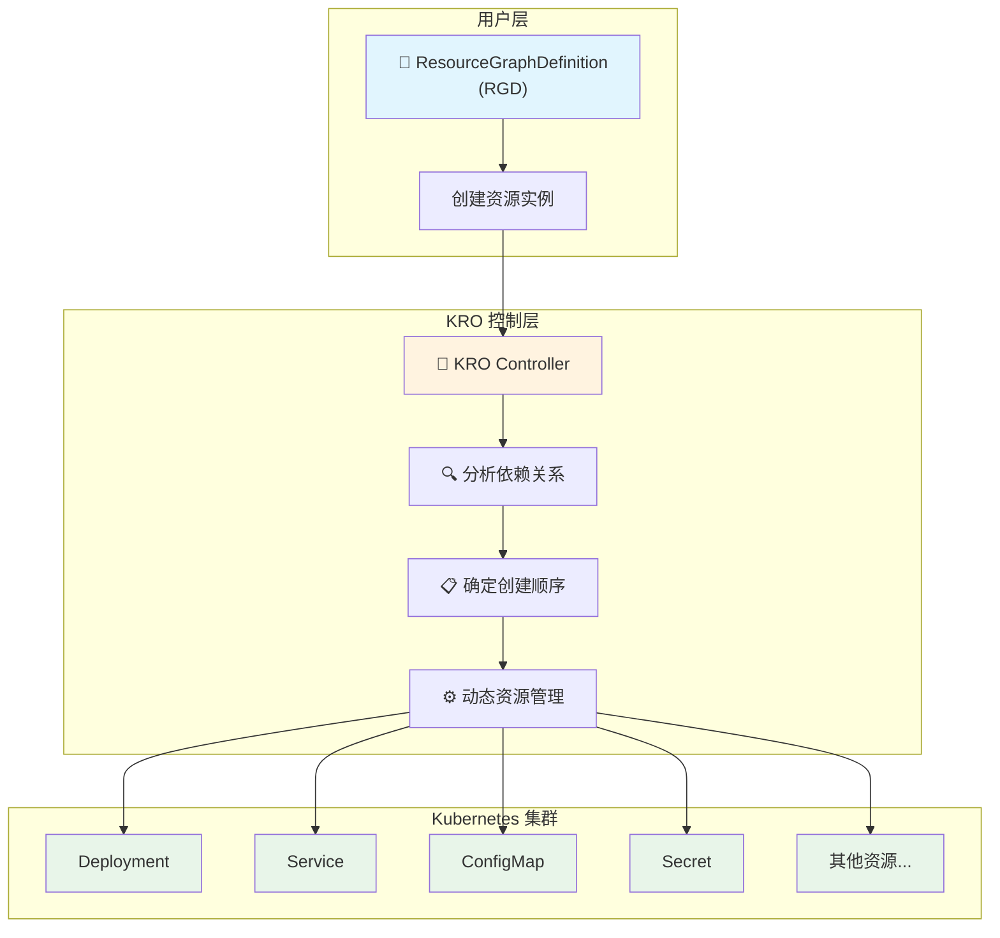

## 主要优势

| 特性                   | 说明                                           |
| ---------------------- | ---------------------------------------------- |
| <u>Kubernetes 原生</u> | 无缝集成现有工具链，保留熟悉的操作流程         |
| <u>厂商无关</u>        | 不依赖任何特定云厂商                           |
| <u>统一管理</u>        | 通过**一个 CRD** 管理**多个关联资源**          |
| <u>依赖解析</u>        | 自动处理**资源间**的**依赖关系**和**创建顺序** |

## 使用场景

1. 假设你需要部署一个典型的三层应用（前端 + 后端 + 数据库）
2. 通常需要**分别创建** Deployment、Service、ConfigMap、Secret 等多个资源，

> 使用 KRO 后，用户只需创建一个基于该 **RGD** 的**资源实例**，KRO 就会**自动创建和管理所有底层资源**

```yaml
apiVersion: kro.run/v1alpha1
kind: ResourceGraphDefinition
metadata:
  name: webapp
spec:
  resources:
    # 一次定义，包含所有相关资源
    - deployment: {...}
    - service: {...}
    - configmap: {...}
```

## 核心价值

1. KRO 的价值在于将**复杂的多资源组合**<u>抽象</u>成**单一的自定义资源**
2. 让应用开发者能够以<u>更简洁的方式</u>定义和管理 Kubernetes 上的复杂应用栈

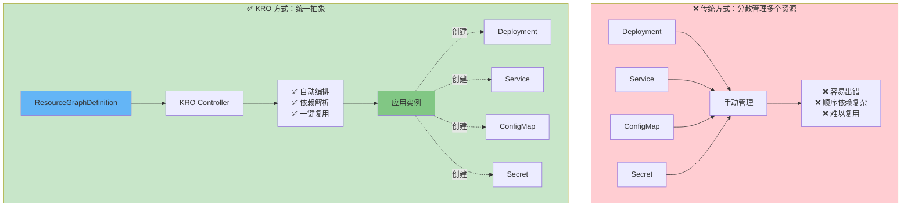

# 常见问题

## KRO 是什么？

> Kube Resource Orchestrator (**KRO**) 是一个 **Kubernetes Operator**，用于简化**复杂 Kubernetes 资源配置**的创建

### 核心要素

| 概念                                 | 说明                                      |
| ------------------------------------ | ----------------------------------------- |
| <u>ResourceGraphDefinition (RGD)</u> | KRO 的**基础自定义资源**                  |
| <u>资源组</u>                        | 将**多个 K8s 资源**组合成一个**逻辑单元** |
| <u>功能关系</u>                      | 定义**资源之间**的**依赖**和**关联**      |

### 工作流程

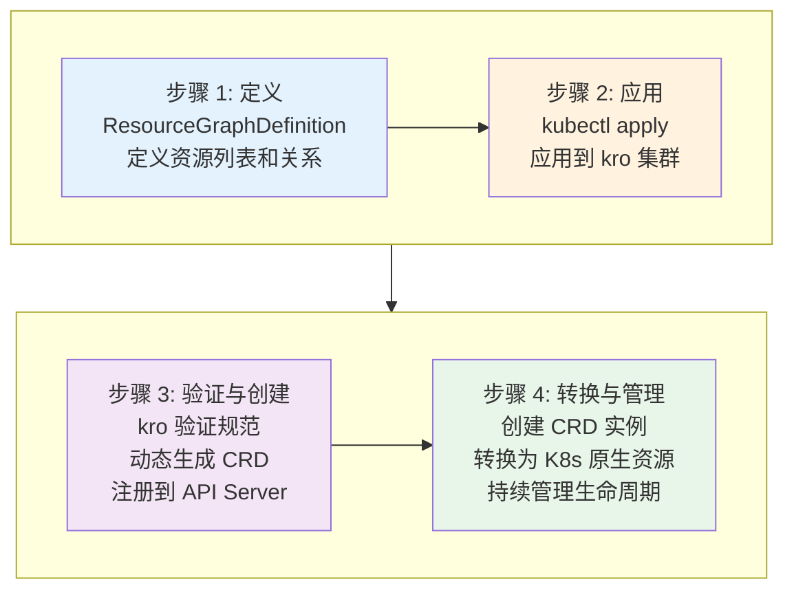

## KRO 如何工作？

### 核心机制

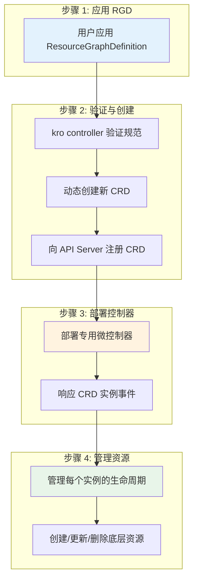


### 关键设计

| 特性                 | 说明                                    |
| -------------------- | --------------------------------------- |
| <u>原生 K8s 原语</u> | 使用 K8s 核心能力，**无额外依赖**       |
| <u>动态 CRD 生成</u> | 自动为每个 **RGD** 创建对应的 **CRD**   |
| <u>微控制器架构</u>  | 每个 **RGD** 有**专用的控制器管理实例** |

## 如何使用 KRO？

### 基本步骤

```
定义 → 应用 → 创建实例 → 自动管理
```

### 示例场景

#### 简单场景：WebApp

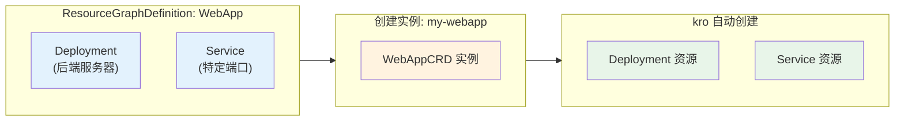

#### 复杂场景：WebAppWithDB (组合现有 RGD)

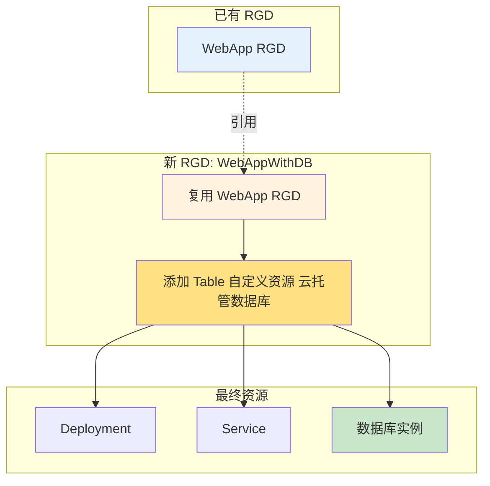

### 使用流程总结

| 步骤 | 操作                              | KRO 自动处理     |
| ---- | --------------------------------- | ---------------- |
| 1    | 编写 ResourceGraphDefinition YAML | -                |
| 2    | kubectl apply **RGD** 到集群      | **创建 CRD**     |
| 3    | 部署微控制器                      | 部署控制器       |
| 4    | 创建 **CRD 实例**                 | 管理所有底层资源 |

## 为什么构建这个项目？

### 问题背景

| 痛点              | 说明                     | KRO 解决方案                             |
| ----------------- | ------------------------ | ---------------------------------------- |
| <u>多资源协同</u> | 需要同时管理多个相关资源 | **统一资源组**，一次性管理               |
| <u>依赖复杂</u>   | 资源间依赖关系难以维护   | **自动解析依赖**，智能编排               |
| <u>编排困难</u>   | 规模扩大后手动管理复杂   | **微控制器**自动管理生命周期             |
| <u>配置繁琐</u>   | 重复配置相似资源组合     | **可复用**的 **ResourceGraphDefinition** |

### 设计目标

| 目标            | 说明                                       |
| --------------- | ------------------------------------------ |
| <u>简化构建</u> | 降低 **K8s 上层应用开发**的复杂度          |
| <u>依赖管理</u> | 自动处理资源间的**依赖关系**               |
| <u>可扩展性</u> | 支持**简单**和**复杂**的自定义资源         |
| <u>标准化</u>   | 提供**统一**、**可复用**的**资源组合**方式 |

## API 变更说明

### 当前状态

```
API 版本: v1alpha1
状态:     早期开发阶段
稳定性:   可能有破坏性变更
```

### 承诺与保障

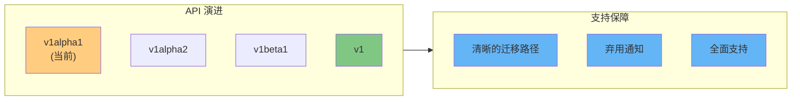

### 使用建议

| 注意事项 | 说明                        |
| -------- | --------------------------- |
| 跟进更新 | 关注版本发布和变更日志      |
| 测试迁移 | 在升级前测试新的 API 版本   |
| 社区反馈 | 参与项目讨论，影响 API 设计 |

## 总结

| 方面 | 核心要点                               |
| ---- | -------------------------------------- |
| 定位 | 简化复杂 K8s 资源编排的 **Operator**   |
| 机制 | **动态 CRD 生成** + **微控制器管理**   |
| 价值 | **统一资源组合** + **自动依赖解析**    |
| 现状 | v1alpha1，积极开发中                   |
| 适用 | 需要管理**多资源组合**的**应用开发者** |

# What is kro?

## KRO 是什么？

> KRO 的本质

```
将一组 Kubernetes 资源 → 可复用的 API
```

> 三步定义流程

| 步骤 | 操作                | 说明                                |
| ---- | ------------------- | ----------------------------------- |
| ①    | **定义 API Schema** | 描述**用户接口**（**输入参数**）    |
| ②    | **YAML 描述资源**   | **定义底层 Kubernetes 资源**        |
| ③    | **CEL 表达式连接**  | 用 **CEL** 将**参数**绑定到**资源** |

> KRO 自动完成的工作 - **Schema** + **Resources** + **CEL**

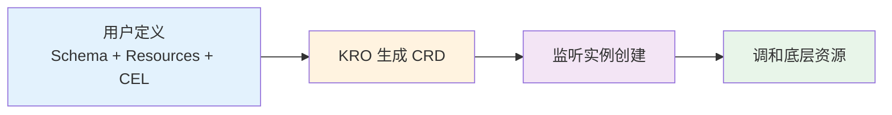

## ResourceGraphDefinition (RGD) 详解

### RGD 的角色

> RGD = **蓝图**

| Key              | Value                        |
| ---------------- | ---------------------------- |
| 描述**接口**     | **用户交互的界面**           |
| 描述**资源输出** | 每个**实例**应生成的**资源** |

### RGD 组成结构

| 组件           | 作用                       | 示例                                     |
| -------------- | -------------------------- | ---------------------------------------- |
| **API Schema** | 定义**用户**可见的**接口** | replicas, image, port                    |
| **Resources**  | 声明**底层 K8s 资源**      | Deployment, Service, ConfigMap           |
| **CEL 表达式** | 连接**参数**与**资源**     | spec.replicas → deployment.spec.replicas |

## 提前验证机制

### 验证时机

| Key      | Value                |
| -------- | -------------------- |
| 传统方式 | **运行时**才发现错误 |
| RGD 方式 | **定义时**捕获错误   |

### 验证内容

| 错误类型       | RGD 验证时机 | 传统方式 |
| -------------- | ------------ | -------- |
| Schema 错误    | 定义时 ❌→✅   | 运行时   |
| CEL 表达式无效 | 定义时 ❌→✅   | 运行时   |
| 引用错误       | 定义时 ❌→✅   | 运行时   |

### 价值对比

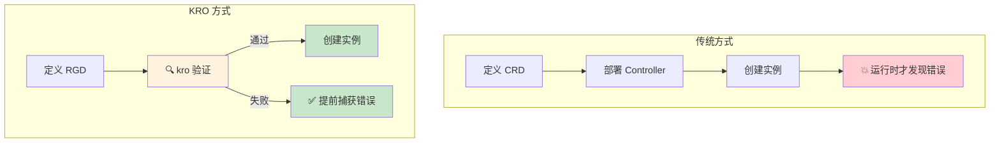

## 完整工作流示例

### 示例：定义一个 WebApp RGD

```yaml
# 1. API Schema - 用户接口
apiVersion: kro.run/v1alpha1
kind: ResourceGraphDefinition
metadata:
  name: webapp
spec:
  schema:
    # 用户可配置的参数
    properties:
      replicas:
        type: integer
      image:
        type: string
      port:
        type: integer

  # 2. Resources - 底层资源
  resources:
    - deployment:
        spec:
          replicas: "${spec.replicas}"  # 3. CEL 表达式
          template:
            spec:
              containers:
                - image: "${spec.image}"

    - service:
        spec:
          ports:
            - port: "${spec.port}"
```

### 从定义到运行

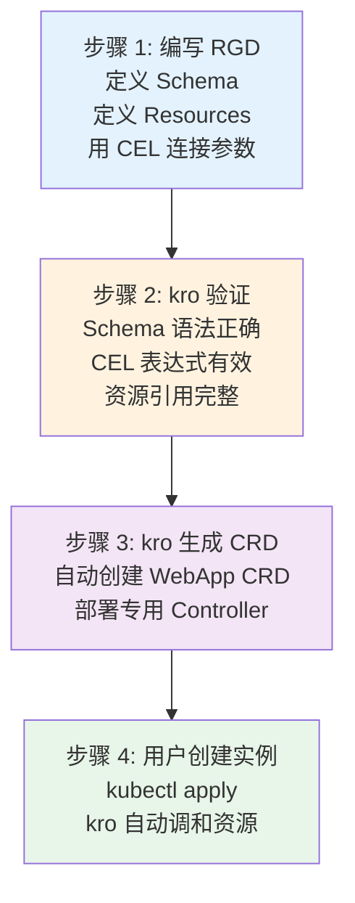

## 核心价值总结

| 特性     | 传统 Operator 开发                          | KRO 方式               |
| -------- | ------------------------------------------- | ---------------------- |
| 定义方式 | 手写 **Go** 代码 + **CRD**                  | **YAML** + **CEL**     |
| 验证时机 | **运行时**                                  | **定义时**             |
| 学习曲线 | **陡峭**（需要掌握 **Controller-Runtime**） | **平缓**（YAML + CEL） |
| 开发速度 | 慢                                          | 快                     |
| 维护成本 | 高                                          | 低                     |
| 复用性   | 需要额外设计                                | **天然支持 RGD 组合**  |


# How it works

## RGD 的两个核心部分

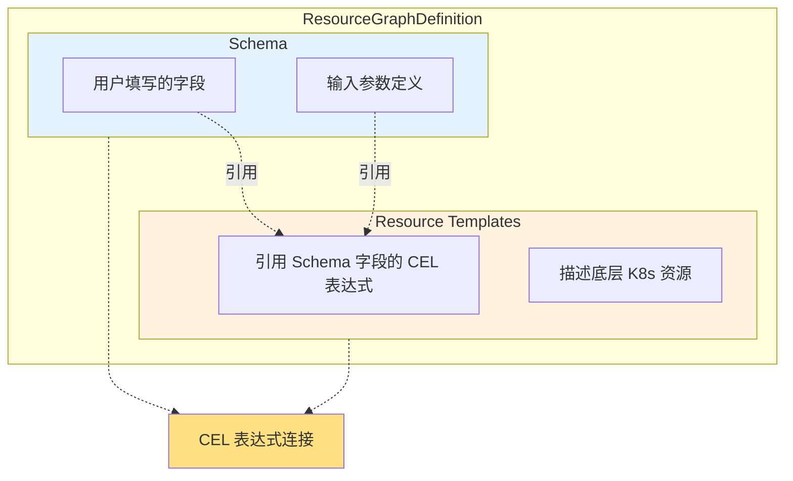

> Schema vs Resource Templates

| 方面     | Schema                           | Resource Templates           |
| -------- | -------------------------------- | ---------------------------- |
| 作用     | **定义 API 接口**                | **描述底层资源**             |
| 目标用户 | **终端用户**                     | kro 内部处理                 |
| 内容     | **字段名**、**类型**、**默认值** | **K8s 资源 YAML** + **CEL**  |
| 示例     | replicas: integer                | replicas: "${spec.replicas}" |

## CEL 表达式的连接作用

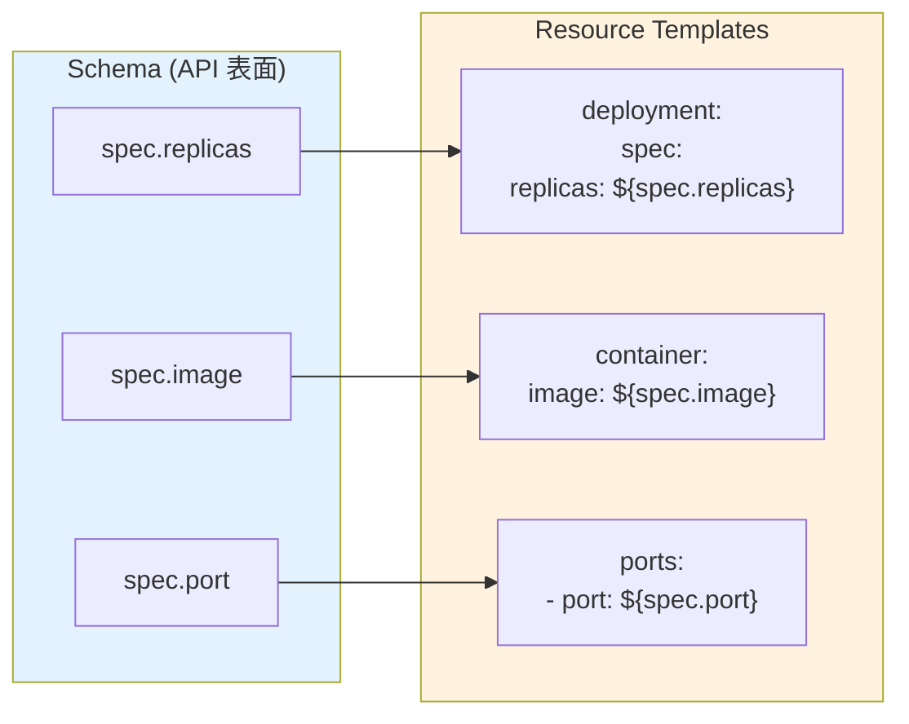

> CEL 示例

```yaml
# Schema 部分
schema:
  properties:
    replicas: { type: integer }
    image: { type: string }
    port: { type: integer }

# Resource Templates 部分
resources:
  - deployment:
      spec:
        replicas: "${spec.replicas}"        # CEL 引用
        template:
          spec:
            containers:
              - image: "${spec.image}"      # CEL 引用
                ports:
                  - containerPort: "${spec.port}"  # CEL 引用
```

## kro 的处理流程

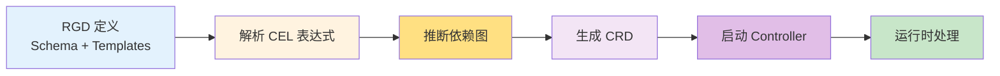

> 详细步骤说明

| 步骤                   | 操作                        | 说明                      |
| ---------------------- | --------------------------- | ------------------------- |
| <u>解析 CEL</u>        | 分析所有 CEL 表达式         | 提取字段引用关系          |
| <u>推断依赖图</u>      | 基于**表达式**构建依赖      | 确定**资源创建顺序**      |
| <u>生成 CRD</u>        | 自动创建 **OpenAPI** schema | **注册到 Kubernetes API** |
| <u>启动 Controller</u> | 部署**专用微控制器**        | **监听实例变化**          |
| <u>运行时</u>          | 全部**动态完成**            | 无需**预编译**或**重启**  |

## 依赖图推断示例

> 输入：RGD 定义

```yaml
resources:
  - configMap:                    # 资源 1
      data:
        config: "${spec.config}"

  - deployment:                   # 资源 2（依赖 ConfigMap）
      spec:
        template:
          spec:
            containers:
              - envFrom:
                  - configMapRef:
                      name: "${configMap.metadata.name}"

  - service:                      # 资源 3（依赖 Deployment）
      spec:
        selector:
          app: "${deployment.metadata.labels.app}"
```

> kro 自动推断的依赖图

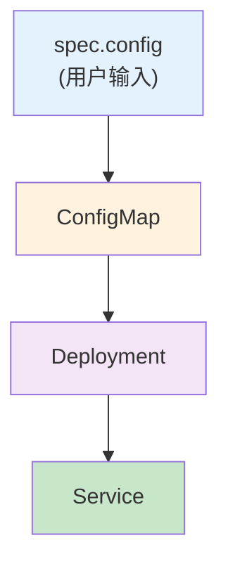

> 创建顺序

| 顺序 | 资源       | 原因                     |
| ---- | ---------- | ------------------------ |
| 1    | ConfigMap  | 无依赖，首先创建         |
| 2    | Deployment | 引用 ConfigMap           |
| 3    | Service    | 引用 Deployment 的 label |

## 运行时生成的意义

| 维度     | 传统 Operator                 | KRO                         |
| -------- | ----------------------------- | --------------------------- |
| 开发语言 | **Go**                        | **YAML** + **CEL**          |
| 构建流程 | **编译构建** → **部署二进制** | **直接应用** → **动态生成** |
| 修改生效 | ❌ 需重新编译                  | ✅ 修改即生效                |
| 技能要求 | ❌ 需掌握 Go                   | ✅ 只需 YAML + CEL           |
| 开发周期 | ❌ 周期长                      | ✅ 快速迭代                  |

## 官方示例


# In practice

## 用户视角：使用生成的 API

### 创建 WebApp 实例

```yaml
apiVersion: kro.run/v1alpha1
kind: WebApp
metadata:
  name: my-app
spec:
  image: nginx
  bucketName: my-app-assets
```

### kro 自动创建的资源

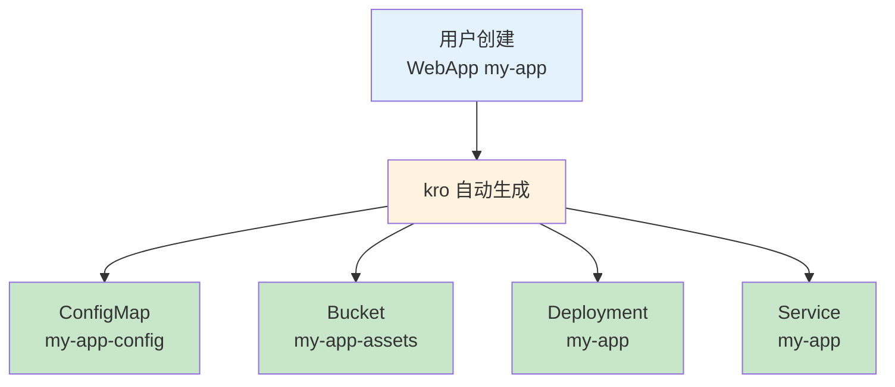


### 查看状态反馈

```
$ kubectl get webapp my-app -o yaml
status:
  bucketArn: arn:aws:s3:::my-app-assets  # kro 回写有用信息
```

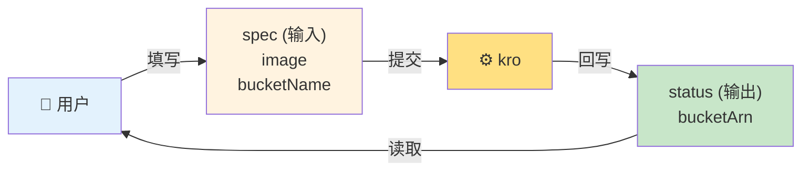

## RGD 定义结构解析

### 完整结构图

```
┌─────────────────────────────────────────────────────────────┐
│              ResourceGraphDefinition: webapp                │
├─────────────────────────────────────────────────────────────┤
│                                                             │
│  spec.schema                                                │
│  ├─ apiVersion: v1alpha1                                   │
│  ├─ kind: WebApp                                           │
│  ├─ spec:                                                  │
│  │   ├─ image: string (default=nginx)                      │
│  │   └─ bucketName: string                                 │
│  └─ status:                                                │
│      └─ bucketArn: ${bucket.status.arn}  ◄── CEL 输出      │
│                                                             │
│  spec.resources                                            │
│  ├─ config (ConfigMap)                                     │
│  ├─ bucket (S3 Bucket)                                     │
│  ├─ deployment (Deployment)                                │
│  └─ service (Service)                                      │
│                                                             │
└─────────────────────────────────────────────────────────────┘
```

### Schema 部分：定义 API

| 字段             | 类型   | 默认值 | 说明             |
| ---------------- | ------ | ------ | ---------------- |
| image            | string | nginx  | 容器镜像         |
| bucketName       | string | 必填   | S3 存储桶名称    |
| status.bucketArn | -      | -      | 输出：存储桶 ARN |

## 资源模板详解

### 资源 1：ConfigMap

```yaml
- id: config
  template:
    apiVersion: v1
    kind: ConfigMap
    metadata:
      name: ${schema.metadata.name}-config  # 引用实例名称
    data:
      APP_NAME: ${schema.metadata.name}
```

```
┌─────────────────────────────────────────────────────────────┐
│  ConfigMap 生成逻辑                                          │
├─────────────────────────────────────────────────────────────┤
│                                                             │
│  输入: metadata.name = "my-app"                             │
│                    │                                        │
│                    ▼                                        │
│  ${schema.metadata.name}          → my-app                  │
│  ${schema.metadata.name}-config   → my-app-config           │
│                                                             │
│  输出: ConfigMap named "my-app-config"                       │
│                                                             │
└─────────────────────────────────────────────────────────────┘
```

### 资源 2：S3 Bucket

```yaml
- id: bucket
  template:
    apiVersion: s3.services.k8s.aws/v1alpha1
    kind: Bucket
    metadata:
      name: ${schema.spec.bucketName}
    spec:
      name: ${schema.spec.bucketName}
```

```
┌─────────────────────────────────────────────────────────────┐
│  Bucket 生成逻辑                                             │
├─────────────────────────────────────────────────────────────┤
│                                                             │
│  输入: spec.bucketName = "my-app-assets"                    │
│                    │                                        │
│                    ▼                                        │
│  ${schema.spec.bucketName}   → my-app-assets                │
│                                                             │
│  输出: S3 Bucket named "my-app-assets"                      │
│  状态: bucket.status.arn (异步生成)                          │
│                                                             │
└─────────────────────────────────────────────────────────────┘
```

### 资源 3：Deployment

```yaml
- id: deployment
  template:
    spec:
      containers:
        - name: app
          image: ${schema.spec.image}           # 引用用户输入
          envFrom:
            - configMapRef:
                name: ${config.metadata.name}   # 引用 ConfigMap
          env:
            - name: BUCKET_ARN
              value: ${bucket.status.arn}       # 引用 Bucket 状态
```

### 资源 4：Service

```yaml
- id: service
  template:
    spec:
      selector: ${deployment.spec.selector.matchLabels}  # 引用 Deployment
```

## kro 的依赖解析

### 自动推断的依赖图

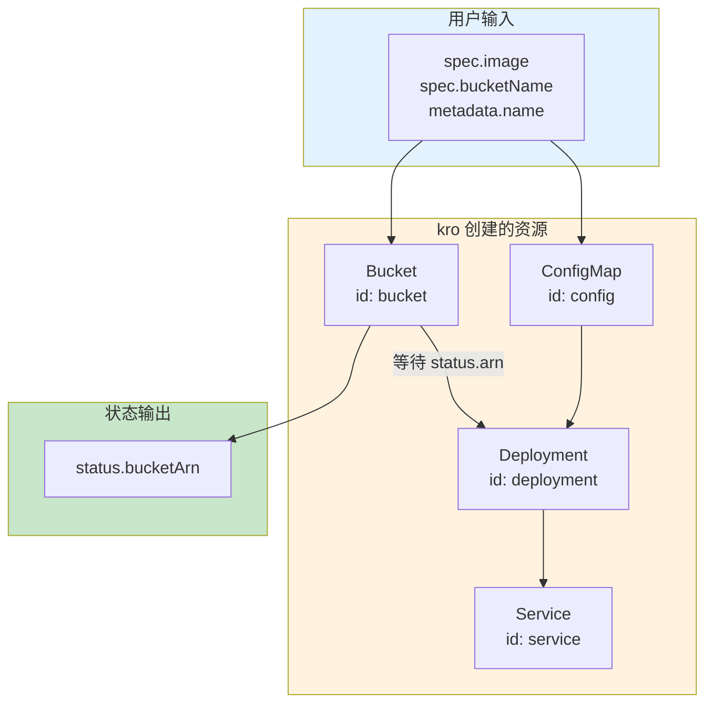

### 创建顺序与时序

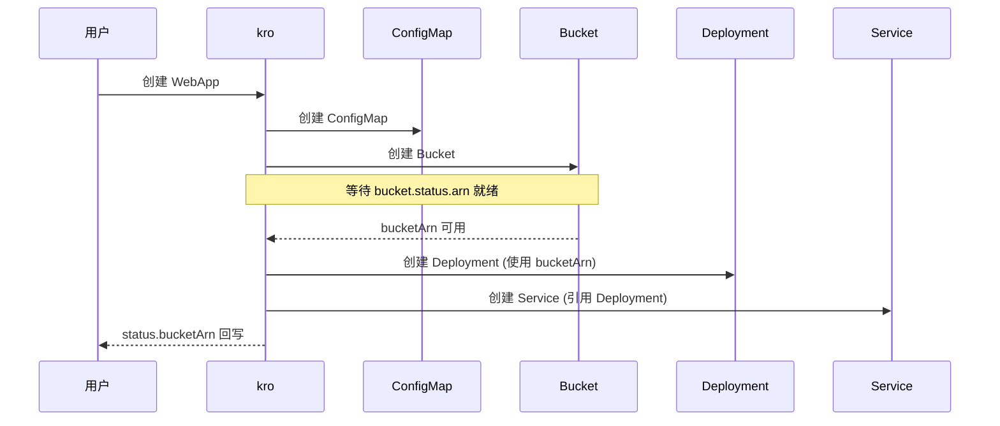

### 依赖规则总结

| 资源       | 依赖       | 原因                        |
| ---------- | ---------- | --------------------------- |
| ConfigMap  | 无         | 独立资源                    |
| Bucket     | 无         | 独立资源                    |
| Deployment | ConfigMap  | ${config.metadata.name}     |
| Deployment | Bucket     | ${bucket.status.arn}        |
| Service    | Deployment | ${deployment.spec.selector} |

## kro 的智能等待机制

### 异步状态处理

```
┌─────────────────────────────────────────────────────────────┐
│              bucket.status.arn 的生命周期                    │
├─────────────────────────────────────────────────────────────┤
│                                                             │
│  1. apply RGD          → Bucket 创建开始                    │
│  2. Bucket Provisioning → status.arn: null                  │
│  3. kro 等待            → Deployment 暂停创建                │
│  4. Bucket Ready        → status.arn: "arn:aws:..."         │
│  5. kro 检测到          → Deployment 继续创建                │
│                                                             │
└─────────────────────────────────────────────────────────────┘
```

### kro 如何知道依赖关系

| CEL 引用类型                | kro 推断             |
| --------------------------- | -------------------- |
| ${schema.spec.*}            | 用户输入，无依赖     |
| ${config.metadata.name}     | 依赖 config 资源     |
| ${bucket.status.arn}        | 依赖 bucket 及其状态 |
| ${deployment.spec.selector} | 依赖 deployment 资源 |

## 资源引用映射表

| 资源 ID    | 类型       | 引用的变量                                                   | 依赖               |
| ---------- | ---------- | ------------------------------------------------------------ | ------------------ |
| config     | ConfigMap  | ${schema.metadata.name}                                      | 无                 |
| bucket     | Bucket     | ${schema.spec.bucketName}                                    | 无                 |
| deployment | Deployment | `${schema.spec.image}`<br />`${config.metadata.name}`<br />`${bucket.status.arn}` | config<br />bucket |
| service    | Service    | ${deployment.spec.selector}                                  | deployment         |

## 关键要点

| 特性                       | 说明                                                         |
| -------------------------- | ------------------------------------------------------------ |
| <u>1 个实例 → N 个资源</u> | 用户创建 1 个 WebApp，kro 创建 4 个底层资源                  |
| <u>双向绑定</u>            | **spec 输入参数**，**status 回写状态**                       |
| <u>自动依赖解析</u>        | kro 分析 **CEL 表达式**自动推断依赖图                        |
| <u>智能等待</u>            | 等待**异步状态**（如 bucketArn）就绪后再继续                 |
| <u>任意资源</u>            | 支持**原生 K8s 资源**和**任何 CRD**（ACK/ASO/Config Connector） |
| <u>统一接口</u>            | **复杂的多资源组合**简化为**单一 API**                       |

# What kro handles for you

## Simple Schema - 内联 API 定义

### 传统方式 vs KRO

```
┌─────────────────────────────────────────────────────────────┐
│              传统 OpenAPI Schema vs KRO Simple Schema        │
├─────────────────────────────────────────────────────────────┤
│                                                             │
│  传统 OpenAPI (冗长):           KRO Simple Schema (简洁):    │
│  ┌─────────────────────┐         ┌─────────────────────┐   │
│  │ openAPI: 3.0.0      │         │ spec:               │   │
│  │ info:               │         │   replicas: int |    │   │
│  │   title: WebApp     │         │     default=1       │   │
│  │   version: 1.0.0    │         │   image: string |   │   │
│  │ paths: {...}        │         │     required        │   │
│  │ components:         │         │   port: int |        │   │
│  │   schemas:          │         │     min=1 max=65535  │   │
│  │     WebAppSpec:     │         │                      │   │
│  │       type: object  │         └─────────────────────┘   │
│  │       properties:    │                                │
│  │         replicas:    │     一行搞定！                   │
│  │           type:      │                                │
│  │             integer  │                                │
│  │         image:       │                                │
│  │           type:      │                                │
│  │             string   │                                │
│  │       required:      │                                │
│  │         - image      │                                │
│  └─────────────────────┘                                 │
│                                                             │
└─────────────────────────────────────────────────────────────┘
```

### 语法示例

| 特征     | 语法              | 示例                                      |
| -------- | ----------------- | ----------------------------------------- |
| 类型声明 | fieldName: type   | replicas: int                             |
| 默认值   | `| default=value` | `image: string | default=nginx`           |
| 必填     | required          | `image: string | required`                |
| 约束     | min= max=         | `port: int | min=1 max=65535`             |
| 组合     | 链式约束          | `count: int | default=1 | min=1 | max=10` |

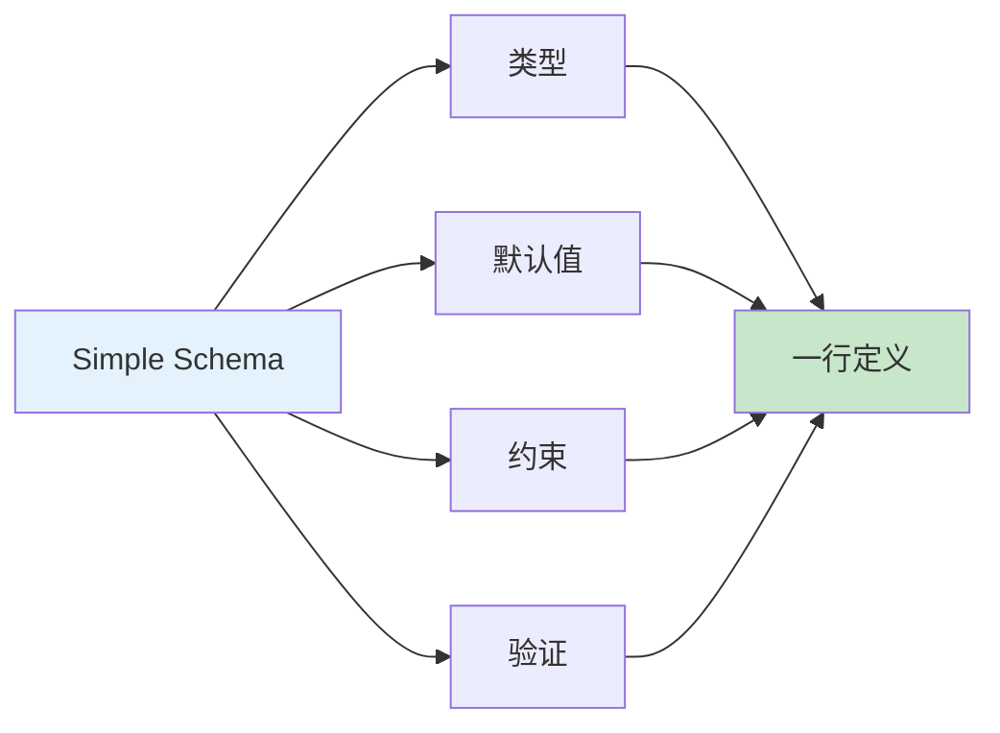

## Wires data that doesn't exist yet - 连接尚不存在的数据

### 问题场景

```
┌─────────────────────────────────────────────────────────────┐
│              异步资源创建的"鸡生蛋"问题                       │
├─────────────────────────────────────────────────────────────┤
│                                                             │
│  Deployment 需要                                            │
│  bucketArn ←─────────────────────────────┐                  │
│     │                                    │                  │
│     │ 但 Bucket 还没创建！                 │                  │
│     │                                    │                  │
│     ▼                                    │                  │
│  ┌─────────────┐                         │                  │
│  │   Bucket    │                         │                  │
│  │  (异步创建)  │ ─────────────────────────┘                  │
│  │             │  status.arn 稍后才可用                      │
│  └─────────────┘                                            │
│                                                             │
└─────────────────────────────────────────────────────────────┘
```

### kro 的解决方案

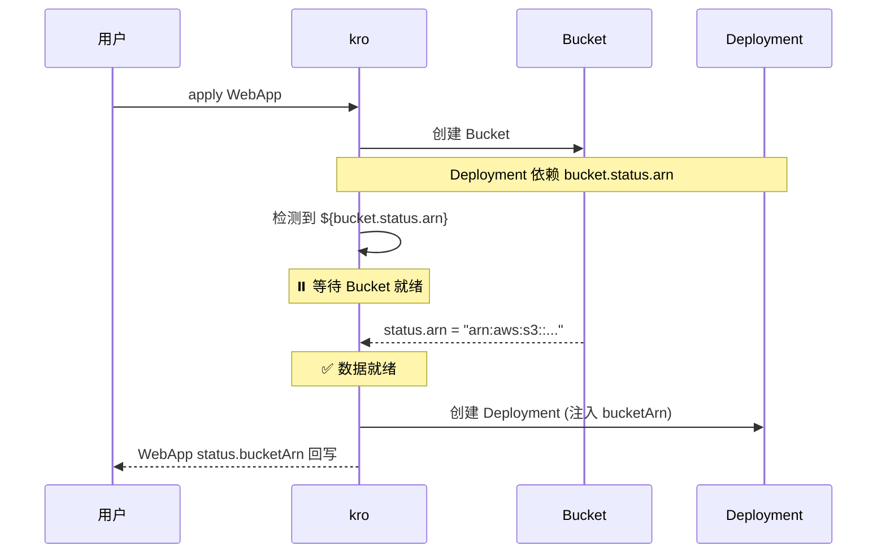

### 对比

| 方式     | 传统 Controller                        | KRO      |
| -------- | -------------------------------------- | -------- |
| 处理异步 | 手写 **Reconcile 循环** + **重试**逻辑 | 自动等待 |
| 代码量   | ~50-100 行                             | 1 行 CEL |
| 错误处理 | 需要处理**超时**、**失败**             | 内置处理 |

## Infers ordering from expressions - 从表达式推断顺序

### 无需声明顺序

```
┌─────────────────────────────────────────────────────────────┐
│              传统方式 vs KRO                                 │
├─────────────────────────────────────────────────────────────┤
│                                                             │
│  传统方式:              KRO:                                │
│  ┌─────────────────┐   ┌─────────────────┐                │
│  │ resources:      │   │ resources:      │                │
│  │   - name: db    │   │   - db          │                │
│  │     order: 1    │   │     connStr:    │                │
│  │   - name: app   │   │       ${db.     │                │
│  │     order: 2    │   │         connStr} │                │
│  │     dependsOn:  │   │   - app         │                │
│  │       - db      │   │     image: ...  │                │
│  └─────────────────┘   └─────────────────┘                │
│  ❌ 手动管理顺序        ✅ CEL 自动推断                      │
│                                                             │
└─────────────────────────────────────────────────────────────┘
```

### 推断示例

```yaml
resources:
  - id: db
    template: ...

  - id: app
    template:
      env:
        - name: DB_CONN
          value: ${db.status.connString}  # ← 引用 db，自动推断依赖
```

```mermaid
flowchart LR
    A["db 资源"] -->|"${db.status.connString}"| B["app 资源"]

    style A fill:#e3f2fd
    style B fill:#c8e6c9
```

### 依赖图自动生成

```mermaid
flowchart TB
    R1["config"] --> E1["CEL 引用"]
    R2["bucket"] --> E2["CEL 引用"]
    R3["deployment"] --> E3["CEL 引用"]
    R4["service"] --> E3

    E1 --> O1["kro 推断顺序"]
    E2 --> O1
    E3 --> O1

    O1 --> O2["1 config 2 bucket"]
    O2 --> O3["3 deployment"]
    O3 --> O4["4 service"]

    style R1 fill:#e3f2fd
    style R2 fill:#e3f2fd
    style R3 fill:#e3f2fd
    style R4 fill:#e3f2fd
    style E1 fill:#fff3e0
    style E2 fill:#fff3e0
    style E3 fill:#fff3e0
    style O4 fill:#c8e6c9
```

## Conditional resources - 条件资源

### 语法

```yaml
resources:
  - id: standardStorage
    if: "${schema.storageType == 'standard'}"  # 条件表达式
    template:
      spec:
        storageClass: standard

  - id: premiumStorage
    if: "${schema.storageType == 'premium'}"  # 条件表达式
    template:
      spec:
        storageClass: premium
```

### 行为

```
┌─────────────────────────────────────────────────────────────┐
│              条件资源的级联跳过                               │
├─────────────────────────────────────────────────────────────┤
│                                                             │
│  storageType = "standard"                                   │
│       │                                                      │
│       ▼                                                      │
│  ┌─────────────────┐         ┌─────────────────┐           │
│  │ standardStorage │ ──────▶ │  依赖它的资源    │           │
│  │   ✅ 创建        │          │   ✅ 创建        │           │
│  └─────────────────┘         └─────────────────┘           │
│                                                             │
│  ┌─────────────────┐         ┌─────────────────┐           │
│  │ premiumStorage  │ ──────▶ │  依赖它的资源    │           │
│  │   ⏭️ 跳过        │          │   ⏭️ 跳过        │           │
│  └─────────────────┘         └─────────────────┘           │
│                                                             │
└─────────────────────────────────────────────────────────────┘
```

### 级联跳过示例

```mermaid
flowchart TB
    A["storageType = premium"]

    B["standardStorage<br/>if: type == 'standard'<br/>⏭️ 跳过"]

    C["dependsOnStandard<br/>⏭️ 级联跳过"]

    D["premiumStorage<br/>if: type == 'premium'<br/>✅ 创建"]

    E["dependsOnPremium<br/>✅ 创建"]

    A --> B
    B -.依赖.-> C
    A --> D
    D --> E

    style B fill:#ffcdd2
    style C fill:#ffcdd2
    style D fill:#c8e6c9
    style E fill:#c8e6c9
```

## One template, many resources - forEach

### 语法

```yaml
resources:
  - id: shards
    forEach: "${range(0, schema.replicas)}"  # 生成多个资源
    template:
      apiVersion: v1
      kind: ConfigMap
      metadata:
        name: ${schema.metadata.name}-shard-${forEach.index}
      data:
        shardId: ${forEach.index}
```

### 效果

```
输入: replicas = 3

输出:
  ├─ ConfigMap: my-app-shard-0  (index=0)
  ├─ ConfigMap: my-app-shard-1  (index=1)
  └─ ConfigMap: my-app-shard-2  (index=2)
```

```mermaid
flowchart LR
    Input["replicas = 3"]

    Template["forEach Template"]

    R1["shard-0<br/>index=0"]
    R2["shard-1<br/>index=1"]
    R3["shard-2<br/>index=2"]

    Input --> Template
    Template --> R1
    Template --> R2
    Template --> R3

    style Input fill:#e3f2fd
    style Template fill:#fff3e0
    style R1 fill:#c8e6c9
    style R2 fill:#c8e6c9
    style R3 fill:#c8e6c9
```

### forEach 变量

| 变量             | 说明     | 示例                 |
| ---------------- | -------- | -------------------- |
| ${forEach.index} | 当前索引 | 0, 1, 2, ...         |
| ${forEach.value} | 当前值   | 遍历**列表**时的元素 |
| ${forEach.key}   | 当前键   | 遍历**对象**时的键   |

## Non-Turing complete by design - 非图灵完备设计

### 图灵完备

#### 基本定义

1. 图灵完备是指一个**计算系统**能够**模拟图灵机**的所有功能
2. 简单来说：只要一个系统图灵完备，它就**能计算任何可计算的函数**

```
┌─────────────────────────────────────────────────────────────┐
│                    图灵机                                   │
├─────────────────────────────────────────────────────────────┤
│                                                             │
│  由 Alan Turing 于 1936 年提出                              │
│  是现代计算机的理论模型                                      │
│  图灵完备 = 具备通用计算能力                                │
│                                                             │
└─────────────────────────────────────────────────────────────┘
```

#### 图灵完备的必要条件

> 一个系统要成为图灵完备，通常需要具备

| 条件         | 说明               | 示例               |
| ------------ | ------------------ | ------------------ |
| 条件分支     | if/else 判断       | if x > 0 { ... }   |
| 无限循环     | while/for 递归     | while true { ... } |
| 任意内存访问 | 读写任意位置的数据 | 数组、指针         |

```
┌─────────────────────────────────────────────────────────────┐
│              图灵完备的最小特征                              │
├─────────────────────────────────────────────────────────────┤
│                                                             │
│  ┌─────────┐    ┌─────────┐    ┌─────────┐                │
│  │  分支   │  + │  循环   │  + │  内存   │  = 图灵完备      │
│  │ if/else │    │ while  │    │ 读写    │                  │
│  └─────────┘    └─────────┘    └─────────┘                │
│                                                             │
└─────────────────────────────────────────────────────────────┘
```

#### 图灵完备 vs 非图灵完备

```mermaid
flowchart TB
    subgraph Turing["图灵完备语言"]
        T1["Python"]
        T2["JavaScript"]
        T3["Java"]
        T4["Go"]
        T5["C++"]
    end

    subgraph NonTuring["非图灵完备"]
        N1["CEL"]
        N2["SQL (大部分)"]
        N3["正则表达式"]
        N4["HTML + CSS"]
    end

    subgraph Capability["能力对比"]
        C1["无限循环: 有 vs 无"]
        C2["通用计算: 能 vs 不能"]
        C3["停机问题: 不可判定 vs 必然终止"]
    end

    Turing --> Capability
    NonTuring --> Capability

    style Turing fill:#c8e6c9
    style NonTuring fill:#e3f2fd
    style Capability fill:#fff3e0
```


> 详细对比

| 特性     | 图灵完备             | 非图灵完备           |
| -------- | -------------------- | -------------------- |
| 计算能力 | 可计算任何可计算函数 | 只能计算特定类型问题 |
| 无限循环 | ✅ 可能               | ❌ 不可能             |
| 停机问题 | ❌ 无法判定           | ✅ 保证终止           |
| 安全性   | 需要额外控制         | 内置安全             |
| 用途     | **通用编程**         | **配置、查询、模板** |

#### 在 KRO 中的意义

> 为什么 KRO 选择 CEL（非图灵完备）？

```
┌─────────────────────────────────────────────────────────────┐
│              KRO 的设计考量                                  │
├─────────────────────────────────────────────────────────────┤
│                                                             │
│  安全性 > 灵活性                                             │
│                                                             │
│  ┌─────────────────┐         ┌─────────────────┐          │
│  │   图灵完备       │   vs    │   非图灵完备     │          │
│  │                 │         │                 │          │
│  │ • 无限循环风险   │         │ • 保证终止       │          │
│  │ • 资源耗尽风险   │         │ • 性能可预测     │          │
│  │ • 难以审计       │         │ • 易于审计       │          │
│  │                 │         │                 │          │
│  │ ❌ 生产危险      │         │ ✅ 生产安全      │          │
│  └─────────────────┘         └─────────────────┘          │
│                                                             │
└─────────────────────────────────────────────────────────────┘
```

> 实际影响

| 场景       | 图灵完备语言   | CEL      |
| ---------- | -------------- | -------- |
| 表达式执行 | 可能永不结束   | 必然结束 |
| 资源消耗   | 不可预测       | 可预测   |
| 安全性     | 需要沙箱/超时  | 内置安全 |
| 审计       | 难以证明正确性 | 易于验证 |

 ### CEL 的安全特性

```
┌─────────────────────────────────────────────────────────────┐
│              CEL (Common Expression Language)               │
├─────────────────────────────────────────────────────────────┤
│                                                             │
│  ✅ 总是终止         不会有无限循环                          │
│  ✅ 无副作用         不会修改外部状态                        │
│  ✅ 类型检查         apply 时验证类型                        │
│  ✅ 可证明性         可以证明定义的行为                       │
│                                                             │
│  ❌ 没有 while 循环                                         │
│  ❌ 没有递归                                                 │
│  ❌ 没有文件 I/O                                            │
│  ❌ 没有网络调用                                            │
│                                                             │
└─────────────────────────────────────────────────────────────┘
```

### 对比

| 特性         | 通用脚本语言   | CEL            |
| ------------ | -------------- | -------------- |
| 图灵完备     | ✅ 是           | ❌ 否           |
| 无限循环风险 | ✅ 存在         | ❌ 不可能       |
| 副作用       | ✅ 可能有       | ❌ 无           |
| 类型安全     | **运行时检查** | **编译时检查** |
| 性能预测     | 不可预测       | 可预测         |

### 安全示例

```yaml
# ✅ CEL - 安全
template:
  replicas: "${schema.replicas + 1}"  # 简单表达式，必然终止

# ❌ 如果用通用语言 - 危险
template:
  replicas: |
    while true:      # 可能无限循环！
      replicas += 1
```

```mermaid
flowchart LR
    subgraph CEL["CEL 表达式"]
        A["确定性行为"]
        B["必然终止"]
        C["类型安全"]
    end

    subgraph Result["结果"]
        D["可预测"]
        E["可审计"]
        F["生产安全"]
    end

    CEL --> Result

    style CEL fill:#e3f2fd
    style Result fill:#c8e6c9
```

## 特性对比总结

| 特性        | 传统 Controller  | KRO                |
| ----------- | ---------------- | ------------------ |
| Schema 定义 | OpenAPI 冗长     | Simple Schema 一行 |
| 异步状态    | 手写重试逻辑     | 自动等待           |
| 依赖顺序    | 手动声明         | CEL 自动推断       |
| 条件资源    | if/else 代码块   | if 表达式          |
| 批量创建    | for 循环代码     | forEach            |
| 安全性      | 图灵完备，有风险 | CEL 非图灵完备     |
| 类型检查    | 运行时           | 应用时             |

```mermaid
flowchart TB
    subgraph Traditional["传统 Operator 开发"]
        T1["~500+ 行 Go 代码"]
        T2["手动处理所有逻辑"]
        T3["需要测试各种边界情况"]
    end

    subgraph KRO_Approach["KRO 方式"]
        K1["~50 行 YAML"]
        K2["kro 自动处理"]
        K3["内置安全保证"]
    end

    subgraph Value["价值"]
        V1["开发效率 10x 提升"]
        V2["更少的 bug"]
        V3["更快的迭代"]
    end

    Traditional -->|"替代"| KRO_Approach --> Value

    style Traditional fill:#ffcdd2
    style KRO_Approach fill:#c8e6c9
    style Value fill:#e1f5fe
```

# Quick Start

## 什么是 ResourceGraphDefinition (RGD)？

### 核心概念

```
┌─────────────────────────────────────────────────────────────┐
│              RGD = 多资源组合的蓝图                           │
├─────────────────────────────────────────────────────────────┤
│                                                             │
│  用户只需要创建一个 API 实例                                 │
│            │                                               │
│            ▼                                               │
│  kro 自动创建并管理多个关联资源                              │
│                                                             │
│  ┌─────────────────────────────────────────────────┐       │
│  │           Application API                       │       │
│  │  ┌─────────┐  ┌─────────┐  ┌─────────┐         │       │
│  │  │Deployment│  │ Service │  │ Ingress │         │       │
│  │  └─────────┘  └─────────┘  └─────────┘         │       │
│  └─────────────────────────────────────────────────┘       │
│                                                             │
└─────────────────────────────────────────────────────────────┘
```

### kro 在幕后做什么

```mermaid
flowchart TB
    A["用户创建 RGD"] --> B["构建 DAG 依赖图"]
    B --> C["验证资源定义"]
    C --> D["确定部署顺序"]
    D --> E["创建 CRD"]
    E --> F["监听并服务实例"]

    style A fill:#e3f2fd
    style B fill:#fff3e0
    style C fill:#fff3e0
    style D fill:#fff3e0
    style E fill:#f3e5f5
    style F fill:#c8e6c9
```

| 步骤     | 说明                                       |
| -------- | ------------------------------------------ |
| 构建 DAG | 将资源视为**有向无环图**，理解**依赖关系** |
| 验证定义 | 检查**资源定义**是否正确                   |
| 确定顺序 | 检测正确的**部署顺序**                     |
| 创建 CRD | 在**集群**中创建新的 **API**               |
| 监听实例 | 配置自己**监听和服务该 API** 的**实例**    |

## 前置条件

| 条件    | 说明                      |
| ------- | ------------------------- |
| kro     | 已安装并在 K8s 集群中运行 |
| kubectl | 已安装并配置连接到集群    |

## 创建 RGD

### 完整结构图

```
┌─────────────────────────────────────────────────────────────┐
│          ResourceGraphDefinition: my-application            │
├─────────────────────────────────────────────────────────────┤
│                                                             │
│  schema (API 表面)                                           │
│  ├─ kind: Application                                       │
│  ├─ spec:                                                   │
│  │   ├─ name: string                                        │
│  │   ├─ image: string (default=nginx)                       │
│  │   ├─ replicas: integer (default=3)                       │
│  │   └─ ingress.enabled: boolean (default=false)            │
│  └─ status:                                                 │
│      ├─ deploymentConditions                                │
│      └─ availableReplicas                                   │
│                                                             │
│  resources (底层资源)                                        │
│  ├─ deployment → Deployment                                 │
│  ├─ service → Service                                       │
│  └─ ingress → Ingress (条件创建)                             │
│                                                             │
└─────────────────────────────────────────────────────────────┘
```

### Schema 解析

| 字段            | 类型    | 默认值 | 说明             |
| --------------- | ------- | ------ | ---------------- |
| name            | string  | 必填   | 应用名称         |
| image           | string  | nginx  | 容器镜像         |
| replicas        | integer | 3      | 副本数           |
| ingress.enabled | boolean | false  | 是否创建 Ingress |

### Status 输出

| 字段                 | 来源                                   | 说明            |
| :------------------- | -------------------------------------- | --------------- |
| deploymentConditions | ${deployment.status.conditions}        | Deployment 状态 |
| availableReplicas    | ${deployment.status.availableReplicas} | 可用副本数      |

## 资源依赖关系

```mermaid
flowchart TB
    subgraph Input["用户输入"]

S["schema.spec.name<br/>schema.spec.image<br/>schema.spec.replicas<br/>schema.spec.ingress.enabled"]
    end

    subgraph Resources["kro 创建的资源"]
        D["Deployment<br/>id: deployment"]
        Svc["Service<br/>id: service"]
        I["Ingress<br/>id: ingress<br/>条件: ingress.enabled=true"]
    end

    subgraph Output["状态输出"]
        O["status.deploymentConditions<br/>status.availableReplicas"]
    end

    S --> D
    D -->|"selector"| Svc
    Svc --> I
    D --> O

    style Input fill:#e3f2fd
    style Resources fill:#fff3e0
    style Output fill:#c8e6c9
```

> 依赖链

```mermaid
flowchart TB
    subgraph Input["用户输入"]
        N1["name"]
        N2["image"]
        N3["replicas"]
        N4["ingress.enabled"]
    end

    D["Deployment (必选)"]
    S["Service (必选)"]
    I["Ingress (可选)"]

    N1 --> D
    N2 --> D
    N3 --> D

    D --> S
    S --> I

    N4 -.条件.-> I

    style Input fill:#e3f2fd
    style D fill:#fff3e0
    style S fill:#f3e5f5
    style I fill:#ffe082
```


> resourcegraphdefinition.yaml

```yaml
apiVersion: kro.run/v1alpha1
kind: ResourceGraphDefinition
metadata:
  name: my-application
spec:
  # kro uses this simple schema to create your CRD schema and apply it
  # The schema defines what users can provide when they instantiate the RGD (create an instance).
  schema:
    apiVersion: v1alpha1
    kind: Application
    spec:
      # Spec fields that users can provide.
      name: string
      image: string | default="nginx"
      replicas: integer | default=3
      ingress:
        enabled: boolean | default=false
    status:
      # Fields the controller will inject into instances status.
      deploymentConditions: ${deployment.status.conditions}
      availableReplicas: ${deployment.status.availableReplicas}

  # Define the resources this API will manage.
  resources:
    - id: deployment
      template:
        apiVersion: apps/v1
        kind: Deployment
        metadata:
          name: ${schema.spec.name} # Use the name provided by user
        spec:
          replicas: ${schema.spec.replicas} # Use the replicas provided by user
          selector:
            matchLabels:
              app: ${schema.spec.name}
          template:
            metadata:
              labels:
                app: ${schema.spec.name}
            spec:
              containers:
                - name: ${schema.spec.name}
                  image: ${schema.spec.image} # Use the image provided by user
                  ports:
                    - containerPort: 80

    - id: service
      template:
        apiVersion: v1
        kind: Service
        metadata:
          name: ${schema.spec.name}-svc
        spec:
          selector: ${deployment.spec.selector.matchLabels} # Use the deployment selector
          ports:
            - protocol: TCP
              port: 80
              targetPort: 80

    - id: ingress
      includeWhen:
        - ${schema.spec.ingress.enabled} # Only include if the user wants to create an Ingress
      template:
        apiVersion: networking.k8s.io/v1
        kind: Ingress
        metadata:
          name: ${schema.spec.name}-ingress
          annotations:
            kubernetes.io/ingress.class: alb
            alb.ingress.kubernetes.io/scheme: internet-facing
            alb.ingress.kubernetes.io/target-type: ip
            alb.ingress.kubernetes.io/healthcheck-path: /health
            alb.ingress.kubernetes.io/listen-ports: '[{"HTTP": 80}]'
            alb.ingress.kubernetes.io/target-group-attributes: stickiness.enabled=true,stickiness.lb_cookie.duration_seconds=60
        spec:
          rules:
            - http:
                paths:
                  - path: "/"
                    pathType: Prefix
                    backend:
                      service:
                        name: ${service.metadata.name} # Use the service name
                        port:
                          number: 80
```

## 部署流程

```
步骤 1: 创建 RGD 文件

# 保存为 resourcegraphdefinition.yaml

步骤 2: 应用 RGD

kubectl apply -f resourcegraphdefinition.yaml

步骤 3: 检查 RGD 状态

kubectl get rgd my-application -owide
```

> 输出解读

```
$ k get rgd my-application -owide
NAME             APIVERSION   KIND          STATE    READY   TOPOLOGICALORDER                     AGE
my-application   v1alpha1     Application   Active   True    ["deployment","service","ingress"]   14s
```

| 字段                    | 说明                        |
| ----------------------- | --------------------------- |
| <u>STATE</u>            | **Active** = **已就绪可用** |
| <u>READY</u>            | **True** = **准备接受实例** |
| <u>TOPOLOGICALORDER</u> | **资源创建顺序**            |

```
$ k get crd | grep kro
applications.kro.run               2026-04-28T12:58:19Z
graphrevisions.internal.kro.run    2026-04-28T12:24:15Z
resourcegraphdefinitions.kro.run   2026-04-28T12:24:15Z
```

> SandBoxPool

```
$ k get rgd -A -owide
NAME           APIVERSION   KIND          STATE    READY   TOPOLOGICALORDER                 AGE
sandbox-pool   v1alpha1     SandboxPool   Active   True    ["sandboxset","trafficpolicy"]   2d21h
```

## 创建应用实例

### 实例文件

```yaml
apiVersion: kro.run/v1alpha1
kind: Application
metadata:
  name: my-app-instance
spec:
  name: my-app
  replicas: 1
  image: nginx          # 使用默认值，可不写
  ingress:
    enabled: true       # 启用 Ingress
```

### 应用实例

```
$ k apply -f instance.yaml
application.kro.run/my-app-instance created
```

### 检查实例状态

```
$ k get applications
NAME              STATE    READY   AGE
my-app-instance   ACTIVE   True    76s
```

### 自动创建的资源

```
$ k get deployments,services,ingresses
NAME                     READY   UP-TO-DATE   AVAILABLE   AGE
deployment.apps/my-app   1/1     1            1           2m40s

NAME                 TYPE        CLUSTER-IP        EXTERNAL-IP   PORT(S)   AGE
service/kubernetes   ClusterIP   192.168.194.129   <none>        443/TCP   25d
service/my-app-svc   ClusterIP   192.168.194.157   <none>        80/TCP    2m40s

NAME                                       CLASS    HOSTS   ADDRESS   PORTS   AGE
ingress.networking.k8s.io/my-app-ingress   <none>   *                 80      2m40s
```

> 创建结果

| 资源类型   | 名称           | 说明              |
| ---------- | -------------- | ----------------- |
| Deployment | my-app         | 1 个副本          |
| Service    | my-app-svc     | ClusterIP, 80端口 |
| Ingress    | my-app-ingress | AWS ALB 类型      |

```mermaid
flowchart TB
    I["Application 实例"] --> D["Deployment<br/>my-app<br/>replicas: 1"]
    D --> S["Service<br/>my-app-svc<br/>ClusterIP: 80"]
    S --> Ing["Ingress<br/>my-app-ingress<br/>AWS ALB"]

    style I fill:#e3f2fd
    style D fill:#fff3e0
    style S fill:#f3e5f5
    style Ing fill:#c8e6c9
```

## 实验：kro 的自动调和

### 实验 1: 修改副本数

```yaml
# 编辑 instance.yaml
spec:
  replicas: 3  # 从 1 改为 3
```

```
$ k edit applications my-app-instance
application.kro.run/my-app-instance edited

$ k get deployment my-app
NAME     READY   UP-TO-DATE   AVAILABLE   AGE
my-app   3/3     3            3           6m37s
```

### 实验 2: 删除自动恢复

```
# 手动删除 Service
kubectl delete service my-app-svc

# 监控自动重建
kubectl get service my-app-svc -w
```

```mermaid
sequenceDiagram
    participant U as 用户
    participant K as kro
    participant S as Service

    U->>S: kubectl delete service
    S-->>K: 删除事件
    Note over K: 检测到偏差
    K->>S: 自动重建 Service
    K-->>U: 恢复完成
```

## 清理资源

```
$ kubectl delete application my-app-instance
application.kro.run "my-app-instance" deleted from default namespace

$ k get deployments,services,ingresses
NAME                 TYPE        CLUSTER-IP        EXTERNAL-IP   PORT(S)   AGE
service/kubernetes   ClusterIP   192.168.194.129   <none>        443/TCP   25
```

> 清理链

```
删除 Application 实例
        │
        ▼
┌─────────────────────────────────────────────────────────────┐
│  kro 自动清理所有相关资源                                    │
│                                                             │
│  • Ingress 被删除                                            │
│  • Service 被删除                                            │
│  • Deployment 被删除                                         │
│                                                             │
└─────────────────────────────────────────────────────────────┘
```

## 完整流程总结

```mermaid
flowchart TB
    subgraph Phase1["阶段 1: 定义 RGD"]
        A1["编写 RGD YAML"]
        A2["kubectl apply"]
        A3["RGD Active 状态"]
    end

    subgraph Phase2["阶段 2: 创建实例"]
        B1["编写实例 YAML"]
        B2["kubectl apply"]
        B3["Application Active 状态"]
    end

    subgraph Phase3["阶段 3: 自动管理"]
        C1["Deployment"]
        C2["Service"]
        C3["Ingress"]
        C4["持续调和"]
    end

    subgraph Phase4["阶段 4: 清理"]
        D1["删除实例"]
        D2["自动清理所有资源"]
    end

    Phase1 --> Phase2 --> Phase3 --> Phase4

    style Phase1 fill:#e3f2fd
    style Phase2 fill:#fff3e0
    style Phase3 fill:#c8e6c9
    style Phase4 fill:#f3e5f5
```

## 关键要点

| 概念              | 要点                         |
| ----------------- | ---------------------------- |
| <u>RGD</u>        | 定义**多资源组合**的**蓝图** |
| <u>Schema</u>     | 用户可见的 **API 接口**      |
| <u>Resources</u>  | 实际创建的 K8s 资源          |
| <u>CEL 表达式</u> | 连接 Schema 和 Resources     |
| <u>条件资源</u>   | includeWhen 控制是否创建     |
| <u>自动调和</u>   | kro 持续监控并恢复期望状态   |
| <u>一键清理</u>   | 删除实例即清理所有关联资源   |

