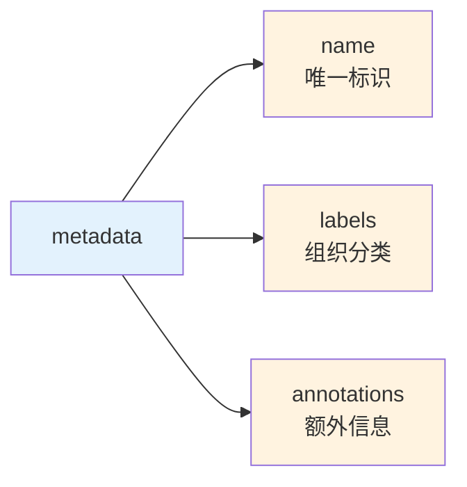
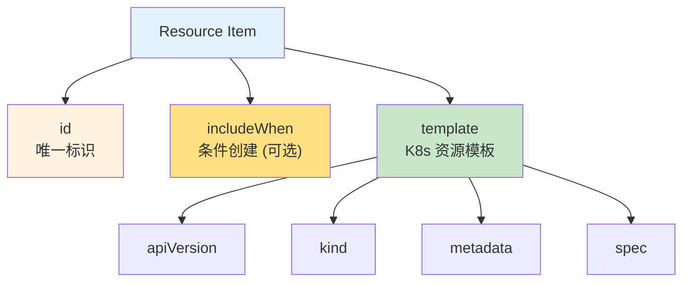
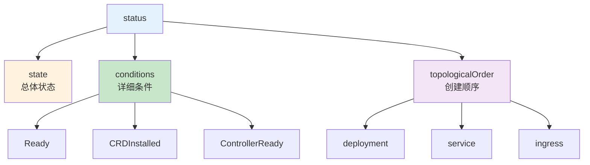
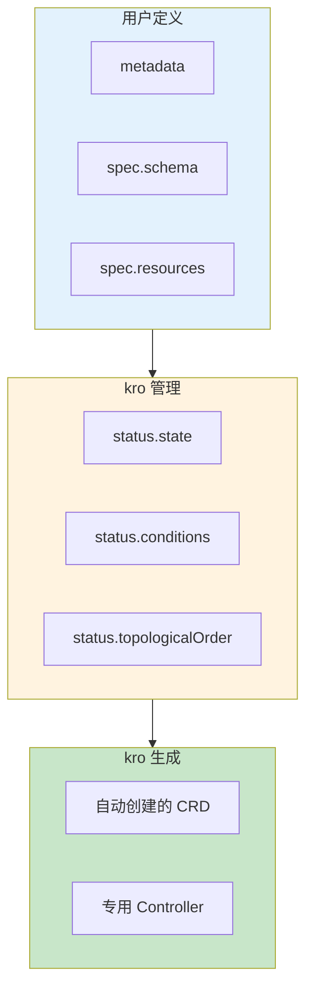
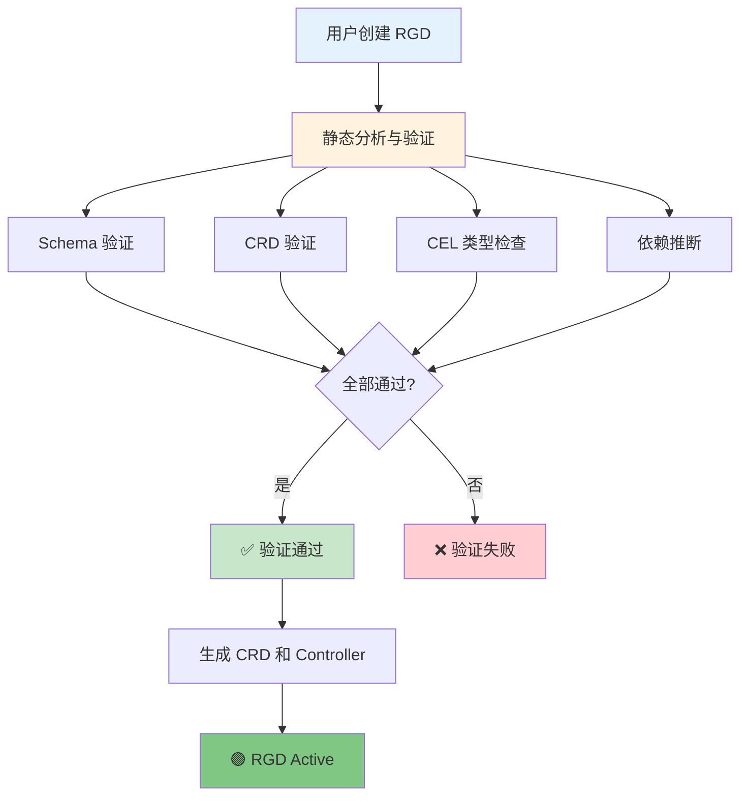
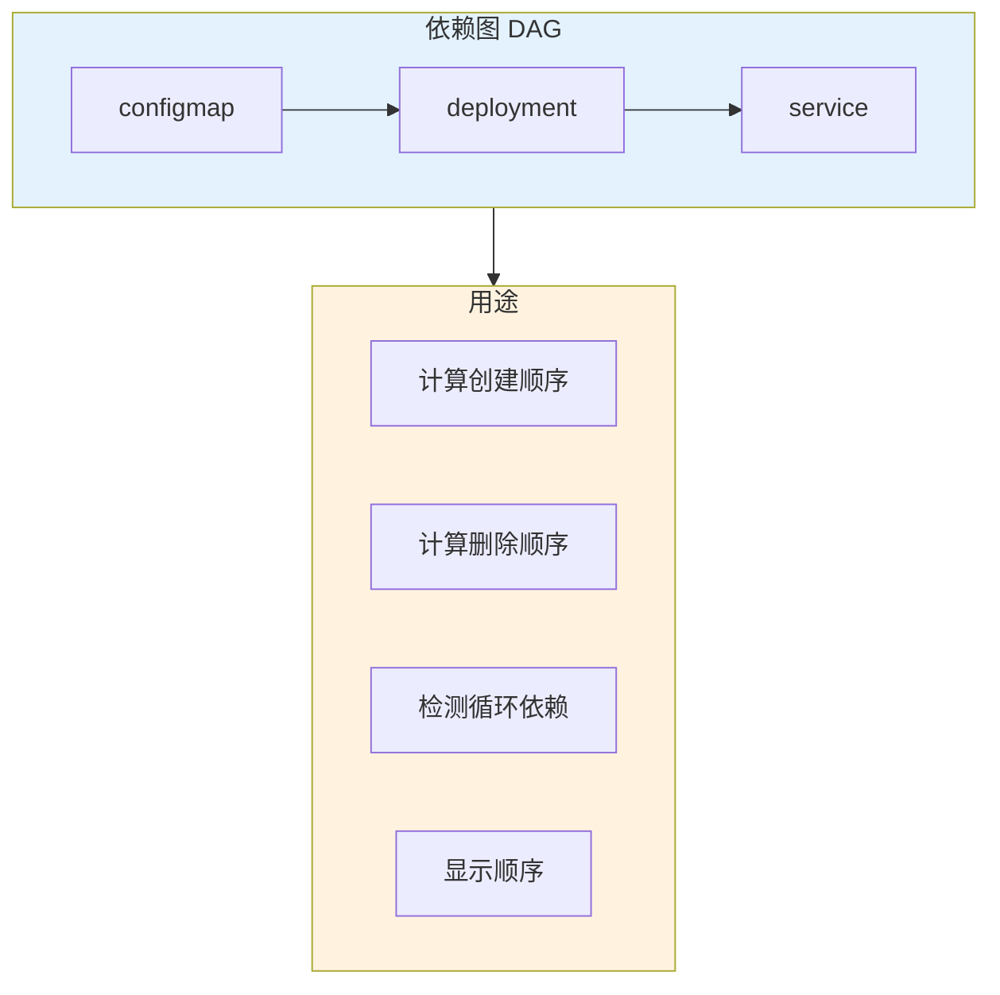
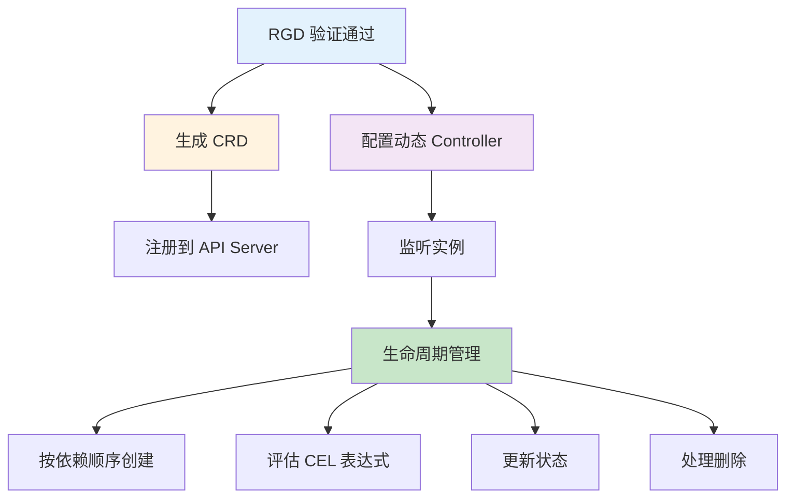
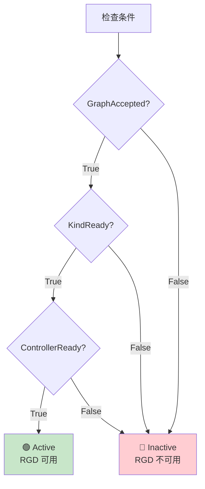
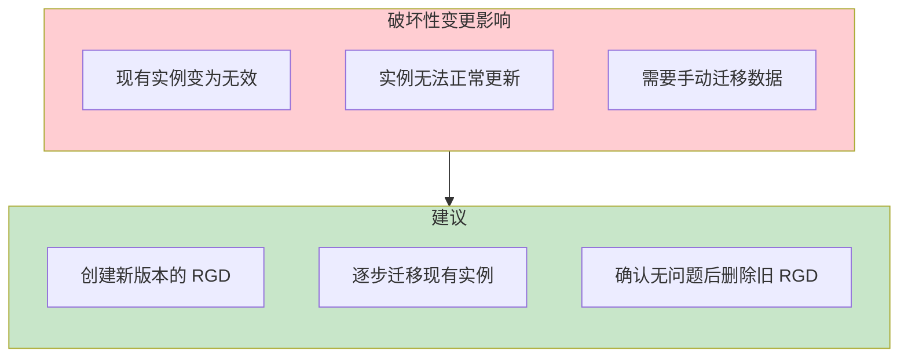
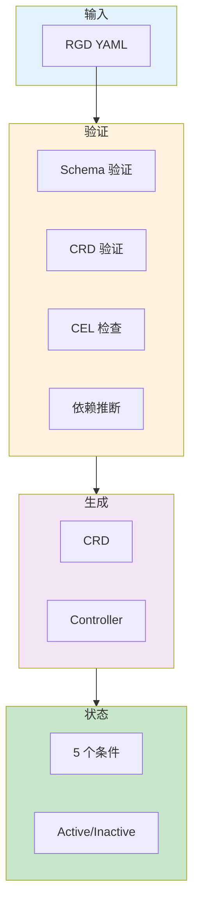

# ResourceGraphDefinitions

## 概述

### 生命周期

> 写一个 **RGD YAML**，kro 就帮你把它变成一个**完整的 Operator**

#### 定义

> **RGD** 是 KRO 中**唯一**需要你编写的 **API**

1. **定义 Schema** - 用户能看到/配置哪些字段
2. **定义 Resources** - 底层要创建哪些 K8s 资源
3. 用 **CEL 表达式**把 **Schema** 的值**绑定**到 **Resources** 上

#### 执行

> **apply** 这个 RGD 后，kro 全自动完成

1. **生成 CRD** - 把你的 **Schema** 转成真正的 **Kubernetes API**
2. **注册到 API Server** - 集群里立刻就能用 kubectl get Application 这样的命令
3. **监听实例** - 用户创建实例后，kro 按**依赖拓扑排序**创建**底层资源**，并持续管理**生命周期**

<!-- more -->

### How it Works

> RGD 从**定义**到**运行**的 4 步核心流程：<u>你定义蓝图 → kro 造工厂 → 用户下订单 → kro 自动生产</u>

| 步骤 | 谁   | 做什么                                                       |
| ---- | ---- | ------------------------------------------------------------ |
| 1    | 你   | 写一个 **RGD**，定义新的 **API**（比如 Application）         |
| 2    | kro  | **自动生成 CRD，注册到集群**                                 |
| 3    | 用户 | 用 kubectl apply **创建实例**，像用**原生 K8s 资源**一样     |
| 4    | kro  | 按**依赖顺序**创建**底层资源**（Deployment、Service 等），并**持续管理** |


### Example

1. Here's an RGD that creates a new `Application` API. 
2. When users create an `Application`, kro automatically creates a **Deployment**:

```yaml
apiVersion: kro.run/v1alpha1
kind: ResourceGraphDefinition
metadata:
  name: application
spec:
  schema:
    apiVersion: v1alpha1
    kind: Application
    spec:
      name: string
      image: string | default="nginx:latest"
      replicas: integer | default=3

  resources:
    - id: deployment
      template:
        apiVersion: apps/v1
        kind: Deployment
        metadata:
          name: ${schema.spec.name}
        spec:
          replicas: ${schema.spec.replicas}
          selector:
            matchLabels:
              app: ${schema.spec.name}
          template:
            metadata:
              labels:
                app: ${schema.spec.name}
            spec:
              containers:
                - name: app
                  image: ${schema.spec.image}
```

> Users can now create applications:

```yaml
apiVersion: v1alpha1
kind: Application
metadata:
  name: my-app
spec:
  name: my-app
  image: nginx:1.27
  replicas: 5
```

> kro will create and manage the Deployment **automatically**.

### 结构详解

#### 整体结构

```
┌─────────────────────────────────────────────────────────────┐
│          ResourceGraphDefinition 结构                       │
├─────────────────────────────────────────────────────────────┤
│                                                             │
│  apiVersion: kro.run/v1alpha1                               │
│  kind: ResourceGraphDefinition                              │
│  ┌─────────────────────────────────────────────────────┐   │
│  │ metadata:        # 标准 K8s 元数据                    │   │
│  │   - name                                             │   │
│  │   - labels                                           │   │
│  │   - annotations                                      │   │
│  └─────────────────────────────────────────────────────┘   │
│  ┌─────────────────────────────────────────────────────┐   │
│  │ spec:             # 用户定义部分                      │   │
│  │   ├── schema:     # 自定义 API                       │   │
│  │   └── resources:  # 要创建的资源                      │   │
│  └─────────────────────────────────────────────────────┘   │
│  ┌─────────────────────────────────────────────────────┐   │
│  │ status:          # kro 管理的状态                     │   │
│  │   - conditions                                      │   │
│  │   - state                                           │   │
│  │   - topologicalOrder                                │   │
│  └─────────────────────────────────────────────────────┘   │
│                                                             │
└─────────────────────────────────────────────────────────────┘
```

#### 各字段详解

##### metadata - 标准 K8s 元数据

```yaml
metadata:
  name: my-application              # RGD 名称
  labels:                           # 标签
    app: my-app
    env: production
  annotations:                      # 注解
    description: "My application RGD"
```

| 字段        | 类型              | 必填 | 说明                   |
| ----------- | ----------------- | ---- | ---------------------- |
| name        | string            | ✅    | RGD 的**唯一标识**     |
| labels      | map[string]string | ❌    | 用于**组织**和**选择** |
| annotations | map[string]string | ❌    | 存储**额外元数据**     |



##### spec.schema - 自定义 API 定义

```yaml
spec:
  schema:
    apiVersion: v1alpha1             # 生成的 CRD 版本
    kind: Application                # 生成的 CRD 类型名

    spec:                            # 用户可配置的字段
      name: string
      image: string | default="nginx"
      replicas: integer | default=3 | min=1

    status:                          # kro 回写的状态
      availableReplicas: ${deployment.status.availableReplicas}
```

```
┌─────────────────────────────────────────────────────────────┐
│              schema 结构                                    │
├─────────────────────────────────────────────────────────────┤
│                                                             │
│  apiVersion + kind                                          │
│       │                                                     │
│       ▼                                                     │
│  定义生成的 CRD                                             │
│                                                             │
│  ┌─────────────────┐         ┌─────────────────┐           │
│  │     spec        │  输入   │   用户填写       │           │
│  │   (输入参数)     │ ──────▶ │   实例时         │           │
│  └─────────────────┘         └─────────────────┘           │
│                                                             │
│  ┌─────────────────┐         ┌─────────────────┐           │
│  │    status       │  输出   │   kro 回写       │           │
│  │  (计算状态)      │ ──────▶ │   实例状态       │           │
│  └─────────────────┘         └─────────────────┘           │
│                                                             │
└─────────────────────────────────────────────────────────────┘
```

| schema 部分 | 作用           | 示例                  |
| ----------- | -------------- | --------------------- |
| apiVersion  | CRD 版本       | v1alpha1              |
| kind        | CRD 类型名     | Application           |
| spec        | 用户输入字段   | name, image, replicas |
| status      | kro 计算的输出 | availableReplicas     |

##### spec.resources - 资源定义

```yaml
spec:
  resources:
    - id: deployment                    # 资源 ID
      template:                         # K8s 资源模板
        apiVersion: apps/v1
        kind: Deployment
        metadata:
          name: ${schema.spec.name}
        spec:
          replicas: ${schema.spec.replicas}

    - id: service
      template:
        apiVersion: v1
        kind: Service
        metadata:
          name: ${schema.spec.name}-svc
        spec:
          selector: ${deployment.spec.selector.matchLabels}

    - id: ingress
      includeWhen:                      # 条件创建
        - ${schema.spec.ingress.enabled}
      template:
        apiVersion: networking.k8s.io/v1
        kind: Ingress
        metadata:
          name: ${schema.spec.name}-ingress
```

```
┌─────────────────────────────────────────────────────────────┐
│              resources 结构                                 │
├─────────────────────────────────────────────────────────────┤
│                                                             │
│  ┌─────────────────────────────────────────────────────┐   │
│  │ Resource Item                                        │   │
│  │ ├─ id: 唯一标识符 (用于引用)                          │   │
│  │ ├─ includeWhen: 条件表达式 (可选)                    │   │
│  │ └─ template: K8s 资源模板                             │   │
│  │    ├─ apiVersion                                     │   │
│  │    ├─ kind                                           │   │
│  │    ├─ metadata                                       │   │
│  │    └─ spec                                           │   │
│  └─────────────────────────────────────────────────────┘   │
│                                                             │
│  CEL 表达式连接:                                            │
│  ${schema.spec.*}    ← 引用用户输入                          │
│  ${resource.id.*}    ← 引用其他资源                          │
│                                                             │
└─────────────────────────────────────────────────────────────┘
```

| 字段        | 类型     | 必填 | 说明                                 |
| ----------- | -------- | ---- | ------------------------------------ |
| id          | string   | ✅    | **资源唯一标识**，用于**跨资源引用** |
| includeWhen | []string | ❌    | 条件表达式，**满足时才创建**         |
| template    | object   | ✅    | K8s 资源**完整定义**                 |



##### status - kro 管理的状态

```yaml
status:
  state: Active                       # 总体状态
  conditions:                         # 详细条件
    - type: Ready
      status: "True"
      reason: "RGDActive"
      message: "RGD is active"
    - type: CRDInstalled
      status: "True"
      reason: "CRDCreated"
      message: "CRD application is installed"

  topologicalOrder:                   # 拓扑排序
    - deployment
    - service
    - ingress
```

```
┌─────────────────────────────────────────────────────────────┐
│              status 结构                                    │
├─────────────────────────────────────────────────────────────┤
│                                                             │
│  ┌─────────────────┐                                       │
│  │     state       │  总体状态                              │
│  │  (Active/Error) │                                       │
│  └─────────────────┘                                       │
│                                                             │
│  ┌─────────────────┐                                       │
│  │   conditions    │  详细条件数组                          │
│  │  - Ready        │   • type: 条件类型                     │
│  │  - CRDInstalled │   • status: True/False                │
│  │  - Controller   │   • reason: 原因                       │
│  │                 │   • message: 详情                      │
│  └─────────────────┘                                       │
│                                                             │
│  ┌─────────────────┐                                       │
│  │ topologicalOrder│  资源创建顺序                          │
│  │  - deployment   │  (DAG 排序结果)                        │
│  │  - service      │                                       │
│  │  - ingress      │                                       │
│  └─────────────────┘                                       │
│                                                             │
└─────────────────────────────────────────────────────────────┘
```

| 字段             | 类型        | 说明                                             |
| ---------------- | ----------- | ------------------------------------------------ |
| state            | string      | **总体状态**: **Active**, **Error**, **Pending** |
| conditions       | []Condition | 详细条件数组                                     |
| topologicalOrder | []string    | 按 DAG 排序的资源 ID 列表                        |



#### 字段所有权




| 字段           | 所有者 | 说明           |
| -------------- | ------ | -------------- |
| metadata       | 用户   | 用户定义和修改 |
| spec.schema    | 用户   | 用户定义 API   |
| spec.resources | 用户   | 用户定义资源   |
| status         | kro    | kro 独占管理   |

#### 完整示例

```yaml
apiVersion: kro.run/v1alpha1
kind: ResourceGraphDefinition
metadata:
  name: my-application
  labels:
    app: my-app
spec:
    apiVersion: v1alpha1
    kind: Application
    spec:
      name: string
      image: string | default="nginx"
      replicas: integer | default=3
    status:
      availableReplicas: ${deployment.status.availableReplicas}

  resources:
    - id: deployment
      template:
        apiVersion: apps/v1
        kind: Deployment
        metadata:
          name: ${schema.spec.name}
        spec:
          replicas: ${schema.spec.replicas}
          template:
            spec:
              containers:
                - image: ${schema.spec.image}

    - id: service
      template:
        apiVersion: v1
        kind: Service
        spec:
          selector: ${deployment.spec.template.metadata.labels}

status:
  state: Active
  conditions:
    - type: Ready
      status: "True"
      reason: "RGDActive"
  topologicalOrder:
    - deployment
    - service
```

#### 总结

| 部分           | 所有者 | 作用                 |
| -------------- | ------ | -------------------- |
| metadata       | 用户   | 标识和组织 RGD       |
| spec.schema    | 用户   | 定义生成的 **API**   |
| spec.resources | 用户   | 定义要管理的**资源** |
| status         | kro    | 反映**当前状态**     |

```
┌─────────────────────────────────────────────────────────────┐
│              RGD 数据流                                     │
├─────────────────────────────────────────────────────────────┤
│                                                             │
│  用户定义 ──────▶ kro 处理 ──────▶ 状态输出                  │
│  metadata        分析依赖          status                    │
│  spec            生成 CRD                                  │
│                  部署 controller                            │
│                                                             │
└─────────────────────────────────────────────────────────────┘
```

### KRO 处理 RGD 详解


#### RGD 验证流程总览



#### 静态分析与验证

##### Schema 验证

```yaml
# 确保 Schema 遵循 SimpleSchema 格式
schema:
  apiVersion: v1alpha1
  kind: Application
  spec:
    name: string                    # ✅ 正确格式
    replicas: integer | default=3   # ✅ 正确格式
    count: int                      # ❌ 错误: 应为 integer
```

```
┌─────────────────────────────────────────────────────────────┐
│              Schema 验证规则                                 │
├─────────────────────────────────────────────────────────────┤
│                                                             │
│  ✅ 允许的类型:                                              │
│  • string, integer, boolean, number, object, array          │
│  • 默认值: | default=value                                   │
│  • 约束: | min=value, max=value, pattern=regex              │
│  • 必填: | required                                          │
│                                                             │
│  ❌ 常见错误:                                               │
│  • 使用简写类型 (int → integer)                             │
│  • 无效的约束条件                                            │
│  • 必填字段无默认值                                          │
│                                                             │
└─────────────────────────────────────────────────────────────┘
```

##### CRD 验证

```yaml
resources:
  - id: deployment
    template:
      apiVersion: apps/v1            # ✅ 核心 K8s API，总是存在
      kind: Deployment

  - id: service
    template:
      apiVersion: v1
      kind: Service                 # ✅ 核心 K8s API

  - id: bucket
    template:
      apiVersion: s3.services.k8s.aws/v1alpha1  # 需要验证
      kind: Bucket                              # ✅ 如果 ACK 已安装
                                                # ❌ 如果 ACK 未安装
```

```
┌─────────────────────────────────────────────────────────────┐
│              CRD 验证流程                                   │
├─────────────────────────────────────────────────────────────┤
│                                                             │
│  遍历每个资源模板:                                          │
│       │                                                     │
│       ▼                                                     │
│  提取 apiVersion 和 kind                                    │
│       │                                                     │
│       ▼                                                     │
│  检查是否为核心 K8s 资源                                    │
│       │                                                     │
│       ├── 是 → ✅ 跳过                                      │
│       │                                                     │
│       └── 否 → 查询集群中的 CRD                             │
│                   │                                         │
│                   ├── 存在 → ✅ 通过                         │
│                   │                                         │
│                   └── 不存在 → ❌ 拒绝                       │
│                                                             │
└─────────────────────────────────────────────────────────────┘
```

##### CEL 类型检查

```yaml
schema:
  spec:
    replicas: integer
    image: string
    enabled: boolean

resources:
  - id: deployment
    template:
      spec:
        replicas: "${schema.spec.replicas}"      # ✅ integer → integer
        image: "${schema.spec.image}"            # ✅ string → string

  - id: service
    template:
      spec:
        ports:
          - port: "${schema.spec.enabled}"       # ❌ boolean → integer 错误
```

```
┌─────────────────────────────────────────────────────────────┐
│              CEL 类型检查                                   │
├─────────────────────────────────────────────────────────────┤
│                                                             │
│  检查项目:                                                  │
│  ┌─────────────────────────────────────────────────────┐   │
│  │ 1. 引用字段存在于实际 Schema 中                      │   │
│  │    ${schema.spec.replicas}  → replicas 存在? ✅       │   │
│  │    ${schema.spec.unknown}   → unknown 不存在? ❌     │   │
│  └─────────────────────────────────────────────────────┘   │
│                                                             │
│  ┌─────────────────────────────────────────────────────┐   │
│  │ 2. 表达式输出类型匹配目标字段类型                     │   │
│  │    replicas: integer  ← "${schema.spec.replicas}"   │   │
│  │         │                    │                      │   │
│  │    integer ────────────────── integer ✅             │   │
│  │         │                    │                      │   │
│  │    integer ────────────────── string ❌             │   │
│  └─────────────────────────────────────────────────────┘   │
│                                                             │
│  ┌─────────────────────────────────────────────────────┐   │
│  │ 3. 表达式语法正确性                                   │   │
│  │    "${schema.spec.name}"           ✅               │   │
│  │    "${schema.spec.name + suffix}"  ✅               │   │
│  │    "${schema.spec.name"             ❌ 缺少 }        │   │
│  └─────────────────────────────────────────────────────┘   │
│                                                             │
└─────────────────────────────────────────────────────────────┘
```

##### 依赖推断

```yaml
resources:
  - id: configmap
    template:
      metadata:
        name: ${schema.metadata.name}-cm

  - id: deployment
    template:
      spec:
        containers:
          - envFrom:
              - configMapRef:
                  name: ${configmap.metadata.name}  # 依赖 configmap

  - id: service
    template:
      spec:
        selector: ${deployment.spec.selector.matchLabels}  # 依赖 deployment
```

```
┌─────────────────────────────────────────────────────────────┐
│              依赖推断结果                                   │
├─────────────────────────────────────────────────────────────┤
│                                                             │
│  kro 分析 CEL 表达式:                                       │
│                                                             │
│  deployment 引用 ${configmap.metadata.name}                 │
│       │                                                     │
│       └──→ deployment 依赖 configmap                        │
│                                                             │
│  service 引用 ${deployment.spec.selector.matchLabels}       │
│       │                                                     │
│       └──→ service 依赖 deployment                          │
│                                                             │
│  构建依赖图:                                                │
│                                                             │
│     configmap ──▶ deployment ──▶ service                    │
│                                                             │
│  拓扑排序结果:                                              │
│  status.topologicalOrder = ["configmap", "deployment", "service"] │
│                                                             │
└─────────────────────────────────────────────────────────────┘
```

#### 自动依赖管理

##### 依赖图的用途



##### 创建与删除顺序

```
┌─────────────────────────────────────────────────────────────┐
│              创建顺序 (拓扑序)                              │
├─────────────────────────────────────────────────────────────┤
│                                                             │
│  依赖图: A → B → C                                          │
│                                                             │
│  创建顺序:                                                  │
│  1. A (无依赖)                                              │
│  2. B (依赖 A)                                              │
│  3. C (依赖 B)                                              │
│                                                             │
└─────────────────────────────────────────────────────────────┘

┌─────────────────────────────────────────────────────────────┐
│              删除顺序 (逆拓扑序)                            │
├─────────────────────────────────────────────────────────────┤
│                                                             │
│  依赖图: A → B → C                                          │
│                                                             │
│  删除顺序:                                                  │
│  1. C (被其他依赖最少)                                      │
│  2. B                                                       │
│  3. A (被其他依赖最多)                                      │
│                                                             │
└─────────────────────────────────────────────────────────────┘
```

##### 循环依赖检测

```
┌─────────────────────────────────────────────────────────────┐
│              循环依赖检测                                   │
├─────────────────────────────────────────────────────────────┤
│                                                             │
│  正常 DAG:                                                 │
│     A ──▶ B ──▶ C                                          │
│     ✅ 可以拓扑排序                                         │
│                                                             │
│  循环依赖:                                                  │
│     A ──▶ B                                                 │
│     ▲    │                                                  │
│     └────┘                                                  │
│     ❌ 无法拓扑排序                                         │
│     ❌ kro 拒绝 RGD                                         │
│                                                             │
│  检测时机: RGD 创建时                                       │
│  错误信息: "circular dependency detected: A ↔ B"            │
│                                                             │
└─────────────────────────────────────────────────────────────┘
```

#### 生成的 CRD 和 Controller



| 组件                   | 作用                                              |
| ---------------------- | ------------------------------------------------- |
| <u>CRD 生成</u>        | 根据 **schema** 创建 **CustomResourceDefinition** |
| <u>注册 API</u>        | 将 **CRD** 注册到 **Kubernetes API Server**       |
| <u>动态 Controller</u> | 配置 **kro 监听新 API 的实例**                    |
| <u>生命周期管理</u>    | 创建、更新、删除**底层资源**                      |

#### RGD 状态条件

##### 五种状态条件

```
┌─────────────────────────────────────────────────────────────┐
│              RGD 状态条件                                   │
├─────────────────────────────────────────────────────────────┤
│                                                             │
│                     Ready (聚合状态)                        │
│                          │                                 │
│        ┌─────────────────┼─────────────────┐               │
│        ▼                 ▼                 ▼               │
│  GraphRevisions   GraphAccepted       KindReady           │
│  Resolved                            ControllerReady       │
│                                                             │
│  全部为 True → Ready = True                                │
│                                                             │
└─────────────────────────────────────────────────────────────┘
```

##### 条件详解

| 条件                          | 说明                                                    | 值                     |
| ----------------------------- | ------------------------------------------------------- | ---------------------- |
| <u>Ready</u>                  | **聚合状态**，只有当以下**全部为 True** 时才为 **True** | True / False / Unknown |
| <u>GraphRevisionsResolved</u> | **图版本**已 **settles**，最新版本已**编译**并**激活**  | True / False / Unknown |
| <u>GraphAccepted</u>          | kro **接受**当前**图**的**最新版本路径**                | True / False           |
| <u>KindReady</u>              | 生成的 **CRD** 已被 **Kubernetes API Server** 接受      | True / False           |
| <u>ControllerReady</u>        | **kro** 成功注册了**动态 controller**                   | True / False           |

##### 状态状态

> <u>GraphAccepted</u> + <u>KindReady</u> + <u>ControllerReady</u>



##### 查看状态

> kubectl get rgd my-application -o yaml

```yaml
status:
  state: Active
  conditions:
    - type: Ready
      status: "True"
      reason: "RGDActive"
      message: "RGD is active and serving"
    - type: GraphRevisionsResolved
      status: "True"
      reason: "GraphCompiled"
      message: "Latest graph revision is compiled"
    - type: GraphAccepted
      status: "True"
      reason: "GraphValid"
      message: "Graph is valid and accepted"
    - type: KindReady
      status: "True"
      reason: "CRDInstalled"
      message: "CRD is installed and accepted"
    - type: ControllerReady
      status: "True"
      reason: "ControllerRegistered"
      message: "Dynamic controller is registered"
  topologicalOrder:
    - deployment
    - service
    - ingress
```

> 本机实际数据

```yaml
status:
  conditions:
  - lastTransitionTime: "2026-04-28T12:58:19Z"
    message: resource graph and schema are valid
    observedGeneration: 1
    reason: Valid
    status: "True"
    type: GraphAccepted
  - lastTransitionTime: "2026-04-28T12:58:19Z"
    message: revision 1 compiled and active
    observedGeneration: 1
    reason: Resolved
    status: "True"
    type: GraphRevisionsResolved
  - lastTransitionTime: "2026-04-28T12:58:19Z"
    message: kind Application has been accepted and ready
    observedGeneration: 1
    reason: Ready
    status: "True"
    type: KindReady
  - lastTransitionTime: "2026-04-28T12:58:20Z"
    message: controller is running
    observedGeneration: 1
    reason: Running
    status: "True"
    type: ControllerReady
  - lastTransitionTime: "2026-04-28T12:58:20Z"
    message: ""
    observedGeneration: 1
    reason: Ready
    status: "True"
    type: Ready
  lastIssuedRevision: 1
  resources:
  - dependencies:
    - id: deployment
    id: service
  - dependencies:
    - id: service
    id: ingress
  state: Active
  topologicalOrder:
  - deployment
  - service
  - ingress
```

| 类型                   | 状态 | 原因     | 消息                                                 |
| ---------------------- | ---- | -------- | ---------------------------------------------------- |
| Ready                  | True | Ready    | -                                                    |
| GraphRevisionsResolved | True | Resolved | revision 1 **compiled** and **active**               |
| GraphAccepted          | True | Valid    | resource **graph** and **schema** are valid          |
| KindReady              | True | Ready    | kind Application has been **accepted** and **ready** |
| ControllerReady        | True | Running  | controller is running                                |

#### 注解

##### 支持的注解

| 注解                                  | 说明                             |
| ------------------------------------- | -------------------------------- |
| kro.run/<u>allow-breaking-changes</u> | 允许通常会被阻止的**破坏性变更** |

##### 破坏性变更检测

```
┌─────────────────────────────────────────────────────────────┐
│              破坏性变更类型 (Schema 部分)                    │
├─────────────────────────────────────────────────────────────┤
│                                                             │
│  1. 字段移除                                                │
│     schema.spec.oldField  ❌ 被删除                         │
│                                                             │
│  2. 类型变更                                                │
│     replicas: integer → string  ❌                         │
│                                                             │
│  3. 新增必填字段且无默认值                                  │
│     newField: string | required  ❌                        │
│                                                             │
│  4. 枚举限制                                                │
│     env: string | values=[dev, prod]  ❌                   │
│                                                             │
│  5. 模式变更                                                │
│     name: string | pattern=^[a-z]+$  ❌                    │
│                                                             │
└─────────────────────────────────────────────────────────────┘
```

##### 强制破坏性变更

```yaml
apiVersion: kro.run/v1alpha1
kind: ResourceGraphDefinition
metadata:
  name: my-rgd
  annotations:
    kro.run/allow-breaking-changes: "true"  # ⚠️ 谨慎使用
spec:
  schema:
    # 破坏性变更...
```




#### 总结



| 阶段        | 动作                           | 输出         |
| ----------- | ------------------------------ | ------------ |
| <u>输入</u> | **用户**提交 **RGD YAML**      | -            |
| <u>验证</u> | **静态分析**                   | 错误或通过   |
| <u>生成</u> | 创建 **CRD** 和 **Controller** | 可用 **API** |
| <u>状态</u> | 持续报告条件                   | Ready 状态   |

### RGD 提供的核心价值

> RGD = **预先验证**的**多资源模板**，**自动处理依赖**，可**反复使用**

| 特性            | 说明                                               |
| --------------- | -------------------------------------------------- |
| <u>类型安全</u> | 创建 **RGD** 时验证所有 **CEL 表达式类型**是否匹配 |
| <u>依赖管理</u> | kro **自动分析**资源依赖关系，确定创建顺序         |
| <u>验证</u>     | 用户填写错误值时立即反馈，不会等到**运行时**才发现 |
| <u>可复用性</u> | **定义一次**，团队内可以**多次使用**               |


