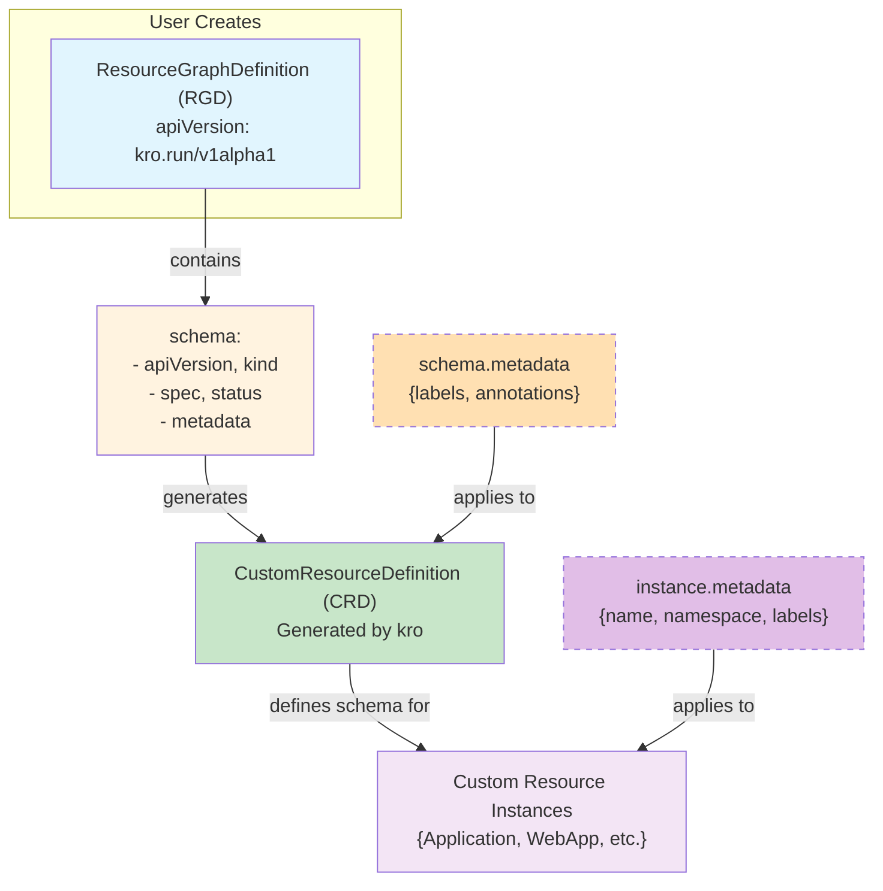
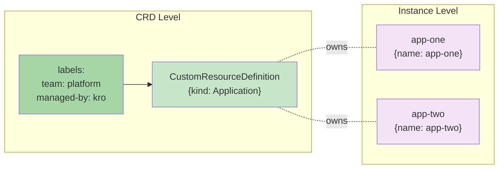

# 核心概念

1. ResourceGraphDefinition (RGD) 的 **schema** 部分定义了**自定义 API** 的形状
2. 创建一个 **RGD** 时，kro 会基于这个 **schema** 生成一个 **CRD**，用户就可以**实例化**这个 **CRD**

<!-- more -->

# 核心功能

## API 身份标识

> 生成的 **CRD API** 将是 <u>mycompany.io/v1alpha1</u>，资源名为 <u>applications.mycompany.io</u>

```yaml
schema:
  apiVersion: v1alpha1         # API 版本
  kind: Application            # 资源类型
  group: mycompany.io         # API 组（可选，默认 kro.run）
```

## 作用域

```yaml
schema:
  scope: Cluster  # 或 Namespaced（默认）
```

| 值                | 描述                            |
| ----------------- | ------------------------------- |
| <u>Namespaced</u> | 实例存在于 namespace 内（默认） |
| <u>Cluster</u>    | 实例是集群级别的                |

1. 使用 **scope: Cluster** 时，所有 **namespaced 资源**必须**显式设置 metadata.namespace**
2. 否则 **kro** 会在 **RGD 创建**时**验证失败**

## Spec 字段（用户输入）

> 使用 **SimpleSchema** 语法定义**用户可配置的字段**：

```yaml
spec:
  # 基础类型 + 验证
  name: string | required=true
  replicas: integer | default=3 minimum=1 maximum=100
  enabled: boolean | default=false

  # 结构化类型
  ingress:
    enabled: boolean | default=false
    host: string

  # 集合类型
  env: "map[string]string"
  ports: "[]integer"
```

> 常用验证标记

- **required=true** - 必填字段
- **default=value** - 默认值
- **minimum/maximum** - 数值约束
- **enum="val1,val2"** - 枚举值
- **pattern="regex"** - 正则验证

## Status 字段（运行时状态）

> 使用 **CEL 表达式**从**被管理资源**中**提取状态**

```yaml
status:
  # 直接引用资源字段
  availableReplicas: ${deployment.status.availableReplicas}

  # 嵌套值提取
  serviceIP: ${service.spec.clusterIP}

  # 复合值构造
  endpoint: "http://${service.status.loadBalancer.ingress[0].hostname}"

  # CEL 函数
  isHealthy: ${deployment.status.availableReplicas >= deployment.spec.replicas}

  # 数组过滤
  readyPods: ${deployment.status.conditions.filter(c, c.type == "Ready")}
```

# kro 自动处理的字段

> **conditions** 和 **state** 不可覆盖

```yaml
status:
  # 自动添加，不可覆盖
  conditions: [...]  # 追踪实例状态的条件数组
  state: ACTIVE      # ACTIVE | IN_PROGRESS | FAILED | DELETING | ERROR
```

# 完整工作流程

```
┌─────────────────┐    ┌──────────────────┐    ┌─────────────────┐
│   RGD Schema    │───▶│   CRD 生成       │───▶│   用户创建实例   │
│  SimpleSchema   │    │  OpenAPI v3      │    │   kubectl apply │
└─────────────────┘    └──────────────────┘    └─────────────────┘
                                                      │
                                                      ▼
                                              ┌─────────────────┐
                                              │ Kubernetes 验证  │
                                              │  类型检查/必填  │
                                              └─────────────────┘
                                                      │
                                                      ▼
                                              ┌─────────────────┐
                                              │   kro 处理      │
                                              │  CEL 表达式求值 │
                                              │  状态持续更新   │
                                              └─────────────────┘
```

# 高级特性

## 自定义类型

```yaml
schema:
  types:
    ContainerConfig:
      image: string | required=true
      tag: string | default="latest"
      env: "map[string]string"

  spec:
    primary: ContainerConfig
    sidecars: "[]ContainerConfig"  # 类型复用
```

## 递归类型

> kro 会**自动解析依赖**并**检测循环引用**

```yaml
schema:
  types:
    Address:
      street: string
      city: string
    Person:
      name: string
      address: Address  # 引用其他自定义类型
```

## Additional Printer Columns

> 控制 kubectl get 的**输出列**

```yaml
schema:
  additionalPrinterColumns:
    - name: Replicas
      type: integer
      jsonPath: .spec.replicas
    - name: Available
      type: integer
      jsonPath: .status.availableReplicas
```

```
输出效果：
NAME     REPLICAS   AVAILABLE   AGE
my-app   5          5           10m
```

## CRD 元数据

> **标签**和**注释**会应用到 **CRD 本身**，而不是**实例**

```yaml
schema:
  metadata:
    labels:
      team: platform
      managed-by: kro
    annotations:
      description: "Application resource for managing web applications"
```




| 位置                | 应用目标     | 示例                            |
| ------------------- | ------------ | ------------------------------- |
| **schema.metadata** | **CRD 本身** | team: platform, managed-by: kro |
| 实例的 metadata     | 具体实例     | name: my-app, namespace: prod   |



# 更新与兼容性

> 更新 RGD 的 **schema** 时，kro 会检查**变更**是否**与现有实例兼容**，破坏性变更（<u>默认被阻止</u>）

1. **删除字段**
2. **修改字段类型**
3. 添加**必填字段**但**无默认值**

> 需要通过 **Breaking Changes** 机制**显式允许**这些变更

