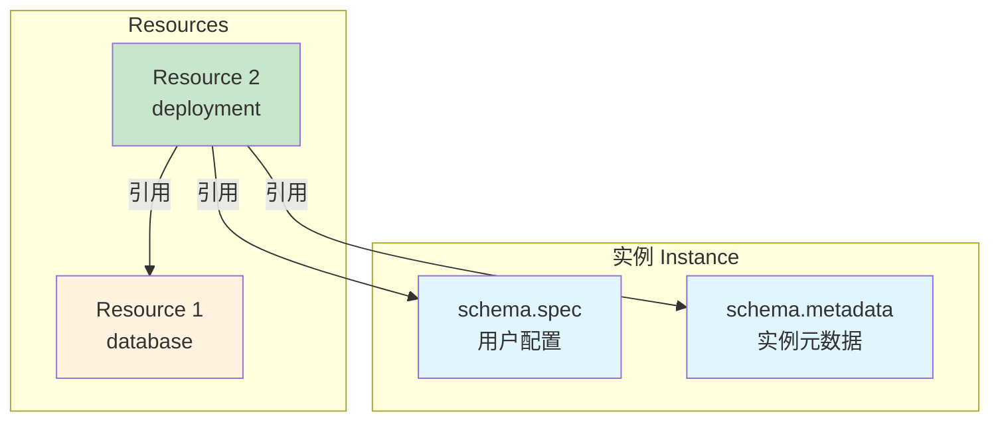
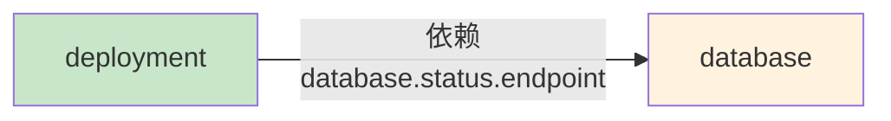
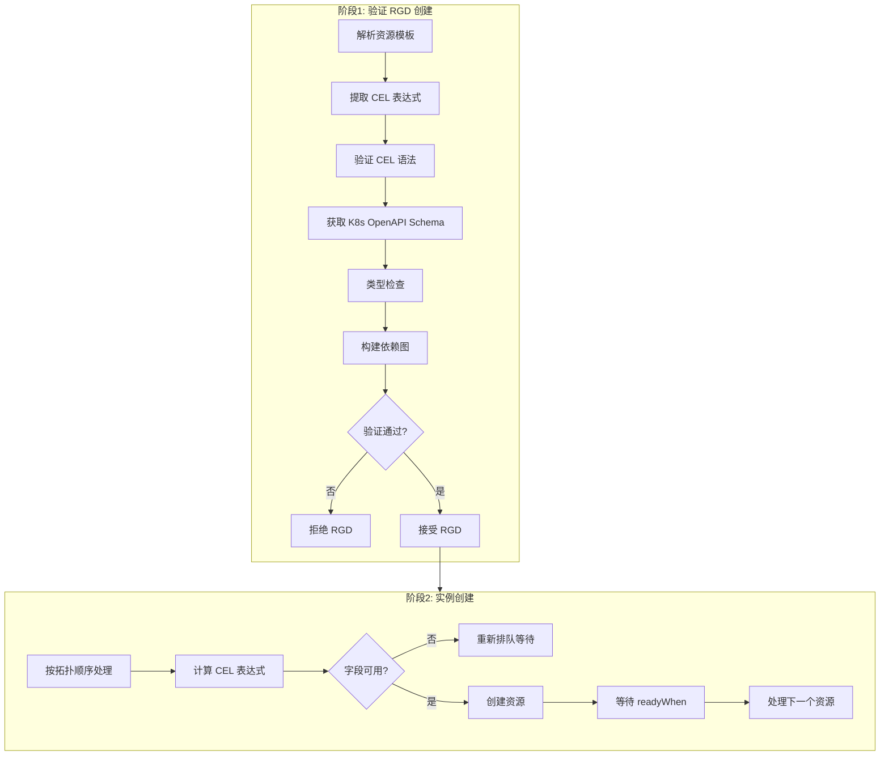
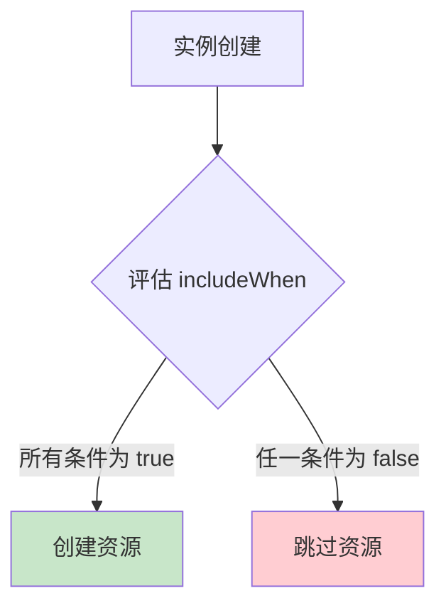
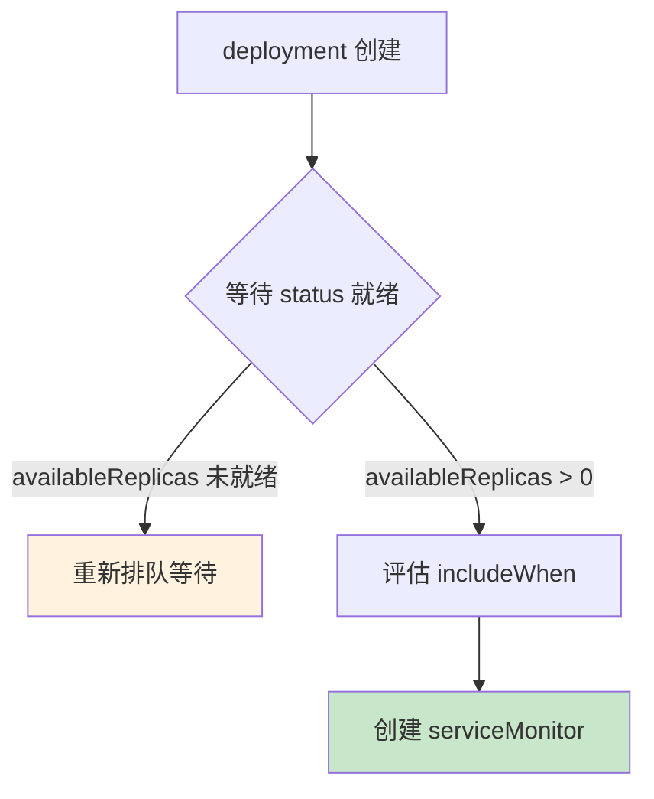
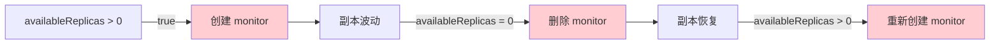
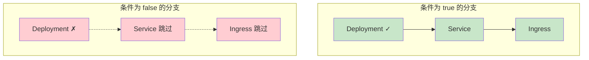
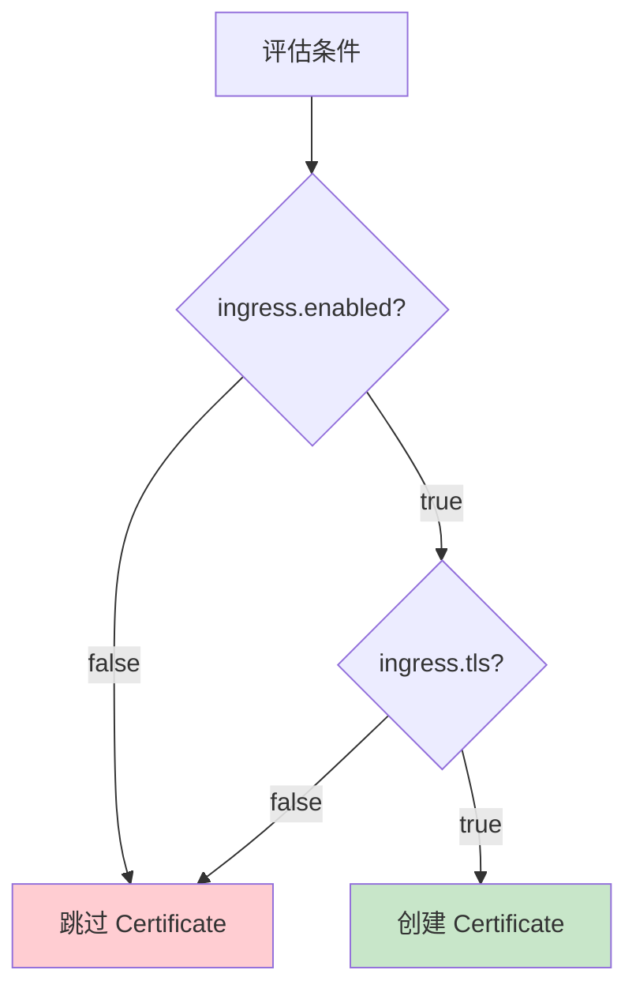
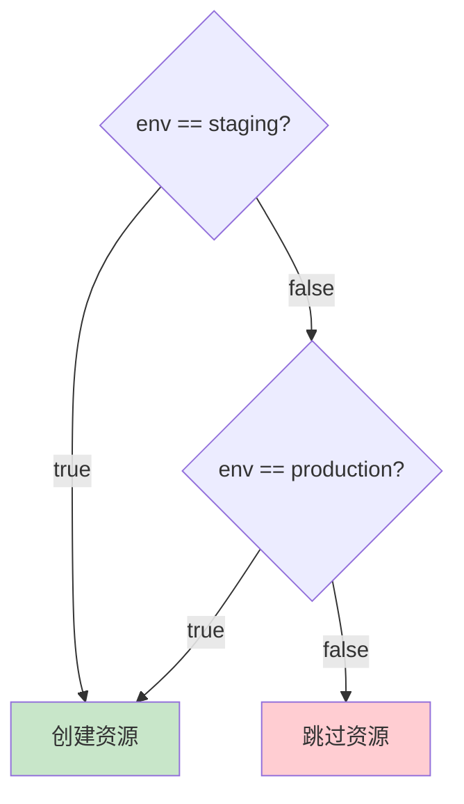
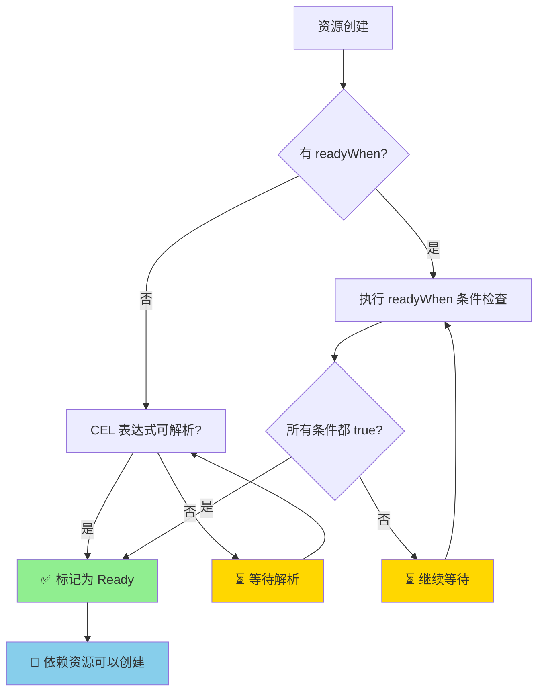

# Basics

## 核心概念

1. **Resources** 定义了当用户创建**自定义 API 实例**时，**KRO** 将**创建**和**管理**的 **Kubernetes 对象**
2. 每个 Resource 都是**有效**的 **Kubernetes YAML**，可以使用 **CEL 表达式**实现**动态值注入**

<!-- more -->

## Resource 结构

> 每个 **Resource** 必须包含**两个核心字段**

```yaml
resources:
  - id: deployment        # 唯一标识符
    template:             # Kubernetes 资源模板
      apiVersion: apps/v1
      kind: Deployment
      metadata:
        name: my-app
      spec:
        replicas: 3
```

| 字段     | 说明                                                         |
| -------- | ------------------------------------------------------------ |
| id       | 在 **RGD** 内**唯一标识资源**，用于在 **CEL 表达式**中**引用** |
| template | 有效的 Kubernetes 资源清单                                   |

## ID 命名规范（重要）

> **Resource ID** 必须使用 **lowerCamelCase** 格式

```
✓ 有效:   deployment, webServer, postgresDatabase
✗ 无效:   web-server (会被解析为减法运算)
          WebServer (首字母应小写)
          postgres_database (不推荐下划线)
```

> 原因：ID 会被用作 **CEL 表达式**中的标识符，**连字符**会被解释为**减法运算符**

## CEL 表达式引用

> 可引用的三种数据源



> 引用示例

```yaml
resources:
  - id: database
    template:
      metadata:
        # 引用实例 spec
        name: ${schema.spec.name}-db
        # 引用实例 metadata
        namespace: ${schema.metadata.namespace}
        labels: ${schema.metadata.labels}

  - id: deployment
    template:
      metadata:
        # 引用另一个 resource 的 metadata
        annotations: ${database.metadata.annotations}
      spec:
        containers:
          - env:
              # 引用另一个 resource 的 status
              - name: DATABASE_HOST
                value: ${database.status.endpoint}
              # 引用另一个 resource 的 spec
              - name: DATABASE_VERSION
                value: ${database.spec.version}
```

## 隐式依赖机制

> 关键点：当 Resource A **引用** Resource B 的字段时，**自动创建依赖关系**



> KRO 会**自动确定创建顺序**

1. database 必须先于 deployment 创建
2. 因为 deployment 需要等待 database 的 endpoint 可用

## 验证机制（核心优势）

> 验证时机

```
RGD 创建时 → 验证所有模板和 CEL 表达式 → 失败则拒绝 RGD
```

> 验证内容

| 验证类型    | 说明                 | 示例                              |
| ----------- | -------------------- | --------------------------------- |
| 模板语法    | 检查 ${} 配对        | ${schema.spec.name} ✓             |
| CEL 语法    | 验证表达式有效性     | ${schema..name} ✗                 |
| 类型检查    | 匹配字段类型期望     | replicas: ${name} ✗ (字符串→整数) |
| 字段存在性  | 确认引用字段存在     | ${deployment.spec.podReplicas} ✗  |
| Schema 验证 | **自定义字段**存在性 | ${schema.spec.nonExistent} ✗      |
| 静态字段    | 验证非 CEL 字段      | replicas: "three" ✗               |

## 处理流程



## 类型安全示例

```
# 整数字段
replicas: ${schema.spec.replicas}           # ✓
replicas: ${schema.spec.replicas * 2}       # ✓
replicas: ${schema.spec.name}               # ✗ 类型错误

# 字符串字段
name: ${schema.spec.name}                   # ✓
name: ${schema.spec.name + "-deployment"}   # ✓
name: ${schema.spec.replicas}               # ✗ 类型错误

# 数组字段
containers: ${deployment1.spec.template.spec.containers}  # ✓
containers: ${deployment1.spec.template.spec.containers[0]} # ✗ 单对象→数组
```

## 常见验证错误

| 错误类型      | 示例              | 错误信息                                   |
| ------------- | ----------------- | ------------------------------------------ |
| 未知 API/Kind | kind: PostgreSQL  | schema not found                           |
| 未知字段      | spec.unknownField | no such member                             |
| 类型不匹配    | replicas: ${name} | type mismatch: string but expected integer |

## 关键优势

> **传统模板引擎** vs **KRO**

| 特性        | 传统模板引擎 | KRO                  |
| ----------- | ------------ | -------------------- |
| 验证时机    | 运行时       | **RGD 创建时**       |
| 类型检查    | 无           | **完整类型检查**     |
| Schema 验证 | 无           | **基于 K8s OpenAPI** |
| 错误反馈    | 部署后才发现 | **即时反馈**         |

> 核心价值：KRO 在 RGD **创建阶段**就完成**所有验证**，确保用户在**创建实例**时不会遇到**类型错误**或**字段不存在**的问题

# Conditionals

## 核心概念

> 问题场景：并非**所有资源**都需要在**每个实例**中创建。例如

1. 仅当用户请求时才启用监控
2. 仅在特定环境才启用备份
3. 仅当需要时才启用 TLS

> 解决方案：KRO 提供 **includeWhen** 字段，使**资源**变为**可选**的




## 基础示例

> RGD 定义

```yaml
resources:
  - id: ingress
    includeWhen:
      - ${schema.spec.ingress.enabled}  # 仅当启用时才创建
    template:
      apiVersion: networking.k8s.io/v1
      kind: Ingress
      metadata:
        name: ${schema.spec.name}
```

> 实例示例

```yaml
apiVersion: example.com/v1
kind: Application
metadata:
  name: my-app
spec:
  name: my-app
  ingress:
    enabled: true   # ✓ Ingress 会被创建
    # enabled: false  # ✗ Ingress 会被跳过
```

## 工作原理

| 条件结果            | 行为           |
| ------------------- | -------------- |
| 所有表达式为 true   | 资源被**包含** |
| 任一表达式为 false  | 资源被**跳过** |
| 条件从 true → false | 资源被**修剪** |
| 条件从 false → true | 资源被**创建** |

> 关键特性

1. **每个表达式**必须返回**布尔值**（**true** 或 **false**）
2. **条件**在每次**协调**时**重新评估**
3. 对**集合资源**，**includeWhen** 应用于**整个集合**

## 可引用的内容

> 引用 **schema.spec**

```
# ✓ 有效 - 返回布尔值
includeWhen:
  - ${schema.spec.ingress.enabled}              # 布尔字段
  - ${schema.spec.environment == "production"}  # 比较表达式
  - ${schema.spec.replicas > 3}                 # 数值比较

# ✗ 无效 - 必须返回布尔值
includeWhen:
  - ${schema.spec.appName}  # 返回字符串，非布尔值
```

> 引用**上游资源**

```
# ✓ 有效 - 引用上游资源
includeWhen:
  - ${deployment.status.availableReplicas > 0}
```

> 注意：当 **includeWhen** 引用**其他资源**时，**KRO** 将其视为**依赖关系**，条件基于**上游资源**的**实际状态**进行**评估**

## 依赖等待机制




>  示例：等待上游资源

```yaml
resources:
  - id: deployment
    template:
      apiVersion: apps/v1
      kind: Deployment
      metadata:
        name: ${schema.spec.name}

  - id: serviceMonitor
    includeWhen:
      - ${deployment.status.availableReplicas > 0}  # 等待副本就绪
    template:
      apiVersion: monitoring.coreos.com/v1
      kind: ServiceMonitor
```

> 行为：

1. 如果 <u>deployment.status.availableReplicas</u> **尚未填充**，KRO 会**等待**并**重新评估**
2. 不会将**未就绪**的状态视为 **false**
3. 如果 deployment 后来**缩容到 0**，KRO 会**修剪 ServiceMonitor**

## 引用上游资源的风险

> 问题：**状态波动**导致**翻转**



> 风险示例

```yaml
# ⚠️ 危险 - status 字段波动会导致资源反复创建/删除
- id: monitor
  includeWhen:
    - ${deployment.status.availableReplicas > 0}

# ✓ 安全 - 用户控制的开关，协调期间稳定
- id: monitor
  includeWhen:
    - ${schema.spec.monitoring.enabled}
```

> **决策流程**

```
引用上游资源前问自己：该字段在正常运行期间会来回变化吗？
  ├─ 是 → 使用 readyWhen 控制顺序，而非 includeWhen
  └─ 否 → 可以使用 includeWhen（如 ConfigMap data 等创建后不变的字段）
```

> **readyWhen** vs **includeWhen**

| 特性         | includeWhen          | readyWhen（推断）    |
| ------------ | -------------------- | -------------------- |
| 作用         | 控制资源是否**存在** | 控制资源是否**就绪** |
| 条件为 false | 资源被**删除/跳过**  | **等待，不删除资源** |
| 适用场景     | **可选**功能         | **等待依赖就绪**     |
| 状态波动     | 可能导致**翻转**     | **安全，只是等待**   |

## 依赖传播：跳过资源的影响




1. 关键规则：当资源因 **includeWhen** 被跳过时，所有**依赖它的资源**也会**被跳过**
2. 这确保**资源图**保持**一致性**，防止资源**引用不存在的依赖**


## 多条件逻辑

> 逻辑 **AND**（默认）

```yaml
resources:
  - id: certificate
    includeWhen:
      - ${schema.spec.ingress.enabled}  # 条件 1
      - ${schema.spec.ingress.tls}      # 条件 2
    template:
      apiVersion: cert-manager.io/v1
      kind: Certificate
```




> 逻辑 **OR**（<u>单表达式内</u>）

```yaml
includeWhen:
  - ${schema.spec.env == "staging" || schema.spec.env == "production"}
```




## 最佳实践总结

> 核心原则：**includeWhen** 应用于**稳定的、用户控制的条件**，而非**波动的系统状态**

| 场景         | 推荐方案                                           | 原因                  |
| ------------ | -------------------------------------------------- | --------------------- |
| 用户可选功能 | includeWhen: ${<u>schema.spec.feature.enabled</u>} | **稳定、用户可控**    |
| 环境判断     | includeWhen: ${schema.spec.env == "prod"}          | 条件明确              |
| 等待资源就绪 | readyWhen                                          | 避免资源翻转          |
| 状态监控     | 不使用 includeWhen                                 | **status 字段易波动** |

# Readiness

1. **readyWhen** 是 **KRO** 中用于控制资源**何时**才算**真正可用**的机制
2. 解决了 **Kubernetes 资源创建后**需要**时间**才能达到**可用状态**的问题

## 核心问题

1. Kubernetes 中**资源创建**和**可用**之间存在**时间差**：
   - Deployment 创建了，但 Pod 还在启动中（replicas = 0）
   - LoadBalancer Service 创建了，但还没有分配外部 IP
2. 如果依赖资源直接使用这些**还不存在的值**，会**失败**或**获取无效数据**

## 基本用法

```yaml
resources:
  - id: database
    readyWhen:
      - ${database.status.conditions.exists(c, c.type == "Ready" && c.status == "True")}
      - ${database.status.?endpoint != ""}
```

> 含义：数据库资源必须**同时满足**两个条件才算 Ready：

1. **Ready condition** 的 status 为 **True**
2. **endpoint** 字段**非空**

## 工作原理

| 情况           | 行为                                              |
| -------------- | ------------------------------------------------- |
| 无 readyWhen   | **资源创建**且**所有 CEL 表达式能解析**后就 Ready |
| 有 readyWhen   | **资源创建后等待**，直到**所有条件**为 **true**   |
| **全部 true**  | 标记为 **Ready**                                  |
| **任一 false** | **继续等待**                                      |

> **依赖**该资源的其他资源会等它 **Ready** 后**才创建**




## 语法规则

```yaml
# ✓ 正确 - 引用自身，返回布尔值
readyWhen:
  - ${deployment.status.availableReplicas > 0}

# ✓ 正确 - 集合中使用 each
readyWhen:
  - ${each.status.phase == 'Running'}

# ✗ 错误 - 不能引用其他资源
readyWhen:
  - ${service.status.loadBalancer.ingress.size() > 0}

# ✗ 错误 - 不能引用 schema
readyWhen:
  - ${schema.spec.replicas > 3}

# ✗ 错误 - 必须返回布尔值
readyWhen:
  - ${deployment.status.availableReplicas}
```

## 设计哲学

> 核心原则：**局部性**与**单一职责**

```
┌─────────────────────────────────────────────────────────────┐
│                    readyWhen 设计哲学                        │
├─────────────────────────────────────────────────────────────┤
│  "每个资源只负责判断自己的 readiness，不关心外部世界"         │
└─────────────────────────────────────────────────────────────┘
```

### 只能引用自身 → 局部确定性

```yaml
# ✓ 正确：只关心自己的状态
readyWhen:
  - ${deployment.status.availableReplicas > 0}

# ✗ 错误：关心其他资源
readyWhen:
  - ${service.status.loadBalancer.ingress.size() > 0}
```

> 设计理由

| 理由             | 说明                                                   |
| ---------------- | ------------------------------------------------------ |
| 避免**循环依赖** | A 引用 B，B 引用 A → 死锁                              |
| **职责分离**     | **依赖关系**由**模板引用**处理，**readyWhen** 只管自己 |
| **可调试性**     | 问题**隔离**在单个资源内                               |
| **可测试性**     | 单个资源的 readiness 可**独立验证**                    |

```
          依赖关系 (模板引用)
    ┌─────────────────────────┐
    │                         │
┌────▼────┐               ┌────▼────┐
│   A     │               │   B     │
│ readyWhen │               │ readyWhen │
└────┬────┘               └────┬────┘
    │                         │
    └─────────────────────────┘
          只检查各自状态
```

### 不能引用 schema → 关注运行时状态

```yaml
# ✗ 错误：schema 是配置，不是状态
readyWhen:
  - ${schema.spec.replicas > 3}

# ✓ 正确：status 才是运行时状态
readyWhen:
  - ${deployment.status.readyReplicas == deployment.spec.replicas}
```

> 设计理由 - **Readiness** 只关注**实际状态**

```
    输入                    处理                    输出
┌─────────┐             ┌─────────┐             ┌─────────┐
│ schema  │ ────────►   │Kubernetes│ ────────►  │ status  │
│(期望状态)│             │  调谐   │             │(实际状态)│
└─────────┘             └─────────┘             └─────────┘
                                                     ↑
                                        readiness 只关心这里
```

| 概念            | 特性                          | readyWhen 应该用？           |
| --------------- | ----------------------------- | ---------------------------- |
| **schema.spec** | 用户输入的期望值              | ❌ 这是**配置**，不是**状态** |
| **status**      | Kubernetes 控制器反馈的实际值 | ✅ 这才是 readiness           |

> 核心思想：**Readiness** 是**运行时概念**，应该基于**实际观察到的状态**，而非**配置的期望**

### 必须返回布尔值 → 语义清晰

```yaml
# ✗ 错误：返回数字，语义不明
readyWhen:
  - ${deployment.status.availableReplicas}

# ✓ 正确：明确判断条件
readyWhen:
  - ${deployment.status.availableReplicas > 0}
```

> 设计理由

```yaml
   readyWhen 的本质
┌────────────────────────┐
│   "准备好了吗？"         │
│   答案只能是：           │
│   • true  (准备好了)    │
│   • false (还没好)      │
└────────────────────────┘
        ↑
   除此之外的回答都是无效的
```

1. **避免歧义**：数字 5 是 ready 还是 not ready？
2. **统一接口**：所有 **readyWhen 条件**都是**布尔表达式**
3. **组合友好**：多个条件可以用 **AND 逻辑自然组合**

### 集合使用 each → 粒度控制

```yaml
# ✓ 正确：每个 Pod 都要 Running
forEach:
  - pod: ${schema.spec.pods}
readyWhen:
  - ${each.status.phase == 'Running'}
```

> 设计理由

```
    集合 Readiness 的两种语义

┌────────────────┐         ┌────────────────┐
│  整体级别       │         │  元素级别       │
├────────────────┤         ├────────────────┤
│ "至少一个Ready" │         │ "全部Ready"     │
│                 │         │                 │
│ □ □ □ ■ □       │         │ ■ ■ ■ ■ ■       │
│   Ready!        │         │   Ready!        │
└────────────────┘         └────────────────┘

      KRO 选择后者：更安全、更可预测
```

> each 让每个元素独立判断 readiness，**集合整体 ready** 当且仅当**所有元素**都 **ready**

### 设计理念总结

> readyWhen 是一个**局部**的、**基于状态**的、**布尔返回**的**自描述 readiness** 检查机制

```
┌─────────────────────────────────────────────────────────────────┐
│                     readyWhen 设计原则                          │
├─────────────────────────────────────────────────────────────────┤
│                                                                 │
│  1. 局部性     → 只关心自己，不依赖外部                          │
│  2. 实时性     → 基于 status，不基于 spec                        │
│  3. 布尔性     → 答案明确，非真即假                              │
│  4. 组合性     → 依赖关系由模板层处理，readyWhen 不重复          │
│                                                                 │
├─────────────────────────────────────────────────────────────────┤
│                     架构分离                                    │
│                                                                 │
│   ┌─────────────┐         ┌─────────────┐                      │
│   │  模板引用    │  决定   │  创建顺序    │                      │
│   │ (dependencies)  ───►  │  (ordering) │                      │
│   └─────────────┘         └─────────────┘                      │
│                                                                 │
│   ┌─────────────┐         ┌─────────────┐                      │
│   │  readyWhen  │  决定   │  等待时长    │                      │
│   │ (readiness)     ───►  │  (timing)   │                      │
│   └─────────────┘         └─────────────┘                      │
│                                                                 │
│   两个机制各司其职，互不干扰                                      │
└─────────────────────────────────────────────────────────────────┘
```

## 可选操作符 ?

> ? 返回 **null** 而不是报错，适合处理**可选字段**

```yaml
# 用于真正可选或结构未知的字段
- ${service.status.?loadBalancer.?ingress.size() > 0}

# 用于会延迟出现但最终会存在的字段
- ${database.status.endpoint != ""}
```

### 核心机制

```
${service.status.?loadBalancer.?ingress.size() > 0}
```

> ? 是 **CEL** 的**安全导航操作符**（<u>null-safe navigation</u>），类似其他语言中的

```
- JavaScript: service?.status?.loadBalancer
- Rust: service.as_ref()?.status.as_ref()?.loadBalancer
- Swift: service?.status?.loadBalancer
```

### 行为对比

```
# 没有 ? - 传统访问
${service.status.loadBalancer.ingress.size()}

# 路径中任何一环为 null/undefined → ❌ 报错

# 有 ? - 安全访问
${service.status.?loadBalancer.?ingress.size()}

# 路径中任何一环为 null → ✅ 返回 null，继续执行
```

### 使用场景决策树

```
字段是否存在可预测？
        │
        ├─ 可预测且最终一定存在
        │   └─ 不用 ?
        │   └─ ${database.status.endpoint != ""}
        │       └─ KRO 会等待字段出现
        │
        └─ 可预测性未知或真正可选
            └─ 用 ?
            └─ ${service.status.?loadBalancer.?ingress.size() > 0}
                └─ 字段不存在时返回 null，不阻塞
```

### 场景分类

#### 场景 1：延迟出现但最终必有的字段 → 不用 ?

```yaml
readyWhen:
  - ${database.status.endpoint != ""}
```

> 为什么不用 `?`

```
时间轴：
─────────────────────────────────────────────────────────→
    t=0          t=5s          t=10s         t=15s
   创建     endpoint=null  endpoint=""  endpoint="10.0.0.1"
                                    ↑
                              此时条件变为 true
```

1. endpoint 字段**最终会存在**
2. KRO 知道在**等待**什么，会**持续检查**
3. 一旦字段**出现**且**值有效**，条件满足

#### 场景 2：真正可选的字段 → 用 ?

```yaml
readyWhen:
  - ${service.status.?loadBalancer.?ingress.size() > 0}
```

> 为什么用 ?

```
Service 类型决定：
├─ ClusterIP   → loadBalancer 永远不存在
├─ NodePort    → loadBalancer 永远不存在
└─ LoadBalancer → loadBalancer 可能存在
```

1. loadBalancer 字段**可能永远不存在**
2. 不用 `?` 会导致：**ClusterIP** 类型的 Service **永远不 ready**
3. 用 `?` 后：`null.size()` → `null` → 条件为 **false** → **继续等待**或**按业务逻辑处理**

#### 场景 3：结构未知的字段 → 用 ?

```yaml
readyWhen:
  - ${config.data.?endpoint != ""}
```

> 为什么用 `?`

```yaml
# ConfigMap 的 data 结构完全动态
apiVersion: v1
kind: ConfigMap
data:
  # 可能包含 endpoint
  endpoint: "http://api.example.com"

  # 也可能不包含
  # database_url: "postgres://..."
```

1. data.endpoint 的存在与否取决于**用户配置**
2. **无法预测**字段**是否存在**
3. 用 `?` 避免"**字段不存在**"的错误

### 执行流程对比

```┌─────────────────────────────────────────────────────────────────┐
┌─────────────────────────────────────────────────────────────────┐
│                     无 ? 操作符                                 │
├─────────────────────────────────────────────────────────────────┤
│                                                                 │
│   ${service.status.loadBalancer.ingress.size() > 0}            │
│                                                                 │
│   1. service.status → ✅ 对象                                   │
│   2. .loadBalancer → ❌ null                                    │
│   3. .ingress     → 💥 报错：无法读取 null 的属性               │
│   4. 整个条件    → 💥 异常，可能触发重试或失败                   │
│                                                                 │
└─────────────────────────────────────────────────────────────────┘

┌─────────────────────────────────────────────────────────────────┐
│                     有 ? 操作符                                 │
├─────────────────────────────────────────────────────────────────┤
│                                                                 │
│   ${service.status.?loadBalancer.?ingress.size() > 0}          │
│                                                                 │
│   1. service.status    → ✅ 对象                                │
│   2. .?loadBalancer    → ⚠️  null                              │
│   3. .?ingress        → ⚠️  null (短路求值)                    │
│   4. .size()          → ⚠️  null (null.size() = null)          │
│   5. null > 0         → ⚠️  false/null                         │
│   6. 整个条件         → ✅ false，继续等待                      │
│                                                                 │
└─────────────────────────────────────────────────────────────────┘
```

### 常见模式

```yaml
# 模式 1：嵌套可选字段
readyWhen:
  - ${resource.status.?nested.?deep.?field != ""}

# 模式 2：可选字段 + 默认值处理
readyWhen:
  - ${resource.status.?optionalField != null && resource.status.optionalField.length > 0}

# 模式 3：集合可选访问
readyWhen:
  - ${resource.status.?items.size() > 0}

# 模式 4：条件中使用 ? 避免 false positive
readyWhen:
  # 如果 loadBalancer 不存在，整个表达式为 null/false
  - ${service.status.?loadBalancer != null ? service.status.loadBalancer.ingress.size() > 0 : true}
```

### 决策指南

> 不用 `?` - **确定存在** + **最终一定会出现**

```
                  字段是否确定存在？
                         │
         ┌───────────────┴───────────────┐
         │                               │
        是                              否
         │                               │
         │                               │
   字段最终一定会出现？              必须使用 ?
         │
   ┌─────┴─────┐
   │           │
  是          否
   │           │
不用 ?      用 ?
   │           │
KRO 等待    容忍不存在
```

| 场景                   | 是否用 ? | 原因               |
| ---------------------- | -------- | ------------------ |
| 数据库连接字符串       | ❌        | 创建后必然出现     |
| LoadBalancer ingress   | ✅        | ClusterIP 时不存在 |
| Pod 的 status.phase    | ❌        | Pod 必有 status    |
| CRD 的可选 status 字段 | ✅        | 取决于控制器实现   |
| ConfigMap 的 data 键   | ✅        | 用户自定义，不确定 |

### 总结

`?` 是**容错**机制：用于处理"**字段可能不存在**"的**结构性不确定性**，而非"**字段尚未出现**"的**时序性延迟**

## 依赖链示例

> KRO 自动按**依赖顺序**处理：先创建 database → 等待其 Ready → **再创建 app**（此时 endpoint 已有值）

```
database (readyWhen: endpoint != "")
    ↓ 等待 database Ready
app (使用 database.status.endpoint)
```

# Collections

## 核心设计动机

1. 传统 KRO 资源定义是 **1:1** 的 - **一个 resource 条目**创建**一个 K8s 对象**
   - 如果需要 5 个 worker Pod，就得写 5 个 resource 定义
2. 在**数量固定**时没问题，但**数量依赖运行时数据时**就无能为力了
   - 比如**可用区数量**、**租户数**、**worker 数**等都是动态的

> **forEach** 把 **1:1** 变成了 **1:N**，一个 **resource 定义**变成一个"**模板**"，根据迭代数据**动态创建 N 个资源**

## forEach 的本质

```yaml
forEach:
  - worker: ${schema.spec.workers}   # 迭代变量: CEL 表达式（必须返回数组）
```

> 关键点

| 维度                    | 说明                                                         |
| ----------------------- | ------------------------------------------------------------ |
| 语法                    | **数组**，每个**元素**是一个单 **entry map**：`{变量名: CEL数组表达式}` |
| 变量名                  | 在 **template** 中作为 **CEL 变量**可用，建议用**语义化名称**（region、dbSpec）而非 item、i |
| **CEL 必须返回数组**    | 不是数组的表达式会**失败**                                   |
| **数组顺序 = 资源顺序** | **确定性**、**可预测**的**索引**和**命名**                   |

## 多迭代器 = 笛卡尔积

> 这是最**容易出问题**的地方，**两个迭代器**不是"**分别创建**"，而是**全排列组合**

```
regions: ["us-east", "us-west"]  ×  tiers: ["web", "api"]
= 4 个 Deployment：us-east-web, us-east-api, us-west-web, us-west-api
```

1. **嵌套顺序**：第一个迭代器是**外层循环**，后续迭代器**依次嵌套**，**顺序**是**确定性**的
2. 危险：**维度爆炸**
   - 3 regions × 5 tiers × 10 shards = 150 个资源
   - **KRO 默认上限**是 **1000 个/集合**、**10 个维度**，都是**可配置**的
3. **空的任意迭代器** = **零资源**（2 × 0 = 0），符合**笛卡尔积**数学语义

## 资源命名的硬性要求

> 每个**集合内**资源必须有**全局唯一的 name**，必须把**所有迭代变量**都编入 **metadata.name**：

```
# 正确：包含 region + tier
name: ${schema.metadata.name + '-' + region + '-' + tier}

# 错误：省略了 tier → 多个资源会撞名覆盖
name: ${schema.metadata.name + '-' + region}
```

1. 还要包含 **schema.metadata.name** 避免**跨实例冲突**
2. 对于**集群范围**的**资源**（**无 namespace**），**所有维度**都必须放在 **metadata.name** 里

## 集合的数据源

> **迭代数组**可以从多个地方来

| 来源        | 示例                        | 特点               |
| ----------- | --------------------------- | ------------------ |
| 实例 Spec   | ${schema.spec.regions}      | 用户直接输入       |
| 资源 Spec   | ${database.spec.shards}     | 依赖上游资源的状态 |
| 资源 Status | ${cluster.status.brokers}   | 运行时动态数据     |
| 数组字面量  | ${["a", "b", "c"]}          | 静态列表           |
| CEL 函数    | ${lists.range(3)} → [0,1,2] | 生成索引序列       |

1.  引用**其他资源**的 **spec/status** 时，**自动创建依赖**
2. kro 会等待**上游集合完全 ready** 后才开始**创建下游**

## 集合间的引用与依赖

> **集合**暴露为一个**数组**，其他资源可以用 **CEL 函数**操作：

```yaml
# 单个资源引用集合
- id: summary
  template:
    data:
      podNames: ${workerPods.map(p, p.metadata.name).join(', ')}
      count: ${string(size(workerPods))}

# 集合引用集合
- id: backupJobs
  forEach:
    - db: ${databases}    # 遍历另一个集合
  template:
    metadata:
      name: ${schema.metadata.name + '-backup-' + db.metadata.name}
```

> **依赖传播**机制

1. 集合 B 引用集合 A → kro 等待 A 中**所有资源**都 **ready** 才开始创建 B
2. 这是一种"**全或无**"的**屏障语义**

## readyWhen 与集合

> **集合**使用 **each** 关键字做**逐项检查**：

```yaml
forEach:
  - worker: ${schema.spec.workers}
readyWhen:
  - ${each.status.phase == 'Running'}   # 每一项都必须满足
```

1. 语义是 **AND** - **所有元素**都**通过**才算 **ready**，而**空集合**视为 **ready**（**没有元素需要等待**）
2. 这与**单个资源**的 **readyWhen** 只能**引用自身**的设计哲学一致 - **each** 是**集合的"自身"**

## includeWhen 与集合

1. includeWhen 作用于**整个集合**，不能**过滤单项**，条件为 **false** → **整个集合跳过**
2.  要**过滤单项**，用 **filter()** 在 **forEach 表达式**中实现：

```yaml
forEach:
  - dbSpec: ${schema.spec.databases.filter(d, d.backupEnabled)}  # 只迭代启用了备份的
```

## 集合生命周期

| 事件                     | 行为                                               |
| ------------------------ | -------------------------------------------------- |
| **扩容**（数组增加元素） | 创建新资源                                         |
| **缩容**（数组减少元素） | **自动删除**对应资源（通过 **applyset** 机制修剪） |
| **空数组**               | **零资源**，不是错误，集合视为 **ready**           |
| **漂移**                 | **外部修改**被**自动恢复**为**期望状态**           |

## 内部机制

1. RGD **验证**时（**静态分析**）
   - 分析 forEach 表达式**推导元素类型**（如 **[]string** → 每个**迭代变量**是 **string**），实现**静态类型检查**
2. **运行时**
   - **集合节点**在**依赖图**中是**单个节点**，但**创建多个资源**
   - **每个资源独立追踪**，单个失败不影响其他
3. **自动标签**
   - kro.run/**node-id** - RGD 中的**资源 ID**
   - kro.run/**collection-index** — 集合内**位置**（**0-indexed**）
   - kro.run/**collection-size** — 集合总数
   - kro.run/**instance-id** — 实例 UID

## Map 迭代的坑

> Go 中 map **迭代顺序**是**随机**的，如果**迭代 map keys/values**，必须先转为**排序数组**：

```yaml
forEach:
  - key: ${schema.spec.labels.map(k, k).sort()}   # 排序确保确定性
```

> 建议：设计 Schema 时**优先用数组**而非 **map** - 更好的 **patch 语义**、**可扩展性**、**确定性顺序**

# External References

