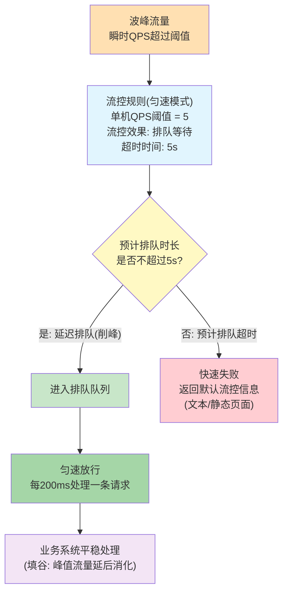
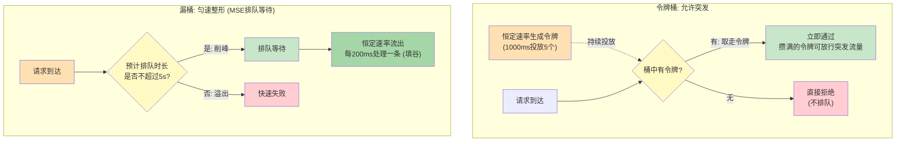

# MSE快速入门

1. MSE产品包含以下模块：**微服务注册配置中心**、**微服务治理**、**云原生网关**
2. 您在构建自己的微服务体系时，既可**单独使用**某个模块，也可搭配使用以便获得微服务生态的最佳实践

<!-- more -->

## 概览

### 简介

本教程覆盖微服务引擎MSE的核心能力，帮助您快速上手并理解MSE产品，预计体验时长20分钟。主要分为如下四个步骤，建议您按照顺序进行体验

1. 在容器（**ACK**或ACK Serverless集群）部署示例的微服务应用，并将**服务注册**到**Nacos**
1. 通过注册**配置中心**实现**统一配置管理**
1. 利用**云原生网关**将**服务暴露**到**公网**
1. 通过**服务治理**实现**全链路灰度发布**


### 适用对象

本教程适用于**Spring Cloud&Dubbo**等**微服务框架**的开发者、IT基础架构师、管理员和DevOps人员等计划在阿里云上实现或扩展云原生架构的相关人员

### 整体架构

- **注册配置中心**：支持**注册和配置中心**全托管（兼容**Nacos**/**ZooKeeper**/**Eureka**），可实现对**服务节点**和**配置信息**的维护和统一管理，具备丰富完善的监控报警、控制台运维操作和引擎类型，相比开源组件，具有**更高性能**、**SLA保障**和**配置能力**
- **云原生网关**：提供安全高效的符合**K8s Ingress标准**的下一代网关，将**Ingress流量网关**、**微服务**、**安全网关**三合一
- **微服务治理**：无侵入增强主流**Spring Cloud**、**Apache Dubbo**等开源微服务框架，提供丰富的**服务治理**和**流量防护**功能，将中间件与业务**解耦**，可实现**熔断限流降级**、**无损上下线**、**全链路灰度**等多种治理能力，提升开发效率和线上稳定性


# ACK + ACS

您可以将部署在容器服务 Kubernetes 版和容器计算服务中的Spring Cloud和Dubbo等微服务应用接入MSE治理中心，使用MSE提供的一系列服务治理能力，大幅提升线上微服务的稳定性和开发效率，本文介绍如何将**ACK**和**ACS**微服务应用接入MSE治理中心

> 为单个应用开启MSE微服务治理 - Deployment - spec.template.metadata.labels

| label                                         | value                                    |
| --------------------------------------------- | ---------------------------------------- |
| msePilotAutoEnable: "on"                      | 开启MSE微服务治理                        |
| mseNamespace: default                         | 设置MSE命名空间                          |
| msePilotCreateAppName: "your-deployment-name" | 设置应用名称，需替换为实际Deployment名称 |

```yaml
spec:
  template:
    metadata:
      labels:
        # 填写“on”表示开启接入，需加上双引号
        msePilotAutoEnable: "on"
        # 填写接入到的治理命名空间，值不存在可自动新建
        mseNamespace: default
        # 填写接入MSE的实际应用名称，需加上双引号
        msePilotCreateAppName: "your-deployment-name"
```

# 配置流控规则

配置**流控规则**的原理是监控应用或服务流量的**QPS**指标，当指标达到设定的**阈值**时立即**拦截**流量，避免应用被**瞬时**的流量高峰冲垮，从而保障应用高可用性。本文介绍如何配置管理流控规则，以及常用场景的流控配置规则。

## 背景信息

1. **流量控制**在**网络传输**中是一个常用的概念，常用于调整**网络包**的**发送**数据
2. 系统需处理的**请求**是**随机不可控**的，而系统的**处理能力**是**有限**的，因此就需要根据系统的处理能力对流量进行控制

## 常用场景：削峰填谷，使流量匀速通过

1. 请求流量具有**波峰波谷**的特点，流控的原理是将前面的峰值流量**延迟**（排队时长）到后面再处理，既能**最大化满足所有请求**，又能保证用户体验
2. 在**新增流控防护规则**或**新增规则**对话框中配置以下规则信息
   - 配置**匀速模式**下请求**单机QPS**阈值为5
   - **流控效果**选择**排队等待**
   - **超时时间**为5s
3. 系统则每 **200ms** 处理一条请求，多余的处理任务将**排队**；同时设置了等待时长为5s，则预计排队时长**超过5s**的处理任务将**快速失败**，**直接返回默认流控信息**，如文本、静态页面等



## 深入原理：匀速排队对应漏桶算法

1. **排队等待**的匀速语义对应**漏桶算法**（Leaky Bucket），Sentinel官方文档明确说明：*匀速排队方式会严格控制请求通过的间隔时间，让请求以均匀的速度通过，对应的是漏桶算法*
2. **令牌桶**与**漏桶**的关键差异就在**匀速**二字上

| 特征          | 令牌桶                       | 漏桶（排队等待）                  |
| ------------- | ---------------------------- | -------------------------------- |
| 放行速率      | **平均速率**恒定，**允许突发** | **严格恒定**，输出被**整形**       |
| 突发流量      | 桶里攒的令牌可被**瞬间取走**，一波请求同时通过 | **不允许**，每个请求间隔固定**200ms** |
| 请求超量时    | 取不到令牌**直接拒绝**（不排队） | 进队列**排队等待**，等太久才拒绝   |

3. 文中三个特征——**每200ms处理一条**、**多余任务排队**、**预计超过5s快速失败**——分别对应漏桶的**恒定出水速率**、**排队缓冲**、**溢出拒绝**；令牌桶算法下请求**不排队**，且攒满令牌时会放行**突发流量**，与**匀速**矛盾



4. MSE的排队等待对应开源Sentinel的`RateLimiterController`，它没有真实的队列数据结构，只用一个`latestPassedTime`时间戳做**虚拟排队**，文中**200ms**的来源即`1000 / QPS阈值 = 1000 / 5`（简化后的核心逻辑）

```java
long currentTime = TimeUtil.currentTimeMillis();
// 相邻两个请求的固定间隔 = 1000 / QPS阈值 = 1000 / 5 = 200ms
long costTime = Math.round(1.0 * acquireCount / count * 1000);
// 本请求的预期通过时间 = 上一个请求的槽位 + 200ms
long expectedTime = costTime + latestPassedTime.get();

if (expectedTime - currentTime <= maxQueueingTimeMs) {
    // 预计排队时长 ≤ 5s: 抢占排队槽位, 等待到自己槽位的时间点再放行 → 匀速
    latestPassedTime.set(expectedTime); // 实际通过CAS循环更新
    sleepUntil(expectedTime);
    return true;
}
// 预计排队时长 > 5s → 快速失败
return false;
```

5. Sentinel中真正借鉴**令牌桶**的是**Warm Up（预热）模式**——用桶中积攒的令牌决定放行斜率，从冷水位平滑爬升到阈值；**快速失败**则是**滑动窗口计数**，达到阈值立即拒绝

| 流控效果     | Controller                | 限流算法                                         | 行为                       |
| ------------ | ------------------------- | ------------------------------------------------ | -------------------------- |
| 快速失败     | `DefaultController`       | 滑动窗口计数                                     | 达到阈值立即拒绝           |
| Warm Up 预热 | `WarmUpController`        | **令牌桶**（参考Guava `SmoothWarmingUp`，冷启动因子3） | 冷启动时缓慢放量爬升到阈值 |
| 排队等待     | `RateLimiterController`   | **漏桶**（虚拟队列）                              | 匀速放行、可排队、超时拒绝 |

6. 注意：排队等待只对**QPS**阈值类型生效，不支持**并发线程数**模式

## 更多信息

> 新增**流控防护规则**或**新增规则**对话框参数说明如下：

| 参数          | 描述                                                         |
| ------------- | ------------------------------------------------------------ |
| 接口名称      | 待流控的资源名称                                             |
| 是否开启      | 打开开关表示启用该规则，关闭开关表示禁用该规则，**开关修改**之后会**立即生效** |
| 单机 QPS 阈值 | 触发对**流控接口**的统计维度对象的QPS阈值                    |
| 流控效果      | 选择流控方式来处理**被拦截的流量**<br />1. **快速失败**：达到阈值时，立即拦截请求，按照应用系统设置中的适配模块配置信息，进行内容返回<br />2. **排队等待**：请求**匀速**通过，允许排队等待，通常用于请求调用削峰填谷等场景，需设置具体的超时时间，达到超时时间后请求会快速失败 |

