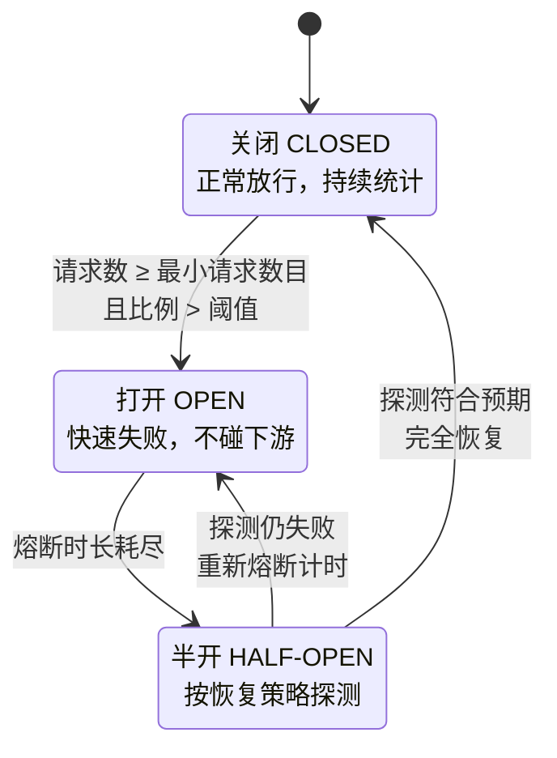
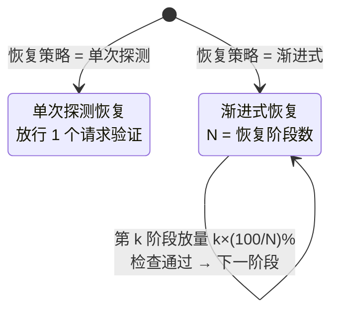
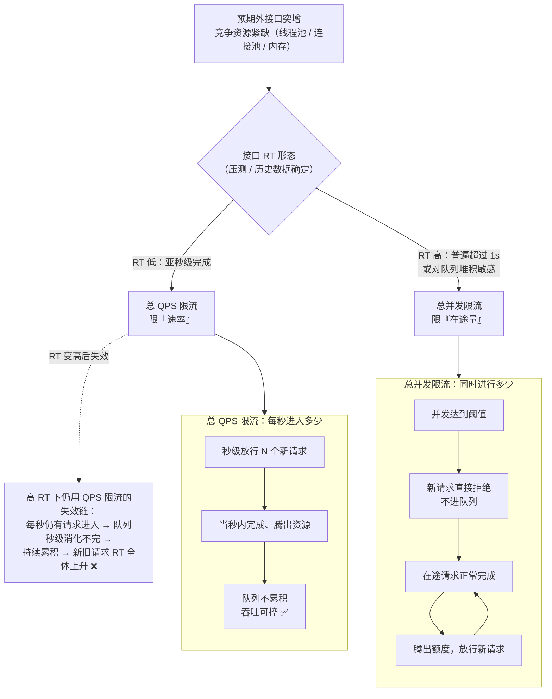
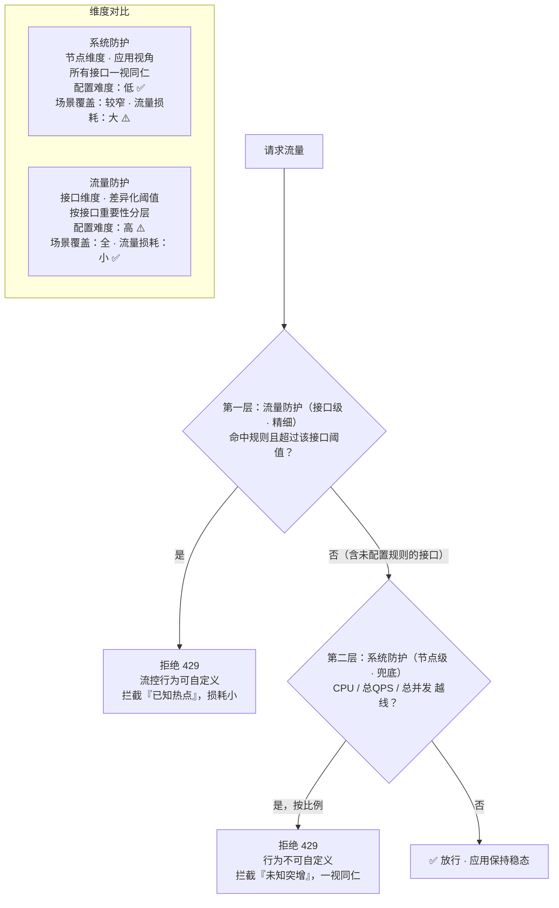

# 流量防护规则适用场景

## 概述

1. **微服务**的**稳定性**一直是您非常关注的话题
2. 随着业务从**单体架构**向**分布式架构**演进以及部署方式的变化，**服务之间**的**依赖关系**变得越来越复杂，业务系统也面临着巨大的**高可用挑战**
3. MSE流量防护就是一款借助**流量控制**、**热点防护**等模块，来提高应用高可用能力的产品
4. 本文介绍各个流量防护规则以及适用的场景

<!-- more -->

## 不稳定场景

在生产环境中您可能遇到过以下不稳定的情况：

- 大促时**瞬间洪峰流量**使得系统超出**最大负载**、**Load飙高**、**系统崩溃**导致用户无法下单
- “黑马”热点商品**击穿缓存**、**数据库被打垮**、**挤占正常流量**
- 调用端被**不稳定第三方服务**拖垮、线程池被占满、调用堆积，导致整个调用链路卡死

这些不稳定的场景可能会导致严重后果，但很多时候开发者容易忽视这些与**流量**、依赖相关的**高可用防护**。MSE流量防护功能就可以预防这些不稳定因素带来的影响，针对流量进行**高可用**的防护，从而保障服务“稳如磐石”。

## 核心场景

流量防护各规则说明和适用的核心场景如下表所示

### 接口流控规则

#### 描述

通过MSE配置**QPS**模式的流控规则，当每秒的请求量超过设定的**阈值**时，会**自动拒绝**多余的请求

#### 核心场景

适用于需要**限制突发的流量**，在尽可能处理请求的同时来保障服务不被击垮的场景

### 并发隔离规则

#### 描述

控制**某些调用**的**并发数**（即正在进行的数目），防止**过多的慢调用**挤占**正常的调用**

#### 核心场景

在调用**第三方服务**时，防止**过多的慢调用**挤占正常调用的资源，避免**服务不可用**

### 熔断规则

#### 描述

对**不稳定**的**弱依赖调用**进行**自动熔断降级**，暂时**切断**下游不稳定的调用，避免**局部不稳定因素**导致整体的**雪崩**

#### 核心场景

避免**局部不稳定**因素（某个**慢调用**、**异常**服务）导致整体的**雪崩**，例如切断某个**RT高**的**第三方服务调用**

### 热点参数防护规则

#### 描述

**自动识别热点参数**并控制**每个热点值**的访问**频次**或**并发量**，可以有效地防止**过“热”**的参数访问**挤占**正常的调用资源

#### 核心场景

适用于针对某些**热点数据**中**访问频次最高**的**Top数据**进行**控制**的场景，例如针对一段时间内最频繁购买的商品ID进行控制，防止突发热点商品**击穿缓存**而导致大量请求到**数据库**的情形

## 流量控制规则

### 场景说明

1. 流量是**随机**、**不可预测**的，可能就在某一时间会出现**流量洪峰**，例如双十一零点的场景
2. 然而**系统的容量**总是**有限**的，如果突如其来的流量超过了系统的**承受能力**，就可能会导致请求处理堆栈、**堆积**的请求**处理缓慢**、**CPU/Load飙高**，最后导致**系统崩溃**
3. 因此，您需要针对这种**突发的流量**来进行**限制**，在**尽可能处理请求**的同时来**保障服务不被击垮**，这就是**流量控制**
4. 流量控制的场景是非常通用的，适用于**脉冲流量类**等场景

### 流控规则说明

1. 通常在**Web入口**或**服务提供方**（Service Provider）的场景下，需要保护服务提供方自身不被**流量洪峰**打垮
2. 此时通常根据服务提供方的**服务能力**进行**流量控制**，或针对**特定的服务调用方**进行**限制**
3. 您可以结合前期**压测**评估**核心接口**的**承受能力**，通过MSE配置**QPS**模式的流控规则，当**每秒的请求量**超过设定的**阈值**时，会**自动拒绝**多余的请求

## 并发控制

### 场景说明

1. 一个服务常常会**调用别的模块**，可能是另外一个**远程服务**、**数据库**，或者**第三方API**等
2. 例如，支付的时候，可能需要远程调用银联提供的API；查询某个商品的价格，可能需要进行数据库查询
3. 然而，这个**被依赖服务的稳定性**是**不能保证**的
4. 如果依赖的服务出现了不稳定的情况，请求的**响应时间变长**，则调用服务的方法的响应时间也会变长，**线程会产生堆积**，最终可能**耗尽业务自身的线程池**，服务本身也变得不可用

微服务的架构示例图如下：

1. 现代**微服务架构**都是**分布式**的，由许多微服务组成
2. 不同服务之间**相互调用**，组成**复杂的调用链路**
3. 以上的问题在链路调用中会产生**放大**的效果
4. 复杂链路上的某一环不稳定，就可能会层层**级联**，最终导致**整个链路**都**不可用**

### 规则说明

1. MSE提供**流量并发控制**的能力，避免**慢调用**等**不稳定因素**造成**服务不可用**
2. 并发控制作为一种**轻量级隔离**的手段，控制**某些调用**的**并发数**（即正在进行的数目），防止**过多的慢调用**挤占**正常的调用**

## 热点参数防护规则

### 场景说明

1. 为了防止被**大流量**打垮，您通常会对**核心接口**配置**限流规则**，但有的场景下配置**普通的流控规则**是**不够**的
2. 例如**大促峰值**的时候，会有不少“**热点**”商品，这些热点商品的**瞬时访问量非常高**
3. 通常您可以事先预测一波热点商品，并对这些商品信息进行**缓存“预热”**，以便在出现**大量访问**时可以**快速返回**而不会都经过数据库
4. 但每次大促都会涌现出一些**“黑马”商品**，这些“黑马”商品是**无法事先预测**的，**没有被预热**
5. 当这些“黑马”商品访问量激增时，大量的请求会**击穿缓存**，直接经过**数据库**，导致数据库访问缓慢，**挤占**正常商品请求的资源池，最后导致**系统崩溃**

### 规则说明

此时，利用MSE的**热点参数流控**能力，**自动识别热点参数**并控制**每个热点值**的**访问频次**或**并发量**，可以有效地防止**过“热”的参数访问**挤占正常的调用资源

# 配置流控规则

## 概述

1. 配置流控规则的原理是**监控**应用或服务流量的**QPS**指标，当指标达到设定的**阈值**时立即**拦截**流量，避免应用被**瞬时的流量高峰**冲垮，从而保障应用**高可用性**
2. 本文介绍如何配置管理流控规则，以及常用场景的流控配置规则

## 前提条件

1. 开通**企业版**
2. MSE治理中心已接入微服务应用

## 背景信息

1. **流量控制**在**网络传输**中是一个常用的概念，常用于调整**网络包**的**发送数据**
2. 系统需处理的请求是**随机不可控**的，而**系统的处理能力**是**有限**的，因此就需要根据**系统的处理能力**对**流量**进行**控制**

## 功能入口

1. 登录MSE治理中心控制台，并在顶部菜单栏选择地域
2. 在左侧导航栏，选择**治理中心** > **应用治理**
3. 在**应用列表**页面，单击目标应用的资源卡片
4. 进入应用之后，选择以下任意一种方法新建流控规则：
   - 在左侧导航栏，单击**应用概览**。单击**通过QPS TOP**页签，然后单击对应接口的**操作**列下的**流控**
   - 在左侧导航栏，单击**接口详情**。单击**接口流控**页签，然后单击**新增流控规则**
   - 在左侧导航栏，单击**流量治理**。单击**流量防护**页签，再单击**接口流控**页签，然后单击**新增流控规则**
5. 在**新增流控防护规则**或**新增规则**对话框中配置规则信息
6. 单击**新建**

## 常用场景

> 削峰填谷，使流量匀速通过

1. 请求流量具有**波峰波谷**的特点，流控的原理是将前面的峰值流量**延迟**（排队时长）到后面再处理，既能最大化满足所有请求，又能保证用户体验
2. 在**新增流控防护规则**或**新增规则**对话框中配置以下规则信息
   - 配置**匀速模式**下请求单机**QPS**阈值为5
   - **流控效果**选择**排队等待**
   - **超时时间**为5s
3. 系统则每 **200ms** 处理一条请求，**多余**的处理任务将**排队**；同时设置了**等待时长**为5s，则预计排队时长超过5s的处理任务将**快速失败**，直接返回默认流控信息，如文本、静态页面等

## 更多信息

1. 接口名称
   - 待流控的**资源**名称
2. 是否开启
   - 打开开关表示启用该规则，关闭开关表示禁用该规则
   - 开关修改之后会**立即生效**
3. 单机QPS阈值
   - 触发对流控接口的统计维度对象的QPS阈值
4. 流控效果
   - **快速失败**
     - 达到**阈值**时，**立即拦截**请求
     - 按照应用系统设置中的适配模块配置信息，进行内容返回
   - **排队等待**
     - 请求**匀速通过**，允许**排队等待**，通常用于请求调用**削峰填谷**等场景
     - 需设置具体的超时时间，达到超时时间后请求会**快速失败**

# 配置熔断规则

## 概述

1. MSE的熔断规则可以监控**应用内部**或者**下游依赖**的**响应时间**或**异常比例**
2. 当达到指定的**阈值**时，MSE会立即**降低下游依赖的优先级**
3. 在**指定的时间内**，系统**不会调用**该异常资源，避免应用的不稳定运行，从而保障应用**高可用性**
4. 指定时间过后，系统会**重新恢复**对该资源的调用
5. 本文介绍如何配置熔断规则以及规则的配置示例

## 背景信息

> 熔断规则配置通常用于**弱依赖降级**场景

1. 除流量控制外，对调用链路中**不稳定**的**方法**或者**下游依赖**进行**熔断**也是流量防护的重要措施之一
2. 由于**调用关系的复杂性**，如果调用链路中的**某一环节出现错误**，会导致此**请求失败**，甚至**放大不稳定性**，导致**整个链路无法正常服务**
3. 熔断功能会在调用链路中某个方法出现不稳定时（例如某方法出现**Timeout**或**异常**比例升高），对这个**方法**的**调用**进行**限制**，让请求**快速失败**，避免此错误影响整个链路
4. 关于熔断的相关信息，请参见下图

## 功能入口

1. 登录MSE治理中心控制台，并在顶部菜单栏选择地域
2. 在左侧导航栏，选择**治理中心** > **应用治理**
3. 在**应用列表**页面单击目标应用的资源卡片，选择以下任意一种方法新建流控规则
   - 在左侧导航栏，单击**接口详情**，切换至**客户端**接口列表。选择具体接口后，单击**服务熔断**页签，然后单击**新增熔断规则**
   - 在左侧导航栏，单击**流量治理**。单击**流量防护**页签，单击**熔断规则**，然后单击**新增熔断规则**
4. 在**新增熔断防护规则**对话框中配置规则信息，然后单击**新增**

## 规则详情

1. 接口名称
   - 适用该规则的应用**资源**
2. 统计窗口时长
   - 统计的时间窗口长度，取值范围为**1秒~120分钟**
3. 最小请求数目
   - **触发熔断**的最小请求数目，若当前**统计窗口内的请求数**小于此值，即使达到熔断条件规则也不会触发
4. 阈值类型 - 选择以**慢调用**比例（%）或**异常**比例（%）作为阈值
   - 选择以慢调用比例作为阈值，需要设置允许的**慢调用RT**（即**最大的响应时间**），请求的响应时间大于该值则统计为慢调用
     - 在熔断比例阈值中设置触发熔断的慢调用比例
     - 规则开启后，在**单位统计时长**内**请求数目**大于设置的**最小请求数目**，并且**慢调用的比例**大于阈值，则接下来的**熔断时长**（s）内请求会**自动被熔断**
     - 经过**熔断时长**后**熔断器**会进入**探测恢复**状态，若接下来的**一个请求响应时间**小于设置的慢调用RT则**结束熔断**，若大于设置的慢调用RT则会**再次被熔断**
   - 选择以异常比例作为阈值，需要在熔断比例阈值中设置触发熔断的异常比例
     - 规则开启后，在单位统计时长内请求数量大于最小请求数据，并且异常请求的比例大于阈值，则接下来的熔断时长（s）内请求会自动被熔断
5. 熔断时长（s）
   - 即**熔断触发**后**持续**的时间
   - 资源进入熔断状态后，在配置的熔断时长内，请求都会**快速失败**
6. 熔断恢复策略
   - 熔断器进入**恢复阶段**（**半开启状态**）的恢复策略
   - **单次探测恢复**
     - 经过**熔断时长**后，熔断器会对**接下来的一个请求**进行**探测**，若该请求**符合预期**（不为慢调用或没有异常），则**结束熔断**；否则**重新回到熔断阶段**
   - **渐进式恢复**：需要设置**恢复阶段数**和**每步最小通过数目**
     - 经过**熔断时长**后，熔断器按照设定的**恢复阶段数**进行渐进式恢复，若该阶段内**请求**达到**一定量**即**每步最小通过数目**，则**触发检查**。检查的请求若**都未超过阈值**，则**逐步提高允许通过的请求比例**，直到**请求完全恢复**；若某一步的指标超出阈值，则**重新回到熔断阶段**。
     - 请求比例**T=100/恢复阶段数N**，则第一阶段请求比例为**T**，第二阶段为**2T**，直到100%。
     - 例如恢复阶段数为3，每步最小通过数目为5，则三个阶段分别按照33%、67%和100%的比例放入请求，当每阶段的请求数目大于等于5时进行检查，若请求的指标未超阈值则进入下一恢复阶段，直至完全恢复。

## 熔断器状态机

上述规则参数背后是一个标准的**熔断器状态机**（与 Sentinel `CircuitBreaker` 的 `CLOSED/OPEN/HALF_OPEN` 三态、Hystrix/Resilience4j 的实现同构）：

**半开状态**内部的两种恢复策略：

- 单次探测：放行接下来 **1 个请求**，符合预期则结束熔断，否则重新回到熔断阶段
- 渐进式：按 `T = 100/恢复阶段数 N` 的步长逐阶段放量（N=3 → 33% → 67% → 100%），每阶段累积到**每步最小通过数目**才做检查，避免半开**瞬间放量**再次打垮**尚未恢复**的下游

几个参数与状态的对应关系：

1. **统计窗口时长 + 最小请求数目**：作用于 `CLOSED` 状态——避免低流量时个别慢请求误触发（分母太小导致比例失真）
2. **熔断时长**：决定 `OPEN` 状态持续多久——期间请求**快速失败**，完全不触碰下游，给下游喘息时间
3. **熔断恢复策略**：决定 `HALF-OPEN` 的行为——**单次探测**是**标准实现**（放行 1 个请求验证）；**渐进式恢复**是 **MSE 的扩展**，按 `100/恢复阶段数 N` 的步长逐阶段放量（如 N=3 → 33% → 67% → 100%），每阶段累积到"每步最小通过数目"才做检查，避免半开**瞬间放量**再次打垮尚未恢复的下游
4. **半开失败回退**：探测不符合预期则**重新回到 `OPEN`** 且**熔断时长重新计时**——这就是熔断器"自愈"与"震荡"的来源

## 常用场景1：慢调用熔断示例

1. 例如调用**第三方服务**，但**响应时间太慢**，会影响当前接口，所以对其进行熔断操作
2. 在新增熔断防护规则对话框中配置以下示例规则信息

| 参数          | 示例值       | 描述                                                         |
| ------------- | ------------ | ------------------------------------------------------------ |
| 接口名称      | test         | 接口名称                                                     |
| 统计窗口时长  | 1            | 统计时长为1秒                                                |
| 最小请求数目  | 10           | 触发熔断的最小请求数目为10                                   |
| 阈值类型      | 慢调用比例   | 选择以慢调用比例作为阈值                                     |
| 慢调用RT      | 1000         | 超过1000毫秒则判定为慢请求                                   |
| 熔断比例阈值  | 80%          | 触发熔断的慢调用比例阈值为80%                                |
| 熔断时长（s） | 10           | 熔断时长有10秒                                               |
| 熔断恢复策略  | 单次探测恢复 | 经过熔断时长后，熔断器会对接下来的一个请求进行探测，若该请求符合预期（不为慢调用或没有异常），则结束熔断；否则重新回到熔断阶段 |

1. 规则开启后，在统计时长1秒内，当请求数目大于10，并且慢调用的比例大于80%的时候，则在接下来10秒的熔断时长内，请求都会快速失败
2. 经过10秒后熔断器会进入探测恢复状态，若接下来的一个请求响应时间小于设置的1000 ms则结束熔断，若大于1000 ms则会再次被熔断

## 常用场景2：异常熔断示例

1. 例如**第三方内容展示**时，系统会出现异常，当异常比例较高时，可以对其进行熔断操作，以保证更好的用户体验
2. 在新增熔断防护规则对话框中配置以下示例规则信息

| 参数          | 示例值       | 描述                                                         |
| ------------- | ------------ | ------------------------------------------------------------ |
| 接口名称      | test         | 接口名称                                                     |
| 统计窗口时长  | 1            | 统计时长为1秒                                                |
| 最小请求数目  | 10           | 触发熔断的最小请求数目为10                                   |
| 阈值类型      | 异常比例     | 选择以异常比例作为阈值                                       |
| 熔断比例阈值  | 80%          | 触发熔断的慢调用比例阈值为80%                                |
| 熔断时长（s） | 10           | 熔断时长有10秒                                               |
| 熔断恢复策略  | 单次探测恢复 | 经过熔断时长后，熔断器会对接下来的一个请求进行探测，若该请求符合预期（不为慢调用或没有异常），则结束熔断；否则重新回到熔断阶段 |

1. 规则开启后，在统计时长1秒内，当请求数目大于10，并且异常的比例大于80%的时候，则在接下来10秒的熔断时长内，请求都会快速失败
2. 经过10秒后熔断器会进入探测恢复状态，若接下来的一个请求没有异常则结束熔断，否则会再次熔断

# 配置热点参数防护规则

> HTTP 请求

## 概述

> 热点参数防护规则（HTTP 请求）为原**Web防护规则**

1. MSE的热点参数防护规则（HTTP 请求）面向提供**Web服务**的应用，针对访问请求中的一些**参数项**进行**精细化**的**流量控制**
2. 对于使用了**主流Web框架**（**Servlet**容器、**Spring Web**、**Spring Boot**）的应用，MSE实现了**API粒度**的**请求参数解析**，通过配置热点参数防护规则（HTTP 请求），可以对请求中**IP**、**Host**、**Header**、**URL Param**等参数维度的**资源调用**进行**流量控制**，保护业务与系统的**稳定性**
3. 本文介绍如何为应用配置热点参数防护规则（HTTP 请求）

## 背景信息

1. 在提供**Web服务**的场景下，除了**API维度**的**限流降级**防护，针对访问请求**来源IP**、访问请求**Param参数**等资源调用的**限流防护**是各种业务场景下能更好保证业务应用正常运行的手段
2. 例如，在一些**大流量**的Web业务场景下，不仅需要对当前接口进行限制，而且需要针对当前**访问频次最高**的**来源IP**或**访问频次最高**的**商品ID**，有针对性地对其访问进行限制，本示例如下：
   - 对一段时间内**最频繁购买的商品ID**进行限制，以防**击穿缓存**而导致大量请求到数据库的情况
   - 对一段时间内**频繁大量访问的来源IP**进行限制，防止利用虚假信息**恶意刷单**

## 功能入口

1. 登录MSE治理中心控制台，并在顶部菜单栏选择地域
2. 在左侧导航栏，选择治理中心 > 应用治理
3. 在应用列表页面，单击目标应用的资源卡片
4. 进入应用之后，在左侧导航栏，单击接口详情。单击热点参数防护（HTTP 请求）页签，然后单击新增热点参数防护（HTTP 请求）
5. 在新增热点参数防护（HTTP 请求）对话框，配置规则信息，完成配置后单击新增
6. 在规则列表选择对应的规则，并在状态栏下单击开启
7. 在温馨提示对话框，单击确认，开启已配置的防护规则

## 示例场景1：热点商品秒杀

1. 在秒杀等抢购商品的场景下，由于流量较大，可能会导致系统响应不及时甚至崩溃
2. 为保证系统稳定，可配置热点参数防护规则，超过一定阈值后，系统会**拒绝多余**的**热点商品流量**
3. 例如购买同一商品，希望1秒内同个商品超过100次请求后，对多余的请求进行拒绝，可在新增热点参数防护（HTTP 请求）对话框中配置以下规则信息，表示1秒内，针对热点商品ID进行下单的请求，每个单独商品ID每秒最多只能允许100个请求，其余超出的当前商品下单请求都会被拒绝，返回自定义的信息
   - 参数属性选择**URL参数**
     - 在参数属性中，选择当前热点商品ID所对应的参数字段，例如，假设URL参数中存在一个stockId字段对应请求的商品ID，那么参数属性可以选择URL参数，并在参数名称中填写属性在请求中对应的字段名称
   - URL参数名称输入**stockId**
   - 阈值输入100个请求/每秒
   - 流控方式选择**快速失败**

## 示例场景2：防止恶意刷单

1. 例如在促销活动中，某些恶意刷单请求较多的时候，会占用较多商品库存或服务器资源
2. 这种情况下可以针对其**IP来源**进行排队等待的处理，使访问请求**匀速通过**，防止过量的请求对服务稳定性产生影响
3. 在新增热点参数防护（HTTP 请求）对话框中配置以下规则信息，表示每个不同来源IP调用此接口的请求会以每10 ms一个的速度匀速通过（1s/100=10 ms），后续多余的请求要进行排队等待
4. 排队中的请求如果等待时长超过30 ms就会立即失败
   - 参数属性选择**Client IP**
   - 阈值类型默认选择**请求数**
   - 阈值输入100个请求/每秒
   - 流控方式选择**排队等待**
   - 超时时间输入30
   - 是否开启选择开启

## 配置项说明

### 参数属性

> 针对**所选API的参数属性**进行流量控制

| 参数属性    | 描述                                                         |
| ----------- | ------------------------------------------------------------ |
| Client IP   | **请求端**的IP地址 若请求经过**代理**，会优先尝试从**X-Forwarded-For**请求头中获取IP信息，如果其IP信息存在，将会使用该IP作为实际请求端IP地址 |
| Remote Host | **请求端**的Host Header                                      |
| Header      | 根据指定的HTTP Header进行解析，如果填写某个具体的Header Key，则该规则针对这个**Header Key**下面的热点值分别进行限制 选择Header后，可选择配置请求属性值的**匹配策略**，只有匹配该模式的请求属性值会纳入统计和流控 |
| URL参数     | 根据指定的**HTTP请求参数**进行解析，需要填写对应的参数名称 选择URL参数后，可选择配置请求属性值的**匹配策略**，只有匹配该模式的请求属性值会纳入统计和流 |

### 匹配模式和匹配串 - 可选

> 若选择参数属性为**Header**或**URL参数**，可打开**属性值匹配**开关，并设置**匹配模式**和**匹配串**，匹配模式如下：

- **精确**：严格按照给定的匹配串来匹配值
- **字串**：若请求属性值**包含**该子串匹配成功，比如若子串设置匹配ab，则aba和cabc都可以匹配，而cba则不能匹配
- **正则**：按给定的**正则表达式**匹配串进行匹配

### 阈值类型

默认为**请求数**

### 阈值

1. 触发对**流控接口**的统计维度对象的QPS阈值
2. 设置时，需选择**统计时间间隔**，支持**秒**、**分钟**、**小时**和**天**四种维度
3. 例如，若阈值填写为10，统计间隔选择**分**，则表示每分钟对应的请求数目不超过10个

### 高级选项

#### 流控方式

1. **快速失败**：当阈值类型为**QPS**时，被拦截的流量将快速失败，即达到阈值时，**立即拦截**请求
   - 被拦截拒绝掉的请求，将返回**行为管理**中配置的**自定义信息**，若未配置会返回默认行为，即**429**错误码加上**默认文本信息**
2. **排队等待**：当阈值类型为**QPS**时，被拦截的请求将**匀速通过**，允许**排队等待**
   - 需设置**具体的超时时间**，预计达到超时时间的请求会**立即失败**，而不会排队
   - 例如，QPS配置为10，则代表请求每100 ms才能通过一个，多出的请求将排队等待通过
   - **超时时间**代表**最大排队时间**，超出最大排队时间的请求将会**直接被拒绝**
   - 排队等待时，QPS不要超过1000（请求间隔1 ms）

#### Burst size

当流控方式选择为**快速失败**时，可以额外设置一个**Burst Size**，即针对突发请求**额外允许**的请求数目

#### 超时时间

1. 当流控方式选择为**排队等待**时，需设置具体的超时时间，单位为ms
2. 例如，QPS配置为5，则代表请求每200 ms才能通过一个，多出的请求将排队等待通过
3. **超时时间**代表**最大排队时间**，超出最大排队时间的请求将会**直接被拒绝**

### 是否开启

1. 开启：热点参数防护规则（HTTP 请求）**创建后即生效**
2. 关闭：热点参数防护规则（HTTP 请求）创建后不生效

### 关联行为

1. 默认行为：默认为此选项
   - 如您无需自定义**限流后处理行为**，选择默认行为即可
   - 默认行为为返回**429**错误码加上**默认的文本信息**
2. 新增行为：新增**自定义限流后处理行为**，创建完成后您可在关联行为选择框中下拉选择

# 配置系统防护

## 概述

1. 系统防护提供了在不同场景下的**节点维度**的**流量防护**能力，以应对各种预期外的情况
2. 例如，当未配置流量防护规则的接口遭遇流量突增时，系统防护能够提供**兜底**的流量防护，确保应用的**稳定性**
3. 目前，微服务治理针对**服务端流量**以及**客户端流量**分别提供了**自适应过载保护**、**总QPS限流**、**总并发限流**、**异常调用熔断**以及**慢调用熔断**能力

## 功能入口

1. 登录MSE治理中心控制台，并在顶部菜单栏选择地域
2. 在左侧导航栏，选择治理中心 > 应用治理
3. 在应用列表页面，单击目标应用的资源卡片，然后在左侧导航栏单击流量治理
4. 单击系统防护页签，配置相应的功能

## 自适应过载保护

> 自适应过载保护需要Agent版本为**3.1.4**及以上

### 简介

1. 自适应过载保护将**CPU使用率**作为衡量**系统负载**的依据，**自适应**地调整对**服务端流量**的**限流比例**
2. 在预期外的**流量突增**场景下也能将CPU使用率相对平稳地控制在配置的阈值范围内

### 生效范围

自适应过载保护对**所有服务端接口**生效，**优先级低于流量防护规则**

### 适用场景

1. 自适应过载保护为**服务端接口**提供基于**CPU**的**兜底防护**，适用于CPU相关型应用，**预期外的接口出现突增** -> **系统CPU持续上升** -> **影响核心接口RT**
1. 根据不同应用的业务，稳态下的CPU使用率也不同，用户可以通过**压测**/**历史数据**确定**稳态**下的**最大CPU使用率**并进行**适当放大**做为阈值进行配置

### 页面说明

1. 页面左侧为**自适应过载保护事件列表**，右侧展示**近5分钟**该应用的节点**平均CPU使用率**变化趋势
2. 事件为**节点维度**，基于**算法**的**状态变更**，包含限流**开始**事件、限流**持续**事件以及限流**结束**事件
3. 页面顶部包含功能开关及**模拟执行**设置项。右侧CPU使用率折线图中以蓝色虚线标示保护线（即防护水位阈值）
4. 单击事件操作的查看链接，可以查询对应**IP节点**的**CPU使用率数据**，并将时间回放至事件上报时间，以观察事件触发时对应节点的CPU使用率以及限流概率等信息

#### 开启状态

- **关闭**：自适应过载保护处于关闭状态
- **模拟执行**：该状态下，当自适应过载保护**触发**时，将**仅产生相应事件**，不实际调整流量防护策略
- **开启**：该状态下，当自适应过载保护**触发**时，**实际调整流量防护策略**，以**一定的比例**对**所有入口流量**进行**限流**

#### CPU使用率

1. 定义**预期**的**CPU使用率阈值**，自适应过载保护会基于**系统实际的CPU使用率**以及**配置的CPU使用率阈值**结合**算法**自适应地**调整接口限流的概率**
2. 帮助系统在**高压**场景下通过**拒绝一部分请求**的方式，维持CPU使用率在配置的阈值**上下小范围波动**

## 总QPS限流

### 简介

> 总QPS限流需要Agent版本为**4.2.0**及以上

总QPS限流将以**节点维度**统计**总QPS**（**单**节点**所有服务端接口**QPS之和），对于超过阈值的请求进行限流操作

### 生效范围

总QPS限流对**所有服务端接口**生效，**优先级低于流量防护规则**

### 适用场景

1. 由于**不是**所有系统的表现都**与CPU强相关**，有些应用在**低CPU负载**下也会因为**内存**、**网络**等原因导致**性能劣化**
2. 而总QPS限流基于**节点的总QPS**来进行限流，提供了基于流量的防护手段
3. **预期外的接口出现突增** -> **竞争资源紧缺** -> **影响核心接口**
4. 用户可以通过**压测**/**历史数据**确定**稳态**下的**节点总QPS**并进行**适当放大**作为阈值进行配置

### 页面说明

1. 页面左侧为**总QPS限流事件**，右侧展示**近5分钟**该应用的节点**平均总QPS请求**数据变化趋势
2. 事件为**节点**和**接口**维度，基于**实际发生总QPS限流**的**节点**以及**接口**上报事件，每**5分钟**上报一次，上报过去5分钟内发生的**限流**
3. 右侧折线图展示**总QPS**、**通过QPS**和**拒绝QPS**三条曲线及阈值参考线，便于观察限流效果
4. 单击事件的查看链接，可以查询对应**IP节点**的**总QPS**，并将时间**回放**至事件上报时间附近
   - 以观察**事件触发**时**对应节点**的**总QPS**以及**限流**是否符合预期
   - 如果需要查看更加详细的信息，比如**接口**和**节点**维度，可以前往接口详情或者节点详情，后续会提供对应的跳转能力
5. 右侧请求数据面板展示**总QPS**、**通过QPS**和**拒绝QPS**三条趋势曲线

#### 开启状态

- **关闭**：总QPS限流处于关闭状态
- **开启**：该状态下，对于超过阈值请求会进行限流操作

#### 总 QPS 阈值

节点维度总 QPS 阈值

## 总并发限流

### 简介

> 总并发限流需要Agent版本为**4.2.0**及以上

总并发限流将以**节点维度**统计总并发（**单**节点**所有服务端接口**并发之和），对于超过阈值的请求进行限流操作

### 生效范围

总并发限流对**所有服务端接口**生效，**优先级低于流量防护规则**

### 适用场景

1. 在**调用RT较高**的场景下（**普遍超过1s**），**QPS限流**会出现一个比较明显的问题，当系统的**竞争资源**（线程池、内存、连接池等）**被占用**时，会导致**排队**进一步导致**接口的RT上升**
   - 如果此时只采用**基于QPS的限流**，每秒还是会有**少量请求进入**，而**队列中的请求无法在秒级别消化完成**，会导致**队列进一步累积**，**RT进一步上升**，无论**新旧请求RT都有显著上升**
   - 此时如果使用了**并发限流**，如果**还有一定量的请求没有完成**，**新的请求会被直接拒绝**，这样虽然请求会被限流，但是系统处理完当前请求后，新的请求就会通过，以较小的排队时间完成请求
   - 从整体上看，**请求的成功率**和**平均RT**都会有显著的改善
2. **预期外的接口出现突增** -> **竞争资源紧缺** -> **队列堆积** -> **所有请求RT上升**
3. 用户可以通过**压测**/**历史数据**确定**稳态**下的**节点总并发**并进行**适当放大**作为阈值进行配置

### 选型对比：总 QPS 限流 vs 总并发限流

两种限流维度适用场景不同，选型逻辑如下图：

一句话总结：**总 QPS 限流限的是"速率"（每秒进入多少），总并发限流限的是"在途量"（同时进行多少）**。两者背后是 Little's Law：`并发 ≈ QPS × RT`——RT 低时二者近似等价（限制速率就隐式限制了并发）；RT 高且队列敏感时，同样的 QPS 阈值意味着巨大的在途并发，只有并发限流能阻断"排队累积 → RT 全体上升"的恶性循环。

### 页面说明

1. 页面左侧为**总并发限流事件**，右侧展示**近5分钟**该应用的**节点平均总并发请求**数据变化趋势
2. 事件为**节点**+**接口**维度，基于**实际发生总并发限流**的**节点**以及**接口**上报事件，每**5分钟**上报一次，上报过去5分钟内发生的限流
3. 单击事件的查看链接，可以查询对应**IP节点**的**总并发**，并将时间**回放**至事件上报时间附近
   - 以观察事件触发时对应节点的**总并发**以及**限流**是否符合预期，如果需要查看更加详细的信息，比如接口和节点维度，可以前往接口详情或者节点详情，后续会提供对应的跳转能力

#### 开启状态

- **关闭**：总并发限流处于关闭状态
- **开启**：该状态下，对于超过阈值请求会进行限流操作

#### 总并发阈值

节点维度总并发阈值

## 异常调用熔断

### 简介

> 异常调用熔断需要Agent版本为**4.2.0**及以上

1. 异常调用熔断会分别统计**每个客户端接口**的异常比例，当异常比例大于配置的阈值时对该接口进行熔断
2. 熔断期间该接口**直接快速失败**，并**相隔一定时间**通过用于**探测**的请求，探测成功后结束熔断

### 生效范围

异常调用熔断对**所有客户端接口**生效，但对于配置了**接口维度熔断规则**的接口**不生效**

### 适用场景

1. 异常调用熔断主要分为两类场景
2. **超时场景**：一个客户端接口的超时异常比例过高，往往是**服务提供方**出现异常情况，但这会进一步导致**调用方**（本应用）**请求堆积**，影响本应用的其他接口，通过熔断的方式可以在提供方异常期间**快速失败**，**避免堆积**
3. **非超时场景**：一个客户端接口的非超时异常比例过高，异常调用熔断能够通过**抛出限流异常**供用户处理，起到**降级**的效果，优化异常场景下的用户体验

## 慢调用熔断

### 简介

> 慢调用熔断需要Agent版本为**4.2.0**及以上

1. 慢调用熔断会分别统计**每个客户端接口**的慢调用比例，当慢调用比例大于配置的阈值时对该接口进行熔断
2. 熔断期间该接口**直接快速失败**，并**相隔一定时间**通过用于**探测**的请求，**探测成功**后**结束熔断**

### 生效范围

慢调用熔断对**所有客户端接口**生效，但对于配置了**接口维度熔断规则**的接口**不生效**

### 适用场景

慢调用熔断的使用场景基本和异常调用熔断中的超时异常相同，区别在于可以**动态调整**判断**慢调用**的**RT标准**，不依赖超时配置

## 例外项

### 简介

> 例外项需要Agent版本为**4.2.0**及以上

所有**系统防护**功能均可以配置例外项，对例外项中的接口系统防护会**直接通过**，而不进行规则的检查

### 适用场景

1. 通常情况下，只有**健康检查接口**以及**系统关键接口**需要配置例外项
2. 前者避免影响**节点的健康状态**，后者有**单独的接口维度的限流限制**，且希望不受**系统维度限流**的影响

## 系统防护 vs 流量防护

1. 系统防护和流量防护都能够保障应用处于**稳态**，但是两者覆盖的**场景**和**流量损耗**不同
2. 触发限流后，**系统防护限流**返回状态码为**429**，目前**不支持用户自定义配置**
3. **系统防护**以**节点维度**的**指标**为依据提供**流量防护**，能够保障应用本身处于稳态，覆盖大部分场景
   - 但是由于**系统防护**从**应用视角**出发，对**所有接口一视同仁**，但在同一个应用中，**不同接口的重要性不同**，对**系统负载的影响**也不同
   - **流量防护**可以通过对**不同接口配置不同的阈值**，从而覆盖更多的场景，并且在同样起到防护作用的同时尽可能较少限流的流量
4. 整体来说**系统防护**和**流量防护**都能够起到防护效果，但是在**防护场景覆盖率**和**流量损耗**上**流量防护效果更好**，在**配置难度**上**系统防护更低**
5. 因此，最佳实践是**系统防护+流量防护**，系统防护保障**应用的稳定性**，流量防护通过**精细化的配置**在防护效果不打折扣的同时**减少损耗**（**限流**的流量）

两层防护的分层协作与维度对比如下图：

一句话理解分工：**流量防护在前面"精确制导"**——认识每个接口、按重要性给不同阈值，把已知热点的超额流量最小化地拦下来；**系统防护在后面"面防御"兜底**——它不认识接口，只看节点整体的 CPU/QPS/并发，专拦第一层没覆盖到的未知突增。**前者省流量，后者保下限**。

# 配置隔离规则

## 概述

1. 隔离规则通过控制**接口**或**依赖**的**并发线程数**，来保证系统的**稳定性**
2. 通常适用于**应用内部**或**下游依赖**出现**不稳定**的场景，例如**慢SQL**、**下游应用响应时间变长**等
3. 本文介绍如何配置和管理隔离规则

## 背景信息

> 隔离规则配置通常用于**强依赖隔离**场景

1. 当**强依赖**的**方法或接口不稳定**的时候，可以通过配置**并发线程数**来限制不稳定的**强依赖**并发数，起到**隔离异常**的效果
2. 若运行该请求的**响应时间变长**，会导致**线程的并发数增大**
3. 当并发数超过阈值以后，MSE将**拒绝多余的请求**，直到**堆积**的任务完成，**并发线程数减少**，从而达到**隔离异常**、减小不稳定性的效果

> 如何设定并发线程数阈值，可参见以下内容

1. **并发线程数** = **期望QPS*响应时间**+**冗余量**

2. 例如预期的SQL执行时间为**20毫秒**，预期该请求**每秒有20个**，并发**最大**时为**6**个，建议并发线程数按照以下逻辑设置：**Max（20/1000*20，6）= 6** ，再加上**冗余量2** ，则建议并发数阈值设置为**8**
3. 设置好后，当这个SQL发生**死锁**或者有**性能问题**，SQL运行特别慢成为**慢SQL**时，即使请求不断地进来，也仅仅会占用8个线程，不会因为持续进来的请求（请求也无法在短时间内退出）而**耗光进程的活跃线程**
4. 当这个**SQL恢复**正常后，**并发数会迅速减少**
5. 当并发数减少至**低于预设的阈值**时，系统就**不会拒绝请求**，应用的**处理能力**也**快速的恢复**
6. 通过这样的方式，起到了根据**响应时间**自动调节的效果，隔离了不稳定的应用

## 功能入口

1. 登录MSE治理中心控制台，并在顶部菜单栏选择地域
2. 在左侧导航栏，选择**治理中心** > **应用治理**
3. 在**应用列表**页面，单击目标应用的资源卡片
4. 进入应用之后，选择以下任意一种方法新建隔离规则：
   - 在左侧导航栏，单击**应用概览**，然后单击**通过QPS TOP**页签，单击对应接口的**操作**列下的**隔离**
   - 在左侧导航栏，单击**接口详情**。单击**并发隔离**页签，然后单击**新增隔离规则**
   - 在左侧导航栏，单击**流量治理**。单击**流量防护**页签，再单击**并发隔离**页签，然后单击**新增隔离规则**
5. 在**新增隔离防护规则**或**新增规则**对话框中配置规则信息，然后单击**新增**

## 常用示例：保障自身资源充足

1. 当运行该请求的**响应时间变长**，会导致**线程的并发数变大**
2. 当**并发数超过阈值**以后，MSE将**拒绝多余的请求**，直到**堆积**的任务完成，**并发线程数变少**
3. 达到将**异常隔离**，减小不稳定性的效果
4. 例如某个SQL执行时间为**20毫秒**，预期该请求**每秒有20个**
5. 在**新增隔离防护规则**或**新增规则**对话框中配置以下规则信息：
   - 填写**接口名称**
   - **并发数阈值**为10
6. 设置完成后，当这个SQL发生**死锁**或者存在**性能问题**时，该SQL运行变慢，成为**慢SQL**，此时即使请求不断进来，也仅仅会**占用10个线程**
7. 不会因为持续进来的请求（请求也无法在短时间内退出），从而**耗光进程的活跃线程**
8. 当这个**SQL恢复**正常后，**并发数会迅速减少**
9. 当并发数减少至**低于预设的阈值**时，系统就**不会拒绝请求**，应用的**处理能力**也**快速的恢复**
10. 通过这样的方式，起到了根据响应时间自动调节的效果，隔离了不稳定的应用

## 更多信息

| 配置项       | 描述                                                 |
| ------------ | ---------------------------------------------------- |
| **接口**名称 | 待隔离的**资源**名称                                 |
| 并发数阈值   | **资源的并发线程数**（即该资源正在执行的线程数）阈值 |

# 流量治理

## 无损上下线

在**应用启动**各阶段，**无损上线**能提供相应的保护能力，通过**无损下线**配置来保证应用正常关闭

## 配置系统防护

系统防护提供了在不同场景下的**节点维度**的**流量防护能力**，以应对各种**预期外的情况**

## 流量防护

流量防护以流量为切入点，从**流量控制**、**熔断降级**、**系统负载保护**等多个维度来保障业务的**稳定性**，提供更专业稳定的流量防护手段、**秒级**的**流量水位分布分析**功能

## 配置标签路由

标签路由通过**给流量打标**、**给机器打标**、**增加路由能力**，从而约束**符合特征流量**只调用到**对应标签的节点**上，实现按**流量特征**与**机器标签路由**的目的

## 配置同可用区优先

1. 同可用区（Availability Zones）优先路由，是指在应用调用服务时，优先调用**同机房**的服务Provider
2. 同可用区优先是一种**负载均衡**策略，能够使流量在同一个可用区内流转，不仅限于使用默认提供的**轮询**方式进行负载均衡

## 配置消息灰度

使用**金丝雀发布**、**全链路灰度**以及**开发环境隔离**等场景中需要使用到**消息的灰度**，那么您需要开启消息灰度的功能

## 服务实例隔离与诊断

服务实例隔离与诊断可以有效地应对**线上故障**（例如**内存泄露**），提升微服务系统**整体稳定性**

