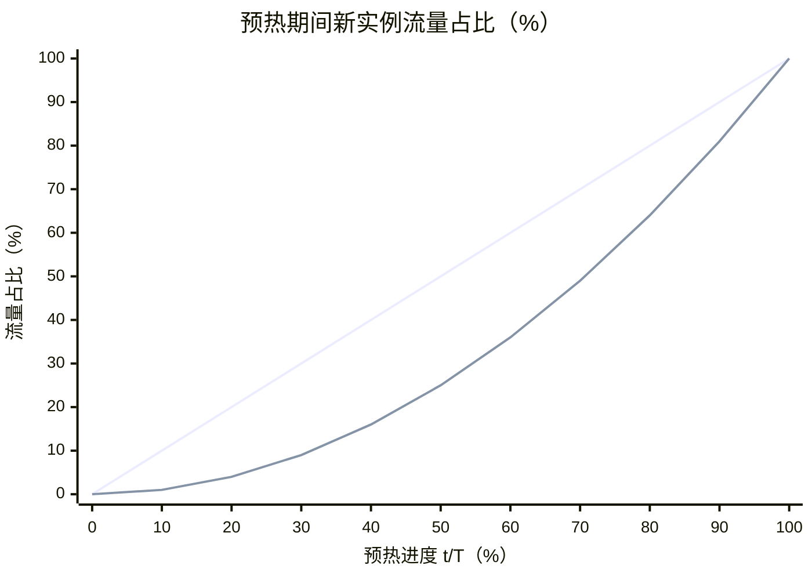
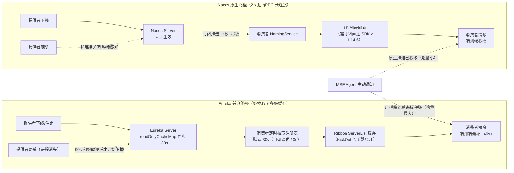
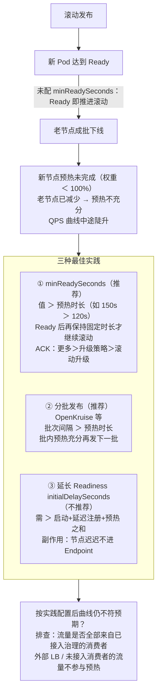

# 无损上下线

1. 为了提高系统的**效率**和**响应速度**，减少**任务切换**时的**等待时间**，同时提高系统的**可用性**和**稳定性**
2. 本文介绍微服务治理中的流量治理模块的无损上下线功能

<!-- more -->

## 无损上线

无损上线能提供相应的**保护**能力，包括**服务延迟注册**、**服务小流量预热**、**服务就绪检查**三个功能

## 无损下线

1. 在**高并发**下，服务**提供端**应用实例的**直接下线**，会导致服务**消费端**应用实例**无法实时感知**下游提供者实例的实时状态，因而出现继续将请求**转发**到**已下线的实例**，从而导致请求报错，**流量有损**
2. 为了解决这类问题，MSE提供了无损下线功能，帮助您更好的应对一个线上应用，在服务更新部署等过程中的问题

## 使用YAML配置无损上下线

您不仅可以在**MSE控制台**上配置无损上下线功能，也可以通过在容器服务**ACK**中配置**YAML无损上下线**参数方式来开启功能

# 无损上线

1. 对于任何一个线上应用来说，**发布**、**扩容**、**重启**等操作不可避免
2. 在**应用启动**各阶段，无损上线能提供相应的**保护**能力，包括**服务延迟注册**、**服务小流量预热**、**服务就绪检查**三个功能
3. 本文介绍MSE提供的无损上线功能

## 无损上线功能概述

### 延迟注册

1. 微服务**提供者**实例会在**应用启动**过程中，进行**服务的注册**
2. 一旦完成服务注册，就可以被外部服务**消费者**应用**订阅**和**调用**
3. 对于基于**Spring**框架开发的Java应用而言，**注册过程**一般发生在**Spring上下文刷新完毕之后**
4. 如果应用有一些**异步初始化**逻辑还没有执行完毕，就直接进行**服务注册**，此时消费者前来调用时很可能会产生**请求报错**
   - 比如大数据计算服务需要提前从OSS拉取几百兆数据，待数据拉取完成后才能对外提供服务
5. 因此如果**应用启动**后**直接注册服务**，会导致**流量**因**资源未就绪**而报错
6. 有了延迟注册功能之后，我们可以通过设置**一定的延迟时间**，将原本的服务注册动作往后推迟
7. 让应用在**充分初始化**后再注册到**注册中心**对外提供服务
8. 避免了微服务提供者**未准备完毕**，就被外部调用，产生**调用出错**的情况

### 小流量预热

1. 很多时候，**刚启动的新实例**会处于一种“**冷机**”状态
2. 冷机状态下，需要进行比如**连接池的懒加载**、**缓存预热**、**热点代码生成**等操作，因此这些新实例对请求的**处理能力**会**远远小于**运行很久的实例
3. 如果开发与运维人员不对这个过程进行干涉，可能会造成**新实例上线**这段时间内，系统**整体平均RT时间**变高
4. 更坏的情况下，还可能会造成服务“夯”住，导致大量请求调用**超时**、**报错**的情况
5. 以下是需要进行**资源加载**的实例，在**尚未完成资源加载**的情况下，与**资源加载完毕后**的两次请求调用**时长对比**
6. 在**资源加载过程**中，如果有大量请求到达该实例，可能都会发生**阻塞**：

```
[arthas@37035]$ trace com.alibaba.mse.consumer.TestController eurekaRest  -n 5 \
    --skipJDKMethod false
Press Q or Ctrl+C to abort.
Affect(class count: 1 , method count: 1) cost in 105 ms, listenerId: 1
`---ts=2022-02-14 21:28:02;thread_name=http-nio-18099-exec-1;id=39;is_daemon=true;priority=5;TCCL=org.springframework.boot.web.embedded.tomcat.TomcatEmbeddedWebappClassLoader@60e5272
    `---[464.275852ms] com.alibaba.mse.consumer.TestController:eurekaRest()
        `---[464.018509ms] org.springframework.web.client.RestTemplate:getForObject() #50

`---ts=2022-02-14 21:28:08;thread_name=http-nio-18099-exec-3;id=3b;is_daemon=true;priority=5;TCCL=org.springframework.boot.web.embedded.tomcat.TomcatEmbeddedWebappClassLoader@60e5272
    `---[8.46028ms] com.alibaba.mse.consumer.TestController:eurekaRest()
        `---[8.402525ms] org.springframework.web.client.RestTemplate:getForObject() #50
```

1. 小流量预热功能的思路是，在新服务实例**刚上线**的这段时间里，控制**消费者应用**对其调用的流量大小，来避免Java应用**冷启动**时请求**处理能力差**，系统**整体RT变高**的问题，并且保护**新启动的服务实例**不会被大流量**击垮**
2. 进入该实例的**流量**会按**一定规则**随时间**不断加大**，当达到设置的**预热时长**时，小流量预热过程结束，实例正常接收流量
3. 小流量预热使用的是在线的**消费者**的流量，需要该服务实例的消费者应用也接入MSE服务治理

### 服务注册状态检查

1. **K8s**提供了就绪检查机制（**Readiness Probe**），在进行**服务发布**时，新实例就绪检测通过后，就会下线旧的实例（具体情况取决于设置的发布策略）
2. 然而**K8s无法感知微服务何时就绪**，当**端口启动**时，K8s会认为应用已经就绪
3. 这可能会导致**刚启动的服务还未注册到注册中心**，就被**K8s**判定为已经**就绪**，进而继续推进**服务发布**的动作，**下线正在运行的旧实例**
4. 从而引发**消费端**调用出错，并在调用过程中出现**service no provider/instance**等异常
5. 无损上线的**服务就绪检查**功能，通过Agent的**无侵入方式**为应用提供一个检测其**是否完成注册的HTTP接口**，如果未完成注册，则返回**500**状态码；当应用注册完成后，会返回**200**状态码
6. 用户将**应用的就绪检测**配置成该接口后，可以**帮助K8s判定应用是否就绪**，保障**K8s场景**下服务发布上线过程中，服务消费者一直有可用的提供者，不会产生无提供者的报错

## 使用无损上线

### 注意事项

1. 目前只支持通过**微服务注册中心**（如 **Nacos**）进行**注册发现**体系下实例的无损上线，不支持 **K8s Service** 体系下微服务实例的无损上线
2. 对于**Spring Cloud**应用，当前仅支持利用**Nacos**、ZooKeeper以及**Eureka**这三种类型的**注册中心**构建的应用进行**服务预热**
3. Spring Cloud服务预热功能是基于Spring Cloud框架默认的`ZoneAwareLoadBalancer`、`RoundRobinLoadBalancer`或`RandomLoadBalancer`负载均衡器实现的，如果应用本身修改了该配置，会导致服务预热功能失效
4. 服务预热需要**提供者**、**消费者**都接入**MSE服务治理**才能生效
5. 比如**网关应用**，是通过**直接对外暴露 API**的方式接收**外部流量**，因此MSE当前的小流量预热功能对此类应用不生效

### 使用方式

#### 步骤一：开启无损上线

1. 登录MSE治理中心控制台，并在顶部菜单栏选择地域
2. 在左侧导航栏，选择治理中心 > 应用治理，然后单击目标应用的资源量卡片
3. 在目标应用详情页面的左侧导航栏，单击**流量治理**，然后选择**无损上下线**页签
4. 在配置信息模块，单击修改，打开无损上线按钮，单击下方确定

#### 步骤二：配置k8s服务就绪检查

> 该操作会直接引起应用的**重启**，如果是生产环境，建议您挑选发布窗口执行该操作！

1. 登录容器服务管理控制台，在左侧导航栏选择集群列表
2. 在集群列表页面单击目标集群，在左侧导航栏选择工作负载 > **无状态**，单击部署的应用操作列下的编辑，在**健康检查**栏处，单击**就绪检查**右侧的开启，并配置如下参数。完成后单击更新
   - 路径：**/readiness**
     - 如果您的应用所使用的探针版本低于**4.1.10**，路径需要配置成/health。查看探针版本方式：MSE 控制台 > 治理中心 > 应用治理 > 单击对应的应用 > 节点详情，右侧可以看到探针版本
   - 端口：**55199**
   - 延迟探测时间（秒）：推荐该值的配置大于**应用启动所需时间** + 无损上线功能模块中配置的**延迟注册时间**（默认0秒）二者之**和**，如果您不按照该建议进行配置，不会影响功能正常使用
   - 其他参数，请参见创建无状态工作负载Deployment，应用重启后，通过就绪检查前完成服务注册即可生效

#### 配置延迟注册时长 - 可选

> 设置完毕后，在**下一次应用启动**时，延迟注册时长才会生效

请根据业务场景需要决定是否配置，操作步骤如下：

1. 根据步骤一、二进入**无损上线**功能页面，开启无损上线功能，并配置**K8s服务就绪检查**
2. 修改无损上下线**配置信息**，单击无损上线模块**左侧箭头**展开配置选项，在**延迟注册时长（秒）**处设置延迟注册时长，然后单击下方**确定**按钮

#### 调整小流量预热时长

开启**无损上线**后，该功能会**自动开启**。默认**预热时长**为**120**秒。可以根据业务场景需要进行调整：

1. 根据步骤一、二进入**无损上线**功能页面，开启无损上线功能，并配置**K8s服务就绪检查**
2. 修改无损上下线**配置信息**，单击无损上线模块**左侧箭头**展开配置选项，单击**高级选项**，在**小流量预热时长（秒）**处设置小流量预热时长，然后单击下方确定按钮
3. 如果您希望开启小流量预热的服务，其调用方是 **MSE 云原生网关**，那么这里配置的小流量预热**无法生效**
   - 对应的解决方案是在 **MSE 云原生网关**配置该服务的预热
   - 在云原生网关控制台中，单击目标网关实例，在左侧导航栏的**路由管理** > **服务**页签中，找到该服务，单击目标服务**操作**列下的**更多** > **策略配置**，在**策略配置**页签下的**流量管理** > **负载均衡配置**的右侧，单击**编辑**，调整配置项**预热时间**即可
   - 注意，**云原生网关默认**的**预热 QPS 曲线图形**是**一次曲线**，和 **MSE 服务治理**提供的**二次曲线**略有差异，**实际效果上差别不大**
   - **一次曲线 / 二次曲线**指预热窗口内新实例分到的**流量权重**随时间的爬升形状，即数学里的**一次函数 / 二次函数曲线**（不是圆锥曲线那个"二次曲线"）
     - **一次曲线（线性）**：流量占比 = `t/T`，随时间**匀速直线上升**
     - **二次曲线（抛物线）**：流量占比 ≈ `(t/T)²`，**先慢后快**，前半程压得更低、临近预热结束才加速放行
     - 选二次曲线的直觉：**实例最"冷"**的阶段**处理能力最差**，且 **JIT 热点编译**、**缓存填充**等能力恢复本身就是**先慢后快**，抛物线正好把**最少的流量**分给**最冷的时段**，比**线性**更保守；文档说"实际效果差别不大"，是因为**预热过半**后实例通常已足够热
     - 该注意事项只在**调用方是 MSE 云原生网关**时才有意义（网关**自带预热配置**，不走治理中心）；**自建网关** + **Spring Cloud** 消费方场景下，预热由 **MSE 治理的二次曲线**接管，一次曲线这条碰不到

**两条曲线的流量占比对比**（同一预热进度下新实例的放行比例，最终都收敛到 100% 全量）：

| 预热进度 t/T | 一次曲线（线性 t/T） | 二次曲线（抛物线 (t/T)²） |
|:---:|:---:|:---:|
| 25% | 25% | ~6% |
| 50% | 50% | 25% |
| 75% | 75% | ~56% |
| 100% | 100% | 100% |



> 说明

1. 设置完毕后，在**下一次应用启动**时，调整后的小流量预热时长才会生效
2. 小流量预热方法通过在服务**消费端**根据各个服务**提供者**实例的**启动时间**计算**权重**，结合**负载均衡**算法，控制刚启动应用**流量**随**启动时间**逐渐递增到正常水平的过程，帮助刚启动运行的服务进行预热
   - 同时这也要求了服务**消费者**也接**MSE服务治理**
3. 建议您在首次使用无损上线的小流量预热功能时，**使用默认的预热时长即可**
   - 如果在使用默认值预热服务的过程中发现**预热效果不明显**，出现**流量损失**，再通过调节该参数进行优化

## 无损上线观测

经过上述配置后，当您的**应用再次启动**时，可以在无损上下线功能页面，看到**应用实例上线下线**的**具体时间**，以及同时期该实例的**QPS曲线**：

1. 登录MSE治理中心控制台，并在顶部菜单栏选择地域。
2. 在左侧导航栏，选择治理中心 > 应用治理，然后单击目标应用的资源量卡片
3. 在目标应用详情页面的左侧导航栏，单击**流量治理**，然后选择**无损上下线**页签
4. 在**上下线概览**中，单击左侧的**上下线实例**，在右侧可以看到该实例在**上线阶段**的**QPS变化**以及**对应发生的事件**

您可以看到，应用先后会出现**服务注册**、**开始预热**、**预热结束**这几个事件，并且**K8s Readines检查通过**的事件也发生在**服务注册事件**之后。**QPS曲线**是在**预热时长内**（默认 120s）**逐步上升到最大值**，而不是**直接陡升上去**。如果您的应用在上线时，事件顺序、QPS曲线形状不符合预期，可以参考[FAQ](https://help.aliyun.com/zh/mse/support/lossless-start-and-shutdown-faq)来解决。


以一个典型配置为例，应用的**K8s就绪检测**配置成`55199/readiness`，并且将**最小准备时间**（**minReadySeconds**）配置成**120秒**，和**默认的预热时长**一致

# 无损下线

## 概述

1. 对于任何一个线上应用，在服务**更新**部署等过程中，需要尽量保证**客户端无感知**，即从**应用停止**到**重启恢复服务**这个阶段不能影响正常的业务请求
2. 在应用执行**部署**、**停止**、**回滚**、**缩容**和**重置**时，需要通过**无损下线**配置来保证**应用正常关闭**
3. 本文介绍使用无损下线的注意事项、使用优势以及如何在控制台使用无损下线功能

## 为什么需要无损下线

由于微服务应用自身调用特点，在**高并发**下，服务**提供端**应用实例的**直接下线**，会导致服务**消费端**应用实例**无法实时感知**下游**提供者**实例的**实时状态**，因而出现继续将请求转发到已下线的实例，从而出现请求报错，**流量有损**

### 下线感知的传播链：Eureka 拉取 vs Nacos 推送

一次“提供者下线”要走到“消费者不再调用它”，**感知速度取决于注册中心的通知模型**——Eureka 的**纯拉取**与 Nacos 原生的**订阅推送**是两条完全不同的链路：



**逐环节对比**：

| 环节 | Eureka 协议（8761 兼容端点） | Nacos 原生（gRPC 长连接） |
|-----|-----|-----|
| **服务端感知** | 显式注销走 readOnlyCache **~30s** 同步；硬杀等 **90s 租约驱逐** | 显式注销**立即**；硬杀 = 长连接关闭**秒级感知**（机器失联才等 keepalive，~20s 量级） |
| **通知消费者** | **纯拉取**：定时拉注册表（默认 30s / 自研调优 10s） | **订阅推送**：实例列表变更沿长连接推给订阅方，亚秒~秒级 |
| **消费端 LB** | Ribbon ServerList 缓存再刷一层（KickOut 监听器绕开） | 同样存在——需订阅直连进 LB（自研 NacosSubscriptionServerListUpdater，**SDK ≥ 1.14.6**） |
| **端到端窗口** | 优雅下线最坏 **~40s**（自研调优后）/ ~90s（社区默认） | **秒级** |

**关键结论**：

1. **“实时感知”由客户端协议决定，不由服务端版本决定**——服务端是 Nacos 3.x 也救不了 Eureka 客户端：兼容层翻译的是协议，**拉取模型原样保留**（“双配置、单注册”的应用正是此形态：Nacos 原生地址躺在环境变量里，走的却是慢车道）
2. Eureka 的延迟是**设计取舍**而非缺陷：AP 优先 + TTL 租约 + 多级缓存扛读压力，用传播延迟换可用性（自我保护机制同源）
3. **gRPC 长连接是 Nacos 2.0 引入的**：1.x 客户端走 HTTP + UDP 推送（有丢包，靠定时拉取兜底），还是半个拉取模型——客户端版本由 Spring Cloud Alibaba / 自研 SDK 决定
4. **推送只到客户端内存，最后一公里在 LB**：Ribbon 的 ServerList 有自己的刷新周期，需要订阅直连；实测 logan-admin-svr 的 `forge: 1.14.3` 恰好差 1.14.6 这一档——就算切到 Nacos 原生通道，不升 SDK 也拿不到即时刷新
5. 治理选型推论：**主动通知在 Nacos 路径增量小（功能重叠），在 Eureka 路径是唯一秒级手段（MSE 补位）**——Eureka→Nacos 客户端收尾迁移 + SDK 升级后，下线感知问题被架构消解；在那之前，主动通知是过渡期的桥
6. **无损上线不受此影响**：预热加权、延迟注册是上线侧能力，推送再快也给不了，Agent 价值独立存在

## 无损下线实现方案

1. **提供者A**在**下线**时，虽然会**主动通知**到**注册中心**，但此时**消费者B**可能**无法实时感知**到，导致消费者B**继续调用已下线**的提供者A
2. 为了避免这种情况的发生，在**提供者A**接到**下线命令**即将下线前，对于在**等待下线阶段**收到的**请求**，在其**返回值**中都增加上**特殊标记**，让**消费者B**接收到返回值并**识别到相关标志**后**主动拉取**一次注册中心服务实例，从而**实时感知**提供者A最新状态，从而达到提供者A的下线状态能够被消费者B实时感知
3. 此外，提供者A在**下线**时，还会**等待一定的时间**，以保证**下线时**已经收到的**在途请求**都**被执行完毕**，避免这些请求**未被执行完毕**，提供者A就已经停机

### 被动通知（标记+按需拉取）能打掉几级延迟

“标记 + 主动拉取”这套机制（被动通知）**打不穿 Eureka 服务端的只读缓存**——文档说“拉一次就能实时感知”，对默认配置的 Eureka 是不严谨的。把下线感知的延迟拆成四级，看它逐级打掉谁：

| 延迟层 | 默认耗时 | 被动通知（标记+拉取） |
|---|---|---|
| ① 服务端 readOnlyCacheMap 同步 | ~30s | ❌ **打不掉** |
| ② 消费端定时拉取周期 | 30s（自研调优 10s） | ✅ 标记触发**按需拉取**，绕开周期 |
| ③ Ribbon ServerList 刷新 | ~30s | ✅ Agent 见标记直接改本地列表（KickOut 同思路） |
| ④ 在途请求 | RT 量级 | ✅ 等待窗口内执行完 |

**机制细节与推论**：

1. Eureka 的**显式注销/状态变更会立即失效 readWriteCacheMap**（Guava invalidate）——所以“拉一次”拿到的是否新鲜，取决于这次读走不走 readOnly：默认 `use-read-only-response-cache=true`，读由 readOnly 承接，**最坏残留 ~30s**；社区经典调优就是关掉它，让读直击 readWrite，显式操作后立即新鲜
2. 被动通知的真实语义：**把感知窗口从周期链路（社区默认 ~90s / 自研调优后 ~40s）压到只剩 ① 的 readOnly 残留（≤30s）**，剩下交给“等待下线时间”盖住——等待窗口必须 ≥ ① 的残留 + 余量。消费方里有 Eureka 的按 30s+ 设计；Nacos 原生路径注册中心读本来就新鲜，秒级即可。这就是“优雅停机窗口按消费方注册中心类型取最坏值”的理论依据
3. **标记本身是带内信号**：从濒死实例的响应里直接来，就是“这个实例要下线”的第一手信息，比任何注册中心读都新鲜；按需拉取的真正价值是同步**其余拓扑**（比如顶上来的新实例）——对被标记的这个实例，合理实现是见标记即本地踢除，不依赖拉取结果是否新鲜
4. **主动通知（Agent 广播）完全旁路注册中心**，连 ① 都绕开——Dubbo READONLY_EVENT 就是连接级带内信号，连注册中心都不经过；对 Eureka 路径这才是秒级手段
5. 环境补记：公司“Eureka 服务端”实为 MSE Nacos 兼容层（8761），读路径是否照抄社区 readOnly 语义是**开放问题**（可直接问阿里云）；生产主动通知=关，走的就是被动路径——**生产无损下线的等待时长未实勘记录，需补记对账**（是否盖住 30s 残留）
6. 补证（主动通知 FAQ，2026-09-08）：标记 = 响应中的特殊 **header**，消费者识别后即“拉黑”该节点；被动通知的隐含前提是**下线窗口内（~30s）有请求流过**——**消费者流量稀疏**（窗口内一笔请求都没有）时被动机制失效，这才是必须开主动通知的判据：**低频被调用的服务是主动通知的第一批候选**，高频服务被动方案已足够

> 当前应用只需要接入MSE，就会**默认开启无损下线**功能，但无损下线**主动通知**功能需要**手动配置**。同时MSE无损上下线功能提供**可观测能力**，帮助您判断应用是否无损下线成功。


1. 在 **K8s** 环境中接入 **MSE 服务治理无损下线**时，无损下线相关的操作会以`lifecycle.preStop`的形式注入到 **Pod** 中，并在 **Pod 停机前得以执行**，因此不建议您配置自定义的`preStop`
2. 如果您的`preStop`中的行为是进行**微服务注册中心下线**，那么完全可以将其删除，并且使用**无损下线**自动注入的`preStop`来实现这一需求
3. 如果您确实有一些业务上的**优雅停机**操作，并且已经为**业务容器**配置上了您自定义的`preStop`，那么无损下线`preStop`不再进行注入到您的业务容器中
   - 相应地，无损下线会注入一个名字为**gracefulshutdown**的**sidecar**容器，并为该容器注入无损下线`preStop`，通过**sidecar**默认与**业务容器**共享**网络命名空间**的机制，在 Pod 停止前执行**sidecar**的`preStop`也能实现业务容器的无损下线
4. 为了确保sidecar的preStop能够顺利执行完毕，您在**业务容器**自定义的**preStop**中，至少有 **30** 秒的 **sleep** 时间，保证**在途请求**被执行完毕
5. sidecar 容器的资源消耗极低，目前配置为：**CPU: 50m，Memory: 50Mi**
6. 由于**无损下线**在 **K8s** 场景下是基于 **preStop** 来实现的，目前只能支持 **pod 正常停机**场景的**无损下线**（如：**缩容**、**重启**、**滚动升级**等），不支持**异常停机**场景的无损下线（如：**OOM kill**）

## 如何开启无损下线

1. 如果您的应用部署在阿里云容器服务 **ACK** 环境下，在接入 MSE 服务治理后，**无需**额外执行开启无损下线的操作，**无损下线**功能**默认**会**自动开启**
2. 如果您的应用部署在阿里云 **ECS** 环境下，那么需要您在**应用的停机脚本**，加入下面的内容，并在脚本运行阶段**靠前优先执行**

```
curl http://127.0.0.1:54199/offline 2>/tmp/null; sleep 30;
```

## 无损下线观测

应用接入无损下线之后，在**应用实例下线**时，可以在应用治理界面观测到，下线实例的**流量**在**很短时间内被清空**，QPS数据很快降为0

1. 登录MSE治理中心控制台，并在顶部菜单栏选择地域
2. 在左侧导航栏，选择治理中心 > 应用治理，然后单击目标应用的资源量卡片
3. 在目标应用详情页面的左侧导航栏，单击**流量治理**，然后选择**无损上下线**页签

在**上下线概览**处，可以看到最近一段时间内，该应用**上下线过程**中的发生的**事件**。在左侧上下线实例中找到想要查看的下线实例，单击该实例，可以在右侧看到，该实例在下线时执行了“**无损下线**”流程，并且在执行完该流程后，**流量会被快速清空**，一直到**实例“停机”**之前，已经**不再有流量进入**

如果观测到**无损下线成功事件**产生之后，**QPS数据没有快速降为0**，可以先确认是否存在**本地调用**等非来自于**微服务请求调用**的流量

当探针版本在 **4.2.0** 后才会上报“应用停机”事件，如果您未观测到该事件，可以考虑升级您的探针版本

## 如何开启主动通知

### 什么是主动通知

1. 主动通知是无损下线功能模块提供的一个进阶功能，默认**关闭**
2. 一般情况下，MSE无损上下线提供的下线方案已经可以解决**大部分场景**下的问题
3. 而当，待下线应用使用**Spring Cloud**框架时，在**应用下线**时发现有**消费者调用出错**的情况，可以尝试开启该功能来解决
4. 开启后，提供者实例在下线阶段将会**主动通知服务消费者**，通知后，服务消费者将**不再请求该提供者实例**

### 注意事项

> MSE治理中心暂不支持如下应用无损下线：

1. 暂不支持**非Java应用体系**的无损下线
2. 暂不支持**非WebFlux或SpringMVC**应用的无损下线
3. 暂不支持**消费端**为**非微服务应用**的下游提供者应用的无损下线
4. 需要**消费者端**和**提供端**应用都接入**MSE微服务治理**，才能实现应用无损下线

由于**无损下线流程**中需要**等待一定的时间**来保证下线示例**在途中的请求**都能**执行完毕**，K8s容器中的`terminationGracePeriodSeconds` 参数值（默认值 30）需要**大于30**，建议配置为90

如果您使用默认的30，可能会存在应用`shutdownhook`无法正常执行完毕的情况，从而导致应用停机时一些资源无法正常关闭

### 开启无损下线主动通知

1. 登录MSE治理中心控制台，并在顶部菜单栏选择地域
2. 在左侧导航栏，选择治理中心 > 应用治理，然后单击目标应用的资源量卡片
3. 在目标应用详情页面的左侧导航栏，单击**流量治理**，然后选择**无损上下线**页签
4. 在配置信息模块，单击修改，然后单击无损下线折叠块，打开**主动通知**按钮，然后单击确定

# 基于自建Spring Cloud Gateway或Zuul网关实现全链路灰度

## 概述

1. **Spring Cloud Gateway**和**Zuul**是两种常用的微服务架构中的**API网关**，它们均能实现**路由转发**和**过滤器处理**等功能
2. 通过配置**路由规则**，可以将请求路由到**灰度环境**中，对**灰度版本**进行验证和测试
3. 借助MSE提供的**全链路灰度能力**，您**无需修改业务代码**，即可实现**端到端**的**全链路流量控制**
4. 本文介绍如何通过配置Spring Cloud Gateway或者Zuul网关实现全链路灰度

## 背景信息

1. 本文通过模拟真实的调用链路为您演示MSE全链路灰度功能
2. 您**无需修改任何业务代码**，只需要给**入口应用**设置**流量规则**，该**流量的标签**会通过链路**透传**到**下一个灰度版本**中
3. 在**每个应用**的**调用过程**中，符合**金丝雀**条件的流量会**优先调用对应的版本**，如果**没有**对应版本则会自动切换回**基线版本**（即稳定版本）
4. 部署spring-cloud-gateway、spring-cloud-a、spring-cloud-b、spring-cloud-c这四个业务应用，以及注册中心**Nacos Server**
5. 调用链路为：**spring-cloud-gateway->A->B->C**
6. 应用之间的调用既包含了**Spring Cloud**服务调用，也包含了**Dubbo**服务调用


全链路灰度提供了给**流量染色**，并让**灰度流量**优先调用**灰度节点**的能力，帮助您进行可控的**灰度验证**，保障稳定性。**全链路灰度验证**通常采用以下策略：

1. 直接调用现有**线上流量**的一小部分进行测试，通常按照**百分比**控制
2. 按照**特定规则**筛选线上流量进行验证，如使用指定的**Header**或**Cookie**等

本文将分别介绍上述两种策略配置方式，以便适应微服务架构中不同的灰度发布需求

## 步骤一：将应用接入MSE微服务治理

将**ACK微服务应用**接入MSE治理中心，您可以选择您需要的方式实现应用接入 - 为**单个应用**开启MSE微服务治理

1. 进入集群工作负载-**无状态**应用页面，切换到应用的命名空间下
2. 找到所接入的应用，点击「查看Yaml」
3. 按以下格式编辑**Labels**，完成后点击「更新」

```yaml
spec:
  template:
    metadata:
      labels:
        # 填写“on”表示开启接入，需加上双引号
        msePilotAutoEnable: "on"
        # 填写接入到的治理命名空间，值不存在可自动新建
        mseNamespace: default
        # 填写接入MSE的实际应用名称，需加上双引号
        msePilotCreateAppName: "your-deployment-name"
```

## 步骤二：部署应用（模拟线上场景）

1. 登录容器服务管理控制台，在左侧导航栏选择集群列表
2. 在集群列表页面，单击目标集群名称，然后在左侧导航栏，选择工作负载 > **无状态**
3. 在无状态页面选择命名空间，然后单击使用YAML创建资源
4. 本文示例中部署一个注册中心**Nacos Server**，然后部署spring-cloud-gateway、spring-cloud-a、spring-cloud-b、spring-cloud-c这四个业务应用。您也可以直接在Demo中获取对应的源码

### 注册中心 Nacos Server

```yaml
apiVersion: apps/v1
kind: Deployment
metadata:
  name: nacos-server
spec:
  replicas: 1
  selector:
    matchLabels:
      app: nacos-server
  template:
    metadata:
      labels:
        msePilotAutoEnable: "off"
        app: nacos-server
    spec:
      containers:
        - name: nacos-server
          image: 'registry.cn-hangzhou.aliyuncs.com/mse-governance-demo/nacos-server:v2.1.2'
          env:
            - name: MODE
              value: standalone
            - name: JVM_XMS
              value: 512M
            - name: JVM_XMX
              value: 512M
            - name: JVM_XMN
              value: 256M
          imagePullPolicy: Always
          livenessProbe:
            failureThreshold: 3
            initialDelaySeconds: 15
            periodSeconds: 10
            successThreshold: 1
            tcpSocket:
              port: 8848
            timeoutSeconds: 3
          readinessProbe:
            failureThreshold: 5
            initialDelaySeconds: 15
            periodSeconds: 15
            successThreshold: 1
            tcpSocket:
              port: 8848
            timeoutSeconds: 3
          resources:
            requests:
              cpu: '1'
              memory: 2Gi
      dnsPolicy: ClusterFirst
      restartPolicy: Always
---
apiVersion: v1
kind: Service
metadata:
  name: nacos-server
spec:
  type: ClusterIP
  ports:
    - name: nacos-server-8848-8848
      port: 8848
      protocol: TCP
      targetPort: 8848
    - name: nacos-server-9848-9848
      port: 9848
      protocol: TCP
      targetPort: 9848
  selector:
    app: nacos-server
```

### spring-cloud-c 应用

```yaml
# Source: mse-simple-demo/templates/spring-cloud-c-deployment.yaml
apiVersion: apps/v1
kind: Deployment
metadata:
  name: spring-cloud-c
spec:
  replicas: 1
  selector:
    matchLabels:
      app: spring-cloud-c
  template:
    metadata:
      labels:
        msePilotAutoEnable: "on"
        msePilotCreateAppName: "spring-cloud-c"
        app: "spring-cloud-c"
    spec:
      containers:
        - name: spring-cloud-c
          image: "registry.cn-hangzhou.aliyuncs.com/mse-governance-demo/spring-cloud-c:3.0.1"
          imagePullPolicy: Always
          env:
            - name: nacos.host
              value: "nacos-server"
            - name: nacos.namespace
              value: "public"
          resources:
            requests:
              cpu: 1
              memory: 2Gi
            limits:
              cpu: 1
              memory: 2Gi
          ports:
          - name: http-port
            containerPort: 20003
      affinity:
        podAntiAffinity:
          preferredDuringSchedulingIgnoredDuringExecution:
            - podAffinityTerm:
                topologyKey: failure-domain.beta.kubernetes.io/zone
              weight: 50
            - podAffinityTerm:
                topologyKey: kubernetes.io/hostname
              weight: 100
```

### spring-cloud-b 应用

```yaml
# Source: mse-simple-demo/templates/spring-cloud-b-deployment.yaml
apiVersion: apps/v1
kind: Deployment
metadata:
  name: spring-cloud-b
spec:
  replicas: 1
  selector:
    matchLabels:
      app: spring-cloud-b
  template:
    metadata:
      labels:
        msePilotAutoEnable: "on"
        msePilotCreateAppName: "spring-cloud-b"
        app: "spring-cloud-b"
    spec:
      containers:
        - name: spring-cloud-b
          image: "registry.cn-hangzhou.aliyuncs.com/mse-governance-demo/spring-cloud-b:3.0.1"
          imagePullPolicy: Always
          env:
            - name: nacos.host
              value: "nacos-server"
            - name: nacos.namespace
              value: "public"
          resources:
            requests:
              cpu: 1
              memory: 2Gi
            limits:
              cpu: 1
              memory: 2Gi
          ports:
            - name: http-port
              containerPort: 20002
      affinity:
        podAntiAffinity:
          preferredDuringSchedulingIgnoredDuringExecution:
            - podAffinityTerm:
                topologyKey: failure-domain.beta.kubernetes.io/zone
              weight: 50
            - podAffinityTerm:
                topologyKey: kubernetes.io/hostname
              weight: 100
```

### spring-cloud-a 应用

```yaml
# Source: mse-simple-demo/templates/spring-cloud-a-deployment.yaml
apiVersion: apps/v1
kind: Deployment
metadata:
  name: spring-cloud-a
spec:
  replicas: 1
  selector:
    matchLabels:
      app: spring-cloud-a
  template:
    metadata:
      labels:
        msePilotAutoEnable: "on"
        msePilotCreateAppName: "spring-cloud-a"
        app: "spring-cloud-a"
    spec:
      containers:
        - name: spring-cloud-a
          image: "registry.cn-hangzhou.aliyuncs.com/mse-governance-demo/spring-cloud-a:3.0.1"
          imagePullPolicy: Always
          env:
            - name: nacos.host
              value: "nacos-server"
            - name: nacos.namespace
              value: "public"
          resources:
            requests:
              cpu: 1
              memory: 2Gi
            limits:
              cpu: 1
              memory: 2Gi
          ports:
            - name: http-port
              containerPort: 20001
      affinity:
        podAntiAffinity:
          preferredDuringSchedulingIgnoredDuringExecution:
            - podAffinityTerm:
                topologyKey: failure-domain.beta.kubernetes.io/zone
              weight: 50
            - podAffinityTerm:
                topologyKey: kubernetes.io/hostname
              weight: 100
```

### spring-cloud-gateway 应用

```yaml
# Source: mse-simple-demo/templates/spring-cloud-gateway-deployment.yaml
apiVersion: apps/v1
kind: Deployment
metadata:
  name: spring-cloud-gateway
spec:
  replicas: 1
  selector:
    matchLabels:
      app: spring-cloud-gateway
  template:
    metadata:
      labels:
        msePilotAutoEnable: "on"
        msePilotCreateAppName: "spring-cloud-gateway"
        app: spring-cloud-gateway
    spec:
      containers:
        - image: "registry.cn-hangzhou.aliyuncs.com/mse-governance-demo/spring-cloud-gateway:3.0.1"
          imagePullPolicy: Always
          env:
            - name: nacos.host
              value: "nacos-server"
            - name: nacos.namespace
              value: "public"
            - name: enable.auto
              value: "true"
            - name: enable.rpc.invoke
              value: "true"
            - name: enable.sql
              value: "false"
            - name: enable.sentinel.demo.flow
              value: "true"
          name: "spring-cloud-gateway"
          resources:
            requests:
              cpu: 1
              memory: 2Gi
            limits:
              cpu: 1
              memory: 2Gi
          ports:
            - containerPort: 20000
      affinity:
        podAntiAffinity:
          preferredDuringSchedulingIgnoredDuringExecution:
            - podAffinityTerm:
                topologyKey: failure-domain.beta.kubernetes.io/zone
              weight: 50
            - podAffinityTerm:
                topologyKey: kubernetes.io/hostname
              weight: 100
---
# Source: mse-simple-demo/templates/spring-cloud-gateway-service.yaml
apiVersion: v1
kind: Service
metadata:
  annotations:
    service.beta.kubernetes.io/alibaba-cloud-loadbalancer-spec: slb.s1.small
    service.beta.kubernetes.io/alicloud-loadbalancer-address-type: internet
  name: spring-cloud-gateway-slb
spec:
  ports:
    - port: 80
      protocol: TCP
      targetPort: 20000
  selector:
    app: spring-cloud-gateway
  type: LoadBalancer
```

> 执行以下命令查看部署结果：

```
kubectl get svc,deploy
```

> 预期输出：

```
NAME                               TYPE           CLUSTER-IP   EXTERNAL-IP  PORT(S)             AGE
service/kubernetes                 ClusterIP      172.16.x.x   <none>       443/TCP             23h
service/nacos-server               ClusterIP      172.16.x.x   <none>       8848/TCP,9848/TCP   94s
service/spring-cloud-gateway-slb   LoadBalancer   172.16.x.x   8.130.x.x    80:32641/TCP        57s
NAME                                   READY   UP-TO-DATE   AVAILABLE   AGE
deployment.apps/nacos-server           1/1     1            1           94s
deployment.apps/spring-cloud-a         1/1     1            1           66s
deployment.apps/spring-cloud-b         1/1     1            1           74s
deployment.apps/spring-cloud-c         1/1     1            1           83s
deployment.apps/spring-cloud-gateway   1/1     1            1           57s
```

## 步骤三：部署spring-cloud-c、spring-cloud-a应用的灰度版本

> 登录容器服务管理控制台。使用如下**YAML**部署spring-cloud-c应用的灰度版本：
>

```yaml
# Source: mse-simple-demo/templates/spring-cloud-c-gray-deployment.yaml
apiVersion: apps/v1
kind: Deployment
metadata:
  name: spring-cloud-c-gray
spec:
  replicas: 1
  selector:
    matchLabels:
      app: spring-cloud-c-gray
      version: gray
  template:
    metadata:
      labels:
        msePilotAutoEnable: "on"
        msePilotCreateAppName: "spring-cloud-c"
        alicloud.service.tag: gray
        app: "spring-cloud-c-gray"
        version: gray
    spec:
      containers:
        - name: spring-cloud-c
          image: "registry.cn-hangzhou.aliyuncs.com/mse-governance-demo/spring-cloud-c:3.0.1"
          imagePullPolicy: Always
          env:
            - name: nacos.host
              value: "nacos-server"
            - name: nacos.namespace
              value: "public"
          resources:
            requests:
              cpu: 1
              memory: 2Gi
            limits:
              cpu: 1
              memory: 2Gi
          ports:
            - name: http-port
              containerPort: 20002
      affinity:
        podAntiAffinity:
          preferredDuringSchedulingIgnoredDuringExecution:
            - podAffinityTerm:
                topologyKey: failure-domain.beta.kubernetes.io/zone
              weight: 50
            - podAffinityTerm:
                topologyKey: kubernetes.io/hostname
              weight: 100
```

> 使用如下**YAML**部署spring-cloud-a应用的灰度版本

```yaml
# Source: mse-simple-demo/templates/spring-cloud-a-gray-deployment.yaml
apiVersion: apps/v1
kind: Deployment
metadata:
  name: spring-cloud-a-gray
spec:
  replicas: 1
  selector:
    matchLabels:
      app: spring-cloud-a-gray
      version: gray
  template:
    metadata:
      labels:
        msePilotAutoEnable: "on"
        msePilotCreateAppName: "spring-cloud-a"
        alicloud.service.tag: gray
        app: "spring-cloud-a-gray"
        version: gray
    spec:
      containers:
        - name: spring-cloud-a
          image: "registry.cn-hangzhou.aliyuncs.com/mse-governance-demo/spring-cloud-a:3.0.1"
          imagePullPolicy: Always
          env:
            - name: nacos.host
              value: "nacos-server"
            - name: nacos.namespace
              value: "public"
          resources:
            requests:
              cpu: 1
              memory: 2Gi
            limits:
              cpu: 1
              memory: 2Gi
          ports:
            - name: http-port
              containerPort: 20001
      affinity:
        podAntiAffinity:
          preferredDuringSchedulingIgnoredDuringExecution:
            - podAffinityTerm:
                topologyKey: failure-domain.beta.kubernetes.io/zone
              weight: 50
            - podAffinityTerm:
                topologyKey: kubernetes.io/hostname
              weight: 100
```

## 步骤四：创建灰度环境泳道组

1. 登录MSE治理中心控制台，并在顶部菜单栏选择地域
2. 在左侧导航栏，选择
3. 在**全链路灰度**页面顶部，选择**微服务命名空间**
   - 您选择的微服务命名空间内如果没有**泳道组**，请单击创建**泳道组及泳道**；如果已存在泳道组，则请单击+创建泳道组
4. 在创建泳道组面板，单击+ 创建泳道组，在创建泳道组页面，设置如下相关配置，然后单击确定

| 配置项         | 说明                                                         |
| -------------- | ------------------------------------------------------------ |
| 泳道组名称     | 自定义泳道组的名称                                           |
| 入口类型       | 选择**Java服务网关**                                         |
| 入口应用       | 选择**spring-cloud-gateway**                                 |
| 泳道组涉及应用 | 选择**spring-cloud-a**、**spring-cloud-b**和**spring-cloud-c** |

## 步骤五：创建灰度环境泳道

> 说明

1. 使用**全链路灰度**功能时，需要您给**灰度应用**添加一个特殊的`tag`标记，以便将这些**节点**和其他节点**区分**开来
   - 容器环境下需要您在`spec.template.metadata.labels`下增加`alicloud.service.tag: ${tag}`信息
   - ECS 环境下需要添加Java启动参数`-Dalicloud.service.tag=${tag}`
2. 以**Java网关**作为**全链路灰度入口**时，MSE支持**两种泳道模式**
   - 按**请求内容**灰度
     - 当请求内容可以用于灰度识别时，建议采用此种灰度模式
     - 如果不可以，也强烈建议您通过系统改造增加此类灰度标识，以便获得更好的灰度效果
     - 比如，可以保持**灰度请求前后**的**一致性**。
   - 按**比例路由**灰度
     - 当请求内容无法用于**灰度识别**且遗留系统也无法进行改造时，可以采用此种**退化**的灰度模式
     - 该模式有一定弊端，可能导致**同一来源的请求**进入**不同泳道**，而造成**灰度请求前后行为的不一致**
3. **泳道路由模式**在一个**泳道组**中需要**保持一致**
   - 您只有在创建**泳道组中第一条泳道**时可以调整**网关路由规则Path**和**泳道路由模式**

> 步骤

1. 在**全链路灰度**页面底部，单击点击创建**第一个分流泳道**
2. 如果您选择的微服务空间内已经创建过泳道，则单击**创建泳道**
3. 在**创建泳道**面板，设置**流控泳道**相关配置，然后单击**确定**

| 配置项             | 说明                                                         |
| ------------------ | ------------------------------------------------------------ |
| 配置**节点标签**   | 需要您手工给您的**灰度应用节点**打上**标签**，用来和**正常节点**做区分 |
| 填写泳道信息       | **泳道标签**：该**泳道内的匹配的流量**去往的**目标标签**<br />**确认匹配关系**：检查您**配置**了该**标签的应用节点数**是否**符合预期** |
| 配置路由和灰度规则 | 设置**流量进入该泳道**的规则<br />1. 输入**Path**：若为**空**则代表**匹配所有路径**。<br />2. **灰度模式**：选择**按比例灰度**<br />3. **流量比例**：30% |

您还可以为**每条网关path**分别设置**不同的流量比例**，开启该功能时，您需要注意该每条path当前在所有泳道组中配置的流量**比例总和不应超过100%**

### 创建按请求内容路由的泳道

1. 配置**节点标签**
   - 需要您给**灰度应用节点**打上**标签**，用来和**正常节点**做区分
2. 填写**泳道信息**
   - **泳道标签**：该**泳道内所匹配的流量**去往的**目标标签**。本示例将泳道目标标签设置为**gray**。
   - **确认匹配关系**：检查您**配置**了该**标签**的**应用节点数**是否符合预期。
3. 配置**路由**和**灰度规则**
   - 输入**Path**。若为**空**则代表**匹配所有路径**。
   - **灰度模式**：选择**按内容灰度**。
   - **灰度条件**：新增规则条件，选择**以下条件同时满足**。
     - 本示例设置灰度条件为：请求**Parameter**名为**name**，值为**xiaoming**。配置如下：
     - **参数类型**：Parameter
     - **参数**：name
     - **条件**：==
     - **值**：xiaoming

### 创建按比例路由的泳道

> 请确保MSE Java Agent的版本为**3.2.3**及以上，否则会影响百分比灰度能力

1. 配置**节点标签**
   - 需要您给**灰度应用节点**打上**标签**，用来和**正常节点**做区分
2. 填写**泳道信息**
   - **泳道标签**：该**泳道内所匹配的流量**去往的**目标标签**。本示例将泳道目标标签设置为**gray**。
   - **确认匹配关系**：检查您**配置**了该**标签**的**应用节点数**是否符合预期。
3. 配置**路由**和**灰度规则**
   - 输入**Path**。若为**空**则代表**匹配所有路径**。
   - **灰度模式**：选择**按比例灰度**。
   - **流量比例**：30%。

> 完成泳道创建后，在**全链路灰度**的**流量分配**区域，可以查看**泳道详情**，还可以进行如下操作

1. 在**操作**列，选择**开启**，创建的泳道将会生效，即**流量**会按照**泳道方式**进行**流转**，
2. **满足规则的流量**会**优先流向标记有当前泳道**对应**标签**的**应用版本**，如果没有对应标签的应用版本，则流向**未打标的应用版本**。
3. 在**操作**列，选择**关闭**，关闭创建的泳道，即该应用往后的流量会流向**未打标**的应用版本。


## 步骤六：测试基线及灰度版本流量

### 测试按请求内容路由的泳道

使用curl命令测试基线流量：命令中的`8.130.x.x`是Spring Cloug Gateway暴露出的公网IP地址。

```
curl 8.130.x.x/A/a
A[192.168.x.x][config=base] -> B[192.168.x.x] -> C[192.168.x.x]
```

使用curl命令测试灰度流量：

```
curl 8.130.x.x/A/a?name=xiaoming
Agray[192.168.x.x][config=base] -> B[192.168.x.x] -> Cgray[192.168.x.x]
```

1. 当参数带上`name=xiaoming`时，会命中**灰度标签**，并向后**透传**。
2. 比如灰度请求到A应用和C应用时，会请求到**Agray**和**Cgray**节点。
3. 请求到B应用时，由于不存在Bgray节点，仍然会请求B的**基线节点**。

### 测试按比例路由的泳道

> 通过如下Python3脚本测试按比例路由的分流情况（需要安装requests包）。注意将`x.x.x.x`替换为spring-cloud-gateway网关的入口SLB地址。

```python
# pip3 install requests
# python3 traffic.py
import requests
TOTAL_REQUEST = 100
ENTRY_URL = 'http://x.x.x.x/A/a'
def parse_tag(text:str):
    '''
    A[10.0.23.64][config=base] -> B[10.0.23.65] -> C[10.0.23.61]
    Agray[10.0.23.64][config=base] -> B[10.0.23.65] -> Cgray[10.0.23.61]
    Ablue[10.0.23.64][config=base] -> B[10.0.23.65] -> Cblue[10.0.23.61]
    '''
    print(text)
    app_parts = text.split(' -> ')
    # tag_app: C[10.0.23.61] / Cgray[10.0.23.61]
    tag_app = app_parts[-1]
    splits = tag_app.split('[')
    # tag_part: C / Cgray
    tag_part = splits[0]
    tag = tag_part[1:]
    return tag if len(tag) > 0 else 'base'
def get_tag(url:str):
    resp = requests.get(url)
    resp.encoding = resp.apparent_encoding
    return parse_tag(resp.text)
def cal_tag_count(url:str, total_request:int):
    count_map = {}
    for i in range(total_request):
        tag = get_tag(url)
        if tag not in count_map:
            count_map[tag] = 1
        else:
            count_map[tag] += 1
    print()
    print('Total Request:', total_request)
    print('Traffic Distribution:', count_map)
if __name__ == '__main__':
    cal_tag_count(ENTRY_URL, TOTAL_REQUEST)
```

运行以上脚本后，约有30%的流量会去往灰度环境。

## 步骤七：可观测

若应用出现异常，您可以通过MSE提供的可观测能力查看异常数据，帮助您快速定位问题。

### 微服务治理可观测

在MSE微服务治理的**全链路灰度**页面，单击目标应用，在**应用 QPS 监控**区域，可查看对应泳道**基线版本**和**灰度版本**的流量情况


- **总QPS**：该应用总的QPS。
- **异常QPS**：该应用出错的请求数。
- **GrayQPS**：该应用的**灰度版本**的QPS。

# 无损上下线常见问题

## 小流量预热的原理是什么？为什么小流量预热需要提供者、消费者都接入服务治理？

1. 当**消费者**对某个服务进行**调用**时，会对该服务的**提供者**进行**选择**
2. 在**提供者**应用**开启小流量预热**的情况下，服务治理对这里“**选择提供者**”的过程进行了**增强**
3. 在**消费者**选择**提供者**时，会计算每个提供者的**权重大小**（0%~100%），权重越大的提供者节点，被选择和调用的概率就会越高
4. 开启**小流量预热**的提供者在**刚启动时**，消费者对其计算的**权重很低**，因此预热的节点被调用的概率也会变低
5. 随着时间增加，这个权重计算结果会不断增大，最终达到**100%**，达到100%时，**预热流程**就**结束**了，开始和**正常节点**一样接收流量
6. 提供者会在**服务注册**的**元数据**中，带上**自身启动的时间**，以供**消费者**进行**权重计算**
7. 这个过程需要**提供者**、**消费者**双方都开启服务治理才能实现

> 重要

1. 小流量**预热的“开始”**会在**应用**收到**第一笔请求**后触发，当预热过程已经达到配置的**预热时长后**（默认120秒），**小流量预热结束**
   - 如果应用**一直没有收到外部流量**，则**不会触发预热的开始**
2. **小流量预热触发**的**前提**是有**外部流量进来**，这就要求**服务**已经**完成了注册**
   - 如果您发现应用**还未进行服务注册**，却已经**开始了小流量预热**（即您在控制台观察到**预热开始事件**出现在**服务注册事件**之前）

## 为什么我的预热曲线不符合预期？该如何解决？

> 正常情况下**小流量预热**时，应用的**QPS**曲线图如下：


但是有些时候由于**不合理**或**不支持**的使用场景，进行小流量预热的应用，其QPS曲线图形状会不太符合预期（**缓慢上升**），下面是两种常见的不符合预期的情况

### QPS 曲线中途出现陡升现象


1. 这种现象一般发生在**服务发布**的场景，如果在**服务发布**时，**新节点的预热还没有达到指定时长**，**老节点就被下线了**，那么消费者端在选择提供者时，就无法实现控制新节点被“**低概率**”调用到了
2. 所以会在 QPS 曲线图中看到，某个新节点的 QPS 曲线在**前半段时缓慢上线**的态势，达到某个时间节点后，**老节点被全部下线**，QPS 曲线就出现**陡升**现象了

### QPS 曲线未呈现缓升趋势


1. 出现这种现象，建议检查对该应用发起请求的**消费者**应用已经接入服务治理，如果消费者端没接入，则考虑将消费者应用都接入服务治理，就可以解决该问题
2. 如果您需要预热的应用，其流量来自**外部**（比如Java网关），这种场景下**消费者是没有接入服务治理**的，小流量预热也无法支持这种场景

## 小流量预热的最佳实践是什么？

在**滚动发布**的情况下，经常会出现**预热不充分**的问题。您可以参考以下实践，来保证**服务预热**达到**预期效果**：

1. **配置最小准备时间（推荐）**
   - 您可以为工作负载配置`.spec.minReadySeconds`来控制**pod就绪后达到可用状态**时的**时间间隔**，并且设置该参数的值**大于pod的小流量预热时长**，以使得K8s等待 **pod 预热完毕后**再**继续滚动发布**
   - 如果您使用的是**ACK**，您可以直接在容器平台上找到您的应用，在 **更多 > 升级策略 > 滚动升级 > 最小准备时间（minReadySeconds）** 中直接设置。
   - 设置 **minReadySeconds** 可以在**发布**时，让**新启动的pod状态达到ready并维持固定时长**之后，才会**继续发布**
2. **使用分批发布（推荐）**：您可以考虑使用**OpenKruise**等方式，实现**工作负载**的**分批发布**，并且控制**每个批次发布时的时间间隔大于小流量预热时长**，保证**批次内的新节点预热充分**后，再继续发布**一下次批次**的节点

此外，**延长Readiness就绪检测的初始探测时间（不推荐）**，也是一种方式，您可以增加工作负载**Readiness** 的**首次探测延迟时长**（**initialDelaySeconds**），并且大于**小流量预热时长**、**延迟注册时长**、**应用启动时间**三者之**和**。注意，应用启动时间一般需要观测实际日志输出来得出，并且随着业务发展，应用的启动时间也会随之变化；此外，延迟 Readiness 通过的时间，也会导致**新启动的节点**迟迟无法被加入到 K8s Service的**Endpoint**中，因此我们不推荐您使用这种方式来保证预热效果达到最佳。

如果您按照最佳实践进行操作后，发现预热QPS曲线仍然不符合预期，可以考虑**应用接收的流量**，是否都来自于**已经接入服务治理的消费者应用**，如果有消费者没有接入服务治理，或者存在来自于**外部负载均衡**的调用流量，那么应用预热时的QPS曲线图也会不符合预期。

**三种实践对比与决策图**：



> **测试环境实勘（2026-09-08，xp_hd1_ack_test 全部 2898 个 Deployment）**：设置 `spec.minReadySeconds`
> 的仅 **1 个**——`kube-system/ack-koord-manager`（阿里云组件自带，3s，与预热无关），**业务侧 0/2897**；
> 同时**未安装 Kruise/OpenKruise**（无相关 CRD），分批发布路径也缺位；logan ns 滚动策略普遍
> `surge=25% / unavail=0~25%`、`minReady=0`。即两条推荐实践都没在用：滚动节奏完全由 Ready 推进，
> MSE 预热 120s 期间老节点照常成批退出——上文 FAQ 说的"QPS 曲线中途陡升"是公司滚动发布的**默认形态**。
> 低成本补法（零代码零组件）：ACK 控制台 升级策略＞滚动升级＞**最小准备时间设 150s**（＞ 预热 120s），
> 代价仅是每批 ready 后多等 150s、发布总时长拉长。生产集群无 kubeconfig 未勘，ACK 控制台只读确认即可。

## 55199/readiness是做什么的？为什么不配置55199/readiness会有流量跌0的风险？

1. 55199/readiness是MSE微服务治理提供的一套**内置**的、**HTTP类型**的**就绪检查端口**，当应用的**K8s就绪检查**配置成**55199/readiness**时，在**新节点上线**阶段，如果该**节点尚未完成服务注册**，则就绪检查返回**500**；如果该节点**已经完成服务注册**，则就绪检查返回 **200**。
2. 按照 K8s 默认的发布策略，**新节点没有就绪，老节点就不会下线**
   - 当就绪检查配置了`55199/readiness`之后，**新节点**完成**服务注册**之后，才会进入**就绪状态**，即只有在**新节点完成服务注册**的情况下，**老节点才会下线**
   - 这样就会保证注册中心上该服务一直会有可用的节点
   - 如果您不配置`55199/readiness`，可能会在**服务发布**时，**新节点尚未注册，老节点就被下线**，进而导致注册中心上该服务**没有可用节点**，进而导致该服务的所有消费者在调用时因为没有提供者而发生报错，从而产生该**服务的流量跌0**
   - 因此我们**强烈建议您开启无损上线，并为应用配置**`55199/readiness`**就绪检测**
3. 如果您的应用所使用的探针版本低于**4.1.10**，就绪检测的路径需要配置成/health，而非 /readiness。查看探针版本方式：MSE 控制台 > 治理中心 > 应用治理 > 单击对应的应用 > 节点详情，右侧可以看到探针版本。

### 公司现状实勘与统一编排的落地路径（2026-09-08）

> **测试环境实勘（logan ns 83 个 Deployment）**：`55199/readiness` 使用数 **0**；统一编排模板口径 =
> readinessProbe `GET /health:8080`（49/83 此形态，另见 5678/9999 等变体、5 个无探针）+ initialDelay 60s。
> `/health`（业务口 actuator）语义 = Spring 上下文健康，**≠ 已注册**——web 服务先于注册收尾起来，
> /health 可能提前 200；消费者看得到新节点还要再等 Eureka 传播（readOnly ~30s + 拉取 10s）。
> initialDelay 只盖启动，不盖这段空窗

**组合风险（比裸跑更危险的形态）**：无损上线开启（延迟注册 20s，生产 xp-biz-boot 实测值）+ readiness
仍是业务口 `/health`——K8s 在 /health 200 就推进滚动下老节点，而新节点注册被刻意推迟 20s + 传播 ~40s
≈ 60s，老节点 preStop sleep 只有 40s，**理论空窗 ~20s**。“开了延迟注册却不换门”= 把窗口拉大而门没换。
现有兜底：`unavail=0~1%` 先扩后缩（Endpoint 容量不掉）+ preStop DOWN + sleep40 + KickOut——自研体系的
合理性正在于此；`55199/readiness` 是把门从“上下文健康”换成“注册完成”。

**统一编排下的落地（不是做不到，是改模板）**——preStop 脚本进基础镜像、grace=60、/health 探针统一
都是模板下发，同一条路再走一次：

| 动作 | 内容 | 备注 |
|---|---|---|
| ① 无损规则进模板 | Pod labels：`mse.lossless.enable` / `delayTime` / `warmupTime` / `notice`（[使用YAML配置无损上下线](https://help.aliyun.com/zh/mse/user-guide/use-yaml-to-configure-graceful-start-and-shutdown)） | **YAML 优先级高于控制台**（重启即覆盖控制台改动）→ 配置主权留在模板，天然防控制台散改，对统一编排是完美属性；配置变更会触发应用重启 |
| ② 换门 | readinessProbe → `GET /readiness:55199` | Agent ≥4.1.10 才用 /readiness 路径（沙箱 4.4.0 / 生产 4.7.0 均 ✅）；探针变更触发滚动重启，选发布窗口 |
| ③ 更优组合 | `startupProbe`=业务 /health（管“起来没”）+ `readiness`=55199（管“注册没”） | 顺带消灭 initialDelay 60/120 魔数——冷启动时长漂移的痛点（沙箱实测 114s） |
| ④ 联动修正 | 业务口探针请求会触发“预热开始”事件（第一笔外部请求语义，见下节 FAQ） | 换 55199 后探针打 Agent 端口，预期不再计入业务请求触发预热（待实验验证）；或按 FAQ 用 env `profile_micro_service_record_warmup_ignored_path` 忽略 /health |

沙箱 lab 是手写 YAML，不受编排约束——**A‘ 对照实验可做**：lab-provider readiness `/b:20002`（现状）
vs `55199/readiness`，滚动重启对比控制台事件顺序（服务注册 ↔ Readiness 通过）与 K8s Ready 时间戳；
lab 的无损配置也可直接用 `mse.lossless.*` labels 声明式下发，比控制台点选更贴近公司模板形态。

## 为什么应用先出现预热事件后出现服务注册事件？如何解决？

1. 在当前版本下，服务收到了**第一笔外部请求**时，就会**开始预热流程**，并且**上报预热开始事件**
2. 而有些时候，**应用收到的第一笔请求**，未必是**微服务调用请求**，因此这种请求也**不会触发业务逻辑的预热**
3. 比如应用的工作负载配置了K8s的**Liveness**探针，在新节点上线时，即便还没有进行**服务注册操作**，只要K8s对Liveness进行了**探测**，就会判定预热已经开始
4. 为了避免这种情况， 您可以在**提供者应用**工作负载的环境变量中，配置如下参数，来**忽略**这些请求对预热逻辑的触发：

```
# 忽略路径为 /xxx、/yyy/zz 的请求对预热流程的触发
profile_micro_service_record_warmup_ignored_path="/xxx,/yyy/zz"
```

## 主动通知是做什么的？什么时候需要开启主动通知？

1. 主动通知是**无损下线**功能模块提供的一种**进阶能力**，该功能可以在**SpringCloud提供者下线**时，让提供者**主动发起**一次网络请求到**服务消费者**，告知其自身已经下线
   - 消费者收到通知后，**不会再对该节点进行调用**
   - 一般情况下，当**提供者消费者**都使用**SpringCloud**框架时，**消费者本地**会**缓存提供者节点列表**
   - 在某些场景下，即便**消费者收到注册中心的通知**，也可能**没有及时刷新本地缓存**，进而导致消费者**对下线的节点仍然发起调用**
   - 主动通知则很好地解决了这个问题
2. 主动通知功能**默认关闭**，因为开启**服务治理**之后，默认的**无损下线**方案中，**下线阶段的提供者收到请求时**，会在响应中加入一个特殊的`header`，消费者收到响应时会识别该`header`，并且**不再调用该提供者节点**
   - 因此，只要在**提供者下线**时，消费者**有流量**到达下线的提供者，就会**感知**到该提供者已经下线，并且会自动将其“**拉黑**”
   - 而如果在提供者下线的这段时间内（一般30秒左右），消费者**没有请求**到达正在下线的提供者，消费者就有可能**未感知到**该提供者节点已经下线
     - 有可能会在**提供者刚好走完下线流程、即将停机时**，消费者请求正好过来，此时就会出现**请求报错**的问题
     - 这个时候，就需要开启主动通知。换句话说，如果**消费者的流量非常“稀疏”**，就建议您为提供者开启主动通知的功能。

## 为什么已经看到无损下线事件后，流量还是没有快速降为0？

一般情况下，看到无损下线事件后，流量会在**短时间内快速降为0**。如果没有降为0，可能的原因和解决方案如下：

1. 该应用收到了**非微服务方式的调用**，比如收到来自**外部负载均衡器的流量**，或者存在**本地脚本**、**定时任务**等调用方式产生了流量
   - 目前**无损上下线**只支持治理**内部微服务调用的流量**，上述场景并不在无损上下线功能支持的范围之内
   - 建议您根据这些基础设施、框架提供的**优雅下线**特性来定制相应的解决方案
2. 该应用需要开启**主动通知**，但是没有开启
   - 建议您开启主动通知后再次观测下线曲线是否符合预期
3. 该应用使用的**框架版本**不在支持的范围之内，服务治理无损上下线支持的框架可以参考：微服务治理支持的Java框架
   - Spring MVC、Spring Boot、Spring Cloud、Feign
   - 如果您发现应用使用的框架版本不再支持版本之中，可以考虑对应用的框架版本进行升级。

## 应用接入无损上下线后，现在发版时间非常长，怎么办？

您可以通过如下步骤检查应用是否开启过【通过就绪检查前完成服务预热】。

1. 登录MSE治理中心控制台，并在顶部菜单栏选择地域。
2. 在左侧导航栏，选择治理中心 > 应用治理。
3. 在应用列表页面，单击目标应用，选择流量治理 > 无损上下线页签。
4. 在无损上下线页签中，使用 F12 按键打开网页调试面板。在Network一栏中，搜索请求 GetLosslessRuleByApp （如果没看到可以刷新一下页面），在 Response 中，可以看到 Data 中 Related 字段值是否为 true。如果为 true 的话说明应用很久之前开启过【通过就绪检查前完成服务预热】这一功能（该功能目前已经不再提供），这个功能在开启的情况下可能会导致发版时间变长，建议您提交工单来关闭该功能。

## MSE 服务治理提供的 55199/readiness 是做什么的？为什么有时候 mse readiness 一直不通过？

K8s 提供了三种可选的探针检查，分别是启动探针，存活探针，就绪探针：

- **启动探针**：用于检测应用**是否启动成功**。仅在 **Pod 启动阶段**进行探测，如果在 Pod 启动阶段，**多次探测失败**并达到配置的失败阈值时，**会触发 Pod 重启**。
- **存活探针**：用于检测应用**当前是否存活**。会在**启动探测成功后**开始探测，探测会**伴随 Pod 整个生命周期**。多次探测失败并达到配置的失败阈值时，**会触发 Pod 重启**。
- **就绪探针**：用于检测应用**当前状态是否就绪**。会在**启动探测成功后**开始探测，探测会**伴随 Pod 整个生命周期**。多次探测失败并达到配置的失败阈值时，K8s 会将 Pod 的状态置为 not ready，**但不会触发 Pod 的重启**。
  - 在应用发布时，**就绪探针**也可以用来**控制发布的节奏**，按照默认的发布策略，如果**新启动的 Pod 一直没有达到 ready 状态**，K8s 会**暂停发布流程**，等待新 Pod 状态变为 ready。

在您的服务接入 MSE 服务治理后，您可以使用 MSE 服务治理内置的 **55199/readiness** 来提供服务就绪检测配置。 

配置后**K8s 的就绪探测**会在应用**完成服务注册后**才会**通过**，这样可以保证发布过程中，**新拉起的 Pod** 都已经完成了**微服务注册中心的注册**，老的 Pod 才会被 K8s 下线并且进行**注册中心注销**，让服务的调用方一直有可用的节点去发起调用，避免出现无可用服务的异常。关于为什么需要配置 mse readiness，可参见服务注册状态检查。

如果您 mse readiness 一直没有通过，一般有三种可能的原因：

1. 当前服务是否**未开启无损上线**。未开启无损上线的情况下，**mse 55199/readiness 接口不会开放**，所以 readiness 检查不会通过。
2. 当前应用**没有接入服务治理**。可以检查服务治理探针目录下是否存在**探针日志**。K8s 环境下探针目录默认为` /home/admin/.opt/AliyunJavaAgent` 或 `/home/admin/.opt/ArmsAgent`目录。如果目录下**没有 logs 目录**，说明应用服务治理接入失败，请[提交工单](https://smartservice.console.aliyun.com/service/create-ticket)联系我们。
3. 当前应用因为**启动探针**或**存活探针**失败达到阈值，一直在重启应用。因为应用**没有启动完毕**，所以 **mse readiness 也不会通过**。可以后台检查一下 Pod 的 **K8s 事件**，是否存在启动探针或存活探针失败相关的事件。

# 自建Eureka注册中心迁移到MSE Nacos

## 使用限制

1. 迁移工具**宕机**会导致**同步服务中断**，因此建议最少部署**2个节点**。迁移流程启动后，请您尽快完成迁移操作
2. 确保自建Eureka、迁移工具和MSE Nacos三者之间的**网络互相联通**

## 迁移步骤

迁移的部署结构如下所示。


## Eureka

Eureka原生服务类型。

此同步实例类型需要将**Nacos注册的服务名小写**。因为**Eureka默认注册的服务名**为**大写**，但通过同步工具**MSE Sync**将服务同步到Nacos时，默认会将服务名转换成**小写**。如果原服务名中有大写字母，同步到Nacos的服务可能不互通。

例如，服务**Service-1**注册到**Eureka**的服务名是**SERVICE-1**，通过**MSE Sync**同步到**Nacos**的服务名是**service-1**，如果客户端使用**nacosSDK**之后注册到Nacos的服务名是**Service-1**，那么**service-1**和**Service-1**在Nacos中其实是两个服务，即服务中的实例信息不互通，Nacos注册的实例无法发现注册到MSE Sync同步到Nacos上的实例。若将所有的服务名改成小写，MSE Sync会将从Eureka同步的服务名转化成小写，这样两侧服务就能够互通了。
