# 核心架构

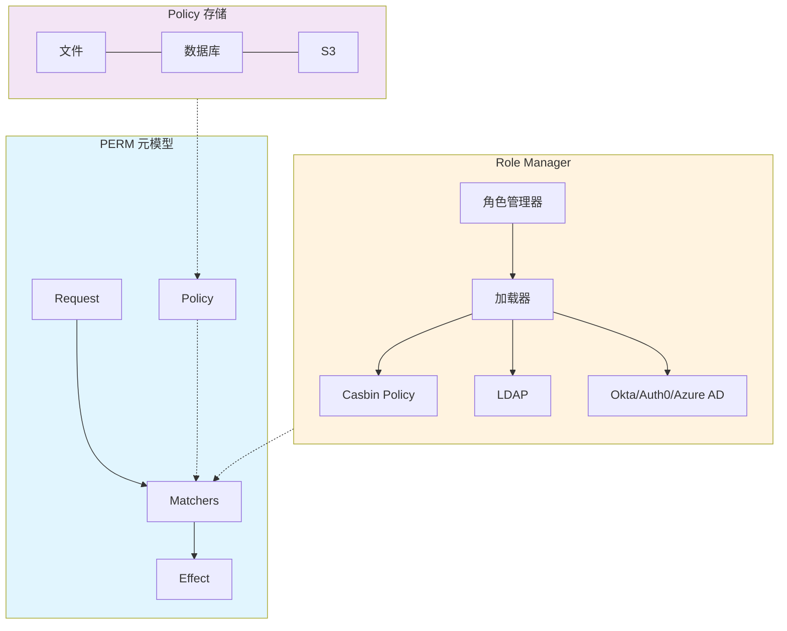

## 核心特性

> 将**授权逻辑**与**业务代码**分离，通过**配置文件**实现**复杂的权限模型**（<u>RBAC</u>、<u>ABAC</u> 等）

### 混合访问控制模型

> Casbin 基于 **PERM 元模型** (<u>Policy</u>, <u>Effect</u>, <u>Request</u>, <u>Matchers</u>) 来**定义访问控制规则**

| 组件     | 描述                                     |
| -------- | ---------------------------------------- |
| Request  | 访问请求的结构（谁、想做什么、 ресурс）  |
| Policy   | 权限规则定义                             |
| Matchers | 匹配规则，决定**请求**如何对应到**策略** |
| Effect   | 最终效果（允许/拒绝）                    |

> 通过修改 **CONF 配置文件**即可**切换授权机制**，无需改动代码

<!-- more -->

### 灵活的策略存储

> 支持多种存储方式

| 存储   | 描述                                                   |
| ------ | ------------------------------------------------------ |
| 内存   | 用于测试                                               |
| 文件   | JSON/YAML/CSV                                          |
| 数据库 | MySQL、**Postgres**、MongoDB、**Redis**、Cassandra、S3 |

### 跨语言跨平台

1. 各语言实现**相同**的 **API** 和**行为**
2. **Go**、**Java**、PHP、Node.js、Python、.NET、Rust 等

## 扩展机制

> **Casbin 核心**保持**轻量**，<u>策略存储</u>、<u>角色管理</u>都通过**插件化**扩展，按场景选择合适的 **Adapter** 和 **Role Manager**

### Policy 持久化

> 通过 **Adapter**（适配器） 将**策略存储**与**核心库**分离

1. **核心库**只负责**策略执行**
2. **存储逻辑**由独立的 **Adapter** 实现
3. 支持**文件**、**数据库**、**S3** 等多种后端
4. **默认内置文件 Adapter**，其他需第三方提供

### 大规模策略执行

> 当**策略数据量**很大时，**全量加载**效率低下

1. **Filtered Policy Loading** - 支持从**存储**中**只加载符合过滤条件**的**策略子集**
2. 典型场景：多租户应用、角色分级等
3. 避免**内存溢出**，提升性能

### Role Manager

> 专门处理 **RBAC 角色层级**（用户-角色映射）

1. 可从 Casbin **策略规则**中加载**角色关系**
2. 也可从**外部源**（<u>LDAP</u>、Okta、Auth0、Azure AD 等）同步
3. 同样**与核心库分离**，<u>按需选用</u>

# Overview

> Casbin 是一个高效的开源**访问控制库**，支持多种**授权模型**

## 核心组件

> <u>Enforcer 根据 Model 的规则，用 Policy 中的定义，来判断每个请求是否被允许</u>

| 组件     | 作用                                                      |
| -------- | --------------------------------------------------------- |
| Model    | 定义**授权逻辑**（布局、执行流程、条件）                  |
| Policy   | 定义**具体规则**（谁、对什么资源、做什么操作）            |
| Enforcer | 核心**执行器**，用 <u>Model + Policy</u> **评估每个请求** |

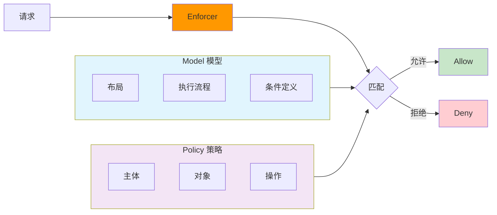

## 简单请求

> 请求 → Enforcer → 匹配 Model 和 Policy → 允许/拒绝

## 核心特点

| 特点       | 描述                                                     |
| ---------- | -------------------------------------------------------- |
| 规则驱动   | 在 **Policy 文件**中定义 **主体-对象-操作** 规则         |
| 格式灵活   | Policy 文件可以是 **JSON**、**YAML**、**CSV** 等任意格式 |
| 模型控制   | Model 文件让管理员**完全掌控授权逻辑**                   |
| 跨语言一致 | 所有语言实现（Go/Java/Python 等）**行为统一**            |

## 语言支持

### 生产级状态

**Go**、**Java**、**Node.js**、PHP、**Python**、C#、C++、**Rust**

### 核心功能对比

> Casbin 目标实现全语言功能对等，但**多线程**、**Watcher**、**Role Manager** 等高级功能尚未完全统一

| 功能            | 说明                                          |
| --------------- | --------------------------------------------- |
| Enforcement     | **请求拦截与决策**（全部支持）                |
| RBAC            | 基于**角色**的访问控制（全部支持）            |
| ABAC            | 基于**属性**的访问控制（全部支持）            |
| Adapter         | **策略存储**适配器（Delphi/Lua/Dart 不支持）  |
| Role Manager    | 角色管理层（Delphi 不支持）                   |
| Multi-Threading | 多线程支持（仅 **Go/Java/Python/Rust** 支持） |

## 定义

> Casbin 是一个**授权库**，处理标准的 `{ subject, object, action }` 访问控制模型，也支持 **RBAC**、**ABAC** 等复杂场景

| 元素           | 含义                     | 示例                   |
| -------------- | ------------------------ | ---------------------- |
| <u>Subject</u> | **请求方（用户或服务）** | alice, service-account |
| <u>Object</u>  | **资源（被访问的对象）** | file.txt, /api/users   |
| <u>Action</u>  | **操作（对资源的动作）** | read, write, delete    |

> 谁（subject）对什么（object）做什么操作（action）是否被允许？

## 能力

| 功能     | 说明                                                         |
| -------- | ------------------------------------------------------------ |
| 策略执行 | 在 `{ subject, object, action }` 格式或自定义格式下执行**允许/拒绝** |
| 存储管理 | 管理**访问控制模型**和**策略**的存储                         |
| 角色层级 | 处理**用户-角色**、**角色-角色**关系（RBAC 角色继承）        |
| 超级用户 | 内置**超级用户**（如 root）拥有无限制访问权限                |
| 模式匹配 | 内置**匹配运算符**（如 keyMatch 支持 /foo* 模式）            |

## 非能力

> 应用已有用户管理系统，Casbin 专注于**授权决策**，不涉及**身份认证**

| 功能          | 说明                        |
| ------------- | --------------------------- |
| 用户认证      | 不验证用户名/密码等登录凭证 |
| 用户/角色管理 | 不维护用户列表或角色列表    |

# Get Started

## Installation

```
go get github.com/casbin/casbin/v3
```

## Example

| 元素     | 角色             |
| -------- | ---------------- |
| Model    | **定义规则结构** |
| Adapter  | **提供策略存储** |
| Policy   | **定义具体权限** |
| Enforcer | **执行权限判断** |

### model.conf

```toml
[request_definition]
r = sub, obj, act

[policy_definition]
p = sub, obj, act

[policy_effect]
e = some(where (p.eft == allow))

[matchers]
m = r.sub == p.sub && r.obj == p.obj && r.act == p.act
```

### policy.csv

```
p, alice, data1, read
p, bob, data2, write
p, alice, data2, write
```

### main.go

```go
package main

import (
	"fmt"
	"log"

	"github.com/casbin/casbin/v3"
)

func main() {
	// 创建 Enforcer（使用文件方式）
	e, err := casbin.NewEnforcer("model.conf", "policy.csv")
	if err != nil {
		log.Fatalf("创建 Enforcer 失败: %v", err)
	}

	// 单个权限检查
	check(e, "alice", "data1", "read")  // ✅ 允许
	check(e, "alice", "data1", "write") // ❌ 拒绝
	check(e, "bob", "data2", "write")   // ✅ 允许

	// 批量权限检查
	results, err := e.BatchEnforce([][]interface{}{
		{"alice", "data1", "read"},
		{"bob", "data2", "write"},
		{"alice", "data2", "write"},
	})
	if err != nil {
		log.Fatalf("批量检查失败: %v", err)
	}
	fmt.Printf("批量结果: %v\n", results) // [true true true]

	// 获取用户角色
	roles, _ := e.GetRolesForUser("alice")
	fmt.Printf("alice 的角色: %v\n", roles) // []
}

func check(e *casbin.Enforcer, sub, obj, act string) {
	ok, err := e.Enforce(sub, obj, act)
	if err != nil {
		log.Printf("检查失败: %v", err)
		return
	}
	if ok {
		fmt.Printf("✅ %s 可以 %s %s\n", sub, act, obj)
	} else {
		fmt.Printf("❌ %s 不能 %s %s\n", sub, act, obj)
	}
}
```

> **Enforcer** 是核心组件，需要 **Model + Adapter** 两个配置

```go
# 方式一：文件方式（简单场景）
e, _ := casbin.NewEnforcer("model.conf", "policy.csv")

# 方式二：自定义 Model + 数据库 Adapter
// 使用 MySQL 存储策略
a, _ := xormadapter.NewAdapter("mysql", "连接字符串")
```

> 运行结果

```
✅ alice 可以 read data1
❌ alice 不能 write data1
✅ bob 可以 write data2
批量结果: [true true true]
alice 的角色: []
```

# How It Works

> **PERM** 四个组件共同定义授权逻辑

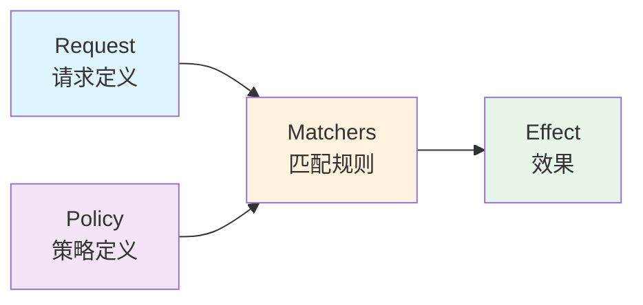

> Request 定义请求格式 → Policy 定义权限格式 → Matchers 定义如何匹配 → Effect 定义最终允许/拒绝

| 组件     | 作用                             | 示例                                               |
| -------- | -------------------------------- | -------------------------------------------------- |
| Request  | 定义**请求参数结构**             | r = sub, obj, act                                  |
| Policy   | 定义**策略规则结构**             | p = sub, obj, act                                  |
| Matchers | **请求**与**策略**的**匹配逻辑** | r.sub == p.sub && r.obj == p.obj && r.act == p.act |
| Effect   | **多个策略**匹配后的**最终效果** | some(where (p.eft == allow))                       |

> Effect 表达式

```toml
# 匹配到任意一个 allow 就允许
e = some(where (p.eft == allow))

# 必须有 allow 且不能有 deny（deny 优先）
e = some(where (p.eft == allow)) && !some(where (p.eft == deny))
```

> Model (model.conf)

```toml
[request_definition]
r = sub, obj, act
请求格式：r = (谁, 什么资源, 什么操作)

[policy_definition]
p = sub, obj, act
策略格式：p = (谁, 什么资源, 什么操作)

[policy_effect]
e = some(where (p.eft == allow))
效果：匹配到任意一条 allow 策略就允许

[matchers]
m = r.sub == p.sub && r.obj == p.obj && r.act == p.act
匹配逻辑：请求的 subject/obj/act 必须与策略完全一致
```

> Policy (policy.csv)

```
p, alice, data1, read  # alice 可以读 data1
p, bob, data2, write   # bob 可以写 data2
```

> 匹配过程

```
alice 读 data1
    ↓
Request: (alice, data1, read)
    ↓
Matcher: alice==alice && data1==data1 && read==read → 匹配成功
    ↓
Effect: 匹配到 p.eft=allow → 允许
```

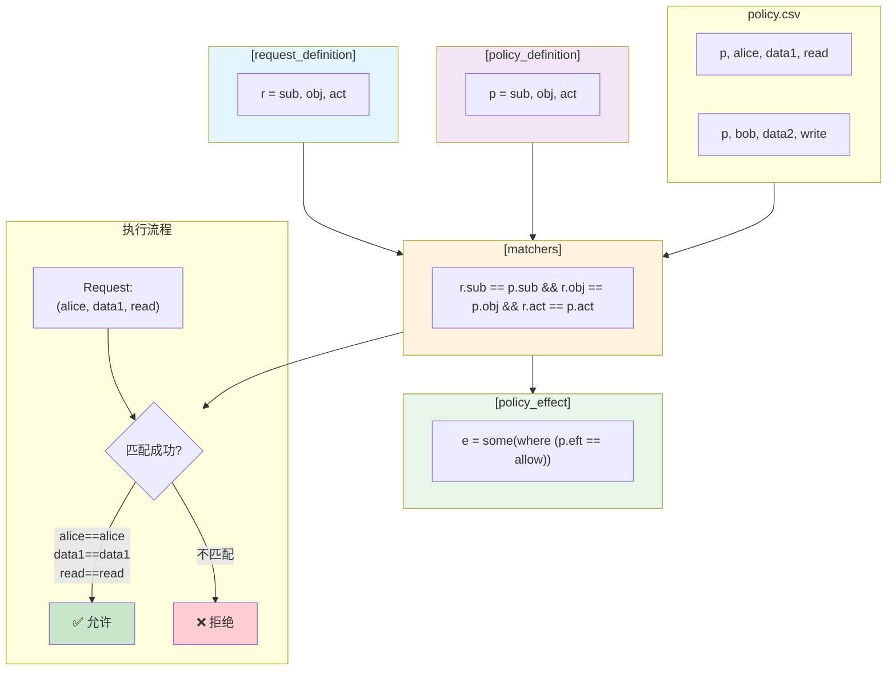

> Matchers 多行写法

```toml
[matchers]
m = r.sub == p.sub && r.obj == p.obj \
  && r.act == p.act
```

> in 操作符（仅 Go）

```
m = r.obj == p.obj && r.act == p.act || r.obj in ('data2', 'data3')

⚠️ in 操作符的数组必须有多于一个元素，否则可能 panic
```

# Access Control Models

> Casbin 支持**业界主流**的访问控制模型，**RBAC** 和 **ABAC** 最常用，内置模型如下

| 模型     | 说明                                                   |
| -------- | ------------------------------------------------------ |
| **ACL**  | 基础访问控制列表（**用户-资源-操作**）                 |
| **RBAC** | 基于**角色**的访问控制（支持**角色层级**）             |
| **ABAC** | 基于**属性**的访问控制（用户属性、资源属性、环境属性） |
| ReBAC    | 基于**关系**的访问控制（实体间关系）                   |
| PBAC     | 基于**策略**的访问控制                                 |
| MAC      | **强制**访问控制（多级安全）                           |
| OrBAC    | **组织**-Based 访问控制                                |
| UCON     | 使用控制模型（包含义务和条件）                         |

> 特色功能

| 功能                | 说明                                        |
| ------------------- | ------------------------------------------- |
| Priority Model      | 支持**策略优先级**，优先级高的生效          |
| Super Administrator | **超级管理员**（如 root）拥有无限制访问权限 |
| RBAC with Domains   | **多租户/多域**场景的角色管理               |

## Supported Models

> 从简单 ACL 到复杂 BLP/LBAC，Casbin 覆盖了几乎所有访问控制模型

### ACL 系列

| 模型                  | 说明                              | 适用场景                     |
| --------------------- | --------------------------------- | ---------------------------- |
| **ACL**               | 基础模型：**用户-资源-操作**      | 简单权限管理                 |
| ACL with superuser    | 支持**超级管理员**（如 root）     | 需要最高权限账号             |
| ACL without users     | 无用户概念，适合 **API/设备**访问 | 物联网、API 网关             |
| ACL without resources | 按**资源类型而非实例**授权        | "写文章"权限而非"写某篇文章" |

### RBAC 系列

| 模型                         | 说明                           | 适用场景         |
| ---------------------------- | ------------------------------ | ---------------- |
| **RBAC**                     | 基础**角色**模型               | 常规权限管理     |
| RBAC with **resource roles** | **用户**和**资源**都有**角色** | **部门资源隔离** |
| RBAC with **domains**        | 多域/多租户角色                | SaaS、跨国企业   |

### ABAC 及高级模型

| 模型     | 说明                                  |
| -------- | ------------------------------------- |
| **ABAC** | 用**属性**（如 resource.Owner）做判断 |
| PBAC     | **动态上下文策略**                    |
| BLP      | **机密性模型**（Bell-LaPadula）       |
| Biba     | **完整性模型**（防篡改）              |
| LBAC     | 机密性+完整性 lattice 模型            |
| OrBAC    | 多组织抽象层                          |
| UCON     | 持续授权、可变属性、义务、条件        |

### 专用模型

| 模型          | 说明                                   |
| ------------- | -------------------------------------- |
| RESTful       | **路径模式**匹配 /res/*, HTTP 方法控制 |
| IP Match      | IP 地址或 CIDR 网段控制                |
| Deny-override | deny 优先于 allow                      |
| Priority      | 规则有序，先匹配先赢                   |

## Model Syntax

1. Casbin 的 **Model** 就是一份**声明式**的**权限元模型**
   - 用配置描述"<u>怎么问（request）</u>、<u>怎么配（policy）</u>、<u>怎么判（matcher）</u>、<u>怎么组合（effect）</u>"
2. **切换权限模型**只需换 **.conf** 文件，**Enforce() 调用保持不变**，实现了**权限逻辑**与**业务代码**的**彻底解耦**
3. Casbin 用一个 **.conf** 文件**声明式**地**描述整个权限模型**，核心是 **PERM 框架**

> 整体结构 - 一个 Model 文件**必须有 4 个段落**，RBAC 场景可额外加 1~2 个

| 段落                    | 是否必需  | 用途                               |
| ----------------------- | --------- | ---------------------------------- |
| [request_definition]    | 必须      | 定义**请求入参**                   |
| [policy_definition]     | 必须      | 定义**策略规则结构**               |
| [policy_effect]         | 必须      | **多条策略命中**时**如何组合结果** |
| [matchers]              | 必须      | **请求**与**策略**的**匹配表达式** |
| [role_definition]       | RBAC 必须 | 定义**角色继承**关系               |
| [constraint_definition] | 可选      | **RBAC 约束**（职责分离等）        |

### Request Definition - 请求定义

```toml
[request_definition]
r = sub, obj, act
```

> 定义 **e.Enforce(...)** 的**入参签名**，经典三元组

| 元祖 | 说明                     |
| ---- | ------------------------ |
| sub  | **主体**（谁）           |
| obj  | **客体**（操作什么资源） |
| act  | **动作**（做什么）       |

> 可以自定义：不需要资源就写 r = **sub, act**，两个主体就写 r = **sub, sub2, obj, act**

### Policy Definition - 策略定义

```toml
[policy_definition]
p = sub, obj, act
p2 = sub, act
```

> 描述**策略文件**的**列结构**，策略文件中的**每一行**：

```
p, alice, data1, read       → 绑定 (p.sub=alice, p.obj=data1, p.act=read)
p2, bob, write-all-objects  → 绑定 (p2.sub=bob, p2.act=write-all-objects)
```

> 关键点

1. **<u>每行第一个 token</u>** 是**策略类型**（p, p2），**<u>必须与定义匹配</u>**
2. **所有元素**都是**字符串**，**不做类型转换**
3. **p.eft** 字段是**策略效果**（allow/deny），**<u>省略时默认 allow</u>**

### Policy Effect - 策略效果

> 当**多条策略同时命中**时，如何**组合结果**，Casbin **内置**了 5 种效果，**<u>不支持自定义表达式</u>**，只能用以上内置的

| 表达式                                                       | 含义                                           | 适用场景             |
| ------------------------------------------------------------ | ---------------------------------------------- | -------------------- |
| <u>some(where (p.eft == allow))</u>                          | **allow-override**：任一允许即允许             | ACL, **RBAC** 等     |
| !some(where (p.eft == deny))                                 | **deny-override**：任一拒绝即拒绝              | 安全优先场景         |
| some(where (p.eft == allow)) && !some(where (p.eft == deny)) | **allow-and-deny**：需至少一个 allow 且无 deny | 严格场景             |
| `priority(p.eft) || deny`                                    | **优先级**：按策略顺序，先命中者生效           | 需要策略优先级       |
| <u>subjectPriority(p.eft)</u>                                | 角色优先级：按**角色层级**判断                 | **基于角色的优先级** |

### Constraint Definition - 约束定义（可选）

> 这是 **RBAC** 的高级特性，在**角色分配变更**时**强制检查约束**，防止**违反安全规则**，有 4 种约束类型，执行时机如下

1. 在 **AddGroupingPolicy()** / **RemoveGroupingPolicy()** 时检查，**违反约束**则**操作失败、策略不变**
2. **模型加载**时也会**全量校验现有数据**

#### 静态职责分离 (sod)

> **同一用户**不能**同时持有两个角色**，例如：**申请人**和**审批人**不能是同一个人

```toml
c = sod("finance_requester", "finance_approver")
```

#### 基数限制 (sodMax)

> 从**一个角色集合**中，**同一用户**<u>最多只能持有 N 个</u>，例如：薪资的查看、编辑、审批三个角色，一个人最多只能有一个

```toml
c2 = sodMax(["payroll_view", "payroll_edit", "payroll_approve"], 1)
```

#### 角色基数 (roleMax)

> **一个角色**<u>最多只能分配给 N 个用户</u>，例如：超级管理员最多 2 人

```toml
c3 = roleMax("superadmin", 2)
```

#### 前置角色 (rolePre)

> 必须先持有**前置角色**才能被分配**目标角色**，例如：必须有安全培训认证才能成为数据库管理员

```toml
c4 = rolePre("db_admin", "security_trained")
```

### Matchers - 匹配器

> 定义<u>请求参数</u>如何与<u>策略字段</u>**匹配**，支持**算术**`（+ - * /）`和**逻辑**运算符`（&& || !）`

```toml
[matchers]
m = r.sub == p.sub && r.obj == p.obj && r.act == p.act
```

> 性能关键：**表达式顺序**

原则：把**廉价条件放前面**，昂贵操作（如 g() 角色查找）放后面，**利用短路求值减少计算量**

#### 慢写法

> 角色查找在前 - 测试中 jasmine 有 2500 个角色，**g()** 先执行导致 2500 次角色遍历，耗时 6.16 秒

```toml
m = g(r.sub, p.sub) && r.obj == p.obj && r.act == p.act
```

#### 快写法

> 简单的字段比较在前 - 先用 r.obj == p.obj **过滤掉大量不匹配的策略**，再做**昂贵的角色查找**，耗时仅 7.29 ms，快了约 800 倍

```toml
m = r.obj == p.obj && g(r.sub, p.sub) && r.act == p.act
```

### 多组定义（Multiple Section Types）

> 可以定义**多套 r/p/e/m**，用**数字后缀**区分 - 适用于**同一系统**中有**多种权限模型**的场景（比如**普通用户**用 **RBAC**，**管理员**用 **ABAC**）

```toml
r2 = sub, obj, act
p2 = sub, obj, act
e2 = !some(where (p.eft == deny))
m2 = r.sub == p.sub && r.obj == p.obj && r.act == p.act
```

> 使用时通过 **EnforceContext** 指定用哪一套

```go
ctx := NewEnforceContext("2")  // 使用 r2, p2, e2, m2
e.Enforce(ctx, alice, data1, read)

// 不传 ctx 就用默认的 r, p, e, m
e.Enforce(alice, data2, read)
```

### in 操作符

> 判断**左侧值**是否在**右侧数组**中（<u>严格 ==，无类型转换</u>），适用于类似"用户是否在管理员列表中"的场景

```toml
m = r.sub.Name in (r.obj.Admins)
```

### 表达式引擎

> Casbin 底层依赖各语言的**表达式引擎**来解析 matcher - 不同语言的引擎能力有差异，如果需要**跨语言兼容**，只用文档中描述的**标准语法**

| 实现        | 语言    | 引擎            |
| ----------- | ------- | --------------- |
| Casbin      | Go      | govaluate       |
| jCasbin     | Java    | aviatorscript   |
| Node-Casbin | Node.js | expression-eval |
| PyCasbin    | Python  | simpleeval      |

## Effector

> Effector 是**权限判定流程**中的**最后一步**，负责把**多条匹配策略的结果**合并为一个**最终决定**

### 核心概念

1. 当一次 **Enforce()** 调用时，可能**同时命中多条策略**（比如一条 allow、一条 deny），Effector 就是决定"**怎么拍板**"的组件
2. 请求 → Matcher 匹配 → <u>多条策略命中，各有效果</u> → **Effector 合并** → 最终决定

### MergeEffects() - 合并效果

> 这是 Effector 的核心方法

```go
Effect, explainIndex, err = e.MergeEffects(expr, effects, matches, policyIndex, policyLength)
```

#### 参数

| 参数         | 含义                                                         |
| ------------ | ------------------------------------------------------------ |
| expr         | **策略效果表达式**，即 model 中 **[policy_effect]** 段定义的字符串，如 `some(where (p.eft == allow))` |
| effects      | 有**匹配策略的效果**切片，每个元素是 **Allow**、**Deny** 或 **Indeterminate**（不确定） |
| matches      | 布尔数组，标记**哪些策略**被**匹配**到了                     |
| policyIndex  | **当前评估**到第几条策略                                     |
| policyLength | 策略总数                                                     |

#### 返回值

| 返回值       | 含义                                                         |
| ------------ | ------------------------------------------------------------ |
| Effect       | 最终决定：**Allow**、**Deny** 或 **Indeterminate**           |
| explainIndex | 是**哪条策略决定了结果**（用于<u>审计/调试</u>），**无法确定**时为 **<u>-1</u>** |
| err          | 如果效果表达式不支持，返回错误                               |

### 合并逻辑举例

> 以 **allow-override** 为例`（some(where (p.eft == allow))）`

```
策略1: allow   ← 命中
策略2: deny    ← 命中
策略3: allow   ← 未命中
```

1. `effects = [Allow, Deny]`，Effector 的逻辑：**只要有任意一条 allow，且没有 deny** → 最终 allow
2. 实际结果是 allow

> 不同效果表达式的合并规则

| 效果类型       | 合并逻辑                         |
| -------------- | -------------------------------- |
| allow-override | 任一 allow → allow               |
| deny-override  | 任一 deny → deny                 |
| allow-and-deny | 至少一个 allow 且无 deny → allow |
| priority       | 按策略顺序，先命中者胜出         |

### 短路优化

> 除非**效果表达式**是 `priority(p_eft) || deny`，否则 enforcer 可以<u>短路</u>：**一旦结果确定，剩余策略就不再评估**

```
效果表达式: some(where (p.eft == allow))   // allow-override
共 1000 条策略

策略 #1: deny
策略 #2: allow   ← 到这里结果已确定为 allow，短路退出
策略 #3 ~ #1000: 跳过，不评估
```

1. 这就是为什么 **policyIndex** 可能**小于** `policyLength - 1` - 说明后面的**策略**被**跳过**了
2. 对于 **priority** 效果则**不能短路**，因为必须**按顺序遍历**找到**优先级最高**的那条

### 自定义 Effector

> 可以实现自己的 **Effector 接口**，定义**自定义的合并语义** - 适用于**内置效果表达式无法满足**的场景

```go
var e Effector  // 自定义实现
Effect, explainIndex, err = e.MergeEffects(expr, effects, matches, policyIndex, policyLength)
```

1. Casbin **内置的 Default Effector** 已经能处理所有**内置效果表达式**
2. 只有需要完全自定义的合并逻辑时，才需要实现自己的 Effector

### 与 Model 中 Policy Effect 的关系

> Model 中的 `[policy_effect]` 和这里的 Effector 是**同一事物的两面**

| 维度     | 说明                                                         |
| -------- | ------------------------------------------------------------ |
| Model 层 | 用**声明式字符串**描述**效果语义**（如 `some(where (p.eft == allow))`） |
| 代码层   | Effector 组件**实际执行**这个语义，**遍历效果切片**并**产出最终决定** |

## Functions

> 让 **Matcher** 的**表达能力**从**简单的 == 比较**扩展到了**模式匹配**、**正则**、**IP 网段**、**路径参数提取**等丰富的场景，同时保持**配置文件**的**声明式风格**

| 类别                      | 描述                                                         |
| ------------------------- | ------------------------------------------------------------ |
| 匹配函数（keyMatch 系列） | 解决"**请求的 URL 是否匹配策略中的路径模式**"                |
| 提取函数（keyGet 系列）   | 解决"**从 URL 中提取参数值供后续使用**"                      |
| **自定义函数**            | 解决内置函数覆盖不到的**业务特定匹配逻辑**（如时间范围、属性比较等） |

### 内置函数总览

> **Matcher** 不只能写 **==、&&** 这种**简单表达式**，还可以调用**内置函数**来处理**复杂的匹配场景**，分两大类

#### Key Matching - 键匹配函数（返回 bool）

> 用于判断 **URL/路径**是否**匹配某个模式**

| 函数       | 通配符风格 | 示例 pattern           | 典型场景                                                     |
| ---------- | ---------- | ---------------------- | ------------------------------------------------------------ |
| keyMatch   | *          | /alice_data/*          | 简单通配符，* 匹配**剩余所有字符**                           |
| keyMatch2  | :name      | /alice_data/:resource  | 类似 Express/Flask 的**路径参数**                            |
| keyMatch3  | {name}     | /alice_data/{resource} | 类似 OpenAPI/Spring 的**路径参数**                           |
| keyMatch4  | {name}     | /data/{id}/book/{id}   | 同 keyMatch3 但支持**同名参数一致性校验**（两个 {id} **必须相同**） |
| keyMatch5  | {name} + * | /data/{id}/*           | keyMatch3 和 keyMatch 的混合，还支持 query string            |
| regexMatch | 正则表达式 | ^/alice_.*$            | 任意正则匹配                                                 |
| ipMatch    | IP/CIDR    | 192.168.2.0/24         | IP 地址或网段匹配                                            |
| globMatch  | glob 模式  | /alice_data/*          | 标准 glob 匹配（比 keyMatch 更通用的通配符）                 |

> 具体例子

```go
keyMatch("/alice_data/resource1", "/alice_data/*")            → true
keyMatch2("/alice_data/resource1", "/alice_data/:resource")   → true
keyMatch3("/alice_data/resource1", "/alice_data/{resource}")  → true
keyMatch4("/data/123/book/123", "/data/{id}/book/{id}")       → true（两个 123 一致）
keyMatch4("/data/123/book/456", "/data/{id}/book/{id}")       → false（123 ≠ 456）
ipMatch("192.168.2.123", "192.168.2.0/24")                    → true
```

#### Key Extraction - 键提取函数（返回 string）

> 不仅判断是否匹配，还**提取匹配部分的值**

```go
keyGet2("/resource1/action", "/:res/action", "res")         → "resource1"
keyGet3("/resource1_admin/action", "/{res}_admin/*", "res") → "resource1"
keyGet("/resource1/action", "/*")                           → "resource1/action"
```

> 区别

| 函数    | 对应的匹配函数 | 用途                                   |
| ------- | -------------- | -------------------------------------- |
| keyGet  | keyMatch       | 从 ***** 模式中提取**匹配的片段**      |
| keyGet2 | keyMatch2      | 从 **:name** 模式中提取**指定参数名**  |
| keyGet3 | keyMatch3      | 从 **{name}** 模式中提取**指定参数名** |

> 用途举例：在 matcher 中提取出资源 ID，然后**传给其他函数**做进一步判断（比如检查资源归属）

### 自定义函数四步走

> 当内置函数不够用时，可以注册自己的函数

#### Step 1：实现实际逻辑

> **普通的 Go 函数**，输入输出类型明确

```go
func KeyMatch(key1 string, key2 string) bool {
    i := strings.Index(key2, "*")
    if i == -1 {
        return key1 == key2
    }
    if len(key1) > i {
        return key1[:i] == key2[:i]
    }
    return key1 == key2[:i]
}
```

#### Step 2：包装为 Casbin 签名

> Casbin 的**表达式引擎**要求**所有函数统一签名** `func(...interface{}) (interface{}, error)`，所以需要一个**适配层**

```go
func KeyMatchFunc(args ...interface{}) (interface{}, error) {
    name1 := args[0].(string)
    name2 := args[1].(string)
    return (bool)(KeyMatch(name1, name2)), nil
}
```

#### Step 3：注册到 Enforcer

> 给函数起个名字，注册进去

```go
e.AddFunction("my_func", KeyMatchFunc)
```

#### Step 4：在 Model 中使用

> 和**内置函数**用法完全一致

```toml
[matchers]
m = r.sub == p.sub && my_func(r.obj, p.obj) && r.act == p.act
```

## RBAC

### Overview

#### 核心思想

1. 传统 **ACL**（访问控制列表）是**用户 → 资源**的**直接映射**，<u>权限多了就爆炸</u>，RBAC 引入**角色**作为**中间层**
2. <u>**用户 → 角色 → 权限（资源 + 操作）**</u>
3. 好处：**用户变动**时只改**角色分配**，**权限变动**时只改**角色的权限定义**，两者**解耦**

#### 5 种变体

> **复杂度递增**：从最简单的**角色继承**，到**多租户**、**条件判断**、**标准对齐**

| 变体                 | 解决什么问题                    | 典型场景                                                     |
| -------------------- | ------------------------------- | ------------------------------------------------------------ |
| **Basic RBAC**       | **角色继承**、**用户-角色分配** | 基础的<u>角色层级</u>（admin 继承 user 的权限）              |
| RBAC with pattern    | **模式匹配**灵活分配角色        | 路径通配符、正则匹配资源                                     |
| RBAC with domains    | 多租户隔离                      | SaaS 产品中，每个租户有自己的角色体系（A 公司的 admin ≠ B 公司的 admin |
| RBAC with conditions | 条件式权限                      | "只有在工作时间才能访问"、"只有在同一部门才能操作"           |
| RBAC96               | 对齐 NIST RBAC96 标准模型       | 学术合规/标准化需求                                          |

> 关联

1. Model Syntax 中 `[role_definition]` 的 `g = _, _` → 就是这里说的 **Basic RBAC**
2. Constraint Definition 中的 **sod**、**roleMax** 等 → 是 **RBAC 角色管理的约束保障**
3. Functions 中的 **keyMatch 系列** → 用于 **RBAC with pattern**
4. Effector → 判定最终 allow/deny 的最后一步

### Basic RBAC

#### 角色定义 — [role_definition]

```
[role_definition]
g = _, _
g2 = _, _
```

1. g 是**角色系统**，_, _ 表示二元关系（**用户 → 角色**）
2. g2 是第二个**独立的角色系统**，用于资源角色（**资源 → 角色**）
3. 以**只定义 g**（用户角色），也可以**同时定义 g2**（资源也有角色体系）
4. 两者**完全独立**，互不干扰

> 在策略中使用

```
p, data2_admin, data2, read     # data2_admin 角色可以读 data2
g, alice, data2_admin           # alice 拥有 data2_admin 角色
```

> 在 matcher 中使用

```go
m = g(r.sub, p.sub) && r.obj == p.obj && r.act == p.act
```

> **g(r.sub, p.sub)** 的含义：**请求的 subject（alice）**是否**直接或间接**属于策略中定义的 **subject（data2_admin）**

##### 问题

> 先看问题：没有角色时怎么做权限？假设 alice 要读 data2，直接把 alice 写进策略

```
p, alice, data2, read
p, bob, data2, read
p, charlie, data2, read
```

> 问题：100 个用户都要读 data2？写 100 行。有人离职？找到那行删掉。**不可维护**

##### 引入角色

> 把"谁能读 data2"从"**人**"变成"**角色**"

```
p, data2_admin, data2, read    ← 定义：data2_admin 这个角色能读 data2
g, alice, data2_admin          ← 分配：alice 属于 data2_admin
```

1. 第一行（**p** 开头）：**策略规则**，说"data2_admin 能读 data2"
2. 第二行（**g** 开头）：**分组规则**，说"alice 是 data2_admin"

> 现在加人只需要一行：

```
g, bob, data2_admin      ← bob 也能读了
g, charlie, data2_admin  ← charlie 也能读了
```

> 删人也简单，删一行 g 规则即可，**策略规则完全不用动**。

##### [role_definition] 是什么？

```toml
[role_definition]
g = _, _
```

1. 这句话是在告诉 Casbin：我的模型里有一个叫 g 的**分组系统**，每条规则有**两个字段**
2. _, _ 就是"两个参数"的意思（**占位符**），对应**策略文件**中 **g** 开头的行：

```
g, alice, data2_admin
    ↑        ↑
  第一个    第二个
```

##### g2 是什么？

```toml
[role_definition]
g = _, _
g2 = _, _
```

1. g 管的是**用户**和**角色**的关系（用户属于哪个角色）
2. 有些场景中，**资源也有层级**

```
文件系统：/docs/engineering/arch/design.doc
                                ↑ 属于 design 目录
               ↑ 属于 engineering 目录
         ↑ 属于 docs 目录
```

> 你想让 "对 /docs 有读权限 → 对其下所有**子目录**和**文件**都有读权限"，就可以用 g2 定义资源的**继承**关系

```
g2, /docs/engineering, /docs
g2, /docs/engineering/arch, /docs/engineering
```

> g 和 g2 **互相独立**，各管各的

##### matcher 中的 g() 是怎么工作的

```go
m = g(r.sub, p.sub) && r.obj == p.obj && r.act == p.act
```

> 当请求进来时：

```
e.Enforce("alice", "data2", "read")
```

> Casbin 把请求代入 matcher

1. r.sub = "alice"，r.obj = "data2"，r.act = "read"
2. **遍历所有 p 策略**，假设检查到 <u>p, data2_admin, data2, read</u>

> matcher 变成

```
g("alice", "data2_admin") && "data2" == "data2" && "read" == "read"
         ↑                        ↑                    ↑
       要检查这个             直接比较，✓            直接比较，✓
```

##### g("alice", "data2_admin") 做了什么？

> 它去查**所有 g 规则**

```
g, alice, data2_admin   ← 找到了！alice 确实属于 data2_admin
```

1. 所以 g("alice", "data2_admin") → true
2. 三个条件都 true → 最终 allow

##### 如果有继承呢？

> 假设还有：

```
g, data2_admin, super_admin    ← data2_admin 是 super_admin 的子角色
```

> 现在请求：

```
e.Enforce("alice", "some_resource", "some_action")
```

> 策略是：

```
p, super_admin, some_resource, some_action
```

> matcher 检查 **g("alice", "super_admin")**：

```
查 g 规则：
  alice → data2_admin       ← alice 不是 super_admin，继续
  data2_admin → super_admin ← 但 alice 的角色 data2_admin 是 super_admin 的子角色
```

> **传递推导**：alice → data2_admin → super_admin ✓

所以 g("alice", "super_admin") → true。这就是"**间接属于**"的含义

##### 总结

1. **p 规则**定义**角色能做什么**
2. **g 规则**定义**谁属于哪个角色**（以及**角色之间的继承**）
3. matcher 中的 **g()** 函数负责**查 g 规则表**，判断**请求者**是否**属于**策略中的**角色**
4. g2 是可选的第二套**独立分组系统**，用于**资源层级**等场景

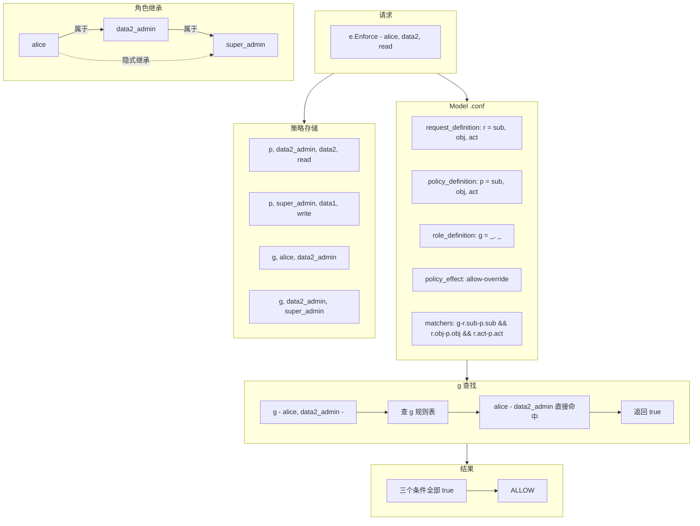

> 核心流程

| 流程             | 描述                                                         |
| ---------------- | ------------------------------------------------------------ |
| Model 定义规则   | 声明**请求参数**、**策略结构**、**角色系统**、**匹配表达式**、**效果组合** |
| Policy 提供数据  | **p** 规则定义**角色权限**，**g** 规则定义**角色分配和继承** |
| Enforce 执行判定 | **遍历策略** → **matcher 匹配** → **g() 查角色表** → **effector 合并结果** |
| g() 支持传递     | **直接匹配**或**通过继承链间接匹配**都返回 **true**          |

#### 三个重要注意事项

> Casbin 不做**身份验证**

1. Casbin 只**存储和评估用户-角色映射**，<u>不验证用户或角色是否存在</u>
2. Casbin 只管**"授权"（Authorization）**，不管<u>"认证"（Authentication）</u>
3. <u>用户是否存在</u>、<u>角色是否合法</u>，是业务系统的事

> 不要重名

1. 不要让**用户名**和**角色名**相同（如用户 alice 和角色 alice），因为 **Casbin 无法区分**
2. Casbin 中**一切都是字符串**，用户 alice 和角色 alice 是同一个东西，需要区分时用**前缀**，如 role_alice

> 继承是传递的

1. 如果 A 有角色 B，B 有角色 C，那么 A **自动拥有** C
2. **无层级限制**，链条可以**无限延伸**

```toml
g, alice, editor          # alice → editor
g, editor, admin          # editor → admin
# 结果：alice 自动拥有 admin 的所有权限
```

#### Token 名称约定

> **策略**中 **subject** 通常放在**第一个位置**、命名为 **sub**

```toml
[policy_definition]
p = sub, obj, act
```

> 但可以**自定义顺序**和**名称**

```toml
[policy_definition]
p = obj, act, subject    # subject 放到了第三个位置
```

> 这时必须告诉 Casbin subject 在**哪一列**

```go
e.SetFieldIndex("p", constant.SubjectIndex, 2)  // 索引从 0 开始，第 3 列是 2
e.DeleteUser("alice")  // 现在 Casbin 知道去第 3 列找用户了
```

> 否则 DeleteUser() 等 API 会操作错误的列

#### 角色层级（继承）

> Casbin 实现的是 **RBAC1** 风格的**层级继承**

1. alice → editor → admin → superadmin
2. alice **自动继承** editor、admin、superadmin 的**所有权限**

> **层级深度限制**

1. **默认最多 10 层继承**
2. 这是为了防止**循环继承**导致**无限递归**，也可以根据业务需要调整

```go
func NewRoleManager(maxHierarchyLevel int) rbac.RoleManager {
    rm.maxHierarchyLevel = maxHierarchyLevel
}
```

#### 区分用户和角色

> Casbin 中**用户**和**角色**都是**字符串**，没有**类型**上的**区分**

##### 扁平 RBAC（无继承）

1. `GetAllSubjects()` 返回 **g 规则左边**的（用户）
2. `GetAllRoles()` 返回 **g 规则右边**的（角色）

##### 有层级继承时

> 同一个名字可能**既是用户又是角色**

```toml
g, alice, editor       # editor 是 alice 的角色
g, editor, admin       # editor 又是 admin 的"用户"
```

1. 这里 editor **既是一个角色**（对 alice 而言），**又是一个用户**（对 admin 而言）
2. 建议：**用命名约定区分**，如 **<u>role::editor</u>**，在**业务层判断**时**检查前缀**

#### 显式 vs 隐式角色/权限

> alice → editor → admin → superadmin

| API                                    | 返回内容                  | 示例                                       |
| -------------------------------------- | ------------------------- | ------------------------------------------ |
| GetRolesForUser("alice")               | **直接分配**的角色        | [editor]                                   |
| GetImplicitRolesForUser("alice")       | **直接 + 继承**的所有角色 | [editor, admin, superadmin]                |
| GetPermissionsForUser("editor")        | **直接分配**的权限        | editor 自身的策略                          |
| GetImplicitPermissionsForUser("alice") | **直接 + 继承**的所有权限 | alice + editor + admin + superadmin 的策略 |

> 关键区别

1. **显式**（<u>不带 Implicit</u>）：只看**直接分配**的那一层
2. **隐式**（<u>带 Implicit</u>）：沿**继承链**往上收集所有层级

> 实际业务中**通常**用 **Implicit 版本**做**权限检查**，因为你需要知道用户"**最终拥有哪些权限**"

#### 总结

> Model (model.conf)

```toml
[request_definition]
r = sub, obj, act

[policy_definition]
p = sub, obj, act

[role_definition]
g = _, _

[policy_effect]
e = some(where (p.eft == allow))

[matchers]
m = g(r.sub, p.sub) && r.obj == p.obj && r.act == p.act
```

> Policy (policy.csv)

```toml
p, admin, data1, read   # admin 角色对 data1 的读权限
p, admin, data2, read   # admin 角色对 data2 的读权限
p, editor, data2, write # editor 角色对 data2 的写权限

g, alice, editor        # alice 属于 editor
g, bob, admin           # bob 属于 admin
g, charlie, editor      # charlie 属于 editor
g, editor, admin        # editor 继承 admin（关键：使 alice 和 charlie 间接拥有 admin 的权限）
```

> 用户、角色、权限三层的映射关系（g 规则 + p 规则）

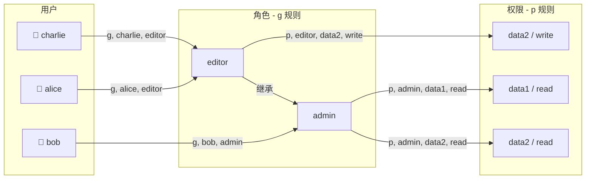

> alice 沿继承链获得的所有权限（直接 + 隐式）

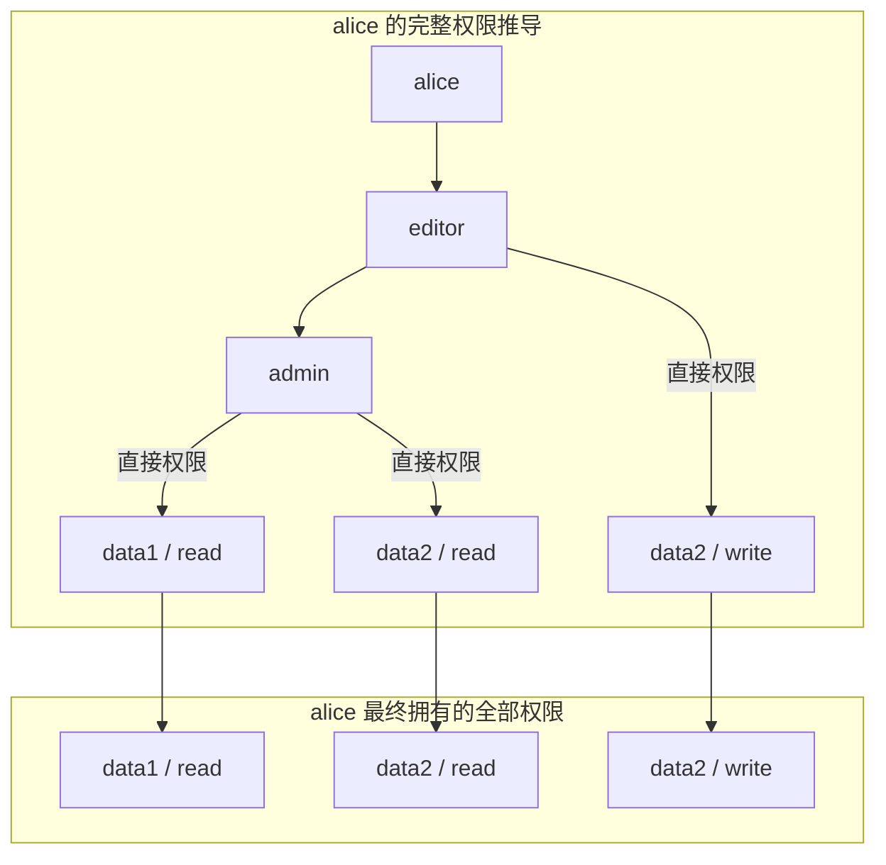

> 一次 Enforce 请求的完整判定流程

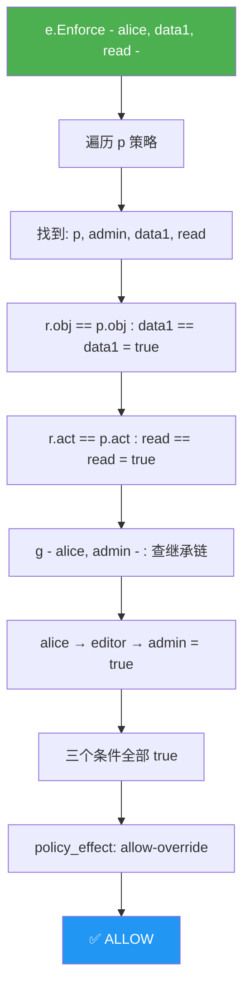

### RBAC with Pattern

> RBAC + 模式匹配 - 解决的是"**角色分配规则太多**"的问题

**基础 RBAC** + 给 **g 规则**的**参数**加上**通配符/正则能力**，让一条**分组规则**能匹配**无限多个实体**，从"**N 条规则描述 N 个资源**"变成"**1 条规则描述一类资源**"

#### 先看问题

1. 假设 alice 能读所有书，用**基础 RBAC** 你要这样写
2. 每多一本书，就多一行 **g 规则**，无法接受

```
p, alice, book_group, read

g, /book/1, book_group
g, /book/2, book_group
g, /book/3, book_group
...
g, /book/10000, book_group
```

#### 用模式匹配解决

> 把每本书的**具体路径**替换成**模式**，一行搞定

```
p, alice, book_group, read

g, /book/:id, book_group    ← 只需这一行
```

> **注册匹配函数**后，Casbin 就知道 /book/:id 能匹配 /book/1、/book/2、/book/999 等所有路径

#### 怎么注册？

> 取决于你用不用 **domain**（多租户）：

| 场景      | API                                      | 作用                                    |
| --------- | ---------------------------------------- | --------------------------------------- |
| 无 domain | **AddNamedMatchingFunc**("g", ...)       | 给 **g 的参数**注册**匹配函数**         |
| 有 domain | **AddNamedDomainMatchingFunc**("g", ...) | 给 **g 的 domain 参数**注册**匹配函数** |
| 两者都要  | 两个都调用                               | **用户-角色**和 **domain** 都支持模式   |

> 代码示例

```go
e, _ := NewEnforcer("./model.conf", "./policy.csv")

// 无 domain：注册 g 的匹配函数
e.AddNamedMatchingFunc("g", "KeyMatch2", util.KeyMatch2)

// 有 domain：注册 g 的 domain 匹配函数
e.AddNamedDomainMatchingFunc("g", "KeyMatch2", util.KeyMatch2)
```

#### 原理

> 之前**基础 RBAC** 中 **g(a, b)** 是**精确匹配**

```
g("alice", "editor")  → 查表：g, alice, editor → 完全相等 → true
```

> 注册**匹配函数**后，g(a, b) 变成模式匹配

```
g("/book/1", "/book/:id")  → 用 KeyMatch2 判断 "/book/1" 是否匹配 "/book/:id" → true
g("/book/2", "/book/:id")  → true
g("/article/1", "/book/:id") → false
```

> 匹配函数就是之前 Functions 文档中介绍的那些（**keyMatch**、**keyMatch2**、**regexMatch** 等），只是用在了 g 规则的参数上

#### 完整流程对比

> 基础 RBAC：

```
p 规则: alice 能读 book_group
g 规则: /book/1 属于 book_group     ← 精确匹配
g 规则: /book/2 属于 book_group     ← 精确匹配
g 规则: /book/3 属于 book_group     ← 精确匹配
```

> RBAC with Pattern

```
p 规则: alice 能读 book_group
g 规则: /book/:id 属于 book_group   ← 模式匹配，一行顶万行
```

#### 总结

> Model (model.conf)

```toml
[request_definition]
r = sub, obj, act

[policy_definition]
p = sub, obj, act

[role_definition]
g = _, _

[policy_effect]
e = some(where (p.eft == allow))

[matchers]
m = g(r.sub, p.sub) && g(r.obj, p.obj) && r.act == p.act
```

> Policy (policy.csv)

```toml
p, reader, book_group, read         # reader 角色对 book_group 的读权限
p, librarian, book_group, read
p, librarian, book_group, write     # librarian 角色对 book_group 的写权限
p, librarian, journal_group, read   # librarian 角色对 journal_group 的读权限

g, alice, reader                    # alice → reader（用户→角色）
g, bob, librarian                   # bob → librarian（用户→角色）

g, /book/:id, book_group            # 所有 /book/* → book_group（资源→资源组，模式匹配）
g, /journal/:id, journal_group      # 所有 /journal/* → journal_group（资源→资源组，模式匹配）
```

> 注册匹配函数

```go
e, _ := NewEnforcer("model.conf", "policy.csv")
e.AddNamedMatchingFunc("g", "KeyMatch2", util.KeyMatch2)
```

> Matcher 中两个 g() 各管各的

```
g(r.sub, p.sub)  → 用户→角色  → g("alice", "reader")    精确查表
g(r.obj, p.obj)  → 资源→资源组 → g("/book/42", "book_group") 模式匹配 /book/:id
r.act == p.act   → 动作精确比较
```

> 请求 Enforce("alice", "/book/42", "read") 的判定：

```
1. 遍历 p 策略 → 命中 p, reader, book_group, read
2. g("alice", "reader")         → g 规则: alice → reader ✓
3. g("/book/42", "book_group")  → g 规则: /book/:id → book_group, KeyMatch2 匹配 ✓
4. "read" == "read"             → ✓
5. 三个条件全 true → ALLOW
```

> 完整的权限结构 — 用户 → 角色 → 权限，加上资源分组（绿色）用 :id 模式一条规则覆盖所有书籍

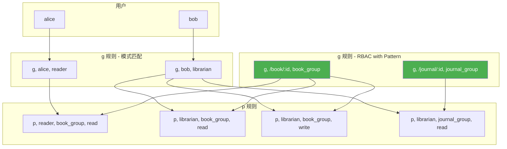

> alice 请求读 /book/42 的完整判定流程，橙色节点是 KeyMatch2 模式匹配的关键步骤

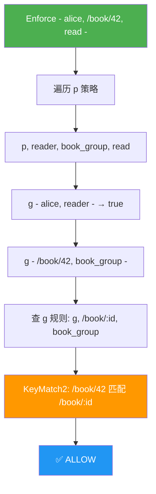

> 基础 RBAC vs RBAC with Pattern 的对比，N 条 → 1 条

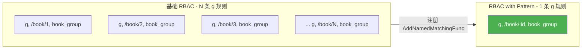

### RBAC with Domains

#### 核心概念

1. 之前的 RBAC 模型中，`g = _, _` 定义的是**全局角色** - 一个用户在**整个系统**中只有一种角色身份
2. 但在**多租户/多云**场景下，**同一个用户**在**不同租户**中可能拥有**不同角色**

| Key       | Value                                                        |
| --------- | ------------------------------------------------------------ |
| 普通 RBAC | alice → admin（全局唯一角色）                                |
| 域 RBAC   | alice → admin in tenant1, alice → user in tenant2（**角色随域变化**） |

#### 角色定义：三元组

```toml
[role_definition]
g = _, _, _
```

1. 第 1 个 _：**主体（用户）**
2. 第 2 个 _：**角色**
3. 第 3 个 _：**域（Domain）** - 租户、**工作空间**、组织等

> 核心区别

1. `g = _, _` 是**二元**（**用户→角色**）
2. `g = _, _, _` 是**三元**（**用户→角色在某域中**）

#### 策略示例解析

```
p, admin, tenant1, data1, read
p, admin, tenant2, data2, read

g, alice, admin, tenant1
g, alice, user, tenant2
```

> 逐行解读

| 行                             | 类型 | 含义                                             |
| ------------------------------ | ---- | ------------------------------------------------ |
| p, admin, tenant1, data1, read | 策略 | **admin 角色**在 **tenant1 域**中可以 read data1 |
| p, admin, tenant2, data2, read | 策略 | **admin 角色**在 **tenant2 域**中可以 read data2 |
| g, alice, admin, tenant1       | 绑定 | alice 在 **tenant1** 中是 admin                  |
| g, alice, user, tenant2        | 绑定 | alice 在 **tenant2** 中是 user                   |

> Enforce 推演

| 请求                                         | 结果  | 原因                                                   |
| -------------------------------------------- | ----- | ------------------------------------------------------ |
| Enforce("alice", "tenant1", "data1", "read") | Allow | alice 在 tenant1 是 admin，admin 在 tenant1 可读 data1 |
| Enforce("alice", "tenant2", "data1", "read") | Deny  | alice 在 tenant2 是 user，不是 admin                   |
| Enforce("alice", "tenant2", "data2", "read") | Deny  | alice 在 tenant2 是 user，user 没有任何策略            |
| Enforce("bob", "tenant2", "data2", "read")   | Deny  | bob 没有任何 g 绑定                                    |

> 关键：alice 虽然全局是 admin（在 tenant1），但她在 tenant2 只是 user，**角色不会跨域传播**

#### Matcher 变化

```toml
[matchers]
m = g(r.sub, p.sub, r.dom) && r.dom == p.dom && r.obj == p.obj && r.act == p.act
```

>对比基础 RBAC 的 matcher

| Key       | Value                                                        |
| --------- | ------------------------------------------------------------ |
| 基础 RBAC | m = g(r.sub, p.sub) && r.obj == p.obj && r.act == p.act      |
| 域 RBAC   | m = g(r.sub, p.sub, r.dom) && r.dom == p.dom && r.obj == p.obj && r.act == p.act |

> 多了两部分：

1. `g(r.sub, p.sub, r.dom)` - **带域的角色继承查询**，检查**用户**是否在**该域**中**拥有该角色**
2. `r.dom == p.dom` - 请求的域**必须匹配**策略的域

#### 自定义域字段名

> 域不一定要叫 **dom**，可以是 **tenant**、**workspace**、**org** 等任意名称：

```toml
[request_definition]
r = sub, tenant, obj, act

[policy_definition]
p = sub, tenant, obj, act

[role_definition]
g = _, _, _

[matchers]
m = g(r.sub, p.sub, r.tenant) && r.tenant == p.tenant && r.obj == p.obj && r.act == p.act
```

1. 只是把 dom 换成了 tenant，逻辑完全一样，**Casbin 并不关心字段名叫什么**，只关心**位置**和**匹配关系**
2. 如果需要在**域字段**上使用**模式匹配**（如 **keyMatch**），只需在 matcher 中**<u>替换相等判断</u>**

```
m = g(r.sub, p.sub, r.tenant) && keyMatch(r.tenant, p.tenant) && r.obj == p.obj && r.act == p.act
```

> 这样 `p.tenant = "org_*"` 就能匹配 `r.tenant = "org_engineering"`

#### 域字段位置自定义

> 默认约定域在**第 2 个位置**（sub, **dom**, obj, act，index=1），如果放在其他位置

```toml
[policy_definition]
p = sub, obj, act, domain    # domain 在第 4 位，index=3
```

> 需要在代码中设置索引：

```go
 e.SetFieldIndex("p", constant.DomainIndex, 3)
```

> 否则 `GetAllUsersByDomain("domain1")` 这类域相关 **API** 会报错，因为 Casbin 不知道域字段在哪

#### 总结

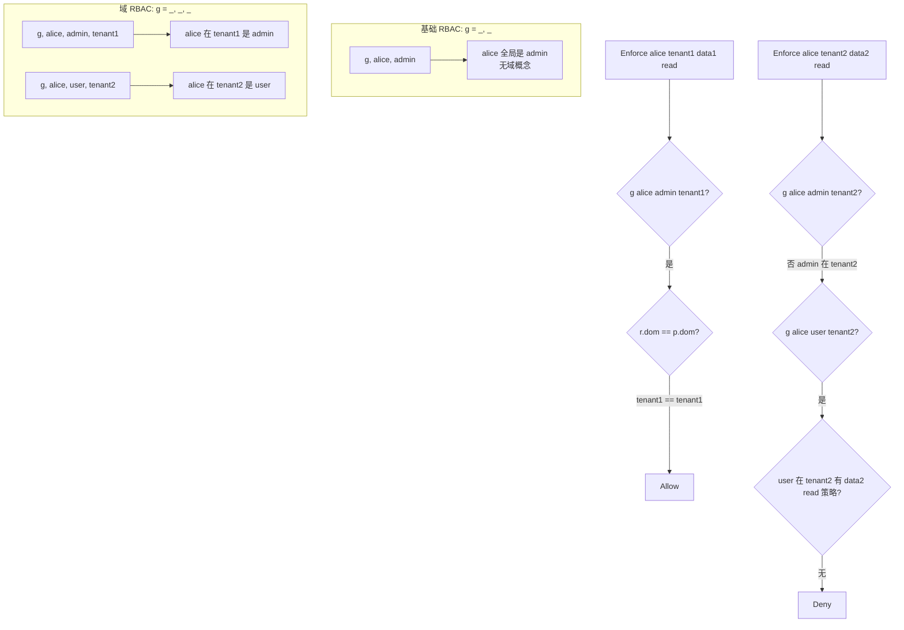

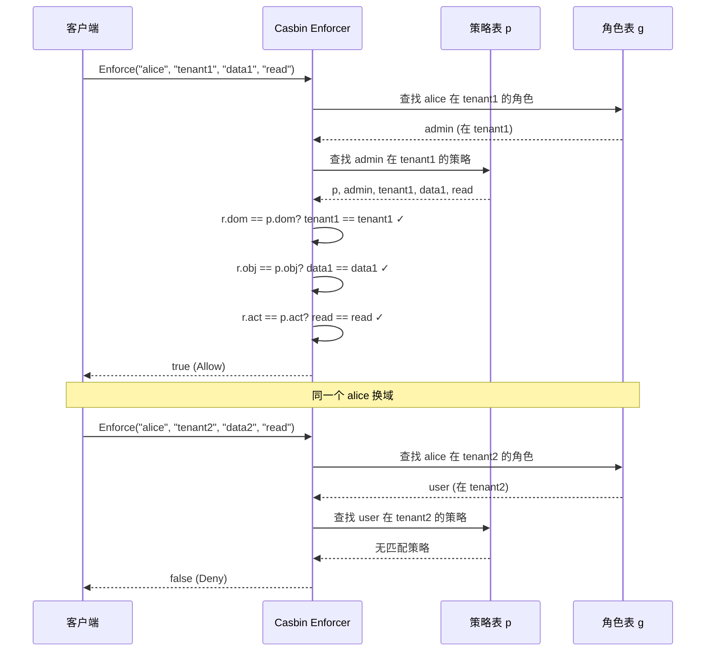

### RBAC with Conditions

#### 核心思想

1. 之前所有 RBAC 模型中，**g 规则一旦写入**就**永久生效**
2. **Conditional RoleManager** 引入了一个关键变化：**角色绑定**可以**附带条件**，条件不满足时角色绑定失效
3. 最典型的场景：**时间限定角色** - 某人在某个时间段内临时担任 admin，过期自动失效

#### 角色定义语法变化

```toml
[role_definition]
g = _, _, (_, _)
```

> 对比

| 模型         | 定义                  | 含义                            |
| ------------ | --------------------- | ------------------------------- |
| 基础 RBAC    | `g = _, _`            | 用户→角色，无条件               |
| 域 RBAC      | `g = _, _, _`         | 用户→角色→域，无条件            |
| 条件 RBAC    | `g = _, _, (_, _)`    | 用户→角色，附带 2 个条件参数    |
| 条件+域 RBAC | `g = _, _, _, (_, _)` | 用户→角色→域，附带 2 个条件参数 |

> (_, _) 中的每个 _ 代表一个额外的**参数位**，在 g 规则中以**实际值填充**（如起止时间），**运行时**传给条件函数判断

#### 策略解析

```
g, alice, data2_admin, 0000-01-01 00:00:00, 0000-01-02 00:00:00
g, alice, data3_admin, 0000-01-01 00:00:00, 9999-12-30 00:00:00
g, alice, data4_admin, _, _
g, alice, data5_admin, _, 9999-12-30 00:00:00
g, alice, data6_admin, _, 0000-01-02 00:00:00
g, alice, data7_admin, 0000-01-01 00:00:00, _
g, alice, data8_admin, 9999-12-30 00:00:00, _ 
```

> `_` 表示忽略该参数（**不做限制**），逐行分析

| g 规则              | 条件参数                | 含义                        | 时间匹配结果    |
| ------------------- | ----------------------- | --------------------------- | --------------- |
| alice → data2_admin | 0000-01-01 ~ 0000-01-02 | 只在这 1 天内有效           | false（已过期） |
| alice → data3_admi  | 0000-01-01 ~ 9999-12-30 | 几乎永久有效                | true            |
| alice → data4_admi  | _, _                    | 无条件限制（等同普通 RBAC） | true            |
| alice → data5_admi  | _ ~ 9999-12-30          | 无开始限制，永不过期        | true            |
| alice → data6_admi  | _ ~ 0000-01-02          | 无开始限制，但已过期        | false           |
| alice → data7_admi  | 0000-01-01 ~ _          | 有开始时间，无结束限制      | true            |
| alice → data8_admi  | 9999-12-30 ~ _          | 开始时间在遥远未来          | false           |

#### Enforce 推演

| 请求                        | alice 的角色绑定                 | 条件函数             | 结果  |
| --------------------------- | -------------------------------- | -------------------- | ----- |
| ("alice", "data1", "read")  | data1 无需角色（p 直接给 alice） | -                    | true  |
| ("alice", "data2", "write") | alice → data2_admin              | 时间已过 → false     | false |
| ("alice", "data3", "read")  | alice → data3_admin              | 永久有效 → true      | true  |
| ("alice", "data4", "write") | alice → data4_admin              | 无条件 → true        | true  |
| ("alice", "data5", "read")  | alice → data5_admin              | 永不过期 → true      | true  |
| ("alice", "data6", "write") | alice → data6_admin              | 已过期 → false       | false |
| ("alice", "data7", "read")  | alice → data7_admin              | 无结束限制 → true    | true  |
| ("alice", "data8", "write") | alice → data8_admin              | 未到开始时间 → false | false |

> 关键点：**条件函数**作用在 **g 规则（角色绑定）** 上，不是作用在 **p 规则（权限策略）** 上，**<u>角色绑定失效 = 该角色完全不生效</u>**

#### 运行机制

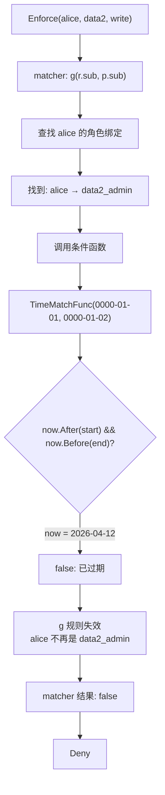

> 与 无条件的 data3 对比

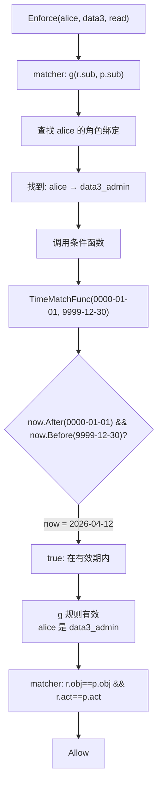

#### 代码注册方式

> 注意：**每条 g 规则**需要**单独注册条件函数**。也可以用 **AddNamedMatchingFunc** 为**所有 g 规则**统一注册（但**粒度不同**）

```go
// 为每条 g 规则绑定条件函数
e.AddNamedLinkConditionFunc("g", "alice", "data2_admin", util.TimeMatchFunc)
e.AddNamedLinkConditionFunc("g", "alice", "data3_admin", util.TimeMatchFunc)
// ...
```

#### 自定义条件函数

1. 签名：`func(args ...string) (bool, error)`
2. 可以自定义**任意条件逻辑**，不只限于时间：

```go
// 示例：IP 范围条件
func IPRangeMatchFunc(args ...string) (bool, error) {
    clientIP := args[0]   // 运行时传入
    allowedIP := args[1]  // 策略中配置
    return ipMatch(clientIP, allowedIP), nil
}
```

#### 条件+域的组合

```go
[role_definition]
g = _, _, _, (_, _)
```

> 策略格式变为 5 列：g, user, role, domain, condArg1, condArg2

```
g, alice, data2_admin, domain2, 0000-01-01 00:00:00, 0000-01-02 00:00:00
```

> 注册使用 **AddNamedDomainLinkConditionFunc**（多了 **domain** 参数）：

```go
e.AddNamedDomainLinkConditionFunc("g", "alice", "data2_admin", "domain2", util.TimeMatchFunc)
```

#### 三种匹配函数的区别

| 函数类型           | 作用阶段     | 注册方式                   | 控制什么                              |
| ------------------ | ------------ | -------------------------- | ------------------------------------- |
| MatchingFunc       | g 查找时     | AddNamedMatchingFunc       | 主体的模式匹配（如 u:* 匹配所有用户） |
| DomainMatchingFunc | g 查找时     | AddNamedDomainMatchingFunc | 域的模式匹配（如 org_* 匹配多个组织） |
| LinkConditionFunc  | g 规则判断时 | AddNamedLinkConditionFunc  | **角色绑定是否生效**（如时间条件）    |

> 三者**独立且串联**：<u>主体要匹配</u> → <u>域要匹配</u> → <u>条件要满足</u>，**角色绑定**才**真正生效**

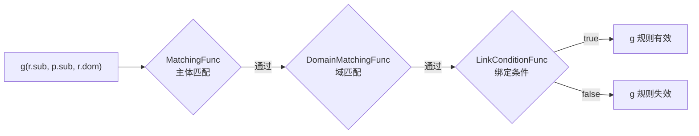

### RBAC vs. RBAC96

#### RBAC96 是什么

> RBAC96 是 NIST（美国国家标准与技术研究院）在 1996 年提出的 RBAC 标准模型家族，是**学术界**和**工业界**的 **RBAC 基准**，它定义了四个层级

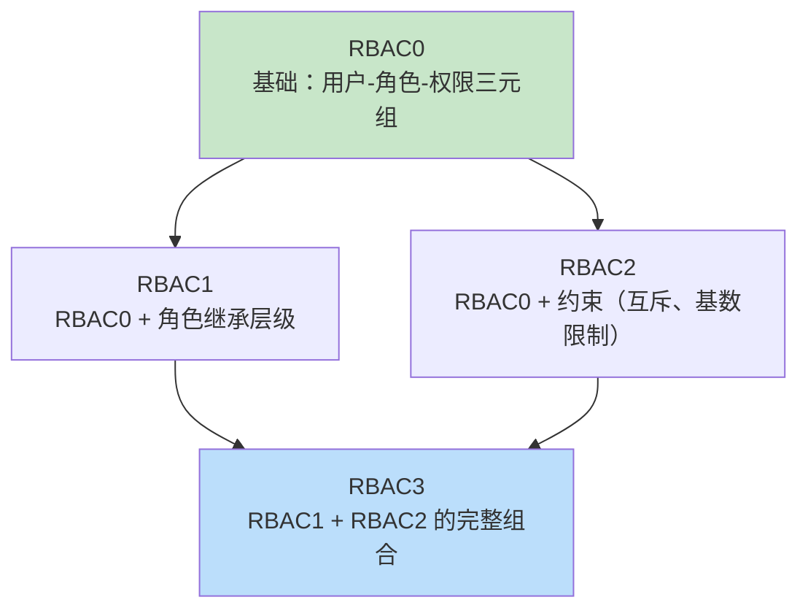

#### 逐级对比

##### RBAC0 - 基础三要素

> **RBAC0** 定义了 RBAC 的**最小可用集合**：<u>用户、角色、权限</u> 及其关系

| 要素        | 说明                                            |
| ----------- | ----------------------------------------------- |
| Users       | 用户                                            |
| Roles       | 角色                                            |
| Permissions | 权限（操作+对象）                               |
| UA          | User-Role Assignment（**用户→角色绑定**）       |
| PA          | Permission-Role Assignment（**权限→角色绑定**） |

> Casbin **完全覆盖**：**p 规则**就是 **PA**，**g 规则**就是 **UA**

##### RBAC1 — 角色继承

> 在 **RBAC0** 基础上加入**角色层级**（<u>Role Hierarchy</u>）：角色可以**继承**其他角色的权限

```
admin 继承 editor 继承 viewer
→ admin 自动拥有 viewer 和 editor 的所有权限
```

> Casbin **完全覆盖**：g 规则**天然支持**传递性继承

```
g, alice, senior_editor
g, senior_editor, editor
g, editor, viewer
```

> alice → senior_editor → editor → viewer，三级继承，alice 拥有所有权限

##### RBAC2 - 约束

> 在 **RBAC0** 基础上加入约束规则，最典型的是

| 约束类型        | 含义                              | 示例                       |
| --------------- | --------------------------------- | -------------------------- |
| 职责分离（SoD） | 同一用户不能同时拥有**互斥角色**  | 不能既是"出纳"又是"审计"   |
| 基数限制        | 一个用户**最多/最少**拥有几个角色 | 每人最多 3 个角色          |
| 先决条件        | 要获得某角色必须先拥有另一角色    | 要当 admin 必须先是 editor |

> Casbin **部分覆盖**

| RBAC2 要求                        | Casbin 支持情况                                              |
| --------------------------------- | ------------------------------------------------------------ |
| **职责分离（静态/动态 SoD）**     | 可通过 **deny-override policy effect** 间接实现，或通过 **constraint_definition** |
| 基数限制（如"每人最多 3 个角色"） | 不支持 - Casbin **没有内置数量约束**                         |
| 先决条件角色                      | 不支持 - **角色分配**是**扁平**的                            |

##### RBAC3 - 完整组合

> RBAC3 = RBAC1 + RBAC2，即**角色继承 + 约束**，Casbin 同样是**部分覆盖**，受限于 **RBAC2** 的**约束支持**

#### 三个关键差异

##### 差异一：用户 vs 角色 - 类型不区分

> RBAC96 中 User 和 Role 是不同的类型实体，Casbin 不做区分 - **都是字符串**

```
p, admin, book, read      # admin 是角色，作为策略主体
p, alice, book, read      # alice 是用户，也作为策略主体
g, amber, admin           # amber→admin 的角色绑定
```

1. GetAllSubjects() 返回所有**策略主体**：[admin, alice]（混合了用户和角色）
2. GetAllRoles() 只返回 **g 规则右侧**：[admin]

> 实践建议：**用命名约定区分**，如 **user::alice**、**role::admin**。有些项目正是这样做的：**u:123** 表示用户，**r:5** 表示角色

##### 差异二：权限类型自由

> RBAC96 定义了 7 种固定权限类型，Casbin 的**权限**是**任意字符串**

```
p, admin, /api/users, GET       # act = GET
p, admin, /api/users, POST      # act = POST
p, editor, document, approve    # act = approve（自定义操作）
p, viewer, dashboard, view      # act = view
```

> 配合 `regexMatch(r.act, p.act)` 还能用**正则匹配**，如 p.act = "(GET|POST)" 同时匹配两种 Method

##### 差异三：域（Domains）- 超越 RBAC96

1. **RBAC96 没有多租户概念**
2. Casbin 的 `g = _, _, _` 提供了**域级别**的**角色隔离**，这是对 RBAC96 的扩展

## Priority Model

> 在基础 RBAC 中，effect 是 `some(where (p.eft == allow))` - 只要有**任何一条 allow** 就放行，但现实中有冲突场景

```
p, alice, data1, read, allow       # alice 可以读
p, data1_group, data1, read, deny  # 但她所在的组被禁止读
```

> alice **同时匹配**两条策略，一条 allow、一条 deny，谁说了算？Priority Model 就是来解决这个问题的

### 隐式优先级（策略顺序）

```toml
[policy_effect]
e = priority(p.eft) || deny
```

> 规则：**策略**在**文件/数据库**中的**顺序**就是优先级，**<u>先出现的优先级最高</u>**

```
p, alice, data1, write, allow       # 第 1 条，优先级最高 → 生效
p, data1_group, data1, write, deny  # 第 2 条，被第 1 条覆盖
```

> 缺点：依赖顺序，**维护困难**，数据库里**排序不稳定**就会出问题

### 显式优先级（数字字段）

> 在 p 定义中加一个 **priority** 字段，**数字越小优先级越高**

```toml
[policy_definition]
p = priority, sub, obj, act, eft
```

> 完整示例分析：

```
# 角色级策略（优先级 10）
p, 10, data1_deny_group, data1, read, deny
p, 10, data1_deny_group, data1, write, deny
p, 10, data2_allow_group, data2, read, allow
p, 10, data2_allow_group, data2, write, allow

# 个人级策略（优先级 1，更高）
p, 1, alice, data1, write, allow
p, 1, alice, data1, read, allow
p, 1, bob, data2, read, deny

# 角色绑定
g, bob, data2_allow_group
g, alice, data1_deny_group
```

> 逐个请求分析：

| 请求                | 匹配的策略                                                   | 结果  | 原因                              |
| ------------------- | ------------------------------------------------------------ | ----- | --------------------------------- |
| alice, data1, write | p,1,alice,data1,write,allow                                  | allow | 优先级 1 > 10，个人策略赢         |
| bob, data2, read    | p,1,bob,data2,read,deny (优先级1) vs p,10,data2_allow_group,data2,read,allow (优先级10) | deny  | 个人 deny 优先级更高              |
| bob, data2, write   | p,10,data2_allow_group,data2,write,allow (优先级10)          | allow | 只有角色 allow，无更高优先级 deny |

> 注意：**AddPolicy** / **AddPolicies** 会按**优先级**排序插入，但 **UpdatePolicy** <u>不会重新排序</u> - 所以<u>不要通过 Update 修改优先级字段的值</u>

### 自定义优先级字段名

> 默认字段名是 **priority**，如果用其他名字（如 customized_priority），需要**手动设置索引**

```go
// 必须在 LoadPolicy 之前调用
e.SetFieldIndex("p", constant.PriorityIndex, 0) // 第 0 个字段是优先级
e.LoadPolicy()
```

> 不设置会怎样？ Casbin **无法识别**哪个字段是优先级，**策略按原始顺序匹配**，优先级逻辑失效

### 主体优先级（角色/用户层级）

> 核心思想：优先级不来自数字字段，而是来自**角色树的深度** - <u>越靠近叶子节点（用户），优先级越高</u>

```toml
[policy_effect]
e = subjectPriority(p.eft) || deny
```

> 角色树：

```
role: root                    # 自动优先级: 30（最低）
 └─ role: admin               # 自动优先级: 20
     ├─ role: editor          # 自动优先级: 10
     │  └─ user: jane         # 隐含优先级: 0（最高）
     └─ role: subscriber      # 自动优先级: 10
         └─ user: alice       # 隐含优先级: 0（最高）
```

> 规则：叶子（用户）> 内部角色（editor）> 管理员角色（admin）> 根角色（root）

> 策略分析：jane, data1, read → allow（jane 的优先级 > editor > admin > root）

```
p, root, data1, read, deny       # 优先级 30
p, admin, data1, read, deny      # 优先级 20
p, editor, data1, read, deny     # 优先级 10
p, jane, data1, read, allow      # jane 是叶子，优先级最高
```

> 设计直觉

1. 上层角色定义的是"**默认策略**"（如 deny），下层用户/角色可以"**覆盖**"它
2. 这符合企业场景 - 高层规定**默认禁止**，但可以给特定人员**开绿灯**

> 约束

1. 角色层级必须是树（**不能有环**），**同一用户的多角色**应在**同一深度**

> 假设角色树如下

```
root
 ├─ admin (depth 1)
 │   └─ editor (depth 2)
 │       └─ alice
 └─ viewer (depth 1)
     └─ alice
```

> alice 同时属于 editor（depth 2）和 viewer（depth 1）。如果策略是：

```
p, editor, data1, read, allow    # editor 说允许
p, viewer, data1, read, deny     # viewer 说禁止
```

1. alice 匹配了两条，一条来自 depth 2（editor），一条来自 depth 1（viewer），主体优先级的规则是越深优先级越高，所以 editor 的 allow 赢
2. 但问题在于：alice 通过 viewer 路径是 depth 1，通过 editor 路径是 depth 2，同一个用户在不同路径下深度不同，Casbin 无法确定 alice 的"**真实深度**"是多少，可能取到错误的优先级

> 如果多角色在同一深度

```
root
 └─ admin (depth 1)
     ├─ editor (depth 2)
     │   └─ alice
     └─ subscriber (depth 2)
         └─ alice
```

> alice 通过 editor 和 subscriber 都是 depth 2，<u>深度一致，不存在歧义</u>，**同深度平局**时按**策略顺序**打破

### 三种优先级模式对比

| 模式              | 优先级来源 | 配置方式                           | 适用场景                                       |
| ----------------- | ---------- | ---------------------------------- | ---------------------------------------------- |
| <u>隐式优先级</u> | 策略顺序   | `priority(p.eft) || deny`          | 简单场景，策略数量少                           |
| <u>显式优先级</u> | 数字字段   | `p = priority, sub, obj, act, eft` | 需要**精细控制优先级**，如个人策略覆盖角色策略 |
| <u>主体优先级</u> | 角色树深度 | `subjectPriority(p.eft) || deny `  | 角色层级清晰，叶子自动获得最高优先级           |

### effect 表达式解读

```
e = priority(p.eft) || deny
```

1. `priority(...)` — 按**优先级排序所有匹配的策略**，取**优先级最高**的那条的 eft 值
2. `|| deny` — 如果**没有匹配**的策略，**默认 deny**

> 对比基础 RBAC：

```
e = some(where (p.eft == allow))   # 基础 RBAC：有 allow 就放行
e = priority(p.eft) || deny        # Priority：优先级最高的策略说了算
```

## Super Administrator

### 核心机制

> 在 matcher 末尾加 `|| r.sub == "root"`

```toml
[matchers]
m = r.sub == p.sub && r.obj == p.obj && r.act == p.act || r.sub == "root"
```

> matcher 是一个布尔表达式，只要整个表达式为 true 就放行

| 条件                           | 结果         |
| ------------------------------ | ------------ |
| 正常策略匹配成功               | true → allow |
| 策略没匹配，但 r.sub == "root" | true → allow |
| 策略没匹配，也不是 root        | false → deny |

> root 用户**完全绕过策略检查**，不需要任何 p 规则

### 与 Priority Model 协同

1. 当 root 发起请求时，`|| r.sub == "root"` 让所有策略的 **matcher** 都为 true - 相当于所有 p 规则都"**匹配**"了
2. 然后交给 **effect** 判断

| Effect                       | root 的结果 | 原因                                                         |
| ---------------------------- | ----------- | ------------------------------------------------------------ |
| some(where (p.eft == allow)) | allow       | 所有策略都匹配，只要有一条 allow 就放行                      |
| `priority(p.eft) || deny`    | 不确定      | **所有策略都匹配**，取**优先级最高**的那条的 eft 值 - 如果是 deny，root 被拒 |

1. Priority Model 下，如果存在一条 `p, 1, *, *, deny`（高优先级 deny），**root 也会被拒绝**
2. `|| r.sub == "root"` 在 **matcher** 里确保了"**匹配**"，但 **effect** 取的是**优先级最高的策略**的 eft，**root** 并没有获得**特殊豁免**

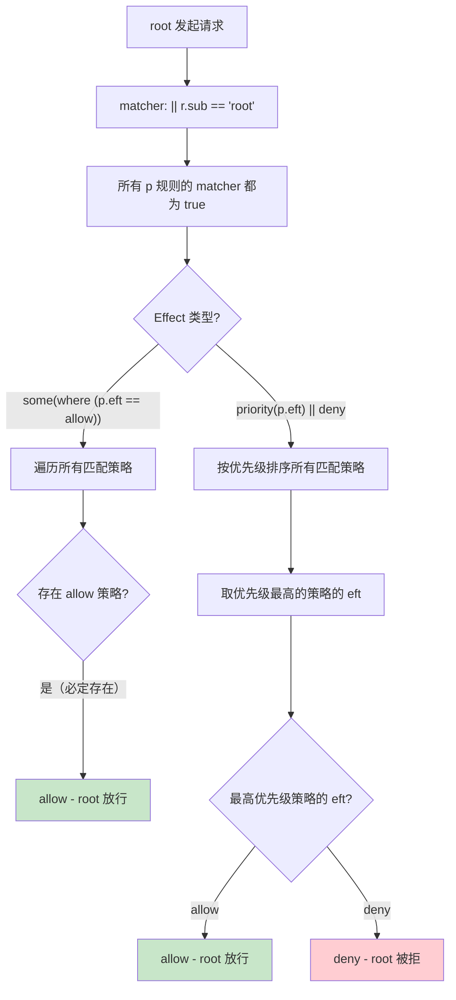

