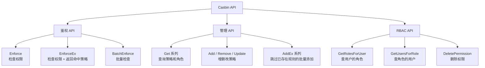

# Overview

> Casbin 的 API 分三大类：**鉴权 API**、**管理 API**、**RBAC API**



<!-- more -->

## 鉴权 API

| API                              | 返回值                  | 用途                              |
| -------------------------------- | ----------------------- | --------------------------------- |
| Enforce(sub, obj, act)           | (bool, error)           | 检查是否有权限                    |
| EnforceEx(sub, obj, act)         | (bool, []string, error) | 检查权限 + **返回命中的具体策略** |
| EnforceWithMatcher(matcher, req) | (bool, error)           | 用自定义 matcher **一次性检查**   |
| BatchEnforce(requests)           | ([]bool, error)         | 批量检查多个请求                  |

> EnforceEx 的价值 - 排查 403 时能知道是**哪条策略**放行的

```go
ok, reason, _ := enforcer.EnforceEx("amber", "data1", "read")
// ok = true, reason = ["admin", "data1", "read"]
// ↑ amber 属于 admin 角色，命中的是 p, admin, data1, read 这条策略
```

## 管理 API

### 查询（Get 系列）

| API                           | 返回                | 说明                 |
| ----------------------------- | ------------------- | -------------------- |
| GetAllSubjects()              | [admin, alice, bob] | 所有策略中的**主体** |
| GetPolicy()                   | 全量策略            | 所有 p 规则          |
| GetFilteredPolicy(0, "alice") | alice 相关策略      | 按字段过滤           |
| GetGroupingPolicy()           | 全量角色绑定        | 所有 g 规则          |
| HasPolicy(sub, obj, act)      | bool                | 判断某条策略是否存在 |

### 增删改

| 操作 | API                              | 说明                           |
| ---- | -------------------------------- | ------------------------------ |
| 增   | AddPolicy(sub, obj, act)         | 添加单条                       |
|      | AddPolicies(rules)               | 批量添加（全部成功或全部失败） |
| 删   | RemovePolicy(sub, obj, act)      | 删除单条                       |
|      | RemoveFilteredPolicy(0, "alice") | 按字段删除                     |
| 改   | UpdatePolicy(old, new)           | 更新单条                       |
|      | UpdatePolicies(olds, news)       | 批量更新                       |

### AddEx 系列：幂等批量添加

> **AddPolicies** 是**全有**或**全无** - 如果**有一条已存在，整个操作失败**。AddPoliciesEx **跳过已存在的规则**，只添加新的

```go
// 已有策略：user1, data1, read

AddPolicies([["user1", "data1", "read"], ["user2", "data2", "read"]])
// → 失败，user1 那条已存在，user2 也没加上

AddPoliciesEx([["user1", "data1", "read"], ["user2", "data2", "read"]])
// → 成功，跳过 user1，user2 被加上
```

## RBAC API

| API                                               | 返回         | 说明                     |
| ------------------------------------------------- | ------------ | ------------------------ |
| GetRolesForUser("amber")                          | [admin]      | 查用户的角色             |
| GetUsersForRole("admin")                          | [amber, abc] | 查角色下的用户           |
| HasRoleForUser("amber", "admin")                  | true         | 用户是否有某角色         |
| DeletePermission("data2", "write")                | -            | 删除**所有用户**的该权限 |
| DeletePermissionForUser("alice", "data1", "read") | -            | 只删除 alice 的该权限    |

# Management API

## 过滤器（Filtered API）的核心规则

> Filtered 方法的参数是 (**fieldIndex** int, **fieldValues** ...string)

1. fieldIndex：从第几个字段开始匹配
2. fieldValues：连续位置的匹配值，**"" 表示通配**

```go
p, alice, book, read
p, bob,   book, read
p, bob,   book, write
p, alice, pen,  get
p, bob,   pen,  get

GetFilteredPolicy(1, "book")              // 第 1 字段=book → 3 条
GetFilteredPolicy(1, "book", "read")      // 第 1=book 且第 2=read → 2 条
GetFilteredPolicy(0, "alice", "", "read") // 第 0=alice 且第 2=read → 1 条
GetFilteredPolicy(0, "alice")             // 第 0=alice → 2 条
```

## API 全景分类

### 鉴权类

| API                                    | 说明                          |
| -------------------------------------- | ----------------------------- |
| Enforce(request)                       | 标准鉴权                      |
| EnforceWithMatcher(matcher, request)   | 自定义 matcher 鉴权           |
| EnforceEx(request)                     | 鉴权 + 返回命中策略           |
| EnforceExWithMatcher(matcher, request) | 自定义 matcher + 返回命中策略 |
| BatchEnforce(requests)                 | 批量鉴权，返回 bool 数组      |

### 查询类（Get）

| API                                                      | 说明                      |
| -------------------------------------------------------- | ------------------------- |
| GetAllSubjects() / GetAllNamedSubjects("p")              | 所有主体                  |
| GetAllObjects() / GetAllNamedObjects("p")                | 所有对象                  |
| GetAllActions() / GetAllNamedActions("p")                | 所有操作                  |
| GetAllRoles() / GetAllNamedRoles("g")                    | 所有角色                  |
| GetPolicy() / GetFilteredPolicy(fieldIndex, values...)   | 全量/过滤查询策略         |
| GetGroupingPolicy() / GetFilteredGroupingPolicy(...)     | 全量/过滤查询角色绑定     |
| HasPolicy(sub, obj, act) / HasGroupingPolicy(user, role) | 判断策略/角色绑定是否存在 |

### 增加类（Add）

| API                           | 原子性                     | 重复处理                   |
| ----------------------------- | -------------------------- | -------------------------- |
| AddPolicy(sub, obj, act)      | 单条                       | 已存在返回 false           |
| AddPolicies(rules)            | **原子**（全成功或全失败） | **有一条已存在则全部失败** |
| AddPoliciesEx(rules)          | 非原子                     | **跳过已存在**，只加新的   |
| AddGroupingPolicy(user, role) | 单条                       | 已存在返回 false           |
| AddGroupingPolicies(rules)    | 原子                       | 同 AddPolicies             |
| AddGroupingPoliciesEx(rules)  | 非原子                     | 同 AddPoliciesEx           |

1. 还有对应的 **Named** 版本（AddNamedPolicy、AddNamedPolicies 等），操作指定 **policy type**
2. 还有 **Self** 版本（SelfAddPoliciesEx），**不触发 Watcher 通知**，用于 Watcher 回调中**避免循环**

### 删除类（Remove）

> 同样有 Named 版本

| API                                         | 说明                   |
| ------------------------------------------- | ---------------------- |
| RemovePolicy(sub, obj, act)                 | 删除单条策略           |
| RemovePolicies(rules)                       | 批量删除（原子）       |
| RemoveFilteredPolicy(fieldIndex, values...) | 按字段过滤删除         |
| RemoveGroupingPolicy(user, role)            | 删除角色绑定           |
| RemoveGroupingPolicies(rules)               | 批量删除角色绑定       |
| RemoveFilteredGroupingPolicy(...)           | 按字段过滤删除角色绑定 |

### 更新类（Update）

| API                                                 | 说明                 |
| --------------------------------------------------- | -------------------- |
| UpdatePolicy(old, new)                              | 更新单条策略         |
| UpdatePolicies(olds, news)                          | 批量更新策略         |
| UpdateFilteredPolicies(news, fieldIndex, values...) | 按过滤条件更新       |
| UpdateGroupingPolicy(old, new)                      | 更新角色绑定         |
| UpdateNamedPolicy / UpdateNamedPolicies             | 更新指定 policy type |

### 高级功能

| API                                   | 说明                                                   |
| ------------------------------------- | ------------------------------------------------------ |
| AddFunction(name, func)               | 注册自定义函数（如自定义 URL 匹配函数）                |
| LoadFilteredPolicy()                  | 从存储加载过滤后的策略（策略分片的核心 API）           |
| LoadIncrementalFilteredPolicy()       | 增量加载过滤策略（追加而非替换）                       |
| SetFieldIndex(ptype, constant, index) | 自定义字段位置（如 priority 在第 0 位、sub 在第 4 位） |

# RBAC API

> **RBAC API** 是 **Management API** 的**便捷子集**，专门为**角色场景**设计

## 角色管理（用户 ↔ 角色）

| API                                 | 方向      | 说明                                      |
| ----------------------------------- | --------- | ----------------------------------------- |
| GetRolesForUser("alice")            | 用户→角色 | 查 alice 的**直接**角色                   |
| GetImplicitRolesForUser("alice")    | 用户→角色 | 查 alice 的**全部**角色（含**继承**）     |
| GetUsersForRole("admin")            | 角色→用户 | 查 admin 下的**直接**用户                 |
| GetImplicitUsersForRole("admin")    | 角色→用户 | 查 admin 下的**全部**用户（含**继承链**） |
| HasRoleForUser("alice", "admin")    | 判断      | alice 是否有 admin 角色                   |
| AddRoleForUser("alice", "admin")    | 绑定      | 给 alice 加角色（已有则返回 false）       |
| AddRolesForUser("alice", roles)     | 批量绑定  | 一次加多个角色                            |
| DeleteRoleForUser("alice", "admin") | 解绑      | 移除 alice 的某个角色                     |
| DeleteRolesForUser("alice")         | 全部解绑  | 移除 alice 的所有角色                     |
| DeleteUser("alice")                 | 删除用户  | 从系统中移除用户                          |
| DeleteRole("admin")                 | 删除角色  | 从系统中移除角色                          |

> 直接 vs 隐式的区别

```go
g, alice, role:admin
g, role:admin, role:user

GetRolesForUser("alice")          → ["role:admin"]         ← 只有直接角色
GetImplicitRolesForUser("alice")  → ["role:admin", "role:user"]  ← 含继承链
```

## 权限管理（用户/角色 ↔ 权限）

| API                                    | 说明                                      |
| -------------------------------------- | ----------------------------------------- |
| GetPermissionsForUser("bob")           | 查 bob 的**直接**权限                     |
| GetImplicitPermissionsForUser("alice") | 查 alice 的**全部**权限（含**角色继承**） |
| HasPermissionForUser("alice", "read")  | 判断是否有某权限                          |
| AddPermissionForUser("bob", "read")    | 授权（已有则返回 false）                  |
| AddPermissionsForUser("alice", perms)  | 批量授权                                  |
| DeletePermissionForUser("bob", "read") | 撤销某权限                                |
| DeletePermissionsForUser("bob")        | 撤销全部权限                              |
| DeletePermission("read")               | 从系统中删除该权限（**影响所有用户**）    |

> 直接 vs 隐式权限

```go
p, admin, data1, read
p, alice, data2, read
g, alice, admin

GetPermissionsForUser("alice")          → [["alice", "data2", "read"]]     ← 只有直接权限
GetImplicitPermissionsForUser("alice")  → [["admin", "data1", "read"],     ← 含角色的权限
                                           ["alice", "data2", "read"]]
```

## 隐式查询（反向/跨角色链）

| API                                            | 方向          | 说明                                   |
| ---------------------------------------------- | ------------- | -------------------------------------- |
| GetImplicitUsersForPermission("data1", "read") | 权限→用户     | 谁能读 data1（含通过**角色继承**的）   |
| GetImplicitResourcesForUser("alice")           | 用户→资源     | alice 能访问的所有资源                 |
| GetImplicitUsersForResource("data2")           | 资源→用户     | 谁能访问 data2（含**角色继承**）       |
| GetImplicitObjectPatternsForUser("alice", ...) | 用户→对象模式 | alice 在某域某操作下能访问的对象通配符 |
| GetDomainsForUser("alice")                     | 用户→域       | alice 涉及的所有域（多租户场景）       |

## Named 变体

> 大多数 API 有 **Named** 版本，指定操作哪个 **policy type**：

| 标准 API                      | Named 变体                                        | 说明                 |
| ----------------------------- | ------------------------------------------------- | -------------------- |
| GetPermissionsForUser         | GetNamedPermissionsForUser("p2", "alice")         | 查 p2 策略段的权限   |
| GetImplicitRolesForUser       | GetNamedImplicitRolesForUser("g2", "alice")       | 查 g2 角色段的继承链 |
| GetImplicitPermissionsForUser | GetNamedImplicitPermissionsForUser("p2", "alice") | 查 p2 段的隐式权限   |

# Role Manager API

## 核心概念

1. RoleManager 是 Casbin 内部**管理角色层级关系**的接口，负责存储和查询"**用户→角色**"、"**角色→角色（继承）**"的<u>链接</u>关系
2. Enforcer 通过 **RoleManager** 来处理 `g = _, _` 或 `g = _, _, _`（带域）这类分组策略

## API 分类

### 注册匹配函数（Matching Function）

| API                                     | 作用                                                 |
| --------------------------------------- | ---------------------------------------------------- |
| AddNamedMatchingFunc("g", "", fn)       | 为**角色名**注册**通配符匹配函数**，* 可匹配多个名称 |
| AddNamedDomainMatchingFunc("g", "", fn) | 为**域名**注册通配符匹配函数，支持域名中的 *         |

> 典型场景：

```go
e.AddNamedMatchingFunc("g", "", util.KeyMatch)
e.AddGroupingPolicies([][]string{{"*", "admin", "domain1"}})
// * 匹配任意用户，所以 bob 自动拥有 admin 角色
e.GetRoleManager().HasLink("bob", "admin", "domain1") // → true
```

> **不注册匹配函数时**，**角色名**是**精确匹配**；注册后支持**通配符**，实现"全局管理员"等场景

### 获取/设置 RoleManager

> 替换 RoleManager 可以接入**自定义存储**（如 **Redis 直接存角色树**），或使用带**性能优化**的实现

| API                           | 说明                                    |
| ----------------------------- | --------------------------------------- |
| GetRoleManager()              | 获取默认 g 对应的 RoleManager           |
| GetNamedRoleManager("g2")     | 获取指定策略类型（如 g2）的 RoleManager |
| SetRoleManager(rm)            | 替换默认 g 的 RoleManager               |
| SetNamedRoleManager("g2", rm) | 替换指定策略类型的 RoleManager          |

### RoleManager 实例操作

> 这些方法作用在 rm（**RoleManager 实例**）上，直接操作**内存**中的**角色图**

| API                                  | 作用                                              |
| ------------------------------------ | ------------------------------------------------- |
| rm.AddLink("u1", "g1", "domain1")    | 添加链接：u1 在 domain1 中属于 g1 角色            |
| rm.DeleteLink("u1", "g1", "domain1") | 删除链接                                          |
| rm.HasLink("u1", "g1", "domain1")    | 检查 u1 是否（直接或继承地）拥有 g1 角色          |
| rm.GetRoles("u1", "domain1")         | 获取 u1 在 domain1 中的**所有角色**（含**继承**） |
| rm.GetUsers("g1")                    | 获取拥有 g1 角色的**所有用户**                    |
| rm.Clear()                           | 清空所有角色/链接数据                             |

### 调试与日志

| API                   | 作用                                      |
| --------------------- | ----------------------------------------- |
| rm.PrintRoles()       | 打印当前角色图（调试用）                  |
| rm.SetLogger(&logger) | 设置 RoleManager 的 logger                |
| rm.GetDomains(name)   | 查询用户在哪些域中拥有角色（**Go 独有**） |

## RoleManager 与 RBAC API 的层次关系

```
Enforcer（高层）
  ├── GetRolesForUser()        ← RBAC API，内部调用 RoleManager
  ├── AddGroupingPolicy()      ← 策略 API，内部写入 RoleManager
  └── GetRoleManager()         ← 暴露底层 RoleManager
```

```
RoleManager（底层）
  ├── AddLink / DeleteLink     ← 直接操作角色图
  ├── HasLink                  ← 角色继承判断
  └── GetRoles / GetUsers      ← 角色图查询
```

> 通常通过 **Enforcer** 的 **RBAC API**（GetRolesForUser、AddGroupingPolicy 等）**操作角色**，**RoleManager API** 主要用于

1. **自定义** RoleManager 实现（替换**内部存储**）
2. **调试**（PrintRoles、HasLink **直接验证图状态**）
3. **高级场景**（多 g 定义、域名通配符）

> 关键点：**HasLink** vs **GetRolesForUser**

| 对比   | rm.HasLink("u1","g1","d1")   | e.GetRolesForUser("u1","d1") |
| ------ | ---------------------------- | ---------------------------- |
| 层次   | <u>RoleManager 底层</u>      | <u>Enforcer 高层</u>         |
| 返回   | bool（是否有此角色）         | []string（所有角色列表）     |
| 用途   | **精确验证**单条链接是否存在 | 枚举用户全部角色             |
| 含继承 | 是                           | 是                           |

