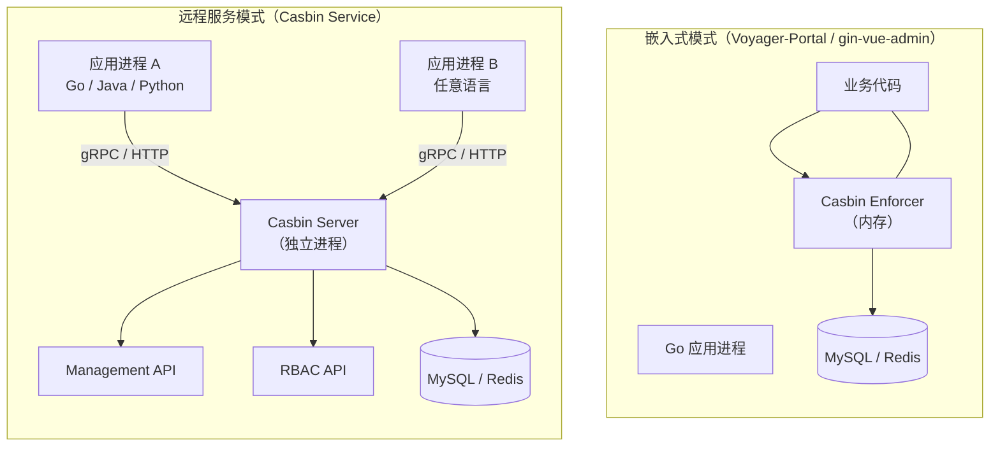
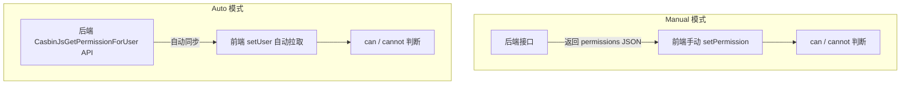

# Admin Portal

## Casdoor - 官方管理平台

1.  Casdoor 是 Casbin 团队自己开发的 **Web 端身份与访问管理平台**，提供
   - **Model Editor**（模型编辑器）：**可视化编辑 Casbin 模型**（如 RBAC、ABAC 等的 .conf 文件）
   - **Policy Editor**（策略编辑器）：**可视化编辑策略规则**（policy）
2. 本质上就是一个 Casbin 的 **GUI 管理后台**，让你不用手写配置文件，通过网页界面就能管理权限模型和策略

<!-- more -->

## 第三方开源 Admin 项目

> 表格列出的是 **基于 Casbin 做鉴权的开源后台管理系统**，当前展示的是 Go 语言 部分的项目

| 项目          | 核心技术栈                      | 亮点                     |
| ------------- | ------------------------------- | ------------------------ |
| Casdoor       | Beego + XORM + React            | 官方出品，功能最全       |
| go-admin      | Gin + GORM + Vue + Element UI   | 社区活跃，国产热门脚手架 |
| gin-vue-admin | Gin + GORM + Vue + Element UI   | 非常流行的 Go 后台框架   |
| gin-admin     | Gin + GORM + React + Ant Design | RBAC 脚手架              |
| zeus-admin    | Gin + JWT + Casbin + Vue        | 统一权限管理平台         |
| IrisAdminApi  | Iris + Casbin + Vue             | 基于 Iris 框架           |
| Gfast         | Go Frame + Vue + Element UI     | 基于 GF 框架的管理系统   |
| echo-admin    | Echo + GORM + Casbin + Vue      | 基于 Echo 框架           |
| Spec-Center   | Mux + MongoDB                   | RESTful 平台             |

> 共同特点：都采用 **前端（Vue/React）+ 后端（Go Web 框架）+ Casbin 鉴权** 的架构模式 - **gin-vue-admin**


# Casbin Service

## 两种 Casbin 部署模式对比



| 模式     | 调用方式                        | 延迟           | 适用场景            |
| -------- | ------------------------------- | -------------- | ------------------- |
| 嵌入式   | **函数调用 enforcer.Enforce()** | 纳秒级（内存） | 单体应用 / 单语言栈 |
| 远程服务 | **网络 gRPC / HTTP 调用**       | 毫秒级（网络） | 多语言微服务架构    |

## 三个项目解释

| 项目           | 说明                                                         |
| -------------- | ------------------------------------------------------------ |
| Casbin Server  | **官方出品的 gRPC 服务**，暴露两类 API：**Management API（增删改查策略）**和 **RBAC API（角色管理）**<br />**任何语言的应用**都可以通过 **gRPC** 调用它做鉴权 |
| middleware-acl | 一个 RESTful ACL 中间件，通过 **HTTP** 接口调用 Casbin，适合非 gRPC 场景 |
| auth-server    | 一个**认证服务器**示例，把**认证（Authentication）**和**授权（Authorization）**都集成在一起 |

# Command-line Tools

> 在**终端直接操作 Casbin**，不需要写代码。覆盖 6 种语言实现（Go / Rust / Java / Python / .NET / Node.js）

## 核心能力

| 命令         | 作用                              | 示例                              |
| ------------ | --------------------------------- | --------------------------------- |
| enforce      | 检查某用户能否访问某资源          | alice 能读 data1 吗？             |
| enforceEx    | 检查权限 + 返回**命中的具体策略** | alice 能写 data2 是因为哪条规则？ |
| addPolicy    | 添加策略（仅 Java CLI）           | 给 alice 加一条写 data2 的权限    |
| removePolicy | 删除策略（仅 Java CLI）           | 移除 alice 写 data2 的权限        |

## 典型用法

> 检查权限

```
./casbin enforce -m rbac_model.conf -p rbac_policy.csv "alice" "data1" "read"
# 输出：{"allow":true,"explain":null}
```

> 查看命中的策略

```
./casbin enforceEx -m rbac_model.conf -p rbac_policy.csv "alice" "data2" "write"
# 输出：{"allow":true,"explain":["data2_admin","data2","write"]}
#       ↑ 命中规则：data2_admin 角色可以 write data2，alice 属于 data2_admin
```

> 内联 Model 和 Policy（不需要文件）

```
内联 Model 和 Policy（不需要文件）：
# Model 和 Policy 直接用 \n 换行符写在命令行里
./casbin enforce -m "[request_definition]\nr = sub, obj, act\n..." -p "p, alice, data1, read\n..."
```

## 实际价值

> CLI 工具主要用于以下场景

| 场景              | 说明                                                 |
| ----------------- | ---------------------------------------------------- |
| <u>调试策略</u>   | 快速验证某条策略是否按预期生效，不用写测试代码       |
| <u>CI/CD 集成</u> | 在部署流水线中用 CLI 检查策略文件的正确性            |
| <u>运维排障</u>   | 生产环境遇到 403 时，用 CLI 复现排查是哪条策略导致的 |
| <u>文档示例</u>   | 写文档时快速演示 Casbin 的行为，截图输出结果         |

# Logging & Error Handling

## 日志（Logging）

> Casbin **默认关闭日志**，开启后会记录 4 类信息

| 日志类型   | 记录内容           | 示例                         |
| ---------- | ------------------ | ---------------------------- |
| LogModel   | 模型加载信息       | 加载了哪个 Model 文件        |
| LogEnforce | 每次鉴权请求和结果 | alice, data1, read ---> true |
| LogPolicy  | 策略变更信息       | 加载/添加/删除了哪些策略     |
| LogRole    | 角色关系信息       | alice 属于 admin 角色        |

> 每个 Enforcer 可以配置独立的 Logger，支持**运行时切换**

```go
e1.SetLogger(&DefaultLogger{})    // 用默认 Logger
e2.SetLogger(&YouOwnLogger)       // 用自定义 Logger
e3, _ := casbin.NewEnforcer("model.conf", adapter, logger) // 初始化时指定
```

> Go 语言有两种内置 Logger

| Logger        | 说明                                                         |
| ------------- | ------------------------------------------------------------ |
| DefaultLogger | Go 标准 log 包，简单文本输出                                 |
| Zap Logger    | zap **结构化 JSON 日志**，适合生产环境，可通过 zap-logger 插件接入 |

> 自定义 Logger 只需实现 5 个方法：**EnableLog**、**IsEnabled**、**LogModel**、**LogEnforce**、**LogPolicy**、**LogRole**

## 错误处理（Error Handling）

> Casbin 的 5 个**核心函数**都可能返回 **error** 或 **panic**

| 函数          | 错误来源                             |
| ------------- | ------------------------------------ |
| NewEnforcer() | Model 文件语法错误、Adapter 连接失败 |
| LoadModel()   | .conf 文件格式错误                   |
| LoadPolicy()  | .csv 策略文件格式错误、DB 连接失败   |
| SavePolicy()  | Adapter 写入失败                     |
| Enforce()     | Matcher 表达式执行异常               |

> **NewEnforcer()** 内部会调用 **LoadModel() + LoadPolicy()**，所以一般只需处理 **NewEnforcer()** 的错误

> 运行时开关：**EnableEnforce**

```go
e.EnableEnforce(false)  // 关闭鉴权 → 所有 Enforce() 都返回 true
e.EnableEnforce(true)   // 恢复鉴权
```

> 用途：紧急故障时临时放行所有请求（类似"**断路器**"），策略管理操作不受影响

# Frontend Integration

> Casbin.js 是 Casbin 的前端库，让**浏览器端**也能做**权限判断**，控制 **UI 元素的显示/隐藏**和**路由跳转**

## 两种工作模式

| 模式               | 原理                                  | 适用场景                                  |
| ------------------ | ------------------------------------- | ----------------------------------------- |
| Manual（手动模式） | **前端代码直接设置权限对象**          | 权限简单的场景，**后端接口返回权限 JSON** |
| Auto（自动模式）   | 自动从后端 API 拉取**当前用户的权限** | 权限复杂的场景，后端有 Casbin 服务        |



> Manual 模式示例

```typescript
// 前端手动设置权限对象
const authorizer = new casbinjs.Authorizer("manual");
authorizer.setPermission({
    "read": ["data1", "data2"],
    "write": ["data1"]
});

// 判断权限
authorizer.can("write", "data1");   // → true
authorizer.cannot("read", "data2"); // → false
```

>  Auto 模式示例 - 后端需要暴露一个 API，调用 **CasbinJsGetPermissionForUser()** <u>生成权限对象</u>返回给前端

```typescript
// 指定后端 API，自动拉取权限
const authorizer = new casbinjs.Authorizer("auto", {
    endpoint: "http://backend/api/casbin"
});

// 设置当前用户，自动触发权限同步
authorizer.setUser("Tom");

// 后端返回：{"read": ["data1", "data2"], "write": ["data1"]}
authorizer.can("read", "data1"); // → true
```

## API 一览

| 方法                    | 说明                       |
| ----------------------- | -------------------------- |
| can(action, object)     | 能否对 object 执行 action  |
| cannot(action, object)  | 是否不能执行               |
| canAll(action, objects) | 能否对所有对象执行         |
| canAny(action, objects) | 能否对任一对象执行         |
| setPermission(json)     | 手动设置权限对象           |
| setUser(user)           | 设置用户并**自动拉取权限** |

## 支持的前端框架

| 框架    | 包名          | 说明                              |
| ------- | ------------- | --------------------------------- |
| React   | react-authz   | Casbin 官方 React 封装            |
| React   | rbac-react    | 第三方，用 HOC + CASL + Casbin.js |
| Vue     | vue-authz     | Casbin 官方 Vue 封装              |
| Angular | angular-authz | Casbin 官方 Angular 封装          |

## 为什么需要 Casbin.js

> 而非直接在前端跑 Enforcer

| 问题       | 直接用 Node-Casbin                                           | 用 Casbin.js                                           |
| ---------- | ------------------------------------------------------------ | ------------------------------------------------------ |
| 初始化开销 | 每个客户端连接都要初始化 Enforcer，**拉全量策略**，高并发压垮 DB | 只拉**当前用户的权限**，轻量                           |
| 安全风险   | 暴露**所有策略**给客户端                                     | 用户只能看到自己的权限，不知道**模型**和其他用户的策略 |
| 耦合度     | **前后端紧耦合**                                             | **前端只关心权限 JSON**，与后端解耦                    |
| 带宽       | 传输全量策略数据                                             | 只传输**当前用户的权限对象**（通常几 KB）              |

