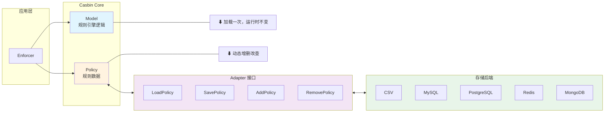

# Model Storage

1. Casbin 中**模型**的**三种加载方式**
2. 模型是"**只读**"的
   - Casbin 的 Model 定义了**访问控制逻辑**（<u>谁能对什么资源做什么操作</u>），**运行时**被视为**静态配置**
   - 没有 **API** 可以**保存或更新模型** - 它是设计时**确定**的，**不是动态变化的**

> 关键区别

| 方式             | 适用场景             | 优点                 |
| ---------------- | -------------------- | -------------------- |
| <u>CONF 文件</u> | 大多数情况           | 清晰、可分享、易维护 |
| <u>代码构建</u>  | 需要程序化组装模型   | 灵活、可条件拼接     |
| <u>字符串</u>    | **配置中心/DB 存储** | 适合集中管理         |

1. 三种方式加载的**模型内容完全相同**，区别只在于**来源不同**
2. 模型一旦加载完成，后续的**动态变化**都体现在 **Policy（策略）** 上，而不是 **Model** 上

<!-- more -->

## 从 .conf 文件加载（推荐）

> **最常用**的方式，把**模型定义**写在**独立的配置文件**中，便于分享和讨论

```toml
[request_definition]    					# 请求定义：请求有哪些字段
r = sub, obj, act       					# sub=主体, obj=客体/资源, act=操作

[policy_definition]     					# 策略定义：策略规则有哪些字段
p = sub, obj, act

[role_definition]       					# 角色定义：角色继承关系
g = _, _                					# 支持角色层级（用户→角色）

[policy_effect]         					# 策略效果：匹配后的决定
e = some(where (p.eft == allow))  # 只要有一条策略允许就放行

[matchers]              					# 匹配器：请求与策略如何匹配
m = g(r.sub, p.sub) && r.obj == p.obj && r.act == p.act
```

> 使用时一行代码创建 **Enforcer**

```
e := casbin.NewEnforcer("rbac_model.conf", "rbac_policy.csv")
```

## 从代码中构建

> 适合需要**动态组装模型**的场景，通过 `AddDef()` **逐条添加定义**

```go
m := model.NewModel()
m.AddDef("r", "r", "sub, obj, act")  // 请求定义
m.AddDef("p", "p", "sub, obj, act")  // 策略定义
m.AddDef("g", "g", "_, _")           // 角色定义
m.AddDef("e", "e", "some(where (p.eft == allow))")
m.AddDef("m", "m", "g(r.sub, p.sub) && r.obj == p.obj && r.act == p.act")
```

## 从字符串加载

> 适合模型存储在**配置中心**或**数据库**的场景

```go
text := `[request_definition]
r = sub, obj, act
...`
m, _ := model.NewModelFromString(text)
```

# Policy Storage

> 核心思想：**Model** 定义**规则逻辑**，而 **Policy** 存储**具体规则数据**，两者分离

## CSV 文件存储（最简单）

> 策略以 CSV 格式存储，**每行一条规则**

```
p, alice, data1, read              # alice 可以读 data1
p, bob, data2, write               # bob 可以写 data2
p, data2_admin, data2, read        # data2_admin 角色可以读 data2
p, data2_admin, data2, write       # data2_admin 角色可以写 data2
g, alice, data2_admin              # alice 属于 data2_admin 角色（角色分配）
```

1. **p** 开头：**策略规则（policy）**，对应 Model 中的 **policy_definition**
2. **g** 开头：**角色继承（grouping）**，对应 Model 中的 **role_definition**
3. 所以上面 alice 既能读 data1（直接授权），又能读写 data2（通过 data2_admin 角色继承）

> CSV 转义规则 - **逗号**用**双引号**包裹，**内部双引号**用 **""** 转义

| 场景                     | 正确写法                                       | 错误写法                                   |
| ------------------------ | ---------------------------------------------- | ------------------------------------------ |
| 字段含**逗号**           | p, alice, "data1,data2", read                  | p, alice, data1,data2, read                |
| 字段含**逗号**和**引号** | p, alice, data, "r.act in (""get"", ""post"")" | p, alice, data, "r.act in ("get", "post")" |

## Adapter API（适配器接口）

> Adapter 是 Casbin 与**存储后端**之间的桥梁：

| 方法                   | 类型                 | 说明                         |
| ---------------------- | -------------------- | ---------------------------- |
| LoadPolicy()           | **基础（必须实现）** | **从存储加载所有策略规则**   |
| SavePolicy()           | 基础                 | 将**所有策略规则**保存到存储 |
| AddPolicy()            | 可选                 | 新增一条策略规则             |
| RemovePolicy()         | 可选                 | 删除一条策略规则             |
| RemoveFilteredPolicy() | 可选                 | **按条件批量删除策略规则**   |

1. **基础方法** = 所有 Adapter **必须实现**
2. **可选方法** = **按需实现**，未实现时 Casbin 会**退回**到**全量 SavePolicy()**

## 数据库存储格式

> CSV 里的策略存到数据库时，会被"**展平**"成**通用表结构**

### CSV

```
p, data2_admin, data2, read
p, data2_admin, data2, write
g, alice, admin
```

### 数据库表

| id   | ptype | v0          | v1    | v2    | v3   | v4   | v5   |
| ---- | ----- | ----------- | ----- | ----- | ---- | ---- | ---- |
| 1    | p     | data2_admin | data2 | read  |      |      |      |
| 2    | p     | data2_admin | data2 | write |      |      |      |
| 3    | g     | alice       | admin |       |      |      |      |

> 各列含义：

1. **ptype**：<u>规则类型</u>（<u>p、g、g2</u> 等），对应 CSV 中第一个字段
2. `v0`~`v5`：按顺序存储后续字段，**最多 6 列**（部分 Adapter 支持更多）

> 本质上就是 **把 CSV 的每一行**拆成**类型** + **按序号排列的字段**，是一种**通用**的、与**具体模型无关**的存储格式

## 总结对比

> **换存储后端只需换 Adapter，Model 和业务代码完全不用动**

```
Model = 规则引擎（逻辑）
    ↕ 加载一次，运行时不变
Policy = 规则数据（具体谁能做什么）
    ↕ 通过 Adapter 动态增删改查

存储后端：CSV 文件 / MySQL / PostgreSQL / Redis / MongoDB ...
    ↕ 都实现同一个 Adapter 接口
```



# Loading Policy Subsets

## 核心概念

1. 背景问题：在**大规模**或**多租户**场景下，把**所有策略一次性加载到内存**不现实 - <u>内存占用过大 + 加载速度慢</u>
2. 解决方案：只加载**需要**的那部分策略子集

## 两个核心 API

### LoadFilteredPolicy(filter)

1. 按 filter 条件从存储中加载策略，**替换**当前**内存中的策略**
2. 加载后 **SavePolicy() 被禁用** - 防止只有**部分策略在内存**的情况下把**残缺数据**写回存储，**覆盖掉完整策略**

### LoadIncrementalFilteredPolicy(filter)

1. 同样按 filter 条载入策略，但是**追加**到当前内存策略，而非替换
2. 可以**多次调用**，每次加载一个**租户/域**的策略，最终合并成一个 enforcer

## 代码解析

```go
// 使用支持过滤的适配器（FilteredAdapter）
adapter := fileadapter.NewFilteredAdapter("examples/rbac_with_domains_policy.csv")
enforcer.InitWithAdapter("examples/rbac_with_domains_model.conf", adapter)

filter := &fileadapter.Filter{
    P: []string{"", "domain1"},   // 过滤 p 规则：第2列 = "domain1"
    G: []string{"", "", "domain1"}, // 过滤 g 规则：第3列 = "domain1"
}
enforcer.LoadFilteredPolicy(filter)
```

> Filter 结构的字段含义：

| 字段                           | 对应 CSV 列       | 作用                                    |
| ------------------------------ | ----------------- | --------------------------------------- |
| P: []string{"", "domain1"}     | policy (p) 规则   | 第1列（sub）不限，第2列必须是 "domain1" |
| G: []string{"", "", "domain1"} | grouping (g) 规则 | 第1、2列不限，第3列必须是 "domain1"     |

> **空字符串 ""** 表示该位置**不过滤**（通配）

## 典型使用场景对比

| 场景                        | 用哪个                                   |
| --------------------------- | ---------------------------------------- |
| 单个租户，切换域            | LoadFilteredPolicy — 替换掉旧的          |
| 多个租户合并到一个 enforcer | LoadIncrementalFilteredPolicy — 依次追加 |
| 全量加载                    | 普通 LoadPolicy                          |

## 关键约束

> LoadFilteredPolicy 之后 **SavePolicy() 被禁用**

原因：**内存**中只有**部分策略**，如果 **SavePolicy** 把**内存数据**写回**存储**，会**把其他域/租户的策略清空**，造成**数据丢失**


