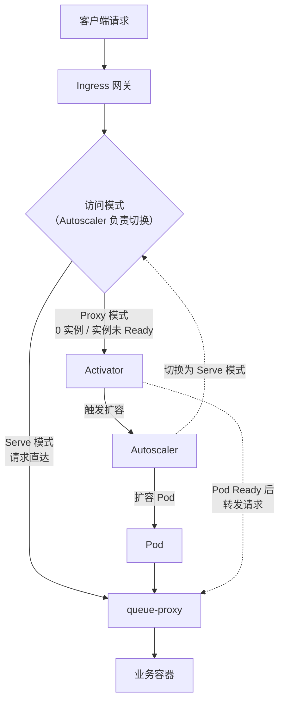

# Knative概述

## 概述

1. Knative是一款基于**Kubernetes**的**Serverless**框架，支持基于**请求**的**自动弹性**、在**没有流量**时将**实例数量**自动缩容至**零**、**版本管理**与**灰度发布**等能力
2. 在**完全兼容社区**Knative和Kubernetes API的基础上，ACS Knative进行了多维度的**能力增强**，例如通过**保留实例降低冷启动时间**、基于**AHPA**实现**弹性预测**等

<!-- more -->

## 为什么要在Kubernetes集群中使用Knative

### Knative介绍

Knative是一款基于**Kubernetes**集群的**Serverless**框架，提供了**云原生**、**跨平台**的**Serverless编排标准**。Knative通过整合**容器构建**、**工作负载管理**以及**事件模型**来实现这一Serverless标准，优势如下。

1. 更**聚焦**于**业务逻辑**：Knative通过简单的**应用配置**、**自动扩缩容**等手段让开发者聚焦于业务逻辑，降低**运维负担**、减少对**底层资源**的关注。
2. **标准化**：将业务代码部署到Serverless平台时，需要考虑**源码的编译、部署**和**事件的管理**。
   - 目前**社区**和**云厂商**提供的**Serverless解决方案**和**FaaS方案**标准不一。
   - Knative提供了一个**标准**、**通用**的Serverless框架。例如，如需在Knative中实现**事件驱动**，您可以编写对应的YAML文件（**CR**）并在集群中部署，无需与**云产品**做**深度绑定**，便于**跨平台迁移**。
3. **使用门槛低**：Knative支持将**代码自动打包**为**容器镜像**并**发布为服务**，也支持将**函数**快捷地部署到**Kubernetes**集群中，以**容器**的方式运行。
4. **应用管理自动化**：Knative支持在**没有流量**时自动将**实例数量**缩容至**零**，从而**节省资源**，还提供**版本管理**、**灰度发布**等功能。
5. **事件驱动**：Knative提供了**完整的事件模型**，便于接入**外部系统的事件**，并将**事件路由**到适当的**服务**或**函数**进行处理。

### 核心组件

Knative包括以下核心组件，分别执行不同的功能

- Knative **Serving**：管理**Serverless工作负载**，提供了**应用部署**、**多版本管理**、**基于请求的自动弹性**、**灰度发布**等能力，而且在**没有业务流量**时可以将**应用实例**缩容至**零**。
- Knative **Eventing**：提供了**事件源的接入**、**事件注册和订阅**、以及**事件过滤**等一整套**事件管理**的能力。**事件模型**可以有效地解耦**生产者**和**消费者**的依赖关系。
- Knative **Functions**: 提供了一个简单的方式来**创建、构建和部署Knative服务**。您无需深入了解底层技术栈（例如Kubernetes、容器、Knative），通过使用Knative Functions，即可将**无状态**、**事件驱动**的**函数**作为**Knative服务**部署到Kubernetes集群中。

### 功能特性

相较于在Kubernetes集群不使用Knative，使用Knative能帮您以更简便的方式实现如下功能特性。

#### 基于请求的自动弹性

1. 基于**CPU**或者**Memory**的弹性有时并**不能完全反映**业务的真实使用情况
   - 对于**Web**服务来说，基于**并发数（QPS）**或者**每秒处理请求数（RPS）**进行弹性伸缩更能直接反映**服务性能**
   - **Knative Serving**会为每个**Pod**注入**queue-proxy**容器，收集容器**并发数（Concurrency）**或**请求数（RPS）**指标
   - **Autoscaler定时获取指标**后，会根据相应的**算法**自动调整**Deployment**的Pod数量，从而实现**基于请求**的**自动扩缩容**
2. 如果在**ACS集群**中实现相应的操作，您需要分别创建**Deployment**、**Service**，配置**Ingress网关**，然后配置**HPA参数**。
   - 而使用**Knative服务**时，您只需要**部署Knative**并配置**Knative服务**的YAML文件。

#### 在没有流量时将实例数量自动缩容至零

1. Knative支持在应用**无流量请求**时将**Pod数量**自动缩容至**0**，并在**有请求**时**自动扩容Pod**
2. Knative中定义了两种请求访问模式：**Proxy**（代理模式）和**Serve**（请求直达模式）
3. **模式的切换**由**Autoscaler**组件负责
4. 当**请求为0**时，Autoscaler会将请求模式切换为**Proxy**模式
5. 当**有请求访问**时，Autoscaler会**收到通知**进行**扩容**，扩容的**Pod状态**变为**Ready**后对**请求**进行**转发**，此时**Autoscaler**会将访问模式切换为**Serve**模式

两种请求访问模式的**路径**与**切换时机**如下（承载**访问模式**的底层CRD为**ServerlessService**，简称**SKS**，**Autoscaler**根据**实例数**与**Ready状态**切换其模式）：

- **Proxy 模式**：**0实例**或**实例未Ready**时，**请求**经**Activator**代理，**Activator**缓冲**请求**并**触发扩容**，待**Pod Ready**后完成**转发**
- **Serve 模式**：**实例Ready**后，**Ingress网关**绕过**Activator**，**请求直达**Pod内的**queue-proxy**，避免常驻**代理层**的额外开销

#### 版本管理与灰度发布

创建**Knative服务**时底层会自动创建一个**Configuration**资源和一个**Route**资源。

1. **Configuration**
   - 当前**期望状态**的配置
   - 每次**更新Service**就会**更新Configuration**，Configuration的更新会创建一个**唯一的Revision**
   - **Revision**相当于**Configuration**的**版本管理**机制
2. **Route**
   - 负责将**请求路由**到**Revision**，并可以向**不同的Revision**转发**不同比例的流量**

基于以上特性，您可以使用**Revision**进行**版本的管理**，例如**版本的回退**。您还可以进行**流量**的**灰度发布**，例如创建了**V1**版本的**Revision**后，当版本需要变更时可以更新服务的**Configuration**，创建**V2**版本的**Revision**，通过**Route**对**V1**、**V2**设置不同的**流量比例**（例如V1为70%，V2是30%），那么流量会按照预设的比例进行**分发**。

#### 事件驱动

Knative通过**Eventing**提供了**完整的事件模型**，便于接入**外部系统**（例如**GitHub**、**消息队列**等）的**事件**，并将**事件路由**到适当的**Knative服务**或**函数**进行处理。

## 为什么要使用ACS Knative

在**完全兼容社区Knative**并提供**标准Kubernetes API**接口的基础上，ACS Knative进一步增强**产品化能力**并提供了更丰富的产品方案。

1. 产品化的能力：提供了**产品化一键部署能力**，您无需购买资源搭建系统。同时提供**产品控制台**，支持**白屏化**操作，降低**Kubernetes**集群和**Knative**的使用门槛
2. 简化运维：
   - **核心组件托管**：在ACS集群中，Knative的核心组件**Knative Serving**和**Knative Eventing**均由ACS创建和托管，无需您承担**资源费用**，且提供**高可用**保障
   - **网关托管**：ACS Knative提供**ALB**、**ASM**和**Kourier** 3种网关。除**社区兼容的Kourier**外，其余两种**云产品网关**的**Controller**均由ACS创建，提供**全托管、免运维**的网关服务
3. 生态集成
   - 无缝集成了阿里云的计算、可观测（日志服务**SLS**、**Prometheus**）、CI/CD（云效）、应用集成（EventBridge）等产品
   - 您无需自行采购服务器，也无需自建服务，便能在Knative服务中实现**日志与监控告警**、**持续交付**、**事件驱动**等能力
4. 更丰富的功能特性：在**社区Knative**的基础上，ACS Knative结合实际业务场景提供了开箱即用的、更为丰富的产品方案。例如以下方案。
   - **保留实例**
     - 在应用**没有流量**时，社区Knative默认将**应用实例数**缩容至**零**以**降低成本**，从而导致**应用重新启动**时会经历**较长的冷启动时间**
     - 如果您的应用对**冷启动延时**较为敏感，推荐使用此功能，保留一个**低规格**的**突发性能实例**，平衡好**使用成本**和**启动时长**
   - **Knative自动伸缩**
     - 除提供**开箱即用**的**HPA**、**KPA**（Knative Pod Autoscaler）外，您还可以为Knative服务配置**AHPA**（<u>Advanced</u> Horizontal Pod Autoscaler）弹性能力
     - 如果您的应用所需资源具备**周期性变化**，推荐您使用**AHPA**进行**弹性预测**，**提前预热**所需的资源，缓解使用Knative时遇到的**冷启动**问题

## 使用场景

ACS Knative的典型使用场景如下

### Web服务的托管

- 简化**部署**：ACS Knative**封装**了许多Kubernetes的**底层细节**，通过Knative服务大大简化了**工作负载**的部署和管理
- 简化**多版本**管理：**Revision**机制能够确保每个**修订版本**都有**唯一标识**，便于管理不同的版本，例如版本的**回滚**
- 简化**流量灰度**发布：ACS Knative提供**流量管理**功能。通过为不同**Revision**版本的服务分配不同的**流量比例**，可以快速实现**灰度发布**、**A/B测试**等

### Serverless应用

- 聚焦**业务逻辑**：开发者无需关心**IaaS**资源，只需关注业务逻辑的开发，应用配置也大大简化，降低**底层基础设施**的**运维成本**。
- **资源按需使用**、**自动弹性**：ACS Knative可以根据**流量请求**和**并发情况**自动扩缩资源，当**没有业务流量**时还可以将实例数量缩减至**零**，节省资源和成本。

### AI场景

- 聚焦业务逻辑：**GPU**等**异构计算**场景下，开发者无需关心**底层基础设施**的维护，只需关注**AI任务**的构建和部署。
- **资源按需使用**、**自动弹性**：ACS Knative可以根据**实际负载情况**自动扩缩资源，针对**负载**具有**波动性**的**推理服务**能够有效降低**资源使用成本**。
- **可移植性**：ACS Knative可以运行在**任何兼容Kubernetes**的环境中，Knative服务可以在**云上**、**本地数据中心**甚至是**边缘设备**上移植部署。

### 事件驱动场景

- Knative **Eventing**提供了**完整的事件模型**，简化了接入**外部系统的事件**的流程。
- 例如，**IoT设备**可以将**传感器数据**发送到**Knative服务**中，ACS Knative可以配置**对应的事件源**用于**接收数据**，并触发相应的**处理逻辑**，例如数据存储、实时分析、监控告警等。

## ACS Knative的使用流程

### 前提条件

1. 已在**ACS**集群中部署**Knative**
2. 在控制台一键部署ACS Knative，安装**Knative Serving**组件
3. 完成**网关选型**并部署网关。ACS Knative支持**ALB**、**ASM**、**Kourier**三种网关
   - **ALB**：基于阿里云ALB提供了更为强大的**Ingress流量管理**方式，**全托管免运维**，且支持**自动弹性**能力
   - **ASM**：统一管理**微服务**应用流量、**兼容Istio**的托管式平台
     - 通过**流量控制**、**网格观测**以及**服务间通信安全**等功能，简化您的服务治理，并为运行在**异构计算基础设施**上的服务提供统一的管理能力
   - **Kourier**：基于**Envoy**架构实现的一款**Knative社区开源**的**轻量级网关**

### 服务部署与管理

#### 自动伸缩

1. 基于**流量请求数**（**QPS**）实现服务的**自动扩缩容KPA**（<u>Knative Pod Autoscaler</u>）
2. 配置**AHPA**（**Advanced** Horizontal Pod Autoscaler），既可以根据**历史指标**弹性**预测**未来负载的情况并**提前准备**扩缩容，又能够结合**Cron表达式**实现**定时扩缩**
3. 配置基于**CPU指标**阈值的**HPA**

#### 版本管理与灰度发布

1. 基于**Revision**修订版本实现**版本的管理**，例如**版本的回滚**
2. 基于**Revision**版本，根据**流量百分比**灰度发布服务

#### Knative服务的访问

1. **Knative服务**的默认域名格式为`{route}.{namespace}.{default-example.com}`，其中`{default-example.com}`是**默认的域名后缀**，您可以**自定义域名后缀**
2. 使用**自定义域名**时，推荐为自定义域名配置一个**HTTPS证书**，提高**数据传输**的**安全性**
3. 配置探针（存活探针（**Liveness Probe**）和就绪探针（**Readiness Probe**）），监测和管理服务的**健康状况**和**可用性**

### 进阶功能

#### 事件驱动

1. 在满足**云原生开发**的常见需求的基础上，**Knative Eventing**提供了**完整**、**系统**的**Serverless事件驱动模式**，
   - 包括**外部事件源的接入**、**事件流转和订阅**、以及对**事件的过滤**等功能
2. ACS Knative直接丰富的事件源，包括**GitHub**、**EventBridge**等

#### Knative Functions

**简化**在Kubernetes集群中创建、部署和调用函数的流程

#### AI推理服务

1. **KServe**提供了一个基于**Kubernetes**集群的**机器学习**模型服务框架，提供简单的**Kubernetes CRD**
2. 可将**单个**或**多个**经过训练的**模型**（例如**TFServing**、**TorchServe**、**Triton**等**推理服务器**）部署到**模型服务运行时**

#### 服务网格

如果您需要在Knative服务中集成**服务网格**，以实现**复杂**的**流量管理**并**增强服务安全性**，推荐您使用服务网格**ASM**

### 可观测性与成本管理

#### 监控大盘

您可以把Knative接入阿里云**Prometheus**监控，便于查看Knative的**响应延迟**、**请求并发数**等数据

## 相关计费

在ACS集群中使用ACS Knative时，ACS Knative本身**不收取管理费用**，但在使用过程中产生的**负载均衡实例**、**NAT网关**等，按照相应资源的价格计费

